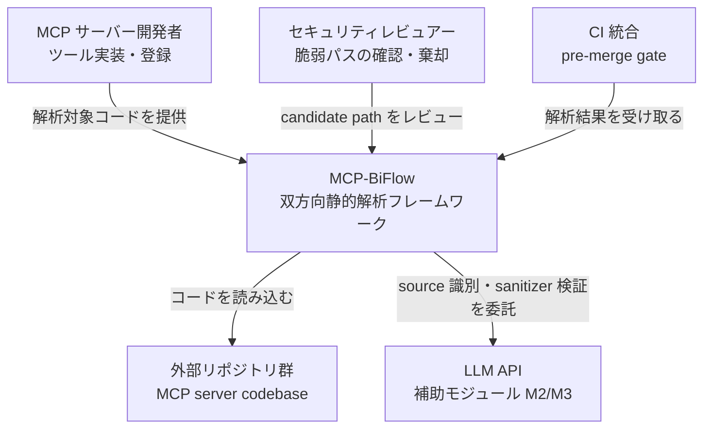
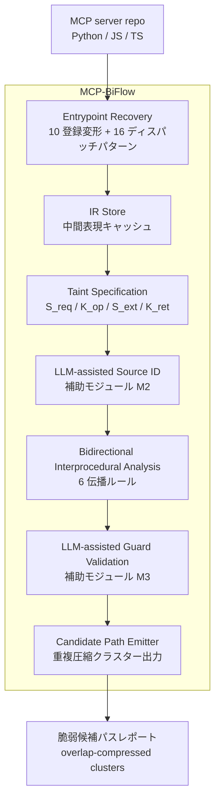
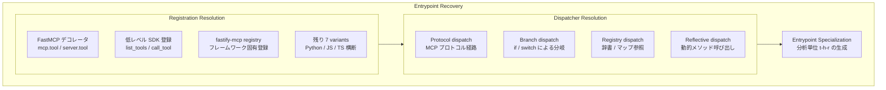
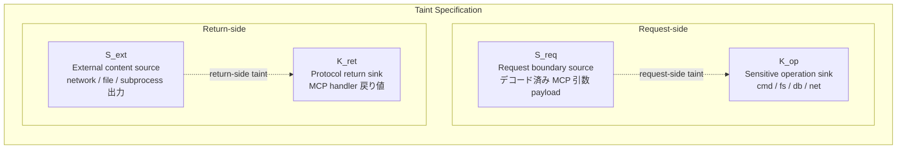
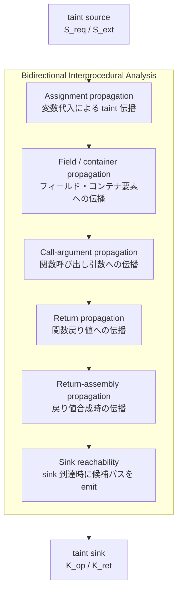
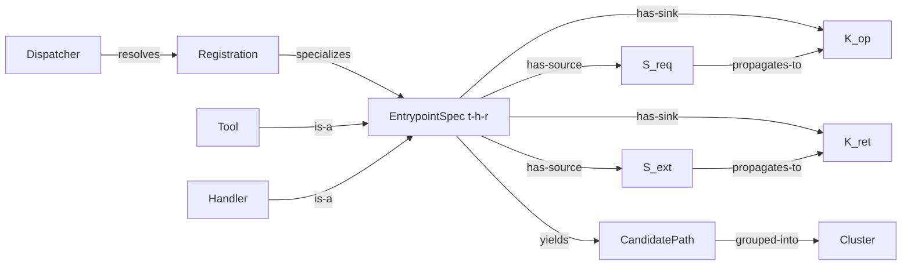

論文「Unsafe by Flow: Uncovering Bidirectional Data-Flow Risks in MCP Ecosystem」(Hou / Zhao / Wang. arXiv:2605.07836, 2026-05-08) の提案フレームワーク `MCP-BiFlow` を、構造とデータの観点から技術調査としてまとめます。

> 検証日: 2026-05-12
> 対象: arXiv:2605.07836 v1 / Zenodo アーティファクト DOI 10.5281/zenodo.19335837

## 概要

### 背景と問題意識

Model Context Protocol (MCP) は LLM エージェントと外部ツールを繋ぐインタフェース層として急速に普及しました。一方で既存の MCP セキュリティ研究は、ツール名の許可リスト・スキーマ検証・メタデータ審査といった入口側の議論に偏ってきました。

既存の汎用 SAST (静的解析ツール) は MCP の脆弱性を正確に検出できません。理由は 3 つあります。

1. ツール登録/ディスパッチの異種性。FastMCP のデコレータ、低レベル SDK の `list_tools/call_tool`、fastify-mcp の registry 登録など、エントリポイントの到達方法が多様で汎用 SAST が認識できません
2. MCP 固有の taint semantics の必要性。プロトコルが持つ「引数の受け渡し」「結果の返却」という境界を既存ルールでは表現できません
3. ツールスコープ単位でのみバグが顕在化する性質。全体のコールグラフではなく、個々のツールハンドラを分析単位にしないと見落とします

### 本論文の貢献

本論文は **MCP 固有のデータフロー脆弱性が双方向に発生する** ことを初めて体系的に定式化しました。脆弱性は 2 方向で現れます。

- **Request-side propagation**: requester (LLM / ホスト) が渡した引数が、サーバー側の命令実行・ファイル操作・DB クエリ・ネットワーク要求に到達する経路
- **Return-side propagation**: 外部から取得したコンテンツやサーバー内部の機微データが、MCP の出力境界を越えてホスト/モデルに戻り、その挙動を歪める経路

この定式化に基づいて構築した静的解析フレームワーク **MCP-BiFlow** は、32 件の confirmed 脆弱性ベンチで **30/32 (93.8% recall)** を達成しました。CodeQL (1/32)、Semgrep (8/32)、Snyk Code (10/32)、MCPScan (11/32) をいずれも大幅に上回ります。実世界スキャンでは 15,452 リポジトリを対象に 549 クラスタを出し、手動レビューで **87 サーバーに 118 の脆弱パス**を確認しました。

### MCP セキュリティ研究における位置づけ

本論文は、静的解析の俎上で MCP プロトコルの双方向データフローを正面から扱った最初の体系的研究として位置づけられます。ランタイム防御 (MCP-Guard) や仕様強化 (OAuth 2.1 / RFC 8707) と相補的に積み上がる構図にあります。

## 特徴

### 他の MCP セキュリティ研究との比較

| 観点 | Hou et al. (arXiv:2503.23278) | Huang et al. (arXiv:2603.22489) | MCP-Guard (arXiv:2508.10991) | Unsafe by Flow (本論文) |
|---|---|---|---|---|
| 主な対象 | ライフサイクル全体の脅威分類 | tool-description poisoning / クライアント検証 | ランタイム防御フレームワーク | MCP handler のデータフロー |
| 分析手法 | 脅威モデリング (4 主体 / 16 活動) | 実装調査 + 攻撃実験 (7 クライアント) | 防御アーキテクチャ提案 | 双方向静的 taint 解析 |
| 扱うフロー | 網羅的 (分類が目的) | requester → model の入力経路 | 出力 sanitization | request-side + return-side の両方 |
| 主な成果物 | 脅威分類体系 | client 検証欠陥の実証 | 防御フレームワーク | 検出ツール + 87 サーバーの脆弱性開示 |

### 検出ツールとしての比較

| Tool | 検出方式 | Recall (32 件ベンチ) | 対応する flow |
|---|---|---|---|
| CodeQL | 汎用 SAST (クエリベース) | 1/32 (3.1%) | request-side のみ |
| Semgrep | 汎用 SAST (パターンマッチ) | 8/32 (25.0%) | request-side のみ |
| Snyk Code | AI 支援 SAST | 10/32 (31.3%) | request-side のみ |
| MCPScan | MCP 専用ルールベース | 11/32 (34.4%) | request-side 中心 |
| MCP-BiFlow | MCP-aware 双方向 taint 解析 | 30/32 (93.8%) | request-side + return-side |

汎用 SAST 3 ツールが低 recall に留まる主因は、MCP の dispatch パターンを理解できず entrypoint を見つけられない点にあります。MCP 専用の MCPScan でも約 1/3 にとどまり、return-side propagation を扱えないことが性能差の主因と推測されます。

### MCP-BiFlow の主要な特徴

本フレームワークは 3 コンポーネントで構成されます。

1. MCP Entrypoint Recovery — Registration Resolution (10 variants) + Dispatcher Resolution (16 patterns) + Entrypoint Specialization `⟨t, h, r⟩`
2. MCP-Specific Taint Specification — `S_req / K_op / S_ext / K_ret` の 4 オブジェクト
3. Bidirectional Interprocedural Analysis — 6 つの伝播ルール

### LLM の役割

本フレームワークは LLM を「攻撃シミュレーション」ではなく「解析補助」として使用する点が特徴的です。

- **M2**: LLM-assisted source identification — `S_ext` の確定を補助 (削除でカバレッジ 23.6% 低下)
- **M3**: LLM-assisted guard/sanitizer validation — triage 品質を向上 (カバレッジには影響しない)

LLM 補助はあくまで補助的役割であり、コア解析の決定論性を損なわない設計です。

### 評価の両建て構成

| 評価軸 | 内容 | 結果 |
|---|---|---|
| ベンチマーク精度 | 32 件 confirmed 脆弱性でのツール間比較 | 30/32 (93.8%) |
| 実世界スキャン | 15,452 リポジトリへの適用 | 87 サーバー / 118 脆弱パス確認 |
| アブレーション | M1/M2/M3 の個別貢献測定 | M1 が最大寄与 (削除で 67.7% 低下) |

## 構造

提案フレームワーク `MCP-BiFlow` の内部アーキテクチャを C4 model の 3 段階で図解します。

### システムコンテキスト図

MCP-BiFlow が誰のために何をするかを示す最上位の俯瞰図です。



| 要素 | 説明 |
|---|---|
| MCP サーバー開発者 | ツールを実装・登録する一次開発者 |
| セキュリティレビュアー | candidate path を手動で確認・棄却する人間 |
| CI 統合 | pre-merge gate として解析結果を受け取る自動化パイプライン |
| MCP-BiFlow | 本フレームワーク。MCP-aware な静的解析を双方向 taint で実行 |
| 外部リポジトリ群 | 解析対象となる MCP サーバーのコードベース群 |
| LLM API | source 識別 (M2) と sanitizer/guard 検証 (M3) を補助する外部 LLM |

### コンテナ図

MCP-BiFlow を構成する主要コンテナとその相互接続です。



| コンテナ | 説明 |
|---|---|
| Entrypoint Recovery | ツール登録とディスパッチの異種パターンを解消し、分析単位を生成 |
| Taint Specification | MCP プロトコル固有の source と sink を 4 クラスで定義 |
| Bidirectional Interprocedural Analysis | 6 伝播ルールで双方向に taint を追跡し、パスを完全再構成 |
| IR Store | 中間表現を保持する解析フェーズ間のキャッシュ層 |
| LLM-assisted Source ID (M2) | LLM が曖昧な source を識別する補助モジュール |
| LLM-assisted Guard Validation (M3) | LLM が guard/sanitizer の有効性を検証する補助モジュール |
| Candidate Path Emitter | sink 到達パスを overlap 圧縮したクラスター形式で出力 |

### コンポーネント図

3 つの主要コンテナの内部コンポーネントを詳細に示します。

#### Entrypoint Recovery の内部



| コンポーネント | 説明 |
|---|---|
| FastMCP デコレータ | `@mcp.tool` / `@server.tool` などのデコレータによる高レベル登録 |
| 低レベル SDK 登録 | `list_tools` / `call_tool` ハンドラを直接実装する低レベルパターン |
| fastify-mcp registry | fastify-mcp の registry など、フレームワーク固有の登録 |
| 残り 7 variants | Python / JavaScript / TypeScript にまたがるその他の登録パターン |
| Protocol dispatch | MCP プロトコルの標準経路によりハンドラを呼び出すパターン |
| Branch dispatch | `if` 文や `switch` でツール名を分岐させるパターン |
| Registry dispatch | 辞書やマップでツール名からハンドラを引くパターン |
| Reflective dispatch | 動的メソッド解決でハンドラを到達するパターン (静的解析の限界) |
| Entrypoint Specialization | 3 要素タプル `⟨t, h, r⟩` を生成しツールスコープの分析単位とする |

#### Taint Specification の内部



| コンポーネント | taint 方向 | 説明 |
|---|---|---|
| S_req | request-side source | デコードされた MCP 引数 payload。requester が注入できる taint 起点 |
| K_op | request-side sink | コマンド実行 / ファイルアクセス / DB クエリ / ネットワーク要求の 4 カテゴリ |
| S_ext | return-side source | 外部 API レスポンス、ファイル内容、サブプロセス出力など信頼境界外のデータ |
| K_ret | return-side sink | MCP handler の戻り値。サーバー境界を越えてホスト/モデルに届く |

#### Bidirectional Interprocedural Analysis の内部



| コンポーネント | 説明 |
|---|---|
| Assignment propagation | `x = tainted_val` のような代入で taint が変数に移る規則 |
| Field / container propagation | オブジェクトフィールドやリスト・辞書要素への taint 伝播規則 |
| Call-argument propagation | 関数呼び出し時に引数として taint が伝わる規則 |
| Return propagation | 関数から値が戻る際に taint が呼び出し元に伝わる規則 |
| Return-assembly propagation | 複数要素から戻り値を合成する際の taint 合成規則 |
| Sink reachability | taint が K_op または K_ret に到達した時点で候補パスとして送出する終端規則 |

## データ

### 概念モデル

エンティティ名と所有・利用関係のみを示します。



| エンティティ | 説明 |
|---|---|
| Registration | ツールが MCP サーバーに登録された証跡 (10 variants を識別) |
| Dispatcher | ツール呼び出しをハンドラへ転送する機構 (16 patterns を識別) |
| Tool | MCP プロトコル上の tool オブジェクト |
| Handler | tool 呼び出しを処理する関数/メソッド |
| EntrypointSpec | Entrypoint Specialization が生成する分析単位 `⟨t, h, r⟩` |
| S_req | Request boundary source。双方向 taint の request-side 起点 |
| K_op | Sensitive operation sink (command / fs / db / net) |
| S_ext | External content source (net / file / subprocess) |
| K_ret | Protocol return sink (MCP 境界を越える戻り値) |
| CandidatePath | taint が sink に到達した時点で生成される候補パス |
| Cluster | overlap-compressed された CandidatePath の集合 |

### 情報モデル

属性の型は言語非依存表記 (string, list, map, bool, int) を使用します。論文に ER 図はないため、本文記述から推測した属性には「※論文記述から推測」と注記します。

```mermaid
classDiagram
    class Tool {
        name : string
        description : string
        inputSchema : map
    }

    class Handler {
        functionName : string
        filePath : string
        language : string
    }

    class Registration {
        variant : string
        patternId : string
        evidence : string
    }

    class EntrypointSpec {
        toolRef : string
        handlerRef : string
        registrationRef : string
    }

    class Dispatcher {
        patternType : string
        patternId : string
        dispatchStyle : string
    }

    class S_req {
        argName : string
        decodedPayload : string
        sourceLocation : string
    }

    class K_op {
        operationType : string
        apiCall : string
        sinkLocation : string
    }

    class S_ext {
        sourceType : string
        fetchOrigin : string
        sourceLocation : string
    }

    class K_ret {
        returnType : string
        returnLocation : string
        crossesBoundary : bool
    }

    class CandidatePath {
        pathId : string
        direction : string
        sourceRef : string
        sinkRef : string
        propagationRules : list
        entrypointRef : string
    }

    class Cluster {
        clusterId : string
        serverCount : int
        pathCount : int
        overlapCompressed : bool
        confirmedVulnerable : bool
    }

    Tool "1" --> "1" EntrypointSpec : t
    Handler "1" --> "1" EntrypointSpec : h
    Registration "1" --> "1" EntrypointSpec : r
    Dispatcher "many" --> "many" Registration : resolves
    EntrypointSpec "1" --> "many" CandidatePath : yields
    CandidatePath "many" --> "1" Cluster : grouped-into
    EntrypointSpec "1" --> "many" S_req : has-source
    EntrypointSpec "1" --> "many" K_op : has-sink
    EntrypointSpec "1" --> "many" S_ext : has-source
    EntrypointSpec "1" --> "many" K_ret : has-sink
```



#### 属性補足

| エンティティ | 属性 | 値の例・補足 |
|---|---|---|
| Tool | name | `"run_command"` など MCP スキーマで公開する名前 |
| Tool | inputSchema | JSON Schema 相当の引数定義 ※論文記述から推測 |
| Handler | language | `"Python"` / `"TypeScript"` / `"JavaScript"` |
| Registration | variant | 10 variants のうちの 1 つ ※論文記述から推測 |
| Dispatcher | patternType | `"protocol"` / `"branch"` / `"registry"` / `"reflective"` |
| Dispatcher | dispatchStyle | 16 patterns のラベル ※論文記述から推測 |
| S_req | sourceType | `"decoded_mcp_argument"` 固定 |
| K_op | operationType | `"command_execution"` / `"filesystem"` / `"database"` / `"network"` |
| S_ext | sourceType | `"network_response"` / `"file_content"` / `"subprocess_output"` |
| K_ret | crossesBoundary | MCP サーバー境界を越える場合 `true` |
| CandidatePath | direction | `"request_side"` (S_req→K_op) / `"return_side"` (S_ext→K_ret) |
| CandidatePath | propagationRules | 適用した 6 規則のリスト ※論文記述から推測 |
| Cluster | overlapCompressed | 複数サーバーで重複した候補を圧縮済みの場合 `true` |
| Cluster | confirmedVulnerable | 手動レビューで脆弱性を確認した場合 `true` ※論文記述から推測 |

## 構築方法

本論文は手法論文であり、ツールとして完全に実装・公開されているものではありません。Zenodo アーティファクト (DOI: 10.5281/zenodo.19335837) に評価用スクリプト・データセットが含まれますが、汎用 CLI ツールとしては整備されていません。以下のコード例は「論文の意図を反映した実装案」として示します。

### 前提条件

MCP-BiFlow を自分の環境で再現・拡張するには以下が必要です。

- Python 3.10 以上 (型注釈と match 文を活用するため)
- 静的解析 IR ライブラリ: `libcst` (CST ベースの解析) または `ast` 標準モジュール。call グラフ構築には `pycg` などが候補
- LLM API キー: M2 / M3 の補助ステップで OpenAI / Anthropic の API を使用
- Zenodo アーティファクト (DOI: 10.5281/zenodo.19335837): 評価スクリプト・ベンチマーク 32 件・taint 仕様 JSON が含まれる想定

### アーティファクトの入手とセットアップ

Zenodo からアーティファクトをダウンロードし、展開します。

```bash
curl -L "https://zenodo.org/doi/10.5281/zenodo.19335837" -o mcpbiflow_artifact.zip
unzip mcpbiflow_artifact.zip -d mcpbiflow/
cd mcpbiflow/

pip install -r requirements.txt
```

アーティファクトには以下が含まれると想定されます。

- `benchmark/` — 32 件の ground-truth 脆弱性ケース (Python / JS / TS)
- `taint_spec/` — S_req / K_op / S_ext / K_ret の仕様定義ファイル
- `scripts/` — entrypoint recovery・taint propagation の評価スクリプト
- `results/` — 論文中の数値を再現するためのログ

### 実装案: Registration Resolution

論文は Python MCP サーバーで 10 種類の登録パターンを識別します。FastMCP デコレータ方式と低レベル SDK 方式が代表例です。

```python
# 実装案 / 例 — Registration Resolution
import ast

REGISTRATION_PATTERNS = [
    "mcp.tool",          # FastMCP: @mcp.tool()
    "server.list_tools", # 低レベル SDK
    "server.call_tool",  # 低レベル SDK
    "app.tool",          # 他フレームワーク系
    "add_tool",          # registry.add_tool(name, handler)
]

def find_registrations(source_code: str) -> list[dict]:
    tree = ast.parse(source_code)
    found = []
    for node in ast.walk(tree):
        if isinstance(node, ast.FunctionDef):
            for decorator in node.decorator_list:
                dec_str = ast.unparse(decorator)
                if any(p in dec_str for p in REGISTRATION_PATTERNS):
                    found.append({
                        "handler": node.name,
                        "decorator": dec_str,
                        "lineno": node.lineno,
                    })
    return found
```

### 実装案: Taint Sink の検出

K_op (sensitive operation sink) は呼び出しを AST でマッチングして検出します。

```python
# 実装案 / 例 — K_op sink パターンの検出
K_OP_PATTERNS = {
    "command_exec": ["subprocess.run", "subprocess.Popen", "os.system", "eval", "exec"],
    "filesystem":   ["open", "os.remove", "shutil.rmtree", "pathlib.Path.write_text"],
    "database":     ["cursor.execute", "session.execute", "db.query"],
    "network":      ["requests.get", "requests.post", "httpx.get"],
}

def find_sinks(tree: ast.AST) -> list[dict]:
    sinks = []
    for node in ast.walk(tree):
        if isinstance(node, ast.Call):
            call_str = ast.unparse(node)
            for category, patterns in K_OP_PATTERNS.items():
                if any(p in call_str for p in patterns):
                    sinks.append({"category": category, "call": call_str, "lineno": node.lineno})
    return sinks
```

## 利用方法

### Step 1 — Registration / Dispatcher 解析

対象リポジトリを clone し、ハンドラ登録方法を特定します。

```bash
git clone https://github.com/<org>/<mcp-server-repo> target/
cd target/

grep -rn "@mcp.tool\|@server.list_tools\|@server.call_tool\|add_tool" . \
  --include="*.py" | head -40
```

確認ポイントは以下です。

- デコレータ登録 (`@mcp.tool()`) か、低レベル SDK 登録か、動的 registry 登録か
- 1 サーバー内で複数の登録方式が混在していないか
- `if tool_name == "xxx":` のような branch dispatch が `call_tool` 内にあるか

### Step 2 — Taint Spec の適用

論文の 4 オブジェクトを各ハンドラにマッピングします。

| オブジェクト | 確認箇所 |
|---|---|
| `S_req` | 各ハンドラ関数の引数 (MCP から渡される値) |
| `K_op` | subprocess / os / ファイル操作 / DB / HTTP の呼び出し |
| `S_ext` | requests.get / httpx / ファイル読み込み / subprocess.stdout |
| `K_ret` | ハンドラの `return` 文・FastMCP の戻り値 |

```python
# 実装案 / 例 — FastMCP での S_req → K_op フロー
from mcp.server.fastmcp import FastMCP
import subprocess

mcp = FastMCP("example-server")

@mcp.tool()
async def run_command(cmd: str, working_dir: str) -> str:
    # cmd, working_dir が S_req (taint source)
    # subprocess.run が K_op (sensitive sink) → request-side 脆弱性
    result = subprocess.run(cmd, cwd=working_dir, shell=True, capture_output=True)
    # result.stdout が S_ext / return がそのまま K_ret → return-side 漏洩
    return result.stdout.decode()
```

```python
# 実装案 / 例 — 低レベル SDK での K_ret (return-side taint sink)
from mcp.server import Server
import mcp.types as types
import httpx

server = Server("example-low-level")

@server.call_tool()
async def handle_call_tool(name: str, arguments: dict):
    if name == "fetch_url":
        resp = httpx.get(arguments["url"])              # S_ext
        return [types.TextContent(type="text", text=resp.text)]  # K_ret
```

### Step 3 — Bidirectional Propagation の実行

6 つの伝播ルールに従い、`S_req → K_op` (request-side) および `S_ext → K_ret` (return-side) の経路をトレースします。

```python
# 実装案 / 例 — 単純な代入伝播 (Assignment propagation) のトレース
def trace_propagation(handler_source: str, taint_vars: set[str]) -> set[str]:
    tree = ast.parse(handler_source)
    propagated = set(taint_vars)
    for node in ast.walk(tree):
        if isinstance(node, ast.Assign):
            rhs = ast.unparse(node.value)
            if any(v in rhs for v in propagated):
                for target in node.targets:
                    propagated.add(ast.unparse(target))
    return propagated
```

論文では 6 ルールを interprocedural に適用し、関数呼び出しをまたいだ taint 追跡を実施します。

### Step 4 — Candidate Cluster の手動 Triage

解析で得た候補パスを以下の観点で手動レビューします。

- Guard / Sanitizer の有無: `shlex.quote` / `html.escape` / パラメータ化クエリ / 型制約チェックが taint フロー上に存在するか
- Exploitability の確認: 静的解析は「到達可能か」しか判断しないため、実際にリクエストから制御できるかを確認
- LLM 補助 (M3): 曖昧な guard は LLM に判定させて FP を削減

### 自社 MCP サーバーレビューチェックリストとしての転用

MCP-BiFlow のフレームワークは、そのままコードレビューチェックリストとして利用できます。

#### Request-side チェック (S_req → K_op)

- [ ] ハンドラ引数のうち `subprocess` / `os.system` / `eval` / `exec` に渡る変数はないか
- [ ] ファイルパス操作 (`open` / `pathlib`) にユーザー引数がそのまま渡っていないか
- [ ] SQL / NoSQL クエリ組み立てに文字列連結が使われていないか
- [ ] HTTP リクエスト先 URL にユーザー引数が含まれていないか (SSRF リスク)

#### Return-side チェック (S_ext → K_ret)

- [ ] 外部 API レスポンスをサニタイズせずに `tool_result` に含めていないか
- [ ] ファイル読み込み内容・subprocess stdout をそのまま返していないか
- [ ] サーバー内部の認証トークン・パス・設定値が戻り値に漏れていないか

#### 登録 / ディスパッチの整合性チェック

- [ ] 1 サーバー内で登録方式が混在していないか
- [ ] `call_tool` 内の tool 名マッチングに未定義ツールへの fallthrough がないか
- [ ] 動的ディスパッチを使っている場合、入力バリデーションが十分か

## 運用

### CI での差分スキャン (PR 単位)

- スキャン対象の絞り込み。`git diff origin/main --name-only` で変更ファイルを列挙し、MCP ハンドラを含むモジュールだけを対象に絞る
- ブロック条件の分離。request-side の high-severity パスはマージブロック、return-side は警告扱いで triage
- アーティファクト保存。解析出力を CI アーティファクトに保存し、M3 の結果はモデル名と seed を必ずログ記録

### Nightly 全リポジトリスキャン

- 組織内の全 MCP サーバーリポジトリを対象とし、外部依存も含める
- overlap-compressed cluster を活用し、同型バグを cluster 単位で圧縮して出力
- 依存パッケージのアップデートで新たな entrypoint が増えうるため、週次では見逃しが発生する

### 出力の Triage フロー

```text
MCP-BiFlow 出力 (候補パス JSON)
    │
    ├─ [自動 cluster 分類] request-side / return-side、sink 種別でグループ化
    ├─ [M3 LLM-assisted sanitizer 検証] ガード存在パスは mitigated に移動
    ├─ [manual review キュー] cluster 代表 1 件を人手確認 → exploitability 検証
    └─ [アクション分岐] confirmed → 開示 / パッチ、FP → 除外、要追試 → 動的検証
```

cluster 代表だけを人手レビューすることで、549 cluster を 87 サーバーまで絞った論文の手順を再現できます。

## ベストプラクティス

反証エビデンス R1-R6 を「誤解 → 反証 → 推奨」の構造で統合します。

### R1: 静的パスは exploit 可能性を保証しない

- 誤解: candidate vulnerable path が出た = 即座に悪用可能
- 反証: AgentSeal の Runtime Exploitation 報告では、静的候補のうちランタイムで再現できたのは一部のみ
- 推奨: static analysis → ランタイム PoC 試行 → confirmed の 3 段階を triage フローに組み込む

### R2: TS/JS の reflective dispatch は対象外

- 誤解: TS/JS で書けばエントリポイントが隠蔽され、スキャナを回避できる
- 反証: reflective dispatch / runtime-generated handlers は論文が明示的に limitation とし、静的解析では扱えない
- 推奨: 同一サーバー内でデコレータ登録・registry・dynamic dispatch を混在させない。dispatch ファイルを独立モジュールに切り出し、レビューの焦点を明確化

### R3: 87 サーバーは overlap-compressed の結果

- 誤解: 15,452 中 87 サーバーは 0.56% に過ぎず、リスクは局所的
- 反証: 549 cluster は同型バグを圧縮した後の数。複数の独立サーバーで再現する pattern が systemic な設計上の落とし穴を示す
- 推奨: 自組織が外部 OSS のコードパターンを参考にしている場合、同じクラスターに属する可能性。優先度を上げて対処

### R4: MCP ルールを書けば差は縮まる?

- 誤解: CodeQL に MCP 専用ルールを追加すれば MCP-BiFlow と同等になる
- 反証: 既存 SAST の主因は「MCP の dispatch を entrypoint として認識できない」。登録パターンの多様性に対応するルールセット維持コストが高い
- 推奨: アーティファクトを試用し、自組織の tech stack でどの登録パターンが使われているかを確認。MCP-BiFlow の entrypoint recovery ロジックを参考にカスタムルールの優先項目を絞る

### R5: LLM 補助の再現性

- 誤解: LLM が source を識別するので、同じコードでも結果が毎回変わる
- 反証: M2 削除でカバレッジ 23.6% 低下するが、コア解析 (M1) は決定論的
- 推奨: M2/M3 を使用する場合は、モデル名・プロンプトバージョン・temperature=0 を CI ログに記録。Zenodo アーティファクトのプロンプト設定を基準にする

### R6: 外部追試がまだない

- 誤解: 外部検証がないので結果を信頼できない
- 反証: 2026-05-08 公開直後で時期的に当然。Zenodo アーティファクトはすでに公開
- 推奨: 自組織での試行結果 (FP 率・検出数・実行時間) をフィードバックし、外部検証データの蓄積に貢献

## トラブルシューティング

| 症状 | 原因 | 対処 |
|---|---|---|
| handler が検出されず candidate path が 0 件 | Registration Resolution が登録パターンを識別できていない。FastMCP / 低レベル SDK / fastify-mcp など非標準の登録方式を使っている | アーティファクトの `registration_variants` リストと自組織の登録コードを照合する。一致しない場合はカスタム登録パターンを追記して再解析 |
| TypeScript サーバーで entrypoint は出るが taint が伝播しない | TS/JS の reflective dispatch や動的ハンドラ生成を使っており、静的解析でハンドラ本体に到達できない | 同一サーバー内の dispatch 方式を 1 種に統一する。reflective 部分だけ手動コードレビューに切り替える |
| M2 LLM-assisted source 識別の結果が実行ごとに変わる | temperature > 0 またはモデルバージョンが固定されていない | temperature=0・モデル名・プロンプトバージョンを CI 設定に明示する |
| M3 sanitizer 検証で mitigated と判定されたパスが実際には脆弱 | LLM がコードのガード条件を誤認した | M3 の結果を最終判定にしない。mitigated パスもサンプリングして人手確認 |
| 同一バグが candidate cluster に重複して現れる | overlap-compression が効いておらず、同型バグが個別パスとして列挙されている | cluster 識別ロジック (ファイルパス・sink 種別・taint root の一致) を確認 |
| 静的パスは存在するがランタイムで再現できない (FP) | 実行時に到達不能なコードパス、または入力バリデーションが実際には機能している | AgentSeal 方式のランタイム検証を triage の後工程に組み込む。FP は除外ルールに追記 |
| nightly スキャンの実行時間が長すぎる | 全リポジトリに対して M2/M3 の LLM 呼び出しを毎回実行している | M1 だけで nightly を走らせ、M2/M3 は candidate cluster の代表件数だけに絞る |
| responsible disclosure 先が不明 | 87 サーバーのうち組織・メンテナー連絡先が記載されていない | GitHub の SECURITY.md・npm/PyPI 連絡先を順に確認。CNA 経由でコーディネート |

## まとめ

`Unsafe by Flow` は MCP サーバーのセキュリティを「危ないツール」のリストアップから、双方向データフローの静的解析へと引き上げた最初の体系的研究です。`MCP-BiFlow` の 3 コンポーネント (Entrypoint Recovery / Taint Specification / Bidirectional Analysis) と 4 オブジェクト (`S_req / K_op / S_ext / K_ret`) は、そのまま自社 MCP サーバーのコードレビュー観点として転用できます。

この記事が少しでも参考になった、あるいは改善点などがあれば、ぜひリアクションやコメント、SNS でのシェアをいただけると励みになります!

## 参考リンク

- 一次論文
  - [Unsafe by Flow (arXiv:2605.07836)](https://arxiv.org/abs/2605.07836)
  - [Zenodo アーティファクト (DOI:10.5281/zenodo.19335837)](https://doi.org/10.5281/zenodo.19335837)
- 関連学術論文
  - [Hou et al. — MCP ライフサイクル/脅威分類 (arXiv:2503.23278)](https://arxiv.org/abs/2503.23278)
  - [Huang et al. — tool-description poisoning (arXiv:2603.22489)](https://arxiv.org/abs/2603.22489)
  - [Radosevich & Halloran — MCPSafetyScanner (arXiv:2504.03767)](https://arxiv.org/abs/2504.03767)
  - [MCP-Guard — 防御フレームワーク (arXiv:2508.10991)](https://arxiv.org/abs/2508.10991)
  - [MCPSecBench — 包括ベンチ (arXiv:2508.13220)](https://arxiv.org/abs/2508.13220)
  - [MCPTox — tool poisoning ベンチ (arXiv:2508.14925)](https://arxiv.org/abs/2508.14925)
  - [InjecAgent — IPI ベンチ (arXiv:2403.02691)](https://arxiv.org/abs/2403.02691)
- 反証・実害事例
  - [AgentSeal — Runtime Exploitation of MCP Servers](https://agentseal.org/blog/runtime-exploitation-mcp-servers)
- 公式
  - [MCPScan (antgroup)](https://github.com/antgroup/MCPScan)
  - [MCP 公式仕様 (2025-11-25)](https://modelcontextprotocol.io/specification/2025-11-25)
  - [MCP Python SDK](https://github.com/modelcontextprotocol/python-sdk)
  - [MCP Python SDK Tool System (DeepWiki)](https://deepwiki.com/modelcontextprotocol/python-sdk/2.2-tool-system)
  - [FastMCP 公式ドキュメント (Tools)](https://gofastmcp.com/servers/tools)
  - [MCP アーキテクチャ概要](https://modelcontextprotocol.io/docs/learn/architecture)
  - [Anthropic — MCP 紹介](https://www.anthropic.com/news/model-context-protocol)
