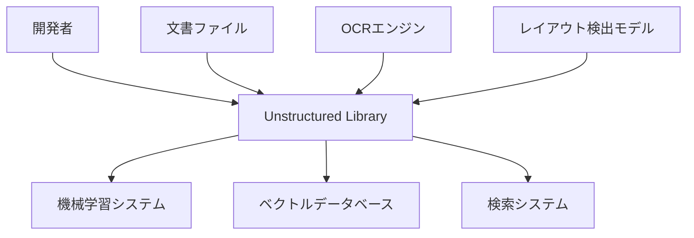
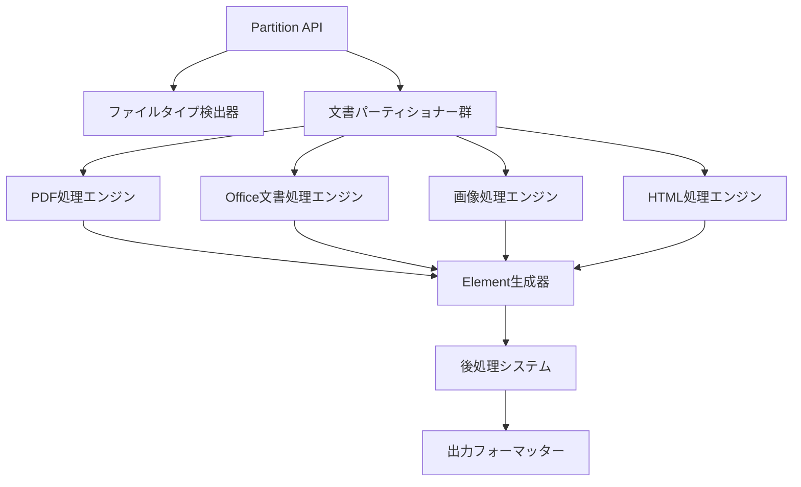
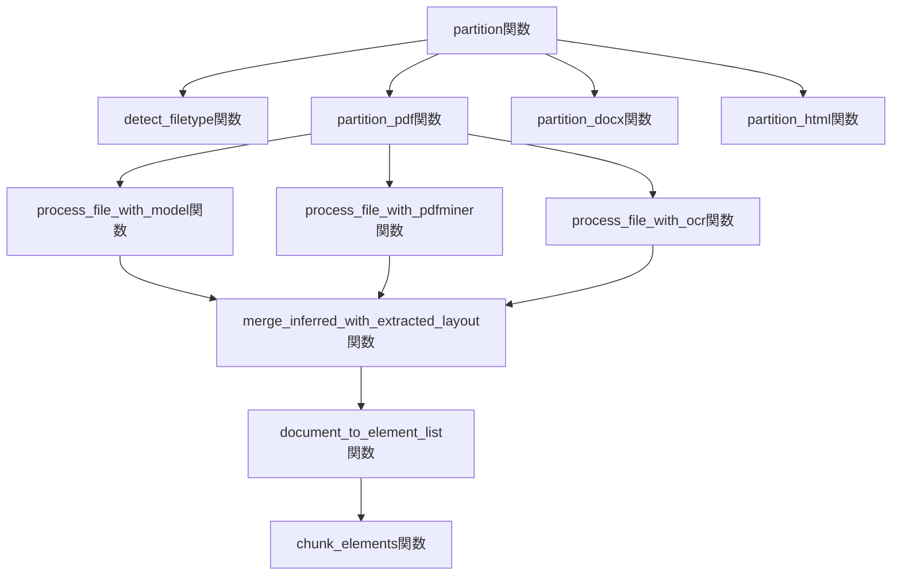
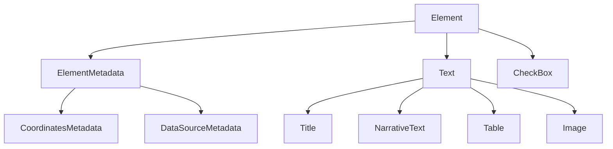
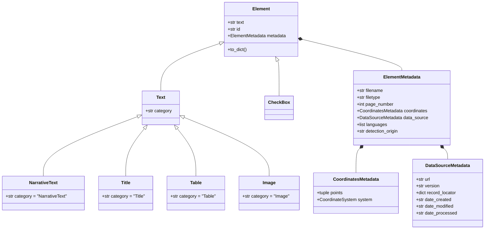

## ■概要

Unstructuredライブラリは、多様な非構造化文書を構造化データへ変換するオープンソースのツールキットです。

対応する文書形式には、PDF、Word文書、画像、HTML、メールなどが含まれます。文書が持つ意味やレイアウトを維持したままコンテンツを抽出します。そのため、抽出データは大規模言語モデル（LLM）や自然言語処理（NLP）アプリケーションへの供給に適しています。

https://github.com/Unstructured-IO/unstructured

### ●主な特徴

* **多様な文書形式に対応**: 統一されたインターフェースで様々なファイルを扱えます。
* **インテリジェントな処理**: ファイルタイプを自動検出し、最適なパーサーへルーティングします。
* **柔軟な処理戦略**: 速度重視の`FAST`から、高精度な`HI_RES`まで、要件に応じた戦略を選択可能です。
* **構造化された出力**: 全ての抽出データは、標準化された`Element`という階層構造で出力されます。
* **LLM連携**: 下流のLLMアプリケーションで扱いやすいように、インテリジェントなチャンキング機能を提供します。
* **モジュール式依存関係**: 必要な機能だけを選択してインストールでき、環境を軽量に保てます。

## ■システム構成

### ●システムコンテキスト図



| 要素名 | 説明 |
| :--- | :--- |
| 開発者 | ライブラリを使用してアプリケーションを構築するユーザー |
| Unstructured Library | 文書処理を行うメインシステム |
| 文書ファイル | 処理対象の非構造化文書 |
| 機械学習システム | 抽出データを利用する下流システム |
| ベクトルデータベース | 構造化データを格納するシステム |
| 検索システム | 処理済みデータを検索するシステム |
| OCRエンジン | 光学文字認識を提供する外部システム |
| レイアウト検出モデル | 文書レイアウトを分析する外部システム |

### ●コンテナ図



| 要素名 | 説明 |
| :--- | :--- |
| Partition API | 統一されたエントリーポイント |
| ファイルタイプ検出器 | 文書形式を自動で判定する機能 |
| 文書パーティショナー群 | 形式別の専用処理器群 |
| PDF処理エンジン | PDF文書専用の処理機能 |
| Office文書処理エンジン | Word、Excel、PowerPointの処理機能 |
| 画像処理エンジン | 画像ファイルの処理機能 |
| HTML処理エンジン | Web文書の処理機能 |
| Element生成器 | 標準化されたElement構造を生成 |
| 後処理システム | チャンキングなどの後処理機能 |
| 出力フォーマッター | JSON、CSVなどへの出力形式変換 |

### ●コンポーネント図



| 要素名 | 説明 |
| :--- | :--- |
| partition関数 | メインエントリーポイント関数 |
| detect_filetype関数 | ファイル形式の検出機能 |
| partition_pdf関数 | PDF専用のパーティション処理 |
| partition_docx関数 | Word文書専用のパーティション処理 |
| partition_html関数 | HTML専用のパーティション処理 |
| process_file_with_model関数 | レイアウト検出モデルによる処理 |
| process_file_with_pdfminer関数 | PDFMinerによるテキスト抽出 |
| process_file_with_ocr関数 | OCRによる文字認識処理 |
| merge_inferred_with_extracted_layout関数 | レイアウト情報の統合処理 |
| document_to_element_list関数 | Element構造への変換処理 |
| chunk_elements関数 | チャンキング処理機能 |

## ■データ

### ●概念モデル



### ●情報モデル



## ■構築

### ●インストール

-   **基本インストール**
    ```bash
    pip install unstructured
    ```

-   **特定文書形式への対応**
    ```bash
    pip install "unstructured[pdf,docx,pptx]"
    ```

-   **全機能インストール**
    ```bash
    pip install "unstructured[all-docs]"
    ```

### ●依存関係

* **PDF処理**: `pdfminer`, `unstructured-inference`
* **画像処理**: `pytesseract`, `PIL`
* **Office文書処理**: `python-docx`, `python-pptx`

## ■利用

### ●文書処理

```python
from unstructured.partition.auto import partition

elements = partition(filename="document.pdf")
```

### ●処理戦略の指定

```python
from unstructured.partition.pdf import partition_pdf
from unstructured.partition.strategies import PartitionStrategy

elements = partition_pdf(
    filename="document.pdf",
    strategy=PartitionStrategy.HI_RES
)
```

### ●チャンキング処理

```python
elements = partition(
    filename="document.pdf",
    chunking_strategy="by_title"
)
```

```python
from unstructured.chunking.title import chunk_by_title

elements = partition(filename="document.pdf")
chunks = chunk_by_title(
    elements,
    max_characters=1024, # 1チャンクあたりの最大文字数
    new_after_n_chars=700, # この文字数を超えたら新しいチャンクを開始
)
```

### ●API経由の処理

Unstructuredの有償APIを利用することも出来ます。

```python
from unstructured_client import UnstructuredClient
from unstructured_client.models import shared
from unstructured_client.models.errors import SDKError

client = UnstructuredClient(api_key_auth="YOUR_API_KEY")

with open("document.pdf", "rb") as f:
    files=shared.Files(
        content=f.read(),
        file_name="document.pdf",
    )

req = shared.PartitionParameters(files=files, strategy="hi_res")

try:
    res = client.general.partition(req)
    for element in res.elements:
        print(element)
except SDKError as e:
    print(e)
```

## ■運用

### ●パフォーマンス最適化

#### ▷処理戦略の選択

-   **デジタルネイティブなPDFやテキストベースの文書**: `FAST`戦略で十分な場合が多い。
-   **スキャンされた文書や複雑なレイアウトのPDF**: `HI_RES`戦略が必要。
-   **文書の種類が混在**: `AUTO`戦略に任せるのが基本。

```python
from unstructured.partition.pdf import partition_pdf
from unstructured.partition.strategies import PartitionStrategy

# FAST戦略：速度を重視し、基本的なテキストを抽出
elements_fast = partition_pdf(
    filename="document.pdf",
    strategy=PartitionStrategy.FAST
)

# HI_RES戦略：精度を重視し、レイアウト検出モデルを使用
elements_hi_res = partition_pdf(
    filename="document.pdf",
    strategy=PartitionStrategy.HI_RES
)

# AUTO戦略：文書の特性に応じて戦略を自動で選択
elements_auto = partition_pdf(
    filename="document.pdf",
    strategy=PartitionStrategy.AUTO
)
```

#### ▷並列処理の活用

複数の文書を効率的に処理するために、`multiprocessing`を活用します。

```python
import multiprocessing
from concurrent.futures import ProcessPoolExecutor
from unstructured.partition.auto import partition

def process_document(filename):
    try:
        # 並列処理ではリソース消費の少ないFAST戦略が適している場合がある
        return partition(filename=filename, strategy="fast")
    except Exception as e:
        print(f"Error processing {filename}: {e}")
        return None

# CPUコア数に応じてワーカー数を設定
with ProcessPoolExecutor(max_workers=multiprocessing.cpu_count()) as executor:
    filenames = ["doc1.pdf", "doc2.docx", "doc3.html"]
    results = list(executor.map(process_document, filenames))
```

### ●エラーハンドリング

#### ▷ファイル形式検出の失敗

`detect_filetype`に失敗した場合でも、ファイル拡張子でフォールバックする堅牢な処理を実装します。

```python
from unstructured.partition.auto import partition
from unstructured.partition.pdf import partition_pdf
from unstructured.partition.docx import partition_docx
from unstructured.file_utils.filetype import detect_filetype, FileType

def robust_partition(filepath):
    try:
        # まずは自動検出を試みる
        return partition(filepath)
    except Exception as e:
        print(f"Initial partition failed: {e}. Falling back to extension-based routing.")
        # 拡張子に基づいて手動でパーサーを選択
        try:
            if filepath.endswith('.pdf'):
                return partition_pdf(filepath, strategy="fast")
            elif filepath.endswith('.docx'):
                return partition_docx(filepath)
            else:
                raise ValueError(f"Unsupported file extension for fallback: {filepath}")
        except Exception as fallback_e:
            print(f"Fallback processing failed for {filepath}: {fallback_e}")
            return []
```

#### ▷高精度処理の失敗

`HI_RES`戦略は多くの依存関係やリソースを必要とするため失敗することがあります。その際は、より安定した戦略へ段階的にフォールバックさせます。

```python
def process_with_fallback(filename):
    try:
        print("Attempting HI_RES strategy...")
        return partition_pdf(filename, strategy="hi_res")
    except Exception as hi_res_error:
        print(f"HI_RES failed: {hi_res_error}. Falling back to OCR_ONLY.")
        try:
            return partition_pdf(filename, strategy="ocr_only")
        except Exception as ocr_error:
            print(f"OCR_ONLY failed: {ocr_error}. Falling back to FAST.")
            return partition_pdf(filename, strategy="fast")
```
#### ▷メモリ不足時の処理分割

巨大なファイルを`HI_RES`で処理するとメモリ不足になることがあります。Unstructuredのローカル関数には直接ページを指定する機能はありませんが、`pypdf`などのライブラリでPDFを物理的に分割してから処理することで対応できます。

```python
import pypdf
import tempfile
from pathlib import Path

def process_large_pdf_in_chunks(filename, chunk_size=20):
    reader = pypdf.PdfReader(filename)
    total_pages = len(reader.pages)
    all_elements = []

    for start_page in range(0, total_pages, chunk_size):
        end_page = min(start_page + chunk_size, total_pages)
        writer = pypdf.PdfWriter()
        
        with tempfile.NamedTemporaryFile(suffix=".pdf", delete=False) as tmp:
            chunk_filename = tmp.name
            
        try:
            for i in range(start_page, end_page):
                writer.add_page(reader.pages[i])
            writer.write(chunk_filename)
            
            print(f"Processing pages {start_page + 1}-{end_page}...")
            chunk_elements = partition_pdf(chunk_filename)
            # 元のページ番号をメタデータに反映
            for elem in chunk_elements:
                elem.metadata.page_number += start_page
            all_elements.extend(chunk_elements)
            
        except Exception as e:
            print(f"Error processing pages {start_page + 1}-{end_page}: {e}")
        finally:
            Path(chunk_filename).unlink()
            
    return all_elements
```

### ●品質評価

#### ▷テキスト抽出精度の測定

抽出テキストと正解（Ground Truth）テキストを比較し、精度を定量的に評価します。

```python
import Levenshtein

def evaluate_text_extraction(extracted_text, ground_truth_text):
    distance = Levenshtein.distance(extracted_text, ground_truth_text)
    max_len = max(len(extracted_text), len(ground_truth_text))
    # 1 - 正規化された編集距離 = 類似度
    similarity = 1 - (distance / max_len) if max_len > 0 else 1
    return {"levenshtein_similarity": similarity}

# 使用例
extracted = "This is a extracted text."
ground_truth = "This is an extracted text."
metrics = evaluate_text_extraction(extracted, ground_truth)
print(f"Text Similarity: {metrics['levenshtein_similarity']:.3f}")
```

#### ▷要素分類精度の評価

抽出された要素のカテゴリ（Title, NarrativeTextなど）が正解とどれだけ一致するかを評価します。

```python
from sklearn.metrics import classification_report

def evaluate_element_classification(predicted_elements, ground_truth_elements):
    # 要素のIDやテキストで対応付けをすると仮定
    y_true = [elem.category for elem in ground_truth_elements]
    y_pred = [elem.category for elem in predicted_elements]
    
    # 要素数が違う場合は、アライメント処理が必要だが、ここでは数が同じと仮定
    if len(y_true) != len(y_pred):
        print("Warning: Number of predicted and ground truth elements differ.")
        return None
        
    report = classification_report(y_true, y_pred, zero_division=0)
    return report

# 使用例
# ground_truth_elements = load_ground_truth() # 正解データの読み込み（要実装）
# predicted_elements = partition("document.pdf")
# report = evaluate_element_classification(predicted_elements, ground_truth_elements)
# print(report)
```
#### ▷テーブル領域検出精度の評価（IoU）

検出されたテーブルのバウンディングボックスが、正解の領域とどれだけ重なるかを **IoU (Intersection over Union)** で評価します。IoUは物体検出モデルの評価などで広く使われる指標で、0から1の値をとり、1に近いほど完全に一致していることを示します。

```python
def calculate_iou(boxA, boxB):
    # box = (x1, y1, x2, y2)
    xA = max(boxA[0], boxB[0])
    yA = max(boxA[1], boxB[1])
    xB = min(boxA[2], boxB[2])
    yB = min(boxA[3], boxB[3])

    interArea = max(0, xB - xA) * max(0, yB - yA)
    boxAArea = (boxA[2] - boxA[0]) * (boxA[3] - boxA[1])
    boxBArea = (boxB[2] - boxB[0]) * (boxB[3] - boxB[1])
    
    iou = interArea / float(boxAArea + boxBArea - interArea)
    return iou

# 使用例
# pred_tables = [elem for elem in elements if elem.category == "Table"]
# gt_tables = load_ground_truth_tables() # 正解データの読み込み
# iou_score = calculate_iou(
#     pred_tables[0].metadata.coordinates.points, 
#     gt_tables[0].metadata.coordinates.points
# )
# print(f"Table Detection IoU: {iou_score:.3f}")
```


## ■参考資料

- GitHub
    -   [Unstructured-IO/unstructured](https://github.com/Unstructured-IO/unstructured)
    -   [Installation Guide](https://github.com/Unstructured-IO/unstructured#installation)
    -   [Requirements Documentation](https://github.com/Unstructured-IO/unstructured/tree/main/requirements)
    -   [Partition Functions Documentation](https://github.com/Unstructured-IO/unstructured#usage)
    -   [API Reference](https://github.com/Unstructured-IO/unstructured#api)
    -   [Performance Optimization](https://github.com/Unstructured-IO/unstructured#performance)
- DeepWiki
    -   [deepwiki.com/Unstructured-IO/unstructured](https://deepwiki.com/Unstructured-IO/unstructured)
    -   [Core Partitioning System](https://deepwiki.com/Unstructured-IO/unstructured#2)
    -   [Elements and Data Model](https://deepwiki.com/Unstructured-IO/unstructured#3)
    -   [Metrics and Evaluation](https://deepwiki.com/Unstructured-IO/unstructured#7)


この記事が少しでも参考になった、あるいは改善点などがあれば、ぜひリアクションやコメント、SNSでのシェアをいただけると励みになります！
