## 概要

既存ソフトウェアの改修で「変更漏れ」や「デグレード」に悩まされた経験はないでしょうか。USDM と XDDP は、こうした派生開発特有の課題を体系的に解決する手法です。本記事では、USDM × XDDP の構造・データモデル・構築方法・運用ノウハウを整理し、さらに Coding Agent（AI コード生成）との統合による自動化の可能性を探ります。

### USDM（Universal Specification Describing Manner）

USDM は、清水吉男が提唱した要求仕様記述手法です。「表記法」と「考え方」の両面を持ち、要求から仕様までを階層的に記述します。

要件定義・仕様記述における標準的な記述方式として、ソフトウェア開発全般で利用されています。特に派生開発では、変更要求を正確に記述するための基盤となります。

USDM は以下の4要素で構成されます。

| 要素 | 説明                                             |
| ---- | ------------------------------------------------ |
| 要求 | 実現してほしいことを目的語と動詞で明確に記述     |
| 理由 | 要求が必要な背景・理由を記述し、認識のズレを抑制 |
| 説明 | 要求や理由の補足、具体例、用語定義を記載         |
| 仕様 | 要求の実現方法、動きや制限を記載                 |

上位要求から下位要求へ、下位要求から仕様へと導出される階層的な構造を持ちます。複雑な要求におけるモレやミスを防ぐため、「階層化」「分割基準」「グループ化」の仕組みを活用します。

上位要求を下位要求に分割する際は、以下の3つの基準が推奨されています。

| 分割基準     | 説明                            |
| ------------ | ------------------------------- |
| 動詞の分解   | 1つの動作を複数のステップに分割 |
| 目的語の分解 | 対象を種類別・条件別に分割      |
| 条件の分解   | 正常系・異常系・境界条件で分割  |

Coding Agent はこの分割パターンを学習し、自動的に分解候補を提案できます。

### XDDP（eXtreme Derivative Development Process）

XDDP は、清水吉男が提唱した派生開発に特化したプロセスです。既存ソフトウェアの保守・改良・追加機能開発における変更箇所のモレやミスを最小限に抑えます。

既存資産の変更を前提とした開発プロセスで、新規開発とは異なる要件・リスクに対応します。

XDDP は以下の3つの成果物（3点セット）で構成されます。

| 成果物                           | 説明                                       |
| -------------------------------- | ------------------------------------------ |
| 変更要求仕様書（USDM 形式）      | 変更要求とその背景を記述                   |
| トレーサビリティマトリクス（TM） | 変更要求と既存モジュールの対応関係を一覧化 |
| 変更設計書                       | 実装時の具体的な変更方法を記載             |

### USDM と XDDP の関係

| 項目          | USDM                 | XDDP                        |
| ------------- | -------------------- | --------------------------- |
| 対象          | 要求仕様記述方式     | 派生開発プロセス            |
| 適用範囲      | 全般的な仕様記述     | 既存コード変更              |
| USDM との関係 | スタンドアロン利用可 | 必須要素（3点セットに含む） |

XDDP は USDM を活用することで、変更要求の正確な把握と、変更範囲の漏れのない実装を実現します。

USDM 単体では「要求 → 仕様」の記述に留まりますが、XDDP はこれを派生開発向けに3つの方向で拡張しています。

| 拡張ポイント                     | 説明                                                        |
| -------------------------------- | ----------------------------------------------------------- |
| Before/After 形式の導入          | USDM の仕様記述に差分表現を追加し、既存コードとの差分を明示 |
| トレーサビリティマトリクスの追加 | 要求と既存モジュールの対応関係を可視化                      |
| 変更設計書の追加                 | TM で特定された各モジュールの具体的な変更手順を記述         |

この3層構造により、USDM の「何を・なぜ」に加えて「どこを・どう変えるか」までを一貫して管理できます。

## 特徴

### USDM の特徴

| 特徴                   | 説明                                                     |
| ---------------------- | -------------------------------------------------------- |
| 要求の多層化           | 上位から下位へ段階的に分解することで、複雑な要求を構造化 |
| 理由の明記             | 背景・理由を記述することで、開発者間の認識ズレを最小化   |
| 表現の作法             | 目的語・動詞の明確化により、曖昧さを排除                 |
| 階層的トレーサビリティ | 各層での要求と仕様の対応関係を追跡可能                   |

### XDDP の特徴

| 特徴             | 説明                                                                 |
| ---------------- | -------------------------------------------------------------------- |
| 変更影響度分析   | トレーサビリティマトリクスにより、変更箇所と影響範囲を可視化         |
| デグレード防止   | 3点セットによる事前設計で、予期しない副作用を抑制                    |
| 既存資産との対応 | スペックアウト技法により、既存ドキュメントが不正確な場合でも対応可能 |
| 一括実装         | 変更設計完了後に一度の実装で完結し、段階的な修正を回避               |

スペックアウトとは、既存のソースコードを読解して現在の実装仕様を抽出・文書化する作業です。ドキュメントが陳腐化した現場で特に有効です。Coding Agent 時代には、LLM によるコード要約・仕様抽出で大幅な省力化が期待されます。

### Coding Agent 時代における再評価

| 観点                         | 説明                                                                                         |
| ---------------------------- | -------------------------------------------------------------------------------------------- |
| 自動コード生成との組み合わせ | Coding Agent が生成したコード変更を、USDM で記述した要求に対して検証可能                     |
| 生成 AI レビュー             | 2025年の派生開発カンファレンスで、生成 AI を活用した USDM レビューツール（CoBrain 等）が提示 |
| トレーサビリティ検証         | TM により、Coding Agent の出力が要求仕様に対応しているかを自動検証可能                       |
| 既存コード理解の自動化       | スペックアウトプロセスの自動化により、既存コードから仕様を抽出する負荷を軽減                 |

## 構造

### システムコンテキスト図

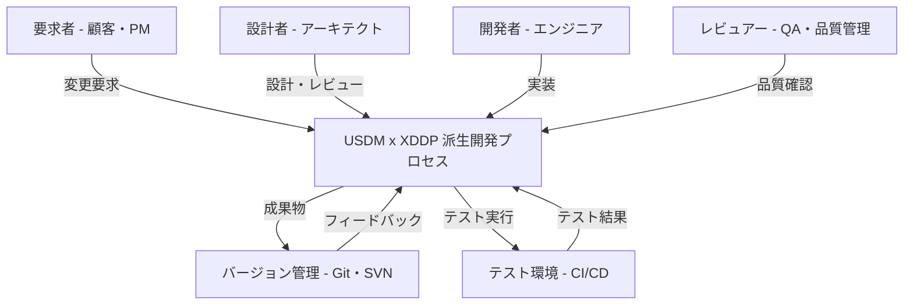

| 要素名               | 説明                                                    |
| -------------------- | ------------------------------------------------------- |
| 要求者               | 変更・機能追加の必要性を定義し、要求内容と理由を提供    |
| 設計者               | 変更要求仕様書をレビューし、変更設計書を作成・承認      |
| 開発者               | トレーサビリティマトリクスをもとに実装し、テストを実施  |
| レビュアー           | 成果物品質を確認し、実装とテスト結果をチェック          |
| USDM x XDDP プロセス | 派生開発に特化した変更管理プロセスで、3つの成果物を生成 |
| バージョン管理       | コード、設計書、要求仕様書などを一元管理                |
| テスト環境           | CI/CD パイプラインで自動テスト、回帰テストを実行        |

### コンテナ図

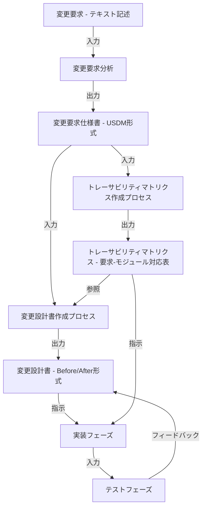

| フェーズ       | 説明                                                 | 出力                       |
| -------------- | ---------------------------------------------------- | -------------------------- |
| 変更要求分析   | 顧客要求を分析し、何が変わるべきか、なぜかを整理     | 要求リスト                 |
| USDM 形式化    | 要求を「要求・理由・説明・仕様」の4要素で構造化      | 変更要求仕様書             |
| TM 作成        | 変更要求と変更箇所の対応を表形式で記録               | トレーサビリティマトリクス |
| 変更設計書作成 | 各変更箇所につき Before/After 形式で実装方法を記述   | 変更設計書                 |
| 実装           | 設計書に従いコード修正し、変更箇所の漏れ・ミスを防止 | 修正コード                 |
| テスト         | 修正箇所と影響範囲をテストし、デグレードを防止       | テスト報告書               |

### コンポーネント図

#### 変更要求仕様書の内部構造

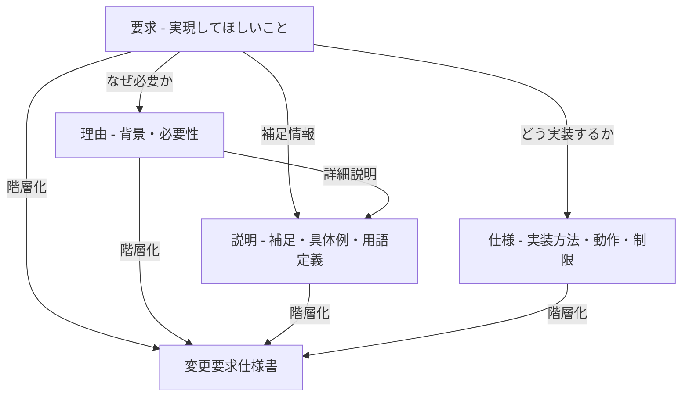

| 要素 | 説明                                                           | 具体例（組込み製品の変更要求）                                 |
| ---- | -------------------------------------------------------------- | -------------------------------------------------------------- |
| 要求 | 目的語と動詞で「実現してほしいこと」を記述。実装方法は含まない | システムは時刻を表示する                                       |
| 理由 | その要求が必要な背景。認識のズレを防止                         | ユーザーが現在時刻を知る必要があるため                         |
| 説明 | 要求の補足。具体例、パラメータ、制約、用語定義などを記載       | 24時間表示形式。秒の表示は不要。時刻は RTC から取得            |
| 仕様 | 要求を実現するための具体的な動作や制限。実装に直結             | RTC_read で時刻取得後、LCD に HH:MM 形式で表示。初期値は 00:00 |

#### トレーサビリティマトリクス（TM）の内部構造

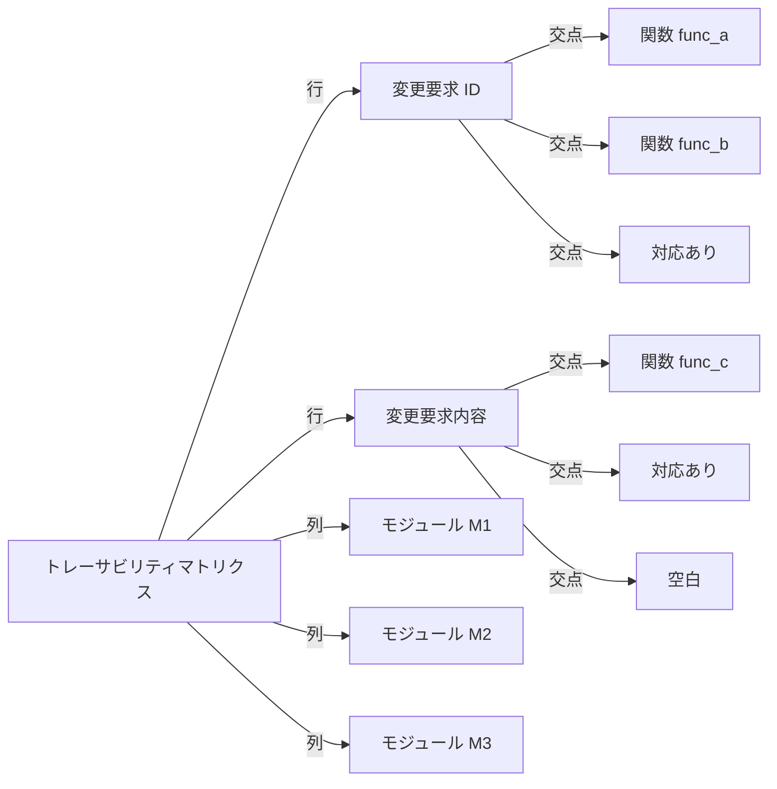

| 項目         | 説明                                                                           | 例                                          |
| ------------ | ------------------------------------------------------------------------------ | ------------------------------------------- |
| 行（縦軸）   | 変更要求仕様書の各要求を列挙。ID と要求内容を記載                              | REQ-001: システムは時刻を表示する           |
| 列（横軸）   | 対象コードベースの変更可能性のあるモジュール・ファイル・クラスを列挙           | M1: RTC_driver.c、M2: display.c、M3: main.c |
| 交点（セル） | 行の要求を実現するために変更される具体的な場所。関数名やブロック番号などを記載 | func_read_rtc、func_display_time            |
| 複数対応     | 1つの要求が複数のモジュールに影響する場合、複数の対応関係を記載                | 要求1つに対しモジュール3つが変更される      |

#### 変更設計書の内部構造

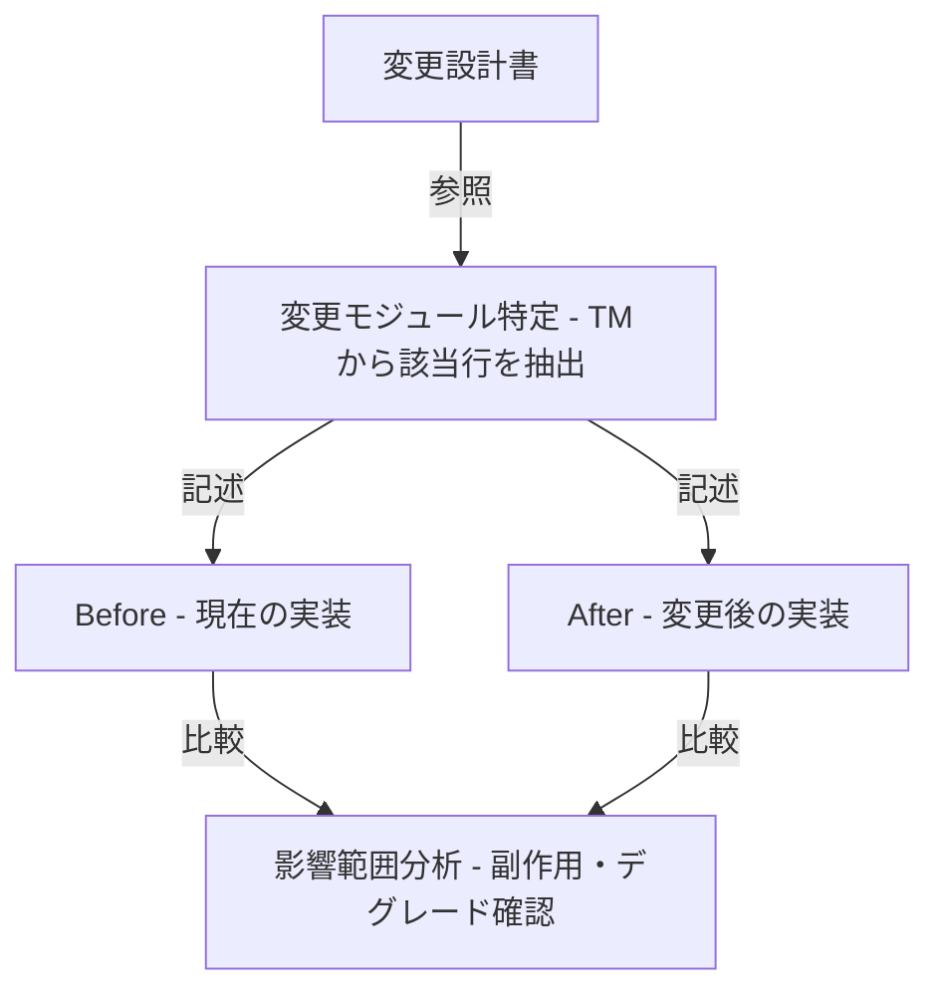

| 構成要素          | 説明                                         | 具体例                                     |
| ----------------- | -------------------------------------------- | ------------------------------------------ |
| 変更モジュール ID | TM から特定された変更対象モジュール          | M1: RTC_driver.c                           |
| 変更対象関数      | TM の交点に記載された関数名                  | func_read_rtc                              |
| Before            | 現在の実装コード、またはフロー図・疑似コード | 従来は1秒ごとにポーリング                  |
| After             | 変更後の実装コード、フロー、データ構造       | タイマー割り込みで値を更新                 |
| 変更理由          | 変更を決定した根拠（変更要求仕様書の参照）   | REQ-001 の「理由」に基づく                 |
| 影響箇所          | TM で特定された関連関数、呼び出し関係        | func_display_time、func_get_time           |
| デグレード防止    | 既存機能への悪影響を防ぐための検討項目       | 他の割り込み優先度への影響、タイミング仕様 |

#### プロセスフロー（データ流）

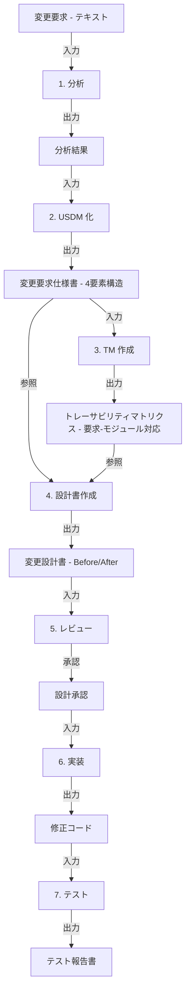

#### アクター責務マトリックス

| アクター   | フェーズ 1・2                              | フェーズ 3・4                            | フェーズ 5・6                    |
| ---------- | ------------------------------------------ | ---------------------------------------- | -------------------------------- |
| 要求者     | 変更内容・理由の提供。要求内容の確認・承認 | 設計内容のレビュー参加（オプション）     | テスト結果のレビュー             |
| 設計者     | 分析の技術的支援。USDM レビュー主体        | TM、設計書の作成・レビュー主体           | 実装レビュー。デグレード防止確認 |
| 開発者     | 技術的な実現可能性の確認                   | 設計内容の理解。技術課題の報告           | TM に基づいた実装。テスト実施    |
| レビュアー | 要求の一貫性確認                           | 成果物品質チェック。トレーサビリティ確認 | テスト品質管理。リリース判定     |

#### 外部システム統合

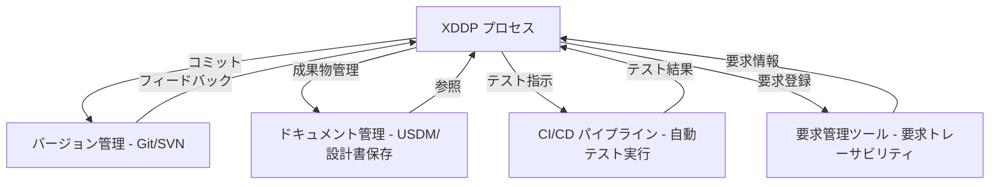

| システム         | 機能                                         | XDDP との接点                                    |
| ---------------- | -------------------------------------------- | ------------------------------------------------ |
| バージョン管理   | コード、設計書、要求仕様書の版管理。差分追跡 | 成果物のバージョン一元管理。トレーサビリティ確保 |
| CI/CD            | 自動テスト実行。ビルド・デプロイ自動化       | テスト指示との連携。テスト結果のフィードバック   |
| ドキュメント管理 | USDM、設計書、TM の保存・共有                | 成果物の一元管理。版管理・アクセス制御           |
| 要求管理ツール   | 要求事項の登録・追跡・ステータス管理         | 変更要求仕様書との双方向リンク。ステータス同期   |

## データ

### 概念モデル

#### USDM のエンティティ構造

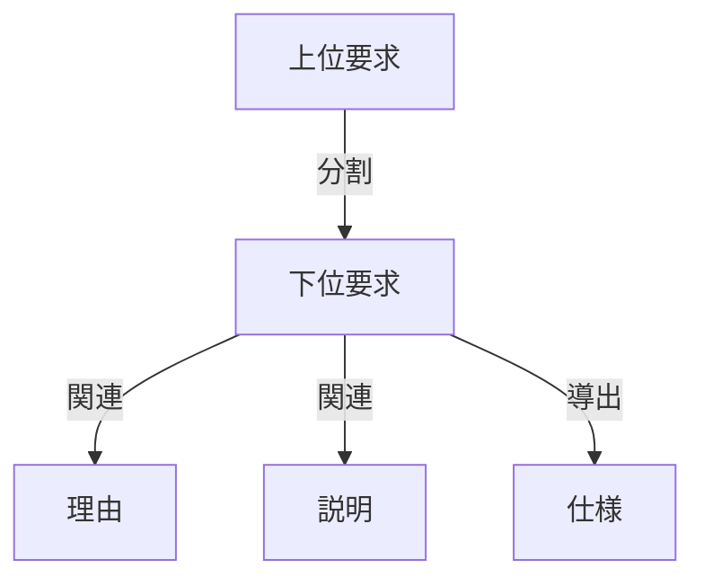

| エンティティ | 役割     | 説明                                                     |
| ------------ | -------- | -------------------------------------------------------- |
| 上位要求     | 親要求   | システムやモジュールが実現すべきことを目的語と動詞で記述 |
| 下位要求     | 子要求   | 上位要求を分割した具体的な要求                           |
| 理由         | 背景説明 | 要求が必要である背景や認識のズレを抑える情報             |
| 説明         | 補足情報 | 具体例、用語定義、補足事項                               |
| 仕様         | 実現方法 | 要求を実現するための動作、制約、実装方法                 |

#### XDDP のエンティティ構造

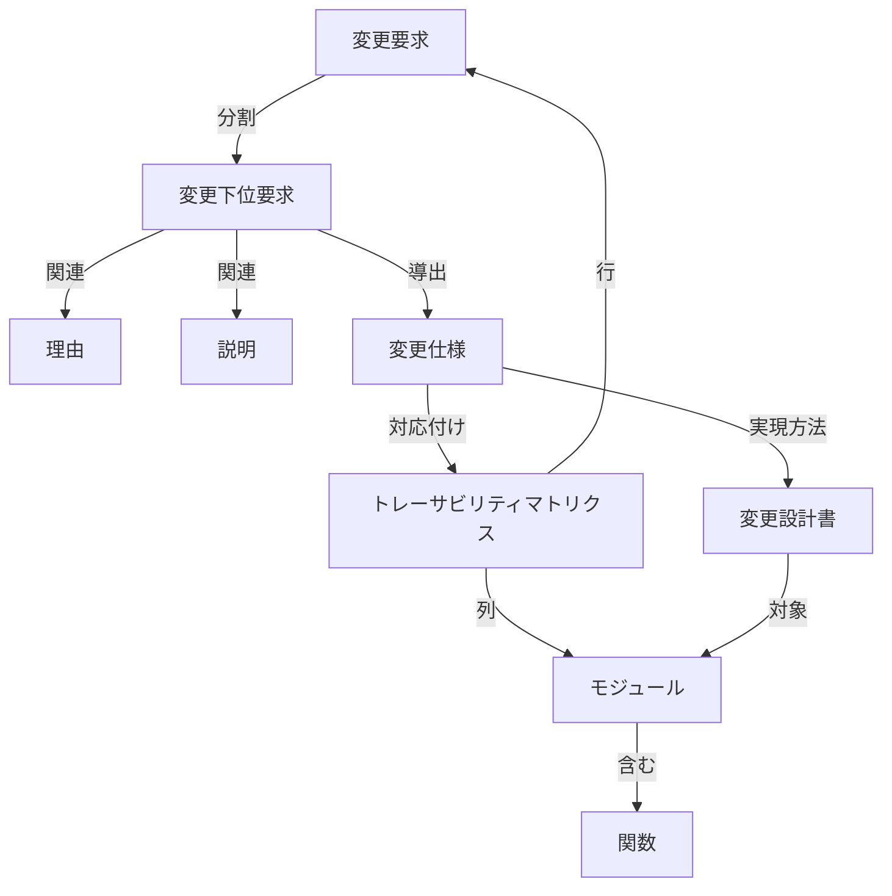

| エンティティ               | 役割         | 説明                                                   |
| -------------------------- | ------------ | ------------------------------------------------------ |
| 変更要求                   | 親変更仕様   | 何を、なぜ変更するのかを記述（USDM形式）               |
| 変更下位要求               | 子変更仕様   | 変更要求を分割した具体的な変更                         |
| 理由                       | 変更背景     | 変更が必要な背景                                       |
| 説明                       | 補足情報     | 用語定義、変更の影響範囲に関する情報                   |
| 変更仕様                   | 変更内容     | Before/After形式で、変更前後の状態を記述               |
| トレーサビリティマトリクス | 影響追跡     | 仕様IDとモジュール（関数）を対応付けて影響範囲を可視化 |
| モジュール                 | 実装単位     | クラス、ファイル、関数など実装対象                     |
| 関数                       | 最小実装単位 | モジュール内の具体的な関数                             |
| 変更設計書                 | 実装設計     | モジュール単位の変更方法をBefore/After形式で記述       |

#### 全体の所有・利用関係

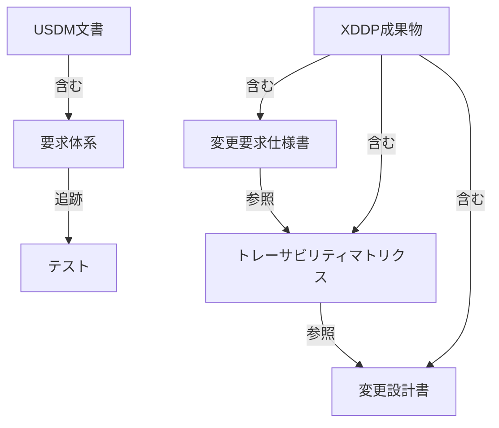

#### エンティティ関係の要約

**USDM内の関係**

| 関係 | 方向                | 説明                             |
| ---- | ------------------- | -------------------------------- |
| 分割 | 上位要求 → 下位要求 | 上位要求から複数の下位要求へ分割 |
| 参照 | 要求 → 理由         | 要求に対して複数の理由が関連     |
| 参照 | 要求 → 説明         | 要求に対して複数の説明が関連     |
| 導出 | 要求 → 仕様         | 要求から複数の仕様を導出         |

**XDDP内の関係**

| 関係     | 方向                    | 説明                                            |
| -------- | ----------------------- | ----------------------------------------------- |
| 分割     | 変更要求 → 変更下位要求 | 変更要求から複数の変更仕様へ分割                |
| 対応付け | 変更仕様 ↔ モジュール   | トレーサビリティマトリクスで1:Nの対応付けを記録 |
| 参照     | 変更仕様 → 変更設計書   | 変更仕様ごとに変更設計書を作成                  |
| 含有     | モジュール → 関数       | モジュールは複数の関数を含有                    |

### 情報モデル

#### USDM の情報モデル

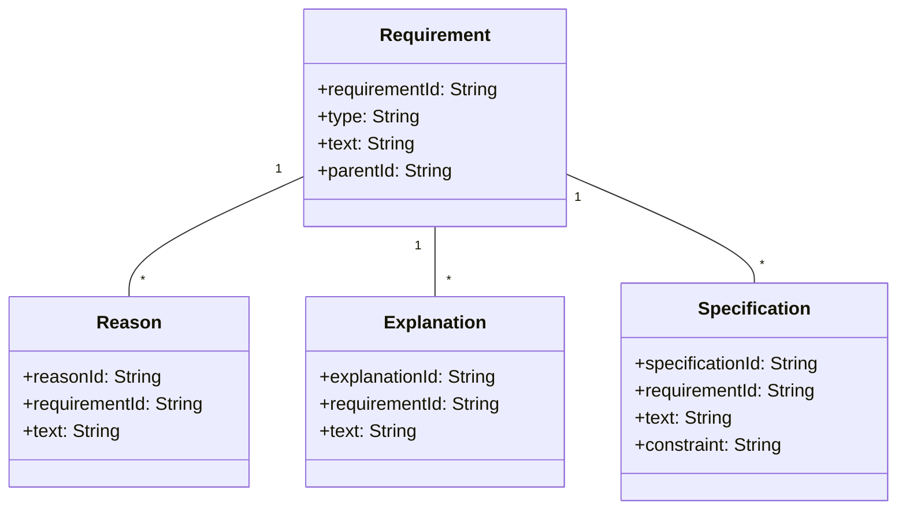

| クラス        | 属性            | 型     | 説明                               |
| ------------- | --------------- | ------ | ---------------------------------- |
| Requirement   | requirementId   | String | 要求ID（例: REQ-001, REQ-001-001） |
|               | type            | String | 要求種別（上位要求、下位要求）     |
|               | text            | String | 要求の記述（目的語+動詞）          |
|               | parentId        | String | 親要求ID（親子関係を表現）         |
| Reason        | reasonId        | String | 理由ID                             |
|               | requirementId   | String | 関連する要求ID                     |
|               | text            | String | 理由の記述                         |
| Explanation   | explanationId   | String | 説明ID                             |
|               | requirementId   | String | 関連する要求ID                     |
|               | text            | String | 補足情報、用語定義                 |
| Specification | specificationId | String | 仕様ID                             |
|               | requirementId   | String | 関連する要求ID                     |
|               | text            | String | 実現方法の記述                     |
|               | constraint      | String | 制約条件                           |

#### XDDP の情報モデル

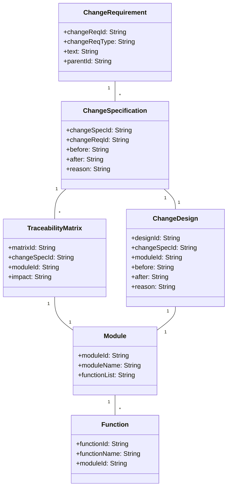

| クラス              | 属性          | 型     | 説明                                 |
| ------------------- | ------------- | ------ | ------------------------------------ |
| ChangeRequirement   | changeReqId   | String | 変更要求ID（USDM形式）               |
|                     | changeReqType | String | 変更要求種別                         |
|                     | text          | String | 変更内容の説明                       |
|                     | parentId      | String | 親変更要求ID                         |
| ChangeSpecification | changeSpecId  | String | 変更仕様ID                           |
|                     | changeReqId   | String | 関連する変更要求ID                   |
|                     | before        | String | 変更前の状態                         |
|                     | after         | String | 変更後の状態                         |
|                     | reason        | String | 変更理由                             |
| TraceabilityMatrix  | matrixId      | String | マトリクスID                         |
|                     | changeSpecId  | String | 行: 変更仕様ID                       |
|                     | moduleId      | String | 列: モジュールID                     |
|                     | impact        | String | 影響箇所（関数名等）                 |
| Module              | moduleId      | String | モジュールID                         |
|                     | moduleName    | String | モジュール名（クラス名、ファイル名） |
|                     | functionList  | String | 含有する関数リスト                   |
| Function            | functionId    | String | 関数ID                               |
|                     | functionName  | String | 関数名                               |
|                     | moduleId      | String | 所属するモジュールID                 |
| ChangeDesign        | designId      | String | 変更設計ID                           |
|                     | changeSpecId  | String | 関連する変更仕様ID                   |
|                     | moduleId      | String | 対象モジュールID                     |
|                     | before        | String | 設計変更前の実装内容                 |
|                     | after         | String | 設計変更後の実装内容                 |
|                     | reason        | String | 変更理由                             |

#### テストケースとの関連情報モデル

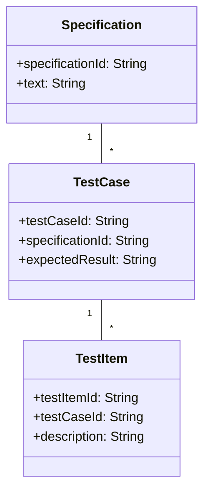

#### トレーサビリティマトリクスの構造

マトリクスの形状は以下のとおりです。

```
                  Module_A  Module_B  Module_C
ChangeSpec_001      ○         ○
ChangeSpec_002                 ○         ○
ChangeSpec_003      ●                    ●
```

マトリクス作成のプロセスは以下の5ステップで構成されます。

1. **行の準備**: 変更要求仕様書から全ての変更仕様IDを列挙
2. **列の準備**: 対象システムの全モジュール（またはファイル）を列挙
3. **影響分析**: 各変更仕様が影響するモジュールを特定
4. **関数名記載**: 変更対象の関数名を記載
5. **検証**: トレーサビリティマトリクスと変更設計書の一貫性を確認

## 構築方法

### USDM の構築方法

#### 構成要素

| 要素 | 説明                                                         |
| ---- | ------------------------------------------------------------ |
| 要求 | 「○○を△△する」という目的語+動詞の形式で記述                  |
| 理由 | 要求者視点で、その要求が必要な背景や目的を記述               |
| 説明 | 要求の内容をより詳細に説明する補足情報                       |
| 仕様 | 要求に含まれる動詞または目的語から導出される具体的な実装内容 |

#### 従来の手動プロセス

1. ユーザー要求を目的語+動詞で整理
2. 理由を要求者視点で記述
3. 上位要求 → 下位要求に階層的に分解
4. 各下位要求から仕様を導出
5. Excel テーブル形式で管理（記入・修正・レビュー）

従来の課題として、テンプレート埋め込み作業が手作業であること、レビュー時間が長いこと、漏れ検出に人員負荷がかかることが挙げられます。

#### Coding Agent による自動化アプローチ

**フェーズ1: 仕様抽出と初期化**

ユーザーからの自然言語入力（メール、会話ログ、既存ドキュメント）を AI が解析し、「動詞」「目的語」「背景」を自動抽出します。抽出結果を USDM テンプレート（Excel）へ自動入力します。

**フェーズ2: 階層分解**

AI が上位要求の構造を分析し、分解候補を提案・自動配置します。CoBrain を活用して分解漏れを検出します。

**フェーズ3: 仕様導出と検証**

下位要求から動詞・目的語を自動抽出し、仕様を自動生成します。曖昧性・矛盾・モレを AI が検出・提案します。

**フェーズ4: レビュー自動化**

CoBrain（AI レビューツール）が以下を自動チェックします。

- 曖昧な記述の検出と改善案提示
- 要求同士の矛盾検出
- チェックリスト項目の見落とし指摘

これにより、人間によるレビュー時間を大幅に削減できます。

### XDDP の構築方法

#### 3つの成果物（3点セット）

| ドキュメント                     | 形式               | 役割                                       |
| -------------------------------- | ------------------ | ------------------------------------------ |
| 変更要求仕様書                   | USDM 形式（Excel） | 変更内容の「何を」と「なぜ」を明記         |
| トレーサビリティマトリクス（TM） | Excel              | 要求とモジュールの対応関係を可視化         |
| 変更設計書                       | Word               | 実装者向けに「どのように」変更するかを記述 |

#### Coding Agent による自動化アプローチ

**フェーズ1: 変更要求分析の自動化**

ユーザー提示仕様（自然言語、メール、口頭記録）から AI が「変更内容」「理由」「影響範囲」を抽出します。自動で USDM テンプレートへ入力し、CoBrain で曖昧性をチェックします。

**フェーズ2: トレーサビリティマトリクスの自動生成**

既存ソースコード分析（AST 解析、コード理解 AI）と USDM 要求テキスト解析を組み合わせます。AI が「この要求はモジュール X に影響」を自動検出し、TM テンプレートへ自動配置します。影響箇所のモレも AI が指摘します。

**フェーズ3: 変更設計書の自動生成**

既存ソースコード（Git リポジトリ）と変更要求（USDM）から、git diff のような差分ベースで実装を提案します（Before/After）。Coding Agent がコードを自動生成します。

**フェーズ4: 実装からテストの自動化**

Coding Agent が自動実装し、テストケースを変更要求から自動生成します。テスト実行と結果レポートも自動化します。

**フェーズ5: ドキュメント自動更新**

変更設計書の Before/After を git diff から自動抽出し、Word テンプレートへ自動挿入します。

### テンプレート管理と標準化

#### USDM テンプレートの推奨構成（Excel）

```
| ID    | 上位要求   | 下位要求         | 理由（背景）         | 説明 | 仕様  |
| ----- | ---------- | ---------------- | -------------------- | ---- | ----- |
| 1.1   | ○○を△△する |                  | ユーザーは○○が必要   |      |       |
| 1.1.1 |            | ○○について▲▲する | ○○の実装に○○が不可欠 | ...  | 仕様1 |
| 1.1.2 |            | ○○について■■する | ○○品質確保のため     | ...  | 仕様2 |
```

#### TM テンプレートの推奨構成（Excel）

```
              [関数f1] [関数f2] [モジュールM1] [ファイルA.c]
[要求1.1.1]     ◎
[要求1.1.2]              ○              ◎
```

記号の意味は以下のとおりです。

| 記号 | 説明       |
| ---- | ---------- |
| ◎    | 大幅変更   |
| ○    | 軽微な変更 |
| 空白 | 影響なし   |

#### 変更設計書テンプレートの構成（Word）

```
■ 変更概要
- 変更要求 ID: 1.1.1
- 対象モジュール: func_xxx in file_a.c
- 変更理由: ユーザーが○○を必要とするため

■ 変更前（Before）
[コードスニペット]

■ 変更後（After）
[コードスニペット]

■ 影響分析
- 呼び出し箇所: func_yyy, func_zzz
- テスト対象: 機能X, 機能Y
```

### 導入で期待される効果

#### メンテナンスコスト削減

| 項目                          | 従来（手動）        | AI 自動化後                         |
| ----------------------------- | ------------------- | ----------------------------------- |
| USDM 作成                     | 3〜5 営業日         | 0.5 営業日（AI 提案 + 確認）        |
| TM 作成                       | 2〜3 営業日         | 0.5 営業日（AI 自動生成）           |
| 変更設計書作成                | 1〜2 営業日         | 0.5 営業日（Before/After 自動抽出） |
| CoBrain レビュー              | 1〜2 営業日（人間） | 即座（自動）                        |
| **合計**（1案件あたり参考値） | **7〜12 営業日**    | **2〜3 営業日**                     |

## 利用方法

### USDM + CoBrain による要件定義ワークフロー

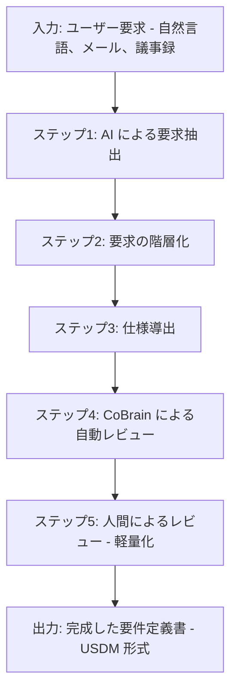

| ステップ                   | 説明                                                                       |
| -------------------------- | -------------------------------------------------------------------------- |
| AI による要求抽出          | 入力テキストから「目的語」「動詞」を自動抽出し、テンプレートへ初期値を入力 |
| 要求の階層化               | 上位要求 → 下位要求の分解案を AI が提案し、ユーザーが確認・修正            |
| 仕様導出                   | 下位要求から仕様を自動生成                                                 |
| CoBrain による自動レビュー | 曖昧な記述の検出、要求同士の矛盾検出、チェックリスト項目の漏れ指摘         |
| 人間によるレビュー         | CoBrain の検出結果を確認し、本当に必要な修正のみ実施                       |

#### 具体例: 注文追跡機能

**入力テキスト（メール原文）**

> 新しいシステムでは、顧客がオンライン注文を追跡できる機能が必要です。顧客は注文ID を入力して、現在の配送状況（準備中、発送済、配達済）を確認したいとのことです。ステータスは30秒ごとに更新されるべきです。

**自動抽出された要求（USDM 形式）**

| 要求ID | 要求                         | 理由                                         | 仕様                                        |
| ------ | ---------------------------- | -------------------------------------------- | ------------------------------------------- |
| 1.0    | 顧客が注文追跡機能を利用する | 顧客が配送状況をリアルタイムで知る必要がある |                                             |
| 1.1    | 注文ID で検索を実行する      | 顧客が自分の注文を特定するため               | 入力フォームに「注文ID」欄を設置            |
| 1.2    | 配送ステータスを表示する     | 現在の配送段階を可視化するため               | ステータス表示UI「準備中/発送済/配達済」    |
| 1.3    | ステータスを30秒ごと更新する | 最新情報をリアルタイムで提供するため         | API ポーリング間隔 30秒、WebSocket での更新 |

**CoBrain による自動レビュー結果**

```
【警告1】曖昧な記述
- 要求1.2「配送ステータスを表示する」
- 改善案: 「配送ステータスを画面左側のステータスパネルに日本語で表示する」

【警告2】漏れの可能性
- 以下の下位要求が欠けている可能性:
  - エラーハンドリング（注文IDが見つからない場合の表示）
  - 再試行機能（更新失敗時）

【情報】関連要求への影響
- 既存の「注文管理 API」要求との整合性を確認してください
```

### XDDP + Coding Agent による派生開発ワークフロー

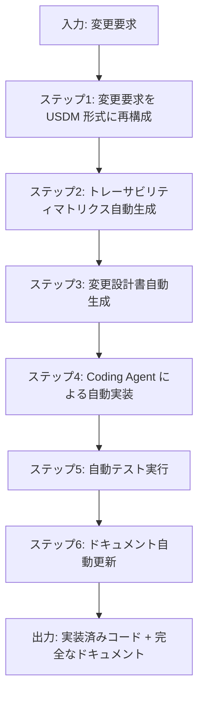

| ステップ             | 説明                                                                              |
| -------------------- | --------------------------------------------------------------------------------- |
| USDM 形式に再構成    | AI が自動抽出・テンプレート入力し、CoBrain で曖昧性をチェック                     |
| TM 自動生成          | ソースコード AST 解析で関数・モジュール構造を抽出し、要求との対応を AI が自動検出 |
| 変更設計書自動生成   | 既存コード + 要求から実装差分を AI が提案し、Before/After を自動抽出              |
| 自動実装             | 変更設計書の内容をもとにコード生成し、テストケースも変更要求から自動生成          |
| 自動テスト実行       | 生成されたテストを実行し、既存機能への回帰テストも自動実施                        |
| ドキュメント自動更新 | 変更設計書を最終版へ更新（実装状況を反映）                                        |

#### 具体例: 国際配送機能の追加

**入力: ユーザーからの変更要求**

> 既存の「注文管理システム」に国際配送機能を追加してください。各注文について、配送先国を選択できるようにし、配送料金を国ごとに計算する機能が必要です。

**ステップ1: USDM 形式への変換（AI 自動実施）**

| 要求ID | 要求                     | 理由（ユーザー視点）               | 仕様                                                 |
| ------ | ------------------------ | ---------------------------------- | ---------------------------------------------------- |
| 1.0    | 国際配送機能を実装する   | 海外の顧客に対応するため           |                                                      |
| 1.1    | 配送先国を選択できる     | 顧客が配送先国を指定する必要がある | チェックアウトページに「国選択ドロップダウン」を追加 |
| 1.2    | 国別の配送料金を計算する | 国によって配送コストが異なるため   | 国コード → 配送料金のマッピングテーブル実装          |

**ステップ2: トレーサビリティマトリクス自動生成（AI ベース）**

既存ソースコード解析結果は以下のとおりです。

| 既存関数                  | 現状               |
| ------------------------- | ------------------ |
| Order.getShippingCost     | 国内配送料金のみ   |
| CheckoutUI.renderCheckout | チェックアウト画面 |
| Order.validateOrder       | 注文検証           |

自動生成された TM は以下のとおりです。

```
                    [Order.getShippingCost] [CheckoutUI.renderCheckout] [Order.validateOrder]
[要求1.1]                                          ◎
[要求1.2]                 ◎                                                   ○
```

**ステップ3: 変更設計書自動生成**

変更前のソースコード:

```python
def getShippingCost(quantity):
    # 国内配送料金: 数量に基づいて計算
    base_cost = 500
    if quantity > 10:
        return base_cost * 0.8
    return base_cost
```

AI による変更案（After）:

```python
def getShippingCost(quantity, country_code):
    # 国別の配送料金マッピング
    shipping_rates = {
        'JP': {'base': 500, 'discount_threshold': 10},
        'US': {'base': 2000, 'discount_threshold': 5},
        'EU': {'base': 1500, 'discount_threshold': 8},
    }

    if country_code not in shipping_rates:
        raise ValueError(f"Unsupported country: {country_code}")

    rate = shipping_rates[country_code]
    base_cost = rate['base']
    if quantity > rate['discount_threshold']:
        return base_cost * 0.8
    return base_cost
```

**ステップ4-5: Coding Agent による自動実装とテスト**

```python
# Coding Agent が生成したテストケース（自動生成）
def test_shipping_cost_japan():
    assert getShippingCost(5, 'JP') == 500
    assert getShippingCost(15, 'JP') == 400

def test_shipping_cost_us():
    assert getShippingCost(3, 'US') == 2000
    assert getShippingCost(6, 'US') == 1600

def test_shipping_cost_invalid_country():
    with pytest.raises(ValueError):
        getShippingCost(5, 'XX')
```

### メンテナンスと継続的改善

#### 仕様変更への対応

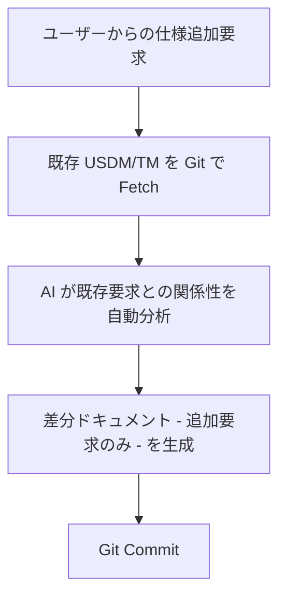

AI は関連する既存要求の ID を提示し、影響範囲を自動検出します。

#### Coding Agent による実装とドキュメントの同期

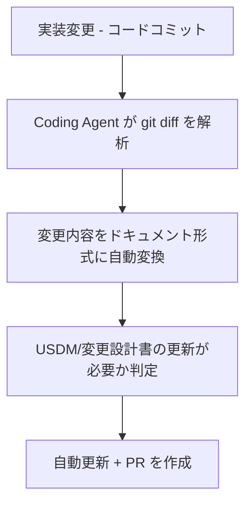

## 運用

### メンテナンスコストの増大への対策

派生開発では「短納期」「低コスト」を要求されるため、USDM 記述や XDDP 成果物のメンテナンスが追いつかないまま次の開発を進めざるを得ない環境が一般的です。この結果、開発を繰り返すたびに設計書とソースコードとの乖離が拡大し、既存ソフトウェアの理解難易度が上昇します。

| 施策                   | 説明                                         | 効果                                                    |
| ---------------------- | -------------------------------------------- | ------------------------------------------------------- |
| 自動レビューツール導入 | CoBrain 等の AI 要求レビューツール           | USDM 記述品質のばらつきを低減し、レビュー時間を大幅短縮 |
| トレーサビリティ自動化 | git diff に基づく TM 自動生成                | 手作業による漏れを排除                                  |
| ドキュメント即時同期   | ソースコード変更時の USDM 変更提案           | 設計書とコードの乖離を最小化                            |
| 定期的な整合性チェック | CI/CD パイプラインに Semcheck や CSCA を統合 | 継続的に品質監視                                        |

#### CI/CD パイプラインへの統合例

```yaml
# GitHub Actions の例
name: XDDP Quality Check
on: [pull_request]
jobs:
  check-consistency:
    runs-on: ubuntu-latest
    steps:
      - uses: actions/checkout@v3
      - name: Verify Traceability Matrix
        run: |
          python scripts/generate_tm_from_git.py \
            --base-branch origin/main \
            --current-branch HEAD
      - name: Check Code-Spec Consistency
        run: |
          semcheck spec.md src/ --model gpt-4
      - name: Review USDM Documents
        run: |
          cobrain review --file requirement_spec.md
```

### 学習コストの高さと継続率の低下への対策

| 対策                             | 内容                                                                      |
| -------------------------------- | ------------------------------------------------------------------------- |
| 反復型 OJT の導入                | 知識と実践の相互補完。セッション全体を通じ、講義と演習を交互に実施        |
| プロジェクト固有のテンプレート化 | USDM フォーマット、TM シートの組織標準化で初期学習負荷を低減              |
| AI による学習支援                | チャットボット型の「XDDP 相談窓口」を構築し、いつでも質問可能な環境を提供 |
| 新入メンバー向けオンボーディング | 最初の3〜5プロジェクトを専任メンターが支援する仕組み                      |

### 形骸化と品質低下への対策

| 段階                 | 実施内容                                                   | 期間     |
| -------------------- | ---------------------------------------------------------- | -------- |
| 啓蒙フェーズ         | 要件定義の重要性を組織全体で認識統一                       | 1〜2ヶ月 |
| 学習フェーズ         | 正しい USDM 手法を教育。EurekaBox 等の資料も活用           | 3〜4ヶ月 |
| 実践サポートフェーズ | 実際のプロジェクトで専任メンターが支援。品質チェック       | 継続     |
| 定期的な品質監視     | 四半期ごとに USDM ドキュメント品質スコア（自動採点）を測定 | 継続     |

#### 品質採点の自動化

```python
# USDM 品質スコア計算スクリプト（Python 例）

def score_usdm_quality(doc: str) -> dict:
    """USDM 文書の品質をスコア化"""
    scores = {
        'requirement_clarity': check_requirement_specificity(doc),
        'reason_depth': check_reason_meaningfulness(doc),
        'spec_detail': check_spec_completeness(doc),
        'traceability': check_tm_completeness(doc),
    }
    scores['overall'] = sum(scores.values()) / len(scores)
    return scores

def check_requirement_specificity(doc: str) -> float:
    """要求の具体性チェック
    - 定量的な条件が含まれているか（70〜100点）
    - 曖昧な表現がないか（単語の自動検出）
    """
    vague_keywords = ['可能なら', '努力する', 'できれば']
    quantitative_patterns = [r'\d+\s*(件|秒|回|%|GB)']
    # 実装省略
    pass
```

### AI/自動化ツールの活用

| ツール               | 説明                                                                                                    | 適用対象                  | 成熟度     |
| -------------------- | ------------------------------------------------------------------------------------------------------- | ------------------------- | ---------- |
| CoBrain              | AI が USDM 形式の要件定義書をレビューし、改善提案を自動で実施（2024年ベータ、2025年 Word アドイン追加） | USDM レビュー             | 商用ベータ |
| Semcheck             | Markdown 形式の仕様書とコードの意味的整合性検証。複数 LLM に対応                                        | 主に Go、Python（拡張中） | OSS        |
| CSCA（富士通）       | コードと設計書の差分を検知し、障害原因調査を高速化                                                      | 全言語                    | 研究段階   |
| Coding Agent（汎用） | Claude Code、GitHub Copilot Workspace 等。コード生成・変更・テスト自動化                                | 全言語                    | 商用GA     |

#### ツール選定ガイド

| 優先事項                            | 推奨ツール                                                             |
| ----------------------------------- | ---------------------------------------------------------------------- |
| 要求品質の向上が最優先              | CoBrain を先行導入（USDM 記述の曖昧性検出に特化）                      |
| コードと仕様の乖離が深刻            | Semcheck/CSCA を CI/CD に統合（変更のたびに自動チェック）              |
| TM 作成・変更設計書の自動化が最優先 | Coding Agent + git diff ベースのスクリプトを自作                       |
| 全体最適を目指す                    | CoBrain（上流）+ Coding Agent（中流〜下流）+ Semcheck（検証）の3層構成 |

#### 制限事項

CoBrain は USDM 形式に特化しているため、自由形式の要件定義書には適用できません。Semcheck は現時点で Go と Python が主対象で、C/C++ 組込み領域のサポートは限定的です。CSCA は富士通社内での活用が中心で、一般公開の利用形態は研究レベルです。いずれのツールも「人間のレビューを代替する」ものではなく、「レビュー前の品質底上げ」として位置づけることが重要です。

### Coding Agent による TM 自動生成

```python
# git diff ベースで TM を自動生成（Python 例）

import subprocess
import re
from typing import Dict, List

def generate_tm_from_git(base_branch: str, current_branch: str) -> Dict[str, List[str]]:
    """
    git diff を解析して TM を自動生成

    戻り値:
      { "REQ-001": ["user_manager.c:validate_login()", "config.ini:MAX_ATTEMPTS"],
        "REQ-002": [...] }
    """
    # 1. git diff を取得
    diff = subprocess.check_output([
        'git', 'diff', f'{base_branch}...{current_branch}', '--unified=0'
    ]).decode('utf-8')

    # 2. 変更ファイルと関数を抽出
    tm = {}
    for match in re.finditer(r'^diff --git.*?@@.*?@@', diff, re.MULTILINE):
        file_name = extract_filename(match.group())
        functions = extract_function_changes(match.group())
        # USDM ファイルから REQ-ID をマッピング
        req_ids = map_to_requirements(file_name, functions)
        for req_id in req_ids:
            if req_id not in tm:
                tm[req_id] = []
            tm[req_id].extend([f"{file_name}:{func}" for func in functions])

    return tm
```

### Coding Agent プロンプト設計例

XDDP プロセスに Coding Agent を統合する際のプロンプト設計パターンを示します。

#### USDM 自動生成プロンプト

```markdown
# USDM 変更要求仕様書 自動生成

## 入力
- 変更要求テキスト（自然言語）
- 既存の USDM ドキュメント（あれば）

## 出力フォーマット
以下の USDM 形式で出力してください:

| 要求ID | 上位/下位 | 要求（目的語+動詞） | 理由 | 説明 | 仕様 |

## ルール
1. 要求は「○○を△△する」の形式で記述
2. 理由は要求者視点で「なぜ必要か」を記述（要求の裏返しは不可）
3. 上位要求は「動詞の分解」「目的語の分解」「条件の分解」で下位に分割
4. 各下位要求から少なくとも1つの仕様を導出
5. 曖昧な表現（「適切に」「必要に応じて」等）は定量的な表現に置換
```

#### TM 自動生成プロンプト

```markdown
# トレーサビリティマトリクス 自動生成

## 入力
- USDM 変更要求仕様書（上記で生成したもの）
- ソースコードのディレクトリ構造と関数一覧

## タスク
1. 各変更要求の仕様テキストを解析
2. ソースコードの関数シグネチャ・コメント・変数名と照合
3. 影響度を判定（◎: 大幅変更、○: 軽微な変更）
4. TM マトリクス形式で出力

## 注意
- 直接的な影響と呼び出し元・呼び出し先の間接的影響も検出
- 影響なしと判定した根拠も簡潔に記述
```

### 実装ロードマップ（参考例）

**短期（0〜3ヶ月）**

- USDM 記述基準の明文化
- CoBrain パイロット導入（1チーム）
- 基本的な TM テンプレート作成
- レビュー基準チェックリスト構築

**中期（3〜6ヶ月）**

- TM 自動生成スクリプト開発
- CI/CD に Semcheck 統合
- XDDP 3点セット完全導入（複数チーム）
- メトリクス測定開始

**長期（6〜12ヶ月）**

- AI テストケース導出の実装
- Enterprise Architect など業務支援ツール検討
- 組織全体への展開
- ベストプラクティスの標準化

## ベストプラクティス

### まず何から始めるか

USDM × XDDP を導入する際は、以下の優先順位が推奨されます。

1. **USDM の記述ルールを1プロジェクトで試す** - 「要求・理由・説明・仕様」の4要素を1件の変更要求で実践
2. **TM を作成し、変更漏れの効果を体感する** - 小規模な変更で TM の有用性を確認
3. **変更設計書で Before/After を記述する** - 3点セットの完成
4. **AI ツール（CoBrain 等）でレビューを効率化する** - プロセスが定着した後に自動化を導入

### 段階的導入による成功率向上

#### 推奨モデル: 3段階導入

| 段階                | 期間     | 対象チーム             | 成果物             |
| ------------------- | -------- | ---------------------- | ------------------ |
| Phase 1: パイロット | 2〜3ヶ月 | 1〜2チーム（5〜10名）  | 1プロジェクト完遂  |
| Phase 2: 拡大       | 3〜4ヶ月 | 複数チーム（20〜30名） | 3〜5プロジェクト   |
| Phase 3: 全社展開   | 継続     | 全エンジニア           | 組織文化として定着 |

#### Phase 1 で実施すべき項目

- XDDP の3点セットを完全に導入
- レビュー基準を明確に定義（「何が良い USDM か」を可視化）
- ツール（Enterprise Architect USDM アドイン、CoBrain 等）の使用方法を習得
- メトリクス測定開始（工数削減率、バグ検出率等）

### プロセス改善による効果最大化

現状のプロセスの問題点を明らかにせずに XDDP に移行してしまうと、既存の悪い習慣が XDDP 内に持ち込まれます。

推奨フローは以下のとおりです。

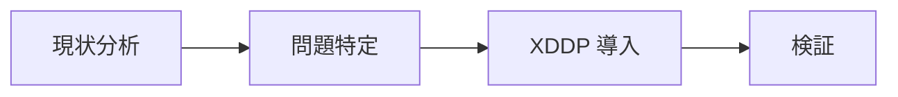

| ステップ  | 説明                                                                    |
| --------- | ----------------------------------------------------------------------- |
| 現状分析  | 既存プロセスの課題を洗い出す（例: レビュー基準が曖昧）                  |
| 問題特定  | XDDP でそれをどう解決するかを明確化（例: トレーサビリティで漏れを防止） |
| XDDP 導入 | ツール・組織体制を同時に変更                                            |
| 検証      | 導入効果を測定                                                          |

### 3つの成果物の役割

| 成果物                     | 作成者         | 防止する問題                             | 依存関係    |
| -------------------------- | -------------- | ---------------------------------------- | ----------- |
| 変更要求仕様書（USDM）     | 設計者・要求者 | 要求内容の誤解・曖昧さによるミス         | 独立        |
| トレーサビリティマトリクス | 設計者         | 変更箇所の漏れ。関連箇所の見落とし       | 仕様書 → TM |
| 変更設計書                 | 設計者         | 実装方法の誤り。デグレード。仕様との乖離 | TM → 設計書 |

### 階層的なトレーサビリティ

変更要求仕様書（要求）→ TM（どこを変えるか）→ 変更設計書（どう変えるか）→ 実装（実際のコード）という階層的なチェーンが、要求から実装までの一貫性を保証します。

派生開発は複数の変更要求を連続して処理する場合が多く、各要求ごとにこの3段階を繰り返します。3つの成果物を保持することで、過去の変更履歴と現状が可視化されます。

### Coding Agent との連携技術

#### ソースコード理解 AI

| 技術                              | 説明                                               |
| --------------------------------- | -------------------------------------------------- |
| AST 解析                          | 関数・モジュール・クラス構造を自動抽出             |
| コード埋め込み（Code Embeddings） | コード片と自然言語テキストの意味的関連性を自動検出 |
| LLM によるコード生成              | 変更設計書から実装コードを自動生成                 |

#### 自然言語処理（NLP）

| 技術             | 説明                                 |
| ---------------- | ------------------------------------ |
| 要求テキスト解析 | 「目的語」「動詞」「背景」を自動抽出 |
| 曖昧性検出       | 具体性を欠く記述を検出し改善案を提示 |
| 矛盾検出         | 複数要求間の矛盾を自動検出           |

#### ドキュメント自動生成

| 技術                   | 説明                                                            |
| ---------------------- | --------------------------------------------------------------- |
| テンプレートマッピング | USDM/TM/変更設計書テンプレートへの自動入力                      |
| 差分ドキュメント生成   | git diff からコード変更の Before/After を自動抽出し Word へ挿入 |
| リリースノート自動生成 | 変更要求から人間が読みやすいテキストを自動生成                  |

#### テストケース自動生成

| 技術             | 説明                                                                       |
| ---------------- | -------------------------------------------------------------------------- |
| 要求ベーステスト | 各下位要求から「この要求が満たされたことを確認するテストケース」を自動生成 |
| 境界値分析自動化 | 数値パラメータの境界値テストを自動提案                                     |

## トラブルシューティング

### パターン1: 変更要求と仕様の区分が曖昧

**症状**: 変更要求仕様書が単なる機能仕様書になっている。「なぜこの変更が必要か」という背景が記載されていない。

**原因**: USDM の「要求」「理由」「説明」「仕様」の役割が理解されていない。

**対策**: 以下の4要素を明確に区別して記述します。

| 要素                  | 具体例                                                        |
| --------------------- | ------------------------------------------------------------- |
| 要求（Requirement）   | 在庫が100を下回ったら警告したい                               |
| 理由（Reason）        | 品切れによる売上喪失を防ぐため                                |
| 説明（Description）   | 過去3ヶ月で5件の品切れが発生し、1件あたり平均50万円の機会損失 |
| 仕様（Specification） | 警告ダイアログは日本語で表示。チェック間隔は1時間             |

### パターン2: トレーサビリティマトリクスの省略

**症状**: 「大規模なので TM は省略した」という判断。変更による影響範囲を把握できず、結合テスト以降でバグが多発。

**原因**: TM 作成の手作業負荷が高く、「効果が見えない」と判断されがち。大規模なほど漏れが増えるという認識不足。

**対策**:

- TM 作成を自動化（git diff ベース、CI/CD 統合）
- 「大規模だからこそ TM が重要」という認識を共有
- メトリクス測定: TM を使用した場合、バグ検出率の向上やテスト工数の削減が報告されている（導入現場の参考値: バグ検出率3〜5倍、テスト工数削減20〜30%）

### パターン3: ツール導入による依存と形骸化

**症状**: ツール（Enterprise Architect 等）を導入したが、実際には更新されず「デジタル成果物」だけが蓄積。

**原因**: ツール操作の学習コストが高い。ツール = 要件管理だと誤解し、プロセス改善と混同。

**対策**:

- ツールは補助手段であることを認識
- プロセス先行: USDM・XDDP の実践を定着させた後、ツール導入を検討
- ツール導入時の教育: 簡単な操作から開始
- 定期的な棚卸し: 未更新ドキュメントの削除

### メンテナンスコストが削減されない場合の診断フロー

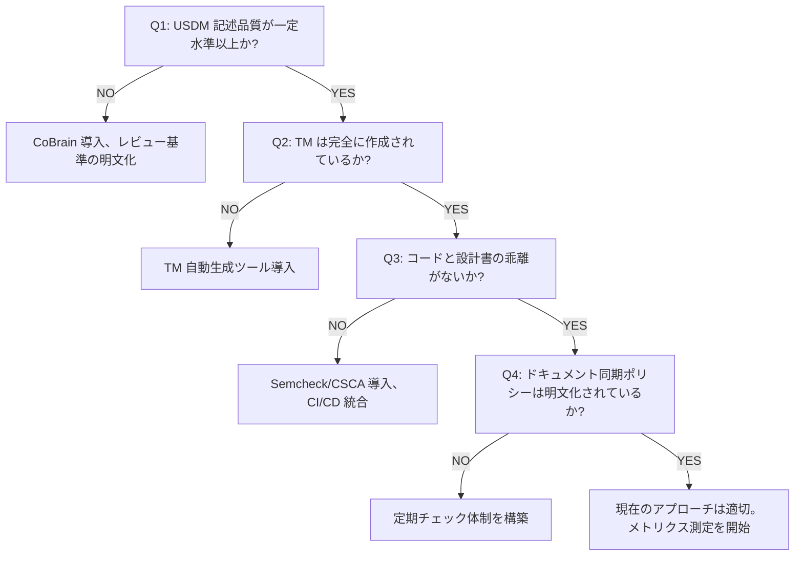

## まとめ

USDM と XDDP は、派生開発における変更要求の正確な記述と漏れのない実装を実現するための手法です。Coding Agent 時代では、CoBrain による自動レビュー、git diff ベースの TM 自動生成、変更設計書の自動作成により、従来7〜12営業日かかっていた工数を2〜3営業日に短縮できます。

この記事が少しでも参考になった、あるいは改善点などがあれば、ぜひリアクションやコメント、SNSでのシェアをいただけると励みになります！

## 参考リンク

- 公式・団体
  - [派生開発推進協議会（AFFORDD）](https://affordd.jp/)
  - [派生開発カンファレンス2025](https://affordd.jp/conference2025/)
  - [エクスモーション XDDP/USDM コンサルティング](https://www.exmotion.co.jp/)
  - [IPA 先進的な設計・検証技術の適用事例報告書 2017 年度版](https://www.ipa.go.jp/archive/files/000064277.pdf)

- 解説記事・技術資料
  - [正確な要求記述、要求仕様を定義する技法USDMとは。記述サンプルも紹介](https://www.eureka-box.com/media/column/a19)
  - [第1回 XDDPとは？派生開発時のモレやミスを最小限にするプロセスと、開発現場の現状について。](https://www.eureka-box.com/media/column/a34)
  - [XDDP成果物：USDM、トレーサビリティマトリクス、変更設計書](https://www.exmotion.co.jp/solution/xddp-1.html)
  - [派生開発の基礎知識や代表的な手法「XDDP」・プロセスの進め方を解説](https://www.qbook.jp/column/1758.html)
  - [XDDP では、変更設計書に変更方法をBefore/Afterで記載する](https://www.exmotion.co.jp/solution/xddp-6.html)
  - [USDMアドインについて - Enterprise Architect](https://www.sparxsystems.jp/products/EA/tech/USDM.htm)
  - [要求仕様を記述する手法「USDM」って何？](https://www.ios-net.co.jp/blog/20231025-1603/)
  - [USDMで仕様を上手にアウトプットしよう！](https://sqripts.com/2024/02/06/90314/)
  - [USDM（要求仕様書を作成する時のお作法）の概要 - Qiita](https://qiita.com/Aichi_Lover/items/dc47b5426f49f0e6ee8b)
  - [要求事項トレーサビリティ・マトリックスとは何か？](https://ssaits.jp/promapedia/documents/rt-matrix.html)
  - [XDDPでは「トレーサビリティマトリクス」で変更箇所を特定](https://www.exmotion.co.jp/solution/xddp-5.html)
  - [XDDP Patterns - A Pattern Language for eXtreme Derivative Development Process](https://www.hillside.net/asianplop/proceedings/AsianPLoP2020/papers/04-kawaguchi.pdf)
  - [要件定義書のテンプレートや書き方](https://www.eureka-box.com/media/column/a77)
  - [XDDP（派生開発プロセス）導入支援](https://www.exmotion.co.jp/solution/xddp.html)
  - [変更要求仕様書の書き方と具体例](https://blue-deer-5faaa493fc9b18ed.znlc.jp/xddp-sample/standard/tasks/make_759869B7.html)
  - [XDDPの背景を知る](https://www.eureka-box.com/media/column/a47)
  - [テストはストーリーで追う 〜USDMで要件からテストまで串刺しにする〜 - Qiita](https://qiita.com/k-sak/items/73eeb1cb432e5b73ae31)
  - [「要件定義があいまいで炎上」を防ぐ - USDM の導入手引き](https://www.eureka-box.com/media/column/a87)
  - [EurekaBox オンライン学習サービス](https://www.eureka-box.com/)

- 導入事例・ベストプラクティス
  - [派生開発に XDDP を導入する際の障壁とその解消に向けたアプローチ（JUSE SQiP）](https://www.juse.jp/sqip/library/shousai/?id=56)
  - [派生開発で成功するための施策 - 部分的に XDDP の仕組みを取り入れた設計書の提案](https://www.juse.jp/sqip/library/shousai/?id=64)

- AI・Coding Agent 関連
  - [若手に USDM が定着する、効果が出る！生成 AI がもたらす USDM 学習〜実践〜レビューの新体験](https://affordd.jp/libraries/affordd-conference2025-exmotion/)
  - [CoBrain - 要件定義書の作成と添削を、AI で](https://cobrain.jp/)
  - [生成 AI で要件定義を自動化 - Qiita](https://qiita.com/Umeco_co/items/8a434b0e72202d4532ca)
  - [Semcheck - 仕様書とコードの「意味的な整合性」を検証](https://blog.generative-agents.co.jp/entry/semcheck)
  - [Code Specification Consistency Analysis（富士通）](https://blog.fltech.dev/entry/2025/10/14/csca-ja)
  - [生成 AI を活用したテスト仕様書作成の自動化への取り組み（Fintan）](https://fintan.jp/page/15459/)
  - [AI により設計書とソースコードから仕様を抽出](https://www.nttpc.co.jp/technology/github-copilot.html)
