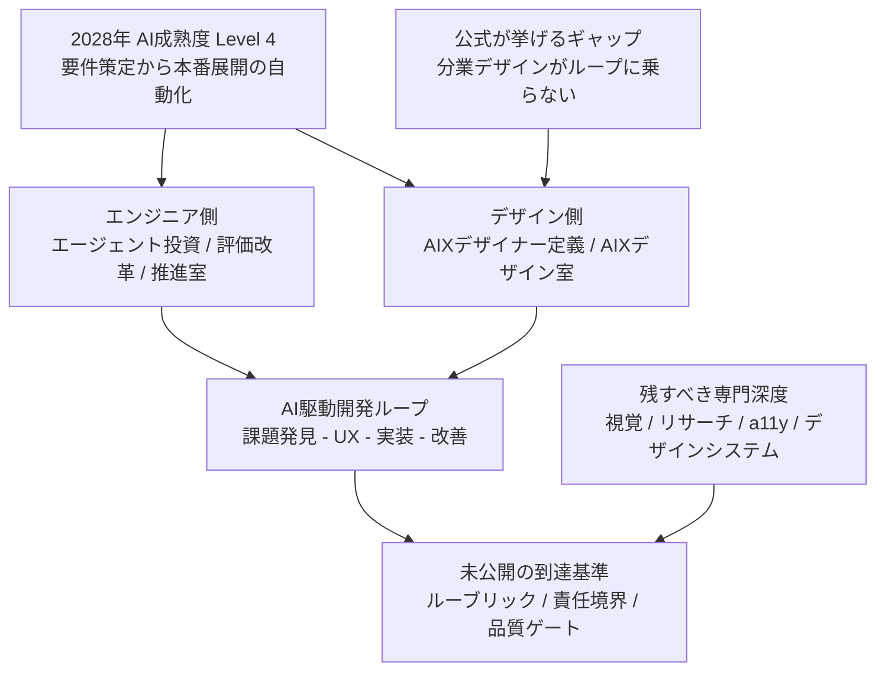

サイバーエージェントは 2026-08-21、AI駆動開発のループに参画し、課題発見からユーザー体験設計、動くプロダクトの実装・改善までを担う職を **AIX（AI eXperience）デザイナー** として定義し、その育成と習熟度評価を担う **AIXデザイン室** の設立を発表しました。

この記事では、発表の一次情報から「何が確定して、何がまだ書かれていないか」を切り分け、自社で同型の職能を作る側が持ち帰るべき設計上の判断点を整理します。読み終えたときに得られるのは、AIX という語そのものではなく、**役割定義・実案件育成・到達基準を同じサイクルで動かすための設計チェックリスト**です。

## 発表の骨格は「三点セット」である

今回の発表が単なる職名リリースと違うのは、次の3つを同時に出している点です。

1. **職能の一文定義** — 課題発見・UX設計・実装・改善を同一職が担う
2. **実践型の育成** — 社内選抜デザイナーによる約1か月の第1期
3. **習熟度評価の仕組み構築** — 到達基準を継続更新し、組織全体へ展開する

公式が固定している事実だけを並べると、次のようになります。

| 項目 | 内容 |
|---|---|
| 発表日 | 2026-08-21 |
| 職名 | AIX（AI eXperience）デザイナー |
| 職務範囲 | AI前提のプロセスに参画し、課題発見・UX設計から動くプロダクトの実装・改善まで |
| 組織の範囲 | スキルと役割の明確化、育成機会の提供、習熟度評価の仕組み |
| 第1期 | 社内選抜デザイナー、約1か月の実践型。AIエージェント開発プロセス、エンジニアリング基礎、実プロダクト開発 |
| 今後 | 育成・評価基準を継続更新し、組織全体へ展開 |

注意したいのは「実装」の語です。公式の文面は、プロトタイプ支援ではなく **動くプロダクトの実装・改善** と書いています。ただし到達レベル（本番コードの説明責任を負うのか、エージェント経由の試作までなのか）は定義されていません。この一語の解像度が、後述する品質ゲートの設計をそのまま左右します。

なお定義段落には「Al eXperience」という表記揺れが残っています。略語をラベルとして共有させたい場合、この種のゆらぎは検索と採用の両方で摩擦になります。

## なぜデザイン工程だったのか

背景には、同社が 2025-10 に公開した中期ビジョンがあります。プロダクト開発チームの AI成熟度を5段階に置き、**2028年に全プロダクトが最低でも Level 4** を目指すと宣言しています。Level 4 の定義は「要件策定から本番環境への展開まで、開発プロセスを完全に自動化している状態」です。

エンジニア領域では、この目標に向けた投資と制度改革が先行しています。

| 数値 | 条件 |
|---|---|
| 年間約4億円 | 2025-06 時点の開発AIエージェント導入投資**方針**。1年後には「当初計画を大幅に超える」とされ、実績上限ではない |
| 約1,200名 | 開発業務に携わるエンジニア。1人あたり月額200米ドルの導入費用サポート |
| 開発量 約2倍 | **一部の開発組織**のケース。全社平均ではない |
| モック 約3倍速 | **ゲーム部門**の事例。全社平均ではない |
| コード補完の採用回数 約75%減 | 1年間の変化。活用縮小ではなくエージェント中心への移行 |
| 生産性 約1.5倍 | エンジニア1人あたり。部署差あり |
| 約1,800名 | グループ所属エンジニア。うち約8割がソフトウェアエンジニア |

これらの数値は開発AIエージェント導入1年の振り返りに属するもので、AIXデザイナーの発表本文には登場しません。二次報道では「2倍 / 3倍」が AIX の文脈に混ざって流通していますが、根拠となる文書は別です。数値を引用するときは、どちらの発表に属する数字かを必ず確認してください。

AIXデザイナー発表が自ら挙げている課題は別のものです。**分業型のデザインが、短い企画〜実装〜改善のサイクルに乗らず、デザイン工程が AI駆動開発ループに十分組み込めない**という記述です。つまりエンジニア側の自動化だけでは 2028年の目標に届かないという判断が、デザイン側の組織新設につながっています。

構造として見ると、次の関係になります。

執行役員のクリエイティブ担当は、2016年から掲げる「クリエイティブで勝負する。」は変わらないとしたうえで、AI はクリエイティブの代替ではなく、人が本質的な価値創出に集中するための技術だと述べています。職能消滅論としてのメッセージではない点は、社内向けの設計意図として押さえておく価値があります。

## エンジニア側との非対称に、まだ埋まっていない部分がある

同じビジョンの両輪と位置づけられている一方で、公開されている粒度には差があります。エンジニア領域では、役割・育成・評価がすでに文書化されています。

- **評価** — 2019年からの全社共通キャリアプログラムを AI最適化した「2.0」として更新予定。評価制度上の職種は廃止して越境しやすくする一方、**深い専門性が不可欠な職種はスペシャリストとして存続**させ、実務上は職種を残すと明記しています。ジュニア・ミドルは品質担保スキル、上級シニア以上は領域越えという段階付けです。
- **育成** — 3層のリスキリングを経て、2025年新設の推進室が「AIナレッジ共有会」を運営。2025-10〜2026-04 に4回開催し、**延べ96プロダクトのキーパーソン**が参加しています。これは参加者の延べ数であり、96本のプロダクトが Level 4 に到達したという意味ではありません。
- **現場の型** — ハンズオンで示されたコアフローは **AIのプラン作成 → 人のプランレビュー → AI実行 → 人の結果確認**。公式の「完全自動化」より、人がゲートに残る形になっています。
- **二極化** — 第4回のアウトプットレポートでは、活用度が高いチームが3割超、効果を実感できていないチームも3割。後発チームの理由は「リソースが取れないうちに期日が来た」でした。

デザイナー側の公開物は、職名と1か月プログラム、そして「仕組みを構築する」という宣言までです。エンジニア側と同粒度の行動指標は、2026-08-23 時点では確認できませんでした。具体的には次が未公開です。

- 第1期の人数、選抜基準、修了判定、配属先での権限
- 「実装」が本番の説明責任なのか、エージェント経由の試作なのか
- 専門デザイナー（ビジュアル、リサーチ、デザインシステム、アクセシビリティ）とのレビュー権限の境界
- AIXデザイン室と、エンジニア側の推進組織との役割分担
- キャリアプログラム 2.0 のデザイナー適用有無
- デザイン工程の脱落を示す定量指標（待ち時間、手戻り）

もう1つ、読み違えやすい点があります。社内のチーム向け5段階と、公式の AI成熟度 Level 4 は**別系統の尺度**です。チーム側の Lv.4 は「開発プロセスの全ステップをAIが実行」、Lv.5 は「人間の介入がほとんどない」と定義されています。両者を同一視すると、達成度を過大に読むことになります。

## 「実装まで担うデザイナー」自体は新しくない

実装まで担う職能は、英語圏では Design Engineer / UX Engineer / Product Builder として既に存在します。今回の差分は、AI駆動開発ループを前提に**職能を一文で固定し、育成と習熟度評価を同じ組織に置いた**点です。

| 概念 | 人間のUX | エージェントがユーザー | 実装 | 育成・評価の組織化 |
|---|---|---|---|---|
| AIXデザイナー | する | 公式未記述 | する（動くプロダクト） | 室として宣言 |
| Design Engineer（Vercel / Adobe など） | する | 職務上はしない | する（本番または高忠実プロト） | 職能ブログ・JD。評価組織は未確認 |
| UX Engineer（Google） | する | 公式未確認 | フロントエンド / プロト | JDのみ |
| Designing with AI（NN/g の整理） | 間接 | しない | ツール利用 | — |
| Designing AI products（NN/g の整理） | する | しない | 製品デザイン | — |
| Agent Experience / AX | 間接 | **する** | API・機械可読層 | 用語提案 |
| Shopify の Designer 統合 | する | しない | 実装義務は公式メモに薄い | 評価にAI利用を追加 |

NN/g は 2026-06-05、「AI design」が少なくとも4つの向きに分岐したと整理し、**blanket な「AI designer」の JD をやめて、仕事の向きを名指しせよ**と書いています。この観点では、今回の一文定義は曖昧な「AIデザイナー」よりも具体的です。ただし4向きのどれか1つを選んだのではなく、「with AI」と「AI products」に **実装** を合成した形であり、向きを分けるという助言そのものとは一致しません。エージェント向けインフラやモデル挙動の設計は、公式定義に含まれていません。

日本では DeNA が 2026-03-06、2027年度新卒採用を「AIスペシャリスト」「AIジェネラリスト」の2コースへ再編すると発表しています。ジェネラリストはデザイナー職を含みますが、**採用時は各職種の枠組みで募集**し、入社後の職種横断を期待する形です。既存のデザイナー職をコースへ吸収した制度変更ではありません。

対照的なのが Shopify です。2025-04 の CEO メモで業績・ピア評価に AI 利用を組み込み、2025-06 には UX / Content Design のタイトルを Designer / Writer へ圧縮しています。一方は職能を細かく名指しし、もう一方はタイトルを粗くする。同じ「AI時代のデザイナー再定義」でも、ベクトルは逆向きです。

つまり業界に単一の正解はまだありません。**職能の新規定義に習熟度評価の専門組織を組み合わせる**という型自体は、他社で同等の公開例を見つけられませんでした。

## この設計のどこが折れて、どこが折れないか

三点セットという設計自体は、反証に耐えます。**ツール研修の配布ではなく、役割・実案件育成・到達基準の3つを同時に動かす**という構えは、AI を使えることだけでは足りないという課題設定と整合しています。社内でも、個人のリスキリングのあと「担当プロダクトでどう実践するかは別」として、共有会 → 実践 → アウトプットレポートで定着を測った先例があります。

折れるのは、次の3つの拡大解釈です。

### 横断人材を増やせばループの脱落が解消する

これは前提が一致しません。同社の技術担当は 2026-07-09、つまり AIX 発表の43日前に、定着後の経営課題を **レビュー負荷、AI前提ワークフローの再設計、コスト拡大とのバランス** と書いています。デザイン工程の脱落は設立理由の1つですが、開発側の主ボトルネックの記述とは一致していません。自社に当てはめる前に、自組織のボトルネックがどちらなのかを確認する必要があります。

また、同じ会社がエンジニア側では**職種フラット化とスペシャリスト存続を同時に**書いています。デザイナー側だけを横断一択にすると、両輪が非対称になります。

さらに、公式の「完全自動化」という表現と、人がプランと結果を見るコアフローは、そのままでは両立しません。第4回で観測された二極化も、人材の形状より整備負荷とリソース配分の問題を示しています。

### 1か月で実装まで担える

公式の記述は「習得を目指す」であり、習熟の測定結果は公開されていません。1か月は選抜と共通言語づくりの入口であって、習熟の証明ではありません。

実装を能力体系に入れるなら、品質ゲートが移動することも見ておく必要があります。Veracode の 2025 GenAI Code Security Report（2025-07-30）は、80タスク・100超の LLM を対象に、生成コードが OWASP Top 10 系の欠陥を導入する割合を **45%** と報告しています。Java ではセキュリティ失敗率が **70%超**、XSS（CWE-80）関連では防御の失敗が **86%** でした。これはラボ実験であり、本番リポジトリでの因果を示すものではありません。それでも「実装まで担う」評価を作る際、セキュアレビューの整備が後追いになりやすいことは想定に入れるべきです。

### 職能定義だけで現場の評価が動く

コンピテンシーを行動指標なしに置くと、評価者間のばらつきが安定しないという指摘は人事研究で繰り返されています。ラベルが先行した評価は、成果ではなく自己アピールの評価に落ちやすくなります。今回も、公開されているのは室の設立と方針までで、ルーブリックは出ていません。

加えて、AIX という略語自体が既存用法と衝突します。UNIX系OSの AIX、Agent Experience の AX、AI Experience Design が並走しており、公式本文の表記揺れもラベルの共有を弱めます。

## 自社に移すときの設計原則

発注者・経営側が持ち帰るべきなのは、職名ではなく次の5点です。

1. **職能を向き付きで名指しする** — ツール利用か、AI製品のUXか、実装横断か、エージェント向けインフラか。自社が今必要とする向きを分け、blanket な「AIデザイナー」は使わない。
2. **横断職は追加レーンにする** — 専門深度（視覚、リサーチ、アクセシビリティ、デザインシステム）の合格基準とキャリアを残す。エンジニア側がスペシャリストを残した対称性を、デザインでも先に書く。
3. **評価は実案件と品質ゲートを分ける** — 課題発見から改善までのリードは実案件で見る。実装を含めるなら、人によるプラン/結果レビューとセキュリティ欠陥率を別指標として持つ。ツール受講の完了を習熟としない。
4. **育成期間を到達と書かない** — 1か月は選抜と共通言語づくりの上限として扱う。習熟は配属後に間隔を置いて再測定する。
5. **公開前にルーブリックを8項目前後に固定する** — 行動指標、不合格条件、専門職の拒否権を先に出す。組織の設立発表だけでは現場の評価は動かない。

### この判断が逆転する条件

同型の職能を作らない方が良いケースもあります。

- **自社のボトルネックがデザイン待ちではなく、レビュー負荷とコストである場合** — 横断職より、評価とワークフローの再設計が先です。
- **プロダクトがブランド・規制・アクセシビリティの深度で差別化している場合** — Design Engineer レーンは少数に限り、専門職を主軸に据えます。
- **実装の説明責任をデザイナーへ寄せる法務・セキュリティ体制が無い場合** — 職務範囲の上限を「動くプロト」までに置きます。

### 明日から着手できる3つ

1. 自組織のデザイナー業務を、NN/g の4向きと「実装の有無」で棚卸しする。
2. 既存の専門職キャリアを残す一文を、横断職の定義より先に書く。
3. 到達基準の草案を「実案件の成果 / レビュー品質 / セキュリティ欠陥」の3列で作る。ツール研修のカリキュラムから始めない。

## まとめ

- サイバーエージェントの発表は、職名の新設ではなく **職能定義・実践育成・習熟度評価の三点セット**として設計されています。背景は 2028年に全プロダクトを AI成熟度 Level 4 へ到達させる目標で、エンジニア側の自動化だけでは届かないという判断があります。
- 一方で、ルーブリック、専門職との責任境界、「実装」の到達レベルは 2026-08-23 時点で公開されていません。エンジニア側が評価・育成を文書化済みであるのに対し、デザイナー側は宣言までという非対称が残っています。
- 自社へ移すなら、職能を向き付きで名指しし、横断職を追加レーンとして専門職の合格基準を残し、実案件の成果と品質ゲートを別指標で持つ設計が先です。ルーブリックと境界を先に書けないなら、職名の発表は採用コミュニケーションにとどまります。
- 引用の際は、開発AIエージェント導入1年の振り返りにある数値（2倍・3倍など）と、今回のデザイナー職の発表を混ぜないよう注意してください。二次報道では混在が起きています。

この記事が少しでも参考になった、あるいは改善点などがあれば、ぜひリアクションやコメント、SNSでのシェアをいただけると励みになります！

## 参考リンク

一次情報:

- [サイバーエージェント, AI時代の新たなデザイナー像「AIXデザイナー」を定義, 2026-08-21](https://www.cyberagent.co.jp/news/detail/id=33737)
- [サイバーエージェント, 数字で振り返る、開発AIエージェント導入支援から1年, 2026-07-09](https://www.cyberagent.co.jp/news/detail/id=33582)
- [CyberAgent Way, 2028年までに全社の開発プロセスを自動化する, 2025-10-22](https://www.cyberagent.co.jp/way/list/detail/id=32624)
- [片岡, 要件策定から本番環境への展開までの完全自動化を目指して96プロダクトのAI活用力を強化した話, CyberAgent Developers Blog, 2026-07-20](https://developers.cyberagent.co.jp/blog/archives/64511/)
- [Veracode, AI-Generated Code Poses Major Security Risks in Nearly Half of All Development Tasks, 2025-07-30](https://www.veracode.com/press-release/ai-generated-code-poses-major-security-risks-in-nearly-half-of-all-development-tasks-veracode-research-reveals/)
- [Sarah Gibbons, The Four Design Jobs AI Created (So Far), NN/g, 2026-06-05](https://www.nngroup.com/articles/design-jobs-ai-created/)
- [DeNA ニュースリリース, 2026-03-06](https://dena.com/jp/news/5359/)

比較・反証の補助:

- [Vercel, Design Engineering at Vercel, 2024-03-29](https://vercel.com/blog/design-engineering-at-vercel)
- [Adobe Design, Should you pursue a career in design engineering, 2024-07-30](https://adobe.design/stories/leading-design/should-you-pursue-a-career-in-design-engineering)
- [CWE-80](https://cwe.mitre.org/data/definitions/80.html)
- [KAI-YOU, 2026-08-21](https://kai-you.net/article/96321)
