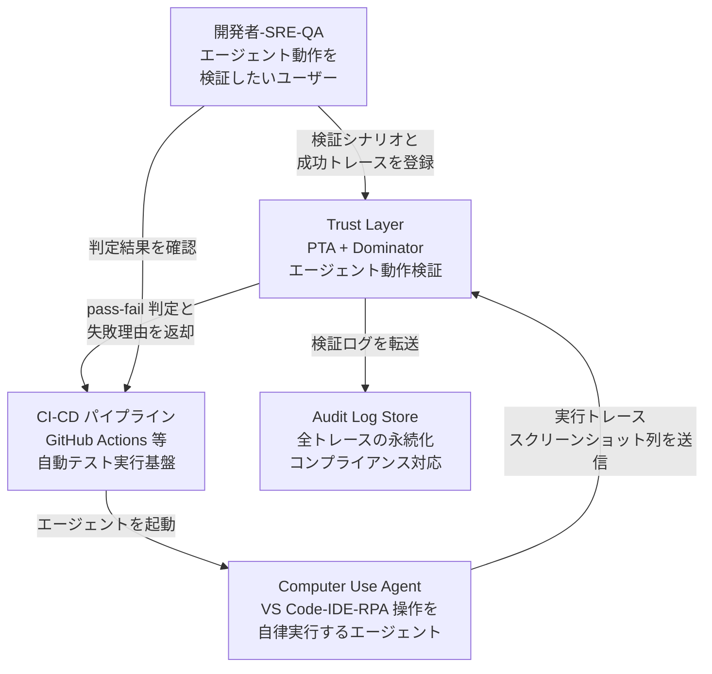
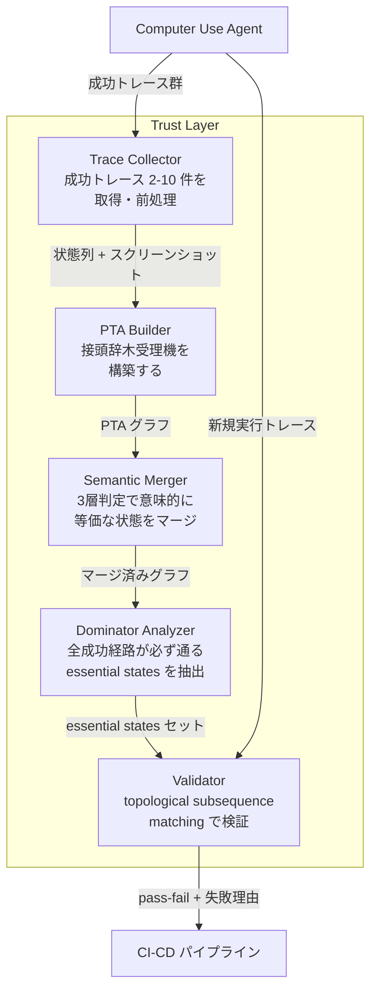
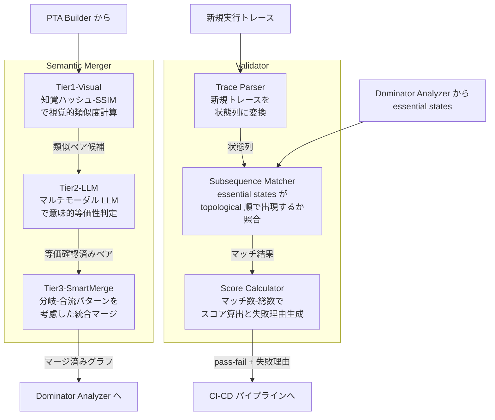
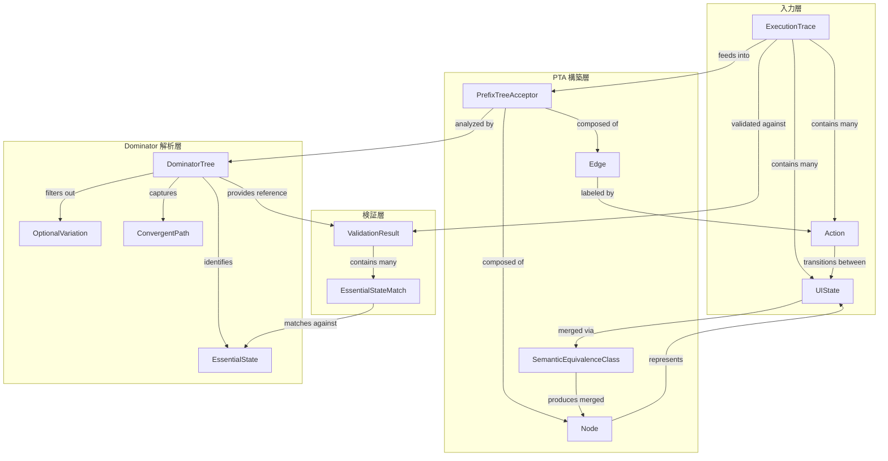
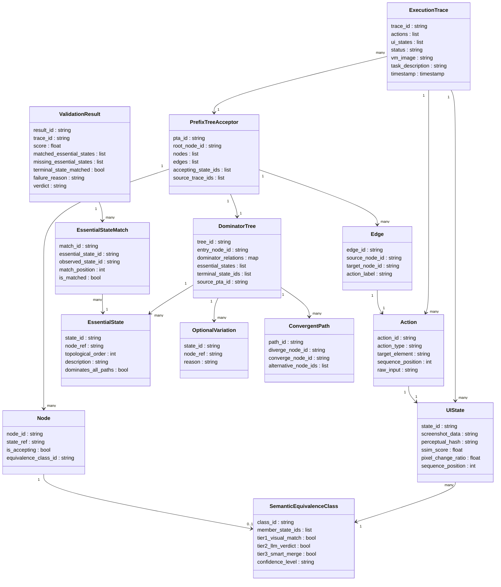

> 対象: arXiv 2605.03159 "Learning Correct Behavior from Examples: Validating Sequential Execution in Autonomous Agents" (Sharma (University of Washington / Microsoft Code|AI インターン), Mittal, Hu (Microsoft Redmond), 2026-05-04) と GitHub Blog 紹介記事 (2026-05-06)
> 検証日: 2026-05-08

## 概要

### 解こうとしている問題

AI エージェントが UI を操作したり、Computer Use でファイルを書き換えたりするとき、同じ目標を達成するための経路は毎回異なります。ローディング画面の有無、ホットキー操作かメニュー選択か、再試行の有無など、成功に無関係な揺らぎが大量に発生します。

従来の E2E テスト (アサーション型・記録再生・ビジュアル回帰・ML oracle) は操作ステップの完全一致を前提とします。そのため、エージェントが正しく成功している場合でも「失敗」と判定する偽陰性を量産します。GitHub Blog はこれを「The agent didn't fail. The validation did.」と表現しています。

論文が解こうとする核心は次の問いです。

> 非決定的に振る舞うエージェントにとって「正しさ」とは何か。そして、それを少数の成功例から自動的に学習して検証できないか。

### 提案手法の中心アイデア

Microsoft Code | AI の Sharma / Mittal / Hu は、従来の「ステップ一致」から「必須状態の到達」へと検証の軸を転換しました。提案パイプラインは3段階で構成されます。

第1段階 - **PTA (Prefix Tree Acceptor) 構築**: 2〜10 個の成功実行トレースを共通接頭辞で共有するトライ構造 (DFA) に変換します。Grammatical Inference の枠組みでは標準的な初期構造にあたり、観測された成功経路を過学習的に記憶した「最も特殊な受理機」です (論文自体は Grammatical Inference という語を前面には出しませんが、構成は同等)。

第2段階 - **マルチモーダル LLM による3層状態マージ**: 意味的に等価な状態 (例: 異なる外見でも同じ「検索ダイアログが開いた」状態) を以下の3層で統合します。

| 層 | 判定方式 | 役割 |
|---|---|---|
| Tier 1 | 視覚メトリクス (perceptual hash・SSIM・pixel change ratio) | 外見が同一な状態を高速統合 |
| Tier 2 | LLM による意味的等価性判定 | 外見が異なっても意味が同じ状態を統合 |
| Tier 3 | 分岐・合流を許す smart merging | 複数経路の合流点を正しく扱う |

第3段階 - **Dominator Analysis + Topological Subsequence Matching**: マージ済みグラフにコンパイラ最適化の支配関係解析 (Lengauer-Tarjan 1979) を適用し、すべての成功経路が必ず通る essential states (必須通過点) を抽出します。検証は「新規実行が essential states を topological order で含む subsequence として現れるか」で判定します。

```
成功トレース例: A -> X -> B -> Y -> C
essential states: A, B, C (X, Y はオプション変動として無視)
-> A, B, C が規定順序で出現すれば合格
```

失敗時は「検索ダイアログ後に検索結果に到達せず」のように具体的な失敗箇所を出力します。

## 特徴

### 1. 「正しさ」を3カテゴリで構造化

論文は実行状態を次の3カテゴリに分類します。これが従来手法との最大の違いです。

| カテゴリ | 例 | 検証での扱い |
|---|---|---|
| Essential States | 検索ダイアログを開く、検索結果が表示される | 必須通過点として検証 |
| Optional Variations | ローディング画面の有無、ツールチップ表示 | 無視 (揺らぎ吸収) |
| Convergent Paths | ホットキー操作 vs メニュー選択 | 同等として許容 |

### 2. 少数の成功例から学習 (2〜10 トレース)

論文の実験ではわずか3トレースから dominator tree を構築し、25 トレースの評価セットで 100% F1 を達成しました。人手で評価関数を書く WebArena 方式のコストを、トレースからの自動学習で圧縮しているとも言えます。

### 3. 既存手法を大幅に上回る定量結果 (論文 Table 1)

VS Code 拡張機能シナリオ、3 traces 学習、25 traces 評価 (passing 11件 / failing 14件、うち Agent Issue 3件・Product Bug 11件):

| メトリクス | CUA 自己評価 | 提案手法 (PTA + Dominator) |
|---|---|---|
| Accuracy | 82.2% | 100% |
| Precision | 83.3% | 100% |
| Recall | 60.0% | 100% |
| F1 | 69.8% | 100% |

Not-a-Bug 判別 (エージェント問題 vs 製品バグの分類):

| シナリオ | CUA 自己評価 | 提案手法 |
|---|---|---|
| Not-a-Bug 全体 F1 | 0% (完全に判別不能) | 52.2% |
| Agent Issue 検出 (3件) | — | 33.3% (1件正解) |
| Product Bug 検出 (11件) | — | 72.7% (8件正解) |

### 4. コンパイラ理論の転用による説明可能性

Dominator Analysis はコンパイラ最適化 (SSA 変換、ループ検出) で確立された手法です。その転用により「なぜこの状態が必須か」を支配木として可視化できます。ブラックボックスの ML oracle と異なり説明可能性が高まります。

### 5. 状態到達ベースで経路依存を排除

検証は「経路が同一か」ではなく「必須状態に到達したか」で判定します。これにより、エージェントがホットキーを使おうとメニューを使おうと、成功していれば合格となり、偽陰性を排除できます。

### 6. 独立した Trust Layer として機能

論文はこの検証器をエージェント本体から独立した Trust Layer として設計しています。エージェントが自己評価するのではなく、外部の参照モデルが判定するため、自己評価バイアスを構造的に排除します。

### 7. CI/CD への統合適性

offline (回帰テスト) フェーズで成功トレースから essential states を学習し、online (本番 CI) フェーズで新規トレースを topological subsequence match するという流れは、既存の評価基盤 (LangSmith、Braintrust、DeepEval) の scorer として組み込みやすい設計です。

### 8. 限界も明確に認識

- グラフ爆発と実行コスト (実験は 28 トレースのみ、大規模未検証)
- Tier 2 の LLM 判定が LLM-as-Judge バイアスを継承する可能性
- 失敗トレースからの学習には未対応 (今後の課題として言及)
- 規制要件 (HIPAA・SOX・EU AI Act 高リスク AI) が必要とする全経路保存とは相性が悪い

### 関連手法との比較

| 手法 | 精度 (揺らぎあり環境) | 揺らぎ耐性 | 学習サンプル数 | 説明可能性 |
|---|---|---|---|---|
| アサーション型 | 低 (偽陰性多) | × | 0 (手書き) | ○ (ルール明示) |
| 記録再生 | 低 (偽陰性多) | × | 1 (記録1回) | △ |
| ビジュアル回帰 | 低 (外見差分に敏感) | × | 1 (スナップショット) | × |
| ML oracle (LLM-as-Judge) | 中 (バイアスあり) | △ | 不要 (ゼロショット) | × |
| PTA + Dominator (本手法) | 高 (F1 100%) | ◎ | 2〜10 (成功トレース) | ○ (支配木で可視化) |

## 構造

提案フレームワーク Trust Layer の論理構造を C4 model 3 段階で描きます。

### システムコンテキスト図



| 要素名 | 説明 |
|---|---|
| 開発者-SRE-QA | エージェントタスクの正しい振る舞いを定義し、検証結果を受け取る人間のアクター |
| Computer Use Agent | VS Code / IDE / RPA ツールを自律操作し、実行トレース (スクリーンショット列+アクション列) を生成するエージェント |
| CI-CD パイプライン | GitHub Actions 等。エージェントを起動し、Trust Layer からの pass/fail 判定を受け取ってビルドゲートに使う |
| Audit Log Store | 全実行トレースを完全保存。PTA がフィルタする前のデータを保持し、規制対応の監査に備える |
| Trust Layer | 本論文が提案するフレームワーク。成功トレースから正解モデルを構築し、新規実行を検証する |

### コンテナ図



| 要素名 | 説明 |
|---|---|
| Trace Collector | Computer Use Agent の成功実行トレースを 2〜10 件収集・前処理する。スクリーンショットとアクション列をペアで管理 |
| PTA Builder | 収集した成功トレース集合 S+ から Prefix Tree Acceptor (DFA) を構築する。共通接頭辞を共有するトライ構造で、S+ を過不足なく受理する最も特殊な受理機 |
| Semantic Merger | PTA のノードを3層判定 (Tier1 視覚 / Tier2 LLM / Tier3 smart merging) でマージし、意味的に等価な状態を統合してローカルな揺らぎを吸収する |
| Dominator Analyzer | マージ済みグラフに Dominator Analysis を適用し、エントリから受理状態に至る全経路が必ず通る essential states を抽出する |
| Validator | essential states を参照モデルとして、新規実行トレースが topological order を守る subsequence として essential states を含むかを判定する |

### コンポーネント図



#### Semantic Merger 要素一覧

| 要素名 | 説明 |
|---|---|
| Tier1-Visual | 知覚ハッシュと SSIM を用いてスクリーンショット間の視覚的類似度を計算する。高速フィルタとして機能し、明らかに異なる状態を早期除外する |
| Tier2-LLM | マルチモーダル LLM にスクリーンショットとアクションを入力し、状態が意味的に等価かを判定する。Tier1 で類似候補に絞られたペアを精査する |
| Tier3-SmartMerge | 単純な 1 対 1 マッチングではなく、分岐と合流を許容するマージを行う。ローディング画面のような通過状態を吸収する |

#### Validator 要素一覧

| 要素名 | 説明 |
|---|---|
| Trace Parser | Computer Use Agent の新規実行トレースを、Semantic Merger と同じ表現の状態列に変換する |
| Subsequence Matcher | essential states のリストを参照モデルとして、新規トレースの状態列に essential states が topological 順で部分列として出現するかを照合する。間に余分な状態が挟まっても合格とする |
| Score Calculator | マッチした essential states 数 / 参照モデルの essential states 総数でスコアを算出する。不合格の場合は具体的な失敗理由を生成する |

## データ

### 概念モデル

提案手法が扱う主要エンティティとその関係を示します。所有関係を subgraph で、利用関係を矢印で表現します。



| 要素名 | 説明 |
|---|---|
| ExecutionTrace | エージェントの 1 回の実行を表す。アクション列と UI 状態列のペア |
| Action | クリック・キー入力等の単一アクション |
| UIState | スクリーンショットで表される一時点の状態 |
| PrefixTreeAcceptor | 成功トレース集合 S+ から構築される DFA |
| Node | PTA の状態。マージされると等価クラスを参照する |
| Edge | アクションでラベル付けされた状態間の遷移 |
| SemanticEquivalenceClass | 3層判定でマージされた状態の同値クラス |
| DominatorTree | マージ済みグラフから抽出した支配関係の木 |
| EssentialState | 全成功経路が必ず通る必須通過点 |
| OptionalVariation | 必須でない通過状態 (ローディング画面など) |
| ConvergentPath | 同一状態に合流する複数経路 |
| ValidationResult | 新規トレースの検証結果 |
| EssentialStateMatch | essential state ごとの一致記録 |

### 情報モデル

主要エンティティの属性を示します。論文に明示されていない属性は「※推測」と注記します。



#### 属性の補足

ExecutionTrace は trace_id・timestamp・task_description が論文記述から推測の属性です。PrefixTreeAcceptor の source_trace_ids も同様です。DominatorTree の dominator_relations / essential_states / terminal_state_ids は論文 §3.2 で明示されています。ValidationResult の score / matched_essential_states / missing_essential_states / failure_reason は論文 §3.3 に明示で、verdict は推測です。

## 構築方法

> **注記**: 論文 (arXiv 2605.03159) はアルゴリズムと評価結果を記述しており、参照実装 (リポジトリ等) は公開されていません。以下の「セットアップステップ」「コード例」「CI YAML 例」は実装案であり、論文のアルゴリズム記述と下記ライブラリのドキュメントを元に補完しています。補完元は各箇所に明示します。

### 前提条件

- マルチモーダル LLM API: GPT-4V / GPT-5.1 / Claude 3.5 Sonnet など (Tier 2 セマンティック判定に使用)
- Computer Use 実行環境: VS Code + xvfb (Linux VM)、または Docker + VNC など GUI をキャプチャできる環境
- Python 3.10+
- ネットワーク: LLM API へのアクセス権限

### ステップ 1: トレース収集環境の準備

実装案 - Docker Compose 例 (補完元: Docker 公式 / xvfb-run)

```yaml
version: "3.9"
services:
  agent-runner:
    image: mcr.microsoft.com/devcontainers/universal:2-linux
    environment:
      - DISPLAY=:99
      - OPENAI_API_KEY=${OPENAI_API_KEY}
    volumes:
      - ./traces:/workspace/traces
      - ./scripts:/workspace/scripts
    command: >
      bash -c "
        Xvfb :99 -screen 0 1280x800x24 &
        sleep 1
        python /workspace/scripts/collect_traces.py
      "
    shm_size: "2gb"
```

トレース収集ディレクトリ構成:

```
traces/
├── run_001/
│   ├── states/          # スクリーンショット (PNG)
│   ├── actions.jsonl    # アクションログ
│   └── metadata.json    # 実行メタデータ
├── run_002/
│   └── ...
└── reference/           # 学習用成功トレース (3-10 件)
```

### ステップ 2: 視覚メトリクスライブラリのインストール

```bash
pip install imagehash scikit-image networkx openai pillow
```

| ライブラリ | 用途 |
|---|---|
| imagehash | Tier 1 perceptual hashing (pHash/dHash) |
| scikit-image | Tier 1 SSIM 計算 |
| networkx | PTA 構築・Dominator Analysis |
| openai | Tier 2 LLM セマンティック判定 |

### ステップ 3: PTA Builder 雛形

実装案 (補完元: networkx 公式 / 論文 Algorithm 1)

```python
# pta_builder.py — 実装案
import networkx as nx
import imagehash
import json
from pathlib import Path
from PIL import Image
from skimage.metrics import structural_similarity as ssim
import numpy as np
import openai

class State:
    def __init__(self, state_id: str, screenshot_path: str, action: dict):
        self.state_id = state_id
        self.screenshot_path = screenshot_path
        self.action = action
        self.phash = imagehash.phash(Image.open(screenshot_path))

class PTABuilder:
    PHASH_THRESHOLD = 10
    SSIM_THRESHOLD = 0.95

    def __init__(self, llm_client: openai.OpenAI, model: str = "gpt-4o"):
        self.graph = nx.DiGraph()
        self.llm_client = llm_client
        self.model = model
        self._node_counter = 0

    def add_trace(self, trace_dir: Path) -> None:
        actions = self._load_actions(trace_dir / "actions.jsonl")
        states = sorted((trace_dir / "states").glob("*.png"))
        prev_node = "START"
        if not self.graph.has_node("START"):
            self.graph.add_node("START", label="start")
        for img_path, action in zip(states, actions):
            state = State(f"s{self._node_counter}", str(img_path), action)
            merged_node = self._find_equivalent_node(state)
            if merged_node is None:
                self.graph.add_node(state.state_id, state=state)
                merged_node = state.state_id
                self._node_counter += 1
            self.graph.add_edge(prev_node, merged_node, action=action)
            prev_node = merged_node
        self.graph.add_edge(prev_node, "END")

    def _tier1_visual_match(self, a: State, b: State) -> bool:
        if abs(a.phash - b.phash) <= self.PHASH_THRESHOLD:
            return True
        img_a = np.array(Image.open(a.screenshot_path).convert("L"))
        img_b = np.array(Image.open(b.screenshot_path).convert("L"))
        if img_a.shape == img_b.shape:
            score, _ = ssim(img_a, img_b, full=True)
            if score >= self.SSIM_THRESHOLD:
                return True
        return False
```

## 利用方法

### Dominator Analysis

実装案 (補完元: networkx.algorithms.dominance)。PTA マージ後グラフは DAG 前提で動作します。Tier3 マージでサイクルが生じる場合は別途対処が必要です。

```python
# dominator_analysis.py — 実装案
import networkx as nx

def extract_essential_states(graph: nx.DiGraph, start: str = "START") -> list[str]:
    idom = nx.immediate_dominators(graph, start)
    terminal_states = [n for n in graph.nodes if graph.out_degree(n) == 0]
    essential = set()
    for terminal in terminal_states:
        current = terminal
        while current != start:
            essential.add(current)
            current = idom.get(current, start)
    return [n for n in nx.topological_sort(graph) if n in essential]
```

### Validation

新規トレースを essential states 列でマッチします。

```python
# validate.py — 実装案
def topological_subsequence_match(test_states, essential_states, graph, threshold=1.0):
    matched = []
    ptr = 0
    for test_state in test_states:
        if ptr >= len(essential_states):
            break
        target_node = essential_states[ptr]
        target_state = graph.nodes[target_node].get("state")
        if target_state and _states_match(test_state, target_state, graph):
            matched.append(target_node)
            ptr += 1
    missing = essential_states[ptr:]
    coverage = len(matched) / len(essential_states) if essential_states else 0.0
    passed = coverage >= threshold and len(missing) == 0
    return {
        "passed": passed,
        "coverage": coverage,
        "matched_states": matched,
        "missing_states": missing,
        "failure_reason": None if passed else f"Missing essential states: {missing}",
    }
```

### CI 統合 - GitHub Actions

実装案 (補完元: GitHub Actions 公式 / DeepEval pytest 統合)

```yaml
# .github/workflows/agent-validation.yml — 実装案
name: Agent Behavior Validation
on:
  pull_request:
    branches: [main]
  schedule:
    - cron: "0 2 * * *"

jobs:
  agent-validation:
    runs-on: ubuntu-latest
    timeout-minutes: 30
    env:
      OPENAI_API_KEY: ${{ secrets.OPENAI_API_KEY }}
      DISPLAY: ":99"
    steps:
      - uses: actions/checkout@v4
      - uses: actions/setup-python@v5
        with:
          python-version: "3.11"
      - run: pip install imagehash scikit-image networkx openai pillow pytest deepeval
      - run: |
          sudo apt-get install -y xvfb
          Xvfb :99 -screen 0 1280x800x24 &
      - run: python scripts/build_pta.py --trace-dir traces/reference --output pta_model.pkl
      - run: |
          for i in 1 2 3 4 5; do
            python agent.py --task search_flow --output traces/ci_run_${i}/ || true
          done
      - run: |
          pytest tests/test_agent_validation.py \
            --pta-model pta_model.pkl \
            --trace-dir traces/ci_run_* \
            --min-pass-rate 0.8 -v
      - if: always()
        uses: actions/upload-artifact@v4
        with:
          name: agent-traces
          path: traces/ci_run_*/
```

### 受け入れ基準 DSL 例

```yaml
# acceptance_criteria.yml
scenario: "VS Code 検索フロー"
learning:
  trace_dir: "traces/reference"
  num_traces: 5
trials: 5
min_pass: 4
essential_states:
  - id: search_dialog_opened
    description: "検索ダイアログが開いた状態"
  - id: keyword_entered
    description: "検索キーワードが入力された状態"
  - id: search_results_displayed
    description: "検索結果一覧が表示された状態"
side_effects:
  file_reads:
    - pattern: "**/*.{ts,md}"
  api_calls:
    max_count: 1
invariants:
  - "no_file_modification"
  - "no_external_network_call_outside_allowlist"
  - "no_pii_in_response"
audit:
  record_full_trajectory: true
  retention_days: 90
```

## 運用

### トレース収集ループ

PTA は成功トレース集合 S+ から ground truth を構築します。アプリケーションの UI や API が変わるたびに参照モデルが陳腐化するため、リリースサイクルに合わせた収集・更新ループが必要です。

```
[Stable Release] -> 1. Smoke run (5-10回) -> 2. Trace 正規化
-> 3. PTA 再構築 -> 4. 参照モデルを Git 管理 -> 5. CI ベースライン切替
```

成功トレースはバージョン管理し、本番ログからの自動取り込みは「副作用が記録されている」前提で別レビューを挟みます。

### 再学習タイミング

UI が変更された場合、参照モデルを放置すると Essential State が不整合になります。

| シグナル | 判断基準 |
|---|---|
| 偽陽性率が急増 | 直近 N 件の CI 合格率が 20% 以上低下 |
| UI フレームワーク更新 | セマンティックハッシュのミスマッチ率が閾値超過 |
| 機能追加でフローが変化 | ルーティングや画面遷移の変更を確認 |
| ライブラリバージョンアップ | ローディングスピナー等の挿入を確認 |

### 監視メトリクス

| メトリクス | 意味 |
|---|---|
| PTA ノード数 | グラフ複雑度・マージ品質の指標 |
| LLM 呼び出しコスト | Tier2 セマンティックマージの費用 |
| 検証スコア (pass rate) | essential states 到達率の推移 |
| Tier1/2/3 振り分け比率 | 各 Tier の負荷バランス |

### CI ゲート設計

エージェント出力は非決定的なため、1 回の実行で pass/fail を確定させてはなりません。

```yaml
strategy:
  fail_on_non_essential: true
  pass_threshold: 0.80
  max_trials: 5
  adaptive_sampling: true
  timeout_per_trial: 120s

retry_policy:
  on_llm_timeout: retry_once
  on_essential_miss: no_retry
  on_flaky_optional: ignore
```

CI 分割の推奨:

| スイート | 頻度 | 規模 | 目的 |
|---|---|---|---|
| Smoke (pass@1) | PR ごと | 数十ケース | 高速リグレッション |
| Full eval (pass@5) | 夜間・リリース前 | 数百ケース | カバレッジ確保 |
| Adversarial suite | 週次 | 数十ケース | prompt injection・副作用異常検知 |

### マルチモーダル LLM コスト管理

1. Tier1 先行フィルタで全ペアの 60〜70% を解決 (経験則)
2. LLM 応答キャッシング (コンテンツハッシュをキー)
3. バッチ処理 (Anthropic Batch API 等) で並列発行

## ベストプラクティス

各項目は「誤解 → 反証 → 推奨」の構造で示します。

### BP-1: 「PTA 単独で Trust Layer が完成する」

**誤解**: PTA + Dominator を導入すれば Trust Layer が完結し、他の評価は不要。

**反証**: Galileo・LangChain・Google Cloud は outcome only 評価で真の失敗の 20〜40% を見逃すと一貫して報告しています。状態が正しく到達していても、途中で不要な API を叩く・誤ったデータを書き込んでから上書きするなど、副作用の失敗は最終状態から見えません。攻撃者がドミネータ外のサイドパスで損害を与えれば検査をすり抜けられます。

**推奨**: trajectory + outcome + side-effects + invariants の 4 軸を併用します。

```
PTA + Dominator        -> essential states 到達 (構造的)
LangSmith trajectory   -> ツール呼び出し列の部分一致
Side-effect monitoring -> DB diff / HTTP egress
Property assertions    -> invariants (PII 非漏洩、削除ツール未呼出等)
```

### BP-2: 「2〜10 トレースで ground truth が完成する」

**誤解**: 論文実験が 3 トレースで F1=100% を達成しているため少数で十分。

**反証**: 論文実験は VS Code Computer Use という controlled benchmark で、シナリオの多様性が意図的に制御されています。Few-shot learning の研究は「数サンプルでは過適合する」と一貫して結論づけています。長尾シナリオ (CAPTCHA・A/B テスト・エラーリカバリ) では essential なはずの状態がサンプル外となり、未観測と異常が判別不能になります。

**推奨**: シナリオ種別ごとに以下のトレース数を確保します。

| シナリオ種別 | 推奨トレース数 |
|---|---|
| happy path | 5〜10 件 |
| エラーリカバリ | 3〜5 件 |
| 代替経路 | 3〜5 件 |
| 長尾・エッジケース | 可能な限り追加 |

### BP-3: 「LLM-as-Judge は中立に判定する」

**誤解**: Tier2 セマンティックマージや essential 判定を LLM に委ねれば中立的な判定が得られる。

**反証**: LLM-as-Judge には position / verbosity / self-preference などのバイアスが報告されています (一次出典は本稿では未検証)。PTA のセマンティックマージと essential 判定が同一 LLM 系列に依存している場合、F1=100% は ground truth と評価器のトートロジーである可能性があります。

**推奨**:

- 別系統モデルを judge として使用 (ground truth 構築に使ったモデルとは異なるベンダー)
- 複数モデル多数決 (Claude + GPT-4o + Gemini など)
- 定期的な人間専門家とのキャリブレーション

### BP-4: 「監査ログは PTA で代替できる」

**誤解**: PTA が essential states を管理しているため個別の監査ログは不要。

**反証**: HIPAA の情報システム活動記録、SOX の統制証跡、EU AI Act 高リスク AI のイベントログは、用途に応じた監査可能性・トレーサビリティを求めます。PTA の Optional Variations は意図的に捨てる設計であり、ドミネータ外で何が起きたかは参照モデルに残りません。

**推奨**: 全 trajectory を audit log として別レイヤーに完全保存します。

```
Audit Log Layer  -- 全 trajectory を完全保存 (改竄耐性、タイムスタンプ付き)
PTA Layer        -- essential states のみ (CI 検証・表示用)
```

### BP-5: 「敵対的入力に対して PTA は頑健」

**誤解**: PTA が「正しい状態遷移」を学習しているため異常な入力は自動検出される。

**反証**: 状態到達ベースの判定器は同じスクリーンショットを見るため、攻撃者が「正解状態に見える画面」を出すだけで Trust Layer を欺けます。OWASP LLM Top 10 2025 で Prompt Injection が第 1 位、NCSC は「prompt injection は SQLi のように完治できない」と勧告しています。

**推奨**:

- 権限分離 (OpenFGA) で task-scoped delegation
- サンドボックス実行
- 入力・行動列の異常シグナルを部分的に併用 (想定外のクリック座標・API 呼び出しをシグナル化)

### BP-6: 「失敗トレースから挙動を学習できる」

**誤解**: 失敗したトレースも PTA に取り込めば、失敗パターンを自動学習できる。

**反証**: 論文は成功トレース (S+) のみから PTA を構築します。失敗トレースを混入させると dominator tree が崩れ essential states が誤判定されます。論文の Not-a-Bug 判別 F1 は 52.2% にとどまり、失敗原因の自動分類には限界があります。

**推奨**: 失敗トレースは PTA とは独立した regression set として別管理します。

```
S+ (成功トレース) -> PTA 構築 -> dominator tree
S- (失敗トレース) -> regression set -> スナップショット比較・root cause 分析
```

## トラブルシューティング

| 症状 | 原因 | 対処 |
|---|---|---|
| 偽陽性が多い | Optional Variation が essential state として残っている | Tier3 smart merging の閾値を緩める。Tier2 LLM prompt に「一時的な loading 画面は等価として扱う」旨を明記 |
| グラフ爆発で検証時間増 | トレース数過多または揺らぎが大きい | 収集トレース数を 5〜10 件に絞る。smart merge の閾値を調整。Tier1 の精度を上げて Tier2 呼び出しを減らす |
| LLM API レイテンシで CI タイムアウト | Tier2 LLM 呼び出しが直列処理 | バッチ API で並列発行。コンテンツハッシュでキャッシュ。timeout_per_trial を 120s 以上に設定 |
| Not-a-Bug 判別スコアが低い | 論文の上限が F1=52.2%、手法の限界 | 副作用列・ツール引数・エラーコードを補助シグナルに加える。Agent Issue 判別 (33.3%) は特に弱いため別軸で監視 |
| 監査要件で経路が再現できない | PTA が Optional Variations を捨てているため | PTA とは独立して全 trajectory を audit log に完全保存。PTA は表示・検証用の要約として位置づける |
| 新機能追加後に合格率が急落 | dominator tree が旧フローを参照 | UI 変更時の再構築フローを実施。旧モデルと新モデルの essential states diff をレビュー |
| セマンティックマージの誤判定 | Tier1/2 のルールがドメイン知識を反映していない | Tier2 LLM prompt に「タイムスタンプ・ランダム ID は無視、エラー文言は重要」などのドメインルールを明示。初回設定時に人間レビューを挟む |

## まとめ

非決定的な AI エージェントの検証は、操作ステップ完全一致を捨てて「essential states を topological order で踏むか」へ軸足を移すと、偽陰性を構造的に排除できます。Microsoft Code|AI が提案した PTA + Dominator は少数の成功トレースから Trust Layer を自動学習する強力な方法ですが、単独運用は副作用検知や監査要件・敵対的入力に弱く、trajectory + outcome + side-effects + invariants の 4 軸併用と全 trajectory の audit log 保存をセットにして実務に組み込むことが現実解です。

この記事が少しでも参考になった、あるいは改善点などがあれば、ぜひリアクションやコメント、SNSでのシェアをいただけると励みになります！

## 参考リンク

- 一次ソース
  - [Learning Correct Behavior from Examples (arXiv abstract)](https://arxiv.org/abs/2605.03159)
  - [論文 HTML 全文](https://arxiv.org/html/2605.03159)
  - [Validating agentic behavior when 'correct' isn't deterministic (GitHub Blog)](https://github.blog/ai-and-ml/generative-ai/validating-agentic-behavior-when-correct-isnt-deterministic/)
- 公式ドキュメント / ライブラリ
  - [networkx - dominance algorithms](https://networkx.org/documentation/stable/reference/algorithms/dominance.html)
  - [imagehash (PyPI)](https://pypi.org/project/ImageHash/)
  - [scikit-image - structural_similarity (SSIM)](https://scikit-image.org/docs/stable/api/skimage.metrics.html)
  - [DeepEval - pytest 統合 LLM 評価](https://deepeval.com/docs/introduction)
  - [GitHub Actions ドキュメント](https://docs.github.com/en/actions)
  - [OpenAI Vision API](https://platform.openai.com/docs/guides/vision)
- 関連記事 / 評価フレームワーク
  - [Anthropic - Demystifying evals for AI agents](https://www.anthropic.com/engineering/demystifying-evals-for-ai-agents)
  - [Google Cloud - A methodical approach to agent evaluation](https://cloud.google.com/blog/topics/developers-practitioners/a-methodical-approach-to-agent-evaluation)
  - [LangChain - Trajectories vs Outputs](https://www.langchain.com/articles/llm-evaluation-framework)
  - [Galileo - Agent Evaluation Framework](https://galileo.ai/blog/agent-evaluation-framework-metrics-rubrics-benchmarks)
  - [Galileo - Compliance & Audit Trails](https://galileo.ai/blog/ai-agent-compliance-governance-audit-trails-risk-management)
  - [OWASP LLM01:2025 Prompt Injection](https://genai.owasp.org/llmrisk/llm01-prompt-injection/)
  - [Zero-Permission Manipulation (arXiv 2601.12349)](https://arxiv.org/html/2601.12349)
  - [FINOS - Agent Decision Audit & Explainability](https://air-governance-framework.finos.org/mitigations/mi-21_agent-decision-audit-and-explainability.html)
  - [OpenFGA - Fine-grained AI agent authorization](https://www.squer.io/blog/beyond-api-keys-fine-grained-ai-agent-authorization-for-devops-with-openfga)
- 理論的背景
  - [Lengauer & Tarjan - A Fast Algorithm for Finding Dominators (DOI)](https://doi.org/10.1145/357062.357071)
  - [de la Higuera - Grammatical Inference (Cambridge UP, DOI)](https://doi.org/10.1017/CBO9781139194655)
