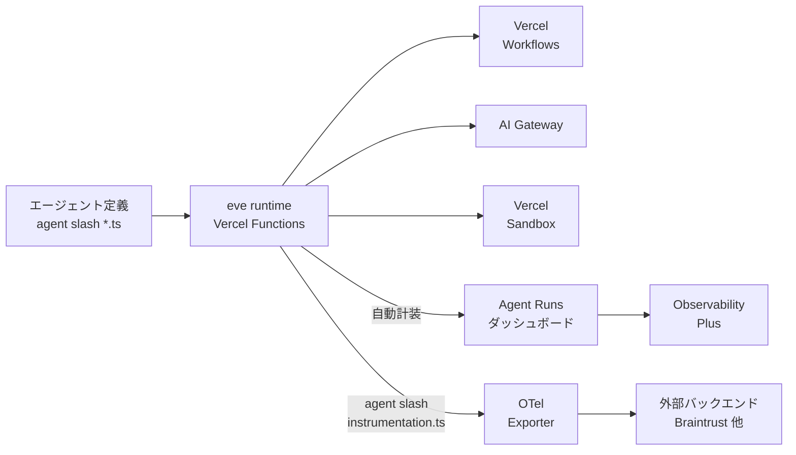
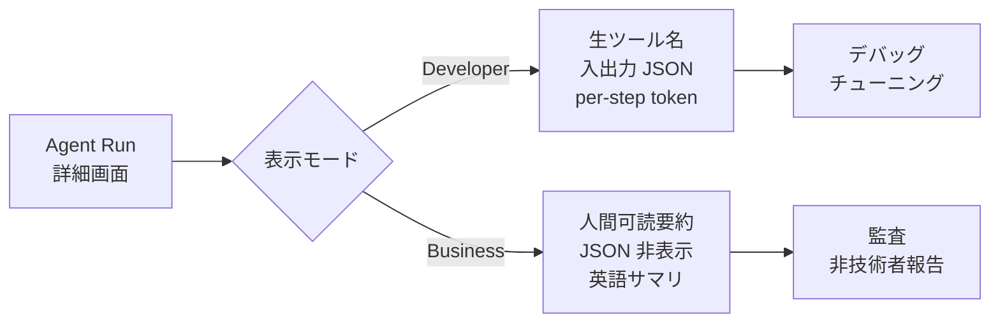
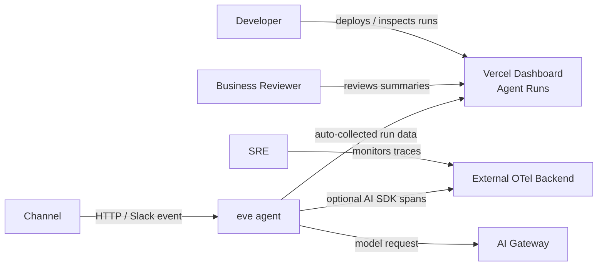
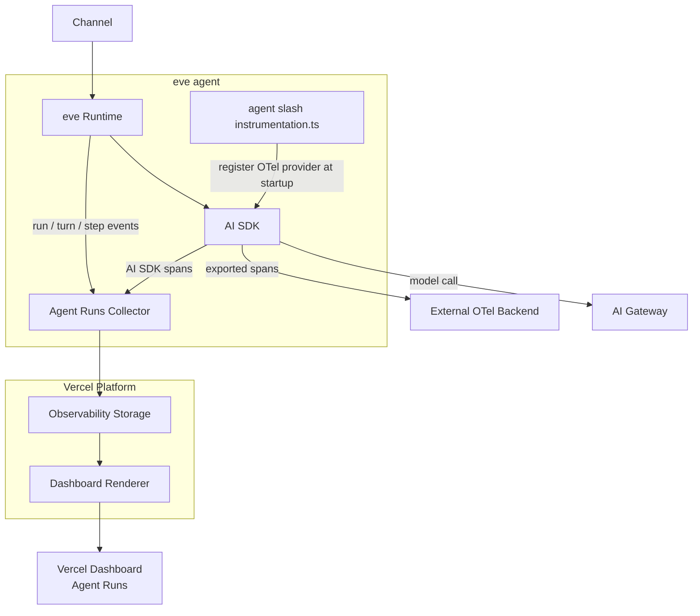
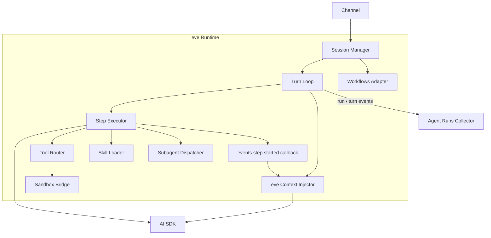
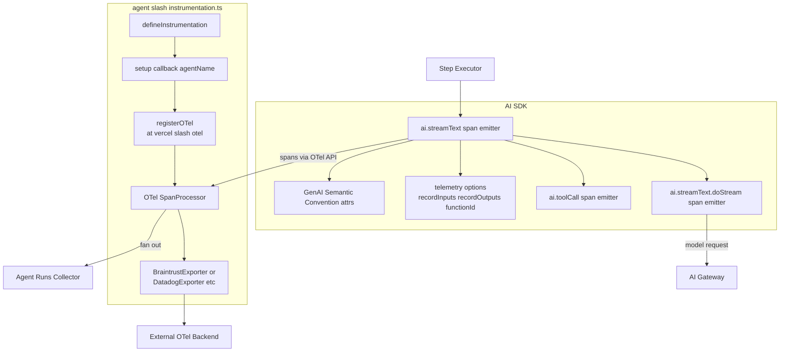
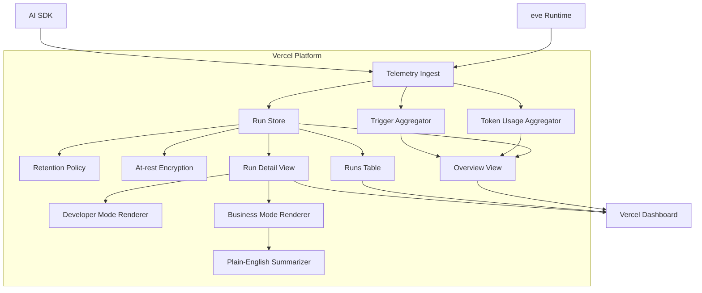
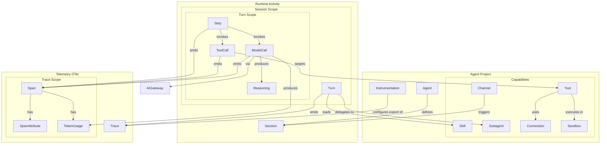
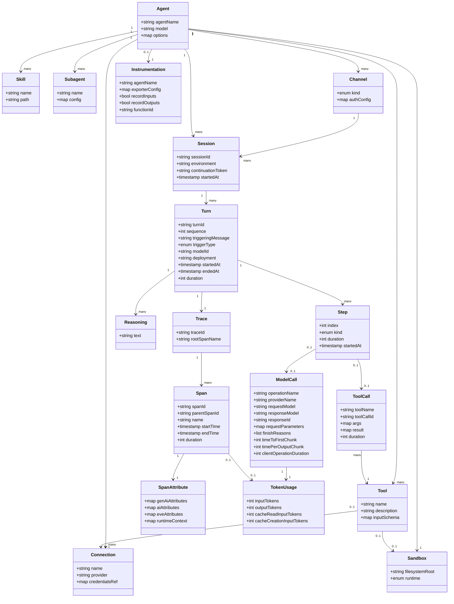

> 検証日: 2026-06-29 / 対象: Vercel eve `Agent Runs` (2026-06-26 Changelog 公開) + AI SDK OTel export
> AI SDK: 本記事のコード例は **eve 公式 docs が現状サンプルにしている v6 系 telemetry 記法** を基準にします (per-call プロパティ名は `experimental_telemetry`)。AI SDK v7 は 2026-06-25 に GA となり、`experimental_telemetry` → `telemetry` への改名に加え、`registerTelemetry` + `@ai-sdk/otel` という新しい起動時登録 API へ統合方式自体が刷新されました。eve のバージョンアップで v7 系統に切り替わると本記事のコード例も差し替えが必要です。最新の eve docs と AI SDK docs を必ず確認してください。

## ■概要

Vercel Agent Runs は、Vercel が 2026 年 6 月 26 日にアナウンスした **AI エージェント向けの観測ダッシュボード** です。AI エージェント runtime である `eve` 上でデプロイされたエージェントを対象に、Vercel ダッシュボードから **セッション・ターン・モデル呼び出し・ツール呼び出し・トークン消費** を可視化します。`eve` プロジェクトには **計装ファイルや設定なしで自動的に有効化** され、ダッシュボードに `Agent Runs` タブが現れます。

加えて、`agent/instrumentation.ts` を置くだけで **AI SDK の OpenTelemetry span を外部バックエンド (Braintrust / Datadog / Honeycomb / Arize / Raindrop / Jaeger など) にエクスポート** でき、既存の Observability 基盤に取り込めます。

### 位置づけ

`eve` は Vercel が打ち出した「ファイルシステムファーストな AI エージェント framework」で、`agent/` 配下のファイル (instructions / tools / skills / connections / sandbox 等) からエージェントを構成し、Vercel Functions 上で実行する仕組みです。`eve` は以下の Vercel サービスを内部で組み合わせます。

| 構成サービス | 役割 |
|---|---|
| Vercel Functions | エージェントコードの実行ランタイム |
| Vercel Workflows | セッション状態の永続化と中断再開 |
| Vercel Sandbox | コード実行の隔離 |
| AI Gateway | モデルリクエストのルーティングとフォールバック |
| Vercel Connect | OAuth トークン・API キー管理 |
| Vercel Observability | エージェントランの可視化 (= Agent Runs) |

Agent Runs は `eve` の標準観測面として位置づけられ、より広範な Vercel Observability (Functions / Edge / AI Gateway / External APIs などの Insights) の一部を構成します。Observability Plus アドオンを契約すると Agent Runs の保持期間も最大 30 日まで拡張されます。



| 要素 | 説明 |
|---|---|
| eve runtime | `agent/` ファイル群を Vercel Functions として実行します |
| Agent Runs ダッシュボード | セッション・ターン・トークンを自動表示します |
| OTel Exporter | `agent/instrumentation.ts` で起動時に登録します |
| 外部バックエンド | Braintrust / Datadog / Honeycomb / Arize / Jaeger など |
| Observability Plus | 保持期間延長と追加メトリクスを提供するアドオンです |

### 関連技術との関係

#### Vercel 内部スタックとの関係

| 要素 | Agent Runs との関係 |
|---|---|
| AI SDK telemetry | Agent Runs と OTel export はどちらも AI SDK 由来の span (`ai.streamText`, `ai.toolCall` 等) を利用します。Agent Runs は Vercel 内部で集約し、OTel export は外部に転送します |
| Vercel Tracing / Observability | Agent Runs は Observability 配下の専用タブです。Functions / External APIs / AI Gateway の Insights と同じ UI に統合されます |
| Vercel Drains | ログ・トレースを SIEM や Datadog 等に逃がす汎用機能です。OTel export はそれと別経路で AI SDK span だけを送ります |
| Observability Plus | Pro / Enterprise 契約者向けアドオンです。Agent Runs を含む保持期間を 30 日に拡張します |
| AI Gateway | モデル呼び出しの provider 抽象化を担います。AI Gateway 経由のリクエストは Agent Runs に統合表示されます |

#### サードパーティ Observability 製品との比較

Vercel Agent Runs は「Vercel にデプロイされた `eve` エージェント専用のゼロセットアップ観測層」で、Langfuse / Braintrust / LangSmith などの汎用 LLM observability とは設計思想が異なります。Agent Runs は競合ではなく **共存** を前提とし、OTel export 経由でこれらに span を流せます。

| 項目 | Vercel Agent Runs | AI SDK telemetry 単体 | Langfuse | Braintrust | LangSmith |
|---|---|---|---|---|---|
| 自動有効化 | あり (`eve` で完全自動) | 計装コード必要 | SDK 計装必要 | SDK 計装必要 | SDK 計装必要 |
| Two-view 設計 (Dev / Business) | あり | なし | なし | なし | なし |
| OTel export | あり (`agent/instrumentation.ts`) | 標準 | 受信可 | 受信可 | 限定的 |
| 保持期間 (無料) | 12h (Hobby) | 任意 (自前 backend) | プラン依存 | プラン依存 | プラン依存 |
| 保持期間 (有料上限) | 30 日 (Observability Plus) | 任意 | プラン依存 | プラン依存 | プラン依存 |
| ホスト形態 | Vercel マネージド | 任意 | OSS / クラウド | クラウド | クラウド |
| エージェント特化 UI | あり (ターン / ツール) | 汎用 span | 汎用 LLM trace | 汎用 LLM trace | AI SDK 公式 wrapper 連携あり |
| eval / プロンプト管理 | なし (観測のみ) | なし | あり | あり (deployment blocking) | あり |

要点は次の通りです。

- Agent Runs は「`eve` 標準の観測面」であり、計装やコード変更を不要にする点が他社製品と最も異なります。
- Two-view 設計 (Developer / Business) は Vercel 独自の差別化軸です。
- eval / プロンプト管理機能を備えないため、本格的な評価ワークフローが必要な場合は OTel export 経由で Braintrust / Langfuse 等と組み合わせる前提になります。

> **比較表の根拠について**: 上記の比較は Vercel changelog と公式ドキュメントを一次情報とし、ベンダー (Braintrust / Latitude / Laminar 等) の自社比較記事には宣伝バイアスがあるため参考リンクには載せても本文の比較項目の根拠には採用していません。料金・保持期間の最新値は必ず各社の現行 pricing ページで確認してください。

## ■特徴

### 主要な特徴一覧

- **計装不要の自動有効化**: `eve` プロジェクトであれば、`Agent Runs` タブが Vercel ダッシュボードに自動で出現します。インスツルメンテーションファイル不要、設定変更不要です。
- **Two-view 設計 (Developer / Business)**: デベロッパー向けの生データ表示と、非エンジニア向けの平易な要約を同一画面でトグル切り替えできます。技術者と監査・PM の両方が同じ画面で会話できます。
- **トリガー別の Runs 可視化**: Slack / HTTP などのトリガー種別ごとに、ランの本数とトークン消費を時系列グラフで表示します。
- **トークンメトリクスの内訳**: 入力トークン / 出力トークン / キャッシュトークンを分けて表示し、コスト最適化や AI Gateway 効果の検証に使えます。
- **ターン単位の詳細ドリルダウン**: 各ターンの timings (skill ロード、個別ツール呼び出し)、入出力、reasoning、ツール呼び出し引数 / 結果、トークン内訳を確認できます。
- **`agent/instrumentation.ts` による OTel export**: `defineInstrumentation()` の `setup` コールバックで `registerOTel()` を呼ぶだけで、Braintrust / Datadog / Honeycomb / Arize / Raindrop / Jaeger など OpenTelemetry 互換の任意のバックエンドに AI SDK span を流せます。
- **AI SDK span にエージェント文脈を自動注入**: `eve.session.id` / `eve.turn.id` / `eve.turn.sequence` / `eve.step.index` / `eve.channel.kind` / `eve.environment` / `eve.version` をスパン属性として付与し、外部バックエンドでのフィルタや相関を容易にします。
- **入出力記録のオプトアウト**: AI SDK の `recordInputs` / `recordOutputs` フラグでメッセージ履歴・モデル出力の記録を停止でき、機微情報やペイロードサイズへの対応が可能です。
- **保持データのデフォルト暗号化**: ランデータは保存時に暗号化されます。
- **プライバシー開示の要請**: 個人情報・規制対象データを扱う場合、デプロイ者はプライバシーポリシー等での開示義務を求められる旨が公式ドキュメントで明示されています。

### Developer view と Business view



| 表示モード | 想定読者 | 表示内容 | 主なユースケース |
|---|---|---|---|
| Developer | エンジニア | raw tool name, input / output JSON, per-step token count | デバッグ、回帰確認、コスト分析 |
| Business | PM / 監査 / 業務担当 | ツール名の人間可読化、JSON 非表示、実行内容の英語要約 | 監査対応、社内説明、非技術者レビュー |

### 保持期間 (tier 別)

| プラン | デフォルト Observability retention | Observability Plus アドオン |
|---|---|---|
| Hobby | 12 時間 | 利用不可 (Pro 化が必要) |
| Pro | 1 日 | 30 日 |
| Enterprise | 3 日 | 30 日 |

Observability Plus は Agent Runs 専用ではなく、Vercel Observability 全体の保持期間とメトリクス粒度を底上げするアドオンです。Pro / Enterprise 契約者で Agent Runs の長期分析が必要な場合、ここで延長します。

### トレース階層 (OTel export 時)

外部バックエンドにエクスポートした際の代表的なスパン構造は次の通りです。

```text
ai.eve.turn  {eve.session.id}
  +-- ai.streamText                step 1
  |    +-- ai.streamText.doStream  model call
  |    +-- ai.toolCall {search}    tool exec
  +-- ai.streamText                step 2
  |    +-- ai.streamText.doStream
  |    +-- ai.toolCall {read}
  +-- ai.streamText                step 3 (final text)
```

| スパン | 意味 |
|---|---|
| `ai.eve.turn` | 1 ターン全体 (親スパン) |
| `ai.streamText` | 1 ステップ (AI SDK 呼び出し) |
| `ai.streamText.doStream` | モデル呼び出し本体 |
| `ai.toolCall` | ツール実行 |

`events["step.started"]` コールバックから `runtimeContext` を返すことで、ユーザー定義の属性をモデルコールのスパンに付与できます。

### 機能スコープと「やらないこと」

Agent Runs は観測 (read-only) に特化しており、以下は範囲外です。これらが必要な場合は OTel export 経由で外部製品 (Braintrust 等) と組み合わせる前提になります。

| カテゴリ | Agent Runs | 補完手段 |
|---|---|---|
| トレース可視化 | あり | OTel export で外部にも転送可 |
| プロンプト管理 | なし | Braintrust / Langfuse / LangSmith |
| Eval / CI ブロッキング | なし | Braintrust が deployment blocking を提供 |
| ユーザーフィードバック収集 | なし | Langfuse / Braintrust 等 |
| アラート / SLO | Vercel Monitoring 側 | Datadog / Honeycomb 等 |

## ■構造

`eve` は Vercel が提供する filesystem-first な durable agent framework で、内部的に AI Gateway / Workflows / Sandbox / Connect / Observability を組み合わせます。Agent Runs はその Observability の正面玄関で、追加コードなしで Vercel ダッシュボードに表示される一方、`agent/instrumentation.ts` を置けば AI SDK の span を任意の OpenTelemetry backend に export できる、という二段構えになっています。

### ●システムコンテキスト図

`eve` agent そのものを 1 つのシステムとして扱い、誰が観測し、どこへ telemetry が流れるかを示します。



| 要素 | 説明 |
|---|---|
| Developer | `eve` agent をデプロイし、Agent Runs で動作確認とデバッグを行うエンジニア |
| Business Reviewer | Agent Runs の Business モードで非技術的な監査を行う担当者 |
| SRE | 外部 OTel backend (Datadog 等) でトレース・障害監視を行う運用担当 |
| Channel | HTTP / Slack など、外部イベントを agent の session / turn として送り込む入口 |
| eve agent | 観測対象本体。`agent/` 配下のファイルから compile された durable agent |
| Vercel Dashboard Agent Runs | `eve` project ごとに自動表示される一次観測面。instrumentation 不要 |
| External OTel Backend | `agent/instrumentation.ts` で接続する任意の OpenTelemetry 互換 backend |
| AI Gateway | model 呼び出しのルーティング・provider fallback を担う依存サービス |

### ●コンテナ図

`eve` agent システムの内部を、ランタイム・観測パイプライン・export 経路に分けて示します。



| 要素 | 説明 |
|---|---|
| eve Runtime | `agent/` を compile した実行ランタイム。session / turn / step / channel のライフサイクルを駆動し、tool 実行・skill ロード・subagent 委譲を統括 |
| AI SDK | model 呼び出しと tool 呼び出しを担う SDK 層。`ai.streamText` / `ai.streamText.doStream` / `ai.toolCall` 等の span を OpenTelemetry 形式で発行 |
| agent/instrumentation.ts | server 起動時に `eve` が自動 discover する optional ファイル。OpenTelemetry provider 登録のフックを提供 |
| Agent Runs Collector | `eve` runtime と AI SDK が出すイベント・span を内部収集するコンポーネント。常に有効、instrumentation 不要 |
| Observability Storage | 収集された run / turn / tool call / token usage を保持する Vercel 側のストレージ |
| Dashboard Renderer | Storage のデータを Runs over time・Token usage・Run 詳細として描画。Developer mode と Business mode の 2 表示を持つ |
| Vercel Dashboard Agent Runs | Renderer の出力を表示する UI |
| External OTel Backend | `agent/instrumentation.ts` で登録された exporter の送信先 |
| AI Gateway | model 呼び出し先。AI SDK が呼び出すため `ai.streamText.doStream` span の対象 |
| Channel | runtime に session / turn を発生させるトリガー入口 |

### ●コンポーネント図

主要 3 コンテナ (eve Runtime / AI SDK + Instrumentation / Vercel Platform observability 面) をドリルダウンします。

#### eve Runtime のコンポーネント



| 要素 | 説明 |
|---|---|
| Session Manager | HTTP / Channel から届いた message を session に紐付け、`x-eve-session-id` を発番し、durable session を生成・再 attach |
| Turn Loop | session 内の各 user message / external event を turn として駆動するメインループ。`ai.eve.turn` 親 span の単位 |
| Step Executor | turn を 1 つ以上の step (model 呼び出し + tool 呼び出し) に展開して実行。`eve.step.index` を採番 |
| Tool Router | `agent/tools/*.ts` で定義された tool 呼び出しを実行モジュールへ振り分け |
| Skill Loader | `agent/skills/*` の on-demand 手順を必要時にロード。Agent Runs の skill loads timing として観測 |
| Subagent Dispatcher | built-in agent tool または `agent/subagents/*` 経由の子 agent に focused subtask を委譲 |
| Sandbox Bridge | bash / read_file / write_file 等を Vercel Sandbox の microVM に橋渡し |
| Workflows Adapter | session 状態を Vercel Workflows の event log として永続化し、cold start / redeploy 越しに replay |
| eve Context Injector | `eve.version` / `eve.session.id` / `eve.environment` / `eve.turn.id` / `eve.turn.sequence` / `eve.step.index` / `eve.channel.kind` を span に注入 |
| events step.started callback | ユーザーが返す `runtimeContext` を model 呼び出し span に追加で乗せるためのフック |

#### AI SDK + OTel Instrumentation のコンポーネント



| 要素 | 説明 |
|---|---|
| ai.streamText span emitter | turn 内の各 step を表す親 span `ai.streamText` を発行 |
| ai.streamText.doStream span emitter | provider への 1 回の model 呼び出しを表す子 span |
| ai.toolCall span emitter | tool 実行を表す span。`toolName` 等の属性を持つ |
| telemetry options | `recordInputs` / `recordOutputs` / `functionId` の 3 つの記録粒度を制御 |
| GenAI Semantic Convention attrs | model provider・request header・runtime context・token usage 等を span に付与 |
| defineInstrumentation | `eve/instrumentation` が提供するヘルパー。`setup` を含む instrumentation 定義を export |
| setup callback | server 起動時に resolved `agentName` を受け取り、OTel provider を 1 度だけ登録 |
| registerOTel | `@vercel/otel` の登録関数。Node / Edge 両ランタイムで動く OTel SDK ラッパー |
| OTel SpanProcessor | AI SDK が OTel API 経由で発行した span をバッファリングして exporter へ流す |
| Exporter | 任意の OTLP / vendor 固有 exporter (Braintrust / Datadog / Honeycomb / Jaeger / Arize / Raindrop 等) |

#### Vercel Platform Observability 面のコンポーネント



| 要素 | 説明 |
|---|---|
| Telemetry Ingest | `eve` Runtime のイベントと AI SDK span を受け付ける収集口 |
| Run Store | run / turn / step / tool call / reasoning / input / output を構造化して保持するストア |
| Token Usage Aggregator | input / output / cached token を時系列に集計 |
| Trigger Aggregator | trigger 種別 (Slack / HTTP 等) ごとに run 件数を集計 |
| Retention Policy | plan に応じた保持期間制御 (Hobby 12h / Pro 1d / Enterprise 3d、Observability Plus で 30d) |
| At-rest Encryption | 既定でデータを暗号化保存 |
| Overview View | Runs over time / Token usage の時系列チャートを描画 |
| Runs Table | triggering message / trigger type / tokens in out / turn count / duration / time の一覧を描画 |
| Run Detail View | model / trigger / deployment と per-turn breakdown を描画 |
| Developer Mode Renderer | raw tool 名・input / output JSON・token メトリクスを表示する技術者向け表現 |
| Business Mode Renderer | tool 名を人間語化し、JSON を隠した監査向け表現 |
| Plain-English Summarizer | Business Mode の plain-English run summary を生成 |

## ■データ

Vercel Agent Runs が扱うエンティティを「概念モデル」と「情報モデル」の 2 段で整理します。`eve` ランタイムが生成するセッション / ターン / ステップの階層、AI SDK が出力する OTel span (GenAI 規約 / Legacy `ai.*`)、`eve` が span に注入するコンテキスト属性 (`eve.*`) が中心です。

### ●概念モデル

エンティティの所有関係 (subgraph) と利用関係 (矢印) を示します。



#### Agent Project

`eve` がファイルシステム配置から発見・コンパイルする論理単位です。`agent/` 配下のファイル群がそのまま能力 (Tool / Skill / Subagent / Channel / Connection / Sandbox) のレジストリになります。

| エンティティ | 役割 |
|---|---|
| Agent | `agent/agent.ts` で `defineAgent` した実体。`model` などランタイム設定を持ち、Session 起動時のテンプレートになる |
| Tool | `agent/tools/<name>.ts` の 1 ファイル = 1 ツール。filename がランタイム tool name になる |
| Skill | `agent/skills/*` のオンデマンド手順書 / 参考情報。Turn 中にモデルが必要に応じて load する |
| Subagent | `agent/subagents/*` の子エージェント。delegate で独立した会話履歴・state で動く |
| Channel | `agent/channels/*` の入口。HTTP / Slack 等プラットフォーム別の Session 起動口 |
| Connection | `agent/connections/*` の外部サービス連携。Vercel Connect で OAuth / API key を集中管理 |
| Sandbox | `agent/sandbox/*`。Agent ごとに 1 つの隔離 bash 実行環境 (Vercel Sandbox microVM) |
| Instrumentation | `agent/instrumentation.ts`。OTel provider を `setup({ agentName })` で登録 (任意) |

#### Runtime Activity

実行時に発生する動的エンティティです。所有階層は Session > Turn > Step です。

| エンティティ | 役割 |
|---|---|
| Session | Channel または HTTP で開始される durable な会話 / タスク。Vercel Workflows で永続化され cold start / redeploy をまたいで resume 可能 |
| Turn | Session 内の 1 単位 (ユーザーメッセージ or 外部イベント 1 件)。複数 Step を含む |
| Step | Turn 内の処理 1 ステップ。skill load / tool call / model call のいずれか |
| ToolCall | モデルが呼び出した typed action の 1 回。引数と結果を持つ |
| ModelCall | provider モデルへの 1 リクエスト。token 使用量と reasoning を生む |
| Reasoning | モデルが Turn 中に出した推論テキスト |

#### Telemetry

Agent Runs 画面の元データです。`eve` が自動で AI SDK span にコンテキスト (`eve.*`) を注入し、Vercel 内蔵ダッシュボードと、任意の OTel backend にエクスポートできます。

| エンティティ | 役割 |
|---|---|
| Trace | Turn 1 件に対応する 1 trace。parent span は `ai.eve.turn` |
| Span | Step / ToolCall / ModelCall に対応する子 span。`ai.streamText` / `ai.streamText.doStream` / `ai.toolCall` 等 |
| SpanAttribute | span に乗る key-value 属性。`gen_ai.*` (GenAI 規約) / `ai.*` (Legacy) / `eve.*` (eve 注入) の 3 系統 |
| TokenUsage | input / cached / output / cache_creation の 4 種カウンタ |

### ●情報モデル

各エンティティの属性を示します。型は `string` / `int` / `timestamp` / `list` / `map` / `enum` などの汎用名で表記します。



#### Agent Project の属性

| エンティティ | 主な属性 | 出所 |
|---|---|---|
| Agent | `agentName` (compile 時に project から resolve), `model` (AI Gateway で解決), `options` | `agent/agent.ts` `defineAgent` |
| Tool | `name` (= ファイル名), `description`, `inputSchema` (zod) | `agent/tools/*.ts` `defineTool` |
| Skill | `name`, `path` (オンデマンド load 対象) | `agent/skills/*` |
| Subagent | `name`, `config` | `agent/subagents/*` |
| Channel | `kind` (`slack` / `http` 等), `authConfig` | `agent/channels/*` + env vars |
| Connection | `name`, `provider`, `credentialsRef` (Vercel Connect 経由) | `agent/connections/*` |
| Sandbox | `filesystemRoot`, `runtime` (Vercel Sandbox microVM) | `agent/sandbox/*` |
| Instrumentation | `agentName` (resolved), `exporterConfig`, `recordInputs` (default true), `recordOutputs` (default true), `functionId` (default agentName) | `agent/instrumentation.ts` `defineInstrumentation` |

#### Runtime Activity の属性

Agent Runs ダッシュボードに表示される動的データです。Session / Turn 識別子は `eve` が span 属性に注入する形でも外部に流れます。

| エンティティ | 主な属性 | 出所 |
|---|---|---|
| Session | `sessionId` (`x-eve-session-id` ヘッダ / `eve.session.id` span 属性), `environment` (`eve.environment`), `continuationToken`, `startedAt` | Workflows event log / HTTP `/eve/v1/session` |
| Turn | `turnId` (`eve.turn.id`), `sequence` (`eve.turn.sequence`), `triggeringMessage`, `triggerType`, `modelId`, `deployment`, `startedAt` / `endedAt` / `duration` | Agent Runs 表示要素 |
| Step | `index` (`eve.step.index`), `kind` (`skill_load` / `tool_call` / `model_call`), `duration`, `startedAt` | Agent Runs per-turn breakdown |
| ToolCall | `toolName`, `toolCallId`, `args`, `result`, `duration` | Agent Runs Tool Calls + `ai.toolCall.*` span |
| ModelCall | `operationName`, `providerName`, `requestModel`, `responseModel`, `responseId`, `requestParameters`, `finishReasons`, `timeToFirstChunk`, `timePerOutputChunk`, `clientOperationDuration` | GenAI `chat` span (= `ai.streamText.doStream`) |
| Reasoning | `text` | Agent Runs Reasoning 表示 |

#### Telemetry の属性

`eve` が AI SDK の span 出力に乗せる属性 3 系統 (`gen_ai.*` / `ai.*` / `eve.*`) と、Turn 単位の trace 構造です。

| エンティティ | 主な属性 | 出所 |
|---|---|---|
| Trace | `traceId`, `rootSpanName` (`ai.eve.turn`) | `eve` runtime |
| Span | `spanId`, `parentSpanId`, `name`, `startTime`, `endTime`, `duration` | OTel SDK |
| SpanAttribute (genAiAttributes) | `gen_ai.operation.name` (`invoke_agent` / `chat` / `execute_tool`), `gen_ai.provider.name`, `gen_ai.request.model`, `gen_ai.agent.name`, `gen_ai.input.messages`, `gen_ai.output.messages`, `gen_ai.response.finish_reasons`, `gen_ai.tool.name`, `gen_ai.tool.call.id`, `gen_ai.tool.call.arguments`, `gen_ai.tool.call.result`, `gen_ai.execute_tool.duration`, `gen_ai.client.operation.duration` | AI SDK GenAI 規約 |
| SpanAttribute (aiAttributes Legacy) | `ai.operationId`, `ai.model.id`, `ai.model.provider`, `ai.prompt`, `ai.response.text`, `ai.response.toolCalls`, `ai.response.finishReason`, `ai.usage.promptTokens`, `ai.usage.completionTokens`, `ai.toolCall.name`, `ai.toolCall.id`, `ai.toolCall.args`, `ai.toolCall.result` | AI SDK Legacy |
| SpanAttribute (eveAttributes) | `eve.version`, `eve.session.id`, `eve.environment`, `eve.turn.id`, `eve.turn.sequence`, `eve.step.index`, `eve.channel.kind` | `eve` runtime が自動注入 |
| SpanAttribute (runtimeContext) | ユーザ任意の key-value (`events["step.started"]` callback で返却) | 利用側 |
| TokenUsage | `inputTokens`, `outputTokens`, `cacheReadInputTokens`, `cacheCreationInputTokens` | AI SDK / Agent Runs overview |

## ■構築方法

### 前提条件

- **Vercel アカウント**: `eve` プロジェクトをデプロイし Agent Runs ダッシュボード (`/{team}/{project}/observability/agent-runs`) を見るのに必要です。Hobby / Pro / Enterprise のいずれでも閲覧可能で、保持期間がプランで変わります。
- **Node.js + パッケージマネージャ (pnpm 推奨)**: scaffold が `pnpm dev` を前提に生成されます。
- **`eve` CLI**: `npx eve@latest` で常に最新版が降ってきます。グローバルインストールは不要です。
- **AI Gateway 認証**: モデル文字列は Vercel AI Gateway 経由で解決されます。Vercel 上では OIDC で自動認証されるため、provider API キーをエージェント側で管理しなくてよい設計です。ローカル開発時は `vercel link` + `vercel env pull` で AI Gateway の credentials を引いておきます。
- **OTel export を使う場合のみ**: `@vercel/otel` と、宛先に応じた exporter パッケージ (例: `@braintrust/otel`、Datadog 系、`@honeycombio/opentelemetry-node` 等) を追加します。

### `eve` プロジェクトの作成

`npx eve@latest init` で雛形を生成します。依存インストール、git 初期化、開発サーバ起動まで一括で実行されます。

```bash
npx eve@latest init my-agent
cd my-agent
pnpm dev
```

既存アプリへ後付けする場合は eve.dev の quickstart 手順 (`pnpm add eve` + `agent/` ディレクトリ作成) でも可能です。

### `agent/agent.ts` と `agent/instructions.md` の最小定義

`eve` は `agent/` 配下を自動探索する filesystem-first フレームワークです。最小構成は **2 ファイル** で動きます。

`agent/instructions.md` (常時 system prompt):

```md
You are a concise assistant. Use tools when they are available.
```

`agent/agent.ts` (runtime config):

```ts
import { defineAgent } from 'eve';

export default defineAgent({
  model: 'openai/gpt-5.4-mini',
});
```

ツールを足したいときは `agent/tools/<tool_name>.ts` を 1 ファイル = 1 ツールで追加します (ファイル名がモデルに見える tool name になります)。動作確認は HTTP で行えます。

```bash
# セッション開始 (continuationToken + x-eve-session-id ヘッダが返る)
curl -X POST http://127.0.0.1:3000/eve/v1/session \
  -H 'content-type: application/json' \
  -d '{"message":"What is the weather in Brooklyn?"}'

# 同一セッションのライフサイクルイベントを NDJSON で stream
curl http://127.0.0.1:3000/eve/v1/session/<sessionId>/stream
```

### Agent Runs ダッシュボードへのアクセス (instrumentation 不要)

`eve` プロジェクトをデプロイすると、`agent/instrumentation.ts` が無くても Agent Runs は自動で表示されます。これが `eve` の primary observability surface であり、別途オプトインや設定は不要です。

- Vercel dashboard → 該当プロジェクト → サイドバー **Observability > Agent Runs**
- URL は `https://vercel.com/{team}/{project}/observability/agent-runs`
- 保持期間はプラン依存です (Hobby 12h / Pro 1d / Enterprise 3d / Observability Plus で 30 日)

### OTel export を有効化: `agent/instrumentation.ts`

外部 OTel バックエンドへ AI SDK span を流したい場合のみ、`agent/instrumentation.ts` を追加します。`eve` はこのファイルを server startup でエージェントコードより先に実行し、その存在自体が telemetry export のスイッチになります。

共通フォーマット (Braintrust の例):

```ts
import { BraintrustExporter } from '@braintrust/otel';
import { defineInstrumentation } from 'eve/instrumentation';
import { registerOTel } from '@vercel/otel';

export default defineInstrumentation({
  setup: ({ agentName }) =>
    registerOTel({
      serviceName: agentName,
      traceExporter: new BraintrustExporter({
        parent: `project_name:${agentName}`,
        filterAISpans: true,
      }),
    }),
});
```

代表的な exporter テンプレ:

```ts
// Datadog (OTLP HTTP)
import { OTLPTraceExporter } from '@opentelemetry/exporter-trace-otlp-http';
import { defineInstrumentation } from 'eve/instrumentation';
import { registerOTel } from '@vercel/otel';

export default defineInstrumentation({
  setup: ({ agentName }) =>
    registerOTel({
      serviceName: agentName,
      traceExporter: new OTLPTraceExporter({
        url: process.env.DD_OTLP_ENDPOINT,
        headers: { 'DD-API-KEY': process.env.DD_API_KEY! },
      }),
    }),
});
```

```ts
// Honeycomb (OTLP HTTP)
import { OTLPTraceExporter } from '@opentelemetry/exporter-trace-otlp-http';
import { defineInstrumentation } from 'eve/instrumentation';
import { registerOTel } from '@vercel/otel';

export default defineInstrumentation({
  setup: ({ agentName }) =>
    registerOTel({
      serviceName: agentName,
      traceExporter: new OTLPTraceExporter({
        url: 'https://api.honeycomb.io/v1/traces',
        headers: { 'x-honeycomb-team': process.env.HONEYCOMB_API_KEY! },
      }),
    }),
});
```

公式ドキュメントは Braintrust / Raindrop / Arize / Honeycomb / Datadog / Jaeger を「OpenTelemetry 互換であれば何でも繋がる」例として挙げており、上記以外でも OTLP exporter を差し替えれば動きます。

### 依存パッケージの追加

OTel export を使う場合だけ追加します。Agent Runs ダッシュボードだけなら install 不要です。

```bash
pnpm add @vercel/otel

# 宛先に応じて 1 つ以上
pnpm add @braintrust/otel
pnpm add @opentelemetry/exporter-trace-otlp-http
pnpm add @honeycombio/opentelemetry-node
```

> `@braintrust/otel` は Vercel docs の Braintrust 例で import される名前です。npm registry 上の最新の公開状態 (パッケージ名・バージョン) は実 install 前に必ず確認してください。Braintrust 側で別パッケージ (`braintrust` 系列など) に集約されている場合があります。

### ローカルでの OTel 動作確認 ("hello world" 経路)

外部バックエンドに接続する前に、まず span が出ているかをローカルだけで確認したい場合は、コンソール出力 exporter を使うか、ローカルに Jaeger を立てて OTLP HTTP で流す経路が最短です。`agent/instrumentation.ts` の `traceExporter` を以下のように差し替えるだけで動きます。

```ts
// 1) コンソール出力 (依存最小)
import { ConsoleSpanExporter } from '@opentelemetry/sdk-trace-base';
import { defineInstrumentation } from 'eve/instrumentation';
import { registerOTel } from '@vercel/otel';

export default defineInstrumentation({
  setup: ({ agentName }) =>
    registerOTel({
      serviceName: agentName,
      traceExporter: new ConsoleSpanExporter(),
    }),
});
```

```bash
# 2) ローカル Jaeger に流す (UI で trace を眺める)
docker run -d --name jaeger \
  -p 16686:16686 -p 4318:4318 \
  jaegertracing/all-in-one:latest
```

```ts
// agent/instrumentation.ts (Jaeger OTLP HTTP)
import { OTLPTraceExporter } from '@opentelemetry/exporter-trace-otlp-http';
import { defineInstrumentation } from 'eve/instrumentation';
import { registerOTel } from '@vercel/otel';

export default defineInstrumentation({
  setup: ({ agentName }) =>
    registerOTel({
      serviceName: agentName,
      traceExporter: new OTLPTraceExporter({ url: 'http://localhost:4318/v1/traces' }),
    }),
});
```

`pnpm dev` で起動し `curl -X POST http://127.0.0.1:3000/eve/v1/session ...` を 1 回叩けば、コンソールには `ai.eve.turn` を親とする span ツリーが、Jaeger なら http://localhost:16686 に `ai.streamText` / `ai.toolCall` が表示されます。ここで span が出ない場合は本物の外部 backend に挑む前に instrumentation.ts のパスと export 形式を疑うのが定石です。

## ■利用方法

### telemetry 主要オプション

per-call の `experimental_telemetry: { ... }` (AI SDK v6 系。v7 系は `telemetry`) と instrumentation 全体の `setup({ agentName })` で span への記録粒度を制御します。

| オプション | 既定値 | スコープ | 効果 |
|---|---|---|---|
| `recordInputs` | `true` | per-call (`experimental_telemetry` option) | step span に入力メッセージ全文を記録するか。`false` で機密プロンプトを span attr から除外 |
| `recordOutputs` | `true` | per-call (`experimental_telemetry` option) | step span にモデル出力を記録するか。`false` で応答テキスト除外 |
| `functionId` | agent 名 | per-call (`experimental_telemetry` option) | span 名 / GenAI `gen_ai.operation.name` を任意の関数名で上書き |
| `agentName` | `eve` が解決 | instrumentation の `setup` 引数 | `registerOTel({ serviceName })` に渡すサービス識別子 |

AI SDK 本体は per-call `isEnabled` (この呼び出しだけ telemetry を切る) / `metadata` (任意の key-value を span attribute に乗せる) といった追加オプションも持ちますが、`eve` の主要ユースケースでは上の 4 つで足ります。

> **AI SDK 世代の注意**: 本記事のコード例は `experimental_telemetry` を使う **AI SDK v6 系** (eve 公式 docs が現状サンプルにしている記法) です。AI SDK v7 (2026-06-25 GA) では per-call プロパティ名が `telemetry` に変わり、さらに `registerTelemetry` + `@ai-sdk/otel` による起動時登録の新 API も導入されています。eve が v7 系に追随した時点でコード例の名前空間が変わるため、最新の eve docs を確認してください。

### ダッシュボードでの run 一覧 / drill-down / per-turn 表示

Vercel dashboard の Agent Runs ビューは 3 階層になっています。

- **概要 (overview)**
  - **Runs over time**: トリガー別 (Slack / HTTP など) の時系列棒グラフ
  - **Token usage**: 同じウィンドウで input / output / cached を分けて表示
  - **Runs テーブル**: triggering message、trigger type、tokens in / out、turn count、duration、time の列を持つ run 一覧
- **run 詳細 (drill-down)**: 任意の行を選択すると、その run のモデル / トリガー / デプロイ ID と、turn ごとのブレークダウンが開きます
- **per-turn**:
  - **Timings**: skill load と個別 tool call を含む step 単位の所要時間
  - **Input / Output**: その turn でモデルに渡した内容と返ってきた内容
  - **Reasoning**: 途中で生成された思考過程 (モデルが reasoning を返した場合)
  - **Tool Calls**: 呼び出した tool 名 + 引数 + 結果
  - **Token counts**: input / cached / output の 3 区分

### Developer / Business view toggle

run 詳細画面右上の view toggle で 2 つのモードを切り替えられます。

- **Developer Mode**: 生の tool 名・JSON ペイロード・step 単位の token メトリクスを表示します。デバッグ向けです
- **Business Mode**: tool 名を「人間が読める文」にリネームし、エージェントが何をしたかを plain English の要約で表示します。非エンジニアの監査・レビュー向けです

注意点 (現状の公開仕様で公式に明示されていないため運用前の確認が必要):

- 要約は plain **English** で生成される旨が docs に明記されています。日本語環境でのローカライズは公式に未明示のため、非英語の業務監査用途では Business view の文面が現場の言語と合うかを確認のうえ採用します
- 要約生成自体がモデル呼び出しを伴う場合 (= 追加コスト・追加 PII リスク) があり、`recordInputs: false` 時に要約に何が乗るかも公式に明示されていません。高機密ワークロードではこの非対称性を見越し、Business view を運用に組み込む前に dev / staging で要約出力を実検証します

### per-call 制御

OTel export を有効化したうえで、AI SDK 呼び出しごとに span の中身を絞り込めます。

```ts
import { generateText } from 'ai';

const result = await generateText({
  model: 'openai/gpt-5.4-mini',
  prompt: userPrompt,
  experimental_telemetry: {
    recordInputs: false,    // 機密プロンプトを span attribute に乗せない
    recordOutputs: false,   // 応答テキストを span attribute に乗せない
    functionId: 'poem-writer', // span 名 (= gen_ai.operation.name) を上書き
  },
});
```

- `recordInputs: false` / `recordOutputs: false` は Agent Runs ダッシュボード側にも反映されます (span から取り除かれるため)。PII / 規制データを扱う turn は明示的に落とすのが定石です
- `functionId` を変えると同じファイル内の複数 LLM 呼び出しを分けて集計できます

### `events["step.started"]` callback で `runtimeContext` を span に注入

`eve` はデフォルトで session / turn / step / channel のコンテキストを span に乗せます。これにアプリ固有の属性を足したい場合は `events["step.started"]` callback を使います。callback が返した `runtimeContext` オブジェクトがモデル呼び出し span にそのまま attribute として乗ります。

```ts
import { defineAgent } from 'eve';

export default defineAgent({
  model: 'openai/gpt-5.4-mini',
  events: {
    'step.started': ({ session, turn }) => ({
      runtimeContext: {
        'app.tenant_id': session.metadata?.tenantId,
        'app.feature_flag.v2': true,
        'app.turn_kind': turn.kind,
      },
    }),
  },
});
```

生成された trace は次の階層になります。

```text
ai.eve.turn  {eve.session.id}
  +-- ai.streamText                          step 1
  |     +-- ai.streamText.doStream           model call
  |     +-- ai.toolCall  {toolName: search}  tool exec
  +-- ai.streamText                          step 2
  |     +-- ai.streamText.doStream
  |     +-- ai.toolCall  {toolName: read}
  +-- ai.streamText                          step 3 (final text)
```

`step.started` で返す値は model-call span に乗るため、テナント別レイテンシ集計や feature flag 単位の A/B 比較に使えます。

### Agent Runs と Vercel Drains 経由のトレース export の併用

Agent Runs と Vercel Tracing (Drains 経由の OTel export) は守備範囲が違うので併用できます。

- **Agent Runs (`agent/instrumentation.ts` 不要)**: `eve` の session / turn / tool / token 視点。常に有効
- **`agent/instrumentation.ts` で AI SDK span を export**: Braintrust / Datadog / Honeycomb など、エージェント開発者が選んだ専用バックエンドへ AI SDK の span を直接送る経路
- **Vercel Drains (Trace Drains)**: Vercel インフラ視点 (CDN → middleware → function → outbound fetch) のトレースを HTTP エンドポイントや Marketplace ネイティブ統合へ流す経路。AI SDK span は乗らないが、フロント → 関数 → 外部呼び出しのレイテンシ分析に使えます

3 つを併用するときの推奨構成:

- **アプリ開発者が AI 挙動を追う**: Agent Runs + `agent/instrumentation.ts` (Braintrust など評価系バックエンド)
- **SRE がインフラを追う**: Vercel Drains で Datadog / Honeycomb に infra trace を流す
- **両方を 1 つの UI で見たい**: `agent/instrumentation.ts` と Drains の宛先を同一バックエンド (例: Datadog) に揃え、`serviceName` / tag で識別する

`@vercel/otel` を併用する際、Sentry SDK v8+ を入れていると OpenTelemetry の初期化が衝突して trace propagation が壊れることがあります。Sentry を使うなら `skipOpenTelemetrySetup: true` を Sentry 側に入れて Vercel OTel に主導権を渡します。

#### 二重 OTel 登録と trace context 伝播

- アプリ側で別途 `registerOTel(...)` や `registerTelemetry(new OpenTelemetry())` を呼んでいる場合、`agent/instrumentation.ts` の `setup` callback と二重登録になり、後に登録した provider が前のものを上書きします (provider は global で 1 つ)。エージェントコード側の `registerOTel` を削るか、`agent/instrumentation.ts` 側に exporter 登録を集約します
- Vercel Tracing (infra spans: CDN / middleware / function) と `ai.eve.turn` 由来の AI SDK span を **1 本の trace としてつなげたい** 場合は、`@vercel/otel` の `traceparent` 伝播を有効化したうえで、`agent/instrumentation.ts` の `registerOTel` に同一の trace exporter を渡します。別 exporter にすると infra と AI が別 trace に切れます

## ■運用

### Agent Runs ダッシュボードでの状態確認

- 入口は Vercel ダッシュボード → 対象 project → **Agent Runs** タブです
- まず見るべき 3 つの観点:
  - **Runs over time**: 想定外の trigger スパイク (誤接続された Slack 連携、外部 cron の暴走など) を検知
  - **Token usage**: input が伸びている = 過去 history を切り詰めず注入している、output が伸びている = タスク分割不足。`cached` の比率が低いとプロンプトキャッシュが効いていない兆候
  - **Runs テーブル**: duration の外れ値と、turn count が極端に多い run (= ループ気味の agent) を拾う
- run を選ぶと turn ごとの breakdown (timings, input, output, reasoning, tool calls 引数 / 結果, token 内訳) に降りられます

```text
Agent Runs view (production triage flow)
  1) Runs over time で異常時間帯を特定
  2) Runs テーブルで該当時間帯 + duration / turn count でソート
  3) run 詳細 → 失敗した turn の Tool Calls / Output を読む
  4) ai.toolCall span の error or 異常な output を確認
```

### OTel exporter の動作確認

- `agent/instrumentation.ts` は server startup 前に自動 discover されます
- 動作確認手順:
  - dev で `pnpm dev` 起動 → `curl -X POST .../eve/v1/session` でセッション開始 → 外部 backend に `ai.eve.turn` を親とした trace が来ているか確認
  - 来ない場合は (1) instrumentation.ts のパス・named export、(2) exporter URL / credentials、(3) Sentry SDK と二重設定、の順で切り分け
- 親 span は `ai.eve.turn`、子に `ai.streamText` → `ai.streamText.doStream` (モデル呼び出し) / `ai.toolCall` (tool 実行) が並びます

### Failed run の原因切り分け

| 症状 | まず見る場所 | 主な原因 |
|---|---|---|
| run が早期に失敗 | turn 0 / turn 1 の Input | 入力スキーマ違反、channel webhook payload の破損 |
| 特定 tool で必ず止まる | `ai.toolCall` span の args / result, Function logs | tool error (外部 API 4xx / 5xx、Sandbox の network 制限) |
| ループして turn count が異常 | reasoning + 同じ tool を連打しているか | プロンプト / 指示の曖昧さ、tool description の不十分さ |
| 突然 duration が伸びる | model 呼び出し span の duration | model provider 側のレイテンシ、AI Gateway fallback |
| 何らかの timeout | Function timeout / Sandbox runtime | Functions / Sandbox の上限超過 |

### PII カット運用

AI SDK の `telemetry` で `recordInputs: false` / `recordOutputs: false` を指定すると、span に message history と model output を載せなくなります (デフォルトは両方 `true`)。ただし Agent Runs ダッシュボード側にも turn の Input / Output / Tool args は表示されるため、**規制データを扱うときは「OTel exporter 側で off にする」だけでなく、Agent Runs 自体の利用範囲 (Vercel team のメンバー権限) も合わせて締めます**。

ガイドラインとして公式 docs にも、デプロイ者側に開示義務が乗りうる旨が明示されています ("As the deployer, where your agent processes personal, sensitive, or regulated data, you may be required to disclose this capture as required by applicable laws and in your privacy materials.")。

### 保持期間 (retention) の確認と延長

Vercel Observability 全体の保持ポリシーが Agent Runs にも適用されます。

| プラン | デフォルト Observability retention | Observability Plus |
|---|---|---|
| Hobby | 12 時間 | 利用不可 (要 Pro 化) |
| Pro | 1 日 | 30 日 |
| Enterprise | 3 日 | 30 日 |

- Pro / Enterprise なら Billing → Observability Plus トグルで延長します
- 30 日を超える保管 (監査・規制・SOC2 など) が必要なら Vercel Drains で外部 backend に転送して保管します

### Drains 経由の長期保管・外部分析

- Drains は traces (OpenTelemetry 形式) / logs / speed insights / analytics の 4 種を外部に転送できます (Pro / Enterprise 限定)
- Agent Runs が OTel で出した span を Drains の trace drain 経由で Datadog / Splunk / Dash0 / Braintrust 等の native integration、または任意の HTTP endpoint に流す構成が王道です
- `recordInputs` / `recordOutputs` を OFF にしているなら、Drains 先にも PII は流れない (span が空のまま転送される) という対称性が成り立ちます

## ■ベストプラクティス

### 二面ビュー (Developer / Business) を「責任分担」として使う

- 推奨運用:
  - **開発者**: 不具合切り分けは Developer モード。`ai.toolCall` の args / result を直接読む
  - **業務側 (PM / コンプラ / カスタマー対応)**: Business モードでセッション内容を確認。「この agent が顧客に何をしたか」の説明責任を、Vercel 標準 UI に寄せられる
- 注意: 高機密ワークロード (医療、決済、法務 PII) では Business view にも要約として PII が漏れるリスクが残ります。この場合は二面ビューに頼らず、`recordInputs/recordOutputs` を OFF + 業務側には別途 redact 済みのアプリ内ログだけを見せる構成にします

### `recordInputs` / `recordOutputs` を最初に決める

規制データ・顧客 PII を扱うプロジェクトは「最初に OFF、必要な span だけ ON にする」方が安全です。後から OFF にしても既存 span に乗った PII は保持期間中残ります。

```ts
// agent/instrumentation.ts
import { defineInstrumentation } from 'eve/instrumentation';
import { registerOTel } from '@vercel/otel';
import { OTLPTraceExporter } from '@opentelemetry/exporter-trace-otlp-http';

export default defineInstrumentation({
  setup: ({ agentName }) =>
    registerOTel({
      serviceName: agentName,
      traceExporter: new OTLPTraceExporter({ url: process.env.OTLP_ENDPOINT }),
    }),
});
```

```ts
// 各 generate/streamText 呼び出し側 (PII を含む業務処理)
const result = await streamText({
  model,
  prompt,
  experimental_telemetry: {
    recordInputs: false,
    recordOutputs: false,
    functionId: 'kyc-review',
    metadata: { tenantId, requestId },
  },
});
```

### `events["step.started"]` で監査メタを必ず付ける

監査要件を満たすには **PII 本体を span に乗せず、識別子だけ乗せる**のが定石です。eve docs では `events["step.started"]` callback が返した `runtimeContext` がモデル呼び出し span に乗ることが明示されています (AI SDK v7 系で導入された `registerTelemetry` の `enrichSpan` を併用する構成も考えられますが、eve の現行 docs ではこちらが主経路です)。

```ts
export default defineAgent({
  model: 'openai/gpt-5.4-mini',
  events: {
    'step.started': ({ session }) => ({
      runtimeContext: {
        userId: session.metadata.userId,
        tenantId: session.metadata.tenantId,
        requestId: session.metadata.requestId,
        // PII (氏名・住所・カード番号) は載せない
      },
    }),
  },
});
```

### 規制業種ではデプロイ者の開示責任を踏む

- プライバシーポリシーに「対話履歴・tool 引数を観測ログに保管する」旨と保管期間 (Hobby 12h / Pro 1d / Enterprise 3d / Plus 30d) を明記
- 30 日を超える保管 (Drains → Datadog 等) があるなら、保管先と保管期間も別途記載
- 規制業 (金融・医療) では DPA / BAA の対象に Vercel / 外部 backend を含める

### Drains で長期保管 + アラートを外部に持つ

- Agent Runs は短期の運用ビューに特化しているため、長期トレンド (週次の duration p95、月次の token cost、SLO アラート) は Drains 経由で Datadog / Splunk / Honeycomb に出す方が運用が安定します
- Pro / Enterprise なら trace drain を 1 本足すだけで OpenTelemetry スキーマで届きます (native integration あり)
- Hobby は Drains 自体が使えません (Pro 化必要)

### `eve` は beta 前提で書く (migration 余地を残す)

- `eve` framework 本体は beta です。API / file 配置 / span 名 / `events.step.started` のシグネチャは GA までに変わり得ます
- 推奨:
  - exporter / metadata 付与は薄いラッパー関数を 1 つかませて、`@vercel/otel` 直叩きを agent コードに散らさない
  - `eve.*` 属性に依存する外部ダッシュボードのクエリは 1 ファイルに集約しておく (リネームが起きても 1 箇所で追従)
  - changelog と `/docs/eve` の `last_updated` を週次で確認
- Agent Runs ダッシュボード機能自体は 2026-06-26 changelog でアナウンスされています (eve framework 本体の beta と切り分けて理解します)

### 二面ビューが向かないケースの代替 (反証統合)

| ケース | 二面ビューが弱い理由 | 代替 |
|---|---|---|
| 高機密 (医療 / 金融 PII 全 ban) | Business view にも要約 PII が乗りうる | `recordInputs/recordOutputs: false` + Business view は使わず、別途 redact 済み社内ログを参照 |
| 監査人が外部ベンダー | Vercel team へのアクセス権付与が困難 | Drains で Datadog / Splunk に出し、監査人にはそちら経由で閲覧権付与 |
| 規制で「データを EU 外に出さない」 | Vercel observability の保管 region が要件と合わない可能性 | Vercel サポートに region 確認、合わなければ Drains で自社 region の sink に転送し Vercel 側 retention は最小化 |

## ■トラブルシューティング

### 症状別マトリクス

| 症状 | 原因 | 対処 |
|---|---|---|
| Agent Runs に run が出ない | `eve` project として認識されていない / `agent/` 構成が想定外 | `vercel deploy` 後に Agent Runs タブを再読込。`agent/agent.ts` の export 形式と project root を確認。`npx eve@latest init` で生成された構成と diff を取る |
| 外部 OTel backend に span が来ない | `agent/instrumentation.ts` が server start 前に読み込まれていない / 名前・配置間違い | ファイル名が `agent/instrumentation.ts`、`export default defineInstrumentation({ setup })` の形になっているか確認。dev 起動ログに instrumentation 読込メッセージが出るか確認 |
| 外部 OTel backend に span が来ない (続き) | exporter URL / 認証ヘッダ / API key 不正 | exporter の `url`、auth header、project / dataset 名を再確認。dev で `OTEL_LOG_LEVEL=debug` を立てて exporter 側エラーを見る |
| Sentry を入れた瞬間に trace が止まる | Sentry SDK v8+ が OTel を自動セットアップして `@vercel/otel` と競合 | Sentry 初期化に `skipOpenTelemetrySetup: true` を追加 (`/docs/tracing` 明記)。または Sentry custom OTel setup を採用 |
| span に tool 引数 / model input が出ない | `recordInputs: false` / `recordOutputs: false` を意図せず指定 / `experimental_telemetry.isEnabled: false` | 該当呼び出しの `experimental_telemetry` (AI SDK v7 beta 系なら `telemetry`) 設定を確認。PII カット意図なら正しい挙動なので、Agent Runs 側で確認するか、別の sanitized log を持たせる |
| 保持期間切れで過去の run が見えない | plan retention 上限を超過 | Plan を確認 → Observability Plus トグル (Pro / Enterprise) で 30 日に延長。30 日でも足りなければ Drains → 外部 backend に転送 |
| trigger 別の Runs グラフに偏りがある (Slack だけ大量) | 想定外の channel が暴走している / webhook ループ | Runs テーブルで trigger でフィルタ → 該当 turn の Input を確認。問題なら channel 連携の secret rotate or 一時停止 |
| turn count が異常に多い run が頻発 | tool description 不足、終了条件の曖昧さで model がループ | reasoning 出力を見て同じ tool を連打していないか確認。`agent/instructions.md` に終了条件、tool description に成功 / 失敗の意味を明記 |
| Function timeout で run が partial 終了 | Vercel Functions の runtime 上限超過 (`eve` は Functions limits を継承) | Functions の memory / timeout 設定を見直す。長尺タスクは subagent / 分割セッションへ |
| `eve` のバージョン更新で span 名・field が変わった | `eve` が beta、API 変更あり | リリースノートと `/docs/eve` の `last_updated` を確認。外部ダッシュボード側のクエリ (eve.* 属性参照部) を一括修正 |
| Drains 先で span が空 (attribute のみ) | `recordInputs/recordOutputs: false` を OTel exporter にも反映 | 仕様通り。本文が必要な分析は Agent Runs 側でやる、または特定 functionId だけ ON にする |
| エンタープライズ監査で「いつ誰が見たか」を求められる | Agent Runs 自体に閲覧監査ログは出ない (Vercel team 監査ログ依存) | Vercel の team audit log (Enterprise) を併用。重要 run は Drains で外部に転送し、外部側で閲覧監査を取る |

### 切り分けフロー (フリーズ・サイレント失敗)

```text
[run が表示されない / 動いていない疑い]
  |
  +-- vercel deploy 直近で成功しているか
  |     +-- いいえ → deploy ログ確認 (build failure)
  |     +-- はい  → ↓
  |
  +-- Functions logs に session 開始ログが出ているか
  |     +-- 出ていない → channel webhook 側の問題 (trigger 不達)
  |     +-- 出ている  → ↓
  |
  +-- Agent Runs にも出ていない
        +-- eve project として認識されていない可能性大
        +-- agent/ 構成 export 確認、必要なら npx eve@latest init で雛形と diff
```

## ■まとめ

Vercel Agent Runs は、`eve` プロジェクトに設定変更なしで Agent ダッシュボードを与え、`agent/instrumentation.ts` 1 ファイルで OpenTelemetry バックエンド (Braintrust / Datadog / Honeycomb 等) への AI SDK span エクスポートを開く設計でした。Developer / Business の二面ビュー、`ai.eve.turn` 配下の span 階層、tier 別 retention と `recordInputs` / `recordOutputs` による PII 制御を、エージェント運用の説明責任設計にそのまま落とし込めます。

この記事が少しでも参考になった、あるいは改善点などがあれば、ぜひリアクションやコメント、SNSでのシェアをいただけると励みになります！

## ■参考リンク

### 一次情報 (Vercel / AI SDK)

- [Vercel Changelog — eve Agent Observability (2026-06-26)](https://vercel.com/changelog/eve-agent-observability)
- [Vercel Docs — eve / Observability](https://vercel.com/docs/eve/observability)
- [Vercel Docs — eve](https://vercel.com/docs/eve)
- [Vercel Docs — eve / Concepts](https://vercel.com/docs/eve/concepts)
- [Vercel Docs — eve / Pricing and Limits](https://vercel.com/docs/eve/pricing)
- [Vercel Docs — Observability](https://vercel.com/docs/observability)
- [Vercel Docs — Observability Plus](https://vercel.com/docs/observability/observability-plus)
- [Vercel Docs — Tracing](https://vercel.com/docs/tracing)
- [Vercel Docs — Tracing / Instrumentation](https://vercel.com/docs/tracing/instrumentation)
- [Vercel Docs — OpenTelemetry Instrumentation](https://vercel.com/docs/otel)
- [Vercel Docs — Drains](https://vercel.com/docs/drains)
- [AI SDK Docs — Telemetry](https://ai-sdk.dev/docs/ai-sdk-core/telemetry)
- [npm — @vercel/otel](https://www.npmjs.com/package/@vercel/otel)

### 外部 Observability バックエンド統合

- [Braintrust Docs — OpenTelemetry (OTel)](https://www.braintrust.dev/docs/integrations/sdk-integrations/opentelemetry)
- [AI SDK Docs — Observability Integrations / Braintrust](https://ai-sdk.dev/providers/observability/braintrust)
- [Langfuse — Observability and Tracing for the Vercel AI SDK](https://langfuse.com/integrations/frameworks/vercel-ai-sdk)

### 比較・関連調査

- [Agent observability: The complete guide for 2026 — Braintrust](https://www.braintrust.dev/articles/agent-observability-complete-guide-2026)
- [AI Agent Observability Tools Compared (2026) — Latitude](https://latitude.so/blog/ai-agent-observability-tools-compared-latitude-vs-langfuse-langsmith-braintrust)
- [Langfuse alternatives 2026 — Braintrust](https://www.braintrust.dev/articles/langfuse-alternatives-2026)
- [LangSmith alternatives 2026 — Braintrust](https://www.braintrust.dev/articles/langsmith-alternatives-2026)
- [Top 6 Agent Observability Platforms (2026) — Laminar](https://laminar.sh/article/2026-04-23-top-6-agent-observability-platforms)
