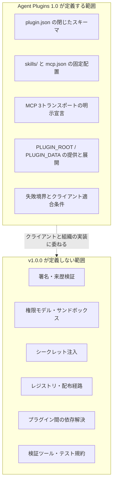
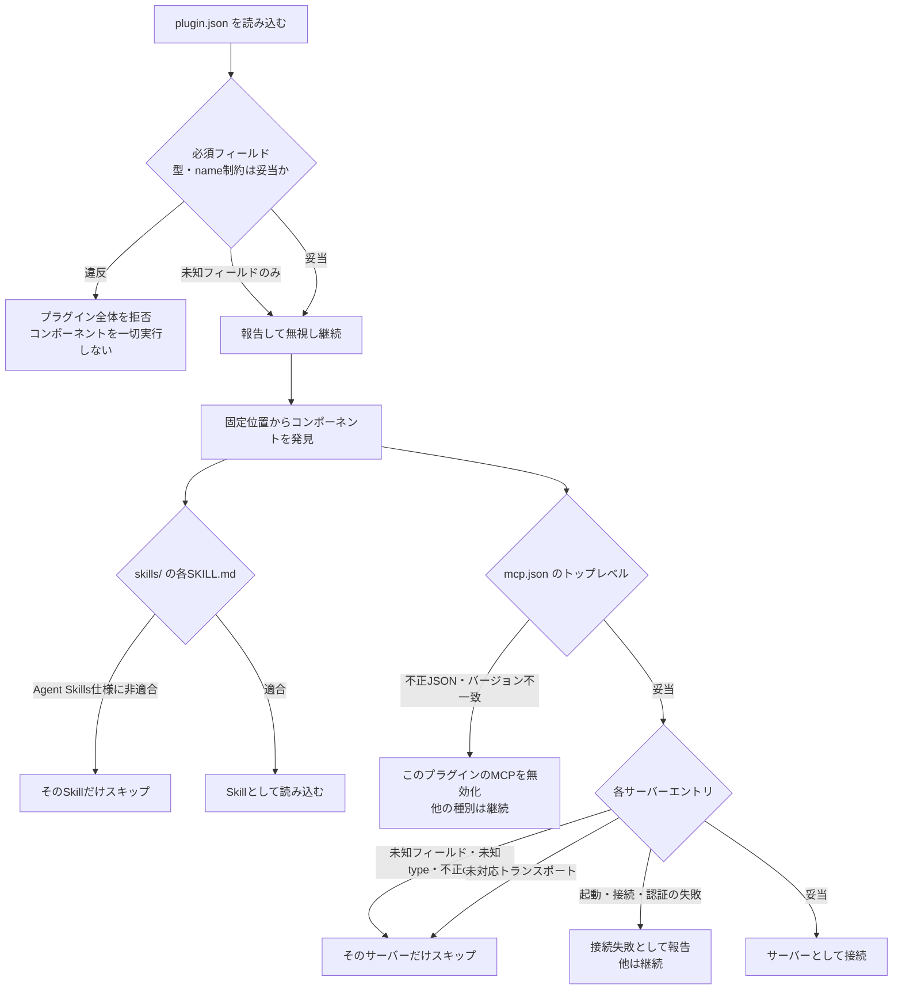

2026年8月6日、[Agent Plugins 1.0.0](https://agent-plugins.org/) が公開されました。Vercelが提案し、AWS・Anysphere(Cursor)・GitHub・Microsoft・OpenAIが共同で内容を練り上げたベンダー中立の規格です。ガバナンス上の技術運営委員会(Technical Steering Committee)は、[MAINTAINERS.md](https://github.com/agentplugins/agent-plugins-spec/blob/main/MAINTAINERS.md) 記載時点でAmazon・Cursor・Microsoft・OpenAI・Vercelの各代表5名のCore Maintainerで構成され、Lead Core MaintainerはVercelのJonathan Hefner氏です。Googleは後日、Core Maintainerとしての参加を[自社ブログで表明](https://developers.googleblog.com/agent-plugins-package-your-skills-tools-and-more/)しています(本記事執筆時点でMAINTAINERS.mdへは未反映)。Agent SkillsとMCPサーバーを、1つのディレクトリとして配布可能にするベンダー中立の規格です。

この記事は、仕様書とJSON Schemaの実物を読み、**Agent Plugins 1.0が「何を決めて、何を意図的に決めなかったか」** を整理したものです。読み終えると、次の3つが手元で判断できます。

- 自分のSkill群とMCPサーバーを、この規格に載せるべきか
- 載せる場合、`plugin.json` / `mcp.json` に何を書けて何を書けないか
- 署名・権限・シークレットといった運用要件を、規格の外でどう埋めるか

対象読者は、社内向けにAIエージェントの拡張を配布する立場の方、およびエージェントクライアントを実装する方です。

:::message
本記事の仕様記述は、[仕様本文 v1.0.0](https://github.com/agentplugins/agent-plugins-spec/blob/main/spec/1.0.0.md) と、公開されている [plugin.schema.json](https://agent-plugins.org/schemas/1.0.0/plugin.schema.json) / [mcp.schema.json](https://agent-plugins.org/schemas/1.0.0/mcp.schema.json) の実物を2026年8月7日時点で照合した内容です。仕様本文とスキーマが矛盾する場合は、仕様本文が優先されると明記されています。
:::


*この記事の全体像。以下、順に解説します。*

## Agent Plugins 1.0が解こうとした問題

エージェントの能力拡張は、これまで2つの系統が独立して育ってきました。

| 系統 | 中身 | 配布単位 |
|---|---|---|
| Agent Skills | 手順・ドメイン知識を書いた `SKILL.md` | Markdownファイル群 |
| MCPサーバー | 外部システムへの接続と操作 | プロセス起動設定またはHTTPエンドポイント |

この2つは、片方だけで完結することもあれば、組み合わせて初めて意味を持つこともあります。「デプロイ手順を知っているSkill」に「デプロイを実行できるMCPサーバー」を添えたい場合、従来は配布経路もクライアントごとの登録先も別々でした。規格自身も両者を独立・任意のコンポーネントとして扱っており、Skillだけのプラグインも正当です(実際、Googleの Agents CLI は Skill のみで構成されています)。

Agent Plugins 1.0は、この2つを**1つのディレクトリに固定配置する**ことだけを標準化しました。仕様書自身の言葉を借りると、狙いは次の一点です。

> Agent Plugins defines a small interoperability floor for the parts that can be portable across clients.
> (Agent Pluginsは、クライアント間で可搬にできる部分についてだけ、小さな相互運用の床を定義する)

「床(floor)」という語の選択が、この規格の性格をよく表しています。天井ではありません。

## 規格の範囲 — 決めたことと決めなかったこと

仕様を読んで最初に理解すべきなのは、**扱う範囲の狭さ**です。ここを取り違えると、存在しない機能を前提に設計してしまいます。



右側の「定義しない範囲」は、筆者の推測ではありません。仕様リポジトリの [FUTURE_CONSIDERATIONS.md](https://github.com/agentplugins/agent-plugins-spec/blob/main/FUTURE_CONSIDERATIONS.md) に、将来検討事項として明示的に列挙されています。v1.0.0は「トラストモデル、権限システム、サンドボックス要件を定義しない」と書かれています。

つまり Agent Plugins 1.0 は、**セキュリティ機構ではなくパッケージ規約**です。「プラグインを一体配布すればガバナンスが効く」という期待は、この規格単体では満たされません。効くのは「Skillと必要なMCPサーバーが1ディレクトリに揃っているので、静的に読める」という点までです。審査・承認・実行制御は、依然としてクライアント側と組織側の責務として残ります。

## パッケージ構造

プラグインは、単一のファイルシステム上のディレクトリです。アーカイブ形式(`.zip` / `.tar.gz`)でもレジストリ由来のバンドルでもありません。

```text
my-plugin/
├── plugin.json              # 必須。ルートマニフェスト
├── skills/                  # 任意。固定位置
│   └── summarize/
│       ├── SKILL.md
│       ├── scripts/
│       │   └── analyze.sh
│       └── references/
│           └── checklist.md
├── mcp.json                 # 任意。固定位置
├── com.example.client/      # 任意。クライアント拡張ディレクトリ
│   └── hooks/
├── LICENSE
└── CHANGELOG.md
```

ここで押さえるべき設計判断が3つあります。

### 1. 発見位置は固定で、マニフェストから上書きできない

`plugin.json` は「どこにSkillがあるか」を書く場所ではありません。仕様は次のように定めています。

> Clients MUST discover each supported component type from its fixed location. `plugin.json` cannot override these locations or contain inline component configuration.

| コンポーネント種別 | 固定位置 | 発見パターン |
|---|---|---|
| Skills | `skills/` | `SKILL.md` を含む**直下の**サブディレクトリ |
| MCPサーバー | `mcp.json` | JSON設定ファイル |

`skills/` の探索は直下1階層のみです。クライアントは深い子孫を再帰探索してはならないと明記されています。`skills/team-a/deploy/SKILL.md` は発見されません。

### 2. 固定位置が無いことはエラーではない

`skills/` も `mcp.json` も任意です。存在しなければ、そのコンポーネント種別が無いだけとして扱われます。一方、**存在するが種別が違う**場合(`skills` がディレクトリでない、`mcp.json` が通常ファイルでない)は、そのコンポーネント種別だけが無効になり、他は読み込みが続きます。

### 3. パス封じ込め

クライアントがパッケージ内のファイルを読むとき、解決後のパスはプラグインルート内に留まらなければなりません。シンボリックリンクは、リンク先がルート内であれば許容されます。プラグイン相対パスとして定義されたフィールドは `./` で始まる必要があります。

ただし注意点があります。コマンド引数や環境変数の値のような、パスとして定義されていない設定値は**不透明な文字列**として扱われ、クライアントはこれらをパッケージパスとして解釈してはなりません。封じ込め規則が守るのは「パッケージが供給するファイルへのアクセス」であって、起動したサブプロセスのサンドボックス化ではありません。

## `plugin.json` — 閉じた10フィールド

マニフェストで許可されるトップレベルフィールドは、次の10個ですべてです。

| フィールド | 型 | 必須 | 内容・制約 |
|---|---|---|---|
| `$schema` | string | **必須** | 値は `https://agent-plugins.org/schemas/1.0.0/plugin.schema.json` に固定(`const`) |
| `name` | string | **必須** | 1〜64文字。`a-z` `0-9` `-` `.` のみ。先頭末尾は英数字。`--` `..` 不可 |
| `version` | string | 任意 | セマンティックバージョニング推奨。更新確認とキャッシュ鮮度に使う |
| `description` | string | 任意 | 目的の短い説明 |
| `author` | object | 任意 | `name` / `email` / `url` の3つの文字列フィールドのみ許可 |
| `homepage` | string | 任意 | ドキュメントURL |
| `repository` | string | 任意 | **文字列**。npmのようなオブジェクト形式ではない |
| `license` | string | 任意 | SPDX識別子推奨 |
| `keywords` | string[] | 任意 | 検索用タグ |
| `extensions` | object | 任意 | 逆ドメイン名前空間をキーとするクライアント固有データ |

スキーマは `additionalProperties: false` の閉じたスキーマです。`publisher`、`icon`、`skills`、`mcp`、`dependencies` といったフィールドは**存在しません**。

最小構成はこの2行だけです。

```json
{
  "$schema": "https://agent-plugins.org/schemas/1.0.0/plugin.schema.json",
  "name": "minimal-plugin"
}
```

フル構成は次の形になります。

```json
{
  "$schema": "https://agent-plugins.org/schemas/1.0.0/plugin.schema.json",
  "name": "plugin-name",
  "version": "1.2.0",
  "description": "Brief plugin description",
  "author": {
    "name": "Author Name",
    "email": "author@example.com",
    "url": "https://example.com"
  },
  "homepage": "https://docs.example.com/plugin",
  "repository": "https://github.com/example/plugin",
  "license": "MIT",
  "keywords": ["keyword1", "keyword2"],
  "extensions": {
    "com.example.client": {
      "setting": true
    }
  }
}
```

### 「閉じている」のに未知フィールドで落ちない理由

閉じたスキーマなので、未知のトップレベルフィールドはスキーマ違反です。ところが仕様は、その扱いを2段階に分けています。

| 違反の種類 | クライアントの挙動 |
|---|---|
| 未知のトップレベルフィールド | **報告して無視**し、読み込みを継続する |
| `extensions` がオブジェクトでない | **報告して無視**し、読み込みを継続する |
| それ以外のスキーマ違反(必須欠落、型不一致、`name` 制約違反など) | **致命的**。プラグイン全体を拒否し、コンポーネントを一切実行しない |

この非対称性が意図的である理由は、仕様の Design Decisions に書かれています。閉じたマニフェストは厳格な検証・タイポ検出・スキーマ駆動のキー補完を可能にする一方、クライアントの実験的フィールドが任意のトップレベルキーを占有することを防ぐ。しかし、それでプラグイン全体を使えなくするのは割に合わない、という判断です。

一方で `name` の制約違反は致命的です。`My-Plugin`(大文字)、`-start`(先頭ハイフン)、`has--double`(連続ハイフン)、`too.many..dots`(連続ピリオド)はいずれも無効で、プラグインごと拒否されます。ピリオドは許可されているため `acme.tools` は有効です。

### クライアント固有の設定は `extensions` へ

クライアント独自の設定を置く場所は、逆ドメイン識別子をキーとする `extensions` オブジェクト、またはその名前空間名を持つトップレベルディレクトリです。両方を併用してもかまいません。

クライアントは、自分が実装していない名前空間のエントリを、**中身を検証せずに無視**しなければなりません。中央の名前レジストリを持たずに衝突を避けるための、素直な選択です。

## `mcp.json` — トランスポートを必ず明示する

`mcp.json` はプラグインルート固定です。`plugin.json` へのインライン記述も、代替パスからの読み込みも禁止されています。

トップレベルは `$schema` と `mcpServers` の2フィールドのみで、両方必須です。`mcpServers` が空オブジェクトでも有効です。

**v1で最も既存慣行と異なるのが、各サーバーエントリの `type` が必須である点**です。既存クライアントは設定の形からトランスポートを推論していましたが、Agent Pluginsは推論を排し、閉じた3つのバリアントの直和にしました。

```json
{
  "$schema": "https://agent-plugins.org/schemas/1.0.0/mcp.schema.json",
  "mcpServers": {
    "local-validator": {
      "type": "stdio",
      "command": "./bin/validator",
      "args": ["--data", "${PLUGIN_DATA}/validator"],
      "env": {
        "CONFIG": "${PLUGIN_ROOT}/config.json"
      },
      "cwd": "${PLUGIN_ROOT}"
    },
    "deployment-api": {
      "type": "streamable-http",
      "url": "https://deploy.example.com/mcp",
      "headers": {
        "X-Tenant": "public-tenant"
      }
    },
    "legacy-events": {
      "type": "sse",
      "url": "https://legacy.example.com/sse"
    }
  }
}
```

### stdio

| フィールド | 型 | 必須 | 内容 |
|---|---|---|---|
| `type` | `"stdio"` | 必須 | stdioトランスポートを選択 |
| `command` | string | 必須 | 起動する実行可能トークン |
| `args` | string[] | 任意 | 引数 |
| `env` | object of strings | 任意 | 環境変数 |
| `cwd` | string | 任意 | 作業ディレクトリ |

`command` の制約が実装上いちばん効きます。

- **単一の実行可能トークン**でなければならず、シェルコマンド文字列は不可
- 裸の実行ファイル名か、`./` で始まるプラグイン相対パスのいずれか
- クライアントは `command` に対して**プレースホルダ展開を行ってはならない**

`command` をシェル文字列にしないのは、クライアント側にユーザー記述のシェル文字列の解析とエスケープを要求しないためです。Windowsで `.bat` / `.cmd` を起動するために内部でコマンドインタプリタを使うことは許容されますが、その場合も `command` は1トークンとして保ち、`args` は別に渡さなければなりません。

もう1点、移植性に直結する規定があります。**設定した `PATH` が裸の `command` の解決に影響するかはクライアント定義**であり、適合を主張するプラグインはその挙動に依存してはなりません。実行ファイルを同梱するプラグインは、プラグイン相対の `command` を使う必要があります。

`cwd` を省略した場合の既定はプラグインルートです。指定する場合は次の3形式のみ有効で、展開後の封じ込め検査を通らなければそのサーバーエントリが無効になります。

1. `./` で始まるプラグイン相対パス
2. `${PLUGIN_ROOT}` 完全一致、または `${PLUGIN_ROOT}/` で始まるパス
3. `${PLUGIN_DATA}` 完全一致、または `${PLUGIN_DATA}/` で始まるパス

### streamable-http と sse

| フィールド | 型 | 必須 | 内容 |
|---|---|---|---|
| `type` | `"streamable-http"` または `"sse"` | 必須 | リモートトランスポートを選択 |
| `url` | string | 必須 | MCPエンドポイントURL |
| `headers` | object of strings | 任意 | 接続時に送る固定HTTPヘッダ |

`sse` は MCP 2024-11-05 仕様で定義された**非推奨のHTTP+SSEトランスポート**を指します。Streamable HTTP の内部で使われるSSEレスポンスのことではありません。ここは混同しやすい箇所です。

`url` は絶対HTTP/HTTPS URLで、ユーザー情報とフラグメントを含んではなりません。ループバック以外のエンドポイントはHTTPS必須で、ホストが厳密に `localhost` かループバック範囲のIPリテラルの場合のみHTTPが使えます。

`headers` は「文字列のオブジェクト」で終わりではなく、スキーマだけでは検査できない規範要件が本文側に置かれています。

| 規定 | 内容 |
|---|---|
| 妥当性 | ヘッダ名・値はHTTP header fieldとして妥当でなければならない |
| 重複禁止 | ヘッダ名は大小文字を区別しない。`Authorization` と `authorization` のように同名を異なる大小文字で重複させたエントリは**無効** |
| 優先順位 | HTTP・MCP・認可を実装するためにクライアントが生成したヘッダが、同名(大小文字無視)の設定済みヘッダより**優先される** |
| 展開なし | `url`・ヘッダ名・ヘッダ値のいずれにも、プレースホルダ展開も環境変数展開も行われない |
| シークレット禁止 | ヘッダ値は可視のパッケージデータであり、可搬なシークレット機構ではない。資格情報を埋め込んではならない |
| オリジン越え禁止 | 明示的なユーザー認可なしに、リダイレクトやレガシーSSEエンドポイントイベントを経由して設定済みヘッダを別オリジンへ転送してはならない |

公開されている `mcp.schema.json` は値が文字列であることまでしか検査できません。上記のうち妥当性・重複禁止は、仕様本文に基づく追加検査が必要です。

v1はOAuth設定も可搬な資格情報参照フィールドも定義しません。認可の発見・ユーザー操作・資格情報の保管はすべてクライアント管理です。そして**認可失敗はそのサーバーの接続失敗であって、プラグイン設定の不正ではない**と切り分けられています。

### トランスポートのサポート要件

MCPサーバーに対応するクライアントは、`stdio` と `streamable-http` の**少なくとも一方**をサポートしなければならず、両方が推奨されます。`sse` は任意です。クライアントは `type` が宣言したトランスポートを初回接続に使う必要があり、失敗時のフォールバックは規格外です。

失敗の封じ込め単位は**サーバーエントリ**です。stdio専用クライアントは `streamable-http` のエントリだけをスキップし、他のサーバーとコンポーネントの読み込みを継続します。プラグインが拒否されるわけではありません。ただし、リモートMCPしか持たないプラグインをstdio専用クライアントに載せると、結果として使えるコンポーネントが残らない、という前提で設計する必要があります。

## `PLUGIN_ROOT` と `PLUGIN_DATA`

プラグインのサブプロセス、つまり stdio MCPサーバーを起動するクライアントは、2つの環境変数を必ず提供しなければなりません。

| 変数 | 指す先 | 用途 |
|---|---|---|
| `PLUGIN_ROOT` | 解決済みプラグインルートの絶対パス | 同梱スクリプト・バイナリ・設定ファイルの参照 |
| `PLUGIN_DATA` | そのインストール済みインスタンス専用の永続データディレクトリの絶対パス | 依存物(node_modules、venv)、生成コード、キャッシュ、状態 |

`PLUGIN_DATA` の位置はクライアントが決めますが、サブプロセス起動前に作成し、書き込み可能にし、**プラグイン更新をまたいで内容を保持**しなければなりません。アンインストール時の削除は任意です。

```text
PLUGIN_ROOT=/home/alex/.agents/plugins/devtools
PLUGIN_DATA=/home/alex/.agents/plugins/data/devtools
```

この2つを分けた理由は明快です。パッケージ内容は更新で丸ごと置き換わりうるため、`npm install` の結果やキャッシュを `PLUGIN_ROOT` 配下に置くと更新のたびに消えます。永続させたい状態は `PLUGIN_DATA` に置きます。

### 展開規則は極めて限定的

置換されるのは `${PLUGIN_ROOT}` と `${PLUGIN_DATA}` の2つだけです。

| 項目 | 規定 |
|---|---|
| 対象フィールド | `args` の全文字列要素、`env` の全文字列**値**、`cwd` |
| 対象外 | `env` のキー、`command`、固定コンポーネント位置、`url`、ヘッダ |
| 回数 | 1回のみ。非再帰。置換で生じたテキストを再走査しない |
| 未知のプレースホルダ様テキスト | リテラルのまま残す |
| その他の展開 | 一切行ってはならない |

`${env:HOME}` や `${VAR:-default}` のようなシェル風の記法は仕様に存在しません。書いてもリテラル文字列として渡ります。

さらに、`env` オブジェクトに `PLUGIN_ROOT` / `PLUGIN_DATA` という名前のエントリを含めることは禁止で、含めるとそのサーバー設定が無効になります。スキーマ側でも `propertyNames` の `not`/`enum` で機械的に弾かれています。

環境の合成順序も規定されています。クライアントが選んだベース環境に、展開後の `env` を重ね、**その後で**クライアントが `PLUGIN_ROOT` と `PLUGIN_DATA` を設定します。予約変数を上書きすることはできません。

なお、ベース環境自体はクライアントが継承・省略・サニタイズしてよいとされています。裸の `command` 解決のための実行ファイル探索を除き、適合を主張するプラグインは、仕様が要求する変数か設定が明示的に供給する変数以外のベース環境変数に依存してはなりません。「ユーザーのシェルに `AWS_PROFILE` があるはず」といった前提は移植性を壊します。

## 最小のプラグインを作る

規格に従うだけなら、必要な操作は3つです。

```bash
mkdir -p hello-plugin/skills/summarize
cd hello-plugin
```

`plugin.json` を置きます。

```json
{
  "$schema": "https://agent-plugins.org/schemas/1.0.0/plugin.schema.json",
  "name": "hello-plugin",
  "version": "1.0.0",
  "description": "Summarize a document and validate it with a bundled MCP server",
  "license": "MIT"
}
```

`skills/summarize/SKILL.md` を置きます。書式は Agent Plugins ではなく [Agent Skills仕様](https://agentskills.io/specification) が正本です。Agent Plugins が定めるのは「プラグイン内でどう発見されるか」だけで、`SKILL.md` の書式やフロントマターのフィールドには関与しません。

MCPサーバーを同梱するなら `mcp.json` を置きます。同梱バイナリを使う場合は、プラグイン相対の `command` にします。

```json
{
  "$schema": "https://agent-plugins.org/schemas/1.0.0/mcp.schema.json",
  "mcpServers": {
    "doc-index": {
      "type": "stdio",
      "command": "./bin/doc-index",
      "args": ["--cache", "${PLUGIN_DATA}/cache"]
    }
  }
}
```

`plugin.json` と `mcp.json` の `$schema` は**バージョンが一致していなければなりません**。不一致の場合、MCP設定だけが無効になり、Skillの読み込みは続きます。

検証については、v1.0.0が公式のリンタ・バリデータ・テスト規約を定義していない点に注意が必要です(FUTURE_CONSIDERATIONS に「標準のプラグインリンタまたはバリデータコマンド」が将来検討事項として挙げられています)。当面は、公開されているJSON Schemaを汎用バリデータで直接当てるのが確実です。

```bash
curl -sSLo plugin.schema.json https://agent-plugins.org/schemas/1.0.0/plugin.schema.json
curl -sSLo mcp.schema.json https://agent-plugins.org/schemas/1.0.0/mcp.schema.json
npx --yes ajv-cli validate --spec=draft2020 -s plugin.schema.json -d plugin.json
npx --yes ajv-cli validate --spec=draft2020 -s mcp.schema.json -d mcp.json
```

`mcp.json` 側の検証を省くと、`type` の欠落やサーバー設定の構造違反がCIをすり抜けます。スキーマは2つとも当ててください。

ただしスキーマだけでは、`command` が単一トークンか、`cwd` が封じ込めを満たすか、`sse` を使ってよいかといった意味論的な要件は検査できません。仕様本文は「スキーマと矛盾する場合は仕様本文が優先される」と明記しています。CIに載せるなら、スキーマ検証に加えて仕様本文由来のルールを自前で足す構成になります。

## クライアント実装者の適合条件

クライアント側から見ると、適合の最低ラインは次の8項目です。

1. ディレクトリパスからプラグインを読み込める
2. `$schema` からローカル対応のマニフェストスキーマを選び、閉じた `plugin.json` を検証する(未知フィールドと非オブジェクト `extensions` は非致命)
3. 未実装の `extensions` メンバを、中身を検証せずに無視する
4. サポートするコンポーネント種別を、その固定位置から発見する
5. MCPをサポートするなら `$schema` から設定スキーマを選び、`stdio` か `streamable-http` の少なくとも一方に対応する
6. サブプロセスを起動するなら `PLUGIN_ROOT` / `PLUGIN_DATA` を提供し、`args` / `env` / `cwd` で両方を展開する
7. stdio の `command` を単一実行可能トークンとして解決し、既定の作業ディレクトリにプラグインルートを使う
8. 少なくとも1つのコンポーネント種別(SkillsまたはMCPサーバー)をサポートする

**すべてのコンポーネント種別に対応する必要はありません。** Skills専用クライアントも、適用される要件を満たしていれば適合します。段階的採用が明示的に許容されています。

そして、クライアントは読み込み時にスキーマを取得してはなりません。正準の `$schema` 識別子から、ローカルに持つ実装を選びます。オフラインでも決定的に動き、リモートのスキーマ差し替えが実行時の挙動を変えないための規定です。公開済みの正準スキーマ識別子を別内容へ再割り当てすることも禁止されています。

## 失敗境界の設計

この仕様で最も実装品質に効くのが、失敗の伝播範囲を階層で切っている点です。



原則は「独立して妥当なコンポーネントは、他の失敗に巻き込まれない」です。Skillとサーバーを提供するプラグインが、サーバー1つの起動失敗で丸ごと使えなくなるのは割に合わない、という判断です。

同時に、仕様は非致命の失敗に**診断要件を対にして**います。無効な設定やコンポーネント失敗をクライアントは報告すべき(SHOULD)とされ、失敗が沈黙しないよう設計されています。

裏を返すと、プラグイン作者側には注意点があります。**MCPサーバーが起動していなくても、それに依存するSkillは読み込まれます。** Skill本文が「このツールが必ずある」前提で書かれていると、ツールが存在しないままモデルに手順が渡ります。Skill側に前提確認と失敗時の振る舞いを書いておく必要があります。

## v1.0.0が扱わない領域を運用で埋める

冒頭で述べたとおり、v1.0.0はトラストモデルを定義しません。エンタープライズで配布するなら、次の対応を規格の外側に自前で置くことになります。FUTURE_CONSIDERATIONS に挙がっている項目と対応させると、埋めるべき穴が整理できます。

| 将来検討事項(v1では未定義) | 当面の埋め方 |
|---|---|
| 権限宣言・サンドボックス・同意フロー | クライアント側の既存の承認機構に委ねる。`mcp.json` の `command` と `url` をCIで静的に読み、許可リストと突き合わせる |
| 署名・来歴検証 | 配布経路(Gitタグ、社内アーティファクトストア)側で署名する。ディレクトリ形式なのでリポジトリ単位の検証と相性が良い |
| シークレット注入 | `env` と `headers` に**書かない**。クライアント管理の資格情報機構を使う。規格自身が「可搬なシークレット機構ではない」と明言している |
| 組織のallowlist/blocklist、レジストリ | `name` と `version` を信頼の鍵に使わない。`name` は仕様上「human-readable な名前」でしかなく大域的一意性も発行者IDも定義されず、`version` は任意フィールドのため、なりすまし耐性がない。管理対象リポジトリ、配布元、コミットSHA、アーティファクトのdigest、組織側で検証する署名を鍵にする |
| 監査イベントのスキーマ | クライアントの診断出力を自前で正規化して収集する |
| プラグイン間の依存解決 | 宣言できないため、必要な依存は同梱するか、独立して動く粒度に分割する |
| 検証ツール | 公開JSON Schemaによる検証と、仕様本文由来の意味論チェックをCIで自作する |

ディレクトリベースを選んだ設計判断が、ここで効いてきます。アーカイブでもレジストリ由来のバンドルでもないため、`ls` `cat` `git` といった標準ツールでそのまま検査でき、バージョン管理にも特別なツールなしで載ります。署名や審査を外付けする際、この可視性は現実的な利点です。

## 採用を判断する材料

規格の性格を踏まえると、判断はおおむね次のように分かれます。

| 状況 | 判断 |
|---|---|
| SkillとMCPサーバーをセットで配りたい | 載せる価値が高い。配布単位が1つになる |
| 複数クライアント(Cursor / GitHub Copilot / Codex / VS Code など)へ同じ拡張を配っている | 載せる価値が高い。クライアント固有部分は `extensions` と名前空間ディレクトリに隔離できる |
| Skillしか無い、かつ配布先が単一クライアント | 急ぐ理由は薄い。`plugin.json` 2行の追加コストは小さいので、将来に備えて付けておく程度 |
| 署名・権限制御・シークレット管理を規格に期待している | v1では得られない。既存の仕組みを維持する前提で検討する |
| フック・コマンド・サブエージェントなどを配りたい | v1の対象外。これらはクライアント固有すぎて可搬な契約にできないと明記されている |

公開時点で ChatGPT、Codex、Cursor、GitHub Copilot、Kiro、VS Code が対応を表明しています。Googleは [Agents CLI をこの形式で提供する](https://developers.googleblog.com/agent-plugins-package-your-skills-tools-and-more/)としたうえで、規格を「共有すべき地味なインフラ」「意図的にスコープが小さく、1つのことをうまくやる」と位置づけています。

なお、複数のエージェントに対応すると謳うリポジトリでも、実際にはルートの `plugin.json` を持たず、`.claude-plugin/` や `gemini-extension.json` のようなクライアント別マニフェストを並べているだけ、という構成が現時点では珍しくありません。採用状況を確認するときは、宣伝文ではなく**ルートに `plugin.json` があり、`mcp.json` の各サーバーに `type` が付いているか**を見るのが確実です。

## まとめ

- Agent Plugins 1.0は、Agent SkillsとMCPサーバーを**1ディレクトリに固定配置する**ための最小の相互運用規格である
- `plugin.json` は `$schema` と `name` のみ必須の閉じた10フィールド。`skills` や `mcp` を書く場所は無く、発見位置はマニフェストで上書きできない
- `mcp.json` は各サーバーに `type`(`stdio` / `streamable-http` / `sse`)を必須化し、トランスポートの推論を排した
- 展開されるのは `${PLUGIN_ROOT}` と `${PLUGIN_DATA}` の2つだけ。シェル風の環境変数展開は存在せず、`env` と `headers` はシークレット機構ではない
- 失敗はコンポーネント単位で封じ込められる。ただしMCPサーバーが落ちていてもSkillは読み込まれるため、Skill側に前提確認を書く必要がある
- 署名・権限・サンドボックス・シークレット・レジストリ・依存解決は**v1の対象外**。規格の外で埋める前提で採用を判断する

規格を評価するとき、「何ができるか」より「何を意図的に諦めたか」を読むほうが、運用の姿は正確に見えます。Agent Plugins 1.0は、諦めた範囲がFUTURE_CONSIDERATIONSとして明文化されている点で、判断しやすい規格です。

この記事が少しでも参考になった、あるいは改善点などがあれば、ぜひリアクションやコメント、SNSでのシェアをいただけると励みになります！

## 参考リンク

### 公式仕様・スキーマ

- [Agent Plugins](https://agent-plugins.org/) — 公式サイト
- [Agent Plugins Specification](https://agent-plugins.org/specification) — 仕様ページ
- [agentplugins/agent-plugins-spec](https://github.com/agentplugins/agent-plugins-spec) — 仕様リポジトリ
- [Agent Plugins Specification v1.0.0 (本文)](https://github.com/agentplugins/agent-plugins-spec/blob/main/spec/1.0.0.md)
- [FUTURE_CONSIDERATIONS.md](https://github.com/agentplugins/agent-plugins-spec/blob/main/FUTURE_CONSIDERATIONS.md) — v1が扱わない領域の一覧
- [plugin.schema.json](https://agent-plugins.org/schemas/1.0.0/plugin.schema.json)
- [mcp.schema.json](https://agent-plugins.org/schemas/1.0.0/mcp.schema.json)

### アナウンス

- [Introducing Agent Plugins - Vercel Blog](https://vercel.com/blog/introducing-agent-plugins)
- [Introducing Agent Plugins 1.0.0 - Vercel Changelog](https://vercel.com/changelog/introducing-agent-plugins-1-0-0)
- [Agent Plugins package your skills, tools, and more - Google Developers Blog](https://developers.googleblog.com/agent-plugins-package-your-skills-tools-and-more/)

### 関連仕様

- [Agent Skills Specification](https://agentskills.io/specification) — `SKILL.md` の正本
- [Model Context Protocol Specification](https://modelcontextprotocol.io/specification)
- [MCP 2024-11-05 Transports](https://modelcontextprotocol.io/specification/2024-11-05/basic/transports) — 非推奨のHTTP+SSE
- [JSON Schema Draft 2020-12](https://json-schema.org/draft/2020-12/schema)
