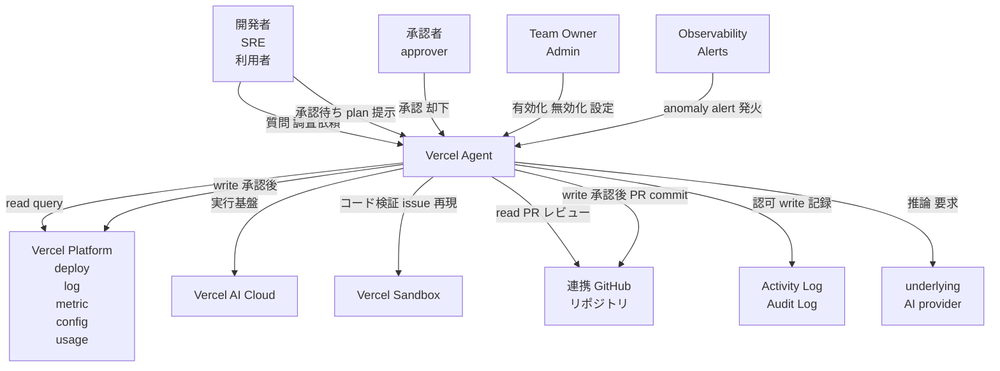
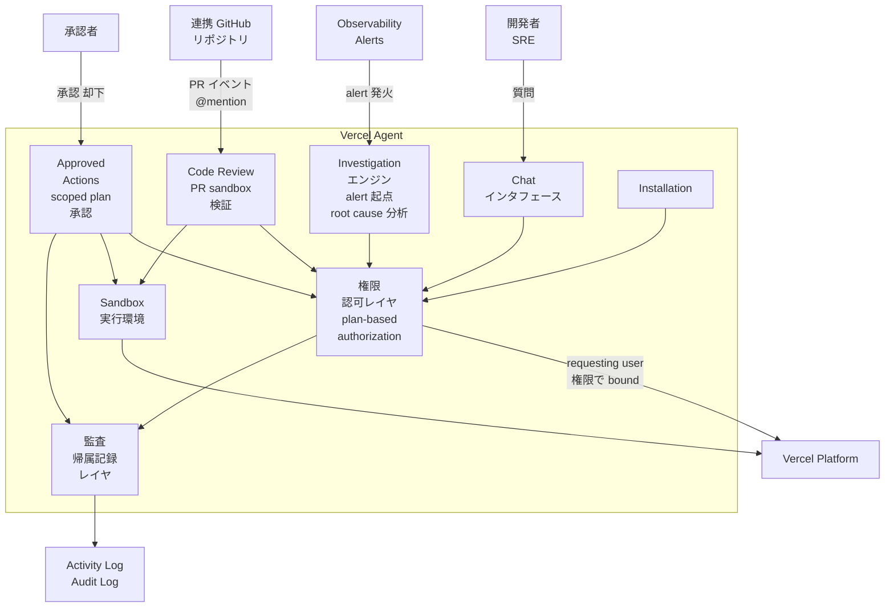
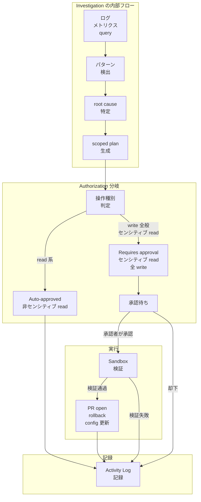
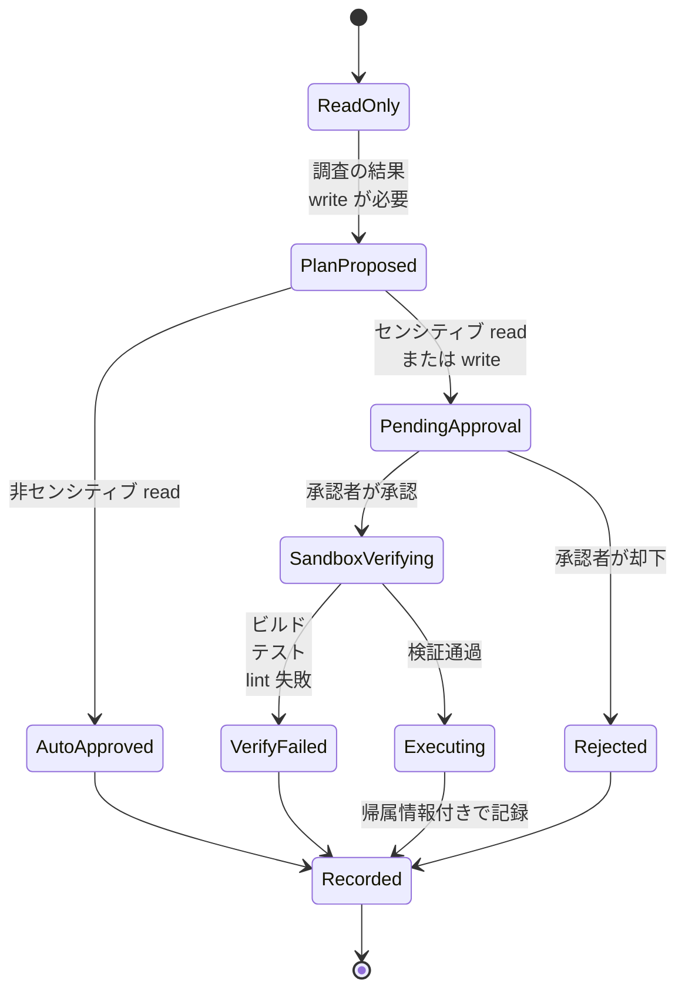
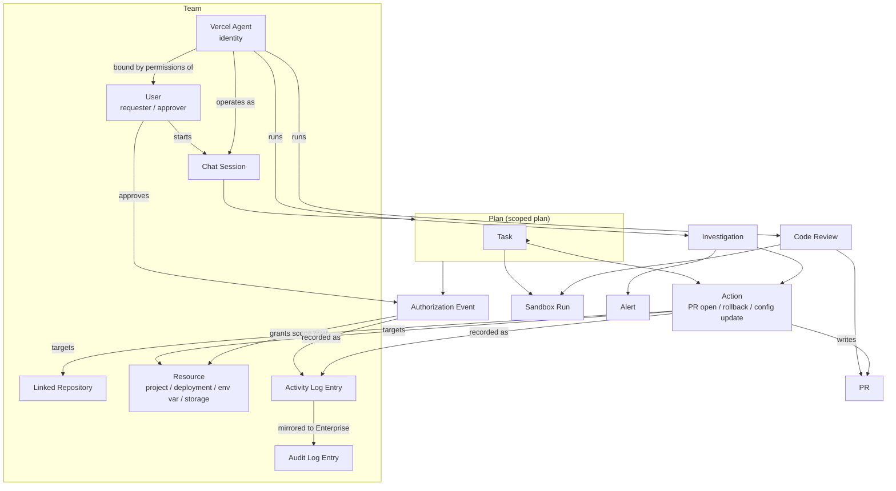
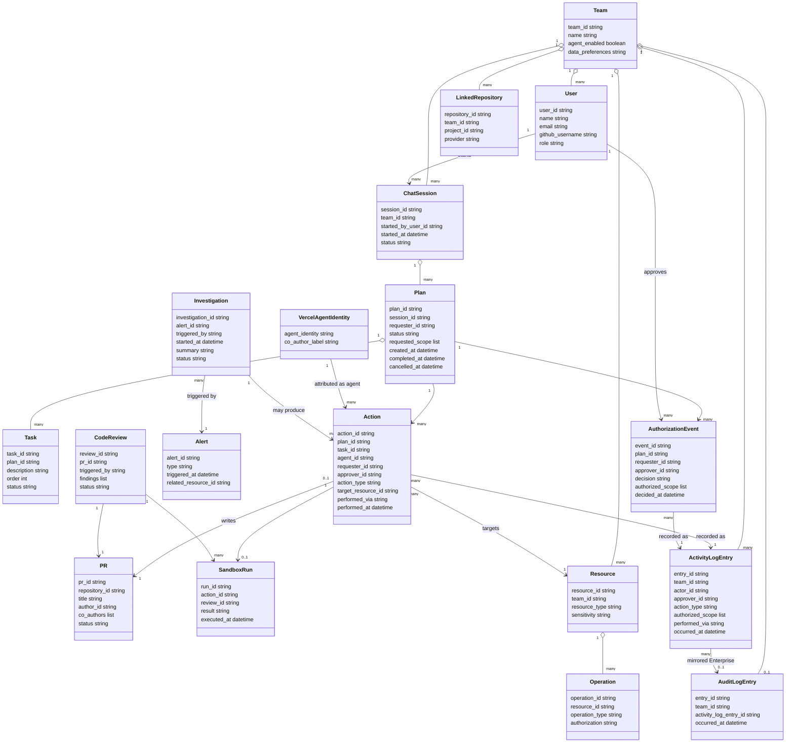

Vercel ダッシュボードに常駐し、本番調査・承認付きアクション・PR コードレビュー・計測の自動導入を担う AI エージェント「Vercel Agent」を、構造とデータの観点から調査します。とくに「AI に本番環境を直させる」運用を成立させるための権限境界・承認制御・監査証跡の設計に焦点を当てます。

> 本稿は 2026 年 7 月 1 日時点の Vercel 公式ドキュメント(Agent / Chat / Investigation / Code Review / Pricing / Observability Plus)を一次情報として整理しています。Vercel Agent は public beta であり、料金や UI は変わり得ます。

## 概要

Vercel Agent は、Vercel ダッシュボードに常駐する AI エージェントです。デプロイ・ログ・メトリクス・プロジェクト設定・使用量・連携リポジトリといった、プロジェクト運用に関わる周辺シグナルを横断的に読み取ります。Vercel の AI Cloud 上で動作し、生成したコードは secure sandbox(Vercel Sandbox)上で実行します。これにより、本番環境に到達する前にビルド・テスト・lint を検証できます。

Vercel Agent が重要な理由は、「AI に本番環境を直接触らせる」運用を成立させる最低限の統制を備えているからです。具体的には次の 3 点です。

1. **read-only by default**: 非センシティブなリソース(プロジェクト・デプロイ・ログ・ドメイン)の読み取りは自動承認ですが、書き込みを伴う操作はすべて承認が必須です。
2. **承認付きアクション(approved actions)**: 書き込みが必要な場面では scoped plan(対象範囲を限定した実行計画)を提示し、人間の承認を経るまで一切変更しません。
3. **帰属記録(attribution)**: 昇格された操作は Agent・依頼者・承認者の 3 者に紐づけて記録され、Activity Log や Audit Log で追跡できます。

AI エージェントが本番環境の調査やコード変更に関与する場面が広がる中、これらの権限境界・承認制御・監査証跡が欠けると、誤操作や説明責任の所在不明といったリスクが生じます。Vercel Agent はこの 3 点を製品設計の核に据えることで、AIOps/AgentOps の実用化を進めています。

なお、ダッシュボード chat・investigations・approved actions は、Pro team と Enterprise team を対象とした public beta です。

## 特徴

Vercel Agent は 4 つの主要 skill を提供します。それぞれの「何ができるか」を一覧します。

| Skill | 何ができるか |
|---|---|
| **Code Review (PR review)** | 対象に設定したリポジトリの PR を自動レビューします。multi-step reasoning でセキュリティ脆弱性・ロジックエラー・パフォーマンス問題を検出し、パッチを生成します。生成パッチは secure sandbox で実ビルド・実テスト・linter を実行して検証し、検証を通過した修正のみワンクリックで適用できます。PR コメントで `@vercel` をメンションして起動できます |
| **Investigation** | 異常検知アラート発火時に本番環境を調査します。failed deploy・runtime error・cost spike を対象に、アラート時刻周辺のログ・メトリクスを query し、パターンや相関を探索して root cause の洞察を提供します。Agent Investigations を有効化していれば自動開始し、アラート詳細ページから手動実行(Investigate / Rerun)も可能です |
| **Approved actions** | 書き込みを伴う操作が必要な場合に scoped plan を提示し、承認を待ちます。承認後に PR の作成・rollback・設定更新を実行できます。承認まで一切の変更を行いません |
| **Installation** | Web Analytics や Speed Insights の導入を自動化します。エージェントが解析し、依存関係を追加し、統合コードを記述して PR を作成します。Installation は全チームで無料です |

統制面の特性は次のとおりです。

- **read-only by default**: 非センシティブなリソースの読み取りは自動承認、センシティブなリソース(環境変数・トークン)の読み取りと全ての書き込み操作は承認が必須です。
- **plan 単位の承認(plan-based authorization)**: 承認はセッション単位ではなく plan 単位です。各 plan は固有の権限を持つ独立した作業単位であり、同一チャットセッション内でも新しい plan には新しい承認が必要です。plan の完了またはキャンセルで権限は失効します。
- **本人権限への bound**: Agent は自身の identity で動作しますが、実行権限は依頼者(requesting user)の権限に bound されます。依頼者が持たない操作は、Agent も承認・実行できません。
- **3 者帰属(Agent / requester / approver)**: 昇格された操作は、実行した Agent・依頼した requester・承認した approver の 3 者に紐づけて記録されます。GitHub への書き込み(PR 作成・更新・コメント・commit push)も明示的承認が必須で、commit には Vercel Agent が co-author として列挙されます。
- **Activity Log / Audit Log への記録**: 全ての承認イベントと書き込み操作は team の Activity Log に記録されます(誰が・何を・いつ承認したか)。Enterprise プランでは owner ロールのメンバーが Audit Log でも閲覧でき、CSV エクスポートや SIEM 連携に対応します。Vercel アカウント/プロジェクトへの書き込みは、依頼者本人が "via Vercel Agent" で実行したものとして表示されます。

### 運用エージェント / AgentOps アプローチとの比較

Vercel Agent を、実行場所・権限・承認モデルが異なる他の運用エージェント型アプローチと比較します。比較対象は、IDE 内コーディングエージェント(Cursor、Claude Code 等)、CI 常駐の自動化 bot(Dependabot 等)、汎用 chatops です。

| 比較軸 | Vercel Agent | IDE/CLI 内コーディングエージェント | CI 常駐 bot(Dependabot 等) | 汎用 chatops |
|---|---|---|---|---|
| 実行場所 | Vercel ダッシュボード常駐(+ GitHub PR 上で `@vercel` メンション起動) | 開発者のローカル IDE/CLI 常駐 | CI/CD パイプライン常駐 | チャットツール(Slack 等)常駐 |
| デフォルト権限 | read-only by default(センシティブ read・全 write は要承認) | 多くがローカルファイルシステムへの書き込み可(ツールごとに承認設定は分かれる) | 定義済みタスク(依存更新 PR 作成等)に限定。本番操作は対象外が一般的 | 実行者がスクリプト化した範囲に依存。コマンド次第で本番に直接書き込み可能なものもある |
| 承認モデル | plan 単位承認(discrete unit of work ごとに再承認、plan 完了/cancel で失効) | セッション単位、またはツールごとの diff レビュー承認(plan の自動失効機構は一般的でない) | 多くは無承認の自動実行(PR 作成までは自動、マージは人手) | コマンド実行前に Slack 上で承認ボタンを挟む構成もあるが標準仕様ではなく、実装依存 |
| 監査証跡 | Activity Log(誰が承認・何を authorize・いつ)、Enterprise は Audit Log でも閲覧可。書き込みは依頼者本人 + "via Vercel Agent" として帰属表示 | 標準ではコミット履歴・diff のみ。誰が承認したかの専用ログは製品依存で薄い | CI ログ + PR 作成履歴(Git 標準のコミット作者表示) | チャットログが一次記録になりがちで、専用 Audit Log は実装依存 |

技術的根拠は以下の一次情報に基づきます。

- read-only/承認/帰属の 3 点は Chat ドキュメントの Authorization テーブルおよび Activity Log 記載に基づきます。「非センシティブ read は自動承認、センシティブ read と全 write は要承認」という区分は Vercel Agent に固有の設計であり、IDE 内エージェントの多くは diff 承認(変更内容そのもののレビュー)であって、リソース種別ごとの承認要否を区分する仕組みは標準装備ではありません。
- plan 単位承認(session ではなく plan ごとに失効)は、IDE/CLI エージェントの「セッション内は許可が持続する」設計や、chatops の「コマンドごとの単発承認」とは異なる粒度です。
- CI 常駐 bot(Dependabot 等)は、定義済みタスク(依存更新の PR 作成)に範囲が限定されており、本番ログ・メトリクスの調査(Investigation 相当の機能)は対象外です。

#### ユースケース別推奨

| ユースケース | 推奨 | 理由 |
|---|---|---|
| 本番デプロイ失敗・コスト急増の原因調査 | Vercel Agent (Investigation) | デプロイ・ログ・メトリクスへの直接アクセスと、アラート時刻周辺の自動相関分析を持つのは Vercel Agent のみ |
| PR の自動コードレビューとワンクリック修正 | Vercel Agent (Code Review) または IDE 内エージェント | 両者とも対応可能。secure sandbox での実ビルド検証を経た修正適用を重視するなら Vercel Agent、エディタ内での即時対話的修正を重視するなら IDE 内エージェント |
| 開発中のコード設計・実装相談 | IDE/CLI 内コーディングエージェント | ローカルのコンテキスト(未コミットの作業内容、複数ファイル横断の対話的編集)に強い |
| 依存パッケージの定期更新 | CI 常駐 bot(Dependabot 等) | 軽量かつ定型的なタスクに特化し、運用コストが低い |
| 本番環境への書き込みを伴う変更(rollback・config 更新) | Vercel Agent (Approved actions) | plan 単位承認と 3 者帰属により、誰が何を承認して実行したかを Activity Log/Audit Log で追跡できる。無承認で本番に書き込む chatops 構成より統制が強い |

## 構造

Vercel Agent の構造を C4 model の 3 段階(システムコンテキスト/コンテナ/コンポーネント)で図解します。あわせて承認フローの状態遷移を示します。

### システムコンテキスト図

Vercel Agent とその利用者、外部システムの関係を示します。



| 要素名 | 説明 |
|---|---|
| 開発者 SRE 利用者 | Vercel Agent に質問・調査を依頼する一般利用者 |
| 承認者 approver | Agent が提示する scoped plan を承認/却下する権限保持者 |
| Team Owner Admin | Vercel Agent 機能自体の有効化/無効化を管理する管理者 |
| Vercel Agent | ダッシュボード常駐の AI エージェント本体 |
| Vercel Platform | デプロイ・ログ・メトリクス・プロジェクト設定・使用量・連携リポジトリ情報を保持する基盤 |
| Vercel AI Cloud | Vercel Agent が動作する実行基盤 |
| Vercel Sandbox | 生成コードの検証・issue 再現を行う隔離実行環境 |
| 連携 GitHub リポジトリ | 利用者がアクセス権を持ち Vercel project にリンク済みのリポジトリ |
| Observability Alerts | 異常検知時に Investigation を起動するアラート機構 |
| Activity Log Audit Log | 認可イベントと write 操作を記録する監査証跡 |
| underlying AI provider | Vercel Agent の推論を担う基盤 AI プロバイダ |

### コンテナ図

Vercel Agent をドリルダウンし、主要構成要素を示します。



| 要素名 | 説明 |
|---|---|
| Chat インタフェース | 利用者との対話窓口。プロジェクトの質問・調査依頼を受け付ける |
| Investigation エンジン | alert 起点で本番ログ/メトリクスを分析し root cause を導く機能 |
| Code Review | PR を Sandbox で検証しレビューする機能 |
| Approved Actions | write 操作の scoped plan を提示し承認を仲介する機能 |
| Installation | Web Analytics や Speed Insights の導入を自動化する機能 |
| 権限 認可レイヤ | plan-based authorization を行い、requesting user の権限に操作範囲を bind するレイヤ |
| Sandbox 実行環境 | 生成コードやパッチをビルド/テスト/lint で検証する隔離環境 |
| 監査 帰属記録レイヤ | 認可イベントと write 操作を Agent/requester/approver に紐づけて記録するレイヤ |

Chat(対話インターフェース)と 4 つの主要機能(Investigation / Code Review / Approved Actions / Installation)は、いずれも共通の権限・認可レイヤを経由して Vercel Platform にアクセスする点で統制基盤を共有します。各機能の起動契機(Chat=対話、Investigation=alert、Code Review=PR イベント)は独立しており、公式ドキュメントでは機能間で結果を引き渡す連携は明示されていません。

### コンポーネント図

認可・承認・実行の流れをドリルダウンします。本番調査(Investigation)の流れを具体例として示します。



#### Investigation の内部フロー

| 要素名 | 説明 |
|---|---|
| ログ メトリクス query | alert 時刻周辺のログ/メトリクスを取得する処理 |
| パターン検出 | エラーや anomaly の相関・傾向を探索する処理 |
| root cause 特定 | 検出結果から原因を特定する処理 |
| scoped plan 生成 | 是正に必要な write 操作を範囲限定した計画として生成する処理 |

#### Authorization 分岐

| 要素名 | 説明 |
|---|---|
| 操作種別判定 | 生成された plan 内の操作を read/write・センシティブ度で分類する処理 |
| Auto-approved | 非センシティブな read 操作。承認なしで自動実行 |
| Requires approval | センシティブな read 操作および全 write 操作。承認必須 |
| 承認待ち | 承認者の判断を待つ状態 |

#### 実行

| 要素名 | 説明 |
|---|---|
| Sandbox 検証 | 承認された write 操作の実コードをビルド/テスト/lint で検証する処理 |
| PR open rollback config 更新 | 検証通過後に実行される具体的な write アクション |

#### 記録

| 要素名 | 説明 |
|---|---|
| Activity Log 記録 | 承認/却下/実行のすべての結果を帰属情報付きで記録する処理 |

### 承認フローの状態遷移

read-only から承認・Sandbox 検証・実行・帰属記録までの状態遷移を示します。



| 状態名 | 説明 |
|---|---|
| ReadOnly | 既定状態。read-only で調査・応答のみ行う |
| PlanProposed | write を伴う scoped plan を提示した状態 |
| AutoApproved | 非センシティブ read として自動承認された状態 |
| PendingApproval | センシティブ read または write として承認待ちの状態 |
| Rejected | 承認者が plan を却下した状態 |
| SandboxVerifying | 承認後 Sandbox でコードを検証している状態 |
| VerifyFailed | Sandbox 検証に失敗した状態 |
| Executing | 検証通過後に write 操作を実行している状態 |
| Recorded | 結果が Agent requester approver の帰属情報付きで Activity Log に記録された状態 |

## データ

Vercel Agent の認可・承認・監査に関わるエンティティを、概念モデルと情報モデルで整理します。

### 概念モデル

Team を頂点に、ユーザー・Agent・作業単位(Plan/Task)・対象操作・記録の所有関係を示します。



| エンティティ | 説明 |
|---|---|
| Team | Vercel Agent の利用範囲の境界。プロジェクト・連携リポジトリ・ログを所有 |
| User | requester (依頼者) と approver (承認者) を兼ねるチームメンバー |
| Vercel Agent | 固有 identity を持つ AI。requesting user の権限内で動作 |
| Chat Session | User が開始する対話単位。複数 Plan を内包し得る |
| Plan | 承認の単位。discrete unit of work、固有権限を持つ |
| Task | Plan が列挙する実行予定の作業項目 |
| Authorization Event | Plan に対する承認・却下の出来事 |
| Investigation | Alert を契機とした本番調査 |
| Alert | anomaly 検知 (failed deploy / runtime error / cost spike) |
| Code Review | PR に対する自動レビュー |
| PR | GitHub Pull Request。Action の対象かつ成果物 |
| Action | write を伴う実行 (PR open / rollback / config update 等) |
| Sandbox Run | secure sandbox 上でのコード検証実行 |
| Activity Log Entry | 承認・write 操作の記録 (team 全員が対象) |
| Audit Log Entry | Enterprise plan の owner ロール向け監査ログ。CSV エクスポート/SIEM 連携に対応 |
| Linked Repository | Vercel project に紐づく GitHub リポジトリ |
| Resource | project / deployment / env var / storage 等の操作対象 |

### 情報モデル



| クラス | 主要属性の説明 |
|---|---|
| Team | Agent 有効/無効、データ学習可否の設定を保持 |
| User | requester/approver いずれにもなる主体 |
| VercelAgentIdentity | Action の attribution に現れる Agent 固有 identity。GitHub commit では co-author 表記 |
| ChatSession | 対話の入れ物。複数 Plan を内包可能 |
| Plan | 承認単位。status は pending/authorized/completed/cancelled 等を想定。completed/cancelled で権限失効 |
| Task | Plan 配下の個別作業項目 |
| AuthorizationEvent | 誰が (approver_id) 何を (authorized_scope) いつ (decided_at) 承認したかを保持 |
| Investigation | Alert 契機の調査。手動再実行や自動開始がある |
| Alert | failed deploy / runtime error / cost spike 等の異常検知 |
| CodeReview | PR 単位のレビュー。findings は検出された脆弱性等のリスト |
| PR | GitHub Pull Request。author は requester、co_authors に Agent を含む |
| Action | agent_id / requester_id / approver_id の 3 者属性を持つ write 実行単位 |
| SandboxRun | 本番反映前の検証実行結果 |
| Resource | sensitivity (non-sensitive / sensitive) を持つ操作対象 |
| Operation | resource の sensitivity と operation_type (read/write) から authorization 区分が決まる |
| LinkedRepository | Vercel project に紐づく GitHub リポジトリ |
| ActivityLogEntry | actor (実行者)・approver・操作種別・実行経路・日時を記録 |
| AuditLogEntry | Enterprise plan の owner ロールが閲覧する監査ログ。CSV エクスポート / SIEM ストリーミングに対応 |

#### Authorization 区分 (Resource.sensitivity × Operation.type)

| Resource sensitivity | Operation type | Authorization |
|---|---|---|
| non-sensitive (projects, deployments, logs, domains) | read | Auto-approved |
| sensitive (environment variables, tokens) | read | Requires approval |
| 任意 | write | Requires approval |

:::message
上記の情報モデルのうち、属性名・型・status の取り得る値の一部は、公式ドキュメントが明示する概念(plan-based authorization、3 者帰属、Authorization テーブル、Activity/Audit Log の記録項目)から構造を再構成したものです。Vercel は内部スキーマを公開していないため、`plan_id` のような具体的なフィールド名は実装の内部名と一致するとは限りません。承認単位・帰属対象・記録項目という関係構造を理解するための概念モデルとして扱ってください。なお `Operation`(Resource の sensitivity と read/write の組で承認要否が決まる)は、上の Authorization テーブルを情報モデル側で表現するための補助クラスであり、概念モデルでは Resource と Authorization Event の関係に畳み込んでいます。
:::

## 構築方法

### 前提条件

- Dashboard chat / Investigations / Approved actions は **Pro team と Enterprise team の public beta** です。
- 段階的ロールアウト中です。アクセス権がない場合は request access から申請します。
- **Investigation** には Observability Plus が必須です。
  - Observability Plus は **Paid Pro team と Enterprise team** で利用できます。Hobby は Paid Pro へのアップグレードが必要です。Pro Trial では利用できません。
  - 2026 年 4 月 3 日以降に作成・アップグレードされた Paid Pro team はデフォルトで有効です。それ以前からの既存 Paid Pro / Enterprise team は **Billing 設定 > Observability Plus** トグルから個別に有効化します。
  - 料金は従量課金で **100 万イベントあたり $1.20 USD** です(2026 年 6 月時点、Observability Plus docs 記載)。
- credit 不足を防ぐため、**credit 購入 + auto-reload** の設定を事前に検討します(後述「credit の追加」参照)。

### 有効化手順 (Vercel Agent 本体)

- ダッシュボードのサイドバーにある **Agent** セクションから有効化します。
- Code Review を有効化する場合は同セクションの **Enable** ボタンをクリックします。
- 機能ごとにセットアップ内容が異なります(詳細は次節)。
  - **Code Review**: レビュー対象リポジトリと draft PR レビューの可否を設定します。
  - **Agent Investigation**: Observability Plus が前提で、自動実行には別途トグル有効化が必要です。
  - **Installation**: プロジェクト単位の Analytics / Speed Insights タブから個別に起動します。

### Code Review のセットアップ

- ダッシュボードの **Agent** セクションから設定します。
- 手順は次のとおりです。
  1. **Enable** をクリックして Vercel Agent をオンにします。
  2. **Repositories** で対象リポジトリを選びます。選択肢は次の 3 つです。
     - All repositories(既定)
     - Public only
     - Private only
  3. **Review Draft PRs** で draft PR をレビューするかを選びます。
     - Skip draft PRs(既定)
     - Review draft PRs
  4. 任意で **Auto-Recharge** を設定し、残高を自動補充できます。
     - **When Balance Falls Below**(補充トリガーとなる残高閾値)
     - **Recharge To Target Balance**(補充後の目標残高)
     - 任意で **Monthly Spending Limit**(月次上限)
  5. **Save** で設定を確定します。
- 設定後は、Vercel project に接続済みのリポジトリで PR が自動レビューされます。
- Code Review は次のタイミングで自動実行されます。
  - PR が作成されたとき
  - オープン中の PR にコミットがまとめて push されたとき
  - draft PR レビューを有効化していれば、draft PR が作成されたとき
- レビュー対象には、ソースコード・テストファイル・設定ファイル(`package.json`、YAML 等)・ドキュメント(README 等)・コード内コメントが含まれます。
- リポジトリ内のガイドラインファイルを優先順位に従って自動検出し、レビュー時の文脈として利用します。優先順位は高い順に `AGENTS.md`(最優先)→ `CLAUDE.md` → `.github/copilot-instructions.md` → `.cursor/rules/*.mdc` → `.cursorrules` → 以下計 14 種です。同一ディレクトリに複数あれば最優先のファイルが使われます。
- ガイドラインの適用方式は次のとおりです。
  - **Hierarchical**: 親ディレクトリのガイドラインは子に継承されます(ルートの `CLAUDE.md` は全ファイルに適用、`src/components/CLAUDE.md` は当該ディレクトリに文脈を追加)。
  - **Scoped**: ガイドラインは自ディレクトリ配下のみに作用します(`src/` のガイドラインは `lib/` には適用されません)。
  - **Nested references**: `@import "file.md"` や相対リンクで他ファイルを参照でき、参照先も文脈に含まれます。
  - **Size limit**: ガイドラインの合計上限は 50 KB です。
  - ガイドラインは context として扱われ、バグ・セキュリティ・パフォーマンス問題の指摘というレビュアーの中核動作はガイドラインと矛盾しても優先されます。

### Agent Investigation のセットアップ

- 前提として次の 2 点が必要です。
  1. **Observability Plus** サブスクリプション(billing cycle ごとに investigation 10 回分が込み)
  2. 込み分を超える investigation 用の **十分な credit**
- 自動実行(アラート発火ごとに自動 investigation)を有効化する手順は次のとおりです。
  1. team の **Settings** ページに移動します。
  2. **General** セクションの **Vercel Agent** 項目内、**Investigations** のトグルを **Enabled** に切り替えます。
  3. **Save** をクリックして確定します。
- 自動実行を有効化しなくても、アラート詳細ページから手動実行は可能です(後述)。
- 以前に Code Review 目的だけで Vercel Agent を有効化していた場合、Investigation は自動開始しません。Investigation は別途有効化が必要です。

### Installation のセットアップ

- 対象は **GitHub リポジトリが接続済みのプロジェクト** のみです。
- 手順は次のとおりです。
  1. ダッシュボードで GitHub 接続済みのプロジェクトを開きます。
  2. **Analytics** または **Speed Insights** タブに移動します。
  3. 機能が未有効なら **Enable** をクリックして有効化します。
  4. **Implement** ボタンをクリックしてエージェントを起動します。
  5. 作成された PR をレビューし、問題なければマージします。
- PR がマージ・デプロイされると計測が自動的に始まります。PR を作り直したい場合は **Run Again** をクリックします。
- Installation 自体は全チーム無料です(下層の Web Analytics / Speed Insights 利用量には別途課金されます)。

### credit の追加 (Auto-Recharge / Auto-reload)

- Code Review・Investigation・Chat の write 操作はすべて同じ credit pool を共有する **credit-based system** です。
- 手動で credit を追加する手順は次のとおりです。
  1. ダッシュボードの **Agent** セクションに移動します。
  2. ページ上部の **Credits** ボタンをクリックします。
  3. ダイアログで追加金額を入力します。
  4. **Continue to Payment** でカード情報を入力し購入を完了します。
- auto-reload(残高が閾値を下回ったら自動補充)を有効化する手順は次のとおりです。
  1. ダッシュボードの **Agent** セクションに移動します。
  2. **Credits** ボタンをクリックし、auto-reload の **Enable** を選びます。
  3. 次の画面でトグルを **Enabled** にします。
  4. 補充条件を設定します。
     - **When Balance Falls Below**(例: $10 USD)
     - **Recharge To Target Balance**(例: $50 USD)
     - 任意で **Monthly Spending Limit**
  5. **Save** で有効化します。
- 残高が閾値を下回ると、設定した支払い方法に自動課金され credit が補充されます。Monthly Spending Limit を設定している場合、その月の上限に達すると auto-reload は停止します。

## 利用方法

### Authorization テーブル (操作の前提)

各操作にどの認可が必要かを、利用方法に入る前に確認します。

| Operation | Authorization |
|---|---|
| 非センシティブ resource の read(projects, deployments, logs, domains) | Auto-approved |
| センシティブ resource の read(environment variables, tokens) | Requires approval |
| 全 write 操作 | Requires approval |

- 承認が必要な場合、Vercel Agent は実行予定タスクを列挙した plan を提示し、実行前にレビューできます。
- Agent は本人(requesting user)が持つ既存権限の範囲内でのみ動作します。本人が実行権限を持たない操作は、Agent も承認・実行できません。
- 承認は **session 単位ではなく plan 単位** です。plan は固有の権限を持つ独立した作業単位で、同一 chat session 内でも新しい plan には新しい承認が必要です。plan の完了またはキャンセルで権限は失効します。
- 昇格された操作はすべて team の Activity Log に記録されます(誰が・何を・いつ承認したか)。Enterprise は Audit Log でも閲覧できます。本人の Vercel アカウント/プロジェクトへの write は "via Vercel Agent" として実行されたものと表示されます。
- GitHub への write(PR 作成・更新、コメント、commit push)もすべて明示的承認が必要です。これらは本人に attributed され、commit には Vercel Agent が co-author として列挙されます。

### Chat の使い方

- ダッシュボードで **New Chat** をクリックして会話を開始します。
- Vercel Agent がアクセスできるのは、**現在選択中の team で本人がアクセスできるデータ**(その team の全プロジェクトを含む)のみです。複数 team に所属していても他 team のデータにはアクセスできません。
- Chat でできることは次のとおりです。
  - プロジェクトに関する質問に、実際のデプロイデータに基づいて回答する
  - failed deploy・runtime error・cost spike の原因を追跡し、修正案を提示する
  - 環境変数の作成・更新・削除
  - deployment・rollback・redeployment のトリガー
  - observability alert・dashboard の構成
  - storage resource(Blob、Redis、Edge Config)の作成・更新・削除
- public/private を問わず、本人がアクセス権を持ち Vercel project にリンク済みのリポジトリを読めます。調査時には複数リポジトリを横断して読むことがあります。
- example prompts(公式ドキュメント記載分)は次のとおりです。

```text
# Debugging and performance
Fix my 500 errors
How do I improve the Core Web Vitals of my site?
Has there been any spikes in TTFB lately?
How's my build performance?

# Cost and billing
Where can I add caching to reduce my bill?
Why did I get charged more this month compared to last?
Which projects generated the highest Active CPU usage?

# Traffic and analytics
Are traffic patterns different compared to last week?
What pages are bots interacting with most?
How many workflow runs have we done in the last 3 days?

# Configuration
Configure bot protection for my project
List environment variables and who created them
What's the best way to deploy an agent to Vercel?
```

- Chat 履歴は、Team Owner / Admin は **Agent > Chats** タブで team 全体の chat session を閲覧できます。他のメンバーは自分が参加した chat のみ閲覧できます。サイドバーのドロップダウンからも履歴にアクセスできます。
- beta 期間中、chat transcript は Vercel staff による Agent 改善目的のレビュー対象になり得ます。

### Investigation の使い方

- **自動発火**: Agent Investigations を有効化している場合、anomaly alert が発火すると Vercel Agent が自動的に investigation を実行します。alert 時刻周辺のログ・メトリクスを query し、パターンを探索し、関連エラー・anomaly を確認して結果を要約します。
- **閲覧方法**: 結果を見る手順は次のとおりです。
  1. Vercel dashboard の **Observability > Alerts** に移動します。
  2. 確認したい alert をクリックします。
  3. alert 詳細とあわせて investigation 結果を確認します。investigation が実行中なら、分析過程を **real-time stream** で確認できます。
- **Rerun**: 最新データで再実行したい場合は **Rerun** ボタンをクリックします。
- **手動実行**: Agent Investigations を自動実行で有効化していない場合でも、alert 詳細ページから手動実行できます。
  1. **Observability > Alerts** から対象 alert を開きます。
  2. **Investigate**(または **Rerun**)ボタンをクリックして手動実行します。

### Approved actions の使い方

- write を伴うタスクが必要なとき、Vercel Agent は scoped plan(対象範囲を限定した実行計画)を提示し、承認を待ちます。承認するまで一切の変更を行いません(read-only by default)。
- 操作フローは次のとおりです。
  1. Agent が write が必要と判断すると、実行予定タスクを列挙した plan を提示する。
  2. 本人が plan の内容と要求される権限をレビューする。
  3. 承認すると、PR の作成、rollback、config 更新などを実行する。
- plan ごとに承認が必要で、同一 chat session 内でも新しい plan には改めて承認が必要です。plan の完了・キャンセルで権限は失効します。
- 承認・実行された write 操作は Activity Log(Enterprise は Audit Log)に記録され、本人 + "via Vercel Agent" として帰属表示されます。

### Code Review の使い方

- セットアップ済みのリポジトリでは、PR 作成時・PR へのコミット push 時・(設定により)draft PR 作成時に自動レビューが走ります。
- レビューは secure sandbox で実ビルド・実テスト・linter を実行して検証され、検証を通過した修正のみ PR に提案として表示されます。提案は **ワンクリックで適用** できます。
- 自動レビューに加えて、PR コメントで `@vercel` をメンションしてオンデマンドで起動できます。

```text
@vercel run a review        # フルレビューを実行する
@vercel fix the type errors # 型エラーの修正を実装してコミットする
@vercel why is this failing? # 問題を調査する
```

- 返信は同じコメントスレッド内に表示されます。
- レビュー内容はリポジトリ内のガイドラインファイル(`AGENTS.md` が最優先、次いで `CLAUDE.md` 等)を自動検出して反映しますが、ガイドラインはあくまで context として扱われ、バグ・セキュリティ・パフォーマンス問題の指摘というレビュアーの中核動作はガイドラインと矛盾しても優先されます。

## 運用

### Investigation の運用

- Investigation は Observability Plus を契約したチームで **billing cycle ごとに 10 件込み**です。
- 11 件目以降は追加 investigation として 1 件あたり固定 $0.30 USD + token 実費がかかります。
- 自動発火させるには、Team Settings の Vercel Agent 設定で **Investigations トグルを個別に Enabled** にする必要があります。
- Code Review だけ有効化していても Investigation は自動開始しません。Investigation は別トグルです。
- 自動発火が無効な場合は、Observability > Alerts のアラート詳細画面から **Investigate** ボタンで手動実行できます。
- 一度実行した investigation を最新データで再実行したい場合は **Rerun** ボタンを使います(自動発火後・手動実行後のどちらでも利用可)。
- credit が不足すると investigation の実行(追加分)が止まります。事前に auto-reload を設定するか、credit 残高を Agent タブで監視してください。

### 承認運用

- 承認は **plan 単位**です。session 単位ではありません。
- 1 plan は具体的な権限を持つ discrete unit of work として扱われ、同一 chat session 内でも新しい plan には改めて承認が必要です。
- plan が完了またはキャンセルされると、その plan に紐づく権限は失効します。
- Agent は requesting user が保有する権限の範囲内でしか動作できません。本人が権限を持たない操作は、承認しても実行できません。
- 承認が必要な操作は Authorization テーブル(前述)のとおりです。
- GitHub 連携の write(PR 作成・更新、コメント投稿、commit push)もすべて明示的な承認が必要です。これらの操作は承認したユーザー本人に attribute され、commit には Vercel Agent が co-author として列挙されます。

### 監査運用

- 全 authorization イベントと write 操作は team の **Activity Log** に記録されます。誰が plan を承認したか、何が許可されたか、いつ実行されたかを確認できます。
- **Enterprise plan** では、**owner ロール** のメンバーがこれらのイベントを **Audit Log** でも確認できます。Audit Log は CSV エクスポート(24 時間有効なダウンロードリンク)や SIEM(AWS S3 / Splunk / Datadog / Google Cloud Storage / 任意の HTTP エンドポイント)へのログストリーミングに対応し、Activity Log より監査・長期保全の用途に向きます。
- Vercel アカウント/プロジェクトへの write は、実行した本人が **"via Vercel Agent"** という形で行ったと表示されます。
- 定常運用では、定期的に Activity Log(Enterprise は Audit Log)を確認し、承認された plan の内容と実行結果に乖離がないかをレビューすることを推奨します。

### Chat history 閲覧権限

| ロール | 閲覧範囲 |
|---|---|
| Owner / Admin | team の全 chat セッション(Agent > Chats タブ) |
| その他のメンバー | 自分が参加した chat のみ |

- beta 期間中は、Vercel Agent 改善目的で Vercel staff が chat transcript をレビューする可能性がある点に留意してください。

### 無効化運用

- Team Owner / Admin は **Team Settings > Agent** からいつでも Vercel Agent を無効化できます。
- 無効化すると、進行中の chat セッションは即座に終了し、進行中タスクの権限はすべて revoke され、新規 chat の開始もできなくなります。
- 再有効化は同じ **Team Settings > Agent** からトグルを戻すだけです。

### コスト運用

- 課金は **credit ベース**です。Agent の全機能(Code Review / Investigation / Chat 内の操作)は同一 credit プールを共有します。
- 1 件あたりのコストは **固定 $0.30 USD + token 実費**(Agent が利用する AI provider のレートでの pass-through、Vercel のマークアップなし)です(2026 年 6 月時点、Vercel Agent Pricing docs 記載)。
- token コストは解析するログ・メトリクスの量や複雑さで変動します。
- Investigation は billing cycle あたり 10 件まで Observability Plus に込みで、11 件目以降のみ課金対象です。
- Code Review は都度課金(込み枠なし)です。
- **Installation(Web Analytics / Speed Insights 導入)は全チーム無料**です。
- credit 残高と個別アクションのコストは、ダッシュボードの **Agent タブ**(残高表示・Credits ボタン・reviews テーブルの Cost 列)で確認できます。
- 残高を切らさないために **auto-reload** を設定できます。「When Balance Falls Below」(再チャージ発動の閾値)・「Recharge To Target Balance」(補充後の目標残高)・任意で「Monthly Spending Limit」(月次上限)を設定します。上限に達すると auto-reload はその月は止まります。

:::message
料金体系の変遷に注意が必要です。public beta 告知の changelog には「provider tokens at the underlying rate with no markup, plus a Vercel Token Rate of $0.25 per million tokens」というトークン量比例の表記がありました。現行 docs(agent / pricing / investigation / pr-review)では **アクション単位の固定 $0.30 USD + token 実費** に整理されています。本稿は最新の docs 記載を正としています。
:::

## ベストプラクティス

「AI に本番を直させる」前提で統制を設計する場合、最低限押さえるべき観点を以下にまとめます。

- **read-only default を崩さない**: Vercel Agent は自身の identity で動作しつつ、requesting user の権限に bound される設計です。write が必要な操作は常に scoped plan の提示と承認を経由させ、この既定動作を変える設定(回避策)を導入しないようにします。
- **scoped plan は承認前に必ずレビューする**: plan には実行予定のタスクと要求権限が列挙されます。over-broad な plan(必要以上の範囲の write を含む plan)は承認前に弾く運用にします。
- **全 write を帰属記録で追跡する**: elevated actions は Agent / requester / approver の 3 者に attributed されます。Activity Log(Enterprise は Audit Log)を定期的に確認し、承認者と実行内容のトレーサビリティを保ちます。
- **センシティブ resource の read も承認ゲートに含める**: 環境変数やトークンの read は Auto-approved ではなく Requires approval です。この区分を緩めない(センシティブ resource read を自動承認に倒さない)ことが重要です。
- **Sandbox 検証を本番反映の前提にする**: 生成コードは Vercel Sandbox で実ビルド・テスト・linter による検証を経てから提案されます。検証を経ていない変更を手動で本番に適用しない運用と組み合わせます。
- **Investigation の枠とコストを監視する**: billing cycle あたり 10 件の込み枠を超えると課金が発生します。Agent タブで利用件数とコストを定常監視し、auto-reload と Monthly Spending Limit を組み合わせてコスト超過を防ぎます。
- **data preferences off / Enterprise plan を選択する**: team の data preferences 設定を "off" にするか Enterprise plan を利用すると、customer code や chat transcript を学習に使われません。beta 期間中は chat transcript が Vercel staff のレビュー対象になり得る点も併せて運用ポリシーに反映します。

### CI/CD 連携

- Code Review を全 PR に対して有効化することで、人手レビュー前に Sandbox 検証済みの提案を得られます。
- 対象リポジトリと draft PR をレビュー対象に含めるかどうかは Code Review のセットアップで個別に設定します。
- PR コメントで `@vercel` をメンションすると、その場で修正提案やスレッド内の質問への回答を得られます(提案された修正の適用には別途レビュー・承認が必要です)。

### マルチ環境 / チーム分離

- Vercel Agent は **現在選択している team でアクセス可能なデータのみ**を扱います。
- 同一ユーザーが複数 team に所属していても、選択中の team 以外のプロジェクトにはアクセスできません。
- 環境(Production / Preview など)をまたぐ操作も、ユーザー本人が持つ既存権限の範囲に制限されます。

### 権限最小化

- Agent 自体に独立した強い権限を持たせるのではなく、requesting user の権限に bound させる設計を維持します。
- write 操作を実行する個々のユーザーの Vercel/GitHub 権限を最小化しておくことが、結果的に Agent の実行可能範囲の最小化に直結します。

### 人間の承認をどこに置くか

| 操作カテゴリ | 承認要否 | 承認を置くべきポイント |
|---|---|---|
| 非センシティブ resource の read(projects, deployments, logs, domains) | Auto-approved | 承認不要。ただし Activity Log での事後確認は継続する |
| センシティブ resource の read(environment variables, tokens) | Requires approval | plan 提示時点でアクセス対象の変数・トークン名を確認してから承認する |
| 環境変数の作成・更新・削除 | Requires approval(write) | 対象環境(Production/Preview)と影響範囲を plan 上で確認してから承認する |
| デプロイ / rollback / redeploy のトリガー | Requires approval(write) | 対象プロジェクトと反映タイミングを確認してから承認する。可能なら Sandbox 検証結果を先に確認する |
| storage resource(Blob, Redis, Edge Config)の作成・更新・削除 | Requires approval(write) | 既存データへの影響(削除・上書き)を plan 上で確認してから承認する |
| GitHub の PR 作成・更新・コメント・commit push | Requires approval(write) | commit が Vercel Agent を co-author として記録される点を踏まえ、変更差分をレビューしてから承認する |
| Code Review が提案する修正の適用 | ユーザーによるワンクリック適用(plan 承認とは別の人手適用) | Sandbox 検証通過済みのみ提案されるが、適用前に差分内容を人間が確認する |

## トラブルシューティング

| 症状 | 原因 | 対処 |
|---|---|---|
| アラート発火時に Investigation が自動実行されない | Code Review のみ有効化しており、Investigations トグルが別途有効化されていない | Team Settings > General > Vercel Agent > Investigations を Enabled にして Save する。Investigation と Code Review は個別トグル |
| Investigation を手動実行しようとしてもエラーになる/実行できない | Observability Plus が未契約 | Team の Billing 設定で Observability Plus を有効化する(Paid Pro / Enterprise が対象、Pro Trial は不可) |
| 追加の Investigation や Code Review が実行できない | credit 残高不足 | Agent タブで残高を確認し、手動で credit を追加するか auto-reload を有効化する |
| plan を承認しても操作が実行されない/権限エラーになる | 承認したユーザー自身が当該操作の Vercel/GitHub 権限を持っていない | Agent は requesting user の既存権限内でのみ動作する。本人の権限不足が原因であり、承認しても代行実行はできない。権限を持つユーザーが操作するか、権限を付与してから再実行する |
| GitHub への PR 作成やコメント投稿が反映されない | GitHub write は明示的な承認が必須で、承認を経ていない | chat 上で plan を承認したことを確認する。承認後も反映されない場合は Vercel for GitHub の repository permissions を確認する |
| そもそも Vercel Agent(dashboard chat / investigations / approved actions)が見当たらない | public beta の gradual rollout 対象外、または Hobby plan などアクセス不可なプラン | Pro / Enterprise team が対象。未アクセスの場合は request access する |
| センシティブな環境変数を Agent が読めない/承認を求められる | 環境変数・トークンの read は仕様上 Requires approval | 意図した挙動。plan を確認のうえ承認する。自動承認に変更する設定は存在しない |
| 他チームのプロジェクト情報を Agent が回答してくれない | Agent は現在選択中の team のデータのみアクセス可能な仕様 | 対象 team を切り替えてから chat を開始する |
| 同じ chat 内で続けて操作したのに毎回承認を求められる | 承認は plan 単位であり session 単位ではない仕様 | 意図した挙動。新しい plan ごとに承認が必要 |

## まとめ

Vercel Agent は、ダッシュボードに常駐して本番調査から承認付き修復まで担う運用エージェントであり、その本質は read-only default・plan 単位の承認・3 者帰属という統制設計にあります。「AI に直させる」前に、どのリソースの read/write にどの承認ゲートを置き、誰の権限境界で実行して何を監査ログに残すかを設計しておくことが、運用エージェント導入の最低ラインになります。

この記事が少しでも参考になった、あるいは改善点などがあれば、ぜひリアクションやコメント、SNSでのシェアをいただけると励みになります！

## 参考リンク

- 公式ドキュメント
  - [Vercel Agent](https://vercel.com/docs/agent)
  - [Chat](https://vercel.com/docs/agent/chat)
  - [Investigation](https://vercel.com/docs/agent/investigation)
  - [Code Review (PR Review)](https://vercel.com/docs/agent/pr-review)
  - [Agent Installation](https://vercel.com/docs/agent/installation)
  - [Vercel Agent Pricing](https://vercel.com/docs/agent/pricing)
  - [Observability Plus](https://vercel.com/docs/observability/observability-plus)
  - [Vercel Sandbox](https://vercel.com/docs/vercel-sandbox)
  - [Activity Log](https://vercel.com/docs/activity-log)
  - [Audit Log](https://vercel.com/docs/audit-log)
  - [Vercel for GitHub permissions](https://vercel.com/docs/git/vercel-for-github)
- 記事 / 発表
  - [Introducing Vercel Agent](https://vercel.com/blog/introducing-vercel-agent)
  - [Vercel Agent can now run AI investigations](https://vercel.com/blog/vercel-agent-can-now-run-ai-investigations)
  - [An expanded Vercel Agent: chat, investigations, and approved actions now in public beta](https://vercel.com/changelog/an-expanded-vercel-agent-chat-investigations-and-approved-actions-now-in-public-beta)
