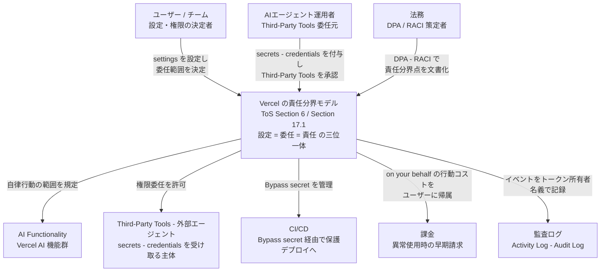
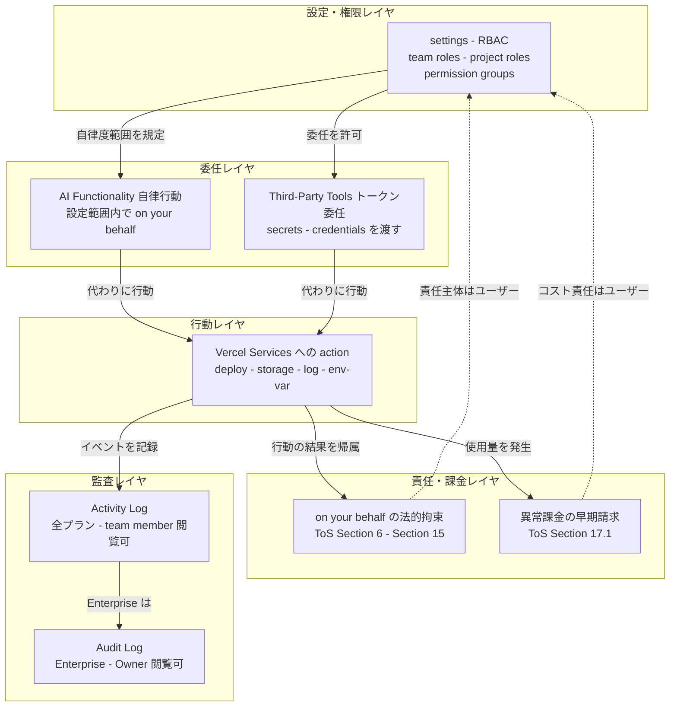
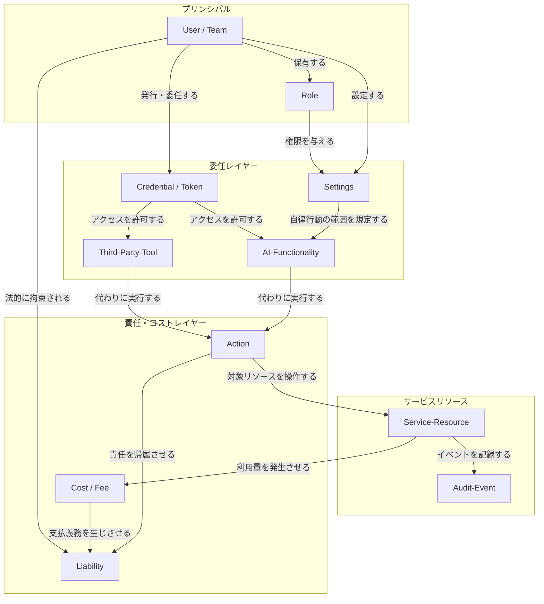
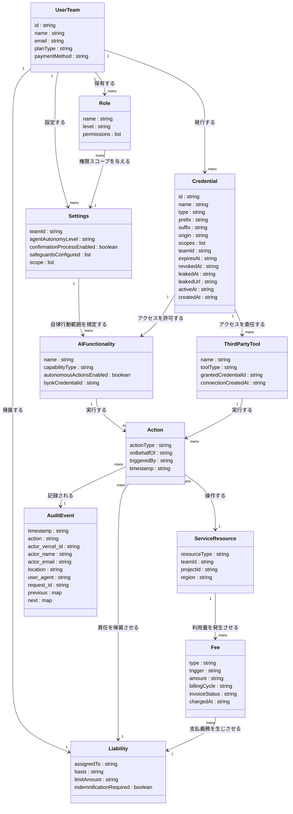

> 検証日: 2026-06-05 / 対象: Vercel 利用規約（ToS Last Updated 2026-06-01, changelog 2026-06 公開・公開日は未再検証）
> 読者: 実装エンジニア / SRE / プラットフォーム運用

## 概要

2026年6月1日付で Vercel は利用規約（Terms of Service）の **Section 6「AI Functionality and Third Party Tools」** を施行し、6月4日に changelog として公開しました（changelog ページはファクトチェック時にアクセス不可だったため公開日そのものは未再検証。条文の正本は ToS 本体 Section 6, Last Updated June 1, 2026 で確認済み）。条文の核心は「**AIや外部エージェントがアカウント上で起こしたことは、設定したユーザーの責任であり、コストもユーザーが負う**」を規約の言葉で明文化した点にあります。

条文は次の3点を規律します。

1. **AI Functionality の自律行動**: ユーザーの設定が、AIがユーザーに代わって取れる自律行動の範囲を決めます。ユーザーは「設定に従ってAIが代わりに取った行動に法的に拘束されること」に同意します。
2. **Third-Party Tools への権限委任**: secrets / credentials / リポジトリアクセスを外部 AI ツール・エージェントに渡した場合、それらが代わりに取った行動に法的に拘束され、発生したコストの責任を負います。
3. **課金の早期化**: 異常・高額・不審な利用を検知した場合、通常の請求サイクルより前に Vercel が発生済み料金を請求できます。

これらは「**設定 = 委任範囲 = 責任範囲**」という三位一体の構造で貫かれています。ユーザーが設定で開いた自律度の範囲が、そのままエージェントへの委任範囲となり、その結果に対する法的責任範囲となります。

この更新は**業界初でも先進的でもありません**。「APIキーを渡した第三者の行為・コストはユーザー責任」という条項は GitHub / AWS / Cloudflare / Anthropic など主要プラットフォームがすでに保持する業界標準です。Vercel 自身も AI Product Terms を2026年3月17日に更新済みであり（6月 ToS Section 6 と完全に同等の代理行為責任条項が3月時点で存在したかは要追加確認）、6月の変更は「既存条項の再パッケージ・AI名指し化」と読むのが正確です。

今回の変更の実質的な意味は、**従来は人間や外部アプリを想定していた責任転嫁条項が、AIエージェントを定義つきで条文に組み込んだ転換点**にあります。実装エンジニア / SRE / プラットフォーム運用にとっては、「設定ミス = 法的責任の発生 + 予期しない早期課金」という直接的なリスクとして読む必要があります。

## 特徴

### 特徴1: 「on your behalf（あなたに代わって）」を法的拘束の起点にした

Section 6 の核心は次の2つの条文にあります（出典: [ToS](https://vercel.com/legal/terms)）。

> Where the AI Functionality is capable of taking autonomous actions ... your settings determine the level of autonomous actions the AI Functionality may take **on your behalf**.

> You **authorize and agree to be legally bound** by the actions taken on your behalf by the AI Functionality in accordance with your settings.

「設定 = 委任範囲 = 責任範囲」の三位一体がここに凝縮されています。AIが暴走しても、その自律度を決めたのはユーザーの設定であり、設定範囲内の行動には法的に拘束されます。Third-Party Tools に対しても同型で、APIキーを渡した時点で「それが代わりに取った行動に拘束され、コストを負う」とみなされます。

### 特徴2: Vercel 免責とユーザーへの責任集約

Section 6 は Vercel を明確に免責します。

> Vercel is not responsible for any loss, damage, liability or other consequence arising from actions taken on your behalf by any Third Party Tools or AI Functionality.

これは規約全体の条項と連動して、**責任がユーザー側へ構造的に集約する**設計になっています。

| 条項 | 内容 | 効果 |
|---|---|---|
| Section 6 | AI / Third-Party Tools 行動の結果 = ユーザー責任 | 直接的な責任転嫁 |
| Section 19 (Disclaimer) | Services は "AS IS" 提供、無停止・無誤りを保証しない | Vercel の品質責任を免除 |
| Section 20.1 (Limit of Liability) | Vercel の責任上限は「$100」と「直近6か月の支払額」の大きい方 | 損害賠償の上限を極小化 |
| Section 15 (Indemnification) | 規約違反・誤用から生じる請求について Vercel を補償する義務 | ユーザーが Vercel を防御する義務 |

「AI機能の便益は Vercel が提供し、自律行動の結果リスクはユーザーが負う」という非対称な構造は、批判として成立する点に留意が必要です。

### 特徴3: 異常使用時の早期課金 — runaway agent への直接対応

Section 17.1 の条文（出典: [ToS](https://vercel.com/legal/terms)）。

> If Vercel detects elevated, irregular, high or anomalous use of the Services, as determined in Vercel's sole discretion, Vercel may automatically charge your payment method for the then accrued fees in connection with the use of the Services.

changelog はこれを「Fees are no longer exclusively tied to a subscription plan」と平易に宣言しています。エージェントが大量リソースを消費した場合、Vercel は通常の請求サイクルを待たずに請求できます。しきい値の具体値は非公開で、未払いが累積すると新規デプロイと一部の課金対象機能が停止します（出典: [understanding-my-invoice](https://vercel.com/docs/pricing/understanding-my-invoice)）。docs は「Partial invoices apply to Pro plan accounts. Hobby and Enterprise accounts are not affected.」と明記しており、partial invoice の対象は **Pro プランのみ**（Hobby / Enterprise は対象外）です。

### 特徴4: 監査はできる。ただし「誰の代理か」は記録されない

Activity Log / Audit Log でアカウント上の操作履歴は確認できます。ただし**責任分界の観点で決定的な限界があります**。

Audit Log の actor 列は `actor_vercel_id / actor_name / actor_email` と `request_id / user_agent` であり、**CSV フィールド上は「誰の代理として（on-behalf-of）」を分離する明示フィールドが存在しません**。したがってエージェントがトークンで操作した場合、人間の操作か、その人のトークンを持ったエージェントの操作かは `user_agent` や origin から推測するしかありません。

規約がエージェント委任の責任をユーザーに置くのに対して、監査の実装はそこに追いついていません。

### 他プラットフォームとの比較

「APIキーを渡した第三者の行為・コストはユーザー責任」は業界標準ですが、**AIエージェントを正面から名指しした責任分界**はまだ少ない状況です。

| プラットフォーム | AIエージェント固有の責任条項 | 異常課金保護 |
|---|---|---|
| **Vercel** (2026-06) | Section 6 で AI Functionality / Third-Party Tools を定義つきで条文化。「on your behalf」を法的拘束の起点に明示 | 早期課金（partial invoice）。しきい値は非公開 |
| **AWS** | ToS 本体ではなく公式ブログ・DevOps Agent docs で「エージェントを自システムで動かす者」まで責任を拡張する言及あり。ToS 本体での直接条文化は限定的 | Budgets / Cost Anomaly Detection（別サービス） |
| **Anthropic** | 2026-06-15 から Agent SDK / `claude -p` を別 credit pool（$20/$100/$200）に分離（Help Center で確認）。2026-02 の Agent SDK API キー必須化は一次未確認[要再確認] | credit pool 上限（ダッシュボード） |
| **Cloudflare** | コア規約に肯定的なエージェント委任条項なし。"automated agents" は禁止行為側に列挙（§2.2.1(e)）。第三者アクセスは §2.3 で "sole risk"（AI 固有ではなく第三者アカウントアクセス一般の規定） | 規約本文の spend cap 記述は弱い |
| **GitHub** | Copilot / Agent は別建て追加規約。コア ToS にエージェント代行の明文化は弱い | Budgets & alerts が最も明確（75/90/100%アラート、stop usage 選択可。ただし budget 作成前・初回 cycle の利用は例外あり） |

位置づけとして、**AWS が「責任共有」という概念を、Anthropic が「誰の認証で・誰の財布でエージェントが動くか」を、Vercel が「設定 = 委任 = 責任の三位一体」を**、それぞれ規約・課金構造で明確化しつつある段階です。Vercel の特徴は、技術プラットフォームの ToS 本体が AI / エージェントを**定義つきで条文に組み込んだ**点にあります。

## 構造

C4 model の粒度（システムコンテキスト / コンテナ / コンポーネント）を借りて、「Vercel 責任分界モデルの論理構造」を3段階で図解します。

### システムコンテキスト図

アクターと外部システムが「Vercel の責任分界モデル」本体に対してどう関係するかを示します。



| 要素名 | 説明 |
|---|---|
| ユーザー / チーム | settings を設定し、委任範囲と責任範囲を決定する最終主体。ToS Section 6 の「設定者 = 責任者」原則の主語 |
| AIエージェント運用者 | 自社または第三者の AI ツールに secrets / credentials を渡す実装担当者。Third-Party Tools の委任元 |
| 法務 | DPA / RACI により責任分界点を社内規程・委託契約に落とし込む役割 |
| Vercel の責任分界モデル | ToS Section 6 および Section 17.1 が規定する「設定 = 委任 = 責任」三位一体の論理構造。本セクション全体の中心 |
| AI Functionality | Vercel が提供する AI 機能群（AI SDK / AI Gateway / Vercel Agent 等）。settings により自律行動の範囲が決まる |
| Third-Party Tools - 外部エージェント | 非 Vercel のツール・スクリプト・サービス・自動化。secrets / credentials / リポジトリアクセスを受け取り on your behalf で行動する |
| CI/CD | Bypass secret（`x-vercel-protection-bypass`）経由で保護デプロイにアクセスする自動化パイプライン |
| 課金 | 行動コストの帰属先。異常・高額・不審な使用を Vercel が検知した場合は通常サイクル前に早期請求される |
| 監査ログ | Activity Log（全プラン）と Audit Log（Enterprise）。操作はトークン所有者名義で記録され、代理の連鎖を明示するフィールドは現時点で存在しない |

### コンテナ図

責任分界モデルを構成する5つの論理レイヤを示します。



#### 設定・権限レイヤ

| 要素名 | 説明 |
|---|---|
| settings - RBAC | team roles（Owner/Member/Developer/Security/Billing/Viewer/Contributor）と project roles（Administrator/Developer/Viewer）、permission groups で委任範囲を具体化する。このレイヤが責任範囲のスコープを決定する |

#### 委任レイヤ

| 要素名 | 説明 |
|---|---|
| AI Functionality 自律行動 | Vercel 組み込みの AI 機能が settings に従い自律的に行動するレイヤ。ユーザーは「設定に従った行動に法的に拘束される」ことに同意する |
| Third-Party Tools トークン委任 | 非 Vercel のツール・エージェントが secrets / credentials を受け取り行動するレイヤ。渡した時点で「その行動に拘束され、コストを負う」ことを承認したとみなされる |

#### 行動レイヤ

| 要素名 | 説明 |
|---|---|
| Vercel Services への action | AI Functionality と Third-Party Tools が実際に操作するデプロイ・ストレージ・ログ・環境変数などのサービス群 |

#### 責任・課金レイヤ

| 要素名 | 説明 |
|---|---|
| on your behalf の法的拘束 | ToS Section 6 が定める「AIや外部エージェントが代わりに取った行動への法的拘束」。Section 15（補償義務）と連動し、誤設定の結果がユーザー側に集約される |
| 異常課金の早期請求 | ToS Section 17.1 が定める「異常・高額・不審な使用を Vercel が検知した場合の早期一括課金」。partial invoice として実装されている（対象は Pro プランのみ） |

#### 監査レイヤ

| 要素名 | 説明 |
|---|---|
| Activity Log | 全イベントを時系列で記録。エージェント設定・トークン作成/失効・provisioning 系イベントを含む。プラン限定の明記なし |
| Audit Log | Enterprise 限定、Owner ロールのみ閲覧可。CSV エクスポート（リンク有効 24h）と SIEM ストリーミング（S3/Splunk/Datadog 等）に対応 |

### コンポーネント図

権限委任を技術設定だけで完結させず、5つの責任層を一貫させる必要があることを示します。各層に Vercel の実コンポーネントをマッピングします。

```mermaid
graph LR
    subgraph L1["アイデンティティ層<br/>NHI - SPIFFE"]
        OIDC["VERCEL_OIDC_TOKEN<br/>鍵管理不要<br/>自動ローテーション"]
        PAT["PAT - team scope<br/>expiresAt - leakedAt 追跡"]
        OAuth["OAuth Access Token<br/>1h 有効 - 30d Refresh<br/>single-use ローテーション"]
    end

    subgraph L2["認可層<br/>最小権限 - PEP-PDP"]
        RBAC["team roles - project roles<br/>permission groups<br/>Access Groups"]
        BypassSec["Bypass secret<br/>システムごとに 1 secret<br/>個別失効可"]
        TokenScope["token scope<br/>team 単位スコープ"]
    end

    subgraph L3["承認・監督層<br/>human-in-the-loop"]
        DeployProt["Deployment Protection<br/>全プラン - preview 保護"]
        AgentPerm["Vercel Agent 権限ゲート<br/>Permissions Required"]
        HumanApproval["危険操作への承認点<br/>アプリ層責務"]
    end

    subgraph L4["監査・観測層<br/>RFC 8693 - NIST AU-10"]
        ActEvt["Activity Log events<br/>token - oauth - ai-gateway"]
        AuditCSV["Audit Log CSV - SIEM<br/>actor-name - actor-email<br/>request-id - user-agent"]
        Gap["代理の連鎖フィールド欠落<br/>on-behalf-of は未実装<br/>user-agent で推測"]
    end

    subgraph L5["契約・規程層<br/>DPA - RACI - CSA"]
        TOS6["ToS Section 6<br/>設定 = 委任 = 責任"]
        DPA["GDPR Art.28 DPA<br/>sub-processor 監査権"]
        RACI["RACI<br/>人間が Accountable"]
        AGGV2["CSA AG-GV.2<br/>authorized scope<br/>accountability lineage"]
    end

    L1 --> L2 --> L3 --> L4 --> L5
    L5 -.->|accountability lineage| L1
```



| 層 | Vercel 実コンポーネント | フレームワーク対応 | 現状・限界 |
|---|---|---|---|
| ① アイデンティティ | `VERCEL_OIDC_TOKEN`（鍵管理不要）、PAT（`expiresAt` / `leakedAt` / team scope）、OAuth Access Token（1h / Refresh 30d single-use） | SPIFFE/SPIRE 短命 SVID 思想、NIST SP 800-207 Zero Trust | 整っている。人に紐づけたくない自動化は OIDC token 推奨。team member 離脱で AI Gateway API key が自動失効するフェイルセーフあり |
| ② 認可 | team roles / project roles / permission groups、Access Groups（project role のみ横断管理）、Bypass secret（システムごとに1つ・個別失効可）、token scope（team 単位） | NIST SP 800-53 AC-6 最小権限、ABAC / PEP-PDP | 粒度は整っている。「増やせるが減らせない」Access Groups の挙動に注意。Contributor は明示割当のないプロジェクトにはアクセス不可 |
| ③ 承認・監督 | Deployment Protection（全プラン）、Deployment Protection Exceptions（Enterprise / Pro+アドオン）、Vercel Agent 権限ゲート | OWASP Agentic Top 10 / AI Agent Security Cheat Sheet、CSA AG-GV.1 自律度ティア | 呼び出しごとの actor 確認ではない。本番デプロイ・本番環境変数変更など危険操作の human-in-the-loop はアプリ層での追加設計が必要 |
| ④ 監査・観測 | Activity Log（token / oauth / ai-gateway 系イベント）、Audit Log（actor-name / actor-email / request-id / user-agent / previous / next） | RFC 8693 `act` クレーム、NIST SP 800-53 AU-10 非否認 | 「誰の代理か（act / on-behalf-of）」の明示フィールドは未実装。エージェントがトークンで操作した場合はトークン所有者名義で記録される。user-agent と request-id が唯一の手がかり |
| ⑤ 契約・規程 | ToS Section 6（設定 = 委任 = 責任）、Section 17.1（異常課金）、Section 20.1（$100 / 直近6か月の責任上限） | GDPR Art.28 DPA、CSA AG-GV.2 監督境界、RACI（AI は R/A になれない） | 規約は責任を委任側に置く。社内規程・委託契約・DPA との整合と、AG-GV.2 による authorized scope / escalation conditions / accountability lineage の文書化はユーザー側の宿題 |

## データ

### 概念モデル

規約と権限委任が扱うエンティティを、所有関係（subgraph）と利用関係（矢印）で表現します。



| 要素名 | 説明 |
|---|---|
| User / Team | 設定・権限の決定主体。法的責任の最終帰属先 |
| Role | team / project レベルの権限ロール |
| Settings | 自律度・確認プロセス・セーフガードの設定 |
| Credential / Token | API key / OIDC / OAuth / Bypass secret |
| AI-Functionality | Vercel 組み込みの AI 機能 |
| Third-Party-Tool | credentials を受け取る外部ツール・エージェント |
| Action | on your behalf で実行される操作 |
| Service-Resource | deploy / storage / log / env-var などの対象リソース |
| Audit-Event | Activity / Audit Log に記録されるイベント |
| Cost / Fee | 通常 / 異常課金の発生 |
| Liability | 法的責任（誰に帰属し、上限はいくらか） |

### 情報モデル

主要エンティティの属性と多重度を定義します。推測属性は末尾に注記しています。



#### 属性の根拠・推測注記

| エンティティ | 根拠・補完区分 |
|---|---|
| Credential | `id / name / type / scopes / teamId / expiresAt / revokedAt / leakedAt / leakedUrl / activeAt` は REST API `/v3/user/tokens` レスポンス仕様に対応。`type`（PAT / OIDC / OAuth）は規約記述から推測 |
| AuditEvent | `timestamp / action / actor_vercel_id / actor_name / actor_email / location / user_agent / request_id / previous / next` の10フィールドが Audit Log の CSV 構造として docs に明記。`act / on_behalf_of` は存在しない（代理の連鎖は非記録） |
| Fee | `type`（subscription / on-demand / domain / non-recurring）は ToS Section 17.1 (i)〜(iv) から抽出。`trigger`（normal / anomalous）は Section 17.1 から抽出 |
| Settings | `agentAutonomyLevel` / `confirmationProcessEnabled` / `safeguardsConfigured` は ToS Section 6 の文言から抽出（実装値は補完） |
| Action | `onBehalfOf` は Section 6「actions taken on your behalf」に対応する概念属性。実際の Audit Log では `actor_vercel_id` として所有者名義で記録され、代理の連鎖を分離するフィールドは存在しない |
| Liability | `limitAmount` は Section 20.1「$100 と直近6か月支払額の大きい方」、`indemnificationRequired` は Section 15 から抽出 |

## 構築方法

エージェントに Vercel の権限を渡す前の初期セットアップを説明します。補完コードは「実装案」として明示し、補完元を参考リンクに含めています。

### エージェント用アイデンティティを人から剥がす

エージェントには、人間メンバーのアカウントに紐づいたトークンを渡さないことが原則です。Vercel が推奨する「人離れ」の手段は 2 種類あります。

#### OIDC トークン（`VERCEL_OIDC_TOKEN`）を使う

Vercel にデプロイされたワークフロー内では、環境変数 `VERCEL_OIDC_TOKEN` が自動的に挿入されます。鍵管理・ローテーション・失効が不要で、デプロイ実行コンテキストに紐づく短命トークンです。

```bash
# Vercel デプロイ内のスクリプト例
# VERCEL_OIDC_TOKEN は Vercel ランタイムが自動注入する(手動設定不要)
curl -H "Authorization: Bearer ${VERCEL_OIDC_TOKEN}" \
  https://api.vercel.com/v9/projects
```

- AI Gateway でも同じトークンを認証に使えます（`AI_GATEWAY_API_KEY` の代替）。
- チームメンバーが退場しても失効しません（人依存の API key とは異なります）。
- Vercel 外部から呼び出すエージェント（CI/CD など）には後述の team-scoped PAT を使います。

#### team-scoped + expiresAt 付き Access Token を発行する

Vercel の REST API でトークンを発行します。`teamId` を指定することでスコープを特定チームに限定し、`expiresAt` で有効期限を設定できます。

```bash
# POST /v3/user/tokens — team-scoped PAT を発行する例（実装案）
# 参考: https://vercel.com/docs/rest-api/authentication/create-an-auth-token
curl -X POST "https://api.vercel.com/v3/user/tokens?teamId=${TARGET_TEAM_ID}" \
  -H "Authorization: Bearer ${VERCEL_PERSONAL_TOKEN}" \
  -H "Content-Type: application/json" \
  -d "{\"name\": \"agent-ci-deploy-$(date +%Y%m%d)\", \"expiresAt\": $(python3 -c 'import time; print(int((time.time() + 86400 * 90) * 1000))')}"
```

レスポンスに含まれる主要フィールドは以下のとおりです。

レスポンスは `{ bearerToken: string, token: { ... } }` の構造で、`bearerToken` だけがトップレベル、その他は `token` オブジェクト内にネストされます。

| フィールド | 配置 | 意味 |
|---|---|---|
| `bearerToken` | トップレベル | 実際の認証文字列（**作成時の一度きり**） |
| `token.id` | token 内 | トークン管理 ID（失効 API で使用） |
| `token.scopes` | token 内 | 付与されたスコープ配列 |
| `token.expiresAt` | token 内 | 有効期限 (ms timestamp) |
| `token.activeAt` | token 内 | 最終使用時刻（追跡用） |
| `token.revokedAt` | token 内 | 失効時刻（失効済みの場合） |
| `token.leakedAt` | token 内 | Vercel が漏洩を検知した時刻 |
| `token.leakedUrl` | token 内 | 漏洩検知されたソース URL |

> `bearerToken` は作成レスポンスの一度きりしか取得できません。必ず安全な Secret Manager に保存してください。

### 最小権限の付与

#### Team / Project ロールの選択

エージェントの team-level ロールは、職責の最小単位に合わせて選びます。

| ロール | できること | エージェント向けの適性 |
|---|---|---|
| Developer | デプロイ・環境設定変更。team 設定・招待は不可 | CI/CD エージェントの標準候補 |
| Security | セキュリティ機能・IP ブロック・ファイアウォール管理。デプロイ不可 | セキュリティスキャンエージェント向け |
| Contributor | 割り当てられたプロジェクトにのみアクセス可。team 権限なし | 最小権限が必要なケースに最適 |
| Pro Viewer | プロジェクト・デプロイの限定的な読み取り専用（Pro プラン） | ステークホルダー連携・軽量監査向け |
| Enterprise Viewer | observability ログ・team 設定・usage まで包括する読み取り専用（Enterprise プラン） | compliance / auditor 向け |
| Billing | 課金情報管理 + 全プロジェクト読み取り専用 | コスト監視エージェント向け（Pro は 1 名まで、Enterprise は複数可） |

- `Viewer` という単一ロールは存在せず、**Pro Viewer**（Pro）と **Enterprise Viewer**（Enterprise）の2ロールに分かれます。
- project level roles の提供範囲、および Developer / Security / Contributor のプラン別可否は docs にゲート表記が明示されていないため要確認です（Billing ロールのみ「Pro は1名・Enterprise は複数」と明記）。
- team owner / member のロールはエージェントには付与しないことを推奨します（最高権限のため）。

#### Contributor + Access Group で最小プロジェクトスコープを絞る

Access Group を使うと、プロジェクト横断で project-level ロールをグループ管理できます。

```
Team Settings > Access Groups > 新規グループ作成
  → 対象プロジェクトを選択
  → エージェントの Contributor メンバーを追加
  → Project Developer または Project Viewer を割り当て
```

- Access Group は project role のみを管理します（team role の上書きはできません）。
- 複数グループに所属する場合は最大権限が採用されます。
- Access Group のプラン要件は本文に明記がありませんが、依存する Directory Sync や project RBAC は Enterprise 系の機能です（要確認）。

#### Permission Groups で粒度を追加する

team role に上乗せする形で、以下の permission group を付与できます。

| Permission Group | 主な用途 |
|---|---|
| Full Production Deployment | 本番デプロイの許可 |
| Usage Viewer | 利用量・コストの読み取り |
| Environment Manager | 環境設定の管理 |
| Environment Variable Manager | 環境変数の管理 |
| Deployment Protection Manager | デプロイ保護設定の管理 |

#### Deployment Protection の Bypass Secret を発行する

AI エージェント・CI/CD・MCP サーバーはブラウザチャレンジを通過できないため、保護されたデプロイにアクセスするには Bypass Secret が必要です。

```bash
# Vercel ダッシュボード操作（CLI での直接発行は要確認）
# Project Settings > Deployment Protection > Protection Bypass for Automation
# → "Add Secret" で新しい secret を生成
# → 環境変数名: VERCEL_AUTOMATION_BYPASS_SECRET
```

Bypass Secret をリクエストヘッダーに付与する方法は以下のとおりです。

```bash
curl -H "x-vercel-protection-bypass: ${VERCEL_AUTOMATION_BYPASS_SECRET}" \
  https://your-preview-deployment.vercel.app/api/health
```

- プロジェクトごとに複数の secret を発行でき、個別に失効させることができます。
- **システム（CI/エージェント）ごとに 1 secret** を使い分けることを推奨します。
- Bypass Secret は全プランで利用できます。
- Deployment Protection Exceptions（特定 preview ドメインを公開する方式）は Enterprise または Pro + Advanced Deployment Protection アドオンが必要です。

### 前提条件・対象プランの整理

| 機能 | Hobby | Pro | Enterprise |
|---|---|---|---|
| Personal Access Token (PAT) | 利用可 | 利用可 | 利用可 |
| OIDC Token (`VERCEL_OIDC_TOKEN`) | 利用可 | 利用可 | 利用可 |
| Activity Log | 利用可 | 利用可 | 利用可 |
| Audit Log + CSV Export | 不可 | 不可 | 利用可（Owner のみ） |
| Custom SIEM Log Streaming | 不可 | 不可 | 別途購入で利用可 |
| Protection Bypass Secret | 利用可 | 利用可 | 利用可 |
| Deployment Protection Exceptions | 不可 | アドオンで可 | 利用可 |
| Access Groups | 不可（要確認） | 不可（要確認） | 利用可 |
| Developer / Security / Contributor ロール | 要確認 | 要確認 | 利用可 |
| 異常課金の早期請求（partial invoice） | 対象外 | 対象 | 対象外 |

## 利用方法

### 委任トークンの作成・スコープ確認・失効

#### 必須パラメータ一覧

| パラメータ | 種別 | 説明 |
|---|---|---|
| `name` | body (必須) | トークンの識別名（用途・日付を含めると追跡しやすい） |
| `expiresAt` | body (任意) | 有効期限（ms timestamp）。設定を推奨（1 日〜1 年が実用範囲、KB [二次情報]） |
| `teamId` | query (任意) | スコープを限定する team の ID。エージェント用途では指定を推奨 |
| `slug` | query (任意) | `teamId` の代替として team slug で指定可 |

#### 作成・確認・失効

```bash
# 作成: team-scoped PAT を発行する（90日有効の例）
curl -X POST "https://api.vercel.com/v3/user/tokens?teamId=${TARGET_TEAM_ID}" \
  -H "Authorization: Bearer ${VERCEL_PERSONAL_TOKEN}" \
  -H "Content-Type: application/json" \
  -d "{\"name\": \"agent-$(date +%Y%m%d)\", \"expiresAt\": $(python3 -c 'import time; print(int((time.time() + 86400 * 90) * 1000))')}"

# スコープ確認: トークン一覧の scopes と activeAt を確認する
curl https://api.vercel.com/v3/user/tokens \
  -H "Authorization: Bearer ${VERCEL_PERSONAL_TOKEN}"

# 失効(個別): 特定トークンを失効させる
curl -X DELETE "https://api.vercel.com/v3/user/tokens/${TOKEN_ID}" \
  -H "Authorization: Bearer ${VERCEL_PERSONAL_TOKEN}"
```

- `leakedAt` / `leakedUrl` が設定されているトークンは漏洩検知済みのため、直ちに失効させてください。
- チームメンバーが退場した場合、そのメンバーが作成した AI Gateway API Key は Vercel が自動失効させます。ただし PAT は自動失効しないため、退場時の手動失効または有効期限設定が必要です（要確認）。

### Activity Log の確認

Activity Log は全プランで利用でき、team 作成以降の全イベントを時系列で記録します。CLI からは `vercel activity` で確認できます。

docs の Events 一覧に Active として掲載されているエージェント・トークン系のイベント種別には、`user-token-created` / `user-token-deleted` / `user-tokens-deleted`、`oauth-app-token-created` / `vercel-app-tokens-revoked`、`ai-gateway-api-key-created` / `-deleted` / `-quota-updated`、`ai-gateway-byok-credential-*`、`ai-code-review` / `ai-alert-investigation`、`ai-omniagent`（Vercel Agent 設定）、`agentic-provisioning-account-blocked / -linked / -relinked / -unlinked / -credentials-rotated / -plan-changed / -team-created`（7種）などがあります。一覧は今後更新されうるため、最新は docs を参照してください。

- Activity Log は外部サービスへの送出を行いません。
- 保持期間の数値は公式ドキュメントに明記がありません（「team 作成以降の全件」と記載）。

### Audit Log の CSV Export / SIEM Streaming（Enterprise のみ）

Audit Log は **Enterprise プラン限定**で、閲覧は **Owner ロールのみ**です。

```
Team Settings > Security & Privacy > Audit Log
  → タイムフレームを選択
  → "Export CSV" をクリック
  → レポートリンクが Owner のメールアドレスに送付される（リンク有効期限: 24 時間）
```

- 直近 90 日分のレポート生成は billing impact なしとされます。90 日超の長期保持については公式ドキュメントに明示がありません（要確認）。
- CSV の各レコードは `timestamp` / `action` / `actor_vercel_id` / `actor_name` / `actor_email` / `location` / `user_agent` / `request_id` / `previous` / `next` の10フィールドで構成されます。

SIEM Streaming（Custom SIEM Log Streaming）は Enterprise の別途購入で、AWS S3 / Splunk / Datadog / Google Cloud Storage / 任意の HTTP エンドポイント（custom header 認証、NDJSON または JSON 配列）へ常時送出できます。

### `act` クレームでの代理記録（アプリ層での実装案）

Vercel の Audit Log / Activity Log の actor モデルは**単一の actor フィールド**（`actor_vercel_id` / `actor_name` / `actor_email`）で構成されています。エージェントがユーザーのトークンを使って操作した場合、そのトークン所有者が actor として記録されます。「人間の代理としてどのエージェントが実行したか」を分離する明示フィールドは Vercel のログには存在しません（公式ドキュメントに記述なし）。

この制約を補うために、RFC 8693（OAuth 2.0 Token Exchange）の `act` クレームをアプリ層で実装する方法を以下に示します。

```python
# 実装案: エージェント操作の act クレームをアプリ層で記録する（補完コード）
# 参考: RFC 8693 https://datatracker.ietf.org/doc/html/rfc8693
import json, time, hmac, hashlib, base64

def create_act_record(subject_user_id, agent_id, action, vercel_request_id, secret_key):
    """RFC 8693 の act クレームに相当するレコードを生成する実装案。
    Vercel の audit log には on-behalf-of フィールドがないため、
    アプリ層でこのレコードを別途保存して代理操作の証跡とする。"""
    record = {
        "iat": int(time.time()),
        "sub": subject_user_id,          # 委任元(人間ユーザー)
        "act": {"sub": agent_id},        # 実行エージェントのアイデンティティ
        "action": action,
        "vercel_request_id": vercel_request_id,  # Vercel のログと突き合わせるキー
    }
    payload = json.dumps(record, sort_keys=True).encode()
    sig = hmac.new(secret_key, payload, hashlib.sha256).digest()
    record["sig"] = base64.urlsafe_b64encode(sig).decode()
    return record
```

- `vercel_request_id` を Vercel 側の Audit Log（Enterprise）の `request_id` と突き合わせることで、`actor_*` のトークン所有者と実際の実行エージェントを紐づけられます。
- `act` クレームは RFC 8693 Section 4.1 で定義されています。委任（delegation）はなりすまし（impersonation）と異なり、「A が B の代理として行動していることを明示した状態」を指します。
- この実装はアプリ層での補完であり、Vercel プラットフォーム側でネイティブに `act` クレームを記録する機能は確認されていません。

## 運用

### エージェント委任の継続監視

- **トークンの棚卸し・失効**: PAT は `expiresAt` を必ず設定します（作成時に1日〜1年を選択可能、[二次情報: KB要約]）。定期的に REST API でトークン一覧を取得し、`activeAt` が古いまたは `leakedAt` が付いたトークンを即時 revoke します。緊急時は `user-tokens-deleted`（現行以外の全トークン一括削除）も使えます。
- **member 離脱時の自動失効**: Vercel は team member が離脱すると、その member が作成した AI Gateway API key を自動失効させます（[一次: ai-gateway/authentication-and-byok]）。人間 member に紐づかない継続的な自動化には OIDC token を使います。
- **Audit Log の SIEM 連携での actor 追跡**: Enterprise では Custom SIEM Log Streaming で Audit Log を常時外部送出できます。`act / on-behalf-of` が存在しないため、SIEM 側で `user_agent` の bot / automation パターン（例: `Vercel-AI-SDK/*`）でエージェント由来イベントをフィルタし、別ダッシュボードで監視する運用を検討します。

**四半期ごとのトークン棚卸し手順**

```
1. GET /v3/user/tokens でトークン一覧を取得する。
2. expiresAt 未設定のトークンを抽出し、用途確認の上 expiresAt を設定するか revoke する。
3. activeAt が90日以上古いトークンを revoke する(未使用トークンは潜在攻撃面)。
4. leakedAt が付いたトークンは即時 revoke し、インシデント記録を残す。
```

### 異常課金への対応

- ToS Section 17.1 により、「異常・高額・不審な利用」を Vercel が検知した場合、通常の請求サイクルより前に partial invoice として発生済み料金が自動決済されます（partial invoice の対象は Pro プランのみ。Hobby / Enterprise は対象外）。検知閾値は非公開で、Vercel の単独裁量で判断されます。
- ダッシュボードの **Spend Management** でアラート（soft limit）と停止（hard limit）を設定します。ただしデフォルトではハード停止は有効でなく、明示設定が必要です（[一次: pricing/manage-and-optimize-usage]）。
- **Spend Management を設定していても突破される事例が報告されています**[二次情報]。帯域急騰のようなスパイクには追いつかないケースがあります。
- 未払いが累積すると「新規デプロイと一部の課金対象機能が停止」します。SRE として、停止トリガーのしきい値と復旧手順（支払い完了後の機能再有効化）を事前に確認しておきます。

**Spend Management 設定の推奨構成**

```
Soft limit (ALERT):   月次予算の 70-80% でアラート発火 + webhook 通知
Hard limit (REJECT):  月次予算の 100% で新規デプロイ・課金対象機能を停止
日次ガードレール:      月次上限の 10-15% (例: $3,000/月 → 最大 $300-450/日) [二次情報]
```

## ベストプラクティス

### 5層モデルに沿った委任設計

- **① アイデンティティ層**: エージェントに人間の PAT を流用しません（1エージェント = 1 identity）。NIST SP 800-207 の「すべての M2M 呼び出しを明示的に認可」に従い、Vercel 上の自動化には OIDC token を優先します。長命 API key は `expiresAt` を最短にし、SPIFFE/SPIRE 的な短命クレデンシャル思想に近づけます。
- **② 認可層**: NIST SP 800-53 AC-6 の最小権限を守り、`Owner` は絶対に渡しません。Access Groups は権限を「増やせるが減らせない」構造のため、複数グループ所属時は最大権限が採用される点に注意します。OWASP AI Agent Security Cheat Sheet の allowed_paths 制限（`*.env` / `*secret*` をブロック）をツール設定に反映します。
- **③ 承認・監督層**: 操作をリスク階層（LOW / MEDIUM / HIGH / CRITICAL）に分類し、HIGH / CRITICAL には人間承認を必須にします。OWASP の `SENSITIVE_TOOLS` に Vercel 文脈の「本番デプロイ push」「本番環境変数変更」「Bypass secret 発行・削除」「quota 更新」を追加します。CSA AG-GV.1 の自律度ティアで分類し、不可逆操作は「意思決定と実行の分離」を実施します。
- **④ 監査・観測層**: NIST SP 800-53 AU-10（非否認）は「個人の代理として動くプロセス」を対象とします。Vercel の Audit Log は on-behalf-of を持たないため、アプリ層で RFC 8693 `act` クレーム相当のメタデータ（`agent_id` / `task_id` / `authorized_by` / `authorization_ts`）を構造化ログに残します。
- **⑤ 契約・規程層**: CSA AG-GV.2（監督境界フレームワーク）に沿い、委任ごとに ①authorized action scope ②escalation conditions ③sub-agent への delegation authority ④accountability lineage を文書化します。RACI では AI は Responsible/Accountable になれず、Accountable は必ず人間が持ちます。

### 規約・社内規程・委託契約の整合

- **GDPR Art.28 DPA**: AIエージェントプラットフォームが EU 在住者データを扱う場合、サービス提供者は processor に該当します。DPA に許可・禁止事項を明記し、processor 変更の通知義務と監査権を契約に盛り込みます。
- **sub-processor の監査権**: primary processor への監査権が、その先の sub-processor に及ばないケースが多くあります。エージェントが third-party plugin を呼ぶ場合、processor 契約と DPIA で trace-level logging と deletion API を要求します[二次情報]。
- **SaaS AUP の遵守**: Vercel AUP は自動システムのレート超過を禁じます。エージェントのレート設計を AUP / API ToS と突き合わせ、gateway layer でレート制限を設けます。
- **EU AI Act（2026年8月全面適用）**: 高リスク AI システムは「介入・上書き・停止できる effective human oversight」を備えます。ISO/IEC 42001 の AIMS を human oversight の実装基盤として使えます（ISO 42001 認証 ≠ EU AI Act 準拠）[二次情報]。

### コスト暴走ガードレール

- **per-session budget**: 1セッションあたりのトークン上限をアプリ層で設定し、再帰ループの無制限蓄積を防ぎます。
- **gateway rate limit**: per-minute / per-hour のレート制限を spending limit とは独立して Gateway 層に置きます。
- **ALERT/REJECT の二段**: soft limit は ALERT（通知のみ）、hard limit は REJECT（HTTP 429 でブロック）として分離します。ALERT だけでは「気づいたが止まらない」状態を生むため、REJECT まで設定します。
- **インフラ層 enforcement**: アプリ層チェックはフォールバックに過ぎず、プロキシ/Gateway 層での enforcement が信頼性の根幹です。request 単位で spend を追跡し、予算超過前にエージェントを遮断します[二次情報]。

### 反証統合（誤解 → 反証 → 推奨）

| 誤解 | 反証 | 推奨 |
|---|---|---|
| **Vercel の規約更新は先進的な早期事例だ** | 第三者・APIキー一般の責任条項は主要プラットフォーム（AWS / Cloudflare / GitHub 等）で一般的に先行し、Vercel 自身も隣接条項を3月に更新済み[要追加確認]。6月更新はコア条項の「再パッケージ・名指し化」に近い | 「先進性」ではなく「業界標準が agentic を名指しし始めた転換点」として捉え、自社の運用設計の照合に使う |
| **設定 + Activity Log で十分に制御できる** | ログと事後レビューは autonomous agent の暴走をリアルタイムには止められない。runaway 事例は「請求を見た時には手遅れ」で、Activity Log は観測であって制御ではない[二次情報] | 実行前ゲート（human-in-the-loop / runtime gating）を別途置く。ログは事後分析と AU-10 非否認のために残す |
| **責任分界が確立した** | 「AIがあなたに代わって取った行動に法的に拘束される」は未解決の争点を含む。一方的 ToS の consent 妥当性、agency law の scope 超過時の非拘束、消費者保護法の優越などの論点がある[二次情報] | 「未決の係争領域に provider 有利の主張が置かれた」段階と理解し、法務と連携して自衛策（DPA / 独自ガードレール / インシデント手順）で補う |
| **運用設計を整えれば対処できる** | フレームワークと現場実装の間に gap があり、「policy 文書はあるが working audit trail がない」状態が常態化している[二次情報]。taxonomy は operationalize されなければ無価値 | フレームワークは出発点。最小限の自動化された enforcement（Gateway rate limit / per-session budget / SIEM アラート）を先に動かす実装ファーストで臨む |

## トラブルシューティング

| 症状 | 原因 | 対処 |
|---|---|---|
| 予期せぬ早期請求（partial invoice）が突然発生した | ToS Section 17.1 の異常使用早期課金がトリガー。エージェントの runaway / bot クローラ / loop による急激な消費が原因の可能性が高い | 1. Activity Log でトリガー前後の `ai-gateway-*` / billing 系イベントを確認 2. `request_id` と `user_agent` で急増源を絞る 3. 問題のエージェントを停止し Spend Management の hard limit を設定 4. runaway の根本原因（ループの終了条件欠如）をコード修正 |
| Spend Management の上限を設定したのに突破された | 帯域急騰のスパイクが polling 間隔を超える速度で発生。ハード停止はデフォルトでなく明示設定が必要[二次情報] | 1. Vercel サポートに partial invoice 詳細を問い合わせ 2. アプリ層に per-request budget チェック、Gateway 層でレート制限（多層防御） 3. WAF / Firewall で bot トラフィックをブロック |
| トークン漏洩が検知された | PAT の `leakedAt` が設定された / third-party ツールにトークンを渡した後にスキャンで発見 | 1. 即座に `DELETE /v3/user/tokens/{id}` で revoke 2. Activity Log で `leakedAt` 以降の該当ユーザーのイベントを全件確認 3. 新規トークンは `expiresAt` と最小 scope で再発行 4. 漏洩経路（ログ出力 / git commit / 環境変数誤設定）を塞ぐ |
| エージェントが本番デプロイを誤実行した | エージェントに `Owner`/`Admin` ロールが付与され、human-in-the-loop なしに本番デプロイできる状態だった | 1. 該当トークンを即時 revoke 2. Audit Log でデプロイの `request_id` を確認し `user_agent` から実行主体を特定 3. デプロイを rollback 4. ロールを最小権限（Viewer / Contributor）に変更 5. 本番デプロイを `SENSITIVE_TOOLS` に分類し承認フローを挟む |
| 監査ログで「誰の代理か」が追えない | Vercel の Audit Log は on-behalf-of を持たず、エージェントがユーザーの PAT で操作するとトークン所有者名義で記録される | 1. `user_agent` でエージェント由来を識別（UA に SDK/ツール名を埋める） 2. アプリ層に RFC 8693 `act` 相当メタデータを構造化ログで残し SIEM に送出 3. `request_id` でアプリログと Vercel Audit Log を突き合わせ 4. エージェント token は人間と別発行し `agent-{purpose}-{env}` の命名規則を設ける |
| AI Gateway API key が突然使えなくなった | team member 離脱で、その member が作成した AI Gateway API key が自動失効された[一次] | 1. Activity Log で `ai-gateway-api-key-created / -deleted` を確認 2. 人間 member に紐づかない OIDC token への移行を検討 3. 新規 key は退職リスクの低い service account 相当で作成 |

## まとめ

Vercel の2026年6月の規約更新は、「AIや外部エージェントがあなたに代わって取った行動とそのコストは、設定したあなたの責任」を「設定 = 委任 = 責任」の三位一体として条文に書き込んだものです。業界初ではなく、責任転嫁条項が agentic を名指しし始めた転換点として読み、エージェントに権限を渡す前に「短命アイデンティティ・最小権限・実行前の承認点・代理を残す監査・コストの二段ガード・規約と社内規程の整合」という5層を自分のチームで設計しておくことが、設定ミス由来の法的責任と予期せぬ早期課金から身を守る現実的な備えになります。

この記事が少しでも参考になった、あるいは改善点などがあれば、ぜひリアクションやコメント、SNSでのシェアをいただけると励みになります！

## 参考リンク

### Vercel 一次ソース
- [Terms of Service — Section 6 / 15 / 17.1 / 19 / 20.1 (Last Updated June 1, 2026)](https://vercel.com/legal/terms)
- [Updates to Legal Terms changelog (June 2026)](https://vercel.com/changelog/updates-to-legal-terms-june-2026)
- [AI Product Terms (March 17, 2026)](https://vercel.com/legal/ai-product-terms)
- [Acceptable Use Policy (April 21, 2026)](https://vercel.com/legal/acceptable-use-policy)
- [Activity Log docs](https://vercel.com/docs/activity-log)
- [Audit Log docs](https://vercel.com/docs/audit-log)
- [RBAC — Access Roles](https://vercel.com/docs/rbac/access-roles)
- [RBAC — Access Groups](https://vercel.com/docs/rbac/access-groups)
- [REST API — Create an Auth Token](https://vercel.com/docs/rest-api/authentication/create-an-auth-token)
- [Sign in with Vercel — Tokens](https://vercel.com/docs/sign-in-with-vercel/tokens)
- [AI Gateway — Authentication and BYOK](https://vercel.com/docs/ai-gateway/authentication-and-byok)
- [Deployment Protection — Automated Agent Access](https://vercel.com/docs/deployment-protection/automated-agent-access)
- [Pricing — Manage and Optimize Usage (Spend Management)](https://vercel.com/docs/pricing/manage-and-optimize-usage)
- [Pricing — Understanding my Invoice (partial invoice)](https://vercel.com/docs/pricing/understanding-my-invoice)

### 運用設計フレームワーク（一次）
- [IETF RFC 8693 — OAuth 2.0 Token Exchange (`act` クレーム)](https://datatracker.ietf.org/doc/html/rfc8693)
- [NIST SP 800-53 Rev.5 — AC-6 最小権限 / AU-10 非否認 / AU-9 改ざん耐性](https://csf.tools/reference/nist-sp-800-53/r5/au/)
- [NIST SP 800-207 — Zero Trust Architecture](https://doi.org/10.6028/NIST.SP.800-207)
- [OWASP AI Agent Security Cheat Sheet](https://cheatsheetseries.owasp.org/cheatsheets/AI_Agent_Security_Cheat_Sheet.html)
- [OWASP Agentic AI Top 10（2025年12月リリース、v1.0 は後続）](https://genai.owasp.org/)
- [CSA Agentic AI — NIST AI RMF Profile v1 (AG-GV.1 / AG-GV.2 / AG-MS.1 / AG-MG.1)](https://labs.cloudsecurityalliance.org/agentic/agentic-nist-ai-rmf-profile-v1/)
- [CNCF SPIFFE / SPIRE](https://spiffe.io/)
- [AWS Shared Responsibility Model & GDPR](https://docs.aws.amazon.com/whitepapers/latest/navigating-gdpr-compliance/shared-security-responsibility-model.html)

### 反証・実害事例（二次情報）
- [National Law Review — Contract Law in the Age of Agentic AI](https://natlawreview.com/article/contract-law-age-agentic-ai-whos-really-clicking-accept)
- [Agentic Commerce Guide — Navigating Legal Liability for AI Agent Actions](https://www.agenticcommerceguide.com/blog/agentic-commerce-navigating-legal-liability-for-ai-agent-actions)
- [TechStartups — $47,000 multi-agent runaway 事例](https://techstartups.com/2025/11/14/ai-agents-horror-stories-how-a-47000-failure-exposed-the-hype-and-hidden-risks-of-multi-agent-systems/)
- [Tom's Hardware — Claude runaway 事例](https://www.tomshardware.com/tech-industry/artificial-intelligence/mystery-company-accidentally-blew-usd500-million-on-claude-in-a-single-month-failed-to-put-usage-limit-on-licenses-for-employees)
- [CloudZero — AI Cost Guardrails](https://www.cloudzero.com/blog/ai-cost-guardrails/)
- [IAPP — Engineering GDPR Compliance in the Age of Agentic AI](https://iapp.org/news/a/engineering-gdpr-compliance-in-the-age-of-agentic-ai)
- [DEV Community — Vercel's Agentic Shift（非対称リスク批判）](https://dev.to/matscode/vercels-agentic-shift-is-your-proprietary-code-now-training-ai-402h)
