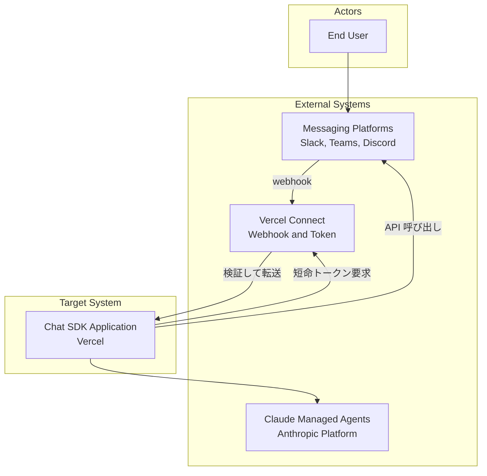
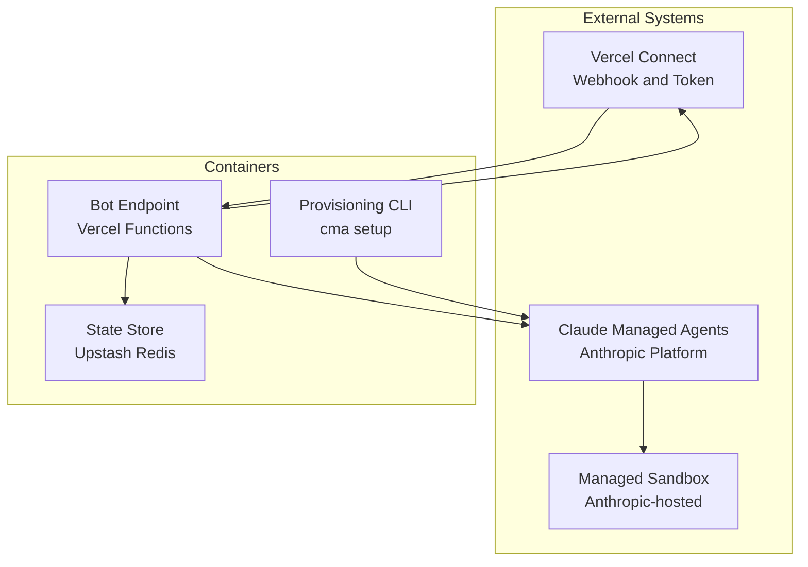
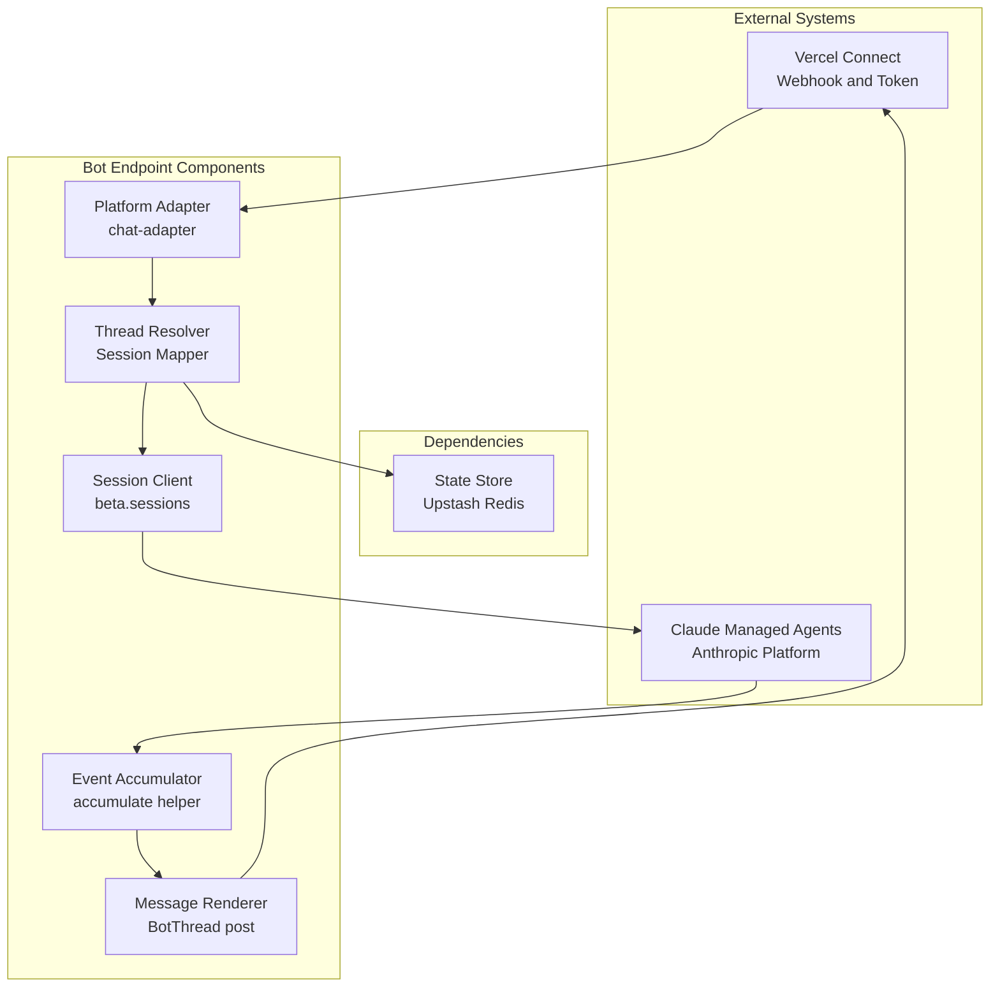
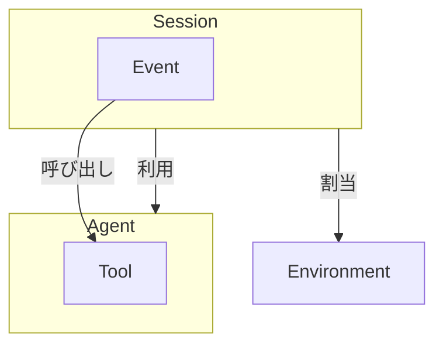
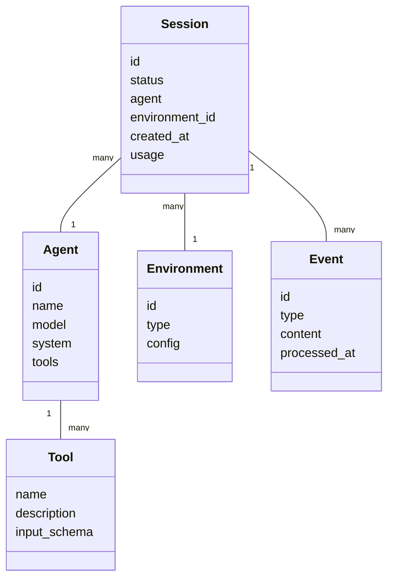
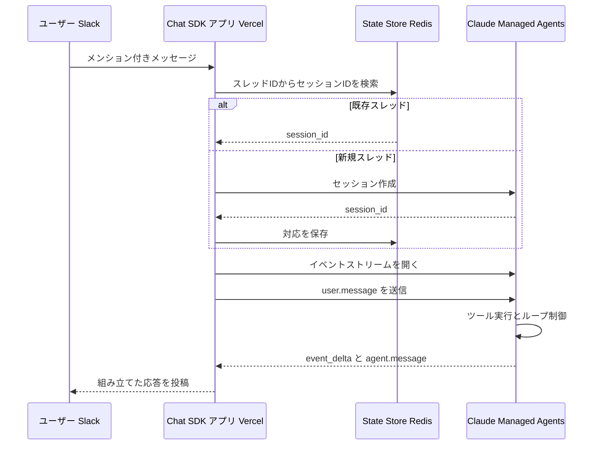
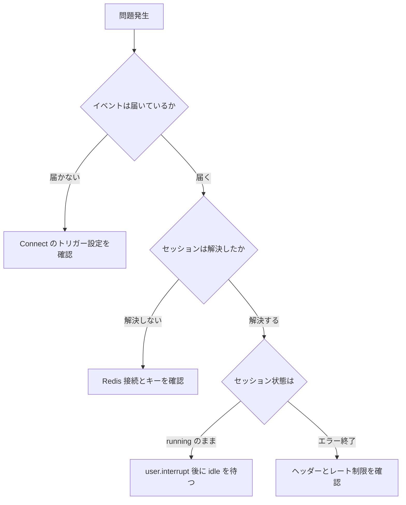

Vercel が公開した「Claude Managed Agents with Chat SDK」は、チャットボットの実装から「エージェントの実行ループ」と「会話履歴の永続化」を取り除く構成です。

この記事では、この構成のアーキテクチャ、データモデル、導入手順、実装コード、運用上の判断ポイントを整理します。読み終えると、自前でループを回す構成との違いと、採用したときにアプリケーション側へ残る責務の範囲がわかります。

用語が紛らわしい領域なので、先に一点だけ確認します。ここでいう Chat SDK は `useChat` を使う Next.js のチャットボットテンプレートではありません。詳細は次章で扱います。

なお本文中の API 名・環境変数・コード例は、2026-08-30 時点の公式ドキュメントと公式テンプレート `vercel-labs/cma-chat-sdk` の実装に照合しています。


*この記事の全体像。以下、順に解説します。*

## Claude Managed Agents with Chat SDKとは

この構成は、Anthropic がホストするエージェント実行基盤（Claude Managed Agents）と、Vercel が提供するマルチプラットフォーム向けボット SDK（Chat SDK）を接続したものです。

会話履歴、ツール実行ループ、サンドボックス状態は Anthropic 側がサーバーサイドで保持します。アプリケーション側は、会話の中身を保存するデータベースを持ちません。

### 名前が紛らわしい4つの構成要素

| 要素 | 実体 | よくある誤解 |
|---|---|---|
| **Chat SDK** | Slack / Teams / Google Chat / Discord / Telegram / WhatsApp へ同一コードで応答する TypeScript 製ボット SDK。npm パッケージ名は `chat`、Slack アダプタは `@chat-adapter/slack` | AI SDK ベースの Next.js チャット UI テンプレートと混同されやすい |
| **Chatbot template** | かつて `chat-sdk.dev` が指していた `useChat` ベースの Next.js テンプレート。改名して別リポジトリへ移動済み | 現在の Chat SDK と同一視されやすい |
| **Claude Managed Agents** | Anthropic 側の実行基盤。Agent / Environment / Session / Event の4概念で構成される | Messages API の薄いラッパーと誤解されやすい |
| **Vercel Sandbox 統合** | Managed Agents のツールを Vercel 側の microVM で実行する別構成。2026-05-18 に別途公開 | Chat SDK テンプレートの既定と誤解されやすい。既定は Anthropic 管理サンドボックス |

つまり、この構成のクライアント側に `useChat` は登場しません。入口は Web ブラウザではなく Slack などのメッセージングプラットフォームです。

なお Claude Managed Agents の API はベータ扱いで、リクエストに `managed-agents-2026-04-01` のベータヘッダーが必要です。

### 実行ループをどこに置くかという選択

| 比較項目 | Claude Managed Agents with Chat SDK | Vercel AI SDK 単体 | LangChain (Agents) |
| --- | --- | --- | --- |
| **実行ループ** | Anthropic 側がホストする | アプリケーション側で実装する | アプリケーション側または別インフラで実装する |
| **会話履歴の所在** | Anthropic 側にサーバー永続化される | 自前のデータベースに保持する | 自前のストアまたはメモリに保持する |
| **アプリ側が持つ状態** | 会話内容は持たない。購読・重複排除・スレッドとセッションの対応表のみ | メッセージ列とツール実行履歴の全量 | チェーン状態とメモリの全量 |
| **ツール実行環境** | Anthropic 管理サンドボックス（別途 Vercel Sandbox 統合も可） | 自前の実行環境 | 自前の実行環境 |
| **細かい制御** | 制御点が限定される | ループの割り込みまで細かく制御できる | 抽象化を組み替えて制御できる |

サーバーレス関数でエージェントを動かすとき、最大の制約は関数の実行時間でした。ツール呼び出しを含むループ全体を1リクエストに収めなければならないためです。

実行ループを Anthropic 側へ委譲すると、ループ本体は関数の寿命から切り離せます。ただし制約が完全に消えるわけではありません。テンプレートの実装は関数の中でイベントストリームを読み続けてプラットフォームへ転送するため、リアルタイム配信と結果回収には、関数の実行時間・接続切断・再接続への対応が残ります。ストリームが切れてもエージェントの処理自体は Anthropic 側で継続するので、後から結果を取りに行く設計が必要です。

用途別の向き不向きは次の通りです。

| ユースケース | 推奨アプローチ | 理由 |
| --- | --- | --- |
| Slack / Teams 向け自律型リサーチボットの開発 | Claude Managed Agents with Chat SDK | 履歴管理が自動化され、プラットフォーム連携もアダプタで吸収されるため |
| アプリケーション固有の複雑な対話フローの構築 | Vercel AI SDK | ループの割り込みや独自の制御ロジックを細かく実装できるため |
| 複数モデルを組み合わせた複雑なパイプラインの構築 | LangChain | 多様な外部コンポーネントとエコシステムを利用できるため |

## 主な特徴

- **サーバーサイドの状態保持**: 会話履歴が Anthropic 側に保持され、会話内容をアプリケーション側で復元する処理が不要です。ただし保持期間は2種類あります。会話履歴は明示的に削除するまで保持される一方、**サンドボックス状態（ファイル・インストール済みツール・生成物）はサンドボックス作成から30日**です。利用を続けてもこの窓は延長されません。
- **マルチプラットフォーム対応**: Chat SDK のアダプタが Slack / Teams / Discord などの API 差異を吸収します。
- **実行ループの委譲**: ツール呼び出しと再入力の反復を Anthropic 側が担うため、ループ本体を関数の実行時間内に収める必要がありません。
- **明示的なライフサイクル API**: セッションの取得・更新・アーカイブ・削除が API として提供されます。
- **コンプライアンス上の制約**: Managed Agents は ZDR（Zero Data Retention）および HIPAA BAA の対象外であると公式ドキュメントに明記されています。規制データを扱う経路では採用できません。

最後の1点は、採用判断の前段で確認すべき制約です。会話履歴がベンダー側に残る構成である以上、扱えるデータの種類が先に決まります。

## アーキテクチャ

この構成を3階層で分解します。

### システムコンテキスト図

システム全体と外部システムの境界です。



| 区分 | 要素名 | 説明 |
|---|---|---|
| Actors | End User | メッセージングプラットフォームを通じてエージェントと対話する利用者 |
| External | Messaging Platforms | ユーザーインターフェースを提供するメッセージング基盤 |
| External | Claude Managed Agents | 会話状態の保持とツール実行ループを担うホスト型実行基盤 |
| External | Vercel Connect | Slack の署名付きイベントを検証してアプリへ転送し、送信時は短命ランタイムトークンを発行する |
| Target | Chat SDK Application | Chat SDK を利用して構築されたボットアプリケーション |

受信と送信で Connect の役割が異なる点に注意してください。受信は Connect が webhook を検証してアプリへ転送します。送信は Connect が代理送信するのではなく、アプリが必要な瞬間に Connect からトークンを取得して Slack API を直接呼びます。この構成のおかげで、プラットフォームの長期認証情報を環境変数に置かずに済みます。

また、ユーザーが自社アプリケーションの画面を一度も開かない点も特徴です。UI はすべてメッセージングプラットフォーム側にあります。

### コンテナ図

アプリケーション内部の構成要素です。



| 区分 | 要素名 | 説明 |
|---|---|---|
| External | Vercel Connect | Slack イベントの検証・転送と、送信用の短命トークン発行を担う |
| External | Claude Managed Agents | セッションの生成・継続とイベントストリームの配信を担う |
| External | Managed Sandbox | Anthropic 側が管理するツール実行環境 |
| Container | Bot Endpoint | Chat SDK をホストし、受信イベントとセッション連携を処理するサーバーレス関数 |
| Container | State Store | 購読状態、webhook の重複排除、スレッドとセッションの対応表を保持する Redis |
| Container | Provisioning CLI | Agent と Environment を初回発行し、識別子を環境変数へ書き出す |

自前で持つ永続ストアは Redis ひとつだけです。ただし用途は対応表に限りません。公式テンプレートは Redis を「購読状態・重複排除・スレッドとセッションの対応」の3用途に使います。会話の中身を保存するテーブルが存在しない、というのが正確な表現です。

### コンポーネント図

Bot Endpoint 内部のモジュール構成です。



| 区分 | 要素名 | 説明 |
|---|---|---|
| External | Vercel Connect | イベントの受信経路であり、送信トークンの発行元でもある |
| External | Claude Managed Agents | セッションイベントを受け取り、ストリームで結果を返す |
| Dependency | State Store | 購読・重複排除・スレッドとセッションの対応を永続化する |
| Component | Platform Adapter | 各プラットフォームのイベント形式差異を吸収する |
| Component | Thread Resolver | 既存スレッドならセッションを継続し、新規なら生成する |
| Component | Session Client | Anthropic SDK の `beta.sessions` 経由でセッションを操作する |
| Component | Event Accumulator | 差分イベントを積み上げて表示可能なメッセージへ組み立てる |
| Component | Message Renderer | 組み立て結果をスレッドへ投稿する |

自分で書くコードの中心は Thread Resolver です。ここが「どのスレッドをどのセッションに対応させるか」を決めます。

## データモデル

Claude Managed Agents のデータ構造を、概念と属性の2階層で見ます。

### 概念モデル

エンティティ間の所有関係をサブグラフで、利用関係を矢印で示します。



データ構造の中心は Session です。Session は「どの Agent 定義を使い、どの Environment で動くか」を作成時に指定して結び付けます。

ここで押さえるべきは、Agent と Environment が独立したリソースである点です。Agent が Environment を所有するのではなく、Session が両者を組み合わせます。同じ Environment を複数のセッションが共有でき、その場合もセッションごとに隔離されたサンドボックスが割り当てられます。

| 概念 | 位置付け | 関係 |
| :--- | :--- | :--- |
| **Agent** | モデル・システムプロンプト・ツール定義をまとめた設計図 | Tool を持ち、Session から参照される |
| **Environment** | ツールが動作するサンドボックス定義。独立リソース | Session から参照される。複数 Session で共有できる |
| **Tool** | Agent が呼び出せる機能の定義 | Agent の設定に含まれ、Event から呼び出される |
| **Session** | Agent と Environment を結び付けた実行インスタンス | Event を所有する |
| **Event** | 会話とツール実行の最小単位 | Session に所有される |

セッションの削除は Session と Event、およびそのセッション固有のサンドボックスに閉じます。Agent と Environment は独立リソースなので、セッションを消しても残ります。

運用に効く性質がもうひとつあります。セッションは作成時点の Agent 設定に固定されます。Agent 側の定義を更新しても、既存セッションの挙動は変わりません。

### 情報モデル

主要な属性と多重度です。属性名は API のレスポンス形（snake_case）に合わせています。



| エンティティ | 役割 | 注意点 |
| :--- | :--- | :--- |
| **Agent** | モデル・システムプロンプト・ツール群の定義を持つ | Session レスポンスでは `session.agent` に設定が埋め込まれて返る |
| **Tool** | ファイル操作や Web 検索などの機能を定義する | セッション更新時は `agent.tools` の配列全体が置換される |
| **Environment** | ツールが実行されるサンドボックス環境を表す | 独立リソースであり、セッション削除の影響を受けない。トップレベルの `type` は常に `environment` で、Anthropic 管理か self-hosted かは `config.type` が示す |
| **Session** | 実行中のエージェントインスタンスを管理する | `running` 状態ではアーカイブ・削除ができない |
| **Event** | ユーザー入力・思考・ツール実行結果の通信単位 | 時刻フィールドは `processed_at` であり、汎用の `timestamp` はない |

「注意点」の列は、いずれも後段の実装でつまずく箇所です。特に `agent.tools` の全置換と `running` 状態の削除不可は必ず踏みます。

## 導入手順

Vercel Labs が公開するテンプレートを起点に構築します。

### 前提条件

- **Node.js 24 以上**（テンプレートの `engines` が `>=24` を要求します）
- pnpm（テンプレートの依存導入手順が pnpm 前提です）
- Anthropic の API キー、および Managed Agents のベータへアクセスできる状態
- Vercel CLI と、デプロイ先プロジェクトへのログイン
- Vercel Connect の Slack コネクタを作成できる権限
- Upstash Redis（Vercel Marketplace 経由で追加します）

```bash
node --version   # v24 以上であること
pnpm --version
npx vercel --version
```

### テンプレートの取得

テンプレートリポジトリは `vercel-labs/cma-chat-sdk` です。

```bash
git clone https://github.com/vercel-labs/cma-chat-sdk
cd cma-chat-sdk
pnpm install
```

:::message alert
リポジトリ内 README の `git clone` 例には旧名 `claude-research-bot` が残っていますが、その URL は解決しません。2026-08-30 時点で解決するのは `cma-chat-sdk` です。README をそのままコピーすると最初のコマンドで失敗します。
:::

### Vercel Connect と Redis の設定

Slack との接続は Vercel Connect が担います。webhook の転送先パスをコネクタへ結び付けます。

```bash
# プロジェクトを紐付ける
npx vercel link

# Slack コネクタを作成する。--triggers で webhook 転送を有効化する
npx vercel connect create slack --name claude-research-bot --triggers

# 転送先のプロジェクト・環境・パスを指定して結び付ける
npx vercel connect attach slack/claude-research-bot \
  --project YOUR_VERCEL_PROJECT \
  --environment production \
  --triggers \
  --trigger-path /api/webhooks/slack

# 状態保存用の Redis を追加する
npx vercel integration add upstash/upstash-kv
```

`--triggers` は `create` と `attach` の両方で必要です。どちらかを落とすと webhook がアプリへ転送されません。

### エージェントのプロビジョニング

セットアップスクリプトが Anthropic 側に Environment と Agent を作成し、識別子を書き出します。

```bash
# Agent と Environment の初回発行、および Vercel 環境変数への反映
npm run cma:setup -- --vercel

# システムプロンプトやツール定義を変更したときの反映
npm run cma:update
```

`cma:setup` は識別子の初回発行専用です。定義を変えるたびに `cma:setup` を叩くのではなく、`cma:update` を使います。

:::message
README は依存導入に `pnpm install` を、スクリプト実行に `npm run` を案内しており、表記が揃っていません。スクリプト本体はパッケージマネージャに依存しないため、`pnpm cma:setup -- --vercel` でも同じ結果になります。
:::

### 環境変数の設定と動作確認

テンプレートが必須とする環境変数は次の5つです。Vercel Connect が Slack の認証情報を保持するため、`SLACK_BOT_TOKEN` や `SLACK_SIGNING_SECRET` は設定しません。

```env
ANTHROPIC_API_KEY=sk-ant-...
CLAUDE_AGENT_ID=agent_...
CLAUDE_ENVIRONMENT_ID=env_...
REDIS_URL=rediss://...
SLACK_CONNECTOR=slack/<connector-name>
```

```bash
npx vercel env pull .env.local
pnpm dev
```

Connect のトリガーは登録したデプロイ先へイベントを転送します。そのため、ローカルの開発サーバーを起動しただけでは Slack との往復は確認できません。実往復の確認はデプロイ後に行います。

## 使い方と実装例

### 主要パラメータ

| パラメータ名 | 役割 |
|---|---|
| `ANTHROPIC_API_KEY` | Anthropic API の認証に利用する |
| `CLAUDE_AGENT_ID` | セッション作成時に `agent` へ渡す Agent の識別子 |
| `CLAUDE_ENVIRONMENT_ID` | セッション作成時に `environment_id` へ渡す Environment の識別子 |
| `REDIS_URL` | 購読・重複排除・スレッドとセッションの対応表の保存先 |
| `SLACK_CONNECTOR` | 利用する Vercel Connect の Slack コネクタ名 |
| `anthropic-version` ヘッダー | `2023-06-01` を付与する（SDK 利用時は自動） |
| `anthropic-beta` ヘッダー | `managed-agents-2026-04-01` を付与する（SDK 利用時は自動） |

### 処理の流れ

- 受信したイベントからスレッド識別子を取り出す
- 対応表を引き、既存セッションがあれば継続し、なければ生成する
- 先にイベントストリームを開いてから、ユーザー発言を送信する
- 差分イベントを積み上げ、確定した応答をスレッドへ投稿する



### セッションの生成と継続

セッション操作は Anthropic の TypeScript SDK の `beta.sessions` 経由で行います。`AnthropicSession` のような専用クラスは存在しません。

作成時のパラメータ名は `agent` と `environment_id` です。`agent_id` ではない点に注意してください。

```ts
import Anthropic from '@anthropic-ai/sdk';

const client = new Anthropic({ apiKey: process.env.ANTHROPIC_API_KEY });

// 新規スレッドではセッションを作成する
const session = await client.beta.sessions.create({
  agent: process.env.CLAUDE_AGENT_ID!,
  environment_id: process.env.CLAUDE_ENVIRONMENT_ID!,
  metadata: { slack_thread_id: threadId },
});

// 既存スレッドでは保存済み session_id を再利用する
const existing = await client.beta.sessions.retrieve(savedSessionId);
```

会話履歴を組み立てて送る処理がない点に注目してください。過去のメッセージ列は Anthropic 側にあるため、送るのは新しい発言だけです。

### イベントの送信とストリームの受信

イベント送信は `events.send` です。`content` は文字列ではなく content block の配列を渡します。

ストリームは送信より先に開きます。あとから開くと、その間に流れたイベントを取りこぼすためです。

```ts
import { accumulateManagedAgentsEvent } from '@anthropic-ai/sdk/lib/sessions/accumulate';

// 1. 先にストリームを開く
const stream = await client.beta.sessions.events.stream(sessionId, {
  event_deltas: ['agent.message'],
});

// 2. ユーザー発言を送信する
await client.beta.sessions.events.send(sessionId, {
  events: [{ type: 'user.message', content: [{ type: 'text', text: userText }] }],
});

// 3. イベントIDごとに差分を積み上げ、確定メッセージを投稿する
const previews = new Map<string, unknown>();
const textOf = (content: Array<{ type: string; text?: string }>) =>
  content.filter((block) => block.type === 'text').map((block) => block.text ?? '').join('');

for await (const event of stream) {
  switch (event.type) {
    case 'event_start':
      previews.set(event.event.id, undefined);
      break;
    case 'event_delta': {
      const next = accumulateManagedAgentsEvent(previews.get(event.event_id), event);
      previews.set(event.event_id, next);
      break;
    }
    case 'agent.message':
      previews.delete(event.id);
      await thread.post(textOf(event.content));
      break;
    case 'session.status_idle':
      return; // ターン完了。ストリームを閉じる
  }
}
```

3点、実装で外せないポイントがあります。

1. **応答イベントの型は `agent.message`**: Messages API の感覚で `assistant.message` を待ち受けると、いつまでも投稿されません。
2. **差分はイベントIDごとに積み上げる**: `accumulateManagedAgentsEvent` はストリーム全体を包む AsyncIterable ラッパーではありません。`event_start` で受け皿を作り、`event_delta.event_id` ごとに状態を持ち回します。単一の変数を共有すると、並行するイベントのプレビューが混ざります。
3. **`session.status_idle` で抜ける**: これを見ないと、ターンが終わってもストリームを待ち続けます。

Slack のようにメッセージ更新のレート制限がある環境では、トークン単位の差分をそのまま流さず、積み上げた結果を間引いて投稿するほうが安定します。

### セッションの更新と終了

セッション更新 API では `budget`、`metadata`、`title`、`agent` を変更できます。ただし **Agent 設定のうち変更できるのは `agent.tools` と `agent.mcp_servers` だけ**で、しかもセッションが `idle` のときに限られます。

更新は配列全体の置換として扱われるため、既存設定を残す場合は取得してから組み立て直します。

```ts
// 既存を読み出してから配列を組み立て直す
const current = await client.beta.sessions.retrieve(sessionId);
if (current.status !== 'idle') {
  throw new Error('agent 設定の更新は idle のときだけ可能です');
}
await client.beta.sessions.update(sessionId, {
  agent: { tools: [...current.agent.tools, newTool] },
});
```

終了時は割り込みを送ってから、状態が `idle` になるのを待って削除します。`user.interrupt` はキューに入るだけで即座には適用されないため、送信直後に `delete` を呼ぶと `running` のまま削除しようとして失敗します。

```ts
await client.beta.sessions.events.send(sessionId, {
  events: [{ type: 'user.interrupt' }],
});

// idle になるまで待ってから削除する
let state = await client.beta.sessions.retrieve(sessionId);
while (state.status !== 'idle') {
  await new Promise((resolve) => setTimeout(resolve, 1_000));
  state = await client.beta.sessions.retrieve(sessionId);
}
await client.beta.sessions.delete(sessionId);
```

`update` へ差分だけを渡すと既存のツール設定が消えます。ここは実装時に最も事故が起きやすい箇所です。

## 運用

### 起動・停止

- Vercel CLI で環境を操作する
- プロジェクトのデプロイにより起動する
- 障害時は直前の正常なデプロイへ切り戻す

```bash
# 本番デプロイ
npx vercel deploy --prod

# 直前の正常なデプロイへ切り戻す
npx vercel rollback
npx vercel rollback status
```

### 状態確認・ログ確認

エージェント側とアプリケーション側で、見る場所が分かれます。

| 見たいもの | 確認先 |
|---|---|
| エージェントの思考・ツール実行の経過 | Claude Console の Managed Agents セッションビューア |
| セッション単位のトークン消費 | `sessions.retrieve()` が返す `usage` |
| webhook 受信・ストリーム切断・投稿失敗 | Vercel の Function ログ |

```bash
# デプロイのログを追跡する
npx vercel logs <deployment-url> --follow
```

監視単位をリクエストではなくセッションに置く点が、従来のチャットボット運用との違いです。1回の発言に対してツール実行が複数回走るため、リクエスト単位のレイテンシは実感と一致しません。

なお公式テンプレートは Anthropic SDK を API キーで直接初期化しており、Vercel AI Gateway を経由しません。Gateway のダッシュボードで消費量を見たい場合は、リクエストを Gateway 経由へ向ける設定を自分で追加したうえで、Managed Agents のエンドポイントが通ることを実機で確認してください。既定の構成では Gateway に何も現れません。

### 更新・スケール操作

- Git リポジトリへの Push を契機とした自動デプロイを利用する
- エージェントの実行環境は Anthropic 側でスケールされる
- Managed Agents のレート制限は作成系 300 req/min、参照系 1,200 req/min

```bash
# 環境変数の追加と反映
npx vercel env add ANTHROPIC_API_KEY production
npx vercel env pull .env.local
npx vercel deploy --prod
```

### セッションの棚卸し

- **会話履歴**は明示的に削除するまで保持される。自動失効の記載は公式ドキュメントに見当たらない
- **サンドボックス状態**は作成から30日で回復不能になる。30日を過ぎたセッションを再開すると、新しいサンドボックスから始まる
- 生成物が後で必要なら、30日の窓が閉じる前に outputs として取り出しておく
- 不要になったセッションは削除 API で明示的に破棄する。削除するとセッション固有のサンドボックスも即座に失われる
- Agent と Environment は独立リソースなので、セッション削除では消えない

```bash
curl -X DELETE https://api.anthropic.com/v1/sessions/$SESSION_ID \
  -H "x-api-key: $ANTHROPIC_API_KEY" \
  -H "anthropic-version: 2023-06-01" \
  -H "anthropic-beta: managed-agents-2026-04-01"
```

状態を持たない構成のはずが、実際にはベンダー側に状態が積み上がります。削除を運用フローへ組み込まないと、監査やコストの観点で後から効いてきます。

## ベストプラクティス

### CI/CD連携

- Vercel の Git 統合を活用してデプロイを自動化する
- エージェント定義ファイルの変更を検知したら `cma:update` を実行するジョブを組み込む
- プレビュー環境で E2E テストを実行してから本番へ昇格させる

```yaml
# GitHub Actions の例
steps:
  - uses: actions/checkout@v4
  - uses: pnpm/action-setup@v4
  - uses: actions/setup-node@v4
    with:
      node-version: 24
      cache: pnpm
  - name: Install
    run: pnpm install --frozen-lockfile
  - name: Pull Preview Environment
    run: npx vercel pull --yes --environment=preview --token=${{ secrets.VERCEL_TOKEN }}
  - name: Build and Deploy Preview
    run: |
      npx vercel build --token=${{ secrets.VERCEL_TOKEN }}
      npx vercel deploy --prebuilt --token=${{ secrets.VERCEL_TOKEN }}
```

`vercel pull` は環境変数とプロジェクト設定を取得するだけで、デプロイは行いません。Preview を作るには `vercel build` と `vercel deploy --prebuilt` を続けます。

### マルチ環境管理

- 開発・プレビュー・本番で Agent と Environment を分離する
- 環境ごとに別の Connect コネクタを割り当て、本番スレッドへの誤投稿を防ぐ
- 機密情報は Vercel の環境変数として管理し、リポジトリへ含めない

### セキュリティ

- 未信頼の Web ページを読むエージェントでは、Bash 系ツールを自動承認しない
- プラットフォームへの接続は Vercel Connect の短命トークンに委ね、長期の認証情報を環境変数へ置かない
- Managed Agents は ZDR および HIPAA BAA の対象外であるため、規制データを扱う経路では利用しない
- 追加ツールやサードパーティスキルは、外部ソフトウェアと同等の審査を経て導入する

1点目はテンプレート側の既定にも反映されています。Web を読むリサーチボットで Bash を自動承認しネットワークを開放すると、悪意あるページの指示によって会話データを外部へ送信されるおそれがあるためです。カスタマイズ時に不用意に有効化しないでください。

### サンドボックスの選択

- 既定は Anthropic 管理サンドボックスであり、追加のインフラ設定を必要としない
- 実行環境を Anthropic 側から Vercel 側へ移し、egress 制御や private API への低遅延接続を使いたい場合は、Vercel Sandbox 統合を選択する
- 自社 VPC やオンプレミス内での実行が要件なら、いずれでもなく self-hosted environment を検討する

Vercel Sandbox が動くのは Vercel のインフラ上であり、自社ネットワークの内側ではありません。Firecracker microVM による分離を用い、既定のタイムアウトは5分です。プラン別の上限は次の通りです。

| プラン | 最大vCPU | 最大メモリ | 最大セッション時間 | 同時実行数 |
|---|---|---|---|---|
| Hobby | 4 | 8GB | 45分 | 10 |
| Pro | 8 | 16GB | 24時間 | 10,000 |
| Enterprise | 32 | 64GB | 24時間 | 10,000 |

長時間のリサーチタスクを Hobby プランで回すと、45分の上限に先にぶつかります。

### 状態ストアの設計

- Redis が保持するのは購読状態・webhook の重複排除・スレッドとセッションの対応表である
- デプロイをまたいで保持されるマネージドな Redis を使い、関数の再起動で失われないようにする
- Connect からの webhook は重複配送されうるため、イベントIDによる冪等制御を欠かさない

```bash
# 対応表の確認例
redis-cli GET "thread:C123.1699999999:session"
```

### コストと予算の管理

- セッションの budget を設定して暴走を抑止する
- budget を一度削除すると再設定できないため、初期設定時に方針を確定させる
- `sessions.retrieve()` の `usage` を定期取得し、想定を超える消費を検知する

## トラブルシューティング

### 切り分けの流れ

- まず Connect からの転送が届いているかを確認する
- 次にスレッド対応表の解決結果を確認する
- 最後に Anthropic 側のセッション状態を確認する



### 頻出エラー

| 症状 | 原因 | 対処手順 |
|---|---|---|
| Slack のイベントが届かない | Connect のトリガーパス未登録、または転送先が別デプロイ | `vercel connect attach` の `--trigger-path` と転送先を確認する |
| 会話コンテキストが毎回初期化される | 対応表の未保存またはキー期限切れ | Redis の接続情報を再設定し、保存処理とキーの有効期限を見直す |
| 応答が投稿されない | 待ち受けるイベント型の誤り | `assistant.message` ではなく `agent.message` を処理する |
| セッションの削除・アーカイブが失敗する | セッションが `running` 状態のまま | `user.interrupt` を送信し、`idle` を確認してから削除する |
| 更新後に既存ツールが消える | `agent.tools` が配列の全置換である | 現在の設定を取得してから配列を組み立て直して送信する |
| API が 400 を返す | `anthropic-version` または `anthropic-beta` ヘッダーの欠落 | `2023-06-01` と `managed-agents-2026-04-01` を付与する |
| デプロイ後に起動しない | 必須環境変数の未設定 | `vercel env ls` で5つの必須変数を確認し、追加後に再デプロイする |

### 既知の落とし穴

- **プロンプト変更が反映されない**: セッションは作成時の Agent 設定に固定されます。`cma:update` の後は新しいスレッドで確認します。
- **ローカル起動だけでは疎通確認にならない**: Connect のトリガーは登録済みのデプロイ先へ転送されます。実往復はデプロイ後に確認します。
- **生成物の取り逃し**: セッションが `idle` になった直後は、ファイル一覧への反映に数秒かかることがあります。削除前に取得を完了させます。
- **budget の片道操作**: budget を削除したセッションへは再設定できません。
- **ストリームを後から開く**: 送信より先に `events.stream` を開かないと、その間のイベントを取りこぼします。
- **README の旧リポジトリ名**: `claude-research-bot` の clone URL は解決しません。`cma-chat-sdk` を使います。
- **AI Gateway 経由にする場合のパス重複**: ベース URL に `/v1` を自分で付け足すと、SDK 側の付加と重複して 404 になります。また `ANTHROPIC_API_KEY` が空でないと `ANTHROPIC_AUTH_TOKEN` が無視されます。

## まとめ

この構成の本質は「実行ループと会話履歴をアプリケーションから外へ出す」ことです。

- 会話の中身を保存するデータベースが不要になる。アプリ側に残る Redis の用途は、購読・重複排除・スレッドとセッションの対応表に限られる
- ループ本体は関数の寿命から切り離せる。ただしリアルタイム配信と結果回収には、関数の実行時間・切断・再接続への対応が残る
- 会話履歴と生成物はベンダー側に積み上がる。保持期間は一様ではなく、会話履歴は削除まで、サンドボックス状態は作成から30日。削除・取り出し・監査を運用設計へ組み込む必要がある
- Managed Agents は ZDR と HIPAA BAA の対象外であり、扱えるデータの種類が先に決まる
- Chat SDK は `useChat` を使う Next.js テンプレートとは別物であり、入口は Slack などのプラットフォームである

実装で最も事故が起きやすいのは API の形です。作成は `agent` と `environment_id`、送信は `events.send`、応答は `agent.message`、ツール更新は `agent.tools` の全置換。この4点を押さえるだけで、初回の詰まりの大半は避けられます。

自前でループを回す構成と比べると、書くコードは確実に減ります。減った分の責務がベンダー側の契約とライフサイクル管理へ移ったと捉えると、採用の判断軸が定まります。

この記事が少しでも参考になった、あるいは改善点などがあれば、ぜひリアクションやコメント、SNSでのシェアをいただけると励みになります！

## 参考リンク

### Vercel 公式

- [Run Claude Managed Agents with Chat SDK](https://vercel.com/changelog/claude-managed-agents-with-chat-sdk)
- [Run Claude Managed Agents with Vercel Sandbox](https://vercel.com/changelog/run-claude-managed-agents-with-vercel-sandbox)
- [Claude Managed Agents × Chat SDK ガイド](https://vercel.com/kb/guide/claude-managed-agents-chat-sdk)
- [Vercel Connect](https://vercel.com/docs/connect)
- [Introducing Vercel Connect](https://vercel.com/blog/introducing-vercel-connect)
- [Vercel Sandbox](https://vercel.com/docs/sandbox)
- [Vercel Sandbox pricing and quotas](https://vercel.com/docs/sandbox/pricing)
- [Vercel CLI](https://vercel.com/docs/cli)
- [AI Gateway: Claude Code and Claude Agent SDK](https://vercel.com/docs/ai-gateway/coding-agents/claude-code)

### Anthropic 公式

- [Claude Managed Agents overview](https://platform.claude.com/docs/en/managed-agents/overview)
- [Managed Agents: Session operations](https://platform.claude.com/docs/en/managed-agents/session-operations)
- [Managed Agents: Events and streaming](https://platform.claude.com/docs/en/managed-agents/events-and-streaming)
- [Managed Agents: Reference](https://platform.claude.com/docs/en/managed-agents/reference)

### SDK・テンプレート

- [Chat SDK](https://chat-sdk.dev/)
- [vercel-labs/cma-chat-sdk](https://github.com/vercel-labs/cma-chat-sdk)
