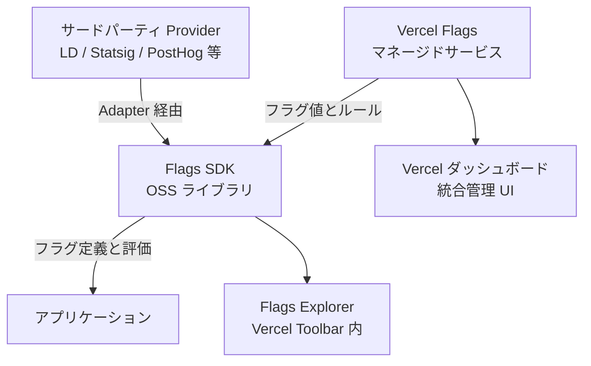
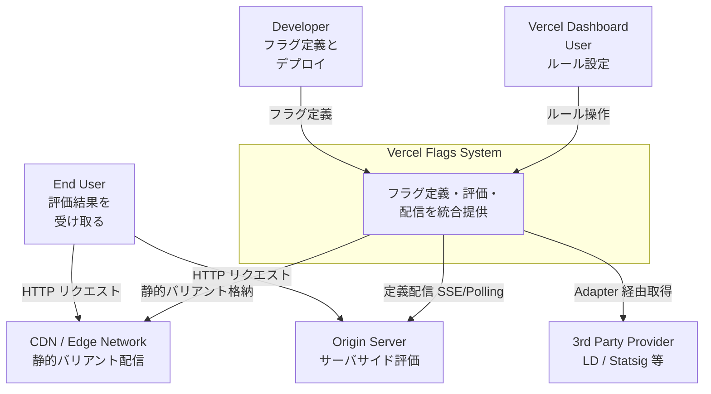
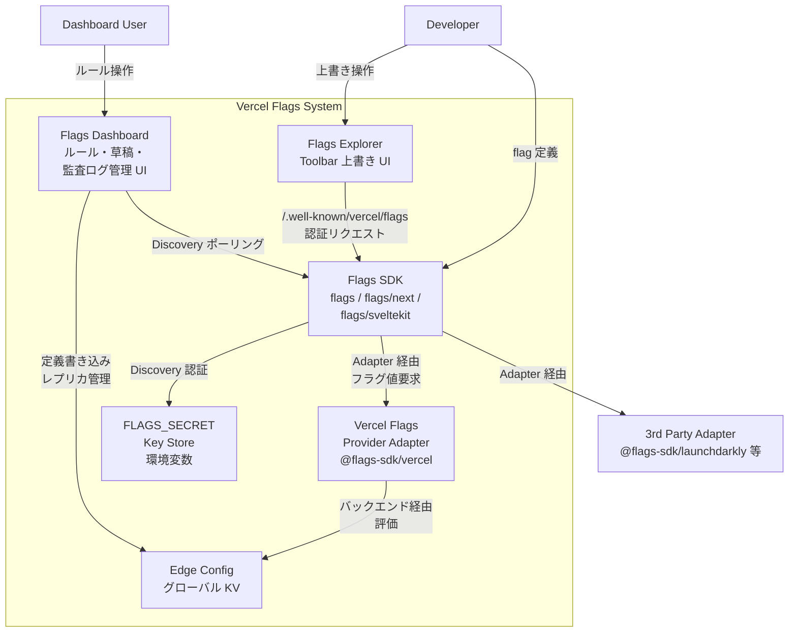
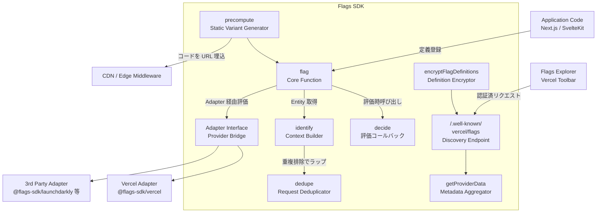
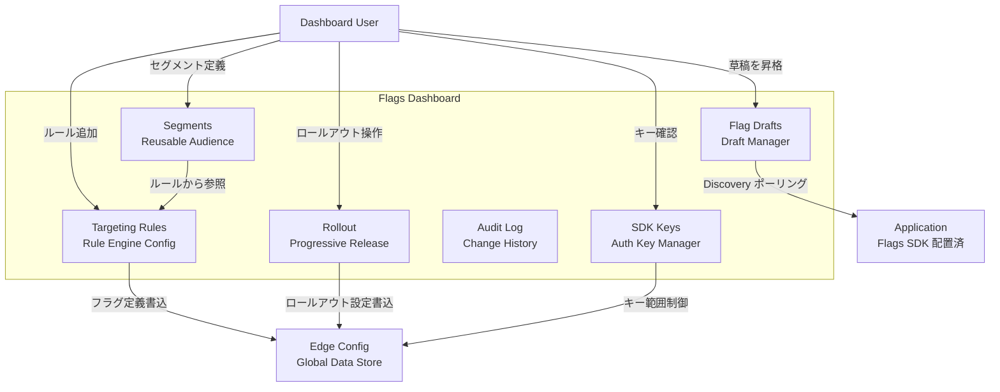
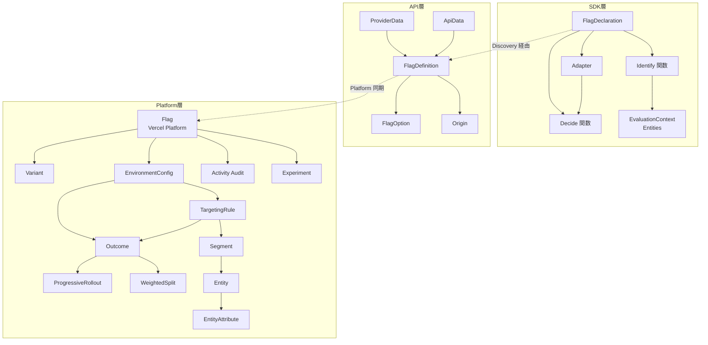
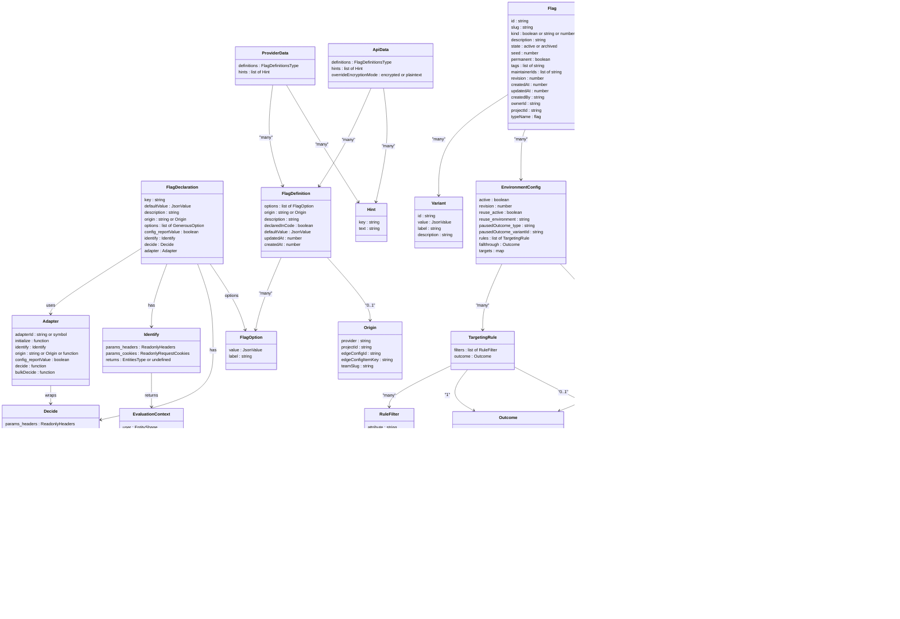
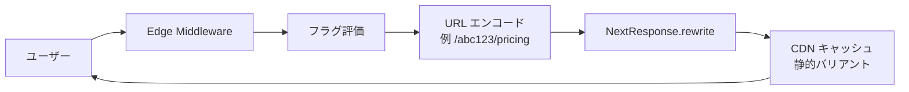

## ■概要

### 目的と位置づけ

Vercel Flags は、Vercel プラットフォームに組み込まれたフィーチャーフラグサービスです。コードのデプロイと機能リリースを分離し、継続的デリバリーと安全なロールアウトを両立させます。2026 年 4 月 16 日に一般提供 (GA) が開始されました。

サービスは「platform-native」と位置づけられており、Vercel プロジェクトのダッシュボード上でフラグ管理・ターゲティングルール・環境設定・可観測性を完結できます。外部サービスを別途契約・運用する必要がありません。

### 3 つのコンポーネント



| 要素名 | 説明 |
|---|---|
| Flags SDK | Next.js・SvelteKit 向けの OSS ライブラリ。プロバイダ非依存でフラグを型安全に定義・評価する |
| Vercel Flags マネージドサービス | Vercel プロジェクトに紐づくフラグ管理バックエンド。ターゲティングルール・セグメント・A/B テスト・監査ログを提供する |
| Vercel ダッシュボード | フラグ一覧・草稿・ターゲティング設定を管理する統合 UI |
| Flags Explorer | Vercel Toolbar 内のブラウザ内ツール。任意の環境でフラグを上書きして動作確認できる |

Flags SDK は OSS であり単独利用できます。`decide()` 関数に任意のロジックを書くか Adapter で外部 Provider を接続すれば、Vercel Flags なしでもフラグを評価できます。Vercel Flags と組み合わせると、ダッシュボードからルールを編集してミリ秒単位でグローバル反映できます。フラグ定義はコードから自動検出 (Flags Discovery) されるため、手動登録が不要です。

### 他サービスとの比較

| サービス | 実行方式 | Flags SDK 統合 | サーバ評価 | 無料枠 | 適合スケール | 編集 UI |
|---|---|---|---|---|---|---|
| **Vercel Flags** | サーバサイド (強制) | ネイティブ (Next.js / SvelteKit) | 標準 | Hobby プランで利用可 | スタートアップ〜エンタープライズ | Vercel ダッシュボード |
| **LaunchDarkly** | クライアント / サーバ両対応 | `@flags-sdk/launchdarkly` | オプション | なし (有料のみ) | エンタープライズ | 独立 UI |
| **Statsig** | クライアント / サーバ両対応 | `@flags-sdk/statsig` | オプション | 2M events / 月 | スタートアップ〜大規模 | 独立 UI |
| **Hypertune** | サーバサイド中心 | `@flags-sdk/hypertune` | 標準 | 小規模プランあり | 中規模 | 独立 UI |
| **PostHog** | クライアント / サーバ両対応 | `@flags-sdk/posthog` | オプション | 1M requests / 月 | スタートアップ | 独立 UI (分析統合) |
| **Optimizely** | クライアント / サーバ両対応 | Adapter または OpenFeature | オプション | 限定的 | エンタープライズ | 独立 UI |
| **Edge Config 自前** | エッジ KV (グローバル分散) | `@flags-sdk/edge-config` | 標準 | 100K reads / 月 (Hobby) | 小〜中規模 | JSON 直編集のみ |

Marketplace 経由で LaunchDarkly・Statsig・PostHog のフラグ値を Edge Config に同期し、エッジ評価できます。Edge Config 自前運用はルールエンジンやセグメント管理を持たず、JSON 値の単純な読み取りに限られます。

## ■特徴

- **サーバサイド評価の強制**: Flags SDK はフラグをサーバサイド専用で評価します。クライアント評価に伴うレイアウトシフト・画面ちらつき・値の漏えいを構造的に排除します
- **フレームワーク統合**: Next.js (App Router / Pages Router / Edge Middleware) と SvelteKit をネイティブサポートします。他のフレームワークは OpenFeature か Core ライブラリ経由で対応します
- **FLAGS_SECRET による暗号化**: 32 バイト base64url 乱数で、Flags Explorer の上書き Cookie と `/.well-known/vercel/flags` エンドポイントを暗号化します
- **Flags Explorer**: Vercel Toolbar 内のブラウザツール。他ユーザーに影響を与えず任意フラグを上書きできます
- **ダッシュボードとデプロイの統合**: フラグ管理画面はデプロイ・プロジェクト設定と同じ Vercel ダッシュボードに置かれます
- **自動フラグ検出 (Flags Discovery / Drafts)**: `/.well-known/vercel/flags` エンドポイントをデプロイすると、Vercel が定義を自動検出し草稿として表示します
- **アクティブグローバルレプリケーション**: 設定変更はミリ秒単位で全リージョンに伝搬します
- **precompute による静的キャッシュ維持**: フラグ値の組み合わせごとに静的バリアントを生成し、CDN/ISR の恩恵を保ったまま A/B テストを実施できます
- **Edge Config 統合**: `@flags-sdk/edge-config` で Edge Config の JSON 値を透過的に読み込みます。多くの場合 1ms 未満 (P99 15ms 以下) で読め、変更反映は 10 秒以内です
- **プロバイダ非依存のアダプタ設計**: 同一コードベースで Vercel Flags・LaunchDarkly・Statsig・Hypertune・PostHog・Edge Config を切り替えられます
- **可観測性の統合**: フラグ評価は Vercel Runtime Logs に記録され、Vercel Web Analytics でフラグ別のコンバージョン分析が可能です
- **エージェント・CLI 対応**: `vercel flags` CLI でターミナルおよび AI エージェントからフラグを操作できます

## ■構造

### ●システムコンテキスト図



| 要素 | 説明 |
|---|---|
| Developer | `flag()` でコードにフラグを定義し、デプロイによってダッシュボードへ自動登録する |
| Vercel Dashboard User | ダッシュボードからターゲティングルール・セグメント・ロールアウト率を操作する |
| End User | CDN または Origin を通じてフラグ評価済みのページ・レスポンスを受け取る |
| Vercel Flags System | フラグ管理・評価エンジン・配信・探索 UI を一体提供するプラットフォーム |
| CDN / Edge Network | precompute パターンで生成された静的バリアントをキャッシュして低遅延配信する |
| Origin Server | Flags SDK がサーバサイドでフラグを評価し動的ページを生成する実行環境 |
| 3rd Party Provider | Adapter を通じて Flags SDK に接続される外部フラグプロバイダ |

Edge Middleware は V8 isolate 上で動作するため Node.js API の一部が使えません。`@flags-sdk/launchdarkly` 等の Node.js SDK を内部利用する Adapter は Middleware で動作しない場合があり、Middleware は `vercelAdapter()` または `edgeConfigAdapter()` に限定し、Provider SDK は Route Handler / Server Component で評価する設計パターンが推奨されます。

### ●コンテナ図



| コンテナ | 説明 |
|---|---|
| Flags Dashboard | フラグ作成・ターゲティングルール・セグメント・Rollout・Audit・SDK Key の操作拠点 |
| Flags Explorer | Vercel Toolbar 組み込みの開発者向け UI。ブラウザセッション単位で上書きする |
| Flags SDK | OSS のフレームワークネイティブライブラリ。定義・評価・precompute・Discovery を担う |
| Vercel Flags Provider Adapter | `@flags-sdk/vercel`。Vercel Flags バックエンド API 経由でフラグ値を評価する。Edge Config はバックエンドが内部的に使う配信機構で、SDK から直接読まれるわけではない |
| Edge Config | Vercel Flags バックエンドが内部的に使うグローバルデータストア。多くの場合 1ms 未満 (P99 15ms 以下) で読み取れる |
| FLAGS_SECRET Key Store | 環境変数として保管される共有秘密鍵。Discovery 認証と上書き Cookie 暗号化に使う |
| 3rd Party Adapter | 外部フラグ SaaS と Flags SDK を接続するアダプタパッケージ群 |

### ●コンポーネント図

#### Flags SDK 内部



| コンポーネント | 説明 |
|---|---|
| `flag()` | フラグ定義の中心関数。`key` / `decide` / `identify` / `adapter` / `options` / `defaultValue` を受け取り評価関数を返す |
| `decide` | フラグ値 (boolean / string / number / JSON) を返す評価コールバック。`identify` が返した entities を参照する |
| `identify` | リクエストのヘッダ・Cookie から User / Team 等の Entity を抽出し評価コンテキストを構築する |
| `dedupe` | 同一リクエストスコープ内で `identify` の呼び出しを 1 回に限定するデコレータ |
| Adapter Interface | 外部プロバイダと `decide` を接続するブリッジ。Vercel Flags バックエンドや各 SaaS API に委譲する |
| `precompute()` | フラグ値の全組合せを BUILD / EDGE で評価し、`FLAGS_SECRET` で暗号化した短いコードを URL に埋め込む |
| `encryptFlagDefinitions` | ビルド時にフラグ定義を暗号化してデプロイバンドルに埋め込む。フォールバックと定義一貫性を保証する |
| `getProviderData()` | フラグ群からキー・説明・options を抽出し Discovery Endpoint 用 JSON に整形する |
| `/.well-known/vercel/flags` | `FLAGS_SECRET` 署名 Bearer トークンを検証し、フラグメタデータを返す標準 API エンドポイント |

#### Flags Dashboard 内部



| コンポーネント | 説明 |
|---|---|
| Flag Drafts | Discovery Endpoint をポーリングし未登録フラグを Draft 表示。昇格時にコードの `description` / `options` を引き継ぐ |
| Targeting Rules | Entity 属性に基づく評価ルール群。上から順に評価し最初に一致したルールが適用される |
| Rollout | パーセンテージ A/B スプリットと時間ベースの段階リリース (weighted split / progressive rollout) |
| Audit Log | フラグ設定変更の履歴をコメント付きで記録。Restore で過去設定に復元できる |
| Segments | 再利用可能なユーザーグループ定義。更新は参照する全フラグへ即時反映される |
| SDK Keys | `FLAGS` 環境変数に含まれる接続文字列を環境ごとに発行・管理する |

## ■データ

### ●概念モデル



#### SDK 層

| 要素 | 説明 |
|---|---|
| FlagDeclaration | コードで宣言するフラグ定義体。`flag()` 引数となるオブジェクト |
| Adapter | 外部プロバイダへの接続ブリッジ。decide / bulkDecide を実装する |
| Identify 関数 | リクエストから EvaluationContext を生成する関数 |
| Decide 関数 | EvaluationContext を受け取りフラグ値を返す評価ロジック |
| EvaluationContext | identify が返すエンティティ群。TargetingRule の評価に使う |

#### API 層

| 要素 | 説明 |
|---|---|
| FlagDefinition | Discovery Endpoint が公開するフラグメタ情報。Toolbar とダッシュボードが読む |
| FlagOption | フラグが返しうる値の定義。value と表示用 label を持つ |
| ProviderData | 複数ソースの FlagDefinition と hints をまとめるコンテナ |
| ApiData | Discovery Endpoint レスポンス形式。overrideEncryptionMode を含む |
| Origin | フラグ管理 URL またはプロバイダ識別子 |

#### Platform 層

| 要素 | 説明 |
|---|---|
| Flag | Vercel Platform が管理するフラグの実体。`slug` が一意キー |
| Variant | フラグが返しうる値の定義。id / value / label を持つ |
| EnvironmentConfig | Production / Preview / Development 環境ごとの評価設定 |
| TargetingRule | 評価条件のフィルタ集合。先頭一致で Outcome を決める |
| Outcome | TargetingRule または fallthrough の結果。3 種類存在する |
| WeightedSplit | トラフィックをパーセンテージで複数 Variant に振り分ける Outcome |
| ProgressiveRollout | スケジュールに沿って割合を増やしていく Outcome |
| Segment | 再利用可能なユーザーグループ定義。複数フラグから参照可能 |
| Entity | ターゲティング対象の概念 (User / Team / Device 等) |
| EntityAttribute | Entity が持つ属性 (email / plan 等) とその型 |
| Activity | フラグへの変更履歴。誰がいつ何を変えたかを記録する |
| Experiment | フラグに紐づく A/B 実験のメタ情報 |

### ●情報モデル



#### FlagDeclaration (SDK — `flag()` 引数)

| 属性 | 型 | 必須 | 説明 |
|---|---|---|---|
| `key` | string | 必須 | フラグの一意識別子 |
| `decide` | Decide 関数 | adapter とどちらか必須 | フラグ値を返す評価ロジック |
| `adapter` | Adapter またはファクトリ関数 | decide とどちらか必須 | 外部プロバイダ接続 |
| `defaultValue` | JsonValue | 任意 | decide が失敗したときのフォールバック値 |
| `identify` | Identify 関数 | 任意 | EvaluationContext を生成する |
| `description` | string | 任意 | ダッシュボードおよび Toolbar に表示される説明 |
| `origin` | string または Origin | 任意 | フラグ管理 URL またはプロバイダ識別子 |
| `options` | GenerousOption のリスト | 任意 | 取りうる値の候補。Toolbar に表示 |
| `config.reportValue` | boolean | 任意 | Runtime Logs への値レポートを制御 |

#### Adapter (SDK — `Adapter<ValueType, EntitiesType>` インタフェース)

| 属性 | 型 | 必須 | 説明 |
|---|---|---|---|
| `decide` | 関数 | 必須 | 単一フラグを評価して ValueType を返す |
| `adapterId` | string または symbol | 任意 | 同一 adapterId のフラグをバッチ評価する識別子 |
| `bulkDecide` | 関数 | 任意 | adapterId でグループ化されたフラグを一括評価する |
| `initialize` | 関数 | 任意 | SDK 初期化時に一度だけ呼ばれるセットアップ処理 |
| `identify` | Identify 関数 | 任意 | アダプタ固有のコンテキスト取得ロジック |
| `origin` | string / Origin / 関数 | 任意 | フラグキーを受け取り管理 URL を返す |
| `config.reportValue` | boolean | 任意 | Runtime Logs への値レポートを制御 |

#### Flag (Platform 層 — REST API レスポンス)

| 属性 | 型 | 必須 | 説明 |
|---|---|---|---|
| `id` | string | 必須 | フラグの内部 ID |
| `slug` | string | 必須 | プロジェクト内一意のキー (`^[a-zA-Z0-9_-]{1,512}$`) |
| `kind` | boolean / string / number / json | 必須 | フラグの値型。作成後変更不可 |
| `state` | active / archived | 必須 | フラグの状態 |
| `seed` | number (0-100000) | 必須 | WeightedSplit / ProgressiveRollout のバケット計算用シード |
| `revision` | number | 必須 | フラグ全体のリビジョン番号 |
| `createdAt` / `updatedAt` | number (ms) | 必須 | 作成・更新タイムスタンプ |
| `createdBy` / `ownerId` / `projectId` | string | 必須 | 作成者・オーナー・所属プロジェクト |
| `typeName` | "flag" | 必須 | 型識別子 (固定値) |
| `description` | string | 任意 | フラグの説明文 |
| `permanent` | boolean | 任意 | 削除不要フラグとしてマーク |
| `tags` | string のリスト | 任意 | カテゴリ分類用タグ |
| `maintainerIds` | string のリスト (最大 5 件) | 任意 | メンテナのユーザー ID |
| `variants` | Variant のリスト | 必須 | フラグが返しうる値の定義 |
| `environments` | EnvironmentConfig マップ | 必須 | 環境ごとの評価設定 |
| `experiment` | Experiment | 任意 | A/B 実験のメタ情報 |

#### Outcome (3 種類)

| type | 追加属性 | 説明 |
|---|---|---|
| `single` | `variantId` | 常に同じ Variant を返す |
| `weightedSplit` | `basedOn`, `fallbackVariantId`, `weights` | パーセンテージで複数 Variant に振り分ける |
| `progressiveRollout` | `basedOn`, `rollFromVariantId`, `rollToVariantId`, `fallbackVariantId`, `startAt`, `steps` | スケジュール付きで割合を増加させる |

#### Activity (Audit)

| 属性 | 型 | 説明 |
|---|---|---|
| `actorId` | string | 変更を行ったユーザーの ID |
| `actorName` | string | 変更を行ったユーザーの名前 |
| `changedAt` | number (ms) | 変更のタイムスタンプ |
| `changeMessage` | string | 変更理由のメモ |
| `snapshot` | object | 変更後の設定スナップショット |

Activity には Restore 機能があります。過去スナップショットを適用すると新しい Activity エントリが追加されます。

## ■構築方法

### 前提条件

| 項目 | 要件 |
|---|---|
| Vercel アカウント | プロジェクトが Vercel に接続済み |
| フレームワーク | Next.js (App Router / Pages Router / Middleware) または SvelteKit |
| Node.js | フレームワークが要求する LTS バージョン以上 |
| Vercel CLI | `npm i -g vercel` でインストール |
| `FLAGS_SECRET` | 32 バイト base64url 乱数 (下記コマンドで生成) |

`FLAGS_SECRET` の生成コマンド:

```sh
node -e "console.log(crypto.randomBytes(32).toString('base64url'))"
```

`FLAGS_SECRET` はダッシュボードでフラグを作成すると `FLAGS` と一緒にプロジェクト環境変数へ自動設定されます。Edge Config 等を単独利用する場合のみ手動設定が必要です。`FLAGS_SECRET` は次の 3 つの役割を兼ねます。

| 用途 | 仕組み |
|---|---|
| Discovery Endpoint レスポンスの暗号化 | `/.well-known/vercel/flags` の body を暗号化して返す (AES-GCM 系の対称暗号) |
| Flags Explorer の認証 Bearer トークン | Explorer / Toolbar が `FLAGS_SECRET` から生成したトークンを Authorization ヘッダで送る |
| 上書き Cookie と precompute URL コードの暗号化 | `vercel-flag-overrides` Cookie と precompute の URL セグメントを暗号化して難読化する |

### インストール

```sh
pnpm i flags
pnpm i @flags-sdk/vercel
```

#### Adapter パッケージ一覧

| Adapter | パッケージ |
|---|---|
| Vercel Flags (内蔵) | `@flags-sdk/vercel` |
| Edge Config | `@flags-sdk/edge-config` |
| LaunchDarkly | `@flags-sdk/launchdarkly` |
| Statsig | `@flags-sdk/statsig` |
| Hypertune | `@flags-sdk/hypertune` |
| PostHog | `@flags-sdk/posthog` |
| Reflag | `@flags-sdk/reflag` |
| Optimizely | `@flags-sdk/optimizely` |
| GrowthBook | `@flags-sdk/growthbook` |
| Flagsmith | `@flags-sdk/flagsmith` |
| Split | `@flags-sdk/split` |
| OpenFeature | `@flags-sdk/openfeature` |

### 環境変数

| 変数名 | 用途 | 設定元 |
|---|---|---|
| `FLAGS` | SDK キー (Vercel Flags 接続文字列) | Vercel ダッシュボードが自動設定 |
| `FLAGS_SECRET` | Flags Explorer 通信・precompute URL 暗号化 | Vercel ダッシュボードが自動設定 |
| `EDGE_CONFIG` | Edge Config 接続文字列 | 手動設定 |
| `EXPERIMENTATION_CONFIG` | Hypertune 連携用 | 手動設定 |
| `LAUNCHDARKLY_API_KEY` | LaunchDarkly API キー | 手動設定 |
| `NEXT_PUBLIC_HYPERTUNE_TOKEN` | Hypertune トークン | 手動設定 |

ローカルへの取り込み手順:

```sh
vercel link
vercel env pull
```

### Dashboard 連携 (フラグ草稿の自動登録)

コードに `flag({ key: '...' })` を定義してデプロイすると、ダッシュボードの **Drafts** セクションに草稿が自動登録されます。草稿にはコードの `description` と `options` が反映されます。ダッシュボード側で **Promote to flag** するとターゲティングルールを設定できます。

ダッシュボード新規作成手順:

1. Vercel ダッシュボード → プロジェクト → **Flags** サイドバー
2. **Create Flag** をクリック
3. **Slug** (例: `marketing-banner`) と **Type** (Boolean / String / Number / JSON) を選択
4. 環境ごとのデフォルト値を設定 (Development=on, Preview=off, Production=off 等)
5. **Review and save** をクリック

フラグ作成時に Vercel は SDK キー発行・`FLAGS` 環境変数設定・`FLAGS_SECRET` 環境変数設定を自動実行します。

### Vercel Toolbar / Flags Explorer の有効化

Discovery Endpoint を実装します。

```ts
// app/.well-known/vercel/flags/route.ts
import { createFlagsDiscoveryEndpoint } from 'flags/next';
import { getProviderData } from '@flags-sdk/vercel';
import * as flags from '../../../../flags';

export const GET = createFlagsDiscoveryEndpoint(async (request) => {
  return await getProviderData(flags);
});
```

Vercel Toolbar の有効化:

```sh
npx vercel toolbar enable
```

Vercel Preview は Toolbar がデフォルト有効です。Production と localhost で使う場合はプロジェクト設定から個別に有効化します。

## ■利用方法

### Flag 定義の基本

```ts
// flags.ts
import { flag } from 'flags/next';

export const showNewFeature = flag({
  key: 'show-new-feature',
  decide: () => false,
  description: '新しいダッシュボード機能を表示する',
});
```

型パラメータとオプションを指定した例:

```ts
// flags.ts
import { flag } from 'flags/next';

export const theme = flag<string>({
  key: 'theme',
  options: [
    { value: 'light', label: 'ライトテーマ' },
    { value: 'dark',  label: 'ダークテーマ' },
    { value: 'auto',  label: '自動' },
  ],
  decide: () => 'auto',
});
```

`flag<T, Entities>()` の主要パラメータ:

| パラメータ | 型 | 説明 |
|---|---|---|
| `key` | `string` | フラグの一意識別子。Dashboard の Slug と一致させる |
| `decide` | `(context) => T` | フラグ値を返す関数 (sync / async 両対応) |
| `identify` | `(requestContext) => Entities` | 評価コンテキストを返す関数 |
| `options` | `Array<{value, label?}>` | 取りうる値の一覧 (precompute 最適化に使用) |
| `description` | `string` | ダッシュボード草稿に反映される説明文 |
| `adapter` | `Adapter` | 外部プロバイダへの委譲 |
| `defaultValue` | `T` | 評価失敗時のフォールバック値 |

### identify + dedupe で評価コンテキストを共有

`identify` はリクエストからユーザー情報を抽出して `decide` に渡します。`dedupe` で包むと同一リクエスト内で複数フラグが同じ `identify` を共有しても 1 回だけ実行されます。

```ts
import { dedupe, flag } from 'flags/next';
import type { ReadonlyRequestCookies } from 'flags';

interface Entities {
  user?: { id: string };
}

const identify = dedupe(
  ({ cookies }: { cookies: ReadonlyRequestCookies }): Entities => {
    const userId = cookies.get('user-id')?.value;
    return { user: userId ? { id: userId } : undefined };
  },
);

export const dashboardFlag = flag<boolean, Entities>({
  key: 'new-dashboard',
  identify,
  decide({ entities }) {
    if (!entities?.user) return false;
    return ['user1', 'user2'].includes(entities.user.id);
  },
});
```

### Adapter の切り替え

#### Vercel Flags 内蔵 Adapter (推奨)

```ts
import { flag } from 'flags/next';
import { vercelAdapter } from '@flags-sdk/vercel';

export const exampleFlag = flag({
  key: 'example-flag',
  adapter: vercelAdapter(),
});
```

`vercelAdapter()` を使うと `decide` の代わりにダッシュボードのルール設定が評価されます。

#### Edge Config Adapter

```sh
pnpm i @flags-sdk/edge-config
```

```json
{
  "flags": {
    "example-flag": true,
    "another-flag": false
  }
}
```

```ts
import { flag } from 'flags/next';
import { edgeConfigAdapter } from '@flags-sdk/edge-config';

export const exampleFlag = flag({
  adapter: edgeConfigAdapter(),
  key: 'example-flag',
});
```

接続文字列やキー名のカスタマイズ:

```ts
import { createEdgeConfigAdapter } from '@flags-sdk/edge-config';

const myAdapter = createEdgeConfigAdapter({
  connectionString: process.env.OTHER_EDGE_CONFIG!,
  options: {
    edgeConfigItemKey: 'other-flags-key',
    teamSlug: 'my-vercel-team',
  },
});
```

#### LaunchDarkly Adapter

```ts
import { ldAdapter, type LDContext } from '@flags-sdk/launchdarkly';
import { dedupe, flag } from 'flags/next';
import type { Identify } from 'flags';

const identify = dedupe((async ({ headers, cookies }) => {
  const user = await getUser(headers, cookies);
  return { key: user.userID };
}) satisfies Identify<LDContext>);

export const exampleFlag = flag<boolean, LDContext>({
  key: 'example-flag',
  identify,
  adapter: ldAdapter.variation(),
});
```

Flags Explorer 連携用 provider data の統合:

```ts
import { mergeProviderData } from 'flags';
import { createFlagsDiscoveryEndpoint, getProviderData } from 'flags/next';
import { getProviderData as getLDProviderData } from '@flags-sdk/launchdarkly';
import * as flags from '../../../../flags';

export const GET = createFlagsDiscoveryEndpoint(async () => {
  return mergeProviderData([
    getProviderData(flags),
    getLDProviderData({
      apiKey: process.env.LAUNCHDARKLY_API_KEY,
      projectKey: process.env.LAUNCHDARKLY_PROJECT_KEY,
      environment: process.env.LAUNCHDARKLY_ENVIRONMENT,
    }),
  ]);
});
```

`mergeProviderData` は `flags` コアパッケージから、`createFlagsDiscoveryEndpoint` / `getProviderData` は `flags/next` から取得します。

#### Statsig Adapter

```ts
import { statsigAdapter, type StatsigUser } from '@flags-sdk/statsig';

export const showFeature = flag<boolean, StatsigUser>({
  key: 'show_feature',
  adapter: statsigAdapter.featureGate((gate) => gate.value),
  identify,
});

export const myExperiment = flag<Record<string, unknown>, StatsigUser>({
  key: 'my_experiment',
  adapter: statsigAdapter.experiment((config) => config.value),
  identify,
});
```

Statsig は Dynamic Config を Flags SDK 経由で扱えます。SRM (Sample Ratio Mismatch) の自動検出と統計的有意差計算が Statsig 側で実行されます。

#### PostHog Adapter

```ts
import { postHogAdapter } from '@flags-sdk/posthog';

export const myFlag = flag({
  key: 'my-flag',
  adapter: postHogAdapter.isFeatureEnabled(),
  identify,
});

export const myVariant = flag({
  key: 'my-flag',
  adapter: postHogAdapter.featureFlagValue(),
  identify,
});

export const myPayload = flag({
  key: 'my-flag',
  adapter: postHogAdapter.featureFlagPayload((v) => v),
  defaultValue: {},
  identify,
});
```

#### 自前 Adapter

```ts
import type { Adapter } from 'flags';

export function createExampleAdapter() {
  return function exampleAdapter<ValueType, EntitiesType>(): Adapter<ValueType, EntitiesType> {
    return {
      origin(key) {
        return `https://example.com/flags/${key}`;
      },
      async decide({ key }): Promise<ValueType> {
        return false as ValueType;
      },
    };
  };
}
```

### Server / Client での参照

#### App Router — Server Component (推奨)

```tsx
import { showNewFeature } from '../flags';

export default async function Page() {
  const isEnabled = await showNewFeature();
  return isEnabled ? <NewDashboard /> : <OldDashboard />;
}
```

#### Edge Middleware

```ts
import { type NextRequest, NextResponse } from 'next/server';
import { showNewFeature } from './flags';

export async function middleware(request: NextRequest) {
  const isEnabled = await showNewFeature();
  if (isEnabled) {
    return NextResponse.rewrite(new URL('/new-page', request.url));
  }
  return NextResponse.next();
}
```

### precompute による静的キャッシュ維持

`precompute` パターンは Middleware でフラグ値を評価して URL パスセグメントにエンコードし、CDN/ISR の静的キャッシュを保ったまま A/B テストを実現します。



```ts
// flags.ts
import { flag } from 'flags/next';

export const showSummerSale = flag({
  key: 'summer-sale',
  options: [{ value: true }, { value: false }],
  decide: () => false,
});

export const showBanner = flag({
  key: 'banner',
  options: [{ value: true }, { value: false }],
  decide: () => false,
});

export const marketingFlags = [showSummerSale, showBanner] as const;
```

```ts
// middleware.ts
import { type NextRequest, NextResponse } from 'next/server';
import { precompute } from 'flags/next';
import { marketingFlags } from './flags';

export const config = { matcher: ['/'] };

export async function middleware(request: NextRequest) {
  const code = await precompute(marketingFlags);
  const nextUrl = new URL(
    `/${code}${request.nextUrl.pathname}${request.nextUrl.search}`,
    request.url,
  );
  return NextResponse.rewrite(nextUrl, { request });
}
```

```tsx
// app/[code]/page.tsx
import { marketingFlags, showSummerSale, showBanner } from '../../flags';

type Params = Promise<{ code: string }>;

export default async function Page({ params }: { params: Params }) {
  const { code } = await params;
  const summerSale = await showSummerSale(code, marketingFlags);
  const banner     = await showBanner(code, marketingFlags);

  return (
    <div>
      {banner    ? <p>ようこそ</p>          : null}
      {summerSale ? <p>サマーセール開催中</p> : <p>サマーセール近日開催</p>}
    </div>
  );
}
```

ビルド時に全バリアントを静的生成する場合:

```tsx
import { generatePermutations } from 'flags/next';
import { marketingFlags } from '../../flags';

export async function generateStaticParams() {
  const codes = await generatePermutations(marketingFlags);
  return codes.map((code) => ({ code }));
}
```

`generatePermutations` はフラグの `options` から組合せを自動計算します。`options` 未指定のフラグは boolean (true/false) の 2 値として扱われます。

### A/B テスト・gradual rollout・kill switch の組み立て

TargetingRule のコード対応例 (Dashboard で `Entity: user / Attribute: plan / Operator: equals / Value: "premium"` を設定する場合):

```ts
const identify = dedupe(async (): Promise<{ user: { id: string; plan: string } }> => {
  const session = await getSession();
  return { user: { id: session.userId, plan: session.plan } };
});

export const premiumFeature = flag<boolean, { user: { id: string; plan: string } }>({
  key: 'premium-feature',
  identify,
  adapter: vercelAdapter(),
});
```

A/B テスト実装例 (Dashboard 側で weighted split を設定し、コードは結果を読むだけ):

```ts
export const layoutVariant = flag<string>({
  key: 'layout-variant',
  options: [
    { value: 'control',   label: 'コントロール' },
    { value: 'variant-a', label: 'バリアント A' },
  ],
  identify,
  adapter: vercelAdapter(),
});
```

kill switch は Boolean フラグの静的値を切り替えるだけで実現できます。

```ts
export const newCheckout = flag<boolean>({
  key: 'new-checkout',
  adapter: vercelAdapter(),
  defaultValue: false,
});
```

### AI モデル切替 / プロンプト切替 / DB cutover の応用例

#### AI モデル切替 (Edge Config + Vercel AI SDK)

```json
{
  "flags": {
    "model_id": "openai:gpt-4o"
  }
}
```

```ts
// flags.ts
export const aiModelFlag = flag<string>({
  key: 'model_id',
  adapter: edgeConfigAdapter(),
  defaultValue: 'openai:gpt-4o-mini',
});
```

```tsx
// app/api/chat/route.ts
import { aiModelFlag } from '../../../flags';
import { streamText } from 'ai';
import { openai } from '@ai-sdk/openai';
import { anthropic } from '@ai-sdk/anthropic';

export async function POST(req: Request) {
  const modelId = await aiModelFlag();
  const [provider, model] = modelId.split(':');

  const aiModel = provider === 'anthropic'
    ? anthropic(model)
    : openai(model);

  const result = await streamText({
    model: aiModel,
    messages: (await req.json()).messages,
  });
  return result.toDataStreamResponse();
}
```

Edge Config の `model_id` を書き換えるだけで再デプロイなしにモデル切替できます。weighted split を組み合わせると `gpt-4o-mini` 80% / `claude-3-haiku` 20% のような部分配信も可能です。

#### プロンプト切替

```ts
export const summaryPrompt = flag<'concise' | 'detailed'>({
  key: 'summary-prompt-variant',
  adapter: vercelAdapter(),
  defaultValue: 'concise',
});
```

```ts
// app/api/summarize/route.ts
import { summaryPrompt } from '../../../flags';

const CONCISE_SYSTEM_PROMPT = '要点だけを3文で要約します。';
const DETAILED_SYSTEM_PROMPT = '構造化された詳細サマリを Markdown で出力します。';

export async function POST(req: Request) {
  const variant = await summaryPrompt();
  const systemPrompt = variant === 'detailed' ? DETAILED_SYSTEM_PROMPT : CONCISE_SYSTEM_PROMPT;
  // ... LLM 呼び出し
}
```

#### RAG 経路切替

```ts
export const ragBackend = flag<'pinecone' | 'pgvector'>({
  key: 'rag-backend',
  adapter: edgeConfigAdapter(),
  defaultValue: 'pgvector',
});
```

```ts
// lib/retriever.ts
import { ragBackend } from '../flags';

export async function getRetriever() {
  const backend = await ragBackend();
  return backend === 'pinecone' ? pineconeRetriever : pgvectorRetriever;
}
```

retrieval backend の切替は Edge Config の値を書き換えるだけで再デプロイなしに反映できます。weighted split を使うとカナリア比較も可能です。

#### DB cutover (ゼロダウンタイム移行)

```ts
export const useNewDatabase = flag<boolean>({
  key: 'use-new-database',
  adapter: vercelAdapter(),
  defaultValue: false,
});
```

```ts
// lib/db.ts
import { useNewDatabase } from '../flags';

export async function getDatabase() {
  const isNew = await useNewDatabase();
  return isNew ? newDbClient : legacyDbClient;
}
```

旧 DB と新 DB を同期させた状態でフラグを段階的にロールアウトし、問題発生時はダッシュボードで即時 false に戻すだけでロールバックできます。

### Flags Explorer での override (ローカル / Preview)

1. ブラウザ上で Vercel Toolbar にログイン
2. Toolbar の **Flags Explorer** アイコンをクリック
3. 上書きしたいフラグを検索または一覧から選択
4. 値を選択して適用 (Toolbar が青色に変化、ソフトリロード発生)

上書きの影響範囲:

| 方式 | 影響範囲 |
|---|---|
| 通常の override | 自分のブラウザセッションのみ |
| Branch recommendations | ブランチを訪問したチームメンバー全員に通知 |
| URL-based sharing | 共有リンクを受け取ったメンバーへ通知 |

## ■運用

### フラグ作成からロールアウトまでのフロー

Vercel Flags のライフサイクルは Draft → Targeting → Rollout → Eval → Cleanup の 5 フェーズで構成されます。

| フェーズ | アクション | 主なツール |
|---|---|---|
| Draft | コードに `flag()` を定義 → 草稿として自動検出 | Flags SDK / Discovery Endpoint |
| Targeting | 草稿を昇格してルール設定 (型は確定後変更不可) | Dashboard |
| Rollout | static value / weighted split / progressive rollout / enable/disable | Dashboard / `vercel flags` CLI |
| Eval | フラグ値を Web Analytics・Runtime Logs に記録 | `FlagValues` / `reportValue` |
| Cleanup | コード削除 → `vercel flags archive` → 永久削除 | Dashboard / CLI |

Rollout 段階の CLI 例:

| 手段 | 用途 | CLI コマンド |
|---|---|---|
| Static value | 全ユーザーに同一値を即時配信 | `vercel flags set <flag> -e production --variant <v>` |
| Weighted split | A/B 実験・段階公開 (%) | `vercel flags split <flag> -e production --by user.id --weight a=95 --weight b=5` |
| Progressive rollout | 時間スケジュール付き段階公開 | `vercel flags rollout <flag> -e production --by user.id --stage 5,6h --stage 25,12h --stage 50,1d` |
| enable / disable | Boolean フラグのキルスイッチ (boolean 専用) | `vercel flags enable <flag> -e production` |
| set | string / number / JSON フラグの固定値切替 | `vercel flags set <flag> -e production --variant <id>` |

Progressive rollout の `--stage` は `PERCENTAGE,DURATION` 形式で指定し、最終ステージ終了後は 100% 固定になります。

Eval フェーズの自動記録例:

```tsx
// app/layout.tsx
import { Suspense } from 'react';
import { FlagValues } from 'flags/react';
import { myFlag } from '../flags';

export default async function RootLayout({ children }) {
  return (
    <html><body>
      {children}
      <Suspense fallback={null}>
        <FlagValues values={{ 'my-flag': await myFlag() }} />
      </Suspense>
    </body></html>
  );
}
```

### Audit ログと変更履歴

各フラグの **Activity** サイドバーで「誰がいつ何を変更したか」を確認できます。`--message` (CLI) または **Change message** (UI) で変更理由を残します。過去設定の **Restore** はワンクリックで完了し、復元自体も新エントリとして記録されます。

チーム全体の Audit Log (Enterprise プラン) は Team Settings → Security & Privacy → Audit Log から CSV エクスポートできます。SIEM 連携は AWS S3 / Splunk / Datadog / GCS / カスタム HTTP に対応します。フラグ操作は `edge_config.updated` および `project.env_variable.*` として記録されます。フラグ単位の変更履歴は Dashboard の Activity が正規手段です。

### 環境別 secret 運用

| Vercel 環境 | FLAGS の値 | 用途 |
|---|---|---|
| Production | Production SDK Key | 本番フラグ設定を読む |
| Preview | Preview SDK Key | Preview フラグ設定を読む |
| Development | Development SDK Key | ローカル開発用フラグ設定を読む |

SDK Key は read-only でクライアントコードや VCS に含めません。Dashboard では初回のみフル値が表示され、以降はマスク表示 (`vf_server_abc********`) になります。

`FLAGS_SECRET` は環境ごとに生成し、Preview・Production は Sensitive としてマークします。ローカルの `.env` だけでは Flags Explorer が読めないため、必ず Vercel Dashboard のプロジェクト環境変数に設定します。

SDK Key ローテーション手順は、新キー作成 → `FLAGS` を新値に更新 → 再デプロイ → 旧キー削除の順です。削除後は即無効になるため再デプロイが先行する必要があります。

### AI モデル / プロンプト切替の段階リリース運用例

```ts
// flags.ts
export const aiSummaryModel = flag<'stable' | 'candidate'>({
  key: 'ai-summary-model',
  adapter: vercelAdapter(),
  defaultValue: 'stable',
  options: [
    { value: 'stable', label: 'GPT-4o (stable)' },
    { value: 'candidate', label: 'Claude 3.7 Sonnet (candidate)' },
  ],
  description: 'AI summary generation model selector',
});
```

```bash
# 5% カナリアから開始
vercel flags split ai-summary-model -e production --by user.id \
  --default-variant stable --weight stable=95 --weight candidate=5 \
  --message "Start candidate model 5% canary"

# 問題なければ Progressive rollout に切り替え
vercel flags rollout ai-summary-model -e production --by user.id \
  --from-variant stable --to-variant candidate --default-variant stable \
  --stage 5,6h --stage 10,6h --stage 25,12h --stage 50,1d \
  --message "Gradual rollout: stable to candidate"

# 緊急ロールバック (string flag なので set で stable に戻す)
vercel flags set ai-summary-model -e production --variant stable \
  --message "Emergency rollback"
```

### DB 移行・カットオーバーの運用例

v0 チームが採用したパターンです。

| Phase | アクション |
|---|---|
| 1. コード先行デプロイ | 新旧 DB への二重書き込みロジックをフラグの裏に配置、フラグ=false で旧 DB のみ参照 |
| 2. Shadow mode | フラグ=10% で新 DB 読み取りを試行、結果を比較ログに記録、不一致をアラート検知 |
| 3. 段階カットオーバー | `vercel flags rollout db-migration --by user.id --stage 10,6h --stage 50,12h --stage 100,1d` (最終ステージ終了後は 100% 固定) |
| 4. ロールバック | `vercel flags disable db-migration` で即座に旧 DB へフォールバック (boolean フラグの場合) |
| 5. Cleanup | コードから flag 削除 → `vercel flags archive db-migration --yes` |

フラグの flip がカットオーバー実行そのものになる点が要諦です。Staging で同じシーケンスをリハーサルしておきます。

## ■ベストプラクティス

### 命名規約と key 設計

| 規則 | 詳細 |
|---|---|
| ケース | kebab-case を使う (`new-dashboard`, `ai-summary-model`) |
| 極性 | ポジティブ表現に統一する (`show-new-ui` ◯ / `disable-old-ui` ×) |
| 命名パターン | `<対象>-<属性>` 形式 (`checkout-redesign`, `payment-provider`) |
| 集約 | `flags.ts` に一元定義し `export const` で named export |
| description | 1 文で「何を制御するか」を記述。削除期限コメントを含める |

フラグキーとエクスポート変数名を一致させると IDE の "Find All References" で追跡しやすくなります。

### Vercel Flags 内蔵 vs 外部 Provider の選定基準

| 評価軸 | Vercel Flags 内蔵 | LaunchDarkly | Statsig | PostHog | Hypertune |
|---|---|---|---|---|---|
| セットアップコスト | 最小 (自動プロビジョン) | 高 | 中 | 中 | 中 |
| 統計的実験エンジン | なし | あり | あり (SRM 自動検出) | あり | あり |
| Targeting の柔軟性 | Entity ベース (中) | 高 | 高 | 高 | TypeScript-first |
| Edge Config 統合 | ネイティブ | Adapter 経由 | Adapter 経由 | Adapter 経由 | ネイティブ |
| オフライン評価 | precompute | SDK キャッシュ | SDK キャッシュ | SDK キャッシュ | コンパイル時評価 |
| ユーザー行動分析 | Web Analytics 連携 | 別途連携 | 内蔵 | 内蔵 | 別途連携 |
| 推奨シナリオ | Vercel 完結、小〜中規模 | エンタープライズ権限管理 | 統計実験優先 | フルスタック分析 | 型安全最優先 |

複数 Provider を使う場合は `mergeProviderData()` で Flags Explorer に集約できます。

### precompute + ISR の組合せ方針

precompute は静的ページにフラグ評価を組み合わせるためのパターンです。Middleware でフラグを評価し URL パスに encode、CDN は encode された URL 単位でキャッシュします。

`options` は必ず宣言します (URL 短縮に必須)。options 未宣言の値はそのまま URL に inline され、URL が膨張します。CDN / プロキシ / ブラウザの一般的な URL 長制限 (典型値 2048 文字、保守的には 1024 文字目安) を超えないよう、フラグ数と options 量を抑える設計が安全です。

| 戦略 | 方法 | 向くケース |
|---|---|---|
| オンデマンド ISR | `generateStaticParams` で `[]` を返す | フラグ数が多い、組合せ爆発を避けたい |
| ビルド時生成 | `generatePermutations(flags)` を返す | フラグ数が 2〜3 個、キャッシュヒット率を最大化したい |

### sticky bucketing と identify の責任分離

`--by user.id` のように不変識別子をバケッティング基準にして同一ユーザーへの一貫したバリアント割当を実現します。`identify` の呼び出しは `dedupe` でラップして同一リクエスト内の重複 I/O を排除します。

```typescript
import { dedupe } from 'flags/next';

type Entities = { user?: { id: string; email: string; plan: string } };

const identify = dedupe(async (): Promise<Entities> => {
  const session = await getSession();
  return {
    user: session?.user
      ? { id: session.user.id, email: session.user.email, plan: session.user.plan }
      : undefined,
  };
});

export const featureFlag = flag<boolean, Entities>({
  key: 'my-feature',
  identify,
  adapter: vercelAdapter(),
});
```

`identify` はリクエストごとにフレッシュな評価を行います。エンティティ属性の永続化はアプリ側の責任で、Vercel Flags は自動的にセッション間で記憶しません。

### AI モデル切替に対する 3 層設計

AI 機能には最初から以下の 3 層を組み込みます。

| 層 | 種別 | 役割 |
|---|---|---|
| 第 1 層 kill switch | Boolean | 全 AI 機能を Production で即停止 |
| 第 2 層 segment rollout | String | "Internal Team" → "Beta Users" → "All Users" の順に展開 |
| 第 3 層 設定フラグ | JSON | temperature / maxTokens 等の設定をコード変更なしに調整 |

```bash
vercel flags create ai-feature-enabled --kind boolean \
  --description "Master kill switch for all AI features"

vercel flags create ai-model-tier --kind string \
  --variant stable="GPT-4o" --variant candidate="Claude 3.7"

vercel flags create ai-model-config --kind json \
  --variant '{"temperature":0.7,"maxTokens":2048}'=Conservative \
  --variant '{"temperature":1.0,"maxTokens":4096}'=Creative
```

### Cleanup 戦略 (フラグ寿命の管理)

フラグの削除完了をもって機能リリースが完了します。

| フラグ種別 | 推奨寿命 | 削除トリガー |
|---|---|---|
| リリース用 (feature) | 1〜4 週間 | 全ユーザーへのロールアウト完了 |
| 実験用 (experiment) | 2〜8 週間 | 統計的有意性の確認 + 勝者決定 |
| キルスイッチ (operational) | 無期限 | サービス廃止時 |
| インフラ移行用 | 移行完了後 2 週間 | 旧インフラの撤廃確認後 |

tech debt 化を防ぐ仕組みは、作成時の削除期限コメント・アクティブフラグ数の上限設定・定期レビュー・コード削除後の `vercel flags archive` 実行です。コードに `flag()` が残ったまま archive すると `defaultValue` フォールバックが発生します。

### 観測性: Web Analytics / PostHog / Datadog / Audit との連携

```tsx
// FlagValues 配置で Web Analytics に自動付与
<FlagValues values={{ 'pricing-layout': await pricingLayout() }} />
```

```typescript
import { track } from '@vercel/analytics';
track('Purchase', { amount: 99 }, { flags: ['pricing-layout'] });
```

Datadog / Splunk / AWS S3 / GCS / カスタム HTTP への SIEM ストリームは Team Settings → Security & Privacy → Audit Log → Configure で構成します。`edge_config.updated` (フラグ設定変更) と `project.env_variable.updated` (FLAGS_SECRET ローテーション) が主な対象です。

PostHog Adapter 利用時はフラグ評価が `$feature_flag_called` イベントとして自動送信されます。PostHog の Experiments タブからフラグ名を選び、Primary Metric に conversion funnel を設定し、結果は Bayesian の信頼区間 (デフォルト 95%) で判定します。Statsig は SRM (Sample Ratio Mismatch) の自動検出と統計的有意差計算を提供します。

### A/B 実験の評価フロー (Experiment ライフサイクル)

`Experiment.status` は `draft → running → paused → closed` の順に遷移します。Vercel Flags の Experiment は次のフィールドを使って意思決定を記録します。

| フィールド | 役割 |
|---|---|
| `primaryMetrics` | 実験の主要評価指標。conversion / revenue / engagement 等 |
| `guardrailMetrics` | 守護指標。エラー率・レイテンシなどが閾値を逸脱したら早期停止する判断材料 |
| `allocationUnit` | バケット計算の単位 (cookieId / userId / visitorId) |
| `allocationPercent` | 実験参加トラフィックの割合 |
| `durationUnit` | `days` (期間ベース) または `exposures` (露出回数ベース) |
| `stickyRequirement` | 一度割り当てたバリアントを維持するか |
| `decision` / `decisionReason` | 終了時の判断結果と根拠を記録する |

実験を `closed` にする際は decision (winner / no-effect / inconclusive) と decisionReason を必ず記入し、Cleanup フェーズへの引き継ぎ材料にします。

### Datadog / Splunk への Audit Log 連携手順

Team Settings → Security & Privacy → Audit Log → Configure からストリームを追加します。Datadog 連携の例は API Key と Site (US1 / EU1 等) を入力するのみで、ストリーミングが開始します。Datadog Log Management 上では次のフィルタが定型です。

```
source:vercel @evt.name:edge_config.updated
source:vercel @evt.name:project.env_variable.updated
```

Saved View として保存しておくと、フラグ設定変更と `FLAGS_SECRET` ローテーションの監査が継続できます。

## ■トラブルシューティング

| 症状 | 主な原因 | 対処 |
|---|---|---|
| Flags Explorer がフラグを表示しない | `FLAGS_SECRET` が Dashboard 未登録 / ローカル `.env` のみ定義 | Dashboard の Environment Variables に Sensitive 登録 → `vercel env pull` で同期 |
| Flags Explorer が 401 を返す | `verifyAccess()` 呼び出し欠落 / 環境間で secret 不一致 | Discovery Endpoint で `verifyAccess(req.headers['authorization'])` を確認、secret を環境ごとに揃える |
| precompute で 404 になる | `FLAGS_SECRET` 未設定で暗号化失敗 / URL が CDN・プロキシの URL 長制限を超過 | `FLAGS_SECRET` の存在を確認、`options` を宣言して URL 短縮、`generateStaticParams` を見直す |
| precompute のキャッシュが更新されない | ISR の revalidate が長すぎる / code パラメータ未変化 | `revalidate` 短縮または `revalidatePath()` を明示呼出、Middleware が新 code を生成しているか確認 |
| Flags Explorer で値が `undefined` | `FlagValues` / `data-flag-values` スクリプトタグ未実装 | `<FlagValues values={...} />` を layout に追加 |
| override Cookie が効かない | `overrideEncryptionMode` の不一致 / `FLAGS_SECRET` ミスマッチ | `vercel flags override --decrypt <token>` で内容確認、`decryptOverrides()` の secret を統一 |
| Edge Config の変更が反映されない | Edge Config の伝播遅延 (最大 10 秒) | 即時性が必要なら別途 Boolean フラグをキルスイッチに用意 |
| Adapter 接続エラー (LD / PostHog 等) | SDK Key 失効 / レート制限 / ネットワーク障害 | `hints` でエラー表示しつつ他ソースは継続、`defaultValue` で安全フォールバック |
| A/B 実験の sample ratio mismatch | `--by` 属性に null 混在 / ボット混入 / 実験で bucketing 属性不統一 | null は `--default-variant` で処理、Middleware でボット除外、bucketing 属性を統一 |
| Progressive rollout が進まない | Entity 属性が SDK 未到達 (null で fallback variant) | `identify()` の戻り値を確認、`vercel flags inspect <flag>` でステージ確認 |
| Draft フラグが Dashboard に出ない | `key` 未指定 / SDK が古い | `flag({ key: 'my-key', ... })` の `key` を明示、`flags` パッケージを最新化 |
| Audit に変更が記録されない | Dashboard / CLI 以外の方法 (Edge Config 直書き等) で変更 | フラグ設定は必ず Dashboard または `vercel flags` CLI 経由で行う |
| microfrontend 間でフラグ不一致 | プロジェクトごとに異なる `FLAGS_SECRET` | microfrontend グループ内で `FLAGS_SECRET` を共通化 |
| SDK Key 紛失 | Dashboard 上はマスク値のみ | 旧キー削除 → 新キー再作成 (`vercel flags sdk-keys add --type server --environment production`) |

## ■まとめ

Vercel Flags は Flags SDK (OSS) と Vercel ダッシュボード (マネージド) を組み合わせて、コードの自動検出・サーバサイド評価・precompute による静的キャッシュ・段階的ロールアウト・即時キルスイッチを 1 つのプラットフォームに揃えたサービスです。Adapter 設計で LaunchDarkly や Statsig 等の既存資産にも切り替え可能で、AI モデル切替や DB cutover を「再デプロイなしでフラグを flip するだけ」の運用に落とし込めます。

この記事が少しでも参考になった、あるいは改善点などがあれば、ぜひリアクションやコメント、SNS でのシェアをいただけると励みになります!

## ■参考リンク

### 公式ドキュメント

- [Vercel Flags: Platform-native feature flags (公式ブログ)](https://vercel.com/blog/vercel-flags-platform-native-feature-flags)
- [Vercel Flags is now generally available](https://vercel.com/changelog/vercel-flags-ga)
- [Vercel Flags is now in public beta](https://vercel.com/changelog/vercel-flags-is-now-in-public-beta)
- [Vercel Flags are now optimized for agents](https://vercel.com/changelog/vercel-flags-are-now-optimized-for-agents)
- [Flags ドキュメント](https://vercel.com/docs/flags)
- [Vercel Flags ドキュメント](https://vercel.com/docs/flags/vercel-flags)
- [Vercel Flags Quickstart](https://vercel.com/docs/flags/vercel-flags/quickstart)
- [Flags SDK Reference](https://vercel.com/docs/flags/flags-sdk-reference)
- [Flags Explorer](https://vercel.com/docs/flags/flags-explorer)
- [Flags Explorer Reference](https://vercel.com/docs/flags/flags-explorer/reference)
- [Flags Observability](https://vercel.com/docs/flags/observability)
- [Flags Web Analytics 連携](https://vercel.com/docs/flags/observability/web-analytics)
- [Vercel Flags CLI](https://vercel.com/docs/cli/flags)
- [Vercel Flags Run A/B Test](https://vercel.com/docs/flags/vercel-flags/cli/run-ab-test)
- [Vercel Audit Log](https://vercel.com/docs/audit-log)
- [Vercel Edge Config](https://vercel.com/docs/edge-config)
- [Pricing](https://vercel.com/docs/pricing)

### Dashboard / 機能ドキュメント

- [Dashboard 概要](https://vercel.com/docs/flags/vercel-flags/dashboard)
- [Feature Flag Configuration](https://vercel.com/docs/flags/vercel-flags/dashboard/feature-flag)
- [Drafts](https://vercel.com/docs/flags/vercel-flags/dashboard/drafts)
- [Entities](https://vercel.com/docs/flags/vercel-flags/dashboard/entities)
- [Segments](https://vercel.com/docs/flags/vercel-flags/dashboard/segments)
- [SDK Keys](https://vercel.com/docs/flags/vercel-flags/dashboard/sdk-keys)
- [Archive](https://vercel.com/docs/flags/vercel-flags/dashboard/archive)

### Flags SDK 公式 / GitHub

- [flags-sdk.dev (Flags SDK 公式ドキュメント)](https://flags-sdk.dev)
- [Flags SDK Next.js 入門](https://flags-sdk.dev/docs/getting-started/next)
- [Flags SDK precompute](https://flags-sdk.dev/frameworks/next/precompute)
- [Flags SDK カスタム Adapter](https://flags-sdk.dev/docs/adapters/custom-adapters)
- [GitHub: vercel/flags](https://github.com/vercel/flags)
- [Flag SDK Core API リファレンス (GitHub)](https://github.com/vercel/flags/blob/main/apps/docs/content/docs/api-reference/core/core.mdx)
- [Flags SDK 型定義 (GitHub)](https://github.com/vercel/flags/blob/main/packages/flags/src/types.ts)
- [Next.js Marketing Pages ガイド (GitHub)](https://github.com/vercel/flags/blob/main/apps/docs/content/docs/frameworks/next/guides/marketing-pages.mdx)
- [Next.js Dashboard Pages ガイド (GitHub)](https://github.com/vercel/flags/blob/main/apps/docs/content/docs/frameworks/next/guides/dashboard-pages.mdx)
- [Edge Config Provider ドキュメント (GitHub)](https://github.com/vercel/flags/blob/main/apps/docs/content/docs/providers/edge-config.mdx)
- [Vercel Provider ドキュメント (GitHub)](https://github.com/vercel/flags/blob/main/apps/docs/content/docs/providers/vercel.mdx)
- [deepwiki: vercel/flags](https://deepwiki.com/vercel/flags)

### 関連ブログ・テンプレート・解説

- [Flags as Code in Next.js](https://vercel.com/blog/flags-as-code-in-next-js)
- [AI SDK + Feature Flags テンプレート](https://vercel.com/templates/next.js/ai-sdk-feature-flags-edge-config)
- [GitHub: vercel-labs/ai-sdk-flags-edge-config](https://github.com/vercel-labs/ai-sdk-flags-edge-config)
- [This Dot Labs: Introduction to Vercel's Flags SDK](https://www.thisdot.co/blog/introduction-to-vercels-flags-sdk)
