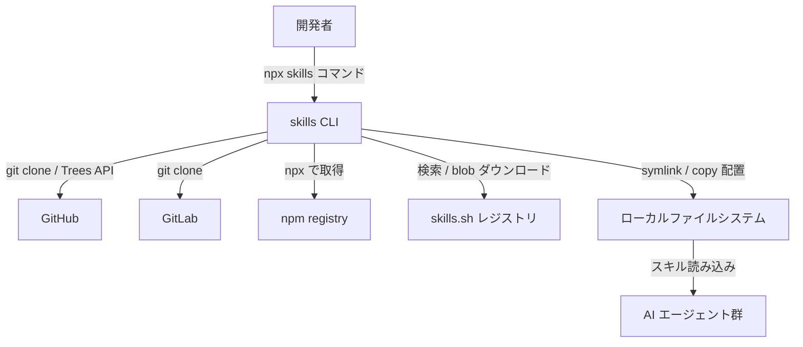
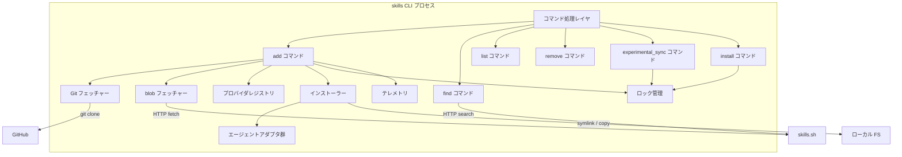
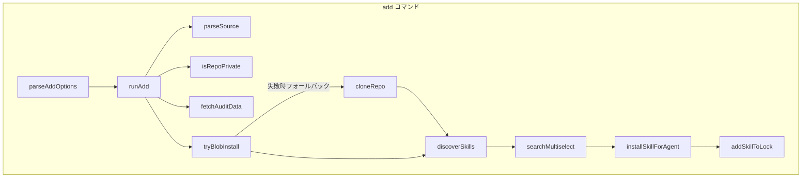
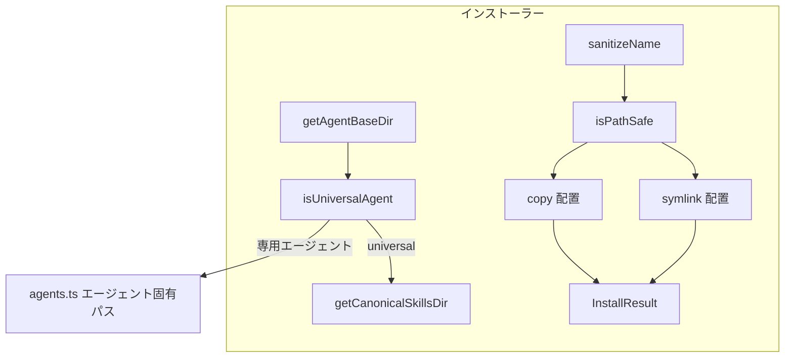
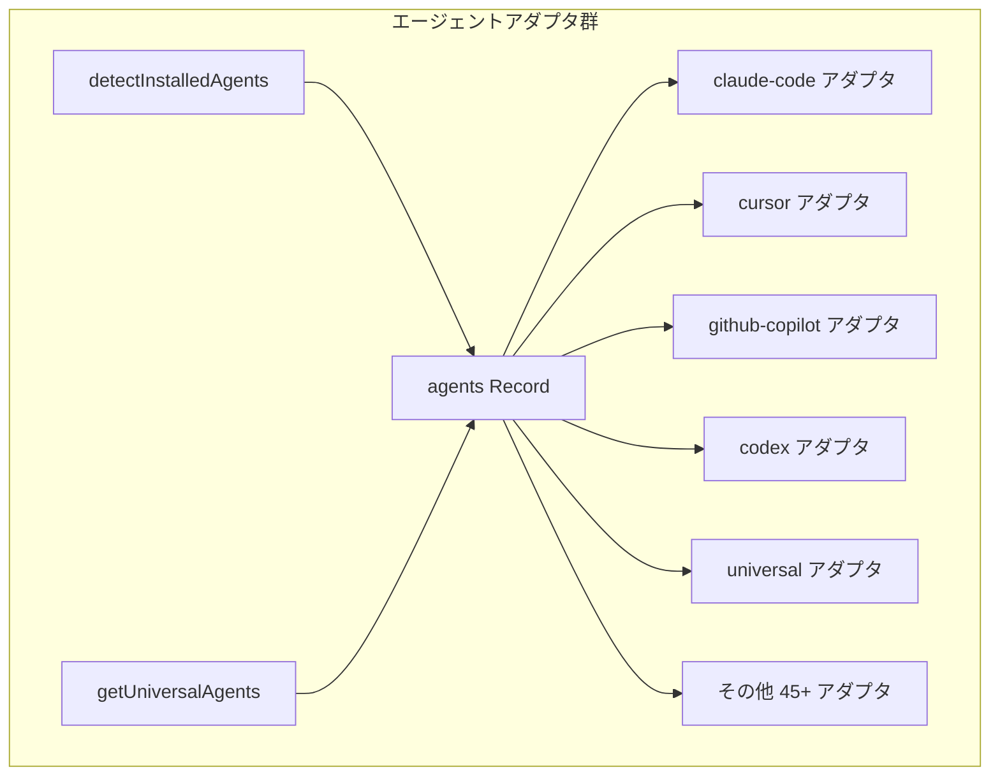
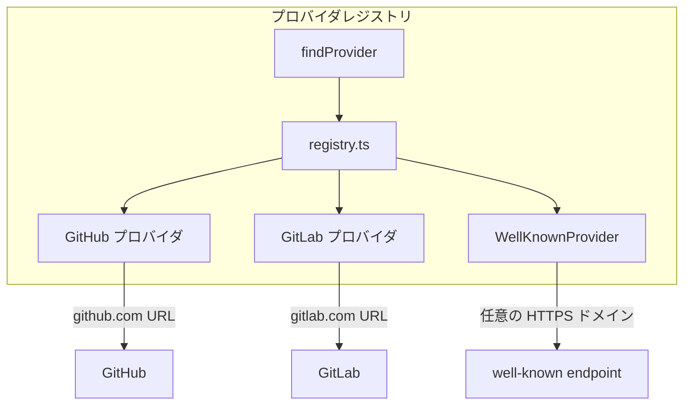
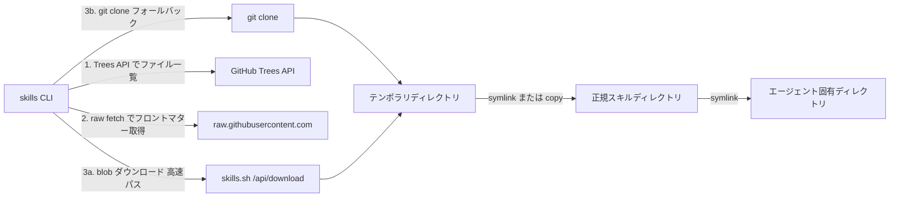
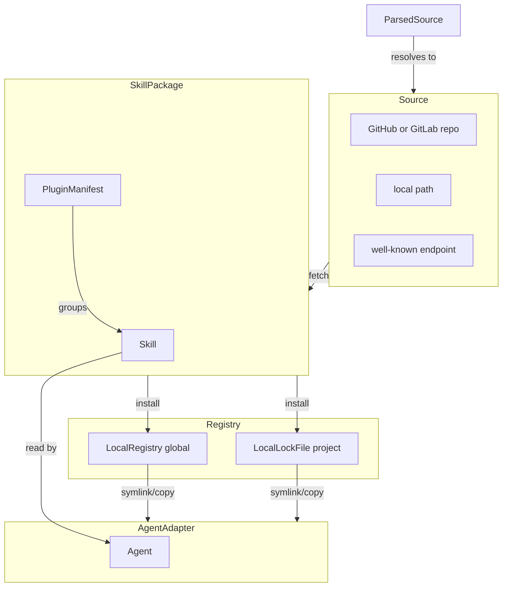
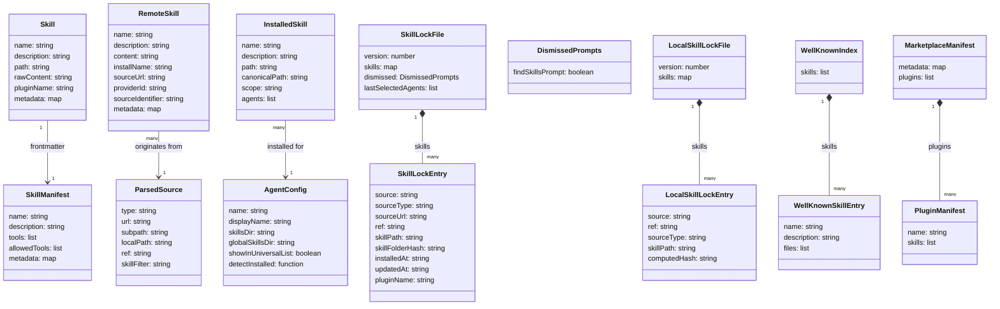

> Vercel Labs が公開する OSS の AI エージェントスキル管理 CLI（npm パッケージ名: `skills`、リポジトリ: [vercel-labs/skills](https://github.com/vercel-labs/skills)）の構造・データモデル・運用パターンをまとめた技術調査ドキュメントです。2026-05 時点の v1.5.x 系列を対象とします。

## 読み方のガイド

- 急ぎでコマンドを知りたい → 「利用方法」の主要オプション一覧と `add` の典型例
- アーキテクチャを把握したい → 「構造」の C4 図と「データ」の概念モデル
- チーム導入を検討する → 「運用」と「ベストプラクティス」
- うまく動かないとき → 「トラブルシューティング」の症状別表

## 概要

`skills` は、Vercel Labs が公開するオープンソースの AI エージェントスキル管理 CLI です。リポジトリは `vercel-labs/skills`、公式レジストリは `skills.sh` です。

「一度書いたスキルを、対応するすべてのエージェントで再利用する」という設計思想で、断片化した AI エージェントエコシステムに統一された配布・管理レイヤーを提供します。

`npx skills add <source>` の 1 コマンドで、GitHub・GitLab・ローカル・well-known エンドポイント上のスキルパッケージを取得し、Claude Code・Cursor・GitHub Copilot など 50 を超えるエージェントの所定ディレクトリへ symlink または copy で配置します。

## 特徴

### オープン標準（Agent Skills）

`SKILL.md` フォーマットは Anthropic が起点となって [agentskills.io](https://agentskills.io) でオープン標準として整備されています。Vercel Labs、Microsoft、Google、OpenAI、JetBrains、Block など主要ベンダーが採用しています。

### 多数のエージェントに対応

`src/types.ts` の `AgentType` 定義では universal を含めて 54 種類（v1.5.x 系列）に対応します。主要カテゴリは次のとおりです。

| カテゴリ | 対応エージェント |
| --- | --- |
| Anthropic | Claude Code, Claude |
| OpenAI | OpenAI Codex |
| Google | Gemini CLI |
| Microsoft | GitHub Copilot, VS Code |
| IDE 系 | Cursor, JetBrains Junie, Roo Code, TRAE |
| ターミナル系 | OpenCode, Amp, Goose, Windsurf |
| クラウド系 | Databricks Genie Code, Snowflake Cortex Code |

### symlink と copy の使い分け

インストール方式は `symlink` と `copy` の 2 種類です。複数エージェントが別々のディレクトリ（例: Claude Code の `.claude/skills/` と Cursor の `.agents/skills/`）に解決する場合、対話プロンプトで方式を選びます。`symlink` を選ぶと正規コピー（`.agents/skills/<name>/`）への参照になり、`npx skills update` 一発で全エージェント分が最新版に追従します。

選択したエージェントが**全部同じディレクトリに解決する**場合（`claude-code` のみ、または universal 系のみ等）は、PR #582 以降プロンプトがスキップされ、自動的に `copy` で配置されます。`--copy` フラグで明示的に copy を指定することもできます。

### プログレッシブディスクロージャ

`SKILL.md` の YAML frontmatter（`name` + `description`）のみが起動時に読まれ、エージェントが関連性を判断したときだけ本体・`scripts/`・`references/` がロードされます。常時注入の `AGENTS.md` / `CLAUDE.md` と異なり、コンテキストウィンドウを節約します。

### skills.sh によるエコシステム

`skills.sh` がスキル検索 API・blob ダウンロードキャッシュ・リーダーボードを提供します。`npx skills find` のインタラクティブ検索 UI もこのレジストリを参照します。

### エージェント別コンテキスト設定形式の比較

| 形式 | 主要エージェント | トリガー | スコープ | クロスエージェント互換 |
| --- | --- | --- | --- | --- |
| `SKILL.md`（Agent Skills） | Claude Code, Codex, Cursor, Gemini CLI, GitHub Copilot, 50+ | エージェントが関連性を判断して自動ロード | オンデマンド | ◎（オープン標準） |
| `AGENTS.md` / `CLAUDE.md` | Claude Code, Codex, Cursor, Gemini CLI, GitHub Copilot | 常時注入（全会話） | プロジェクト全体 | ○（AGENTS.md は多数対応） |
| `.claude/commands/*.md` | Claude Code のみ | ユーザーがスラッシュコマンドで明示的に起動 | ユーザー起動型 | ✗ |
| `.cursor/rules` / `.cursorrules` | Cursor のみ | 常時注入 | プロジェクト全体 | ✗ |
| GitHub Copilot Instructions | VS Code + GitHub Copilot | 常時注入 | リポジトリ単位 | ✗ |

### 配布・インストール方式の比較

| 項目 | `skills` CLI | Claude Code plugin | Cursor rules | Copilot instructions |
| --- | --- | --- | --- | --- |
| 配布方式 | GitHub / GitLab / well-known endpoint | npm registry | ファイル直接配置 | ファイル直接配置 |
| インストール形式 | 複数ディレクトリ時は対話で symlink/copy 選択、単一ディレクトリ時は copy 自動 | `npx` で展開 | コピー配置 | コピー配置 |
| レジストリ | skills.sh（検索 + ダウンロード API） | npmjs.com | なし | なし |
| 対応エージェント数 | 50+ | Claude Code のみ | Cursor のみ | VS Code + Copilot |
| バージョン追跡 | GitHub tree SHA + ロックファイル | npm バージョン | なし | なし |

### アーキテクチャの技術的な違い

| 軸 | Skills CLI | MCP（Model Context Protocol） | Copilot Extensions |
| --- | --- | --- | --- |
| 配布単位 | ファイル（SKILL.md ディレクトリ） | サーバー（HTTP / stdio プロセス） | GitHub App（OAuth 認証） |
| 実行場所 | エージェントのコンテキスト内 | 外部プロセス | GitHub サーバー側 |
| インストール作業 | `npx skills add` 1 コマンド | サーバー起動設定 + MCP 設定追記 | GitHub App インストール + 権限設定 |
| オフライン利用 | ◎（symlink 配置後はオフライン可） | △（サーバー起動が必要） | ✗（GitHub API 必須） |
| クロスエージェント | ◎ | △（MCP 対応のみ） | ✗（GitHub Copilot 専用） |

### ChatGPT custom GPTs / OpenAI Assistants との比較

| 軸 | Skills CLI | ChatGPT custom GPTs |
| --- | --- | --- |
| 配布単位 | ファイル（SKILL.md） | GPT 定義（OpenAI プラットフォーム） |
| 対応エージェント | 50+ | ChatGPT のみ |
| オフライン利用 | ◎ | ✗（OpenAI API 必須） |
| バージョン管理 | Git + `skills-lock.json` | OpenAI プラットフォーム管理 |
| 配布コスト | GitHub 公開のみ | GPT Store への申請 |
| 実行コンテキスト | エージェントローカル | OpenAI クラウド |

### ユースケース別推奨

| ユースケース | 推奨形式 | 理由 |
| --- | --- | --- |
| 複数エージェントを使い分けるチーム | Skills（SKILL.md） | 一度書けば全エージェントで動作 |
| 「絶対に守るルール」の徹底（セキュリティ等） | AGENTS.md / CLAUDE.md | 常時注入で意図せぬスキップを防止 |
| Claude Code 専用のショートカット作業 | `.claude/commands/` | ユーザー起動型で明示的に実行 |
| チーム固有の手順書を組織で共有 | Skills + GitHub | バージョン管理と発見性（skills.sh）の両立 |
| CI/CD で自動セットアップ | Skills（`--all` または `-y`） | 非対話モードで自動化（`--all` は `--skill '*' --agent '*' -y` の短縮形） |
| 大規模スキル群の段階的導入 | Skills（プログレッシブディスクロージャ） | 未使用スキルがコンテキストを消費しない |

## 構造

### システムコンテキスト図



| 要素 | 説明 |
| --- | --- |
| 開発者 | skills CLI を `npx skills` 経由で実行するエンドユーザー |
| skills CLI | スキルの追加・削除・一覧・検索・更新を行う Node.js CLI |
| GitHub | スキルパッケージを保管するリモートリポジトリ群 |
| GitLab | GitLab 上のスキルリポジトリ |
| npm registry | `skills` パッケージ自体の配布元 |
| skills.sh レジストリ | スキル検索 API と blob ダウンロードキャッシュを提供するウェブサービス |
| ローカルファイルシステム | スキルファイルが配置される場所（プロジェクトまたはグローバル） |
| AI エージェント群 | Claude Code, Cursor, GitHub Copilot など 50+、スキルを実際に読み込む |

### コンテナ図



| コンテナ | 説明 |
| --- | --- |
| コマンド処理レイヤ（cli.ts） | エントリポイント。引数解析・コマンドディスパッチ・バナー表示 |
| add コマンド（add.ts） | スキル追加の主ロジック。ソース解析・セキュリティ監査・インタラクティブ選択 |
| find コマンド（find.ts） | skills.sh API で検索し、インタラクティブに選択・インストール |
| list コマンド（list.ts） | インストール済みスキルの列挙 |
| remove コマンド（remove.ts） | 指定スキルの symlink / コピー削除 |
| experimental_sync コマンド | ロックファイルを参照してスキルを一括同期する実験的コマンド |
| install コマンド（install.ts） | `skills-lock.json` からスキルを復元する `experimental_install` |
| Git フェッチャー（git.ts） | `simple-git` で GitHub / GitLab をシャロークローン |
| blob フェッチャー（blob.ts） | GitHub Trees API で一覧取得後、skills.sh の blob ダウンロード API から取得 |
| インストーラー（installer.ts） | エージェント別ディレクトリへ symlink / copy で配置 |
| エージェントアダプタ群（agents.ts） | 50+ エージェントのスキルディレクトリパスと検出ロジック |
| プロバイダレジストリ（providers/） | GitHub / GitLab / Well-Known URI のホストプロバイダ登録・照合 |
| ロック管理（skill-lock.ts / local-lock.ts） | グローバル / プロジェクトのロックファイル読み書き |
| テレメトリ（telemetry.ts） | 匿名使用統計とセキュリティ監査データの送受信 |

### コンポーネント図

#### add コマンド 内部



| コンポーネント | 説明 |
| --- | --- |
| parseAddOptions | `--skill`, `--agent`, `--global`, `--copy` などのオプション解析 |
| runAdd | add コマンド全体のオーケストレーションを行うメイン関数 |
| parseSource | `owner/repo`、`https://github.com/...`、ローカルパスなどを種別に振り分け |
| isRepoPrivate | GitHub API でリポジトリの公開状態を確認 |
| fetchAuditData | skills.sh のセキュリティ監査 API からリスク情報を取得 |
| discoverSkills | クローンされたディレクトリを再帰的に走査して SKILL.md を発見 |
| searchMultiselect | ターミナル上のインタラクティブなスキル選択 UI |
| tryBlobInstall | skills.sh ダウンロード API から事前ビルド済みスナップショットを取得 |
| cloneRepo | `simple-git` でリポジトリをシャロークローンしテンポラリディレクトリに展開 |
| installSkillForAgent | 各エージェントのスキルディレクトリへ symlink / copy を作成 |
| addSkillToLock | `.skill-lock.json` にスキルエントリを追記・更新 |

#### インストーラー 内部



| コンポーネント | 説明 |
| --- | --- |
| getAgentBaseDir | エージェント種別とスコープに応じて配置先ディレクトリを決定 |
| isUniversalAgent | universal タイプのエージェントが共通の `.agents/skills` を使用するか判定 |
| getCanonicalSkillsDir | `.agents/skills` への正規パスを解決 |
| sanitizeName | ディレクトリ名をケバブケースに変換し、パストラバーサル文字を除去 |
| isPathSafe | インストール先が想定のベースディレクトリ配下に収まるかを検証 |
| symlink 配置 | `fs.symlink` で `.agents/skills/<name>` から実体ディレクトリへのリンクを作成 |
| copy 配置 | `--copy` 指定時に `fs.cp` でファイルを実コピー |
| InstallResult | インストール結果（成否・パス・モード）を呼び出し元に返す構造体 |

#### エージェントアダプタ群 内部



| コンポーネント | 説明 |
| --- | --- |
| agents Record | AgentType をキーとする全エージェント設定のマップ（50+ エントリ） |
| claude-code アダプタ | `CLAUDE_CONFIG_DIR` または `~/.claude/skills` を使用 |
| cursor アダプタ | プロジェクトでは `.agents/skills` を共有し、グローバルでは `~/.cursor/skills` を使用 |
| github-copilot アダプタ | プロジェクトでは `.agents/skills`、グローバルでは `~/.copilot/skills` に配置 |
| codex アダプタ | `CODEX_HOME` または `~/.codex/skills` を使用 |
| universal アダプタ | エージェント非依存の共通ディレクトリ `.agents/skills` を使用 |
| detectInstalledAgents | 各エージェントのホームディレクトリ存在確認でインストール状態を検出 |
| getUniversalAgents | `showInUniversalList` フラグが真のエージェント一覧を返却 |

#### プロバイダレジストリ 内部



| コンポーネント | 説明 |
| --- | --- |
| registry.ts | HostProvider 実装を登録し URL に応じたプロバイダを返すルーティングテーブル |
| GitHub プロバイダ | `github.com` URL を解析し owner/repo/ref/subpath を抽出 |
| GitLab プロバイダ | `gitlab.com` URL を解析し owner/repo/ref/subpath を抽出 |
| WellKnownProvider | RFC 8615 準拠の `/.well-known/agent-skills/index.json` を取得 |
| findProvider | 入力 URL をプロバイダ一覧に順次照合して最初にマッチしたものを返却 |

### リモートフェッチ経路



| ステップ | 説明 |
| --- | --- |
| 1. Trees API でファイル一覧 | GitHub Trees API でリポジトリツリーを取得し SKILL.md の位置を特定 |
| 2. raw fetch でフロントマター取得 | `raw.githubusercontent.com` から SKILL.md を取得し name / description を読込 |
| 3a. blob ダウンロード | skills.sh の `/api/download` から事前キャッシュされたスナップショットを取得 |
| 3b. git clone | blob 取得失敗時に `git clone --depth 1` でシャロークローン |
| テンポラリディレクトリ | 取得結果を一時保管する OS の `/tmp` 配下 |
| 正規スキルディレクトリ | `.agents/skills/<skill-name>/` が全エージェント共通の実体置き場 |
| エージェント固有ディレクトリ | 各エージェントのスキルディレクトリから正規ディレクトリへ symlink を張る |

## データ

### 概念モデル



| 要素名 | 説明 |
| --- | --- |
| SkillPackage | 1 つ以上の Skill を含むリポジトリまたはディレクトリ |
| Skill | SKILL.md と関連ファイルで構成される単一スキルユニット |
| PluginManifest | `.claude-plugin/marketplace.json` または `plugin.json` で複数スキルをまとめるプラグイン定義 |
| Source | GitHub / GitLab repo、ローカルパス、well-known endpoint の総称 |
| ParsedSource | 入力文字列を構造化した一時的な解析結果 |
| LocalRegistry | `~/.agents/.skill-lock.json`（グローバル）に記録されたインストール済みスキル管理 |
| LocalLockFile | `skills-lock.json`（プロジェクト）に記録されたスキル管理。VCS にコミット |
| AgentAdapter | 各エージェントが参照するスキルディレクトリへの配置設定 |
| Agent | claude-code, cursor, copilot など 50+ の AI エージェント |

### 情報モデル



| 要素名 | 説明 |
| --- | --- |
| Skill | メモリ上のスキル表現。`path` はファイルシステム上の絶対パス |
| SkillManifest | SKILL.md フロントマターから解析された属性の概念モデル。`skills` CLI 自体には独立した型として定義されておらず、実装では `Skill.metadata`（任意キーの map）として保持される。`tools` / `allowed-tools` 等の解釈は受け取り側エージェントの仕様 |
| ParsedSource | `parseSource()` が入力文字列から生成する構造体。`type` は `github` / `gitlab` / `git` / `local` / `well-known` のいずれか |
| RemoteSkill | 外部プロバイダーから取得したスキル。`providerId` でプロバイダーを識別 |
| AgentConfig | 各エージェントのスキルディレクトリパス設定。`skillsDir` はプロジェクトスコープ、`globalSkillsDir` はグローバルスコープ。`detectInstalled` はインストール状態を非同期で検出する関数 |
| InstalledSkill | `listInstalledSkills()` が返す実体。`scope` は `project` または `global` |
| SkillLockEntry | グローバルロックファイルの 1 スキルエントリ。`skillFolderHash` は GitHub Trees API で取得した SHA |
| SkillLockFile | `~/.agents/.skill-lock.json` の全体構造。`dismissed` は `findSkillsPrompt` 等の特定プロンプト非表示フラグを保持する型付きインターフェース |
| LocalSkillLockEntry | プロジェクトロックファイルの 1 スキルエントリ。`computedHash` はファイル内容から計算した SHA-256 |
| LocalSkillLockFile | `skills-lock.json` の全体構造。マージコンフリクトを最小化するためアルファベット順にソート |
| WellKnownSkillEntry | `/.well-known/agent-skills/index.json` の 1 スキルエントリ。`files` は全ファイルパスのリスト |
| WellKnownIndex | well-known エンドポイントが提供するスキルインデックス全体 |
| PluginManifest | `.claude-plugin/plugin.json` の単一プラグイン定義。`skills` は `./` 始まりの相対パスのリスト |
| MarketplaceManifest | `.claude-plugin/marketplace.json` の複数プラグインカタログ |

### スコープと ParsedSource.type

スキルは 2 つのスコープで管理されます。

| スコープ | ロックファイル | スキル配置先 |
| --- | --- | --- |
| global | `~/.agents/.skill-lock.json`（`XDG_STATE_HOME` 設定時は `$XDG_STATE_HOME/skills/.skill-lock.json`） | `~/.agents/skills/<skill-name>/` |
| project | `<cwd>/skills-lock.json` | `<cwd>/.agents/skills/<skill-name>/` |

`ParsedSource.type` ごとの fetch 挙動は次のとおりです。

| type | 説明 |
| --- | --- |
| `github` | GitHub API / git clone でスキルを取得 |
| `gitlab` | GitLab git clone でスキルを取得 |
| `git` | 汎用 git URL から clone |
| `local` | ローカルパスを直接参照 |
| `well-known` | `/.well-known/agent-skills/index.json` を fetch |

well-known エンドポイントが返す `index.json` の例を示します。

```json
{
  "skills": [
    {
      "name": "company-conventions",
      "description": "Use this skill for all code in this repository to enforce team conventions.",
      "files": [
        "/skills/company-conventions/SKILL.md",
        "/skills/company-conventions/references/style-guide.md"
      ]
    }
  ]
}
```

## 構築方法

### 前提条件

- Node.js 18 以上が必要（`package.json` の `engines` で `"node": ">=18"`）
- npm / npx が使用できる環境であれば追加のセットアップは不要

```bash
node --version
# v18.x.x 以上であること
```

### インストール方法

#### npx で都度実行（推奨）

常に最新バージョンを使用できます。ローカルへのインストールは不要です。

```bash
npx skills <command>
```

#### npm でグローバル永続インストール

```bash
npm install -g skills
skills --version
```

#### プロジェクトローカルインストール

```bash
npm install --save-dev skills
```

### 初期化（新規スキルの雛形生成）

`npx skills init` でカレントディレクトリまたは指定サブディレクトリに `SKILL.md` テンプレートを生成します。

```bash
npx skills init
npx skills init my-skill
```

生成される `SKILL.md` の基本構造は次のとおりです。

```markdown
---
name: my-skill
description: What this skill does and when to use it
---

# My Skill

Instructions for the agent to follow when this skill is activated.
```

## 利用方法

### 主要オプション一覧

`npx skills add` で使用できる主要オプションの早見表です。

| オプション | 短縮形 | 説明 |
| --- | --- | --- |
| `--global` | `-g` | ユーザーホームディレクトリ（グローバル）にインストール |
| `--agent <name...>` | `-a` | インストール対象のエージェント指定（複数可、`'*'` で全エージェント） |
| `--skill <name...>` | `-s` | インストールするスキルを名前で指定（複数可、`'*'` で全スキル） |
| `--list` | `-l` | インストールせず、リポジトリ内のスキル一覧を表示 |
| `--all` | — | 全スキルを全エージェントへ確認なしでインストール（`--skill '*' --agent '*' -y` の短縮形） |
| `--copy` | — | symlink ではなく実ファイルコピーでインストール |
| `--yes` | `-y` | 確認プロンプトをすべてスキップ（CI/CD 向け） |

### `npx skills add <source>`

スキルをインストールするメインコマンドです。

#### ソース形式

| 形式 | 例 |
| --- | --- |
| GitHub shorthand | `vercel-labs/agent-skills` |
| GitHub フル URL | `https://github.com/vercel-labs/agent-skills` |
| リポジトリ内特定スキルへの URL | `https://github.com/vercel-labs/agent-skills/tree/main/skills/web-design-guidelines` |
| GitLab URL | `https://gitlab.com/org/repo` |
| 任意の git URL | `git@github.com:vercel-labs/agent-skills.git` |
| ローカルパス | `./my-local-skills` |

```bash
npx skills add vercel-labs/agent-skills
npx skills add https://github.com/vercel-labs/agent-skills
npx skills add https://github.com/vercel-labs/agent-skills/tree/main/skills/web-design-guidelines
npx skills add https://gitlab.com/org/repo
npx skills add git@github.com:vercel-labs/agent-skills.git
npx skills add ./my-local-skills
```

#### スキル名・エージェント名の指定

```bash
npx skills add vercel-labs/agent-skills --skill frontend-design
npx skills add vercel-labs/agent-skills --skill frontend-design --skill skill-creator
npx skills add owner/repo --skill "Convex Best Practices"
npx skills add vercel-labs/agent-skills --skill '*'

npx skills add vercel-labs/agent-skills --agent claude-code
npx skills add vercel-labs/agent-skills -a claude-code -a opencode
npx skills add vercel-labs/agent-skills --agent '*'
```

#### スコープと非対話・全選択

```bash
npx skills add vercel-labs/agent-skills --global
npx skills add vercel-labs/agent-skills --skill frontend-design -g -a claude-code -y
npx skills add vercel-labs/agent-skills --all
```

#### スキル一覧表示と `--copy`

```bash
npx skills add vercel-labs/agent-skills --list
INSTALL_INTERNAL_SKILLS=1 npx skills add vercel-labs/agent-skills --list

npx skills add vercel-labs/agent-skills --copy
```

インストール方式の違いは次のとおりです。

| 方式 | 説明 | 適用ケース |
| --- | --- | --- |
| symlink | エージェントから正規コピー（`.agents/skills/<name>/`）へのリンクを作成。単一ソース、更新が容易 | 複数の異なるディレクトリにインストールするとき対話で選択 |
| copy | 各エージェントに独立したコピーを作成 | 単一ディレクトリ時は自動（PR #582 以降）、`--copy` 明示時、または symlink が使えない環境 |

### `npx skills list` / `ls`

```bash
npx skills list
npx skills ls -g
npx skills ls --agent claude-code --agent cursor
npx skills ls --json
```

JSON 出力スキーマは次のとおりです。

```json
[
  {
    "name": "frontend-design",
    "path": "/Users/dev/.agents/skills/frontend-design",
    "scope": "global",
    "agents": ["Claude Code", "Cursor", "OpenCode"]
  }
]
```

### `npx skills remove` / `rm`

```bash
npx skills remove
npx skills remove web-design-guidelines
npx skills remove frontend-design web-design-guidelines
npx skills remove --global web-design-guidelines
npx skills remove --agent claude-code cursor my-skill
npx skills remove --all
npx skills remove --skill '*' -a cursor
npx skills remove my-skill --agent '*'
npx skills rm my-skill
```

### `npx skills find`

スキルをインタラクティブに検索・発見します（fzf スタイル UI）。

```bash
npx skills find
npx skills find typescript
```

### `npx skills check`（注意）

`cli.ts` 上で `check` は `update` / `upgrade` と同じ `runUpdate()` ハンドラに振られているため、確認のつもりで叩くと更新が走ります（issue #954）。確認だけ行いたい場合は `npx skills list --json` などで現状を確認し、明示的に `update` を呼んでください。

### `npx skills experimental_sync`

`node_modules/` 配下を再帰的にクロールして `SKILL.md` を発見し、エージェント別ディレクトリへ同期する実験的コマンドです。スキルを npm パッケージとして配布する運用や、モノレポでスキルを開発する運用で使えます。ロックファイルからの同期ではない点に注意してください。

```bash
npx skills experimental_sync
```

`experimental_install` との違いは次のとおりです。

| コマンド | 用途 |
| --- | --- |
| `experimental_sync` | `node_modules/` 内の SKILL.md を検出してエージェント dirs へ同期 |
| `experimental_install` | `skills-lock.json` から登録済みスキルを一括復元（オンボーディング向け） |

### `npx skills experimental_install`

`skills-lock.json` から登録済みスキルを一括復元する実験的コマンドです。CI/CD や新メンバーオンボーディングで利用します。

```bash
npx skills experimental_install
```

引数・オプションの最新仕様は CLI ヘルプ（`npx skills experimental_install --help`）で確認してください。

### `npx skills update`

```bash
npx skills update
npx skills update my-skill
npx skills update frontend-design web-design-guidelines
npx skills update -g
npx skills update -p
npx skills update -y
```

| オプション | 説明 |
| --- | --- |
| `-g, --global` | グローバルスキルのみ更新 |
| `-p, --project` | プロジェクトスキルのみ更新 |
| `-y, --yes` | スコープ確認プロンプトをスキップ（自動検出） |
| `[skills...]` | 全スキルではなく特定スキルを名前で指定 |

### エージェント別インストール先パス早見表

主要エージェントのインストールパス（v1.5.x 系列、2026-05 時点）は次のとおりです。

| エージェント | `--agent` 指定名 | プロジェクトパス | グローバルパス |
| --- | --- | --- | --- |
| Claude Code | `claude-code` | `.claude/skills/` | `~/.claude/skills/` |
| Cursor | `cursor` | `.agents/skills/`（universal 共有） | `~/.cursor/skills/` |
| Codex | `codex` | `.agents/skills/` | `~/.codex/skills/` |
| OpenCode | `opencode` | `.agents/skills/` | `~/.config/opencode/skills/` |
| GitHub Copilot | `github-copilot` | `.agents/skills/` | `~/.copilot/skills/` |
| Gemini CLI | `gemini-cli` | `.agents/skills/` | `~/.gemini/skills/` |
| Cline | `cline` | `.agents/skills/` | `~/.agents/skills/` |
| Windsurf | `windsurf` | `.windsurf/skills/` | `~/.codeium/windsurf/skills/` |
| Goose | `goose` | `.goose/skills/` | `~/.config/goose/skills/` |
| Continue | `continue` | `.continue/skills/` | `~/.continue/skills/` |
| Roo Code | `roo` | `.roo/skills/` | `~/.roo/skills/` |
| Augment | `augment` | `.augment/skills/` | `~/.augment/skills/` |
| OpenHands | `openhands` | `.openhands/skills/` | `~/.openhands/skills/` |
| Amp | `amp` | `.agents/skills/` | `~/.config/agents/skills/` |
| Devin | `devin` | `.devin/skills/` | `~/.config/devin/skills/` |

> 注意点
>
> - 上の表は `agents.ts` の `globalSkillsDir` 設定値です。`installer.ts` の `getAgentBaseDir()` は universal 系エージェント（`.agents/skills` を共有するもの）を先に判定し、global 指定時でも canonical な `~/.agents/skills/` に解決します。Cursor / Codex / OpenCode / GitHub Copilot / Gemini CLI / Cline / Amp などは表の global 値が使われる前に universal 経路に乗るケースがある点に注意してください
> - `~/.config/...` のパスは `$XDG_CONFIG_HOME` が設定されていれば `$XDG_CONFIG_HOME/...` になります（OpenCode / Goose / Amp / Devin など）
> - v1.5.x 系列の `AgentType` 定義では universal を含めて 54 種類のエージェントに対応しています

### 環境変数

| 変数 | 説明 |
| --- | --- |
| `INSTALL_INTERNAL_SKILLS` | `1` または `true` で `internal: true` のスキルも対象に含める |
| `DISABLE_TELEMETRY` | 匿名使用統計テレメトリを無効化 |
| `DO_NOT_TRACK` | テレメトリを無効化する代替方法 |
| `GITHUB_TOKEN` / `GH_TOKEN` | GitHub API レート制限の緩和、プライベートリポジトリ対応 |
| `CLAUDE_CONFIG_DIR` | Claude Code のスキルディレクトリ位置を上書き |
| `CODEX_HOME` | Codex のスキルディレクトリ位置を上書き |

```bash
INSTALL_INTERNAL_SKILLS=1 npx skills add vercel-labs/agent-skills --list
```

## 運用

### スキルのバージョン更新

`npx skills update` でインストール済みスキルを最新バージョンに更新します。`-g` でグローバル、`-p` でプロジェクト、`-y` でスコープ自動検出ができます。

### 複数エージェントへの一括配布

```bash
npx skills add vercel-labs/agent-skills -a claude-code -a cursor -a codex
npx skills add vercel-labs/agent-skills --agent '*' --skill frontend-design
npx skills add vercel-labs/agent-skills --all
```

### symlink vs copy 運用

| 方式 | 説明 | 適用ケース |
| --- | --- | --- |
| symlink | エージェントディレクトリから正規コピーへのリンク。単一情報源で更新が容易 | 複数の異なるディレクトリにインストールするとき対話で選択 |
| copy | エージェントごとに独立したコピー | 単一ディレクトリ時は自動（PR #582 以降）、`--copy` 明示時、symlink 非対応環境（一部の Windows、Docker コンテナ等） |

注意点として、`-a claude-code` のように単一エージェントだけを指定した場合や、universal 系エージェント（`.agents/skills/` 共有）だけを選んだ場合は、ターゲットディレクトリが 1 つに収束するため symlink/copy プロンプトはスキップされ、自動的に `copy` で配置されます（[Issue #519](https://github.com/vercel-labs/skills/issues/519) / [PR #582](https://github.com/vercel-labs/skills/pull/582)）。symlink で運用したい場合は、複数ディレクトリに解決するエージェントを `-a` で組み合わせるか、`-a` を省略して universal 経由で配置します。

ディレクトリ構造は次のとおりです。

- 正規コピー: `~/.agents/skills/<skill-name>/` または `.agents/skills/<skill-name>/`
- エージェント用 symlink: `~/.claude/skills/<skill-name>` → 正規コピー

### global と project の使い分け

| スコープ | フラグ | インストール先 | 用途 |
| --- | --- | --- | --- |
| project（既定） | なし | `./<agent>/skills/` | リポジトリにコミットしてチーム共有 |
| global | `-g` | `~/<agent>/skills/` | 全プロジェクト横断利用 |

判断基準は次のとおりです。

- プロジェクト固有（チームの PR 規約・特定外部ツール連携）はプロジェクトスコープでリポジトリに含める
- 汎用（コードレビュー、ドキュメント生成）はグローバルスコープで個人環境に導入

### CI/CD への組み込み

```bash
npx skills add vercel-labs/agent-skills --skill frontend-design -g -a claude-code -y
npx skills experimental_install
```

ポイントは次のとおりです。

- `skills-lock.json` をリポジトリにコミットしてバージョンを固定（`package.json` と `package-lock.json` の関係に相当）
- `npx skills@latest` で npx キャッシュ問題を回避
- テレメトリは CI 環境で自動的に無効化（手動で `DISABLE_TELEMETRY=1` も設定可）
- 開発依存に追加して CI とローカルでバージョンを揃える: `npm install --save-dev skills`

### 新メンバーオンボーディング時の一括 install

```bash
npx skills experimental_install
npx skills add vercel-labs/agent-skills --all -y
npx skills add vercel-labs/agent-skills -y
```

エージェントが検出できない場合は対話プロンプトで選択を促します。

## ベストプラクティス

### チーム共有のスコープ選択

プロジェクトスコープでリポジトリ内に含める運用を推奨します。

- チーム全員が同一スキルセットを使用できる
- `.claude/skills/` などをリポジトリに含めてバージョン管理する
- CI/CD での再現性が確保される
- `skills-lock.json` でバージョン固定できる

```bash
npx skills add vercel-labs/agent-skills --skill team-conventions
```

グローバルスコープは個人の好みや汎用ツール、横断的に使うスキルに向きます。

```bash
npx skills add vercel-labs/agent-skills --skill code-review -g
```

### プログレッシブディスクロージャ思想

スキルは段階的開示の原則で設計します。

1. メタデータ（YAML frontmatter）はルーティング判断のために最初に読まれる。短い `description` で発火条件を示す
2. 本体の指示はスキル起動後に詳細手順を提供する
3. リソース（`scripts/`, `references/`）は必要な場合のみロードする

「ほぼすべてのタスクに適用するルールは `AGENTS.md`、特定のワークフローはスキル」が分離の指針です。

### SKILL.md の命名規約と完全記述例

- `name`: 小文字のケバブケース
- `description`: 「いつ使うか」を具体的に記述。発火する具体シナリオを書く
- `tools`: スキルが利用するツール（参照値）
- `allowed-tools`: 実行を許可するツール（権限制御。対応エージェントのみ）

```markdown
---
name: generate-release-notes
description: Use this skill when the user asks to generate release notes, create a changelog, or summarize git history for a release.
tools:
  - bash
  - read_file
allowed-tools:
  - bash
  - read_file
---

# Generate Release Notes

## Steps

1. `git log --oneline <prev-tag>..HEAD` でコミットを収集する
2. `references/release-template.md` を出力テンプレートとして読み込む
3. `scripts/categorize.sh` でコミットを自動分類する
```

### スキルパッケージのディレクトリ構造例

複数スキルをまとめたチーム共有リポジトリのレイアウトです。

```
my-team-skills/
├── README.md
├── skills/
│   ├── release-notes/
│   │   ├── SKILL.md
│   │   ├── scripts/
│   │   │   └── categorize.sh
│   │   └── references/
│   │       └── release-template.md
│   └── code-review/
│       └── SKILL.md
└── .claude-plugin/
    └── plugin.json
```

- `scripts/`: スキル実行時にエージェントが起動するスクリプト（シェル / Python など）
- `references/`: 詳細指示・テンプレート・ナレッジを置く Markdown 等。プログレッシブディスクロージャで必要時のみロード
- `.claude-plugin/plugin.json` または `marketplace.json`: 複数スキルを 1 プラグインとしてまとめる場合のマニフェスト

### ローカル開発から公開までの導線

```bash
# 1. 雛形生成
npx skills init my-skill

# 2. ローカルテスト（手元のディレクトリから直接インストール）
npx skills add ./my-skill -a claude-code

# 3. GitHub リポジトリへ push（SKILL.md をルートまたは skills/ 配下に配置）
git push origin main

# 4. 他者からのインストール
npx skills add owner/my-skill
```

skills.sh への掲載条件（自動クロール / 申請の要否）は公式ドキュメントに明記がないため、登録手順は skills.sh 側の最新情報を確認してください。

### セキュリティ

不特定の GitHub リポジトリからスキルを追加する際の注意点を示します。

- スキルをコードと同様に扱い、インストール前に内容をレビューする
- `scripts/` ディレクトリが含まれる場合は特に注意する
- 既知のリポジトリにピン留めし、更新時は差分をレビューする

```bash
npx skills add vercel-labs/agent-skills
npx skills add owner/repo --list
```

CLI 自体の安全機能は次のとおりです。

- パストラバーサル防止: `sanitizeName` がパス安全性を確認
- ロックファイル整合性: `skillFolderHash`（GitHub tree SHA）でインテグリティを検証
- 認証: `GITHUB_TOKEN` または `GH_TOKEN` でレート制限緩和とプライベートリポジトリ対応

### allowed-tools / 権限設定

SKILL.md の `allowed-tools` で使用ツールを最小化できます（対応エージェントのみ）。これらの frontmatter キーは `skills` CLI 自体は内容を検証せず、各エージェントの仕様に従って解釈されます。

```markdown
---
name: read-only-analysis
description: Use this skill to analyze code without making changes
allowed-tools:
  - read_file
  - list_files
  - search_files
---
```

非対応エージェント（Kiro CLI、Zencoder 等）にも配布する場合は、本体の指示文でツール制約を明記します。

## トラブルシューティング

| 症状 | 原因 | 対処 |
| --- | --- | --- |
| エージェントがスキルを認識しない（Claude Code） | `.agents/skills/` にインストールされているが Claude Code は `.claude/skills/` を参照する | `-a claude-code` を明示して再インストール |
| `Cloning repository...` で止まる | GitHub 接続のタイムアウトまたは LFS フィルター | `GITHUB_TOKEN` 設定、`git-lfs` インストール、再試行 |
| well-known エンドポイントから `update` が失敗する | `skills-lock.json` に完全 URL ではなく識別子のみ記録されるバグ（issue #999） | `source` フィールドを完全 URL に書き換える |
| well-known で「No skills found」 | `/.well-known/agent-skills/index.json` が存在しても CLI が検出に失敗するケース（issue #985 OPEN） | 暫定で `npx skills add <repo>` のように GitHub 直指定で回避 |
| symlink がエージェントから読めない | OS 権限または Windows のシンボリックリンク制約 | `--copy` で実コピーに切り替え |
| `-g -a` で canonical store / 他エージェント側に反映されない | issue #974 のリンキング不整合 | 影響したエージェントを `-a <agent>` で個別に再インストール、または canonical `~/.agents/skills` を直接確認 |
| GitHub レート制限 | 未認証リクエストの厳しい制限 | `GITHUB_TOKEN` または `GH_TOKEN` を設定 |
| `update` でプロジェクトルートに `skills/` が作られる | issue #916 のバグ | フォルダを削除し、修正版へアップデート |
| `remove` 後もスキルが復活する | ロックファイル更新漏れのバグ | ロックファイルを手動編集 |
| `npx skills check` が更新を実行する | `cli.ts` で `check` が `update` ハンドラと共有された routing になっている（issue #954） | 確認用途には `npx skills list --json` を使い、更新は `update` を明示的に叩く |
| 古い CLI が使われる | npx キャッシュ | `npx skills@latest` を明示 |
| ローカルからの install で `SKILL.md` が消える | `.agents/skills/` 配下を source にすると同一パスで `rm -rf` される（issue #886） | `my-skills/` などに置いてから install |
| skills.sh API が 401 | 仕様上は認証不要だが現状は要認証（issue #1028） | `npx skills find` などの CLI 経由で検索 |

### エージェントがスキルを認識しない場合の確認手順

1. インストール済みスキルとパスを確認する

```bash
npx skills list
npx skills ls -g
npx skills ls --json
```

2. エージェントごとの正しいインストールパスを確認する（前述「エージェント別インストール先パス早見表」）

3. `SKILL.md` のフロントマターが有効な YAML であることを確認する。`name` と `description` は必須。インデントは 2 スペース。特殊文字はクォートで囲む

4. 正しいエージェントを明示して再インストールする

```bash
npx skills add <repo> -a claude-code
```

## まとめ

`npx skills` は、SKILL.md フォーマットを共通言語にして 50+ の AI エージェントへスキルを横断配布する CLI で、複数ディレクトリ向けの symlink 配置とプログレッシブディスクロージャによりコンテキスト効率を高めます（単一ディレクトリ時は PR #582 以降 copy が既定）。本記事では C4 model 3 段階の構造図、ロックファイルや SkillLockFile を含む情報モデル、エージェント別パス早見表、運用・セキュリティ・既知の不具合まで網羅しています。

この記事が少しでも参考になった、あるいは改善点などがあれば、ぜひリアクションやコメント、SNS でのシェアをいただけると励みになります！

## 参考リンク

- 公式ドキュメント
  - [skills.sh（公式レジストリ）](https://skills.sh)
  - [Vercel docs: Agent Skills](https://vercel.com/docs/agent-resources/skills)
  - [Vercel KB: Creating, Installing and Sharing Agent Skills](https://vercel.com/kb/guide/agent-skills-creating-installing-and-sharing-reusable-agent-context)
  - [Vercel changelog: Introducing skills](https://vercel.com/changelog/introducing-skills-the-open-agent-skills-ecosystem)
  - [Vercel changelog: skills v1.1.1](https://vercel.com/changelog/skills-v1-1-1-interactive-discovery-open-source-release-and-agent-support)
  - [agentskills.io（仕様）](https://agentskills.io)
  - [Anthropic Agent Skills 公式仕様](https://docs.claude.com/en/docs/agents/agent-skills)
- GitHub
  - [vercel-labs/skills](https://github.com/vercel-labs/skills)
  - [GitHub releases: vercel-labs/skills](https://github.com/vercel-labs/skills/releases)
  - [vercel-labs/agent-skills（公式スキル群）](https://github.com/vercel-labs/agent-skills)
  - [skills（npm）](https://www.npmjs.com/package/skills)
  - [src/cli.ts](https://github.com/vercel-labs/skills/blob/main/src/cli.ts)
  - [src/add.ts](https://github.com/vercel-labs/skills/blob/main/src/add.ts)
  - [src/installer.ts](https://github.com/vercel-labs/skills/blob/main/src/installer.ts)
  - [src/agents.ts](https://github.com/vercel-labs/skills/blob/main/src/agents.ts)
  - [src/git.ts](https://github.com/vercel-labs/skills/blob/main/src/git.ts)
  - [src/blob.ts](https://github.com/vercel-labs/skills/blob/main/src/blob.ts)
  - [src/providers/index.ts](https://github.com/vercel-labs/skills/blob/main/src/providers/index.ts)
  - [src/providers/wellknown.ts](https://github.com/vercel-labs/skills/blob/main/src/providers/wellknown.ts)
  - [src/constants.ts](https://github.com/vercel-labs/skills/blob/main/src/constants.ts)
  - [src/types.ts](https://github.com/vercel-labs/skills/blob/main/src/types.ts)
  - [src/skill-lock.ts](https://github.com/vercel-labs/skills/blob/main/src/skill-lock.ts)
  - [src/local-lock.ts](https://github.com/vercel-labs/skills/blob/main/src/local-lock.ts)
  - [src/skills.ts](https://github.com/vercel-labs/skills/blob/main/src/skills.ts)
  - [src/plugin-manifest.ts](https://github.com/vercel-labs/skills/blob/main/src/plugin-manifest.ts)
  - [src/source-parser.ts](https://github.com/vercel-labs/skills/blob/main/src/source-parser.ts)
  - [src/frontmatter.ts](https://github.com/vercel-labs/skills/blob/main/src/frontmatter.ts)
  - [skills/find-skills/SKILL.md（実例）](https://github.com/vercel-labs/skills/blob/main/skills/find-skills/SKILL.md)
  - [#1045: Claude Code needs skills installed to .claude](https://github.com/vercel-labs/skills/issues/1045)
  - [#1049: Stuck on Cloning repository](https://github.com/vercel-labs/skills/issues/1049)
  - [#999: well-known source truncated in skills-lock.json](https://github.com/vercel-labs/skills/issues/999)
  - [#985: /.well-known/agent-skills/index.json not fetched](https://github.com/vercel-labs/skills/issues/985)
  - [#974: -g combined with -a override symlinking](https://github.com/vercel-labs/skills/issues/974)
  - [#954: skills check reinstalls instead of reporting](https://github.com/vercel-labs/skills/issues/954)
  - [#916: Update command creates skills folder at project root](https://github.com/vercel-labs/skills/issues/916)
  - [#886: Local install from .agent/skills/ deletes source SKILL.md](https://github.com/vercel-labs/skills/issues/886)
  - [#1028: The API requires authentication](https://github.com/vercel-labs/skills/issues/1028)
  - [#1025: Add a repair/relink command](https://github.com/vercel-labs/skills/issues/1025)
  - [#519: Skip symlink/copy prompt when only universal path is selected](https://github.com/vercel-labs/skills/issues/519)
  - [PR #582: Skip symlink/copy prompt when all agents share one directory](https://github.com/vercel-labs/skills/pull/582)
- 記事
  - [dev.to: Managing AI Agent Skills with npx skills](https://dev.to/toyama0919/managing-ai-agent-skills-with-npx-skills-a-practical-guide-2an8)
  - [The Unwind AI: Vercel Releases the npm of Agent Skills](https://www.theunwindai.com/p/vercel-releases-the-npm-of-agent-skills)
  - [Builder.io: Agent Skills, Rules, Commands](https://www.builder.io/blog/agent-skills-rules-commands)
  - [deepwiki.com/vercel-labs/skills](https://deepwiki.com/vercel-labs/skills)
