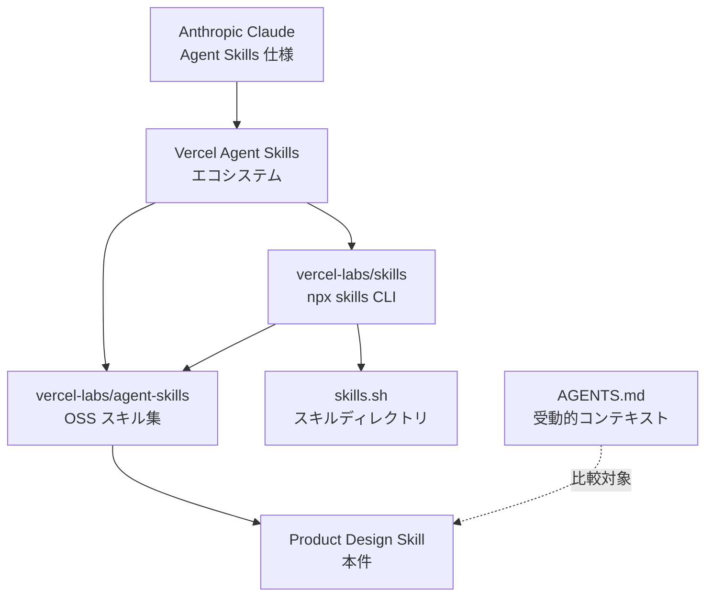
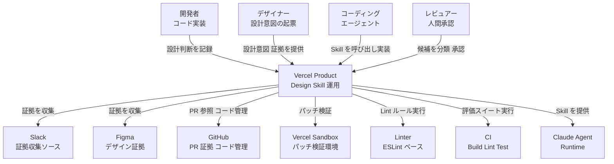
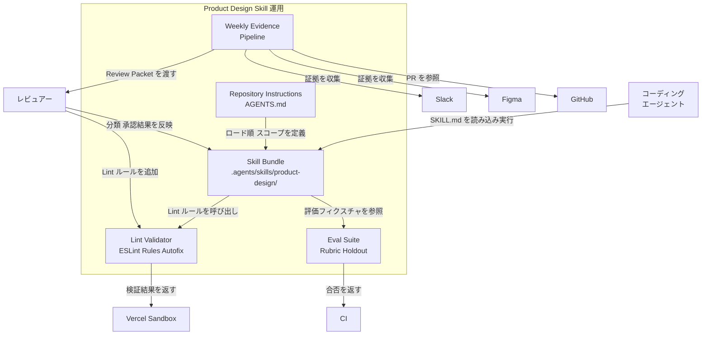
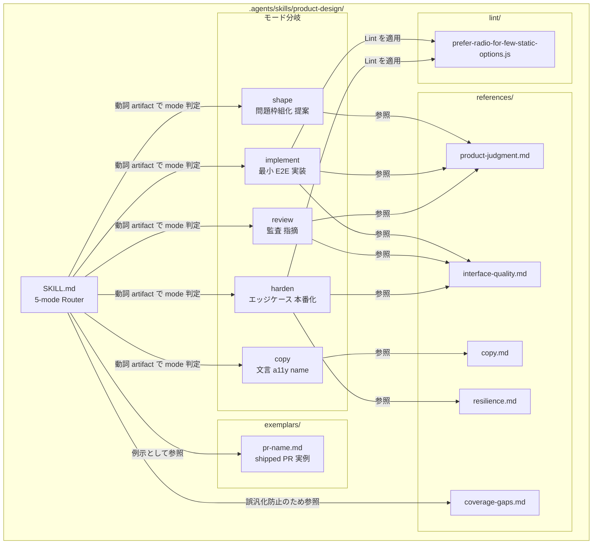
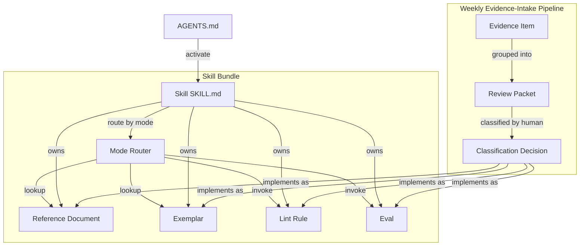
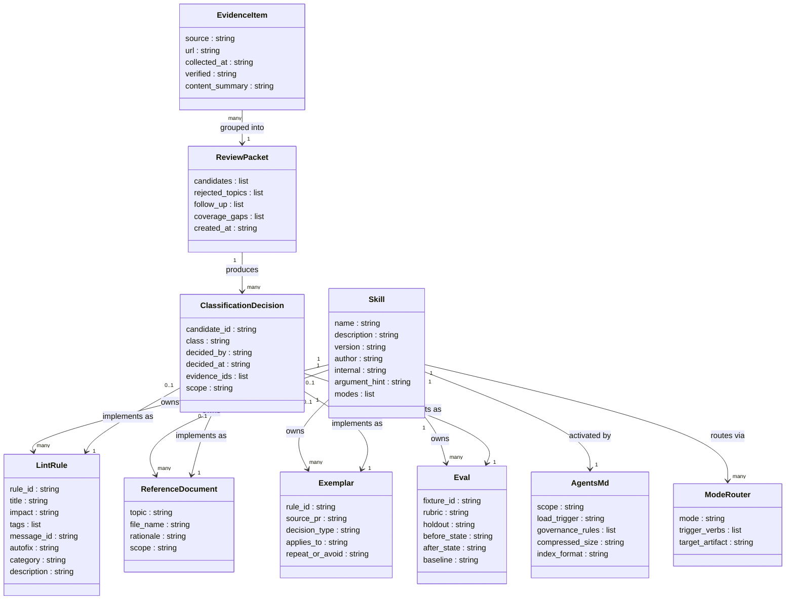
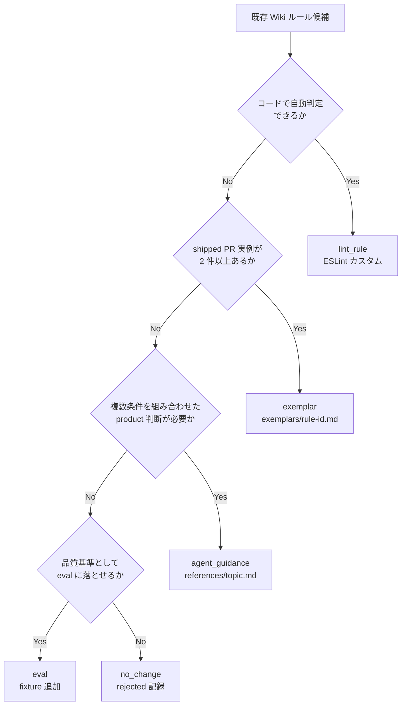

## ■この記事の使い方

長い記事です。目的に合わせて読む順番を変えてください。

- 全体像を掴みたい: ■概要 → ■特徴 → ■まとめ
- 自分の repo に同じ仕組みを入れたい: ■構築方法 → ■利用方法 → ■運用
- 既存の Confluence/Wiki と比較したい: ■概要 のアプローチ比較テーブル → ■ベストプラクティス の既存 Confluence/Wiki からの移行パターン
- 構造設計の検討に使いたい: ■構造 → ■データ
- 導入リスクを評価したい: ■考察 (適用限界と読み解き) → ■トラブルシューティング

## ■概要

### 起点記事のメタデータ

| 項目 | 内容 |
|---|---|
| タイトル | Teaching agents product design at Vercel |
| 著者 | John Phamous (Vercel) |
| 公開日 | 2026-06-25 |
| URL | https://vercel.com/blog/teaching-agents-product-design-at-vercel |

### 核心メッセージ

コーディングエージェントは「動作する UI」を高速に生成できます。しかし、なぜそのデザイン判断を下すのかという rationale を理解できません。設計判断の根拠は design review・PR コメント・Slack スレッドに散在しており、コードベース外に存在する文脈はエージェントにとって「存在しない」と同義です。

Vercel はこの問題に対し、受け入れられた設計判断 (accepted decisions) をリポジトリ内資産として管理し、エージェントに渡すアプローチを構築しました。その中核が「Product Design Skill」であり、Anthropic の Claude Agent Skills 仕様に準拠した形で設計知識を体系化したものです。

### 位置づけ

Vercel Product Design Skills は、Claude Agent Skills 仕様の上に乗る、プロダクトデザイン領域への具体的な実装例です。Vercel が自社内で採用・実証した運用方式であり、同社が公開する OSS (`vercel-labs/agent-skills`) と CLI (`vercel-labs/skills`、`npx skills` コマンド) のエコシステム上で動作します。



#### 要素説明

| 要素名 | 説明 |
|---|---|
| Anthropic Claude Agent Skills 仕様 | SKILL.md フォーマットを定義する上位仕様。エージェントが skill を発見・呼び出す方式の規格 |
| Vercel Agent Skills エコシステム | Vercel が構築した skill の配布・管理体系。npx skills CLI と skills.sh ディレクトリで構成 |
| vercel-labs/agent-skills | Vercel 公式の OSS スキル集。Product Design 関連スキルを含む |
| vercel-labs/skills (npx skills CLI) | スキルのインストール・検索・更新を担う CLI ツール |
| Product Design Skill (本件) | Vercel が自社プロダクト設計知識をエージェントに渡すために構築したスキル |
| skills.sh | コミュニティスキルも含む公開ディレクトリ |
| AGENTS.md (受動的コンテキスト) | 常時読み込まれる受動的コンテキスト。本件と比較対象になる別配信方式 |

### 関連技術との比較

| 技術 | 役割 | Skill との関係 |
|---|---|---|
| Anthropic Claude Agent Skills | 上位仕様。SKILL.md フォーマットと呼び出し方式を規定 | Skill 実体はこの仕様に準拠して作成 |
| AGENTS.md | リポジトリルートに置く受動的コンテキスト。常時読み込み | Skill は能動的呼び出し、AGENTS.md は常時注入。Vercel eval では AGENTS.md が 100% に対し Skill デフォルトは 53% |
| Vercel AI SDK 7 | アプリケーションコードでの AI 統合ライブラリ | Skill とは独立。アプリ実装層 |
| Vercel Sandbox | エージェントが生成したパッチを検証する実行環境 | Skill ワークフロー内で利用。Skill 自体ではない |
| vercel-labs/agent-skills (OSS) | Vercel 公式 OSS スキル集の公開リポジトリ | Skill 実装の配布場所 |
| vercel-labs/skills (npx CLI) | スキルのインストール・管理 CLI | Skill の配布インフラ |

### AGENTS.md vs Skills の eval 結果

Vercel は Next.js 16 新 API (`'use cache'`・`connection()`・`forbidden()` 等) を題材にベンチマークを実施しました。

| 構成 | pass 率 | 備考 |
|---|---|---|
| ベースライン (ドキュメントなし) | 53% | - |
| Skills (デフォルト) | 53% | skill が 56% のケースで未起動 |
| Skills (明示的呼び出し指示あり) | 79% | 指示文の表現差で結果が変動 |
| AGENTS.md (受動的コンテキスト) | 100% | Build / Lint / Test すべてで完全スコア |

この結果から Vercel は「汎用フレームワーク知識は AGENTS.md、バージョンアップグレード等の vertical workflow には Skill」という使い分けを推奨しています。

> **数値の測定範囲**: 上記の 53% / 79% / 100% / 56% は Next.js 16 新 API の特定タスクセットで計測されたものです。あらゆる Skill の起動率や正答率を表す汎用値ではありません。記事中でこの数値を引用する際は「AGENTS.md outperforms skills」記事の評価設定を前提とします。

### アプローチ比較テーブル

| 比較項目 | (a) Confluence/Wiki | (b) Storybook + Chromatic | (c) AGENTS.md のみ | (d) Vercel Product Design Skill | (e) 標準 Claude Agent Skills |
|---|---|---|---|---|---|
| 保管場所 | 外部 SaaS (Web) | リポジトリ + SaaS | リポジトリルート (`AGENTS.md`) | リポジトリ内 (`.agents/skills/product-design/`) | リポジトリ内 (`.claude/skills/<name>/`) またはグローバル |
| 機械可読性 | 低 (人間向け文書) | 中 (コンポーネントカタログ、AI 読み取り未対応) | 高 (Markdown、常時読み込み) | 高 (SKILL.md + references/ + exemplars/ の構造化) | 高 (SKILL.md frontmatter + Markdown 本体) |
| agent が自動で読むか | 読まない | 読まない | 常時読む (受動的) | 呼び出し時に読む (能動的) | 呼び出し時に読む (能動的) |
| 更新フロー | 担当者が手動更新 | Storybook 実装と連動、デザイン変更は手動 | 手動編集 + PR レビュー | 週次 evidence-intake workflow (Slack/Figma/PR から収集→人間分類→実装) | 自由 (仕様は規定しない) |
| 適用シーン | ドキュメント文化が根付いた組織、非エンジニア参照 | コンポーネント視覚テスト、デザイン仕様共有 | 汎用フレームワーク知識、常時守るべきルール | プロダクト判断の rationale を agent に渡す、設計基準のドリフト防止 | 特定タスクに agent を特化、再利用可能な専門知識 |

### ユースケース別の推奨

| ユースケース | 推奨度 | 理由 |
|---|---|---|
| agent-native チーム (常時コーディングエージェントが作業する組織) | 高 | rationale がコードベース外に流出する問題を直接解決する |
| 複数のデザイナー・エンジニアが同一コンポーネントに触れるチーム | 高 | 設計基準のドリフト防止に有効 |
| shipped PR から繰り返しパターンを学ばせたいチーム | 高 | exemplars/ 機構がそのまま適合する |
| エージェントに自動でルールを適用させたいケース | 中 | 汎用ルールは AGENTS.md の方が呼び出し失敗が少ない |
| 小規模チームでドキュメント維持コストを最小化したいケース | 低 | 週次 evidence-intake workflow 等の維持コストが高い |
| デザインシステムの視覚カタログが主目的のケース | 低 | Storybook + Chromatic の方が適切 |
| agent を使わず人間のみが参照するケース | 低 | Confluence/Wiki で十分 |

## ■特徴

- **設計判断の rationale をリポジトリ内資産として管理します。** PR コメントや Slack に散在しがちな根拠を、SKILL.md + references/ に集約し、コードベースと同じライフサイクルで運用します。
- **決定論的チェック (Linter) と確率的チェック (Agent) を明確に分離します。** ネストモーダル禁止・4px グリッド強制などは ESLint ルールで自動化し、プロダクト判断が必要な箇所だけを Agent に渡します。
- **週次 evidence-intake workflow で guidance を継続的に更新します。** Slack・Figma・GitHub の PR コメントを無判定で収集 (Collector) → グループ化・検証 (Judge) → 人間分類 (Review packet) の段階で、taste でなく evidence に基づく更新を行います。
- **coverage-gaps.md で「標準のない領域」を明示します。** 基準が未整備の領域を記録することで、エージェントが誤って一般化するのを防ぎます。
- **Claude Agent Skills 仕様に準拠したオープンなフォーマットを採用します。** Claude Code・GitHub Copilot・Cursor 等 18 以上のエージェントで再利用可能であり、`npx skills add` 一発でインストールできます。
- **リクエストの「動詞 + artifact」から mode を判定し内部ルーティングします。** Shape / Implement / Review / Copy / Harden の 5 モードを SKILL.md に単一エントリポイントとして定義します。
- **exemplars/ に shipped PR 由来の具体例を rule ID 付きで蓄積します。** `rule/destructive-names-action` のように ID を付けることで、lint ルールと Agent guidance の双方から参照できます。
- **eval と holdout で skill の汎化性を継続的に検証します。** 初見のインタフェースに対する rubric ベース eval と、shipped 結果から期待編集を隠した holdout の 2 種類で品質を担保します。
- **Vercel Sandbox でエージェントのパッチを安全に検証します。** 本番環境に触れることなく生成コードを実行環境で確認できます。
- **destructive actions のラベリングなど、UI コピー品質も標準化対象に含めます。** "Verb + Noun" を強制し "Confirm" / "OK" を禁止するなど、文言レベルまで設計基準を定義します。

## ■構造

### ●システムコンテキスト図

外部アクターと「Vercel Product Design Skill 運用」の関係を示します。



#### システムコンテキスト 要素テーブル

| 要素名 | 種別 | 説明 |
|---|---|---|
| 開発者 | 人間アクター | UI コードを実装し、Skill を利用して品質を確保する |
| デザイナー | 人間アクター | 設計意図・コンテキストを Slack / Figma 経由で提供する |
| コーディングエージェント | 自動アクター | Skill を呼び出し、実装・レビュー・ハードニングを自律実行する |
| レビュアー | 人間アクター | Weekly パイプラインで証拠候補を分類し、ルール追加を承認する |
| Vercel Product Design Skill 運用 | 対象システム | 設計判断をコード資産として管理し、エージェントに提供する |
| Slack | 外部システム | 設計レビューコメント・議論スレッドを証拠として収集する |
| Figma | 外部システム | デザインファイル・コメントを証拠として収集する |
| GitHub | 外部システム | PR コメント・shipped コードを証拠・コード管理として利用する |
| Vercel Sandbox | 外部システム | エージェント生成パッチを Build / Lint / Test で検証する |
| Linter | 外部システム | ESLint ベースの決定論的ルールをコードに適用する |
| CI | 外部システム | 評価スイートを実行し合否を返す |
| Claude Agent Runtime | 外部システム | Skill を消費して実装タスクを実行するエージェント基盤 |

### ●コンテナ図

「Vercel Product Design Skill 運用」のドリルダウンです。



#### コンテナ 要素テーブル

| コンテナ名 | 技術 | 説明 |
|---|---|---|
| Skill Bundle | Markdown ファイル群 | SKILL.md / references / exemplars / lint rules を束ねた中核コンテナ。エージェントの単一エントリポイント |
| Repository Instructions | AGENTS.md (Markdown) | ロード順序・トリガー定義・スコープ境界を宣言。Skill Bundle の読み込み条件を制御 |
| Lint / Validator | ESLint (JavaScript) | 決定論的ルールをコードに適用。Autofix 対応ルールは自動修正まで実施 |
| Eval Suite | Rubric + Holdout fixtures | エージェントが初見インタフェースで正しく動作するかを Before/After で評価 |
| Weekly Evidence Pipeline | Collector → Judge → Review Packet → Human Classification | Slack / Figma / PR から証拠を収集・検証し、人間承認用パケットを生成する 4 段階パイプライン |

### ●コンポーネント図

Skill Bundle 内部のドリルダウンです。



#### コンポーネント SKILL.md (Router) テーブル

| コンポーネント名 | 責務 |
|---|---|
| SKILL.md (5-mode Router) | リクエストの動詞 + artifact からモードを判定し、内部ルーティングを行う単一エントリポイント |
| shape モード | 問題を枠組化し複数案を比較・提案する。コード編集は行わない |
| implement モード | 重要決定を解決しながら最小限の End-to-End 実装を行う |
| review モード | ソースとレンダリングを検査し、優先度付き指摘を出す。コード編集は行わない |
| copy モード | ユーザー向け文言と accessible name のみを対象に編集する |
| harden モード | 確定した実装方向を維持しつつ、エッジケース・レスポンシブ・復元力を修正する |

#### コンポーネント references/ テーブル

| ファイル名 | 責務 | ロードされるモード |
|---|---|---|
| product-judgment.md | ユーザー・ジョブ・現在の状態・期待値の判断軸 | shape / implement / harden / 完全 review |
| interface-quality.md | 視覚品質・インタラクション品質の基準 | implement / 重大視覚変更 / 完全 review |
| copy.md | ユーザー向け文言・動詞規則・accessible name の基準 | copy / harden 全般 |
| resilience.md | オーバーフロー・ローカライズ・ネットワーク復帰の基準 | エラーハンドリング対象タスク |
| coverage-gaps.md | まだ標準化されていない領域の明示。エージェントの誤汎化を防ぐ | 全モード (参照のみ) |

#### コンポーネント exemplars/ テーブル

| コンポーネント名 | 責務 |
|---|---|
| pr-{name}.md | shipped PR から抽出した「繰り返すべき判断 / 避けるべき誤り」の実例。`rule/destructive-names-action` のような安定 ID で参照される |

#### コンポーネント lint/ テーブル

| ファイル名 | 責務 |
|---|---|
| prefer-radio-for-few-static-options.js | Select コンポーネントに 2〜3 個の静的オプションがある場合、Radio Button への変更を推奨する ESLint ルール (messageId: `preferRadio`) |

## ■データ

### ●概念モデル



#### 概念モデル 要素テーブル

| 要素名 | 説明 |
|---|---|
| Skill (SKILL.md) | リクエストの動詞 + artifact から内部ルーティングする単一エントリポイント |
| Reference Document | references/ 配下の Markdown。判断軸の正本 |
| Exemplar | exemplars/ 配下の Markdown。shipped PR から抽出した実例 |
| Lint Rule | ESLint または Markdown 形式の決定論的チェック |
| Eval | rubric / holdout の評価ユニット |
| Mode Router | SKILL.md 内で動詞・成果物から mode を選択する内部ルーティング |
| AGENTS.md | リポジトリまたは Skill ローカルの受動的コンテキスト。Skill activate を制御 |
| Evidence Item | Collector が収集する個々の証跡 (Slack / Figma / PR / Preview) |
| Review Packet | Judge の出力。candidates / rejected / follow-up / coverage gaps を含む |
| Classification Decision | 人間が下す分類 (agent_guidance / lint_rule / example / eval / no_change) |

### ●情報モデル



#### 各エンティティの補足

- **Skill**: SKILL.md の frontmatter で定義します。`name` と `description` が必須フィールドです。`description` にトリガー文言を含めることで、エージェントが自律的に起動タイミングを判断します。`metadata.internal: true` を指定すると通常の discovery (`npx skills find` や `--list` などの一覧化) から除外され、`INSTALL_INTERNAL_SKILLS=1` を設定したときだけ表示されます。
- **AGENTS.md**: リポジトリまたは Skill ディレクトリ直下に置く受動的コンテキストファイルです。エージェントが毎ターン自動参照するため、Skill と異なり明示的な起動判断が不要です。40KB 規模のドキュメントをインデックス形式で 8KB に圧縮した実証例があります。
- **Reference Document**: `references/` 配下の Markdown ファイル。`topic` は `product-judgment` / `interface-quality` / `copy` / `resilience` / `coverage-gaps` 等のカテゴリ名に相当します。
- **Exemplar**: `exemplars/` 配下の Markdown ファイル。shipped PR から抽出した「繰り返すべき判断」または「避けるべき誤り」を記録します。`rule_id` は `rule/destructive-names-action` のような安定識別子です。`decision_type` は `repeat` または `avoid` を取ります。
- **Lint Rule**: Markdown 形式 (title / impact / tags) と ESLint JS 形式 (rule_id / messageId / autofix) の 2 実装形態があります。`impact` は `HIGH` / `MEDIUM` / `LOW` の段階を持ちます。
- **Eval**: `rubric` はルール正確性の検証基準、`holdout` は未公開の shipped 結果から汎化性を測る保留セット、`baseline` は Skill なし状態の対照計測値です。
- **Evidence Item**: 週次パイプラインの収集フェーズで集める個々の証跡。`source` は `Slack` / `Figma` / `PR` / `Preview` のいずれかです。
- **Review Packet**: Judge フェーズの出力。`candidates` は分類待ちのルール候補、`rejected_topics` は却下理由付きのトピック、`coverage_gaps` は標準化できていない領域の一覧です。
- **Classification Decision**: 人間が Review Packet の各候補に下す判断。`class` は `agent_guidance` / `lint_rule` / `example` / `eval` / `no_change` の 5 値です。`scope` は「最も狭い適用範囲」に絞ることが原則です。
- **Mode Router**: Skill 内の内部ルーティング。`mode` は `shape` / `implement` / `review` / `copy` / `harden` の 5 値です。

## ■構築方法

### 前提条件

- **Node.js**: `npx` が動作するバージョン (v18 以上推奨)
- **npm / npx**: `npx skills` コマンドの実行に必要
- **Git**: スキルのインストール元 (GitHub / GitLab / ローカルパス) へのアクセス
- **AI agent runtime**: Claude Code / Cursor / Codex 等、18 以上のエージェントに対応
- **ESLint**: lint rule を追加する場合のみ

バージョン確認:

```bash
node --version
npm --version
npx skills --version
```

### 既存リポジトリへの導入手順

リポジトリ全体をインストールする:

```bash
npx skills add vercel-labs/agent-skills
```

特定の skill のみインストールする:

```bash
npx skills add vercel-labs/agent-skills --skill web-design-guidelines
```

複数 skill を一括インストールする:

```bash
npx skills add vercel-labs/agent-skills --skill frontend-design --skill skill-creator
```

CI/CD 環境 (非対話) でインストールする:

```bash
npx skills add vercel-labs/agent-skills --skill frontend-design -g -a claude-code -y
```

新しい skill をテンプレートから作成する:

```bash
npx skills init product-design
```

### ディレクトリ構成セットアップ

`npx skills add` は agent runtime を自動検出し、各 runtime に対応したディレクトリへ配置します。手動で構成する場合は以下が標準形です。

Claude Code の場合 (プロジェクトスコープ):

```text
.claude/skills/product-design/
├── SKILL.md
├── references/
│   ├── product-judgment.md
│   ├── interface-quality.md
│   ├── copy.md
│   ├── resilience.md
│   ├── coverage-gaps.md
│   └── glossary.md
├── exemplars/
│   └── pr-destructive-names.md
└── scripts/
```

Vercel ブログが例示するレイアウト (`.agents/skills/` 系の runtime):

```text
.agents/skills/product-design/
├── AGENTS.md
├── SKILL.md
├── references/
└── exemplars/
```

主要 runtime のインストールパス:

| Agent | フラグ | プロジェクトパス | グローバルパス |
|---|---|---|---|
| Claude Code | `claude-code` | `.claude/skills/` | `~/.claude/skills/` |
| Cursor | `cursor` | `.agents/skills/` | `~/.cursor/skills/` |
| Codex | `codex` | `.agents/skills/` | `~/.codex/skills/` |
| GitHub Copilot | `github-copilot` | `.agents/skills/` | `~/.copilot/skills/` |
| Cline / Warp / Zed | `cline` 等 | `.agents/skills/` | `~/.agents/skills/` |
| Gemini CLI | `gemini-cli` | `.agents/skills/` | `~/.gemini/skills/` |
| eve | `eve` | `agent/skills/` | (プロジェクト専用) |

### SKILL.md frontmatter の書き方

SKILL.md 先頭に YAML frontmatter を記述します。

最小構成:

```yaml
---
name: product-design
description: >-
  Single entry point for product design and user-facing product implementation.
  Use whenever work changes what a user sees, understands, chooses, or does.
---
```

フィールド仕様:

| フィールド | 必須 | 内容 |
|---|---|---|
| `name` | 必須 | 小文字・ハイフン許可。ディレクトリ名と一致させる |
| `description` | 必須 | 何をするか + いつ起動するか を 1〜2 文で記載 |
| `license` | 任意 | ライセンス (例: `MIT`) |
| `metadata` | 任意 | 任意のキー / 値。`author` / `version` を推奨 |
| `metadata.internal` | 任意 | `true` で通常 discovery から非表示。`INSTALL_INTERNAL_SKILLS=1` で表示 |
| `metadata.argument-hint` | 任意 | 受け取り引数のヒント (実例の web-design-guidelines は `metadata` 配下に置く) |

`name` と `description` 以外で公式 README が定義しているのは `metadata.internal` のみです。`argument-hint` や `author` / `version` は `web-design-guidelines` SKILL.md の実例で `metadata:` 配下にネストされており、トップレベルキーではありません。

実在する `web-design-guidelines` SKILL.md frontmatter:

```yaml
---
name: web-design-guidelines
description: Review UI code for Web Interface Guidelines compliance. Use when asked
  to "review my UI", "check accessibility", "audit design", "review UX", or "check
  my site against best practices".
metadata:
  author: vercel
  version: "1.0.0"
  argument-hint: <file-or-pattern>
---
```

product-design 用テンプレ:

```yaml
---
name: product-design
description: >-
  Single entry point for product design and user-facing product implementation
  in apps/vercel-site. Use whenever work changes what a user sees, understands,
  chooses, or does — including UI implementation, copy, accessibility,
  responsive behavior, and state handling.
metadata:
  author: your-team
  version: "1.0.0"
  internal: true
---
```

### AGENTS.md (Repository Instructions) の書き方

ルート `AGENTS.md` に load trigger を記述します。

```markdown
When shaping, editing, or reviewing user-facing UI,
load .agents/skills/product-design/SKILL.md.

Applies to:
- user-facing pages and components
- copy, interaction, accessibility, responsive behavior, and states

Skip:
- backend-only work with no user-visible effect
- telemetry, generated files, documentation, and marketing
```

AGENTS.md と Skill の使い分け:

| 用途 | 置き場所 | 理由 |
|---|---|---|
| ほぼ全タスクに適用するルール | `AGENTS.md` | 起動判断不要、常時有効 |
| 特定ワークフロー (例: UI 実装) | `SKILL.md` | 明示呼び出しで起動 |
| フレームワーク全般の知識 | `AGENTS.md` | passive context として常駐 |
| バージョンアップ等の手順 | `SKILL.md` | ユーザーが明示トリガー |

スキルローカルの `.agents/skills/product-design/AGENTS.md` には load order / validation / governance を記述します。

### References / Exemplars ファイルの作り方

References ファイルの命名規約:

| ファイル名 | 内容 |
|---|---|
| `product-judgment.md` | ユーザー・ジョブ・現在の状態・期待値の判断軸 |
| `interface-quality.md` | 視覚・相互作用品質の基準 |
| `copy.md` | ユーザー向け文言・accessible name のルール |
| `resilience.md` | 極限データ・ネットワーク復帰時の挙動 |
| `coverage-gaps.md` | まだ標準がない領域 |
| `glossary.md` | 用語定義 |
| `patterns.md` | 繰り返し使うパターン集 |
| `surfaces-{surface}.md` | サーフェス固有ガイド |

Exemplar ファイル構造 (命名: `rule/<rule-id>` 形式):

```markdown
rule/destructive-names-action

Source: copy.md > Actionable; verbs.md
Rule:   Destructive CTAs follow Verb + Noun.
        Never use Confirm, OK, or a bare verb.

## Examples
Bad:  <Button>Confirm</Button>
Good: <Button>Delete Project</Button>
```

### Lint rule の追加

ESLint カスタムルールとして実装します。autofix を持つルールは CI で error にせず、自動修正して PR に commit させる運用が選択肢になります。

`prefer-radio-for-few-static-options.js` (suggestion 版):

```javascript
/** @type {import('eslint').Rule.RuleModule} */
module.exports = {
  meta: {
    type: 'suggestion',
    docs: {
      description: 'Suggest Radio buttons when Select has 2-3 static options',
      category: 'Design System',
      recommended: true,
    },
    schema: [],
    messages: {
      preferRadio:
        'Select with {{ count }} static options. Consider using Radio buttons' +
        ' — they show all options at once without requiring a click to open.',
    },
  },
  create(context) {
    return {
      JSXElement(node) {
        const opening = node.openingElement;
        if (opening.name.type !== 'JSXIdentifier') return;
        if (opening.name.name !== 'Select') return;
        const hasDynamic = node.children.some(
          (child) =>
            child.type === 'JSXExpressionContainer' &&
            child.expression.type === 'CallExpression',
        );
        if (hasDynamic) return;
        const optionChildren = node.children.filter(
          (child) =>
            child.type === 'JSXElement' &&
            child.openingElement.name.type === 'JSXIdentifier' &&
            child.openingElement.name.name === 'option',
        );
        if (optionChildren.length < 2 || optionChildren.length > 3) return;
        context.report({
          node: opening,
          messageId: 'preferRadio',
          data: { count: String(optionChildren.length) },
        });
      },
    };
  },
};
```

autofix を持つルール (deprecated Tailwind 変換) の最小骨格:

```javascript
module.exports = {
  meta: {
    type: 'problem',
    fixable: 'code',
    messages: { renamedUtility: '`{{ old }}` is deprecated. Use `{{ new }}`.' },
  },
  create(context) {
    const RENAMES = { 'flex-shrink-0': 'shrink-0', 'flex-grow-0': 'grow-0' };
    return {
      Literal(node) {
        if (typeof node.value !== 'string') return;
        const tokens = node.value.split(' ');
        const updated = tokens.map((t) => RENAMES[t] || t);
        if (tokens.join(' ') === updated.join(' ')) return;
        context.report({
          node,
          messageId: 'renamedUtility',
          data: { old: tokens.find((t) => RENAMES[t]), new: RENAMES[tokens.find((t) => RENAMES[t])] },
          fix(fixer) {
            return fixer.replaceText(node, JSON.stringify(updated.join(' ')));
          },
        });
      },
    };
  },
};
```

`fixable: 'code'` と `fix(fixer)` を組み合わせると `eslint --fix` で自動置換され、suggestion 型 (`type: 'suggestion'`) は人間が IDE で受諾するまで適用されません。

主要な lint rule カテゴリ:

| ルール | 内容 | autofix |
|---|---|---|
| nested modal 防止 | モーダル内モーダルを禁止 | なし (構造判断) |
| prefer-radio | 静的選択肢 2〜3 個の `<Select>` を Radio に誘導 | suggestion |
| icon button accessible name | icon button に accessible name を必須化 | なし (文言判断) |
| 4px グリッド強制 | arbitrary spacing を 4px グリッドに揃える | あり (近傍値に丸め) |
| deprecated Tailwind autofix | 古い utility を新しいものに自動変換 | あり |

### `npx skills init` で生成されるテンプレート

`npx skills init product-design` を実行するとカレントディレクトリに以下の最小 SKILL.md が生成されます (CLI の起動例)。

```yaml
---
name: product-design
description: One-line summary. Use when the user asks for ...
---

# product-design

## When to use
- (起動条件を箇条書き)

## Instructions
1. (手順)
```

Exemplar ファイルの命名は **2 段構成**です。ディレクトリ上は人間が探しやすい PR 由来名 (`pr-destructive-names.md`)、本文先頭の 1 行目にエージェントから参照される **安定 ID** (`rule/destructive-names-action`) を置きます。同一ファイルの 2 つの呼称であり別物ではありません。

```text
exemplars/
└── pr-destructive-names.md   # ファイル名は PR 由来
    ├── 1 行目: "rule/destructive-names-action"  ← 安定 ID
    └── 以下、Rule / Examples / Why
```

### `npx skills` コマンド一覧

| コマンド | 内容 |
|---|---|
| `npx skills add <source>` | skill をインストールする |
| `npx skills use <source>` | インストールせず一時的に使用する |
| `npx skills list` | インストール済み skill を表示する |
| `npx skills find [query]` | skills.sh から検索する |
| `npx skills update [skills]` | インストール済み skill を更新する |
| `npx skills remove [skills]` | skill をアンインストールする |
| `npx skills init [name]` | 新しい SKILL.md テンプレートを作成する |

## ■利用方法

### 必須パラメータ早見表

| コマンド | 必須パラメータ | 説明 |
|---|---|---|
| `npx skills add` | `<source>` | GitHub shorthand (`owner/repo`) または URL |
| `npx skills use` | `<source>` | 同上 |
| `npx skills remove` | なし (対話選択 or `[skills]`) | 省略時は対話モード |
| `npx skills update` | なし | 省略時は全 skill 更新 |
| `npx skills find` | なし | `[query]` は任意 |
| `npx skills init` | なし | `[name]` は任意 |

### CLI コマンド詳細

#### `skills add` — インストール

```bash
# GitHub shorthand
npx skills add vercel-labs/agent-skills

# 特定 skill のみ
npx skills add vercel-labs/agent-skills --skill web-design-guidelines

# 複数 skill を指定
npx skills add vercel-labs/agent-skills --skill frontend-design --skill skill-creator

# Claude Code と Cursor の両方にインストール
npx skills add vercel-labs/agent-skills -a claude-code -a cursor

# グローバルスコープ
npx skills add vercel-labs/agent-skills -g

# CI/CD 向け非対話インストール
npx skills add vercel-labs/agent-skills --skill frontend-design -g -a claude-code -y

# 全 skill を全 agent にインストール
npx skills add vercel-labs/agent-skills --all

# 利用可能 skill を確認
npx skills add vercel-labs/agent-skills --list
```

source のフォーマット:

```bash
# GitHub shorthand (推奨)
npx skills add vercel-labs/agent-skills

# GitHub フル URL
npx skills add https://github.com/vercel-labs/agent-skills

# リポジトリ内の特定パス
npx skills add https://github.com/vercel-labs/agent-skills/tree/main/skills/web-design-guidelines

# GitLab
npx skills add https://gitlab.com/org/repo

# 任意の Git URL
npx skills add git@github.com:vercel-labs/agent-skills.git

# ローカルパス
npx skills add ./my-local-skills
```

#### `skills use` — 一時使用

```bash
# stdout に出力して claude に渡す
npx skills use vercel-labs/agent-skills@web-design-guidelines | claude

# --agent で Claude Code を対話起動
npx skills use vercel-labs/agent-skills --skill web-design-guidelines --agent claude-code
```

#### `skills list` — 確認

```bash
# 全インストール済み skill
npx skills list

# グローバルのみ
npx skills ls -g

# 特定 agent でフィルタ
npx skills ls -a claude-code -a cursor
```

#### `skills find` — 検索

```bash
# 対話検索
npx skills find

# キーワード検索
npx skills find typescript

# organization でフィルタ
npx skills find react --owner vercel
```

内部 skill (non-public) を表示する場合:

```bash
INSTALL_INTERNAL_SKILLS=1 npx skills add vercel-labs/agent-skills --list
```

#### `skills update` — 更新

```bash
npx skills update
npx skills update web-design-guidelines
npx skills update frontend-design web-design-guidelines
npx skills update -g
npx skills update -p
npx skills update -y
```

#### `skills remove` — 削除

```bash
npx skills remove
npx skills remove web-design-guidelines
npx skills remove frontend-design web-design-guidelines
npx skills remove --global web-design-guidelines
npx skills remove --agent claude-code cursor my-skill
npx skills remove --all
npx skills rm web-design-guidelines
```

#### `skills init` — テンプレート作成

```bash
npx skills init
npx skills init my-skill
```

### Skill activation の仕方

description はただの説明文でなく「いつ起動するか」を示すルーティング定義として書きます。

悪い例:

```yaml
description: Helps with UI design
```

良い例:

```yaml
description: >-
  Review UI code for compliance. Use when asked to "review my UI",
  "check accessibility", "audit design", or "check my site against best practices".
```

Vercel の eval では、skill をデフォルト設定のまま使うと 56% の確率で起動されないことが確認されています。対策は 2 つです。

1. 明示的な指示を description に含める ("Use when..." のトリガー文言)
2. AGENTS.md に passive context として記述し、起動判断を agent に委ねない

AGENTS.md への記述で達成率は 53% → 100% に改善した実績があります。

### 5 モード ルーティング

SKILL.md はリクエストの「動詞 + artifact」からモードを判定し、内部処理を切り替えます。

| モード | 典型的なリクエスト例 | エージェントの動作 |
|---|---|---|
| Shape | "Design this flow" / "How should this work?" | 問題を構造化して代替案を比較、フロー・状態・受け入れ基準を定義。編集はしない |
| Implement | "Build" / "fix" / "improve" / "make compliant" | 設計判断を解決してから最小の一貫した変更を実装する |
| Review | "Audit" / "critique" / "what's wrong?" | ソースとレンダリングを精査し優先度付き指摘を報告。編集はしない |
| Copy | "Fix the copy" / "rewrite these errors" | ユーザー向け文言・accessible name・直接必要な JSX のみ編集する |
| Harden | "Polish" / "production-ready" / "handle edge cases" | 確定した設計方針を維持しつつ、状態・resilience・レスポンシブ・a11y の欠陥を修正する |

### 既存コードベースでの実行フロー

agent が SKILL.md を読み込んだ後の処理順序:

1. SKILL.md の frontmatter と本文を読み込んでモードを判定する
2. 必要に応じて `references/` 内のファイルを参照する
3. `exemplars/` から該当ルール ID の具体例を参照する
4. lint rule を実行して deterministic なチェックを行う
5. 結果を指定フォーマットで返す

decision として記録するテンプレート:

```markdown
# Decision: {name}
Status: proposed | accepted | rejected
Scope:
Decision:
Rationale:
Evidence:
Exceptions:
Bad example:
Good example:
Assumptions:
Open decisions:
```

### Vercel Sandbox での validate

```bash
# 1. agent に Implement モードで実装させる
#    例: "Fix the modal to prevent nested layers"

# 2. Sandbox で動作検証
#    vercel --cwd <project> deploy

# 3. lint で再確認
npx eslint --rule 'prefer-radio-for-few-static-options: error' src/
```

eval フィクスチャのレイアウト例:

```text
tooling/scripts/evals/
├── fixtures.json
├── rules-checklist.json
└── modal-nesting/
    ├── before/
    │   └── Component.tsx
    └── after/
        └── Component.tsx
```

### コードサンプル集

AGENTS.md (リポジトリルート):

```markdown
When shaping, editing, or reviewing user-facing UI,
load .agents/skills/product-design/SKILL.md.

Applies to:
- user-facing pages and components
- copy, interaction, accessibility, responsive behavior, and states

Skip:
- backend-only work with no user-visible effect
- telemetry, generated files, documentation, and marketing
```

Exemplar (`exemplars/rule-destructive-names-action.md`):

```markdown
rule/destructive-names-action

Source: copy.md > Actionable; verbs.md
Rule:   Destructive CTAs follow Verb + Noun.
        Never use Confirm, OK, or a bare verb.

## Examples

Bad:
<Button>Confirm</Button>
<Button>OK</Button>
<Button>Delete</Button>

Good:
<Button>Delete Project</Button>
<Button>Remove Member</Button>
<Button>Revoke Access</Button>

## Why
削除確認ダイアログでユーザーは対象を忘れがちです。"Verb + Noun" で
対象を明示することで取り消し不能な操作への誤クリックを減らします。
```

`npx skills add` 主要実行例:

```bash
# product-design 系 skill を Claude Code にインストール
npx skills add vercel-labs/agent-skills --skill web-design-guidelines -a claude-code

# 全 skill を全 agent にグローバルインストール
npx skills add vercel-labs/agent-skills --all -g -y

# 一時使用
npx skills use vercel-labs/agent-skills@web-design-guidelines | claude

# 内部 skill を含めてリスト表示
INSTALL_INTERNAL_SKILLS=1 npx skills add vercel-labs/agent-skills --list

# 新しい skill テンプレを作成
npx skills init product-design
```

## ■運用

### Weekly Evidence-Intake ループ

稼働中のシステムを継続改善するための週次サイクルです。4 段階に分かれており、各段階の責任を明確に分離することで誤った汎化を防ぎます。

```text
[Collector] → [Judge] → [Review packet] → [Human classification]
```

#### Step 1: Collector (無判定収集)

Slack・Figma コメント・PR コメント・Preview フィードバックを判断せずに集約します。

- 収集対象: メッセージ・リンク・周辺コンテキスト
- 禁止事項: ルール提案・分類・フィルタリング
- 目的: 素材をそのまま次ステップに渡す

実装手段の例: 週次 cron で動く GitHub Actions が GitHub REST API (`repos/{owner}/{repo}/pulls/comments` で PR レビューコメント、`repos/{owner}/{repo}/issues/comments` で PR 本体や Issue のコメント) を集め、Slack Web API (`conversations.history`) と Figma REST API (`/v1/files/{file_key}/comments`) からも JSON を取得して 1 つの JSONL に流す構成。コーディングエージェントを使う場合は Claude / Codex に「収集だけしてルール化はしない」とプロンプトで明示し、出力先を Slack スレッド URL や PR URL を主キーとした JSONL に固定します。

#### Step 2: Judge (グループ化と検証)

Collector が集めた evidence を分析します。ここでもルール提案はしません。

- 同じ判断パターンが繰り返されている evidence をまとめる
- 各 evidence が実際に shipped された判断かを確認する
- 「まだ判断できない」ものは open question として保留する
- 禁止事項: rule 提案・候補の自動昇格

実装手段の例: 同 GitHub Actions の後段ステップで、エージェントに JSONL を渡して「PR URL を主キーに重複統合」「shipped (merged) かどうかを `gh pr view --json state` で再確認」「2 件以上で出現したパターンだけ candidate として残す」を実行させます。出力は次ステップに渡す Review Packet (JSON or Markdown) の 1 ファイルにまとめます。

#### Step 3: Review packet (人間への受け渡し)

Judge の成果を構造化して人間レビュアーに渡します。

| 項目 | 内容 |
|---|---|
| candidates | 昇格候補の evidence + 根拠 |
| rejected topics | 採用しなかった evidence と理由 |
| follow-up | 追加確認が必要な open questions |
| coverage gaps | 標準がまだない領域の記録 |

#### Step 4: Human classification (人間による分類と実装)

自動化はここで終わります。人間が各候補を分類し実装します。

| 分類 | 用途 | 実装先 |
|---|---|---|
| agent guidance | 文脈判断が必要なルール | references/*.md または SKILL.md |
| lint rule | deterministic に検出できるもの | ESLint カスタムルール |
| example | 再現すべき具体例 | exemplars/ ディレクトリ |
| eval | 評価テストとして追加 | eval fixture |
| no change | 採用しない | rejected として記録 |

merge gate: 狭い対象に limit し、関連 check が全て pass したら merge します。

### Skill のバージョン管理

Skill 変更は PR ベースで管理します。

```text
変更作成 → PR 作成 → eval suite 実行 → lint check → human review → merge
```

- 全変更はソース (Slack thread URL / PR リンク等) を明示します。
- eval suite が pass しない変更は merge しません。
- 「関連 check」は lint と eval の両方を指します。

### Eval の運用

Rubric eval:

- 初見の interface を agent に与えます
- agent が編集した結果を rubric で採点します
- 「ルール正確性」と「shipped 結果との類似性」を別スコアで評価します

Holdout test:

- shipped 結果から期待編集を隠します
- agent が exemplar を見ずに同じ判断を再現できるかをテストします
- 汎化性の確認が目的です

Lint (deterministic) と Agent 動作 (variability) は別々にテストします。

### Skill 読み込み監視

デフォルト動作では 56% のケースで Skill が起動しません。継続的に監視する必要があります。

監視の観点:

- Skill が呼び出されたか (invocation rate)
- 呼び出されたが期待通り動作しなかったか (execution quality)
- AGENTS.md の passive context と競合していないか

改善アクション:

1. description / trigger に動詞 + artifact パターンを追加する
2. AGENTS.md に「いつ Skill を load するか」を明示する
3. 改善後、eval を再実行して invocation rate を確認する (目標: 95% 以上)
4. それでも改善しない場合は passive context (AGENTS.md) への移行を検討する

### Coverage-gap 管理

`references/coverage-gaps.md` を週次で更新します。

- agent が「標準がない領域」を誤って汎化しないようにする
- 「いつか標準化する」候補をリストで見えるようにする
- Judge ステージで「判断できない」ものは必ず coverage-gaps.md に記録する
- ギャップが増えている場合は judge の絞り込みを強化する
- ギャップを埋める際は Human classification フローを通す (自動昇格禁止)

### OSS の取り込み

```bash
# 全 skill を最新化
npx skills update

# 特定 skill のみ
npx skills update <skill-name>

# プロジェクトスコープのみ
npx skills update -p

# グローバルスコープのみ
npx skills update -g

# 確認プロンプトをスキップ (CI 向け)
npx skills update -y

# バージョンを固定してインストール
npx skills add vercel-labs/agent-skills@<commit-sha>
```

更新前に変更内容を確認します。スクリプトを含む Skill はコードレビュー同様に扱います。

## ■ベストプラクティス

### 既存 Confluence / Wiki からの移行パターン

社内 Wiki に蓄積した設計ルールを repo 内資産へ移すときは、Weekly Evidence-Intake と同じ 5 分類に振り分けます。Confluence 1 ページを 1 分類に丸ごと移すのでなく、ページ内のルールを以下の判断ツリーで分解するのが要点です。



#### 移行例: 「ボタンラベルは動詞 + 名詞」(Confluence ページ)

AsIs (Confluence 1 ページに散在):

```text
タイトル: Button label guidelines
本文:
  1. Always use Verb + Noun. Bad: Confirm. Good: Delete Project.
  2. アイコンボタンには accessible name が必要。
  3. 削除確認モーダルは destructive variant を使う。
  4. (出典なし) ボタンは原則 primary を 1 画面 1 つに。
```

ToBe (4 つの分類へ分解):

| Confluence 行 | 判定 | 移行先 |
|---|---|---|
| 1. Verb + Noun | shipped PR 実例 2 件以上あり | `exemplars/pr-destructive-names.md` (rule/destructive-names-action) + `references/copy.md` の 1 段落 |
| 2. icon button accessible name | コードで自動判定可 | `lint/icon-button-name.js` (ESLint カスタム) |
| 3. destructive variant の使用 | shipped 実例不足 + 複数条件判断 | `references/copy.md` の guidance に集約 (Variant 選択ロジック) |
| 4. 1 画面 1 primary (出典なし) | 出典・shipped 実例なし | `no_change` に分類し rejected 記録 |

このように Wiki 1 ページを 1 分類に丸投げせず、ルールごとに最適な surface (lint / exemplar / reference / eval / no_change) に分解することで、agent から見たときの粒度と検証可能性が揃います。

### AGENTS.md vs Skill の使い分け

Vercel の eval 結果に基づく推奨構成です。

| 用途 | 推奨手段 | 理由 |
|---|---|---|
| 一般的なフレームワーク知識 | AGENTS.md (passive context) | 決定ポイント不要、常時利用可、順序問題なし、100% 達成 |
| バージョンアップグレード等の vertical workflow | Skill | ユーザーが明示的にトリガーする場面に適合 |
| 新 API の使い方 (Next.js 等) | AGENTS.md | 53% → 100% の改善実績あり |

eval 数値:

| 設定 | 合格率 |
|---|---|
| ベースライン (ドキュメントなし) | 53% |
| Skill デフォルト動作 | 53% |
| Skill + 明示的呼び出し指示 | 79% |
| AGENTS.md (passive context) | 100% |

### AGENTS.md の圧縮

AGENTS.md を肥大化させると agent の読み込みコストが増加します。40KB → 8KB (80% 削減) を目標にします。

- 本文に詳細を書かず「インデックス」構造にする
- agent が必要時に詳細ファイルを検索・読み込む
- パイプ区切り形式で項目を圧縮する

Before (詳細を直書き):

```markdown
## Component patterns
When creating a button, always use the Button component from @/components/ui/button.
Make sure to set the variant prop. Available variants are: default, destructive, outline...
(以下 2000 文字続く)
```

After (インデックス構造):

```markdown
## Components
See .agents/references/components.md | Button | Dialog | Form | Table
```

### Skill activation を確実にする

description と trigger に「動詞 + artifact パターン」を使います。

```yaml
name: product-design
description: >
  Review, implement, or harden product design for a UI component or page.
  Triggered when user asks to review UI, add error states, or improve copy.
```

加えて AGENTS.md にも明示します:

```markdown
## When to load skills
- `/product-design` when: reviewing UI, implementing error states, hardening accessible names
```

### Rule の汎化条件

shipped example が 1 件だけの場合、lint rule にしません。

1. 同じパターンが複数の shipped PR で確認されたら候補にする
2. Judge ステージで「複数 case で再現したか」を確認する
3. Human classification で lint rule に分類してから実装する

良い例 (radio button 推奨ルール): 「静的選択肢が 2〜3 個なら radio button」はコードで count できます。複数 PR で繰り返し指摘されました。lint rule として実装可能です。

悪い例 (destructive action の対象名): 「削除ダイアログに正しい object 名を表示する」は product context が必要です。コードで自動判定できません。lint ではなく Skill 内 guidance として実装します。

### Lint と Skill 内ガイダンスの境界

| 判定方法 | 実装先 |
|---|---|
| Deterministic (コードで自動判定可) | ESLint カスタム rule |
| Context 依存 (product 判断が必要) | references/*.md または SKILL.md |

境界の判断例:

- 「icon button に accessible name があるか」→ lint (属性の有無を確認するだけ)
- 「エラーメッセージが適切か」→ guidance (意味の判断が必要)

### CI 連携

```text
agent が編集 → PR 作成
→ Vercel Sandbox で動作 validate
→ lint check (ESLint カスタム rules 含む)
→ eval suite (rubric + holdout)
→ human review
→ merge
```

全 check が pass するまで merge しません。

### Skill の最小スコープ原則

scope creep を防ぐために、変更を 1 つの product surface または 1 つのルールパターンに絞ります。

- 悪い例: 「UI 全般の改善」をひとつの Skill に入れる
- 良い例: 「destructive action のコピー」「error state のレジリエンス」を別 Skill に分ける

`coverage-gaps.md` に「まだ標準がない」と書いておくことで、agent が誤って自己流に一般化するのを防ぎます。

### マルチエージェント対応

```bash
# Claude Code と Cursor に同時インストール
npx skills add vercel-labs/agent-skills -a claude-code -a cursor

# CI/CD 向け非対話モード
npx skills add vercel-labs/agent-skills --skill frontend-design -g -a claude-code -y
```

各 agent は専用ディレクトリにインストールされます。SKILL.md frontmatter の共通仕様で互換性を維持します。高度な機能 (`allowed-tools` 等) は対応 agent が限定されるため互換性マトリックスを確認します。

## ■トラブルシューティング

| 症状 | 原因 | 対処 |
|---|---|---|
| Skill が呼び出されない (56% 失敗ケース) | description / trigger が曖昧で agent が判断できない | AGENTS.md に明示的な「いつ load するか」を追加する。または passive context (AGENTS.md) に移す |
| Skill 起動率が低いまま (明示指示後も 80% 未満) | 複数の Skill が競合、または AGENTS.md に矛盾した記述がある | AGENTS.md の該当箇所を精査し競合を排除する。eval で invocation を計測する |
| Lint rule が誤検出する | shipped example が 1 件だけで作った rule の条件が広すぎる | exemplar を複数集め、条件を絞ってから rule を更新する |
| Lint rule が未検出 (見逃し) | rule のスコープが狭すぎる、または pattern が実装と乖離している | shipped PR の diff を fixture に追加して holdout test を拡充する |
| Coverage-gap が増え続ける | Judge が open question を記録しているが Human classification に渡っていない | review packet を週次で人間が処理しているか確認する。処理しきれない場合は judge の絞り込みを強化する |
| AGENTS.md が肥大化 (40KB 超) | 詳細を本文に書き込んでいる | 80% 圧縮の方針でインデックス構造に書き直す |
| review packet が処理しきれない | collector が無判定で集めすぎ、または judge のフィルタが弱い | judge に「shipped PR から直接引用できるものに限定」という制約を追加する。複数週に分散する |
| Skill 更新が standards drift を引き起こす | eval pass なしで merge した | PR テンプレに eval 必須を明記し、関連 check 全 pass を merge gate にする |
| 複数 agent runtime で挙動差が出る | frontmatter の高度な機能が一部の agent で非対応 | `npx skills add -a <agent>` で対象 agent を絞ったプロファイル別 skill にする。互換性マトリックスで事前確認する |
| `npx skills update` 後に動作が変わった | community skill の breaking change を確認せずに更新した | バージョンを固定する (`@<commit-sha>`)。更新前に diff を確認する |
| Skill invocation はされているが品質が低い | rubric eval スコアが低い、references の記述が不十分 | eval failure の fixture を確認し、対応する references/*.md の記述を補強する。exemplar を追加する |

## ■考察 (適用限界と読み解き)

事実の整理だけでなく、この方式をそのまま採用したときに何が起きるかを 3 点に絞って考察します。

### 1. 週次 evidence-intake は組織コストとして重い

Collector → Judge → Review Packet → Human Classification の 4 段階は、最終ステップが必ず人間判断です。Vercel のような agent-native かつ意思決定者が repo に常駐する組織だから成立しますが、デザイナーやレビュアーが分散している組織では Review Packet が滞留しがちです。スモールスタートでは「Collector / Judge を 1 ヶ月単位に伸ばす」「rule 候補は 1 週 3 件以内に制限する」など、Vercel と同じ週次運用に揃えない選択肢が現実的です。

### 2. AGENTS.md 100% を「skill 不要」と読み替えない

eval 数値だけ見ると AGENTS.md (受動的コンテキスト) が 100%、Skill デフォルトが 53% で、Skill が劣後する印象を受けます。しかし測定対象は Next.js 16 新 API の特定タスクセットであり、評価対象は「呼び出しが必要かどうかをエージェントが判断できるか」という決定タスクに偏っています。長い手順を伴うバージョンアップグレードや、ユーザーが明示的に呼び出す vertical workflow では、AGENTS.md にすべて書くと容量超過 (40KB 超) と起動コスト増を招きます。「常時必要な軸は AGENTS.md、明示的な手順や複雑な ToBe を持つものは Skill」という分担を維持しないと、過学習した結論になります。

### 3. Vercel 規模でないチームには「3 軸の最小構成」が現実解

本格運用は SKILL.md + references + exemplars + lint + eval + weekly pipeline の 6 層になりますが、小規模チームではこれを丸ごと運用する余力が無いことが多いです。最小構成として次の 3 軸 (S/L/Wiki→AGENTS.md) から始めるのが現実的です。

- **S** = AGENTS.md にチーム共通の口頭ルールを 200 行以内で書き、まず passive context として常時注入する
- **L** = 1〜2 個の lint rule (例: 動詞 + 名詞ボタンラベル、icon button accessible name) だけ実装し、autofix で勝手に直す運用にする
- **Wiki→AGENTS.md** = 既存 Confluence の「ボタン・モーダル・コピー」の 3 ページだけを AGENTS.md のインデックス構造に圧縮する (本記事の Confluence→repo 移行パターン参照)

これで Vercel の 6 層運用には届かなくても、「コードベース外に存在する context」の流出を 8 割止められます。残り 2 割を半年〜1 年かけて Skill 化する順序が、組織コストと得られる成果のバランスが良いはずです。

## ■まとめ

Vercel の Product Design Skill は次の 3 つを同じリポジトリ内で同居させる運用方式です。

- **何を**: 設計判断の根拠を SKILL.md / references / exemplars / lint / eval / weekly evidence-intake の 6 層で repo 内資産にする
- **どう切り分けて**: 決定論的な判定は lint、context 依存の判断は agent guidance と分離し、それぞれ別の評価方式 (lint check と rubric / holdout) でテストする
- **どう更新する**: Slack / Figma / GitHub の証跡を Collector → Judge → Review Packet → Human Classification の 4 段階で人間が分類し、scope を 1 surface に絞って merge する

得られるもの: コードベース外に流出していた rationale を repo に閉じ込め、agent と人間の双方が同じソースを参照できる。

捨てるもの: 週次運用の維持コストと、人間判断ステージのスループット (= Review Packet を週 1 件以上処理できないチームは適用が難しい)。

次のアクション: 自分のチームでは「S / L / Wiki→AGENTS.md」の最小構成 (前節「考察」参照) から始めるか、Vercel 同等のフル運用を 6 ヶ月計画で導入するかを最初に決めるとよいです。Skill のデフォルト起動率が 53% のままだと AGENTS.md とほぼ等価のため、明示指示を入れるか passive context に倒すかの選択も同時に決めます。

この記事が少しでも参考になった、あるいは改善点などがあれば、ぜひリアクションやコメント、SNS でのシェアをいただけると励みになります！

## ■参考リンク

- Vercel 公式ブログ
  - [Teaching agents product design at Vercel](https://vercel.com/blog/teaching-agents-product-design-at-vercel)
  - [AGENTS.md outperforms skills in our agent evals](https://vercel.com/blog/agents-md-outperforms-skills-in-our-agent-evals)
  - [Agent skills explained: An FAQ](https://vercel.com/blog/agent-skills-explained-an-faq)
- Vercel 公式ドキュメント
  - [Agent Skills (Vercel Docs)](https://vercel.com/docs/agent-resources/skills)
  - [Agent Skills: Creating, Installing, and Sharing Reusable Agent Context (Vercel KB)](https://vercel.com/kb/guide/agent-skills-creating-installing-and-sharing-reusable-agent-context)
- GitHub
  - [vercel-labs/agent-skills](https://github.com/vercel-labs/agent-skills)
  - [vercel-labs/agent-skills AGENTS.md](https://github.com/vercel-labs/agent-skills/blob/main/AGENTS.md)
  - [web-design-guidelines SKILL.md](https://github.com/vercel-labs/agent-skills/blob/main/skills/web-design-guidelines/SKILL.md)
  - [react-best-practices SKILL.md](https://github.com/vercel-labs/agent-skills/blob/main/skills/react-best-practices/SKILL.md)
  - [async-cheap-condition-before-await rule](https://github.com/vercel-labs/agent-skills/blob/main/skills/react-best-practices/rules/async-cheap-condition-before-await.md)
  - [vercel-labs/skills (npx skills CLI)](https://github.com/vercel-labs/skills)
- 関連サイト
  - [skills.sh](https://skills.sh)
  - [Anthropic Claude Agent Skills (公式仕様)](https://docs.anthropic.com/en/docs/build-with-claude/agent-skills)
