## Vercel Ship 2026 の全体像

2026年6月、Vercel はロンドンで開催した Vercel Ship 2026 において、エージェント時代を前提とした全スタックプラットフォーム戦略を発表しました。

発表の骨子は3点です。

1. **Coding agents のデプロイ先**: Claude Code や Codex などのコーディングエージェントがデプロイ先として自然に選ぶ基盤として、Vercel が Agents 対応を強化しました。週次デプロイが3ヶ月で2倍になり、30%以上がコーディングエージェント発になっています。
2. **エージェント構築・運用基盤**: エージェントを本番環境で構築・実行するために必要な全プリミティブを Agent Stack として統合しました。
3. **自己自動化**: Vercel 自身がエージェントによって自動化される「3層目の進化」を実現しました。本番環境の異常をエージェントが自律調査し、アラートではなくプルリクエストを起票します。

### Agent Stack の全体構成

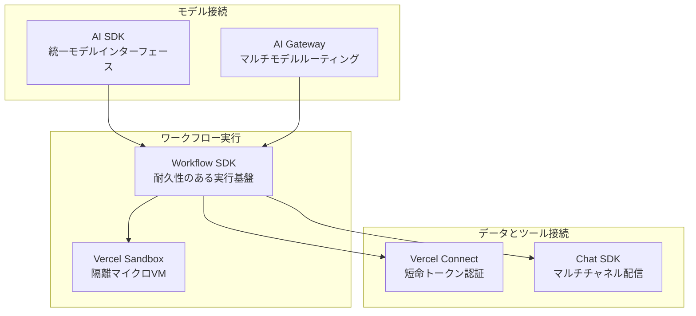

#### モデル接続

| 要素名 | 説明 |
|---|---|
| AI SDK | あらゆるモデルを単一インターフェースで呼び出す。ストリーミング・ツールコール・構造化出力を統一する |
| AI Gateway | 単一エンドポイントから数百モデルへルーティングし、プロバイダー障害時に自動フェイルオーバーする |

#### ワークフロー実行

| 要素名 | 説明 |
|---|---|
| Workflow SDK | 各ステップをチェックポイントし、状態を保持しながら失敗箇所からリトライする耐久実行基盤 |
| Vercel Sandbox | エージェントごとに隔離された Linux microVM を提供し、信頼できないコードをホストから分離して実行する |

#### データ・ツール接続

| 要素名 | 説明 |
|---|---|
| Vercel Connect | タスクごとに短命の認証情報を発行し、長命トークンを env var に保持するリスクを排除する |
| Chat SDK | Slack・Discord・GitHub・Teams など複数チャネルへ単一コードベースからエージェントを配信する |

### eve フレームワークの位置付け

eve は Agent Stack をオープンソースフレームワークとして具体化したものです。「エージェントは1つのディレクトリ」というパラダイムを採用し、`agent.ts`・`instructions.md`・`tools/`・`skills/`・`subagents/`・`channels/`・`schedules/` の各ファイル・ディレクトリが1つのエージェントを構成します。耐久実行・サンドボックスコンピュート・ヒューマンインザループ承認・サブエージェント・Evals がフレームワーク組み込みで提供されます。

### Vercel Connect の概要

Vercel Connect はエージェントが外部システム（Slack・GitHub・Snowflake・Salesforce・Notion・Linear など）へアクセスする際の認証基盤です。長命トークンを env var に保存する代わりに、Vercel デプロイメントに付与される OIDC アイデンティティを使い、タスクごとにスコープ限定の短命トークンを発行します。認証情報はコードから分離され、ユーザー単位のアクション追跡と監査ログを実現します。

### Vercel Agent の概要

Vercel Agent は本番デプロイメントを監視するインテリジェンスレイヤーです（Private Beta）。eve と Agent Stack の上に構築され、アラート・異常を自律調査し、修正内容を PR で提示します。独自の permissions model を持ち、Plan mode で必要な権限を一括計画し、ユーザーが1度承認するだけで実行します。デフォルトは read-only、本番への操作は最小権限・一時的な権限付与に限定されます。

### エンタープライズ対応

| コンポーネント | 状態 | 説明 |
|---|---|---|
| Vercel Passport | Public Beta | 全社内アプリ・エージェントを IdP（Okta・Entra・Auth0 等）の背後にデフォルト配置 |
| Vercel Connect | Public Beta | エージェントに短命・スコープ付き認証情報を提供し、静的シークレットを排除 |
| Enterprise Managed Users | Private Beta | SAML および Directory Sync による全ビルダーの一元ライフサイクル管理 |
| BYOC on AWS | Private Beta | 自社 AWS アカウント・VPC 内で Vercel アプリ・エージェントを実行する |
| Vercel Services | GA 予定（7/1） | マイクロサービスをファーストクラス市民として扱い、サービス間を VPC 内通信で完結させる |

## 特徴

- **既存ホスティングからエージェント基盤への拡張**: 従来のフロントエンドクラウドに加え、長命実行・マルチステップオーケストレーション・モデルルーティング・コスト管理・サンドボックス実行を統合しました。週次デプロイが3ヶ月で2倍になり、30%以上がコーディングエージェント発になっています。

- **Agent Stack: モデル接続層（AI SDK + AI Gateway）**: プロバイダー固有 API を抽象化し、単一インターフェースで全モデルを呼び出します。AI Gateway はプロバイダー価格に上乗せなしでコストと使用量を一元追跡します。

- **Agent Stack: ワークフロー実行層（Workflow SDK + Vercel Sandbox）**: Workflow SDK はステップ単位のチェックポイントで長時間・多ステップ処理を耐久化します。Vercel Sandbox は microVM 単位でエージェントコードを隔離し、ホストや他のサンドボックスからの到達を遮断します。

- **Agent Stack: ツール接続層（Vercel Connect + Chat SDK）**: Vercel Connect は短命トークンによる最小権限アクセスを実現し、ユーザーから外部サービスまでのアクション追跡を可能にします。Chat SDK は単一コードベースから 15 以上のチャネルへエージェントを配信します。

- **セキュリティ設計（OIDC・短命トークン・Vercel Connect）**: 各デプロイメントが OIDC アイデンティティを持ち、実行時にそのアイデンティティで短命トークンを取得します。長命シークレットを env var に保存する必要がなく、環境ごとに独立したコネクタを設定することで漏洩の影響範囲を最小化します。

- **eve の「エージェントはディレクトリ」パラダイム**: ファイル名とディレクトリツリーがエージェントの定義になります。`tools/` 配下の TS ファイルがツール、`skills/` 配下の Markdown がスキルとして自動認識され、ボイラープレートなしで組み込まれます。

- **Vercel Agent の permissions model（plan mode + 権限付与）**: エージェントが必要な権限をタスク開始前に計画（plan mode）し、ユーザーが1ステップで一括承認します。アクションごとの個別承認を不要にしつつ、本番への最小権限・一時権限付与を維持します。

- **Vercel Services の新機能（マイクロサービスファーストクラス市民）**: マイクロサービスを Vercel のファーストクラス市民として扱います。フロントエンドとバックエンドを同一環境で開発・デプロイし、バックエンド単体の変更もプレビュー環境でフルビルドされます。サービス間通信はパブリックインターネットを経由せずに VPC 内で完結します。

## 構造

### システムコンテキスト図

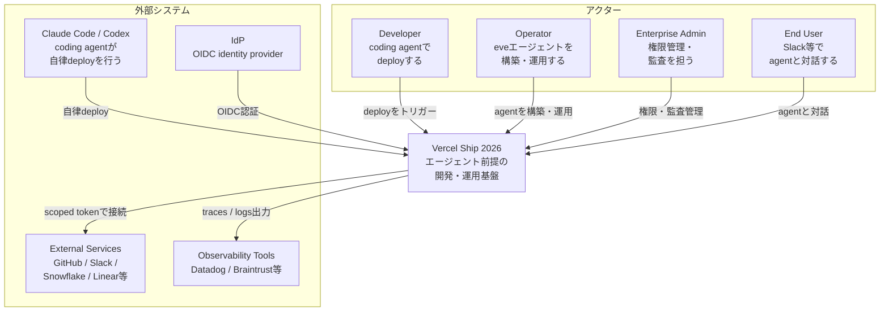

#### アクター

| 要素名 | 説明 |
|---|---|
| Developer | coding agent を通じて Vercel に deploy する開発者 |
| Operator | eve フレームワークを使い agent を構築・運用する担当者 |
| Enterprise Admin | EMU・Passport・BYOC を通じて権限と監査を管理する管理者 |
| End User | Slack / Discord 等のチャネルで agent と対話するユーザー |

#### 対象システム

| 要素名 | 説明 |
|---|---|
| Vercel Ship 2026 | エージェント前提の開発・運用基盤。Agent Stack / eve / Vercel Agent / Enterprise Layer で構成 |

#### 外部システム

| 要素名 | 説明 |
|---|---|
| Claude Code / Codex | Vercel に PR から deploy を自律実行する coding agent |
| External Services | GitHub / Slack / Snowflake / Salesforce / Notion / Linear |
| IdP | OIDC 準拠の identity provider（Vercel Passport 連携先） |
| Observability Tools | Datadog / Braintrust / Honeycomb 等のトレース分析基盤 |

### コンテナ図

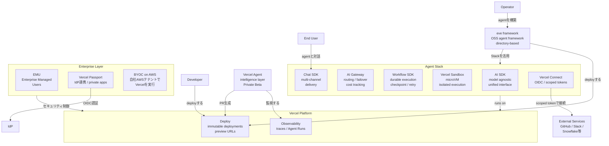

#### アクター・外部ノード

| 要素名 | 説明 |
|---|---|
| Operator | eve フレームワークを使い agent を構築・運用する担当者 |
| Developer | coding agent で deploy する開発者 |
| End User | agent と対話するユーザー |
| External Services | GitHub / Slack / Snowflake 等の外部 SaaS |
| IdP | OIDC 準拠の identity provider |

#### Agent Stack

| 要素名 | 説明 |
|---|---|
| AI SDK | model agnostic unified interface。任意の LLM を単一 API で呼び出す |
| AI Gateway | 単一エンドポイントで複数 provider をルーティング。failover / cost tracking / rate limit 管理 |
| Workflow SDK | 全 step をチェックポイント。失敗時は最後の成功 step から再開。state persistence を内包 |
| Vercel Sandbox | microVM isolation。agent が生成したコードを安全に実行する環境 |
| Chat SDK | Slack / Discord / GitHub 等への多チャネル配信を単一コードで実現 |
| Vercel Connect | OIDC identity 証明と scoped token による安全な外部サービス接続 |

#### Vercel Platform

| 要素名 | 説明 |
|---|---|
| Deploy | immutable deployments / preview URLs / instant rollback を提供 |
| Observability | traces / logs / Agent Runs タブで実行状況を可視化 |

#### eve framework

| 要素名 | 説明 |
|---|---|
| eve framework | OSS の agent framework。agent.ts + instructions.md + tools/ の directory 構造で1エージェントを定義 |

#### Enterprise Layer

| 要素名 | 説明 |
|---|---|
| EMU | Enterprise Managed Users による集中的なユーザー・権限管理（Private Beta） |
| Vercel Passport | IdP 連携により internal apps をデフォルトで private に保つ（Public Beta） |
| BYOC on AWS | 自社 AWS テナントで Vercel functions を実行する Bring Your Own Cloud（Private Beta） |

#### Vercel Agent

| 要素名 | 説明 |
|---|---|
| Vercel Agent | intelligence layer（Private Beta）。本番監視・異常検知・PR 生成を自律実行 |

### コンポーネント図

Agent Stack の内部コンポーネントを3層に分けて示します。

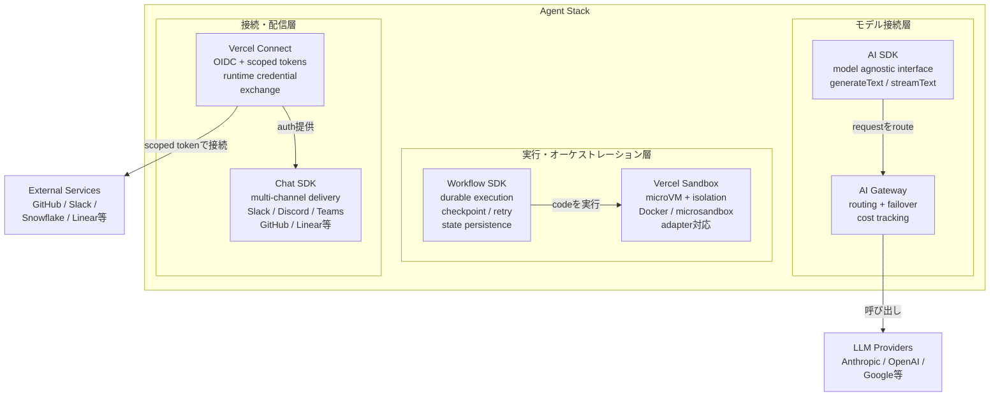

#### モデル接続層

| 要素名 | 説明 |
|---|---|
| AI SDK | model agnostic の統一 interface。generateText / streamText / tool calls / structured output を提供。provider 切り替えをコード変更なしで実現 |
| AI Gateway | 単一エンドポイントで数百の LLM provider をルーティング。自動 failover / cost tracking / usage monitoring。markup なしで提供者価格のまま利用可 |

#### 実行・オーケストレーション層

| 要素名 | 説明 |
|---|---|
| Workflow SDK | 全 step をチェックポイント保存。失敗時は最後の成功 step から再開。人の承認待ち・webhook 待ちの pause も compute 消費なしで実現。open-source |
| Vercel Sandbox | microVM isolation。agent 生成コードを別 security context で実行。filesystem と Docker を内包した完全な仮想 Linux 環境。credential はコード実行時のみ注入 |

#### 接続・配信層

| 要素名 | 説明 |
|---|---|
| Chat SDK | Slack / Discord / Teams / Telegram / GitHub / Linear 等への多チャネル配信を単一コードベースで実現。各プラットフォームの adapter / auth / message format を抽象化 |
| Vercel Connect | OIDC identity 証明により runtime credential exchange を実現。task ごとに scoped short-lived token を発行。long-lived token をアプリ内に保持しない。Slack / GitHub / Snowflake / Salesforce / Notion / Linear 対応（Public Beta） |

## データ

### 概念モデル

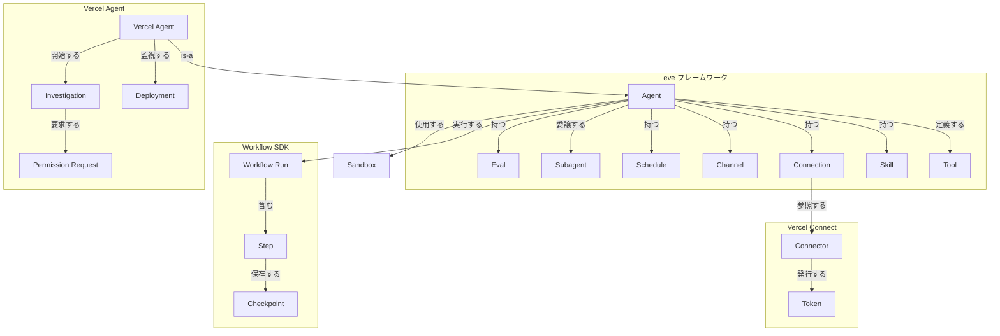

| 要素名 | 説明 |
|---|---|
| Agent | eve フレームワークで定義されるエージェント。ディレクトリ構造で全コンポーネントを表現する |
| Tool | TypeScript 関数で定義されるエージェントの能力単位。`defineTool` で入力スキーマと実行ロジックを宣言する |
| Skill | エージェントの専門知識を記述したマークダウンファイル。モデル呼び出し時に自動注入される |
| Connection | MCP server または OpenAPI endpoint への接続定義。モデルに URL や認証情報を公開しない |
| Channel | Slack / Discord / Teams / GitHub 等の配信チャネル。1エージェントが複数チャネルに同時対応できる |
| Schedule | cron 式で定義された定期実行スケジュール。Vercel Cron Job としてデプロイされる |
| Subagent | 親エージェントが作業を委譲する子エージェント。独立したコンテキストウィンドウとツールセットを持つ |
| Eval | テストケースと assertions で構成されるエージェント評価セット。CI に組み込み可能 |
| Workflow Run | Workflow SDK による耐久性のある実行単位。クラッシュ・デプロイをまたいで再開できる |
| Step | Workflow Run 内の個別処理単位。失敗時は単独でリトライされる |
| Checkpoint | Step の状態スナップショット。Run 再開時の復元ポイントとなる |
| Connector | Vercel Connect に登録するプロバイダー接続設定。プロジェクト・環境単位でアタッチする |
| Token | Connector から発行される短命の認証トークン。タスクスコープに絞られ、保管不要 |
| Sandbox | エージェント生成コードを実行する分離 microVM。ホストや他の Sandbox から隔離されている |
| Vercel Agent | Vercel 本番基盤に組み込まれた監視・自律調査エージェント。eve と Agent Stack 上に実装される |
| Deployment | Vercel Agent が継続監視するデプロイメント単位 |
| Investigation | 異常検知を起点とする自律調査プロセス。完了時に PR を生成する |
| Permission Request | plan mode でユーザーに一括提示する権限要求。必要なアクション計画とスコープを宣言する |

### 情報モデル

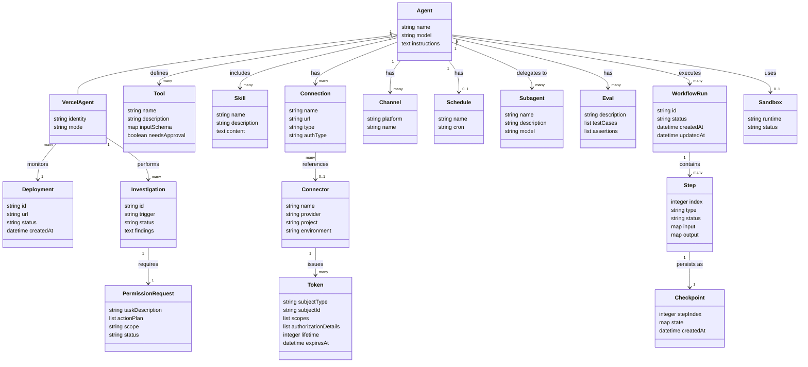

| エンティティ名 | 説明 |
|---|---|
| Agent | eve の中核エンティティ。`agent.ts`（model 設定）と `instructions.md`（システムプロンプト）で定義する |
| Tool | `defineTool` で宣言する TypeScript 関数。`inputSchema`（Zod）と `execute` で構成し、`needsApproval` で承認ゲートを設定できる |
| Skill | 知識注入用マークダウン。`description` frontmatter でモデルが自動ロードするタイミングを判断する |
| Connection | `defineMcpClientConnection` または OpenAPI document で定義する外部サービス接続。認証情報はモデルに非公開 |
| Channel | Slack / Discord / Teams / Telegram / GitHub / Linear 等のプラットフォームアダプター。`defineChannel` でカスタム実装も可能 |
| Schedule | cron 式と handler 関数を持つ定期実行定義。Vercel Cron Job にマッピングされる |
| Subagent | `subagents/` 配下の子エージェントディレクトリ。親から Tool と同様に呼び出せる |
| Eval | `defineEval` で記述するテストスイート。`t.send` / `t.calledTool` / `t.check` で assertions を定義する |
| Connector | Vercel Connect に登録するプロバイダー設定。dashboard または CLI（`vercel connect create`）で作成し、project・environment に紐付ける |
| Token | `getToken` で取得する短命クレデンシャル。`subjectType`（app / user）と `authorizationDetails` でスコープを最小化する |
| Sandbox | `Sandbox.create` で起動する分離 microVM。`runtime` 指定（例: python3.13）でコード実行環境を選択できる |
| WorkflowRun | Workflow SDK が管理する耐久実行セッション。各 Step を自動チェックポイントし、障害後も最後の成功 Step から再開する |
| Step | WorkflowRun 内の処理単位。失敗時は独立してリトライされ、完了済み Step は再実行されない |
| Checkpoint | Step 完了時に保存される状態スナップショット。Run 再開の復元ポイントとして機能する |
| PermissionRequest | Vercel Agent の plan mode が生成する権限要求。アクション計画とスコープをユーザーに一括提示して単一承認を得る |
| Deployment | Vercel Agent が継続的にトレース・可観測データを収集する対象デプロイメント |
| Investigation | アラート・異常を起点に Vercel Agent が自律的に実施する調査。完了すると修正 PR を生成する |
| VercelAgent | Agent を継承した Vercel プラットフォーム組み込みエージェント。`identity`（専用 ID）と `mode`（read-only / plan）を持つ |

## 構築方法

### eve エージェントの作成

eve は Vercel が開発したオープンソースのエージェントフレームワークです。エージェントを「1ディレクトリ」として表現し、設定・ツール・チャネルをファイルシステム上に配置するだけで動作します。

#### インストールとスキャフォールド

```bash
# 新規プロジェクトの作成（推奨）
npx eve@latest init my-agent

# 既存プロジェクトへの追加
npx eve@latest init .

# 手動インストール
npm install eve@latest ai zod
```

#### ディレクトリ構造

```
agent/
  agent.ts                   # モデル設定
  instructions.md            # システムプロンプト
  tools/
    run_sql.ts               # ツール定義
    post_chart.ts
  skills/
    revenue-definitions.md   # スキル（追加知識）
  subagents/
    investigator/            # サブエージェント
  channels/
    slack.ts                 # チャネル設定
  schedules/
    monday-summary.ts        # スケジュール実行
  connections/
    linear.ts                # 外部サービス接続
```

#### `agent.ts` での defineAgent 設定

```typescript
// agent/agent.ts
import { defineAgent } from "eve";

export default defineAgent({
  model: "anthropic/claude-opus-4.8",
  // AI Gateway を使用するとフォールバック設定も可能
});
```

#### `instructions.md` の作成

```markdown
You are a senior data analyst. You answer questions about the team's data.
- Prefer exact numbers to hand-waving. If you can compute it, compute it.
- State the assumptions behind any number you report (date range, filters, grain).
- Use the tools available to you rather than guessing.
```

#### ツールの定義

```typescript
// agent/tools/run_sql.ts
import { defineTool } from "eve/tools";
import { z } from "zod";

export default defineTool({
  description: "Run a read-only SQL query against the orders and customers tables.",
  inputSchema: z.object({
    sql: z.string().describe("A single read-only SELECT statement."),
  }),
  needsApproval: ({ toolInput }) => estimateScanGb(toolInput.sql) > 50,
  async execute({ sql }) {
    const { columns, rows } = await runReadOnlySql(sql);
    return { columns, rows: rows.slice(0, 500), truncated: rows.length > 500 };
  },
});
```

#### スキルの定義

```markdown
---
description: How this team defines revenue. Load before answering any revenue question.
---
Revenue is recognized net of refunds, over the subscription term.
Weeks are Monday-anchored, in UTC.
Exclude trial and internal accounts from every number.
```

#### ローカル起動

```bash
npx eve dev
```

### Vercel Connect の設定

Vercel Connect はエージェントが外部サービスにアクセスする際に短命・スコープ付きの認証情報を発行する仕組みです。長命なトークンを環境変数に保存する方式を置き換えます。

#### コネクタの作成

```bash
# CLI でコネクタを作成
vercel connect create slack --name mybot
vercel connect create github --name codereview-bot

# coding agent による設定
npx skills add vercel/vercel-plugin --skill vercel-connect
```

対応プロバイダー（Public Beta）: **Slack / GitHub / Snowflake / Salesforce / Notion / Linear**、その他 OAuth/API キー経由のサービス全般

#### SDK のインストール

```bash
npm install @vercel/connect
```

#### eve での Connect 設定

```typescript
// agent/connections/linear.ts
import { defineMcpClientConnection } from "eve/connections";
import { connect } from "@vercel/connect/eve";

export default defineMcpClientConnection({
  url: "https://mcp.linear.app/sse",
  description: "Linear workspace: issues, projects, cycles, and comments.",
  auth: connect("linear/mybot"),
});
```

### Vercel Sandbox の設定

Vercel Sandbox はエージェントが生成したコードを安全に実行するための分離された microVM 環境です。Firecracker ベースの microVM で、ホストや他のサンドボックスから完全に隔離されます。

#### SDK のインストール

```bash
npm install @vercel/sandbox
```

#### Sandbox.create() でのランタイム指定

```typescript
import { Sandbox } from '@vercel/sandbox';

// 利用可能なランタイム: node26 / node24 / node22 / python3.13（デフォルト: node24）
const sandbox = await Sandbox.create({ runtime: 'python3.13' });

await sandbox.writeFiles([
  { path: 'agent.py', content: Buffer.from(agentCode) },
]);
const result = await sandbox.runCommand('python', ['agent.py']);
console.log(await result.stdout());

await sandbox.stop();
```

ローカル開発時は eve が自動的に Docker または microsandbox に切り替えます。デプロイ時はコード変更なしで Vercel Sandbox に移行します。

### Workflow SDK の設定

Workflow SDK はエージェントの実行を durable（耐障害性あり）にするための SDK です。eve は Workflow SDK を内部で使用するため、追加設定なしで durable execution が有効です。すべてのセッションは自動的にチェックポイントされます。

```typescript
// agent 内での durable な処理例
export default defineTool({
  description: "Long-running analysis",
  inputSchema: z.object({ query: z.string() }),
  async execute({ query }) {
    // 失敗しても最後のチェックポイントから再開される
    const step1 = await fetchData(query);
    const step2 = await processData(step1);
    return step2;
  },
});
```

#### eval でのワークフロー検証

```typescript
// evals/revenue.eval.ts
import { defineEval } from "eve/evals";
import { includes } from "eve/evals/expect";

export default defineEval({
  description: "The analyst answers revenue questions by the team's rules.",
  async test(t) {
    await t.send("What was revenue last week?");
    t.completed();
    t.calledTool("run_sql");
    t.check(t.reply, includes("net of refunds"));
  },
});
```

```bash
# ローカルで eval 実行
eve eval

# デプロイ済み環境に対して実行
eve eval --target https://my-agent.vercel.app
```

### AI Gateway の設定

AI Gateway は Vercel が提供するトークンの CDN です。単一エンドポイントから数百のモデルにアクセスでき、プロバイダー障害時の自動フェイルオーバーを提供します。追加費用なし・プロバイダー直接価格で利用できます。

```typescript
import { generateText } from 'ai';

const { text } = await generateText({
  model: 'anthropic/claude-sonnet-4.6',
  prompt: 'Summarize the latest deploys.',
});
```

設定は Vercel ダッシュボード → **AI** → **AI Gateway** から行います。プロバイダーキー（BYOK）の登録と、フォールオーバー順序の設定が可能です。

## 利用方法

### エージェントの実行と対話

#### HTTP エンドポイントによる対話

eve エージェントは HTTP API を標準で公開します。

```bash
# セッションを開始してメッセージを送信
curl -X POST http://127.0.0.1:3000/eve/v1/session \
  -H 'content-type: application/json' \
  -d '{"message":"What was revenue last week?"}'

# 既存セッションにメッセージを追加（継続）
curl -X POST http://127.0.0.1:3000/eve/v1/session/{sessionId}/message \
  -H 'content-type: application/json' \
  -d '{"message":"Break it down by region."}'
```

#### Slack/Discord 等チャネルでの利用

```bash
eve channels add slack
eve channels add discord
```

#### スケジュール実行

```typescript
// agent/schedules/monday-summary.ts
import { defineSchedule } from "eve/schedules";
import slack from "../channels/slack.js";

export default defineSchedule({
  cron: "0 9 * * 1",
  async run({ receive, waitUntil, appAuth }) {
    waitUntil(
      receive(slack, {
        message: "Summarize last week's revenue and post it to the team channel.",
        target: { channelId: "C0123ABC" },
        auth: appAuth,
      }),
    );
  },
});
```

#### human-in-the-loop 承認フロー

ツールに `needsApproval` を設定すると、エージェントはその地点で一時停止し、人間の承認を待ちます。承認後、停止地点から再開します。Slack チャネル利用時は承認リクエストが Slack ボタンとしてレンダリングされます。

```typescript
export default defineTool({
  description: "Delete records from the database.",
  inputSchema: z.object({ table: z.string(), ids: z.array(z.string()) }),
  needsApproval: () => true,
  async execute({ table, ids }) {
    return await deleteRecords(table, ids);
  },
});
```

### Token 取得と権限設定

#### アプリ単位の Token 取得

```typescript
import { getToken } from '@vercel/connect';

const token = await getToken('slack/mybot', {
  subject: { type: 'app' },
});
```

#### subject types

| type | 用途 |
|---|---|
| `app` | アプリ全体として動作（共有ボットトークン相当） |
| `user` | 特定ユーザーの代理として動作（on-behalf-of） |

#### authorizationDetails によるスコープ限定（GitHub の例）

```typescript
const token = await getToken('github/mybot', {
  subject: { type: 'app' },
  authorizationDetails: [
    {
      type: 'github_app_installation',
      repositories: ['myorg/repo1'],
      permissions: ['contents:read'],
    },
  ],
});
```

#### ユーザー代理（on-behalf-of）

```typescript
const token = await getToken('linear/mybot', {
  subject: { type: 'user', id: 'user_123' },
});
```

### Vercel Agent の利用

Vercel Agent（Enterprise、Private Beta）は eve と Agent Stack を基盤に構築された Vercel 自身のインテリジェンス層です。本番デプロイの監視・異常調査・PR の自動生成を行います。

#### PR 自動生成フロー

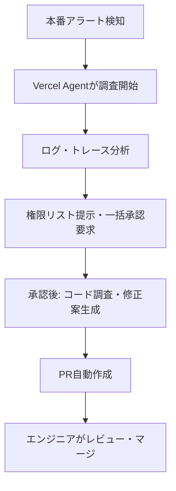

#### plan mode の一括権限要求例

```
[Vercel Agent]
タスク: 本番デプロイのエラー調査と PR の作成

必要な権限:
  - logs:read        本番ログの読み取り
  - deployments:read デプロイ情報の取得
  - github:pr:write  PR の作成（該当リポジトリのみ）

承認しますか？ [Yes / No]
```

### Vercel Services の構成

Vercel Services（2026年7月1日 GA 予定）はマイクロサービスを Vercel 上でファーストクラス市民として扱う機能です。

- フロントエンドとバックエンドを同一プロジェクト内に共存させ、一括デプロイできます
- サービス間は Vercel の内部ネットワーク経由で通信します（パブリックインターネット不使用）
- バックエンドのみの変更でもアプリ全体がプレビュー環境でビルドされます

```bash
# PR プッシュ時に全サービスを含む preview URL が自動生成
git push origin feature/new-api
# → https://my-app-git-feature-new-api.vercel.app （全サービス込み）
```

## 運用

### Vercel Agent による本番監視

Vercel Agent（Private Beta）は eve と Agent Stack 上に構築された、本番デプロイメントの自律監視エージェントです。アラート・異常に対して自律的に調査し、修正 PR を提案します。

#### 監視フロー

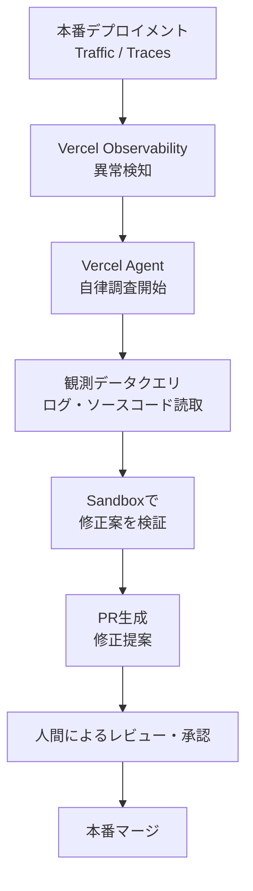

#### permissions model

| フェーズ | 動作 |
|---|---|
| デフォルト状態 | Read-only（読み取り専用）で動作 |
| タスク開始前 | 必要な全権限をまとめて提示し、1回の承認を要求 |
| 本番操作前 | narrow temporary permission（必要最小限の一時権限）のみ要求 |
| 権限の有効期間 | タスク完了後に自動失効 |

#### d0・Vertex の実績数値

| エージェント | 指標 | 値 |
|---|---|---|
| d0（データ分析） | 月次質問数 | 30,000 件以上 |
| d0 | エージェントからの質問割合 | **45%** |
| Vertex（サポート） | チケット自動解決率 | **91〜92%** |
| Vertex | 削減効果 | **5,000 engineer-hours/月** |

d0 は全クエリを実行ユーザーの権限スコープ内に制限しており、自分がアクセスできないテーブルを d0 経由で参照することはできない設計になっています。

### eve のトレースと評価

#### OpenTelemetry スパン構造

```
ai.eve.turn                         # 1ターンに1スパン
├── ai.streamText                   # モデル呼び出し
│   └── ai.streamText.doStream      # ストリーミング実行
└── ai.toolCall                     # ツール呼び出し（input/output つき）
    ├── run_sql                     # SQL クエリ（入力 SQL・結果行数）
    └── bash                        # シェルコマンド（コマンド・出力）
```

スパンには入力・出力・実行時間が記録されるため、エージェントが「何を・なぜ・どの順番で」実行したかをトレースとして再現できます。

#### Vercel Observability の Agent Runs タブ

本番デプロイ済みの eve エージェントは Vercel Dashboard → Observability → **Agent Runs** タブから監視できます。

- 全セッションの一覧表示（開始時刻・ステータス・ターン数）
- 任意のセッションをドリルダウン → ターン別トレース展開
- toolCall の input/output を展開確認
- sandbox でのコマンド実行ログの閲覧

#### 外部 Observability ツール連携

```typescript
import { defineAgent } from "eve";
export default defineAgent({
  model: "anthropic/claude-opus-4.8",
  telemetry: {
    exporter: process.env.OTEL_EXPORTER_OTLP_ENDPOINT,
  },
});
```

| ツール | 用途 |
|---|---|
| Braintrust | LLM トレース・eval 評価管理 |
| Raindrop | AI 品質モニタリング |
| Arize | モデル評価・ドリフト検知 |
| Honeycomb | 分散トレーシング |
| Datadog | APM 統合モニタリング |
| Jaeger | オープンソーストレーシング |

### Vercel Connect の運用

#### コネクタのライフサイクル管理

```bash
# コネクタの作成
vercel connect create slack --name mybot

# プロジェクトへのアタッチ
vercel connect attach slack/mybot --project my-agent

# コネクタ一覧の確認
vercel connect list

# トークンの revoke（自分のトークン）
vercel connect revoke-tokens slack/mybot --my-tokens

# 全ユーザー・全インストールのトークンを revoke
vercel connect revoke-tokens slack/mybot --all-tokens
```

> **注意**: プロバイダーが token revocation API をサポートしない場合、Vercel Connect は新規トークン発行を停止しますが、既発行トークンはプロバイダー側での自然失効を待つ必要があります。

#### 環境別コネクタ分離

development / preview / production で独立したコネクタを使い分けることで、認証情報の横断汚染を防ぎます。

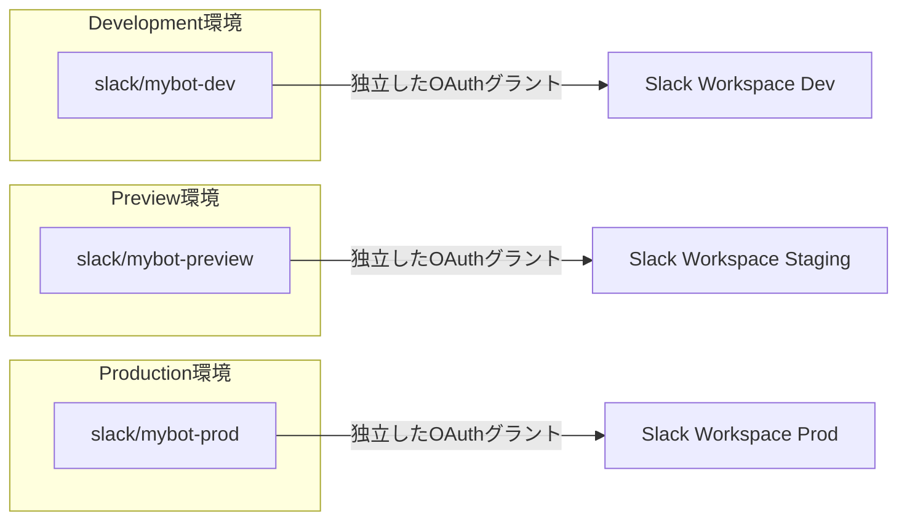

#### Trigger forwarding（Slack / GitHub / Linear webhook の検証・転送）

Vercel Connect が Slack/GitHub/Linear からの webhook を受信・検証し、アプリに転送します。Slack の署名シークレットはアプリ側ではなく Vercel Connect 側で保持されます。

```
Slack → Vercel Connect（署名検証） → アプリ（OIDC 再検証）→ scoped token 取得 → エージェント実行
```

### エンタープライズガバナンス

#### Enterprise Managed Users（EMU）

EMU（Private Beta）は SAML SSO + Directory Sync で Vercel/v0 の全ユーザーを IDP から一元管理する機能です。

| 機能 | 詳細 |
|---|---|
| 自動プロビジョニング | IDP のディレクトリ変更に連動して即時付与 |
| 自動デプロビジョニング | 退職・チーム異動時に IDP から自動失効 |
| グループベースアクセス制御 | Vercel 組織全体に適用 |
| 監査ログ | user → agent → service のトレーシング |
| 対応 IDP | Okta / Microsoft Entra / 任意の SAML or OIDC プロバイダー |

#### Vercel Passport（IdP 背後でのアプリ保護）

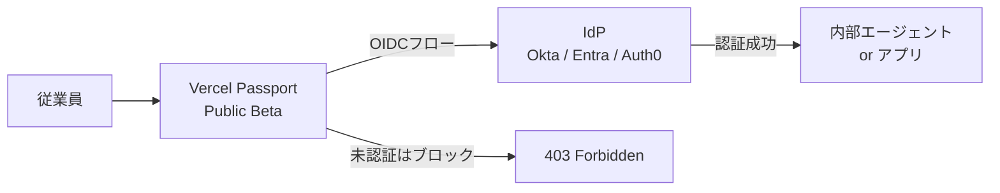

IdP 接続を一度設定すれば全デプロイメントに自動適用され、設定漏れゼロで認証保護が有効になります。

#### BYOC on AWS（Private Beta）

| 項目 | 詳細 |
|---|---|
| コンピュート | 自社 AWS アカウント・VPC 内で実行 |
| コントロールプレーン | Vercel が管理 |
| ネットワーク | プライベートバックエンドへの VPC ルーティング維持 |
| 開発者体験 | Vercel と同等（変更なし） |

## ベストプラクティス

### エージェントのセキュリティ設計

#### 長命トークンの排除（Vercel Connect による短命トークン）

| 観点 | 従来（long-lived token） | Vercel Connect（short-lived） |
|---|---|---|
| トークンの保管場所 | 環境変数（アプリ内） | Vercel Connect 側（アプリ非保持） |
| 有効期間 | 無期限（手動ローテーション） | タスク完了後に自動失効 |
| スコープ | エージェントが必要とする全権限 | 1タスク分の最小権限 |
| 漏洩時の影響範囲 | 全接続先・全ユーザーに影響 | 単一タスク分のみ |
| ローテーション | 手動（全環境更新必要） | 自動（アプリ変更不要） |

#### blast radius の最小化

各アクションを「逆戻り可能か」「影響範囲はどこまでか」で評価し、それに応じてサンドボックスで隔離します（Anthropic Ship 2026 パネル推奨）。

```typescript
export default defineTool({
  description: "GitHub に Issue を作成する",
  inputSchema: z.object({ title: z.string(), body: z.string(), repo: z.string() }),
  needsApproval: () => true,
  async execute({ title, body, repo }) {
    const token = await getToken('github/mybot', {
      subject: { type: 'app' },
      authorizationDetails: [{
        type: 'github_app_installation',
        repositories: [repo],
        permissions: ['issues:write'],
      }],
    });
  },
});
```

#### 自律性と安全性のトレードオフ（Cursor CTO の知見）

Ship 2026 パネルでの Cursor CTO（Arthur Viegers）の発言:

> 「自律性はリスクに連動させるべき。エージェントがリスクを評価できるほど、自律的に動かせる。Shopify と Amplitude はすでに低リスク PR の 60〜70% を開発者の工数ゼロで自動レビュー・マージしているが、認証コードの2行変更は依然として人間に渡す。」

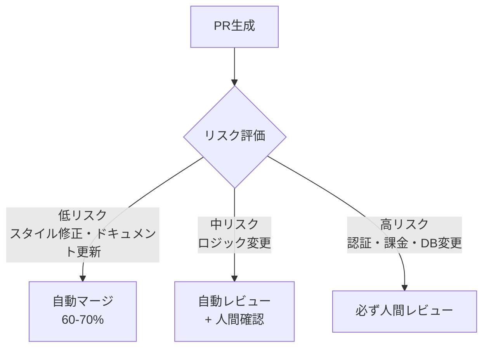

### エージェント ID 設計

Auth0（Ship 2026 登壇）が示した4つの identity パターンです。

| パターン | 用途 | 実装 |
|---|---|---|
| **Token vault** | 長命シークレットをアプリ外に隔離 | Vercel Connect（`getToken`） |
| **CIBA approvals** | エージェントが非同期に人間承認を要求 | `needsApproval` フィールド |
| **On-behalf-of delegation** | ユーザーの権限でエージェントが操作 | `subject: { type: 'user', id }` |
| **First-class principal** | エージェント自体の独立 ID | `subject: { type: 'app' }` |

全アクションを human decision にトレースバックできる設計例:

```
[Human: Alice が "先週の売上を分析して" と Slack に投稿]
  ↓ session_id: sess_abc123
  [Agent: data-analyst / turn 1]
    ↓ tool_call_id: tc_xyz789
    [Tool: run_sql / input: "SELECT ..." ]
      ↓ connector: snowflake/prod
      [Token: tmp_snow_123 / subject: user/alice]
```

### モデルルーティング設計

#### AI Gateway によるフォールオーバー

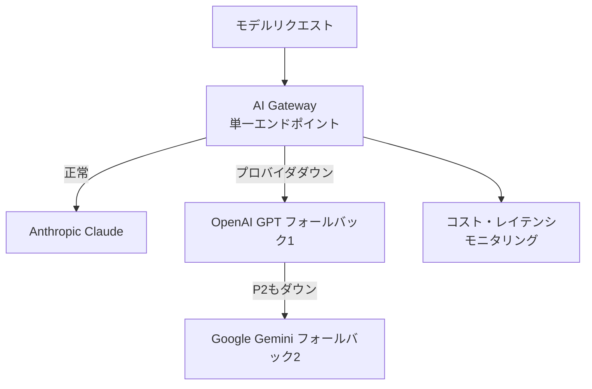

#### タスク別モデルルーティング（SERHANT. 事例）

SERHANT. は3つのモデルを単一キーから使い分けています。

```typescript
export default defineAgent({
  model: "anthropic/claude-opus-4.8",
  modelFallbacks: [
    "openai/gpt-5.4",
    "google/gemini-3.1-pro",
  ],
});
```

| タスク | モデル | 理由 |
|---|---|---|
| market analysis | Claude | 複雑な推論が必要 |
| marketing copy | GPT | 文章生成に最適 |
| image generation | Gemini | 画像生成に対応 |

### 段階的な自律化（Currys/Elkjøp 事例）

北欧電器小売チェーン Currys/Elkjøp が Ship 2026 でデモした、EC サイトのエージェント基盤移行の3フェーズです。

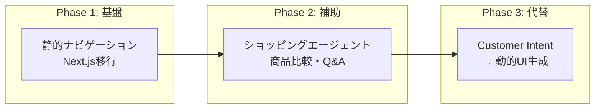

| フェーズ | 目標 | 成果 |
|---|---|---|
| Phase 1 | パフォーマンス基盤の確立 | TTFB 40% 削減 |
| Phase 2 | エージェントによる補助 | 商品比較・Q&A 自動化 |
| Phase 3 | Customer intent が navigation を代替 | 動的 UI 生成 |

段階的移行の鍵は3点です。可逆性の維持（各フェーズで前フェーズに戻れる設計）、観測可能性の先行整備、部分最適ではなく全体最適。

## トラブルシューティング

### T-1: Workflow SDK のリカバリ

```
問題: エージェントが長時間タスクの途中でクラッシュした

診断:
  1. Vercel Dashboard → Observability → Agent Runs でセッション確認
  2. 最後のチェックポイントを確認（どの turn まで完了しているか）

対処:
  - continuationToken を使って同セッションに再接続
  - restart from zero は避けること（既完了ステップの再実行コスト・副作用が発生する）
```

```typescript
const resumeResponse = await fetch('/eve/v1/session/sess_abc123/message', {
  method: 'POST',
  body: JSON.stringify({
    continuationToken: 'ct_xyz',
    message: '続きから再開してください',
  }),
});
```

### T-2: Vercel Connect のエラー

#### OIDC アイデンティティ検証失敗

```
エラー: OIDC identity verification failed: deployment identity not recognized

原因:
  - ローカル開発で vercel link / vercel env pull が未実行
  - プロジェクトとコネクタが紐付いていない

対処:
  vercel link
  vercel env pull
  vercel connect list --project my-agent
```

#### コネクター環境のスコープ外からのアクセスエラー

```
エラー: Access denied: connector 'slack/mybot-prod' is not attached to
  project 'my-agent' in environment 'development'

対処:
  vercel connect attach slack/mybot-dev --project my-agent --env development
  vercel connect attach slack/mybot-prod --project my-agent --env production
```

### T-3: eve エージェントのデバッグ

```bash
# ローカル: eve dev の TUI 上に toolCall 一覧が表示される
eve dev

# 本番: Observability → Agent Runs → 対象セッション → ターン展開
# → ai.toolCall スパンの input/output を確認
```

#### チャネル接続エラーの診断

```bash
# 1. コネクタ状態確認
vercel connect inspect slack/mybot

# 2. channels/slack.ts でコネクタ名が正しいか確認
#    import { connectSlackCredentials } from "@vercel/connect/eve"

# 3. Trigger forwarding が有効か確認
vercel connect list   # "trigger_forwarding: enabled" を確認
```

### T-4: AI Gateway の failover

```typescript
// フォールバック設定
export default defineAgent({
  model: "anthropic/claude-opus-4.8",
  modelFallbacks: [
    "openai/gpt-5.4",
    "google/gemini-3.1-pro",
  ],
});
```

```bash
# コスト・使用量のレポート確認
# Vercel Dashboard → AI Gateway → Cost & Usage

# リクエストログ
vercel logs --project my-agent | grep "ai-gateway"
```

## まとめ

Vercel Ship 2026 は、「デプロイ先」から「エージェント基盤」への転換点を示した発表です。週次デプロイの30%超がコーディングエージェント発という現実が、プラットフォーム設計の前提を変えました。

設計上の変化は3点です。

1. **実行モデルの変化**: HTTP リクエスト単位の短命処理から、Workflow SDK によるチェックポイント付き長命実行へ移行しました。エージェントがデプロイをまたいで再開できる設計が標準になります。
2. **セキュリティ設計の変化**: 環境変数に長命トークンを保持する従来方式から、OIDC アイデンティティ + タスクスコープの短命トークン（Vercel Connect）へ移行しました。漏洩時の影響範囲を「単一タスク分」に限定する設計は、エージェント時代の最小権限原則として参考になります。
3. **可観測性の変化**: アプリケーションログから、turn・tool_call・Sandbox コマンドまでトレースできる Agent Runs タブへ移行しました。「エージェントが何をしたか」を再現できる設計が運用の前提になります。

Vercel Connect・Vercel Sandbox・Vercel Passport などエンタープライズ向けコンポーネントの多くは 2026年6月時点で Private/Public Beta のため、本番採用前に GA 状況を確認してください。

この記事が少しでも参考になった、あるいは改善点などがあれば、ぜひリアクションやコメント、SNS でのシェアをいただけると励みになります！

## 参考リンク

- 概要・発表
  - [Vercel Ship 2026 Recap](https://vercel.com/blog/vercel-ship-2026-recap)
  - [Agentic Infrastructure](https://vercel.com/blog/agentic-infrastructure)
  - [Vercel for Enterprise Apps and Agents](https://vercel.com/blog/vercel-for-enterprise-apps-and-agents)
- Agent Stack
  - [The Agent Stack](https://vercel.com/blog/agent-stack)
  - [AI SDK](https://ai-sdk.dev/)
  - [AI Gateway](https://vercel.com/ai-gateway)
  - [Workflow SDK](https://workflow-sdk.dev/)
  - [Vercel Sandbox](https://vercel.com/sandbox)
  - [Chat SDK](https://chat-sdk.dev/)
- Vercel Connect
  - [Introducing Vercel Connect](https://vercel.com/blog/introducing-vercel-connect)
  - [Vercel Connect ドキュメント](https://vercel.com/kb/vercel-connect)
  - [@vercel/connect npm](https://www.npmjs.com/package/@vercel/connect)
- eve フレームワーク
  - [Introducing eve](https://vercel.com/blog/introducing-eve)
  - [eve ドキュメント](https://eve.dev/docs/introduction)
  - [eve GitHub](https://github.com/vercel/eve)
- エンタープライズ
  - [Vercel Passport Changelog](https://vercel.com/changelog/vercel-passport-is-now-in-public-beta)
