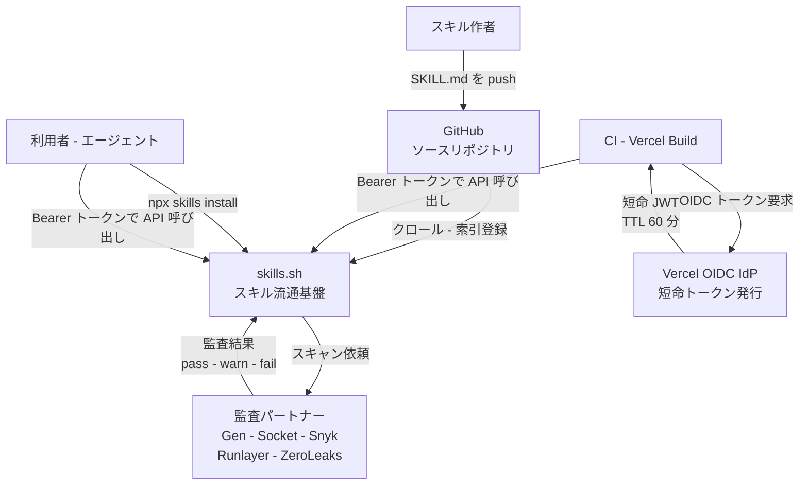
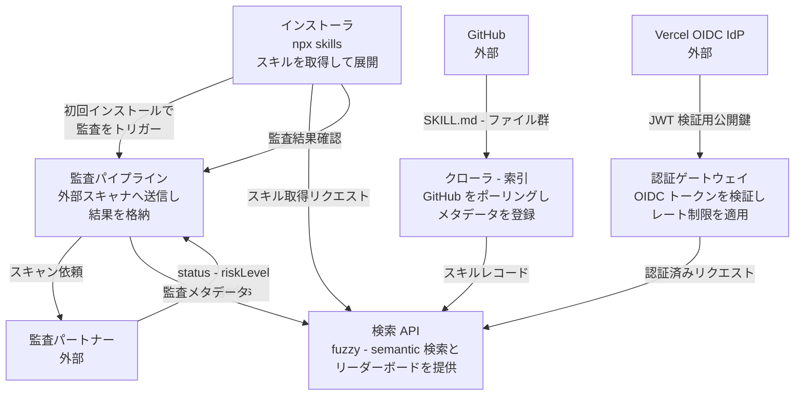
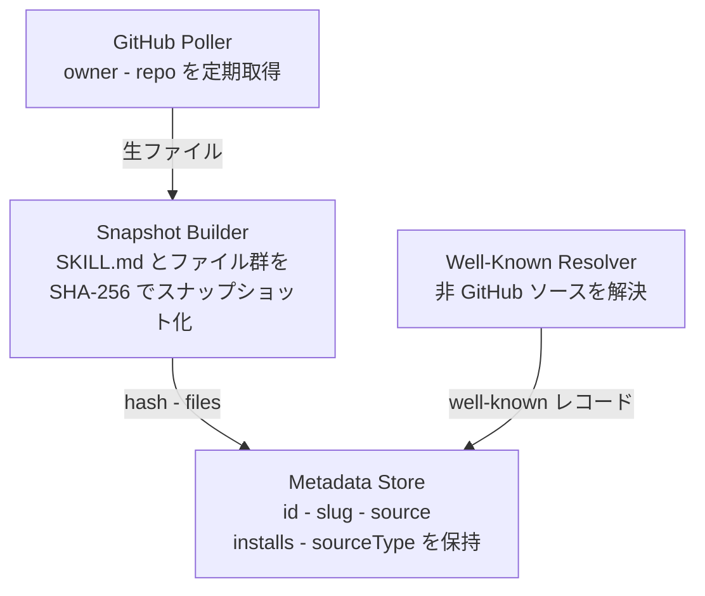
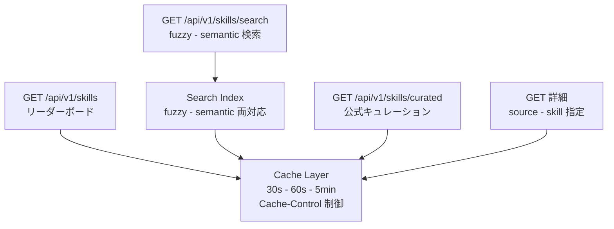
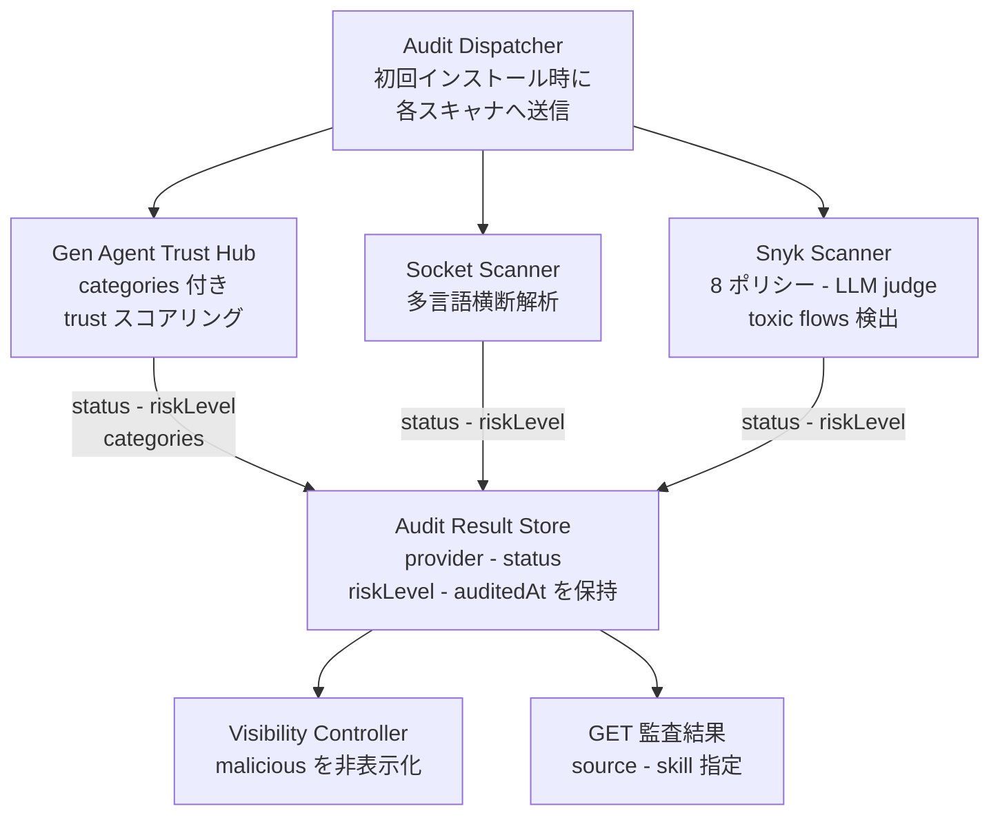
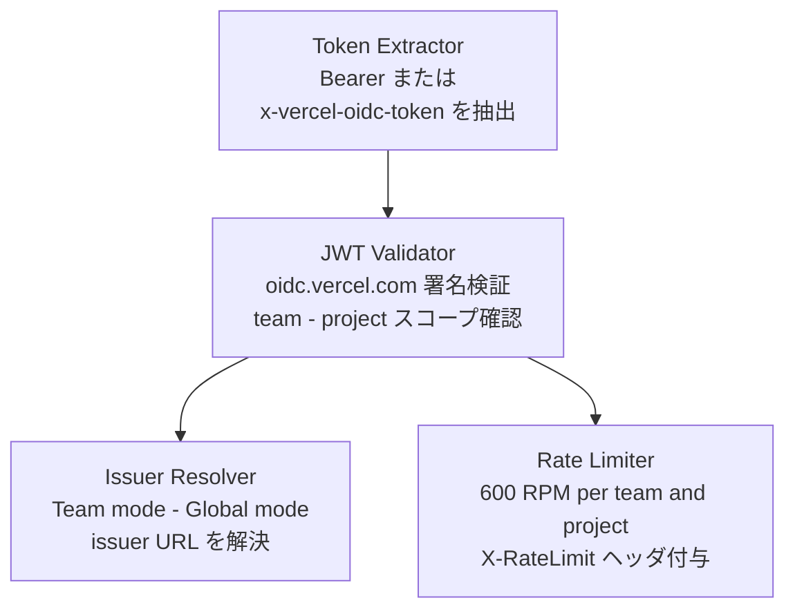
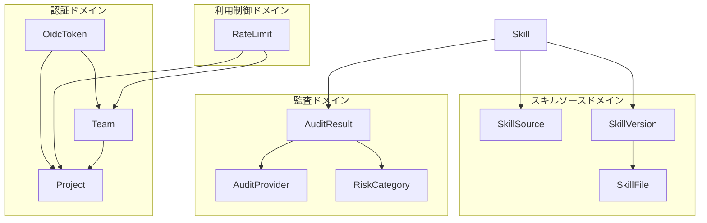
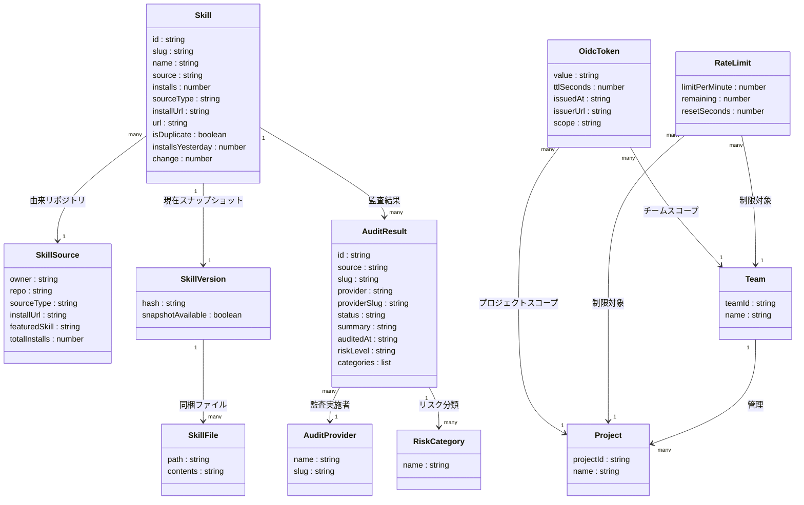
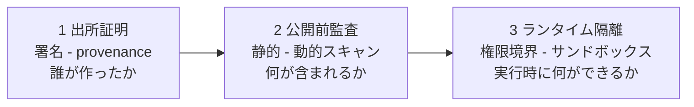

> 検証日: 2026-06-07 / 対象: Vercel skills.sh API (API 公開 2026-06-05)

## 概要

skills.sh は、Agent Skills の索引・検索・監査・インストールを一体化したスキル流通基盤です。GitHub 上に散在する `SKILL.md` ファイルをクロールして索引化し、検索 API・監査 API・CLI インストーラ (`npx skills`) を通じてエージェントへ届けます。2026-06-05 付の Vercel Changelog で API が公開されるまで、スキルの流通は「GitHub リポジトリを手で探してコピーする」方式に留まっていました。

| 項目 | 内容 |
|---|---|
| 運営主体 | Vercel / Vercel Labs (名前空間 `vercel-labs/*`) |
| エコシステム公開 | 2026-01-20 (Changelog "Introducing skills, the open agent skills ecosystem") |
| API 公開 | 2026-06-05 (Changelog "The skills.sh API is now available") |
| 索引規模 | 約 688,875 スキル (2026-06-07 時点の実測値) |
| 監査対象 | 約 60,000 スキル (登録総数の約 8.7%) |

skills.sh API は、スキルを「信頼・監査・認証が必要な部品」として扱う初期の実用 API です。これまで npm・Docker Hub・MCP Registry に相当する流通インフラが Agent Skills には乏しく、エージェントがプログラムでスキルを検索・評価・取得する公開 API はほとんどありませんでした。skills.sh API はそのパスを公開 API として整備しました。

> 数値の取り違え注意: API changelog の「more than 600,000」は**登録総数**、セキュリティ監査 changelog の「over 60,000」は**監査済み数**で、別の数字です。元ニュースの「60万以上をAPI検索」は登録総数を指します。

### 本ドキュメントの主眼

API の機能紹介に留めず、「スキルを流通させるとき何を信頼し、何を監査し、どう権限を切るか」という設計問題を、skills.sh API という具体例を土台に整理します。結論を先に置くと、skills.sh API は重要な一歩ですが、その**監査は初回インストール時にトリガーされる静的スキャンに留まり (署名/provenance/ランタイム隔離なし)、`pass` は安全を意味しません**。社内スキルカタログを作るなら、skills.sh の API モデルを参考にしつつ、出所証明・公開前監査・ランタイム隔離の 3 層で補強し、「巨大レジストリ全文検索」より curated + version pinning を優先すべきです。

## 特徴

- **集権的ストレージを持たないディレクトリ型**: スキルの実体は GitHub 上の Git リポジトリに置かれたままで、skills.sh はメタデータ索引のみを管理します。npm のようにアーティファクトを保管しません。
- **Fuzzy / Semantic 二段階検索**: 単一語はファジーマッチ、複数語はセマンティック検索に自動で切り替え、意図に近いスキルを発見しやすくします。
- **複数社連携によるセキュリティ監査**: skills.sh API docs では Gen Agent Trust Hub・Socket・Snyk・Runlayer・ZeroLeaks の 5 社が監査パートナーとして挙がります (監査機能を告知した Vercel Changelog 本文では Gen・Socket・Snyk の 3 社のみ言及)。監査はスキルが**初回インストールされた時点で自動的にトリガー**され (publish 時ではない。未インストールのスキルは監査エンドポイントが 404 を返す)、`status` (pass/warn/fail) と `riskLevel` (NONE-CRITICAL) を API から参照できます。悪性と判定されたスキルはリーダーボードと検索結果から自動非表示になります。
- **Vercel OIDC 短命 JWT 認証**: 長期 API キーの代わりに team+project スコープの短命 JWT (TTL 60 分) を使用します。漏洩時の有効窓を最小化し、自動ローテーションで管理コストを下げます。
- **監査カバー率は約 8.7%**: 登録約 688,875 件のうち監査済みは約 60,000 件に留まります。`pass` は安全の保証ではなく、Trail of Bits はスキャナへのバイパスを実証しています。
- **install 数によるリーダーボード**: 人気スキルの発見性を高める一方、hype-driven な増加 (約 20 日で 18.5 倍) と重複約 46.3% [二次情報: HuggingFace 40,000+ スキル調査] という質のばらつきも伴います。
- **公式キュレーション (`/curated`)**: owner 単位でグループ化した少数の厳選スキルを、検索結果とは独立して参照できます。
- **Vercel 前提のロックイン**: OIDC 短命 JWT は Vercel ビルド/Functions 環境でしか自動発行されません。非 Vercel 環境では長期 access token へのフォールバックが必要です。
- **Beta / 実験プロジェクト扱い**: skills.sh は Vercel Labs のプロジェクトで SLA 対象外、料金体系は現時点で未開示です。

### 関連技術との関係

Anthropic は 2025-10-16 に Agent Skills を発表しました。SKILL.md は YAML frontmatter + 命令本文 + 同梱リソースの 3 層構造を持ち、**Progressive Disclosure** (段階的ロード) で汎用エージェントを専門エージェントへ変えます。skills.sh はこの SKILL.md を発見・配布しやすくする流通インフラであり、仕様の定義は Anthropic 側にあります。

| 比較軸 | Agent Skills / skills.sh | MCP Registry |
|---|---|---|
| 対象 | SKILL.md (振る舞い・手順・実行ロジック) | MCP サーバ (外部ツール/DB/API への接続) |
| 役割 | 「何をどうやるか」の playbook 層 | 「外部世界に繋ぐ」システム統合層 |
| 配布形式 | Git リポジトリ (SKILL.md ファイル) | MCP サーバのメタデータ登録 |
| 競合関係 | 競合ではなく相互補完 | — |

### 類似レジストリとの比較

| レジストリ | 主体 | 索引対象 | 規模 (概数・取得日) | 監査 | 認証 | 配布方式 |
|---|---|---|---|---|---|---|
| **skills.sh** | Vercel Labs | GitHub クロール SKILL.md | 約 688,875 (2026-06-07 一次) | あり (5 社, 約 60,000 件) | Vercel OIDC 短命 JWT | Git リポジトリ経由 |
| **SkillsMP** | コミュニティ | GitHub クロール SKILL.md | 80 万超 [二次情報: agensi.io] | なし (最小フィルタのみ) | なし | Git リポジトリ経由 |
| **Agensi** | Agensi | 投稿 (審査あり) | 200+ [二次情報: agensi.io] | あり (提出毎スキャン) | 独自 | 不明 |
| **anthropics/skills** | Anthropic | 公式厳選 | 約 147,245★ の単一 repo (2026-06-07 一次) | なし (公式管理で代替) | GitHub 経由 | Git クローン |
| **MCP Registry** | Anthropic/MCP | MCP サーバメタデータ | 非公開 | なし | なし | MCP サーバ接続情報 |

> 規模は登録スキル数。行頭「約」+ 取得日付き=一次実測、[二次情報] 明記=二次ソース。

## 構造

C4 model の 3 段階で、skills.sh の内部アーキテクチャを図解します。

### システムコンテキスト図



| 要素名 | 説明 |
|---|---|
| スキル作者 | GitHub 上に SKILL.md を含むリポジトリを公開する開発者 |
| 利用者 - エージェント | Claude Code 等のエージェントプラットフォームからスキルを検索・インストールして使う主体 |
| CI - Vercel Build | Vercel ビルド環境で動く自動化パイプライン。OIDC トークンを受け取り skills.sh API を呼ぶ |
| skills.sh | Vercel Labs が運営するスキル流通基盤。約 68.9 万件を索引化し、検索・監査・認証ゲートを提供する |
| GitHub ソースリポジトリ | スキルの正本を保管する外部 VCS。skills.sh はここをクロールして索引を作る |
| 監査パートナー | 初回インストール時にスキルを静的解析する外部セキュリティベンダー群 |
| Vercel OIDC IdP | Vercel が運営する OIDC Identity Provider。team/project スコープの短命 JWT を発行する |

### コンテナ図



| 要素名 | 説明 |
|---|---|
| クローラ - 索引 | GitHub の owner/repo を定期クロールし、SKILL.md とファイル群をスキルレコードとして登録する。SHA-256 ハッシュによるスナップショット管理も担う |
| 検索 API | リーダーボード一覧・fuzzy/semantic 検索・キュレーション一覧・スキル詳細を提供する読み取り専用 API |
| 監査パイプライン | 初回インストール時に外部スキャナへスキルソースを送信し、status と riskLevel を受け取って格納する。malicious 判定スキルの非表示制御も担う |
| 認証ゲートウェイ | `Authorization: Bearer` または `x-vercel-oidc-token` の OIDC JWT を検証し、team/project スコープを確認する。team/project あたり 600 RPM のレート制限を適用する |
| インストーラ npx skills | スキルを取得し、インストール前に監査結果とリスクレベルを表示して展開する OSS CLI |

### コンポーネント図

#### クローラ - 索引のコンポーネント



| 要素名 | 説明 |
|---|---|
| GitHub Poller | GitHub API を介して登録対象 owner/repo の変更を検出し、ファイルを取得する |
| Snapshot Builder | 取得したファイル群を SHA-256 でハッシュ化し、スキルのスナップショットを構築する |
| Metadata Store | id・slug・source・installs・sourceType・installUrl 等のスキルメタデータを永続化する |
| Well-Known Resolver | `mintlify.com` のような GitHub 以外の well-known ソースタイプのスキルを解決する |

#### 検索 API のコンポーネント



| 要素名 | 説明 |
|---|---|
| GET /api/v1/skills | all-time / trending / hot の 3 ビューでページネーション付きスキル一覧を返す |
| GET /api/v1/skills/search | 単一語は fuzzy、複数語は semantic 検索を行い最大 200 件を返す |
| GET /api/v1/skills/curated | first-party スキルを owner ごとにグルーピングして返す |
| GET 詳細 (source - skill 指定) | SHA-256 ハッシュとファイル内容を含むスキル詳細を返す |
| Search Index | fuzzy と semantic の 2 方式に対応した全文検索インデックス |
| Cache Layer | エンドポイント種別ごとに 30 秒から 5 分の Cache-Control を付与する |

#### 監査パイプラインのコンポーネント



| 要素名 | 説明 |
|---|---|
| Audit Dispatcher | スキルが初回インストールされた時点で登録済みスキャナへスキルソースを送信する (数分の遅延あり)。図では Vercel Changelog で明示された Gen・Socket・Snyk の 3 社を示す (API docs は計 5 社を列挙) |
| Gen Agent Trust Hub | エージェント信頼スコアリングを行うスキャナ。`categories` フィールドを含む詳細結果を返す |
| Socket Scanner | Python/JS/TS/shell/markdown/設定ファイルを横断解析するエンジン (precision 94.5% / recall 98.7% を自社公表 [出典: Socket]) |
| Snyk Scanner | 実行コードと自然言語指示を 8 つのポリシーと複数の LLM judge で評価し toxic flows を検出する |
| Audit Result Store | 各スキャナから返る provider/status/riskLevel/auditedAt を永続化する |
| Visibility Controller | malicious 判定スキルをリーダーボードと検索結果から自動非表示にする |
| GET 監査結果 (source - skill 指定) | スキルの監査結果を provider 単位の配列で返す。未監査の場合は 404 |

#### 認証ゲートウェイのコンポーネント



| 要素名 | 説明 |
|---|---|
| Token Extractor | `Authorization: Bearer` ヘッダまたは `x-vercel-oidc-token` ヘッダからトークンを抽出する |
| JWT Validator | `oidc.vercel.com` が発行した JWT の署名を検証し、team/project スコープを確認する |
| Issuer Resolver | Team モード (`https://oidc.vercel.com/<team-slug>`) と Global モード (`https://oidc.vercel.com`) の issuer URL を切り替える |
| Rate Limiter | team/project あたり 600 RPM を計測し、超過時は 429 と `Retry-After` を返す。残量は `X-RateLimit-*` ヘッダで通知する |

## データ

### 概念モデル

エンティティ間の所有関係を subgraph で、利用関係を矢印で示します。



### 情報モデル

API レスポンスの実フィールドを基に主要属性を整理します。推測属性には `(推測)` を注記します。



### エンティティ補足

| エンティティ | 補足 |
|---|---|
| Skill | skills.sh ディレクトリに索引された Agent Skill の基本レコード。`id` は `{source}/{slug}` 形式の安定識別子。`sourceType` は `github` または `well-known`。`installsYesterday` / `change` は `view=hot` のときのみ返る |
| SkillSource | Skill の元となる GitHub リポジトリ (または well-known エンドポイント)。curated では owner 単位でグルーピングされ `totalInstalls` / `featuredSkill` が付与される |
| SkillVersion | 詳細レスポンスの版情報。`hash` は SHA-256 スナップショットハッシュ (未取得時 null)。`snapshotAvailable` は論理フラグ (推測) |
| SkillFile | SkillVersion が保持するファイル。`path` は相対パス、`contents` は文字列 (未取得時 null) |
| AuditResult | 監査結果配列の各要素。`status` は pass/warn/fail、`riskLevel` は NONE/LOW/MEDIUM/HIGH/CRITICAL。`categories` は Gen Agent Trust Hub のみ。未監査は 404 |
| AuditProvider | 監査実施者。Gen Agent Trust Hub / Socket / Snyk / Runlayer / ZeroLeaks の 5 社 |
| RiskCategory | Gen が付与するリスク分類。skillaudit.sh の公開チェックには Data Exfiltration / Prompt Injection / Hidden HTML Comment / Privilege Escalation / Obfuscated Content / Hallucinated Package / Dynamic External Reference 等が挙がる |
| OidcToken | Vercel OIDC が発行する短命 JWT。`ttlSeconds` は 3600 (60 分)、Functions は最大 45 分キャッシュ。`issuerUrl` は Team モードで `https://oidc.vercel.com/<team-slug>`。`sub`/`aud` クレーム具体値は公式未確認 |
| Team / Project | OidcToken と RateLimit のスコープ単位。environment (development/preview/production) ごとに権限を分けられる |
| RateLimit | `X-RateLimit-Limit` / `-Remaining` / `-Reset` で返る。超過時は 429 + `Retry-After` |

## 構築方法

### 前提条件

| 項目 | 内容 |
|---|---|
| Vercel アカウント | Team アカウント (OIDC スコープが team + project 単位のため) |
| Vercel プロジェクト | `vercel link` で紐付け済みのプロジェクト |
| Node.js / npm | `@vercel/oidc` および `npx skills` を実行できる環境 |
| `@vercel/oidc` | `npm install @vercel/oidc` でインストール |
| `skills` CLI | `npx skills` で利用可能 (別途インストール不要) |
| 監査表示 | `skills@1.4.0` 以降でインストール前のリスクレベル表示に対応 |

### OIDC トークン取得のセットアップ

skills.sh API は Bearer 認証が必須です。Vercel 環境では OIDC 短命トークンを使え、長期 API キーを環境変数に置く代わりに team + project にスコープされた JWT を発行します (非 Vercel 環境では後述の長期 access token にフォールバックします)。

1. **OIDC を有効化**: Vercel ダッシュボードの Project → Settings → Security → "Secure backend access with OIDC federation" をオンにします。Issuer mode は Team モード (推奨) と Global モードがあり、Team モードではチーム固有の issuer URL (`https://oidc.vercel.com/<team-slug>`) が使われます。
2. **ヘルパーパッケージのインストール**:

```bash
npm install @vercel/oidc
```

3. **ローカル環境を紐付ける**:

```bash
vercel link
vercel env pull   # .env.local に VERCEL_OIDC_TOKEN を書き出す
```

### OIDC トークンの性質 (公式確認値)

| 項目 | 値 |
|---|---|
| TTL | 60 分 |
| キャッシュ | Vercel Functions で最大 45 分 (差分 15 分で失効前に更新) |
| スコープ | team + project の 2 軸 |
| Builds 環境変数名 | `VERCEL_OIDC_TOKEN` |
| 代替ヘッダ | `x-vercel-oidc-token` |

> TTL 60 分は Vercel docs `/oidc` で一次確認済みです。`sub`/`aud` クレームの具体フォーマットは公式ページ本文に明示がなく**公式未確認**です。

## 利用方法

### 必須パラメータ一覧

| エンドポイント | 必須 | 任意 | 備考 |
|---|---|---|---|
| 全エンドポイント共通 | `Authorization: Bearer <token>` | — | `x-vercel-oidc-token` ヘッダも可 |
| `GET /api/v1/skills` | なし | `view` / `page` / `per_page` | 既定 `per_page=100` |
| `GET /api/v1/skills/search` | `q` (最低 2 文字) | `limit` (1–200, 既定 50) | 1 文字では 400 |
| `GET /api/v1/skills/curated` | なし | — | — |
| `GET /api/v1/skills/{source}/{skill}` | パス `source`/`skill` | — | GitHub 由来と well-known 由来でパス形式が異なる |
| `GET /api/v1/skills/audit/{source}/{skill}` | パス `source`/`skill` | — | 監査未実施は 404 |

### リーダーボード

```bash
curl "https://skills.sh/api/v1/skills?view=trending&per_page=10" \
  -H "Authorization: Bearer $VERCEL_OIDC_TOKEN"
```

`view` は `all-time` / `trending` / `hot`。`hot` ビューでは `installsYesterday` と `change` (前日差分) が追加されます。

```json
{
  "data": [
    {
      "id": "vercel-labs/skills/find-skills",
      "slug": "find-skills",
      "name": "find-skills",
      "source": "vercel-labs/skills",
      "installs": 24531,
      "sourceType": "github",
      "installUrl": "https://github.com/vercel-labs/skills",
      "url": "https://skills.sh/vercel-labs/skills/find-skills"
    }
  ],
  "pagination": { "page": 0, "perPage": 10, "total": 8420, "hasMore": true }
}
```

### スキル検索

```bash
curl "https://skills.sh/api/v1/skills/search?q=react%20native&limit=5" \
  -H "Authorization: Bearer $VERCEL_OIDC_TOKEN"
```

単一語はファジー、複数語はセマンティック検索が適用されます。レスポンスには `searchType` (`"fuzzy"` / `"semantic"`) と `durationMs` が含まれます。

### 公式キュレーション

```bash
curl "https://skills.sh/api/v1/skills/curated" \
  -H "Authorization: Bearer $VERCEL_OIDC_TOKEN"
```

owner ごとにグルーピングされ、`totalOwners` / `totalSkills` / `generatedAt` が付きます。

### スキル詳細とファイル内容

```bash
curl "https://skills.sh/api/v1/skills/vercel-labs/skills/find-skills" \
  -H "Authorization: Bearer $VERCEL_OIDC_TOKEN"
```

`hash` (SHA-256、snapshot 無しは null) と `files` (`path`/`contents` の配列、同) を含みます。well-known 由来は `/api/v1/skills/mintlify.com/mintlify` のようなパス形式になります。

### セキュリティ監査結果

```bash
curl "https://skills.sh/api/v1/skills/audit/vercel-labs/skills/find-skills" \
  -H "Authorization: Bearer $VERCEL_OIDC_TOKEN"
```

```json
{
  "id": "vercel-labs/skills/find-skills",
  "source": "vercel-labs/skills",
  "slug": "find-skills",
  "audits": [
    {
      "provider": "Gen Agent Trust Hub",
      "slug": "agent-trust-hub",
      "status": "pass",
      "summary": "No risks detected",
      "auditedAt": "2026-04-15T12:00:00.000Z",
      "riskLevel": "LOW"
    }
  ]
}
```

`status` は pass/warn/fail、`riskLevel` は NONE/LOW/MEDIUM/HIGH/CRITICAL。初回インストール前など監査未実施の場合は 404 です。

### TypeScript からの利用

`@vercel/oidc` の `getVercelOidcToken()` でトークンを取得し、`Authorization: Bearer` に付与します。

```ts
import { getVercelOidcToken } from '@vercel/oidc';

const token = await getVercelOidcToken();
const res = await fetch('https://skills.sh/api/v1/skills?per_page=10', {
  headers: { Authorization: `Bearer ${token}` },
});
const data = await res.json();
```

```ts
// 実装案: 検索ユーティリティの最小実装例
import { getVercelOidcToken } from '@vercel/oidc';

async function searchSkills(query: string, limit = 10) {
  if (query.length < 2) throw new Error('q は 2 文字以上が必要です');
  const token = await getVercelOidcToken();
  const url = new URL('https://skills.sh/api/v1/skills/search');
  url.searchParams.set('q', query);
  url.searchParams.set('limit', String(limit));
  const res = await fetch(url.toString(), {
    headers: { Authorization: `Bearer ${token}` },
  });
  if (!res.ok) {
    const err = await res.json();
    throw new Error(`${res.status}: ${err.message}`);
  }
  return res.json();
}
```

> 実装案: 実用途ではレート制限ヘッダ (`X-RateLimit-Remaining`) の確認を追加することを推奨します。

### CLI からのインストール

```bash
npx skills add vercel-labs/agent-skills
npx skills add vercel-labs/skills
```

`skills@1.4.0` 以降では、インストール前にセキュリティ監査結果とリスクレベルが表示されます。

### エラーレスポンス

```json
{ "error": "error_code", "message": "Human-readable description." }
```

| HTTP | 意味 |
|---|---|
| 400 | パラメータ不正 (例: `q` が 1 文字以下) |
| 401 | トークン欠落・不正 |
| 404 | スキルまたは監査結果が存在しない |
| 429 | レート制限超過 (`Retry-After` あり) |
| 503 | 一時的に利用不可 |

## 運用

### レート制限への対応

team/project 単位で 600 RPM の上限があり、全レスポンスに `X-RateLimit-*` ヘッダが付きます。

```
X-RateLimit-Limit: 600
X-RateLimit-Remaining: 423
X-RateLimit-Reset: 1749294060
```

- `X-RateLimit-Remaining` が 0 に近づいたら `X-RateLimit-Reset` まで待機するバックオフを組み込みます。
- 検索は残量を消費しやすいため、ユーザー入力のデバウンス (300〜500ms) と `limit` の絞り込みを併用します。
- CI で監査ステータスを一括取得する場合は、一覧を事前保持し差分のみ問い合わせるキャッシュ層を挟みます。
- 429 を受けたら `Retry-After` 後に 1 回だけリトライし、再度 429 なら上位へ伝播します。無限リトライは枯渇を加速します。

### トークン更新運用

| 環境 | 供給方法 | 有効期限 |
|---|---|---|
| Vercel Functions | `x-vercel-oidc-token` に自動注入 (最大 45 分キャッシュ) | TTL 60 分 |
| Vercel Build | 環境変数 `VERCEL_OIDC_TOKEN` に自動注入 | ビルドスコープ |
| ローカル開発 | `vercel env pull` で `.env.local` に取得 | 約 12 時間 |
| 外部 CI / 非 Vercel | 長期 access token へのフォールバック必須 | 手動設定期間 |

「長期キーを置かない」というメリットは Vercel ビルド/Functions 上でのみ成立します。非 Vercel 環境では OIDC が使えず、長期 access token を環境変数に保管する従来運用に後退します。

### 監査ステータスの継続監視

監査は初回インストール時にトリガーされる静的スキャンであり (publish 時ではないため、未インストールのスキルは監査結果を持たず 404 になります)、インストール後に新たな脅威が追加されても再スキャンは保証されません。

- 利用中スキルの監査エンドポイントを定期的に呼び、`status` と `riskLevel` の変化を検知します。
- malicious 判定スキルは leaderboard / 検索から自動非表示になりますが、直接 URL でアクセスすれば警告付きでインストール可能なため、社内では `riskLevel: CRITICAL` を受け取った時点で自動的に利用禁止扱いにします。
- 監査エンドポイントが 404 を返すスキルは未監査 (登録総数の約 8.7% のみ監査済み) と判定し、社内利用前に個別レビューを義務付けます。

### CI での OIDC トークン取得とフォールバック

```yaml
- name: Run skill audit check
  env:
    SKILLS_SH_TOKEN: ${{ secrets.SKILLS_SH_ACCESS_TOKEN }}  # 長期 access token
  run: |
    curl -sf \
      -H "Authorization: Bearer $SKILLS_SH_TOKEN" \
      "https://skills.sh/api/v1/skills/audit/anthropics/skills/computer-use" \
      | jq '.audits[0].status'
```

非 Vercel CI では長期 access token を Secrets に保管し、ローテーション運用 (最低 90 日ごと) を定めます。

## ベストプラクティス

### 社内スキルカタログの 3 層信頼モデル

skills.sh が現状カバーするのは②の一部 (初回インストール時にトリガーされる静的スキャン) のみで、①③は自組織で補う必要があります。



- **① 出所証明**: スキルリポジトリに sigstore / GitHub OIDC による署名を導入し、どのコミット SHA から生成されたかを attestation として記録します。skills.sh は署名/provenance を提供しません。ただし Airia が指摘するとおり「**Signing tells you who, not what**」で、署名は発行者の身元を確認するだけで実行時の安全性を保証しません。署名単独を信頼の根拠にしません。
- **② 公開前監査**: 内部レジストリへの取り込み前に監査エンドポイントで `status: pass` かつ `riskLevel` が NONE/LOW であることを確認します。ただし **`pass` は安全を意味しません**。Trail of Bits は汚染した `.pyc`、`.docx` 埋め込み、LLM スキャナへのプロンプトインジェクションで 3 スキャナ全てのバイパスを実証しています。SHA-256 hash による version pinning を必ず実施し、ハッシュが変わったら再審査します。
- **③ ランタイム隔離 (最重要)**: `allowed-tools` フロントマターは権限境界として信頼できません。Claude Code CLI 直叩き時のみサポートされ SDK 非対応で、かつ「parse されるが enforce されない」既知の制約があります (anthropics/claude-code Issue #37683、closed / not_planned、2026-04-24。修正は計画されていない)。実効的な制限は SDK の `allowedTools` + `permissionMode` か、OS / コンテナ層での分離 (ネットワーク egress 制限・ファイルシステム制限) で行います。

```bash
SKILL="anthropics/skills/computer-use"
RESULT=$(curl -sf \
  -H "Authorization: Bearer $VERCEL_OIDC_TOKEN" \
  "https://skills.sh/api/v1/skills/audit/${SKILL}")
STATUS=$(echo "$RESULT" | jq -r '.audits[0].status')
RISK=$(echo "$RESULT" | jq -r '.audits[0].riskLevel')
if [ "$STATUS" != "pass" ] || [ "$RISK" = "CRITICAL" ] || [ "$RISK" = "HIGH" ]; then
  echo "BLOCKED: status=$STATUS riskLevel=$RISK"
  exit 1
fi
```

### curated 少数優先 vs 巨大レジストリ全文検索

HuggingFace のコミュニティ調査 (40,000+ スキル、二次情報・LLM 判定ベースの推計) では、登録スキルの 46.3% が重複または near-duplicate、9% が Critical Risk と報告されています。20 日で 18.5 倍という hype-driven な急増で「discovery tax」が発生し、ベスト実装が埋没します。

- skills.sh の 68 万件検索は外部スキルの初回発見にのみ使い、発見したスキルは必ず個別レビューを経てから社内カタログへ登録します。
- 社内カタログは 30〜50 件程度の審査済み curated リストから出発し、需要が生じた場合に追加審査して拡張します。
- 公式キュレーション (`/curated`) を定期チェックし、Anthropic / Vercel が推奨するスキルを優先評価します。

### 監査メタデータ設計

| フィールド | 内容 | 備考 |
|---|---|---|
| `source` / `skill` | GitHub `owner/repo` 形式 | skills.sh API のパスに対応 |
| `sha256` | スキルコンテンツのハッシュ | 変更検知・version pinning |
| `auditStatus` | pass / warn / fail | pass を安全と読まない |
| `riskLevel` | NONE〜CRITICAL | MEDIUM 以上は追加レビュー必須 |
| `auditProvider` | Gen / Socket / Snyk 等 | どのスキャナが何を検出したか |
| `internalApprover` | 承認者 + 承認日時 | 社内審査の証跡 |
| `allowedProjects` | 利用可能なプロジェクト一覧 | skills.sh は未提供、社内で管理 |
| `pinnedHash` | 承認済み版の SHA-256 | 更新時に再審査をトリガー |
| `lastAuditFetch` | 監査結果の最終取得日時 | 定期監視のベースライン |

## トラブルシューティング

| 症状 | 原因 | 対処 |
|---|---|---|
| HTTP 429 が頻発 | team/project の 600 RPM 超過 | `Retry-After` 後に 1 回リトライ。CI 一括取得はキャッシュ層 + 差分更新に変更 |
| `X-RateLimit-Remaining` が急減 | 検索のデバウンスなし / `limit` 上限で大量取得 | 入力を 300〜500ms デバウンス、`limit` を絞る |
| OIDC で 401 | ローカルの 12h 失効 / Functions の 60 分 TTL 超過 | ローカルは `vercel env pull` 再取得。45 分超のロングタスクは呼び出し直前に再取得 |
| 非 Vercel 環境でトークン取得失敗 | `VERCEL_OIDC_TOKEN` は Vercel 環境でしか自動発行されない | 長期 access token を Secrets に保管しフォールバック |
| malicious スキル混入 | スキャナをバイパスした悪性スキル | `status: pass` でも安全ではない。SHA-256 で pin + コードレビュー必須。コンテナ + egress 制限で隔離 |
| 監査が 404 | スキルが未監査 (監査済みは約 8.7%) | 社内カタログ登録を禁止し手動レビューを経て取り込む |
| `status: pass` なのに危険な動作 | 静的スキャンのバイパス (Trail of Bits 実証) | pass を安全と読まない。allowedTools + permissionMode + OS 層の隔離を優先 |
| `allowed-tools` が機能しない | CLI 直叩き以外は非サポート + enforce されない制約 (Issue #37683, closed/not_planned) | SDK の `allowedTools` / `permissionMode` で制限。OS / コンテナ層を最後の砦に |
| API が突然使えない / 仕様変更 | Vercel Labs 運営の Beta 扱い、SLA 対象外 | 薄いアダプター層で抽象化し切り替えコストを最小化。カタログデータは定期バックアップ |

## まとめ

skills.sh API は、Agent Skills を「検索・監査・短命認証・レート制限を備えた部品」として扱える最初の実用 API です。ただし監査は初回インストール時にトリガーされる静的スキャンに留まり (署名/provenance/ランタイム隔離なし、`pass` は安全を意味しない) ため、社内スキルカタログを作るなら API モデルを参考にしつつ、出所証明・公開前監査・ランタイム隔離の 3 層と version pinning で補強し、巨大レジストリ全文検索より curated 少数優先で運用するのが現実的です。

この記事が少しでも参考になった、あるいは改善点などがあれば、ぜひリアクションやコメント、SNSでのシェアをいただけると励みになります！

## 参考リンク

### 一次 (Vercel / skills.sh 公式)
- [Vercel Changelog: The skills.sh API is now available (2026-06-05)](https://vercel.com/changelog/the-skills-sh-api-is-now-available)
- [Vercel Changelog: Automated security audits for skills.sh](https://vercel.com/changelog/automated-security-audits-now-available-for-skills-sh)
- [Vercel Changelog: Introducing skills, the open agent skills ecosystem (2026-01-20)](https://vercel.com/changelog/introducing-skills-the-open-agent-skills-ecosystem)
- [skills.sh API Reference](https://www.skills.sh/docs/api)
- [skills.sh docs](https://www.skills.sh/docs)
- [Vercel docs: OpenID Connect (OIDC) Federation](https://vercel.com/docs/oidc)
- [@vercel/oidc npm](https://www.npmjs.com/package/@vercel/oidc)
- [vercel-labs/skills GitHub](https://github.com/vercel-labs/skills)

### Agent Skills 仕様 (Anthropic)
- [Anthropic Engineering: Equipping agents for the real world with Agent Skills](https://www.anthropic.com/engineering/equipping-agents-for-the-real-world-with-agent-skills)
- [anthropics/skills GitHub](https://github.com/anthropics/skills)

### 監査パートナー
- [Socket: Supply Chain Security to skills.sh](https://socket.dev/blog/socket-brings-supply-chain-security-to-skills)
- [Snyk: Securing the Agent Skill Ecosystem](https://snyk.io/blog/snyk-vercel-securing-agent-skill-ecosystem/)
- [skillaudit.sh checks](https://skillaudit.sh/checks)

### 反証・限界 (研究・批判)
- [Trail of Bits: The sorry state of skill distribution (2026-06-03)](https://blog.trailofbits.com/2026/06/03/the-sorry-state-of-skill-distribution/)
- [Snyk: ToxicSkills (3,984 スキル分析)](https://snyk.io/blog/toxicskills-malicious-ai-agent-skills-clawhub/)
- [HuggingFace: The Wild West of Agent Skills (40,000+ スキル監査)](https://huggingface.co/blog/zhongshsh/agent-skills-analysis)
- [anthropics/claude-code Issue #37683 (allowed-tools not enforced, closed/not_planned 2026-04-24)](https://github.com/anthropics/claude-code/issues/37683)
- [Airia: Skills are the new supply chain (2026-05-04)](https://airia.com/skills-are-the-new-supply-chain-the-marketplace-is-not-ready/)

### 関連 / 比較
- [MCP Registry](https://registry.modelcontextprotocol.io/)
- [Google Cloud: Announcing Google's Official Skills Repository](https://cloud.google.com/blog/topics/developers-practitioners/level-up-your-agents-announcing-googles-official-skills-repository)
- [Agensi: Best AI Agent Skills Marketplaces 2026](https://www.agensi.io/learn/best-ai-agent-skills-marketplaces-2026)

> 注: 本調査で skills.sh / Agent Skills レジストリに紐づく CVE 番号は NVD/MITRE/ベンダー advisory のいずれでも実在確認できなかったため記載していません (skills.sh に固有でない Claude Code / MCP 側の個別 CVE は本調査のスコープ外)。セキュリティ上の問題は研究レポート (Snyk / Trail of Bits / HuggingFace、いずれもベンダー/コミュニティの自己申告値) と設計上の限界として扱いました。
