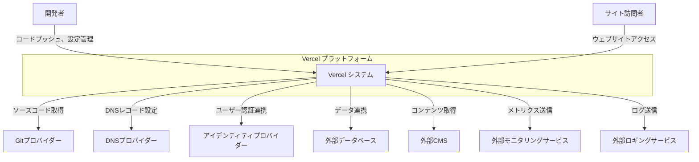
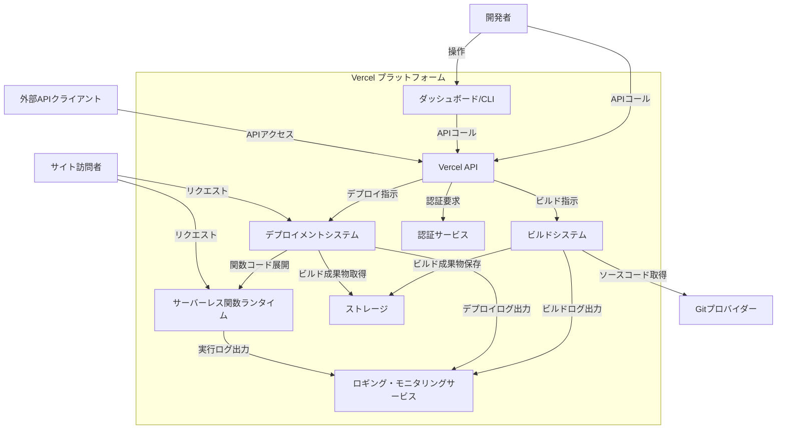
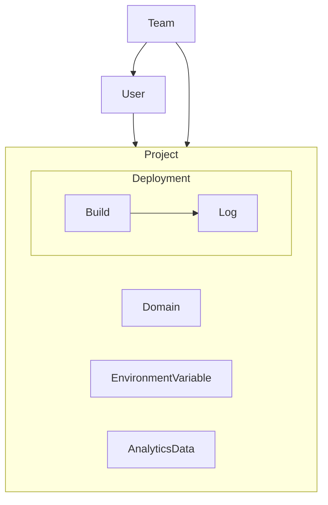

## ■概要

Vercelは、フロントエンドフレームワークと静的サイトのためのクラウドプラットフォームです。開発者が最新のウェブアプリケーションを迅速にデプロイし、スケーリングできるよう設計されています。特にNext.jsとの親和性が高いですが、他の多くのフレームワークや静的サイトジェネレーターもサポートしています。Vercelは、ビルド、デプロイ、ホスティングのプロセスを自動化し、グローバルなエッジネットワークを通じてコンテンツを配信することで、高速なパフォーマンスと高可用性を提供します。

## ■特徴

-   **自動化されたデプロイメント:** Gitリポジトリ（GitHub、GitLab、Bitbucketなど）にプッシュするだけで、ビルドとデプロイが自動的に実行されます。
-   **高速なパフォーマンス:** グローバルエッジネットワークを利用して、コンテンツをユーザーの最も近い場所から配信し、表示速度を向上させます。
-   **サーバーレス関数:** バックエンドロジックをサーバーレス関数として簡単にデプロイでき、スケーラブルなAPIエンドポイントを構築できます。
-   **プレビューデプロイメント:** 各コミットやプルリクエストに対して一意のプレビューURLが自動生成され、変更内容を本番環境にマージする前に確認できます。
-   **Next.jsに最適化:** Next.jsフレームワークの開発元であり、Next.jsプロジェクトのデプロイと運用に最適化された機能を提供します。
-   **豊富なインテグレーション:** データベース、CMS、分析ツールなど、さまざまなサードパーティサービスとの連携が容易です。
-   **開発者体験の重視:** シンプルなUIとCLIツールにより、開発者はインフラ管理の複雑さを意識することなく、アプリケーション開発に集中できます。

## ■構造

### ●システムコンテキスト図

| 要素名                     | 説明                                                                 |
| :------------------------- | :------------------------------------------------------------------- |
| 開発者                     | Vercelを利用してアプリケーションを開発・デプロイ・管理するユーザー。       |
| サイト訪問者               | Vercel上でホストされているウェブサイトやアプリケーションにアクセスするユーザー。 |
| Vercel プラットフォーム    | アプリケーションのビルド、デプロイ、ホスティング機能を提供する中心的なシステム。 |
| Vercel システム            | Vercel プラットフォームの具体的なシステム実体。                        |
| Gitプロバイダー            | ソースコードを管理する外部システム (例: GitHub, GitLab, Bitbucket)。     |
| DNSプロバイダー            | カスタムドメインの名前解決を行う外部システム。                             |
| アイデンティティプロバイダー | ユーザー認証機能を提供する外部システム (例: OAuthプロバイダー)。          |
| 外部データベース           | アプリケーションが利用する外部のデータベースサービス。                       |
| 外部CMS                    | アプリケーションが利用する外部のコンテンツ管理システム。                     |
| 外部モニタリングサービス   | アプリケーションのパフォーマンスや稼働状況を監視する外部サービス。           |
| 外部ロギングサービス       | アプリケーションのログを収集・分析する外部サービス。                       |

### ●コンテナ図

| 要素名                                 | 説明                                                                                             |
| :------------------------------------- | :----------------------------------------------------------------------------------------------- |
| 開発者                                 | Vercelプラットフォームを操作するユーザー。                                                           |
| サイト訪問者                           | Vercel上でホストされているアプリケーションのエンドユーザー。                                             |
| Gitプロバイダー                        | ソースコードリポジトリを提供する外部システム。                                                         |
| 外部APIクライアント                    | Vercel APIを利用する外部アプリケーションやスクリプト。                                                 |
| ダッシュボード/CLI                       | 開発者がプロジェクト管理、デプロイ操作を行うためのUIおよびCLI。                                      |
| Vercel API                             | Vercelの機能をプログラムから操作するためのインターフェース。                                           |
| ビルドシステム                         | ソースコードをフェッチし、依存関係をインストールし、アプリケーションをビルド・最適化するコンテナ群。         |
| デプロイメントシステム (エッジネットワーク) | ビルドされたアプリケーションをグローバルなエッジネットワークにデプロイし、配信するコンテナ群。               |
| サーバーレス関数ランタイム             | サーバーレス関数を実行するための環境を提供するコンテナ群。                                               |
| ストレージ (ビルド成果物, アセット)      | ビルドによって生成された静的ファイルや関数コード、その他のアセットを保存するストレージサービス。             |
| 認証サービス                           | ユーザー認証やAPIアクセストークンの管理を行うサービス。                                                |
| ロギング・モニタリングサービス             | ビルド、デプロイ、ランタイムのログ収集およびプラットフォームの稼働状況監視を行うサービス。                   |

## ■データ

### ●概念モデル

| 要素名              | 説明                                                                 |
| :------------------ | :------------------------------------------------------------------- |
| User                | Vercelプラットフォームの利用者のアカウント。                                 |
| Team                | 複数のUserが共同でプロジェクトを管理するためのグループ。                             |
| Project             | デプロイされるアプリケーションやウェブサイトの単位。設定、ソースコードリポジトリ情報などを含む。 |
| Deployment          | 特定の時点でのProjectのデプロイインスタンス。各デプロイは一意のURLを持つ。           |
| Build               | Deploymentを生成するためのビルドプロセスとその結果。                               |
| Domain              | Projectに割り当てられるカスタムドメイン名。                                    |
| EnvironmentVariable | Projectのビルド時や実行時に利用される環境変数。                                |
| Log                 | BuildやDeploymentの実行時に出力されるログ情報。                              |
| AnalyticsData       | デプロイされたサイトのトラフィックやパフォーマンスに関する分析データ。                     |

## ■構築方法

Vercelでアプリケーションを構築（デプロイ）する一般的な手順は以下の通りです。

### 1. アカウント作成とログイン
-   Vercelのウェブサイトでアカウントを作成します。
-   GitHub、GitLab、BitbucketなどのGitプロバイダーアカウントで連携してサインアップすることも可能です。

### 2. プロジェクトのインポートまたは作成
-   **Gitリポジトリのインポート:**
    -   Vercelダッシュボードから「New Project」を選択します。
    -   利用しているGitプロバイダー（GitHub, GitLab, Bitbucket）と連携し、デプロイしたいリポジトリを選択します。
    -   Vercelがリポジトリへのアクセス許可を求めますので、承認します。
-   **テンプレートから開始:**
    -   Vercelが提供するテンプレートを選択して、新しいプロジェクトを開始することも可能です。この場合、選択したテンプレートに基づいて新しいGitリポジトリが作成されます。

### 3. プロジェクト設定
-   **フレームワークの自動検出:** Vercelは多くの場合、プロジェクトのフレームワーク（Next.js, Create React App, Gatsbyなど）を自動的に検出します。
-   **ビルドコマンドと出力ディレクトリ:**
    -   必要に応じて、ビルドコマンド（例: `npm run build`）や、ビルド成果物が出力されるディレクトリ（例: `public`, `dist`, `out`）を指定または確認します。通常はフレームワークのデフォルト値が自動設定されます。
-   **環境変数:**
    -   APIキーやデータベース接続情報など、ビルド時や実行時に必要な環境変数を設定します。これらはProduction, Preview, Developmentの各環境ごとに設定可能です。

### 4. デプロイ
-   設定が完了したら、「Deploy」ボタンをクリックします。
-   VercelはGitリポジトリからソースコードを取得し、ビルドプロセスを実行し、完了後にグローバルエッジネットワークにデプロイします。
-   最初のデプロイが完了すると、一意のURL（例: `your-project-name.vercel.app`）が提供されます。

### 5. Git連携による自動デプロイ
-   一度プロジェクトを連携すると、指定したブランチ（通常は`main`や`master`）へのプッシュや、プルリクエストの作成/更新をトリガーとして、自動的に新しいビルドとデプロイ（プレビューデプロイを含む）が実行されます。

### 6. (オプション) Vercel CLIの利用
-   Vercel CLI (コマンドラインインターフェース) をインストールすることで、ローカル環境から直接デプロイしたり、開発サーバーを起動したりすることが可能です。
    -   インストール: `npm i -g vercel`
    -   ログイン: `vercel login`
    -   デプロイ: プロジェクトディレクトリで `vercel` または `vercel --prod` (本番環境)

## ■利用方法

Vercelの主な利用方法は以下の通りです。

### 1. ダッシュボードからのプロジェクト管理
-   **プロジェクト概要の確認:** デプロイ履歴、ドメイン設定、ブランチ情報などを一覧できます。
-   **デプロイメントの管理:**
    -   過去のデプロイメントを確認し、特定のデプロイメントにロールバックできます。
    -   プレビューデプロイメントのURLを確認し、変更内容を共有できます。
    -   本番環境へのプロモートを手動で行うことも可能です。
-   **カスタムドメインの設定:**
    -   購入済みのドメインをプロジェクトに割り当てることができます。VercelがDNS設定手順を案内します。
-   **環境変数の管理:**
    -   プロジェクトの環境変数を追加、編集、削除できます。
-   **ロギングと分析:**
    -   リアルタイムのランタイムログやビルドログを確認できます。
    -   Vercel Analyticsを有効にすることで、サイトのトラフィックやパフォーマンス（Core Web Vitalsなど）を計測できます。
-   **チーム管理:**
    -   (Proプラン以上) チームメンバーを招待し、役割ベースのアクセス制御を行うことができます。

### 2. Gitワークフローとの統合
-   **プッシュによる自動デプロイ:** Gitリポジトリの特定のブランチ（例: `main`）にプッシュすると、自動的に本番環境へデプロイされます。
-   **プルリクエストによるプレビューデプロイ:** プルリクエストを作成すると、その変更内容に対するプレビューデプロイが自動的に生成されます。レビュー担当者は実際の動作環境で変更を確認できます。
-   **Vercel Botによるコメント:** デプロイのステータスやプレビューURLが、Gitプロバイダーのプルリクエストページにコメントとして通知されます。

### 3. サーバーレス関数の利用
-   プロジェクトの `api` ディレクトリ（Next.jsの場合など、フレームワークによって規約あり）にファイルを作成することで、サーバーレス関数を簡単に作成・デプロイできます。
-   これにより、APIエンドポイント、バックエンドロジック、サードパーティサービスとの連携などをサーバー管理なしで実現できます。

### 4. エッジ機能の活用
-   **エッジ関数 (Edge Functions):** Middlewareなど、リクエスト処理の早い段階で実行されるコードをグローバルエッジで実行できます。これにより、パーソナライゼーション、A/Bテスト、認証処理などを低遅延で実現します。
-   **エッジキャッシング:** 静的アセットは自動的にエッジネットワーク上にキャッシュされ、高速に配信されます。Cache-Controlヘッダーによりキャッシュ戦略を制御できます。

### 5. Vercel CLIによる操作
-   ローカル開発環境でのテスト: `vercel dev` コマンドで、Vercelのクラウド環境を模倣したローカルサーバーを起動できます。
-   手動デプロイ: `vercel` コマンドでカレントディレクトリのプロジェクトをデプロイできます。
-   プロジェクト連携: `vercel link` コマンドでローカルプロジェクトをVercel上のプロジェクトに紐付けられます。
-   環境変数の設定やログの確認などもCLIから行えます。

### 6. インテグレーションの利用
-   Vercelマーケットプレイスから、データベース (Fauna, MongoDB Atlasなど)、CMS (Contentful, Sanityなど)、ロギング (Logflare, Datadogなど) といった様々なサードパーティサービスとのインテグレーションを追加し、開発ワークフローを強化できます。

## ■運用

Vercel上のプロジェクトを効果的に運用するための主要な観点は以下の通りです。

### 1. モニタリングとロギング
-   **Vercel Analytics:**
    -   Core Web Vitals (LCP, FID, CLS) や実際のユーザー体験に基づいたパフォーマンステータスを監視します。
    -   ページビュー数、訪問者数などのトラフィックデータを把握します。
-   **ログの確認:**
    -   VercelダッシュボードまたはCLIを通じて、ビルドログ、ランタイムログ（サーバーレス関数）、エッジ関数のログを確認します。
    -   エラー発生時の原因調査やデバッグに不可欠です。
-   **外部モニタリング/ロギングサービス連携:**
    -   Datadog, New Relic, Logflareなどの専門的な監視・ロギングサービスと連携し、より詳細な分析やアラート設定を行います。

### 2. デプロイメント管理
-   **プレビューデプロイメントの活用:**
    -   本番環境にマージする前に、プレビューデプロイメントで変更内容を徹底的にテストします。
    -   関係者間でのレビューを容易にします。
-   **ロールバック:**
    -   問題が発生した場合、Vercelダッシュボードから過去の正常なデプロイメントに即座にロールバックできます。
-   **デプロイメントフック:**
    -   外部のCI/CDパイプラインやスクリプトからVercelのデプロイをトリガーしたり、デプロイ完了通知を受け取ったりするためにデプロイメントフックを利用します。

### 3. パフォーマンス最適化
-   **エッジネットワークの活用:**
    -   Vercelはコンテンツをグローバルなエッジネットワークに自動的に配信しますが、適切なキャッシュ戦略（Cache-Controlヘッダーの設定）を意識することで、パフォーマンスをさらに向上させることができます。
-   **画像の最適化:**
    -   VercelはNext.jsの`<Image>`コンポーネントなどと連携し、画像を自動的に最適化（リサイズ、フォーマット変換、遅延読み込み）しますが、元画像のサイズや圧縮率にも注意します。
-   **コード分割と遅延読み込み:**
    -   フレームワークの機能（Next.jsのダイナミックインポートなど）を活用し、初期ロードに必要なJavaScriptの量を削減します。
-   **サーバーレス関数のリージョン選択:**
    -   (Proプラン以上) 関数の実行リージョンをユーザーに近い場所やバックエンドサービスに近い場所に設定することで、遅延を削減できます。

### 4. セキュリティ
-   **環境変数の適切な管理:**
    -   APIキーや秘密情報は環境変数として安全に管理し、コードに直接埋め込まないようにします。
    -   環境変数のスコープ（Production, Preview, Development）を適切に設定します。
-   **アクセス制御:**
    -   (Pro/Enterpriseプラン) チームメンバーの役割に応じて、プロジェクトへのアクセス権限を適切に設定します。
-   **Vercel認証:**
    -   (Enterpriseプラン) デプロイメントに対してパスワード保護やVercelアカウントによる認証を設定できます。
-   **依存関係の脆弱性スキャン:**
    -   定期的にプロジェクトの依存関係をスキャンし、既知の脆弱性に対応します（例: `npm audit`, GitHub Dependabot）。

### 5. コスト管理
-   **プランの選択:**
    -   プロジェクトの規模や必要な機能（同時ビルド数、帯域幅、サーバーレス関数の実行時間など）に応じて、適切なプラン（Hobby, Pro, Enterprise）を選択します。
-   **使用状況のモニタリング:**
    -   Vercelダッシュボードで帯域幅、ビルド時間、関数実行などの使用状況を定期的に確認し、予期せぬ超過がないか監視します。
-   **最適化によるコスト削減:**
    -   不要なビルドの抑制（例: `[skip vercel]` コミットメッセージ）、関数の実行時間短縮、キャッシュ活用などでリソース消費を抑えます。

### 6. カスタムドメインとDNS管理
-   カスタムドメインが正しく設定され、DNSレコードがVercelの指示通りになっていることを確認します。
-   SSL/TLS証明書はVercelによって自動的に発行・更新されますが、その状態も確認できます。

## ■参考リンク

-   **概要**
    -   [Vercelとは？｜【脱・初心者】Next.jsでECWebサイト ... - Zenn](https://zenn.dev/haruki1009/books/42c167218b5fec/viewer/0a9089)
    -   [Vercel - Wikipedia](https://ja.wikipedia.org/wiki/Vercel)
-   **特徴**
    -   [【Vercel完全ガイド】ウェブ開発を変革する革新的PaaSのすべて - ISSUE](https://i-ssue.com/topics/d9ba0dd5-9213-45ca-a942-afddb6eca148)
    -   [Heroku vs. Vercel: A Deep Dive into Deployment Platforms | Cause of a Kind](https://www.causeofakind.com/blog/heroku-vs-vercel-a-deep-dive-into-deployment-platforms)
-   **構造**
    -   [Behind the scenes of Vercel's infrastructure: Achieving optimal scalability and performance - Vercel](https://vercel.com/blog/behind-the-scenes-of-vercels-infrastructure) (Vercelのインフラに関するブログ、コンテナ図やコンポーネント図のヒント)
    -   [【完全比較2025年版】Render・Vercel・GitHub Pages・Heroku・Cloud RunのMCP（管理コントロールプレーン）を超徹底解剖：PaaSとFaaS時代の制御層アーキテクチャ全網羅 - note](https://note.com/unikoukokun/n/n7e01ad766491) (アーキテクチャに関する考察)
-   **情報**
    -   [Security & Compliance Measures - Vercel](https://vercel.com/docs/security/compliance) (データ保存場所や冗長性に関する情報)
-   **構築方法**
    -   [GitHubのリポジトリとVercelを接続して、ホスティングする - newt.so](https://www.newt.so/docs/tutorials/connect-to-vercel)
    -   [Déployer votre site Astro avec Vercel | Docs - Astro](https://docs.astro.build/fr/guides/deploy/vercel/) (具体的なデプロイ手順例)
-   **利用方法**
    -   [Vercel の Azure Cosmos DB との統合 - Learn Microsoft](https://learn.microsoft.com/ja-jp/azure/cosmos-db/vercel-integration) (インテグレーション利用の一例)
    -   [Getting started with Vercel Web Analytics - Vercel Docs](https://vercel.com/docs/analytics/quickstart) (Vercel Analyticsの利用開始方法)
-   **運用**
    -   [Deploy(Vercel) を分かりやすく解説 - JamstackとNext.jsをTypeScriptで学ぶ。 - Commte](https://www.commte.co.jp/learn-nextjs/Deploy) (環境変数設定など運用関連情報)
    -   [7 Best Practices For Optimizing Your Vercel Deployment - Kapsys](https://kapsys.io/user-experience/7-best-practices-for-optimizing-your-vercel-deployment) (最適化に関するベストプラクティス)
    -   [Integrate with Vercel - Vercel Docs](https://vercel.com/docs/integrations/create-integration) (インテグレーションに関する公式ドキュメント)
    -   [Understanding Vercel's Pro Plan Trial - Vercel Docs](https://vercel.com/docs/plans/pro/trials) (プランと制限に関する情報、コスト管理の参考)

この記事が少しでも参考になった、あるいは改善点などがあれば、ぜひリアクションやコメント、SNSでのシェアをいただけると励みになります！
