Concept Design は、アプリケーションを「概念」という再利用可能な部品の合成として設計する手法です。2026-07-17 に arXiv へ投稿された論文 [Verified LLM-Driven Synthesis for Concept Design](https://arxiv.org/abs/2607.15718) は、この手法に空白のまま残っていたリアクションの形式意味論を与えます。そのうえで、LLM が設計候補を提案し Alloy 6 の有界モデル検査が反例を返す CEGIS 型の合成手順を提案します。

本記事の中心は、論文が実測で示した次の結果です。不変条件を渡すだけでは意図した設計に収束せず、肯定・否定シナリオで誘導すると意図の再現性が上がります。論文本文 (LaTeX ソース) と参照実装 `foundry` のソースコードを一次情報として、構造・データ・構築・利用・運用を整理します。

> **評価規模の注意**: 論文の主評価は 3 アプリケーション・12 設計バリアント・単一 LLM 構成 (gpt-5.5) です。検証は Alloy 6 の有界モデル検査であり、指定したスコープとステップ数の範囲で反例が出ないことの確認にとどまります。一般化された性能比較としてではなく、設計の過少仕様を発見する手順として読むのが妥当です。

## 概要

### Concept Design とは

Concept Design は Daniel Jackson が提唱したソフトウェア構造化手法です。

アプリケーションを「概念(concept)」という再利用可能な部品の合成として捉えます。

概念は認証・ラベリング・共有・通知・アクセス制御など、焦点を絞った目的を持つ単機能のミニアプリです。

概念単体が持つのは、状態と「アクション(action)」の集合だけです。

複数の概念を組み合わせて 1 つのアプリケーションにするときは、概念間の協調ロジックを記述します。

この協調ロジックを表すのが「リアクション(reaction)」です。

リアクションは同期規則です。ある概念のアクションが発生したとき、条件を満たせば、別の(または同じ)概念のアクションを起動します。

アプリケーション全体で満たすべき安全性は「不変条件(invariant)」として宣言します。

4 つの用語の関係を次に示します。

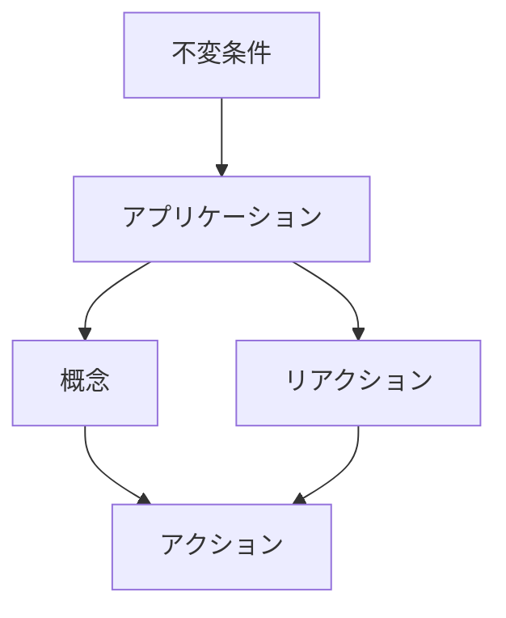

| 要素名 | 説明 |
|---|---|
| アプリケーション | 複数の概念とリアクションを合成した最終成果物 |
| 概念 | 状態とアクションを持つ、焦点を絞った単機能のミニアプリ |
| アクション | 概念が公開する操作。事前条件と事後条件を持つ |
| リアクション | ある概念のアクション発生を契機に、別の概念のアクションを起動する同期規則 |
| 不変条件 | アプリケーション全体が満たすべき安全性の宣言 |

### 本論文が新しく提案したこと

Concept Design は 2021 年の提唱以来、概念とその合成規則を記述する方法論として発展してきました。

一方でリアクションの形式意味論は空白のままでした。

形式意味論の空白は、次の 3 つを阻みます。

- 設計の意味を厳密に述べること
- 不変条件の保持を検証すること
- 安全な協調ロジックを合成すること

本論文は、この形式意味論を初めて与え、それを土台に LLM 駆動の合成手順を提案します。

合成手順は「不変条件を渡すだけでは、ユーザーが意図した設計に収束する保証がない」という問題に直面します。

同じ不変条件を満たす設計は複数存在します。その中には不合理な設計や、ユーザーが許容したい挙動まで禁止する設計も混ざります。

この問題に対し、本論文は「肯定・否定シナリオ」という検証可能な誘導手段を提案します。

### 本論文の 3 つの貢献

| 貢献 | 内容 |
|---|---|
| ①概念とリアクションの形式意味論 | 概念を半オートマトンとして、リアクションをそれを監視するモニタ半オートマトンとして定義する。両者の同期合成でアプリケーション全体の遷移系を得る |
| ②CEGIS 型の LLM 駆動合成手順 | LLM がリアクション候補を提案し、Alloy 6 の有界モデル検査が反例を返し、LLM が反例をもとに候補を修正するループ |
| ③意図を絞り込む 2 方式とシナリオ抽出 | 自然言語プロンプトと肯定・否定シナリオという 2 つの誘導方式を比較する。加えて、ユーザーがシナリオを自作せずに LLM の提案を分類するだけで済む「シナリオ抽出(elicitation)」を提案する |

### 関連技術との関係

| 技術 | 本論文との関係 |
|---|---|
| Concept Design (Daniel Jackson) | 本論文が形式意味論を与える対象の方法論。概念は元々決定的な状態機械として素朴にモデル化されており、リアクションの意味論は空白のままだった |
| Alloy 6 | 概念とリアクションを Alloy へ翻訳し、Alloy Analyzer 6.3(nuXmv 2.1 バックエンド)の有界モデル検査で不変条件とシナリオを検証する。次状態演算子を含む線形時相論理をフルサポートする点が採用理由 |
| CEGIS(Counterexample-Guided Inductive Synthesis) | CEGIS 自体は 2008 年から存在する既存の合成パターン。本論文の新規性は、候補生成を LLM が担い、反例生成を Alloy が担う役割分担の具体的な構成、および反例に加えてシナリオの不一致もフィードバックとして使う点にある |

検証は Alloy 6 の有界モデル検査です。

指定したスコープとステップ数の範囲内で反例が見つからないことを確認する手法です。適用範囲は有界にとどまり、無限範囲の完全な証明とは区別します。

### 4 方式の比較

ユーザーの意図を設計に反映させる方式は 4 通りあります。

論文の評価(3 アプリケーション・12 設計バリアント・単一 LLM 構成 gpt-5.5)における実測値を示します。

| 方式 | 意図再現性 | ユーザー負荷 | 過適合リスク | 検証保証 |
|---|---|---|---|---|
| 不変条件のみ | 低。9 回の合成中 7 回は初回で不変条件を満たしたが、設計が実行ごとに揺れる。NoDeadSensitiveMessages では 3 回中 3 回とも不尤もらしい設計になった | 最小。不変条件のみを渡す | 該当なし。シナリオを使わないため過適合は起きず、代わりに不尤もらしい設計を選びやすい | 不変条件のみを機械検証する |
| 自然言語プロンプト | 中。初回プロンプトで 12 バリアント中 8 バリアントが意図した設計に収束し、1 回の改訂後も 1 バリアントが失敗した | 低。「他の問題挙動はすべて禁止する」のような 1 文で経済的に広い範囲を指定できる | プロンプト解釈のブレによるブリトルさがある。明確に見える指示にも従わない場合がある | 不変条件のみを機械検証する。プロンプト自体は機械検証の対象外 |
| シナリオ誘導(ユーザー作成) | 高。最小限のシナリオで 12 バリアント中 10 バリアントが収束し、改訂後は 12 バリアントすべてが収束した | 中〜高。肯定・否定のアクション列を手作業で列挙する | 高。最小限のシナリオのみでは過適合が起き、2 バリアントで初回失敗した | 不変条件とシナリオの両方を機械検証する |
| シナリオ抽出(elicitation) | 中〜高。10 件の抽出では 12 バリアント中 5 バリアント、20 件の抽出では 9 バリアントが収束した | 低〜中。シナリオの作成は不要で、LLM が提案したシナリオを ok/nok に分類するだけで済む | 中。全 72 回の失敗のうち 26 回が重要シナリオの欠落、8 回が過適合が原因だった | 不変条件とシナリオの両方を機械検証する |

検証に達するまでの平均イテレーション数を次に示します。

| 方式 | 平均イテレーション数 |
|---|---|
| プロンプト誘導 | 1.79 回 |
| シナリオ誘導 | 2.36 回 |
| シナリオ抽出(10 件) | 2.11 回 |
| シナリオ抽出(20 件) | 2.36 回 |

## 特徴

- リアクションを「監視モニタ半オートマトン」として定義する
  - 概念オートマトンとの同期合成でアプリケーション全体の遷移系を構成する
- 不変条件の保持を検証する
  - 「不変条件が破れていない状態で反応してしまう」過剰反応も同時に検証する
- LLM の役割を 2 つに分けて使う
  - 1 つ目はリアクション候補の提案
  - 2 つ目は Alloy への翻訳
  - Alloy 翻訳エージェントは論文が主張する貢献の対象外
  - 将来は Alloy 翻訳を形式言語に置き換える計画がある
- シナリオは機械検証できる誘導 artifact
  - この点でシナリオは自然言語プロンプトと本質的に異なる
  - ok シナリオが不可能と判定されれば、それ自体が候補設計を却下する根拠になる
  - nok シナリオが可能と判定された場合も同様に却下の根拠になる
- シナリオ抽出はユーザーが分類するだけで済む対話形式
  - LLM が不変条件違反に至る短いアクション列(prefix)を提案する
  - LLM が修復候補(suffix)も提案する
  - ユーザーの作業は提案されたシナリオの分類のみ
- 評価対象は 3 アプリケーション
  - 対象は NoDeadSensitiveMessages / CourseManagementSystem / OneTimeEvidenceLinks
  - 各アプリケーションは 2 つの部品概念を合成したもの
  - 部品概念は DeadLetterQueue / Label / Rostering / Registration / Vault / Permalink の 6 つ
  - 部品概念の位置づけは、アプリケーションを構成する再利用単位
- 論文の主評価は単一 LLM 構成
  - モデルは gpt-5.5
  - 温度は 1、reasoning effort は medium
  - 各条件 3 独立 run
- 論文は主評価に加えて、Claude Fable 5 による補助のクロスモデル確認も明示的に実施している
  - 対象はシナリオ誘導合成のみ、各バリアント 1 run で実行した
  - 12 バリアントすべてで意図した設計に収束した
  - 6 バリアントは初回収束、2 回超を要したのは 1 バリアントのみ
  - 論文自身は「系統的なモデル間比較には不十分」と留保している
  - そのうえで「効果が gpt-5.5 固有ではない初期的な証拠」と位置づけている
  - リポジトリの `examples/` にある `*_fable-5_run1.md` はこの補助確認の成果物であり、主評価とは異なる位置づけとして区別する
- 頻出する品質面の失敗は冗長性
  - 意図した設計と等価でも、冗長なリアクションや冗長な事前条件が混入する場合がある
  - 発生頻度は、意図した設計を得られた実行のうち 15/82 回

## 構造

論文が提案する検証付き LLM 合成手法と、参照実装 `foundry` の合成パイプラインを C4 モデルの 3 段階で示します。

| 図 | 対象範囲 |
| --- | --- |
| システムコンテキスト図 | 利用者と foundry、外部システムの関係 |
| コンテナ図 | foundry 内部の主要構成要素 |
| コンポーネント図 | 各構成要素の内部処理と CEGIS ループの制御フロー |

### システムコンテキスト図

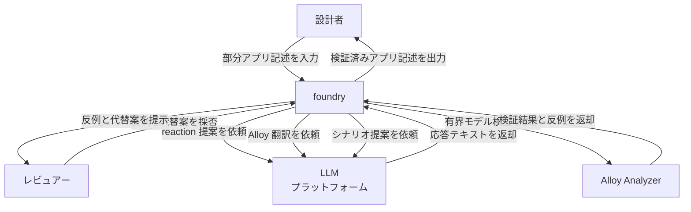

| 要素名 | 説明 |
| --- | --- |
| 設計者 | concept・不変条件・任意のシナリオを含む部分アプリ記述の用意と、シナリオ提案の分類を担う役割 |
| レビュアー | 対話モードで反例と LLM の代替提案を確認し、採用する reaction を選ぶ役割 |
| foundry | 部分アプリ記述から reaction を合成し、Alloy で検証するコマンドラインツール |
| LLM プラットフォーム | reaction 提案・Alloy 翻訳・シナリオ提案の生成を担う外部の LLM 実行基盤カテゴリ |
| Alloy Analyzer | 有界モデル検査を実行する外部の検証エンジンカテゴリ |

### コンテナ図

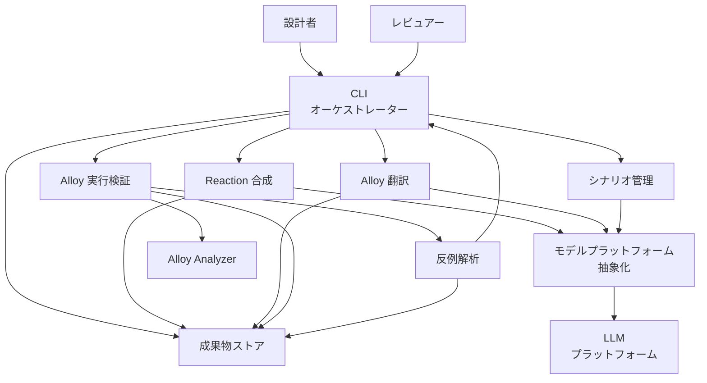

| 要素名 | 説明 |
| --- | --- |
| CLI オーケストレーター | `foundry.py` の `main`。`synthesize` / `interactive` / `verify` / `scenarios` の 4 サブコマンドを解釈し、CEGIS ループ全体の進行を制御する司令塔 |
| Reaction 合成 | LLM への reaction 新規提案・修正の依頼と、そのタスク構築およびレスポンス処理 |
| Alloy 翻訳 | concept 記述とアプリ記述の Alloy モジュールへの変換、および Alloy 実行エラー時の修復 |
| Alloy 実行検証 | 外部 Alloy Analyzer の起動と、不変条件チェックおよびシナリオ実行コマンドの実行 |
| 反例解析 | Alloy が出力する XML 結果の解析と、人間可読な反例トレースへの変換 |
| シナリオ管理 | アプリ記述からのシナリオ抽出・重複除去と、LLM によるシナリオ提案・分類ループ |
| モデルプラットフォーム抽象化 | `codex-cli` / `claude-api` / `gpt-api` / `deepseek-api` の呼び出し差異を吸収する `ModelClient` |
| 成果物ストア | 出力ディレクトリ配下に保存されるアプリ版・Alloy モジュール・XML 結果・ログ・反例トレース一式 |
| LLM プラットフォーム | 外部の LLM 実行基盤カテゴリ |
| Alloy Analyzer | 外部の有界モデル検査エンジンカテゴリ |

### コンポーネント図

本節は C4 のコンポーネント階層を、各コンテナの内部処理フローとして描きます。foundry の設計の本質は「どの順で LLM と Alloy を呼ぶか」にあります。そこで要素間の静的な依存関係はコンテナ図で示し、ここでは各コンテナ内部の制御フローを図示します。以降の図はいずれもコンテナ 1 つのドリルダウンであり、ノードは実装の関数に対応します。

#### CLI オーケストレーター: CEGIS ループ (`synthesize` コマンド)

`foundry.py` の `main` 内で実装される、reaction 合成・Alloy 翻訳・有界モデル検査・反例フィードバックの反復です。論文 Figure 2 (§4.1) の scenario-guided synthesis loop に対応します。

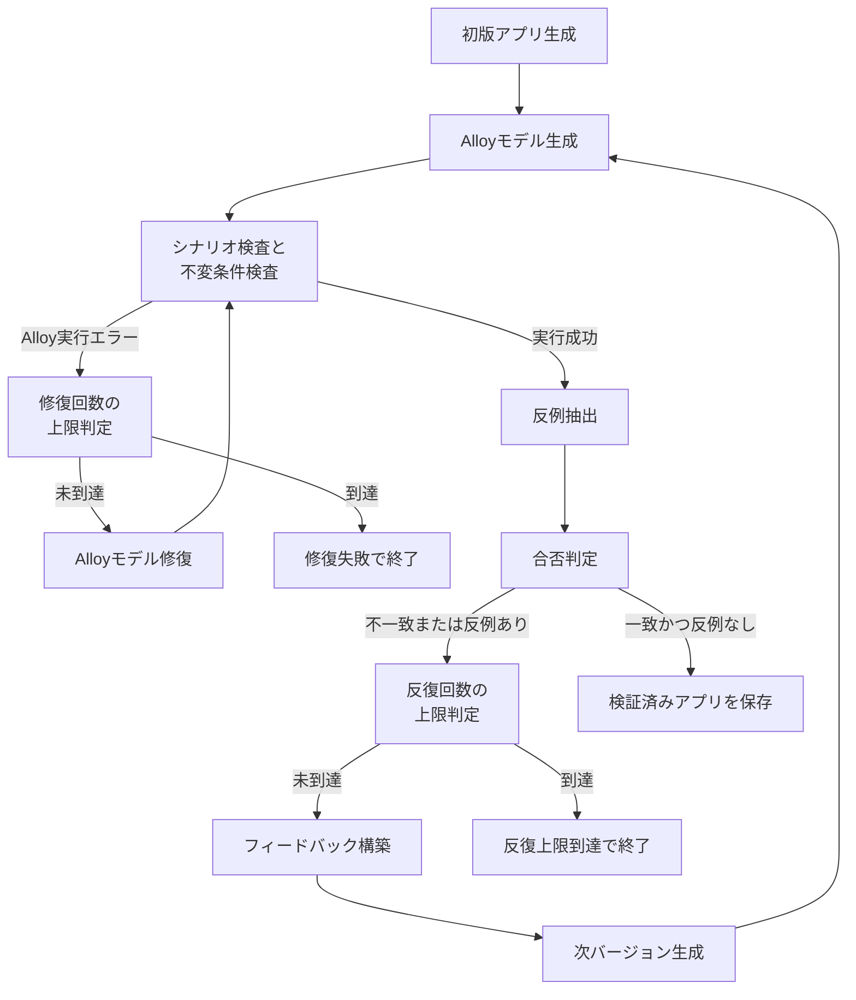

| 要素名 | 説明 |
| --- | --- |
| 初版アプリ生成 | `build_initial_reactions_task` でのタスク構築と、`ask_for_app_update_with_debug` による初版 reaction 一式の生成 |
| Alloyモデル生成 | `generate_alloy_model_with_raw` による現在のアプリ記述の Alloy モジュールへの翻訳 |
| シナリオ検査と不変条件検査 | `check_scenario_run_commands` による各シナリオの検査と、`run_design_check` による `Design` 不変条件の検査 |
| Alloyモデル修復 | `fix_alloy_model_with_raw` による Alloy 実行エラー (構文エラー等) のみの修復。アプリの意味はそのまま保持 |
| 修復回数の上限判定 | `alloy_fix_count` が `--max-alloy-fixes` (既定 3) に達したかの判定 |
| 修復失敗で終了 | 上限到達時の終了コード 2 での異常終了 |
| 反例抽出 | `find_counterexample_xml` による `Design-solution-0.xml` の有無確認と、`parse_counterexample_trace` によるトレース化 |
| 合否判定 | シナリオ一致と反例不在の同時成立の判定 |
| フィードバック構築 | `build_scenario_fix_task` と `build_counterexample_fix_task` によるシナリオ不一致・反例トレースの次依頼文への組み込み |
| 次バージョン生成 | `ask_for_app_update_with_debug` の再呼び出しによる、蓄積した会話履歴つきの修正版アプリ生成 |
| 反復回数の上限判定 | バージョン番号が `--max-iterations` (既定 10) を超えたかの判定 |
| 反復上限到達で終了 | 上限到達時の最終候補の保存と、終了コード 1 での失敗終了 |
| 検証済みアプリを保存 | 合否判定を通過したアプリ記述の出力ファイルへの保存と正常終了 |

補足として、`interactive` コマンドは同じ CEGIS 構造を人間参加型に変えた変種です。反例が見つかるたびに LLM が複数の代替 reaction 案 (`--num-alternatives` 件) を提示し、レビュアーが採否や再提案要求 (`regenerate`) を選びます。反復回数の上限は `--max-iterations` (既定 20) で、検査対象は不変条件のみです。`verify` コマンドは reaction 合成を省き、完成済みアプリ記述を Alloy へ翻訳して検査するだけの一方向フローです。

#### Reaction 合成コンポーネント

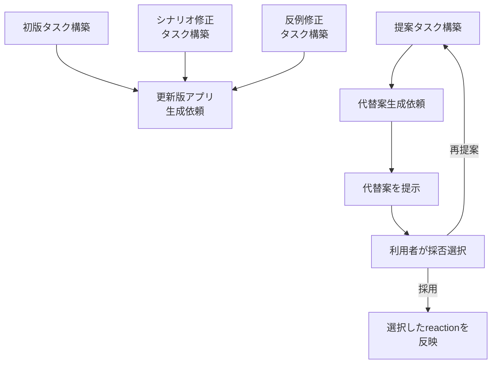

| 要素名 | 説明 |
| --- | --- |
| 初版タスク構築 | `build_initial_reactions_task`。`synthesize` の初回反復で使用 |
| シナリオ修正タスク構築 | `build_scenario_fix_task`。シナリオ不一致のフィードバックを内包 |
| 反例修正タスク構築 | `build_counterexample_fix_task`。反例トレースのフィードバックを内包 |
| 更新版アプリ生成依頼 | `ask_for_app_update_with_debug`。完全なアプリ記述の生成依頼。`synthesize` と `verify` の準備段階で使用 |
| 提案タスク構築 | `build_proposal_task`。`interactive` コマンドでの反例に基づく複数 reaction 代替案の依頼 |
| 代替案生成依頼 | `propose_reactions`。LLM からの `--num-alternatives` 件の候補取得 |
| 代替案を提示 | `display_alternatives`。各候補のレビュアーへの表示 |
| 利用者が採否選択 | `prompt_user_choice`。採用・再提案・中断の選択 |
| 選択したreactionを反映 | `parse_reaction_blocks` による選択候補の分解と、reaction 辞書への追加・更新 |

#### Alloy 翻訳コンポーネント

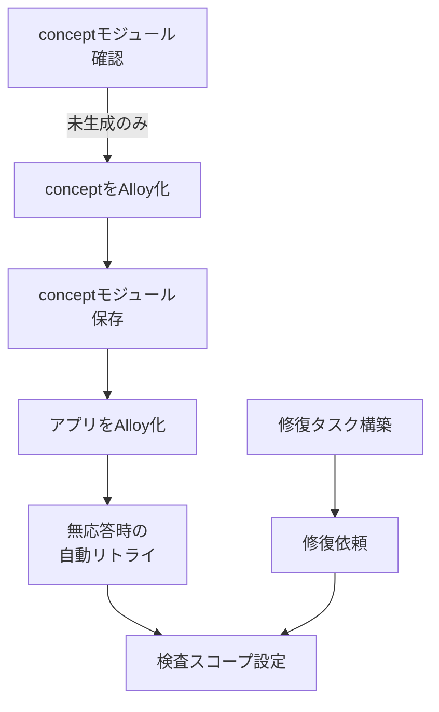

| 要素名 | 説明 |
| --- | --- |
| conceptモジュール確認 | `prepare_alloy_concept_modules`。出力ディレクトリにある既存 `<Concept>.als` の再利用 |
| conceptをAlloy化 | `formalize_concepts_alloy`。concept のマークダウン定義の Alloy モジュール JSON への変換 |
| conceptモジュール保存 | `write_alloy_support_modules`。共通の `Action.als` と併せた出力ディレクトリへの書き出し |
| アプリをAlloy化 | `generate_alloy_model_with_raw` / `generate_interactive_alloy_model_with_raw`。アプリ記述全体の Alloy コードへの翻訳 |
| 無応答時の自動リトライ | `call_for_alloy_with_retries`。LLM の応答が無効な場合の既定 3 回までの再依頼 |
| 検査スコープ設定 | `set_check_top_scope_or_save` / `set_scenario_run_scopes_or_save` / `set_check_scope_or_save`。`check Design` と `Run Scenario` コマンドへのスコープ注入 |
| 修復タスク構築 | `build_alloy_fix_task`。Alloy 実行検証コンポーネントから受け取ったエラーログに基づく修復依頼文の作成 |
| 修復依頼 | `fix_alloy_model_with_raw`。構文エラー等のみを直し、意味を保った Alloy モデルの再生成 |

#### Alloy 実行検証コンポーネント

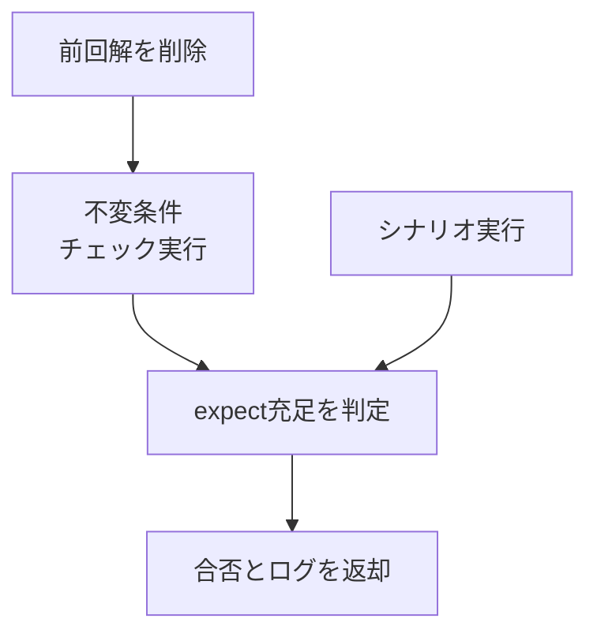

| 要素名 | 説明 |
| --- | --- |
| 前回解を削除 | `clear_previous_solution`。結果ディレクトリの古い XML 解の削除による反例検出の誤判定防止 |
| 不変条件チェック実行 | `run_alloy` / `run_design_check`。`alloy exec -t xml -c Design -o <dir> -s electrod.nuxmv -f <file>` の実行 |
| シナリオ実行 | `run_scenario` / `check_scenario_run_commands`。シナリオごとの `alloy exec -t xml -c "Run Scenario<N>" ...` の実行 |
| expect充足を判定 | `alloy_expectation_failed`。Alloy の `expect` 節の充足を出力の正規表現マッチで判定 |
| 合否とログを返却 | 呼び出し元の CLI オーケストレーターへの真偽値と実行ログ文字列の返却 |

#### 反例解析コンポーネント

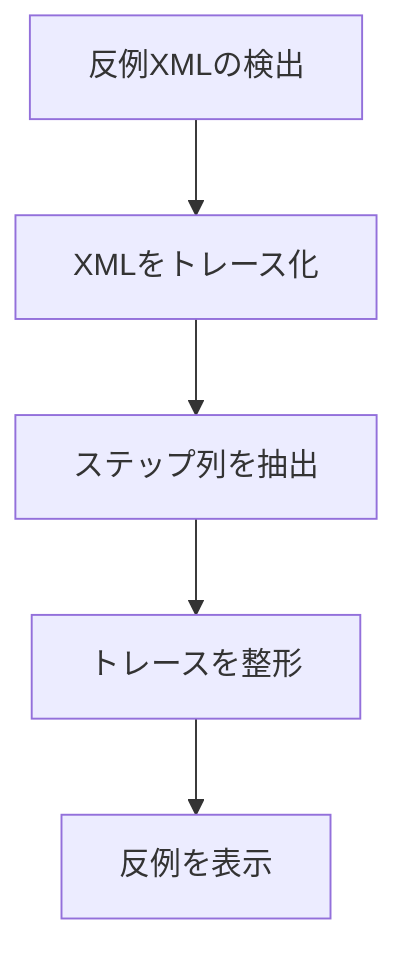

| 要素名 | 説明 |
| --- | --- |
| 反例XMLの検出 | `find_counterexample_xml`。結果ディレクトリの `Design-solution-0.xml` の有無確認 |
| XMLをトレース化 | `parse_counterexample_trace`。XML の解析と `CounterexampleTrace` の構築 |
| ステップ列を抽出 | `extract_counterexample_trace`。各状態のアクション呼び出しと進行中 reaction の `CounterexampleStep` 列としての取り出し |
| トレースを整形 | `format_counterexample_trace`。人間可読なテキスト形式への整形 |
| 反例を表示 | `display_counterexample`。`interactive` コマンドでのレビュアーへの表示 |

#### シナリオ管理コンポーネント

既存シナリオの抽出・整理に加え、論文 Figure 3 (§4.2) のシナリオ提案手順 (接頭辞 $P$ の分類と修復接尾辞 $F$ の探索) を実装します。

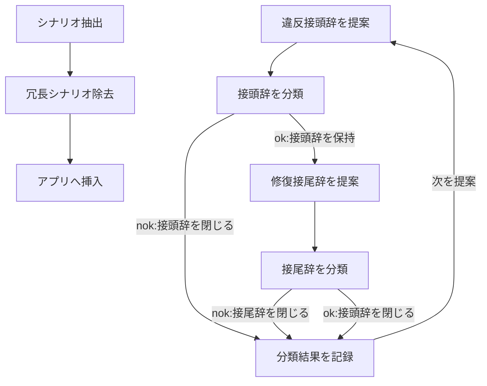

| 要素名 | 説明 |
| --- | --- |
| シナリオ抽出 | `extract_scenarios`。アプリ記述の `scenarios` セクションの取り出し |
| 冗長シナリオ除去 | `filter_redundant_scenarios`。既存シナリオのアクション列の部分列となる重複の除去 |
| アプリへ挿入 | `insert_scenarios_into_app` / `replace_scenarios_in_app`。新規または更新したシナリオのアプリ記述への書き戻し |
| 違反接頭辞を提案 | `generate_and_classify_scenarios` からの `build_generate_scenarios_task` 呼び出しによる、不変条件を破る短い接頭辞 $P$ の 1 件ずつの提案 |
| 接頭辞を分類 | `prompt_scenario_classification`。利用者による `ok` / `nok` / スキップ / 中断の選択 |
| 修復接尾辞を提案 | 接頭辞が `ok` の場合の、続く接尾辞 $F$ の候補提案 |
| 接尾辞を分類 | `prompt_scenario_classification`。$P;F$ の `ok` / `nok` での分類 |
| 分類結果を記録 | 分類済みシナリオの収集リストへの追加と作業中アプリへの反映。既定 10 件 (`--batch-size`) ごとに `prompt_continue_scenarios` で継続確認し、利用者の `quit` でいつでも終了 |

#### モデルプラットフォーム抽象化コンポーネント

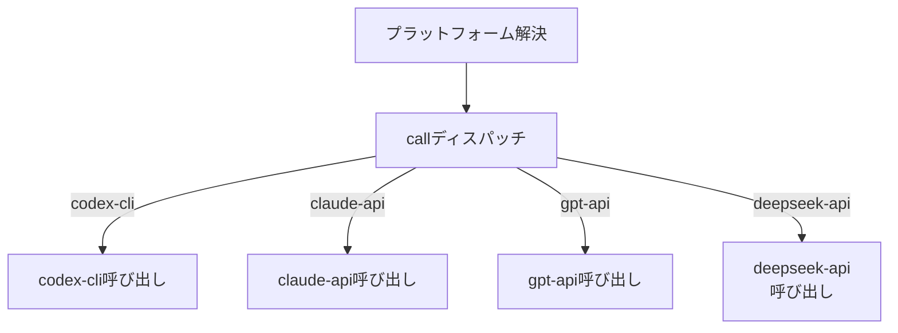

| 要素名 | 説明 |
| --- | --- |
| プラットフォーム解決 | `infer_platform_for_model` / `resolve_model_platform`。`--platform-*` の明示指定を優先し、省略時はモデル名からプラットフォームを推論 |
| callディスパッチ | `ModelClient.call`。`self.platform` の値に応じた 4 種の呼び出しメソッドへの振り分け |
| codex-cli呼び出し | `_call_codex_cli`。`codex exec --ephemeral --skip-git-repo-check --sandbox read-only --color never -c 'forced_login_method="chatgpt"' --output-last-message <tmp> --model <model> -` のサブプロセス実行と、標準入力でのタスク文渡し。`-c 'forced_login_method="chatgpt"'` が ChatGPT ログイン認証を強制し、`CODEX_API_KEY` / `OPENAI_API_KEY` の環境変数除去と併せて API キー課金への暗黙のフォールバックを防止 |
| claude-api呼び出し | `_call_claude_api`。`anthropic` SDK の `messages.stream` によるレスポンス取得 |
| gpt-api呼び出し | `_call_chat_completions`。`openai` SDK の `chat.completions.create` の既定エンドポイントでの呼び出し |
| deepseek-api呼び出し | `_call_chat_completions`。同じ `openai` SDK の `base_url=https://api.deepseek.com` への切り替えでの呼び出し |

## データ

### 概念モデル

App が Concept を所有し、Concept が Action と Invariant を所有します。Scenario と Counterexample は Action の並びとして App に属します。Reaction は複数 Concept の Action をまたいで同期するため、所有ではなく利用 (呼び出し) 関係で表現します。

Reaction を Concept の子に置かない理由は、Concept Design の中心的な設計原則にあります。concept は「単体で理解でき、他の concept から独立した自己完結の単位」であることが要件です。Reaction を特定の concept に所有させると、その concept が相手の concept を知る形になり、独立性が崩れます。Reaction を App の直下に置くと、concept の再利用性を保ったまま、App ごとに異なる同期規則へ差し替えられます。実際に `examples/` では、同じ `DeadLetterQueue` concept を異なる App が異なる Reaction 付きで再利用します。

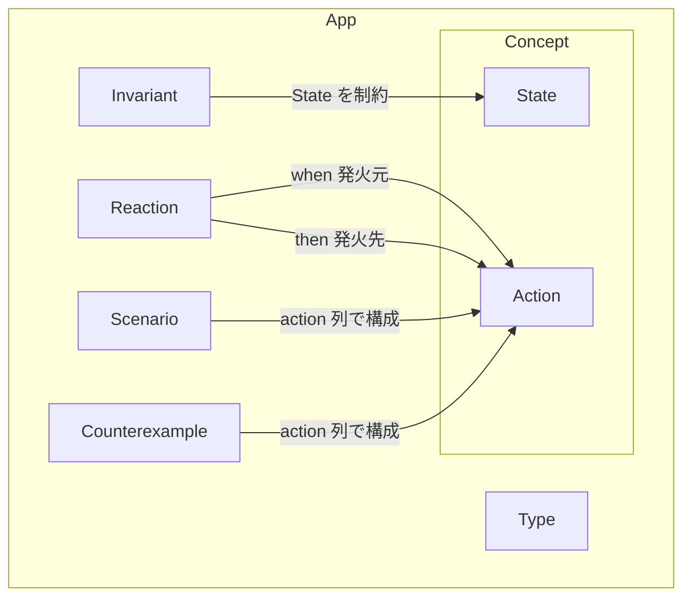

| 要素名 | 説明 |
|---|---|
| App | Concept を合成した完成/部分アプリケーション記述 |
| Type | App で宣言するドメイン型 (集合や特殊値) |
| Concept | 状態と Action を持つ自己完結な機能単位 |
| State | Concept が保持する状態変数 |
| Action | Concept が公開する状態遷移操作 |
| Reaction | ある Concept の Action 発火を条件に別の Action を発火させる同期規則 |
| Invariant | App 全体の State が満たすべき安全性制約 |
| Scenario | 期待される/期待されない Action 列 (positive/negative) |
| Counterexample | 検証失敗時に Alloy が返す Action 列と反応状態の反例 |

### 情報モデル

論文の形式意味論 (arXiv:2607.15718 Section 3) と `README.md` の App Description フォーマット、`foundry_common.py` のパーサ実装に基づく属性です。論文本文に記載がある属性と、実装から補った属性を区別し、後者には「実装から補完」と注記します。

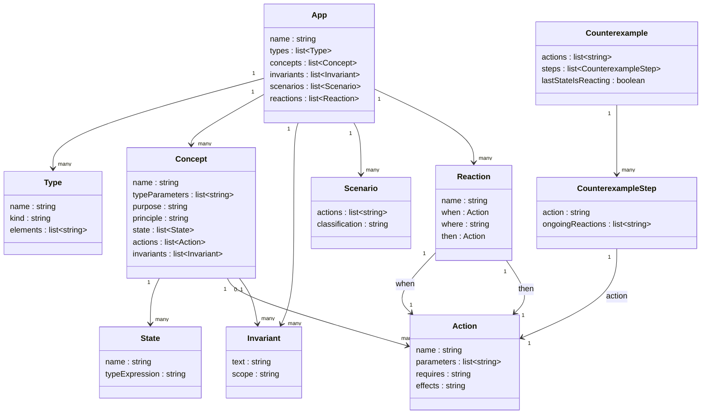

| 要素名 | 説明 |
|---|---|
| App | `application:` `types:` `concepts:` `invariants:` `scenarios:` `synchronizations:` の各セクションからなる完全/部分アプリケーション記述。`name` は `application:` の値。実装から補完 |
| Type | `types:` セクションの 1 行。`kind` は `a set` (通常の型) か `one special ... named` (単一の特殊値) を表す。実装から補完 |
| Concept | `concept:` `[TypeParam,...]` `purpose:` `principle:` `state:` `actions:` から構成。`principle` は動作原則の自然言語説明で、リポジトリの concept 定義ファイル 6 件 (`DeadLetterQueue.md` / `Label.md` / `Vault.md` / `Permalink.md` / `Registration.md` / `Rostering.md`) すべてに出現する。論文本文の Listing は `purpose` `state` `actions` のみ明示するため、`principle` は実装から補完 |
| State | `state:` セクションの 1 行。`typeExpression` は `Item -> set Tag` のような関係式。実装から補完 |
| Action | `action <name>(<params>)` `requires:` `effects:` の 3 点。実装のパーサ (`parse_markdown_action_params`) は名前とパラメータ名のみ機械的に抽出し、`requires` `effects` は自然言語のまま保持 |
| Reaction | `reaction <name>` `when <Action呼び出し>` `where <条件>` `then <Action呼び出しまたはerror>`。`then` は同一/別 Concept の Action、または特殊 `error` アクションを指す |
| Invariant | App レベルは `invariants:` セクションの 1 行の自然言語文。Concept レベル (例: Vault の `encrypted and decrypted are disjoint`) は Concept 自身に付随。`scope` は Alloy 検証時の top-scope (既定 3) を指し、実装から補完 |
| Scenario | `scenarios:` セクションの 1 行。`ok:` (positive) または `nok:` (negative) のプレフィックスと `;` 区切りの Action 列 |
| Counterexample | Alloy が返す Action 列。`lastStateIsReacting` は最終状態で Reaction が未解決 (pending) かどうかを表す。実装から補完 (`CounterexampleTrace` データ構造) |
| CounterexampleStep | Counterexample の 1 ステップ。実行された Action と、その直後の pending Reaction 集合。実装から補完 (`CounterexampleStep` データ構造) |

### Action と Reaction の違い

| 観点 | Action | Reaction |
|---|---|---|
| 所属 | 単一の Concept | App (Concept をまたぐ同期規則) |
| 役割 | Concept の State を変化させる基本操作 | ある Concept の Action 発火を検知し、別の Action を発火させる規則 |
| 記述形式 | `requires` (事前条件) と `effects` (事後効果) | `when` (発火条件となる Action) `where` (State 条件) `then` (発火させる Action) |
| 形式意味論上の対応 | 半オートマトン $C=(S,\Sigma,\delta,i)$ の遷移関数 $\delta$ | 合成オートマトンを監視する別のモニタ半オートマトン $\mathcal{M}_\mathcal{R}$ の遷移関数 $\delta_\mathcal{R}$ |
| 連鎖 | 単独では連鎖しない | `then` で発火した Action が別の Reaction の `when` を満たせば連鎖する (causal chain) |

### positive scenario と negative scenario の違い

| 観点 | positive scenario (`ok`) | negative scenario (`nok`) |
|---|---|---|
| 意味 | 合成された設計が許容すべき Action 列 | 合成された設計が拒否すべき Action 列 |
| 検証時の期待 | Alloy 上でその Action 列を先頭に持ち、その後いつか静定 (settled) する挙動が存在すること | そのような挙動が存在しないこと |
| ミスマッチの意味 | `ok` シナリオが不可能と判定された場合にミスマッチ | `nok` シナリオが可能と判定された場合にミスマッチ |
| 合成への制約の掛かり方 | 設計候補がその挙動を排除していないことを強制する (過剰な `error` 化を防ぐ) | 設計候補がその挙動を許していないことを強制する (誤った許容を防ぐ) |

positive/negative scenario は、Invariant だけで一意に定まらない設計空間を絞り込みます。同じ Invariant を満たす設計は複数存在し得るため、Scenario が「ユーザーが意図する設計」を検証可能な形で追加制約します。

### Invariant と Scenario の役割の違い

| 観点 | Invariant | Scenario |
|---|---|---|
| 検証対象 | App の全 State に対する恒常的な安全性制約 | 特定の Action 列に対する到達可能性/静定可能性 |
| 検証式 (LTL) | $\square(\neg\mathsf{reacting}(s,r) \Rightarrow I(s))$ と $\square(I(s) \Rightarrow \neg\mathsf{reacting}(s,r))$ | $\lozenge\square\neg\mathsf{reacting}(s,r) \Rightarrow \neg\bigwedge_{i=0}^{n}\bigcirc^i(a=A_i)$ の反例存在チェック |
| 役割 | 設計が満たすべき下限の安全性 (何を破ってはいけないか) を規定する | 設計が意図した挙動と一致するか (何を許し何を拒むか) を規定する |
| 過小制約の問題 | Invariant のみでは多数の異なる設計が同じ Invariant を満たしてしまい、意図しない (implausible な) 設計も許容される | Scenario は Invariant を補って設計空間を意図した設計に絞り込むが、最小限の Scenario では過学習 (overfitting) が起こり得る |

### Alloy 6 への翻訳対応

| Concept Design 側の要素 | Alloy 6 側の対応 |
|---|---|
| Concept の State | signature のフィールド |
| Concept の Action | signature とその事前/事後条件を表す predicate、および遷移を許す `pred` |
| Reaction | pending 状態を保持する reaction monitor 用 signature と、その発火/解消条件を表す fact/predicate |
| Invariant | 状態述語 $I(s)$ を表す predicate、および linear temporal logic の `always` 制約として encode される fact |
| Scenario | 各 Action の逐次実行を強制する `run` コマンドと、静定可能性を問う assertion (`check`) |
| Counterexample | Alloy Analyzer が返す instance 列 (XML)。実装 (`extract_counterexample_trace`) がこれを Action 列と pending Reaction 情報に変換する |

Alloy 6 のモデル検査は、非決定的な次アクション選択を 1 つの action 変数 $a$ で表現します。遷移関数が未定義な場合はシステムを stutter させ、遷移関係を全域化します。Alloy 6 を選ぶ理由は、次状態演算子 $\bigcirc$ を含む完全な線形時相論理をサポートし、Scenario の可能性判定に使えるためです。

## 構築方法

### 前提条件

| 項目 | 要件 |
| --- | --- |
| Python | 3.9 以降。`codex-cli` プラットフォームのみで使う場合、サードパーティ製 Python パッケージは不要 |
| Alloy 実行ファイル | `alloy` コマンドとして PATH 上にあるか、`--alloy-exec` で明示指定する |
| LLM プラットフォーム | `codex-cli` / `claude-api` / `gpt-api` / `deepseek-api` のいずれか 1 つ以上へのアクセス |

### インストール手順

1. リポジトリを clone します。

```sh
git clone https://github.com/alcinocunha/foundry.git
cd foundry
```

2. 使用するプラットフォームに応じて、任意で Python パッケージを追加インストールします。

```sh
pip install anthropic  # claude-api を使う場合
pip install openai     # gpt-api または deepseek-api を使う場合
```

`codex-cli` のみを使う場合、この手順は省略できます。

### 必要な環境変数

| プラットフォーム | 必要な環境変数 | 備考 |
| --- | --- | --- |
| `codex-cli` | なし | Codex CLI の ChatGPT ログイン/セッション認証を使用します。実行時に `OPENAI_API_KEY` と `CODEX_API_KEY` を環境変数から強制的に取り除き、API キー課金への誤フォールバックを防ぎます (`foundry_common.py` `_call_codex_cli`) |
| `claude-api` | `ANTHROPIC_API_KEY` | `pip install anthropic` が必要 |
| `gpt-api` | `OPENAI_API_KEY` | `pip install openai` が必要 |
| `deepseek-api` | `DEEPSEEK_API_KEY` | `pip install openai` が必要 (DeepSeek は OpenAI 互換 API を `base_url=https://api.deepseek.com` で利用) |

Foundry はモデル名からプラットフォームを推論します。推論できない場合は `--platform` / `--platform-reactions` / `--platform-alloy` / `--platform-scenarios` のいずれかで明示指定します。

| モデル名の特徴 | 推論されるプラットフォーム |
| --- | --- |
| `deepseek` で始まる | `deepseek-api` |
| `claude` で始まる、`anthropic/` で始まる、`sonnet` / `opus` / `haiku` を含む | `claude-api` |
| `gpt` / `chatgpt-` / `openai/` / `codex` で始まる、`o1` / `o3` / `o4` などの `o` 系型番 | `codex-cli` |
| 上記いずれにも一致しない | 推論不可 (`--platform*` の指定が必須) |

### Alloy 実行ファイルの準備

- 既定では `alloy` という名前で PATH を検索します。別名 `alloy6` も自動で候補に含めます。
- PATH で見つからない場合、追加の候補ディレクトリ (`~/.local/bin` 等) を探索します。
- アプリケーションバンドルの探索 (`/Applications/Alloy*.app` 等) は **macOS 限定**です。実装の `platform_app_candidates` が `sys.platform != "darwin"` で空リストを返すため、Linux と Windows では PATH と候補ディレクトリのみが対象になります。
- 見つからなかった場合はエラーにはならず、指定した文字列がそのまま実行コマンドとして使われます。実行時にコマンドが存在しなければ失敗します。
- 明示的に指定したい場合は `--alloy-exec <パスまたはコマンド名>` を渡します。

```sh
python3 foundry.py verify \
  --model-alloy gpt-5.5 \
  --alloy-exec /opt/alloy/bin/alloy6 \
  examples/NoDeadSensitiveMessages1.md
```

## 利用方法

### 必須パラメータ一覧

コマンドごとの必須パラメータです。個別の例に先立って、まずここで全体像を把握してください。

| サブコマンド | 必須の位置引数 | 必須オプション |
| --- | --- | --- |
| `synthesize` | `app` (partial app description ファイル) | `--model-reactions`, `--model-alloy` |
| `interactive` | `app` (partial app description ファイル) | `--model-reactions`, `--model-alloy` |
| `verify` | `app` (complete app description ファイル) | `--model-alloy` |
| `scenarios` | `app` (partial app description ファイル) | `--model-scenarios` |

`--model-*` に渡すモデル名からプラットフォームを推論できない場合は、対応する `--platform-*` (または `--platform`) の指定も必須になります。

### コマンドの選び方

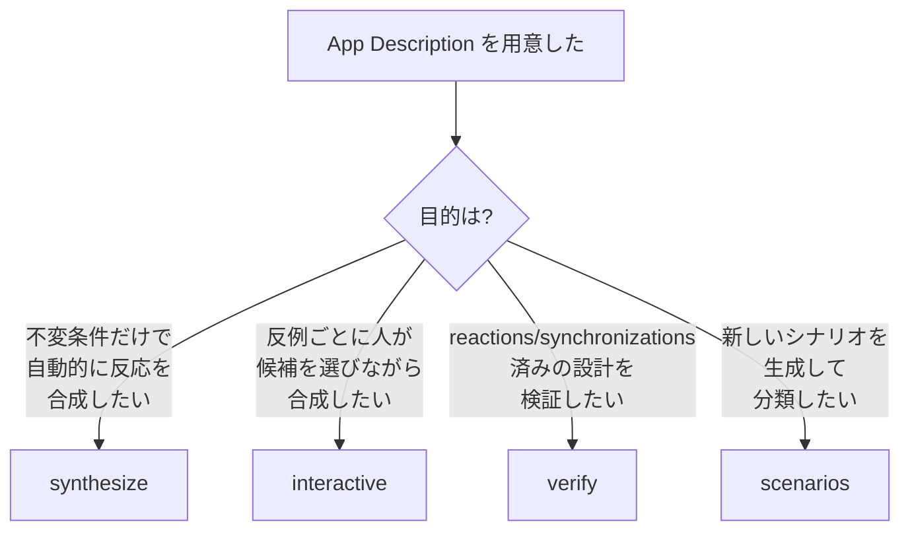

### CLI リファレンス

すべてのサブコマンドに共通する `--help` の呼び出し方です。

```sh
python3 foundry.py --help
python3 foundry.py <command> --help
```

#### 共通オプション

`--platform` と `--codex-exec` は `synthesize` / `interactive` / `verify` / `scenarios` の全サブコマンドに共通です。

| フラグ | 必須/任意 | デフォルト | 説明 |
| --- | --- | --- | --- |
| `--platform` | 任意 | なし (省略時はモデル名から推論) | `codex-cli` / `claude-api` / `gpt-api` / `deepseek-api` から選択。より具体的な `--platform-*` が未指定のときのデフォルトになる |
| `--codex-exec` | 任意 | `codex` | Codex CLI 実行ファイルのパスまたはコマンド名。`codex-cli` プラットフォームでのみ使用 |

#### `synthesize`

| フラグ | 必須/任意 | デフォルト | 説明 |
| --- | --- | --- | --- |
| `app` (位置引数) | 必須 | - | partial app description ファイル |
| `--concept-files` | 任意 (`nargs="*"`) | なし (省略時は `concepts` 節から `<Concept>.md` を自動推測) | concept 定義ファイル群 |
| `--model-reactions` | **必須** | - | reactions 生成に使うモデル名 |
| `--model-alloy` | **必須** | - | Alloy モデル生成/修復に使うモデル名 |
| `--platform-reactions` | 任意 | なし (`--platform` → モデル名推論の順で決定) | reactions 生成のプラットフォーム |
| `--platform-alloy` | 任意 | なし (同上) | Alloy モデル生成のプラットフォーム |
| `--alloy-exec` | 任意 | `alloy` | Alloy 実行ファイル |
| `--top-scope` / `--default-scope` | 任意 | `3` | Design チェックの top-level スコープ |
| `--max-iterations` | 任意 (`int`) | `10` | 合成〜検証の最大反復回数 |
| `--max-alloy-fixes` | 任意 (`int`) | `3` | Alloy がモデル/ツールエラーを報告した後、モデルに修復を依頼する最大回数 |
| `--output-dir` | 任意 | `tmp` | 生成した app バージョン、Alloy モジュール、ログ、反例トレースの出力先 |
| `--output-file` | 任意 | `<appname>_<model>.md` (カレントディレクトリ) | 結果の app description の出力先 |

#### `interactive`

| フラグ | 必須/任意 | デフォルト | 説明 |
| --- | --- | --- | --- |
| `app` (位置引数) | 必須 | - | partial app description ファイル |
| `--concept-files` | 任意 (`nargs="*"`) | なし (自動推測) | concept 定義ファイル群 |
| `--model-reactions` | **必須** | - | reactions 候補の提案に使うモデル名 |
| `--model-alloy` | **必須** | - | Alloy モデル生成/修復に使うモデル名 |
| `--platform-reactions` | 任意 | なし | reactions 提案のプラットフォーム |
| `--platform-alloy` | 任意 | なし | Alloy モデル生成/修復のプラットフォーム |
| `--alloy-exec` | 任意 | `alloy` | Alloy 実行ファイル |
| `--top-scope` / `--default-scope` | 任意 | `3` | Design チェックの top-level スコープ |
| `--max-iterations` | 任意 (`int`) | `20` | 最大反復回数 |
| `--max-alloy-fixes` | 任意 (`int`) | `3` | Alloy モデル修復依頼の最大回数 |
| `--num-alternatives` | 任意 (`int`) | `3` | 各反例に対してモデルに提案させる代替案の数 |
| `--steps` | 任意 (`int`) | `10` | check コマンドで使うステップ数 (Action スコープ) |
| `--output-dir` | 任意 | `tmp` | Alloy 成果物の出力先 |
| `--output-file` | 任意 | `<appname>_<model>.md` | 結果の app description の出力先 |

#### `verify`

| フラグ | 必須/任意 | デフォルト | 説明 |
| --- | --- | --- | --- |
| `app` (位置引数) | 必須 | - | 検証対象の complete app description ファイル |
| `--concept-files` | 任意 (`nargs="*"`) | なし (自動推測) | concept 定義ファイル群 |
| `--model-alloy` | **必須** | - | Alloy モデル生成/修復に使うモデル名 |
| `--platform-alloy` | 任意 | なし | Alloy モデル生成/修復のプラットフォーム |
| `--alloy-exec` | 任意 | `alloy` | Alloy 実行ファイル |
| `--top-scope` / `--default-scope` | 任意 | `3` | Design チェックの top-level スコープ |
| `--max-alloy-fixes` | 任意 (`int`) | `3` | Alloy モデル修復依頼の最大回数 |
| `--output-dir` | 任意 | `tmp` | Alloy モデル・ログの出力先 |

`verify` には `--output-file` がありません。新しい app description を生成せず、既存の設計を検証するだけのコマンドだからです。

#### `scenarios`

| フラグ | 必須/任意 | デフォルト | 説明 |
| --- | --- | --- | --- |
| `app` (位置引数) | 必須 | - | partial app description ファイル |
| `--concept-files` | 任意 (`nargs="*"`) | なし (自動推測) | concept 定義ファイル群 |
| `--model-scenarios` | **必須** | - | シナリオ生成に使うモデル名 |
| `--platform-scenarios` | 任意 | なし | シナリオ生成のプラットフォーム |
| `--batch-size` | 任意 (`int`) | `10` | 継続確認までに生成・分類するシナリオ数 |
| `--output-file` | 任意 | `<appname>_<model>.md` | 結果の app description の出力先 |

`scenarios` には `--alloy-exec` / `--top-scope` / `--output-dir` がありません。Alloy を使わないコマンドだからです。

### App Description の書き方

App Description は、部分的な app 定義から完全な app 定義まで、同じフォーマットの Markdown コードブロックで記述します。使用できるセクション名は次の 7 つです。

| セクション | 必須/任意 | 内容 |
| --- | --- | --- |
| `application` | 必須 | app 名 |
| `types` | 必須 | 使用する型の宣言 |
| `concepts` | 必須 | 使用する concept のインスタンス化 |
| `invariants` | 必須 | 満たすべき安全性不変条件 |
| `prompt` | 任意 | 合成を誘導する自然言語プロンプト |
| `scenarios` | 任意 | `ok:` / `nok:` で分類済みのシナリオ |
| `synchronizations` | 任意 | concept 間の反応 (reaction) 定義 |

最小構成の例です (`examples/NoDeadSensitiveMessages.md`)。

```text
application: NoDeadSensitiveMessages
types:
    a set Message
    a set Tag
    one special Tag named Sensitive
concepts:
    one DeadLetterQueue[Message] named Q
    one Label[Message,Tag] named L
invariants:
    there are no dead messages in Q labeled with Sensitive in L
```

`prompt` セクションを追加すると、自然言語プロンプトで合成を誘導できます (`examples/NoDeadSensitiveMessages1Prompt.md`)。

```text
application: NoDeadSensitiveMessages1Prompt
types:
    a set Message
    a set Tag
    one special Tag named Sensitive
concepts:
    one DeadLetterQueue[Message] named Q
    one Label[Message,Tag] named L
invariants:
    there are no dead messages in Q labeled with Sensitive in L
prompt:
    Tagging a dead message as sensitive triggers a retry.
    All other problematic behaviors must be forbidden.
```

`synchronizations` セクションまで含めた完成形の例です (`examples/NoDeadSensitiveMessages1.md`)。`verify` コマンドはこの形式の app を入力に取ります。

```text
application: NoDeadSensitiveMessages1
types:
    a set Message
    a set Tag
    one special Tag named Sensitive
concepts:
    one DeadLetterQueue[Message] named Q
    one Label[Message,Tag] named L
invariants:
    there are no dead messages in Q labeled with Sensitive in L
scenarios:
    nok: Q.submit(m); L.affix(m,Sensitive); Q.fail(m)
    ok:  Q.submit(m); Q.fail(m); L.affix(m,Sensitive); Q.retry(m)
synchronizations:
    reaction retry_sensitive_dead_message
    when
        L.affix(m,Sensitive)
    where
        m is in dead in Q
    then
        Q.retry(m)
    reaction prevent_sensitive_failure
    when
        Q.fail(m)
    where
        Sensitive is a label of m in L
    then
        error
```

`concepts` 節で参照した concept ごとに、定義ファイルが必要です。ファイル名は `<Concept名>.md` を Foundry が自動推測します。`DeadLetterQueue.md` の例です。

```text
concept: DeadLetterQueue[Message]
purpose: To process messages while isolating failed messages for later retry.
principle: A submitted message is pending until it succeeds or fails; failed messages can be retried individually, but clearing the dead-letter queue purges all failed messages.
state:
    pending: set Message
    dead: set Message
actions:
    submit(m:Message)
        requires: m is not in pending or dead
        effects: adds m to pending
    succeed(m:Message)
        requires: m is in pending
        effects: removes m from pending
    fail(m:Message)
        requires: m is in pending
        effects: moves m from pending to dead
    retry(m:Message)
        requires: m is in dead
        effects: moves m from dead to pending
    purge()
        requires: dead is not empty
        effects: removes all messages in dead
invariants: pending and dead are disjoint
```

自動推測に頼らずファイルを明示したい場合は `--concept-files` を使います。

```sh
python3 foundry.py synthesize \
  --model-reactions gpt-5.5 \
  --model-alloy gpt-5.5 \
  --concept-files examples/DeadLetterQueue.md examples/Label.md \
  examples/NoDeadSensitiveMessages.md
```

### Scenario ファイルの書き方

- `scenarios` セクションの各行は `ok:` または `nok:` で始まる分類ラベルに続けて、`;` 区切りのアクション列を書きます。
- `ok:` は「許容される挙動」、`nok:` は「起きてはならない挙動」を表します。

```text
scenarios:
    nok: Q.submit(m); L.affix(m,Sensitive); Q.fail(m)
    ok:  Q.submit(m); Q.fail(m); L.affix(m,Sensitive); Q.retry(m)
```

`scenarios` コマンドでシナリオを elicit した場合も、同じ `ok:` / `nok:` 形式で app description の `scenarios` 節に追記されます。

```text
scenarios:
    ok: Q.submit(m1); Q.fail(m1); L.affix(m1, Sensitive);
    ok: Q.submit(m1); Q.fail(m1); L.affix(m1, Sensitive); Q.retry(m1);
    nok: L.affix(m1, Sensitive); Q.submit(m1); Q.fail(m1);
```

対話中の分類入力は `[o]k` / `[n]ok` / `[s]kip` / `[q]uit` の 4 択です。

### 主要ユースケース別のコマンド例

#### ① 不変条件のみで合成する

`invariants` だけを頼りに `synthesize` を実行します。`prompt` も `scenarios` も持たない最小構成の app を渡します。

```sh
python3 foundry.py synthesize \
  --model-reactions gpt-5.5 \
  --model-alloy gpt-5.5 \
  examples/NoDeadSensitiveMessages.md
```

#### ② 自然言語プロンプトで誘導する

`prompt` セクションを含む app description を渡します。

```sh
python3 foundry.py synthesize \
  --model-reactions gpt-5.5 \
  --model-alloy gpt-5.5 \
  examples/NoDeadSensitiveMessages1Prompt.md
```

反例ごとに人が候補を選びたい場合は `interactive` を使います。

```sh
python3 foundry.py interactive \
  --model-reactions gpt-5.5 \
  --model-alloy gpt-5.5 \
  --num-alternatives 3 \
  examples/NoDeadSensitiveMessages1Prompt.md
```

#### ③ シナリオで誘導する

`ok:` / `nok:` で分類済みのシナリオを含む app description を渡します。

```sh
python3 foundry.py synthesize \
  --model-reactions gpt-5.5 \
  --model-alloy gpt-5.5 \
  examples/NoDeadSensitiveMessages1Scenarios.md
```

対話的に反例ごとの代替案を選びたい場合です。

```sh
python3 foundry.py interactive \
  --model-reactions gpt-5.5 \
  --model-alloy gpt-5.5 \
  --num-alternatives 3 \
  examples/NoDeadSensitiveMessages1Scenarios.md
```

#### ④ 既存設計の検証のみを行う

`synchronizations` まで完成した app description を `verify` に渡します。reactions は生成しません。

```sh
python3 foundry.py verify \
  --model-alloy gpt-5.5 \
  examples/NoDeadSensitiveMessages1.md
```

#### ⑤ シナリオ抽出 (elicitation)

`scenarios` コマンドで新しいシナリオを 1 件ずつ提案させ、対話的に `ok` / `nok` / `skip` / `quit` で分類します。`--batch-size` 件たまるごとに継続確認が入ります。

```sh
python3 foundry.py scenarios \
  --model-scenarios gpt-5.5 \
  examples/NoDeadSensitiveMessages.md
```

バッチサイズを変えたい場合です。

```sh
python3 foundry.py scenarios \
  --model-scenarios gpt-5.5 \
  --batch-size 5 \
  examples/NoDeadSensitiveMessages.md
```

## 運用

### 評価スコープ

> 出典: 論文 §5.1 Benchmark (Table 1: アプリケーション, Table 2: 12 設計変種)。

foundry の評価結果を、採用可否の判断材料に翻訳します。

対象範囲は以下のとおりです。

| 項目 | 内容 |
| --- | --- |
| ベンチマーク | 3 アプリケーション (NoDeadSensitiveMessages / CourseManagementSystem / OneTimeEvidenceLinks) × 12 設計変種 |
| 主評価の LLM 構成 | `gpt-5.5`、temperature 1、medium reasoning effort。各条件 3 独立 run |
| 補助クロスモデル確認 | Claude Fable 5。シナリオ誘導合成のみ、各変種 1 run。論文自身が「系統的なモデル間比較には不十分」と留保 |
| 検証バックエンド | Alloy Analyzer 6.3 + nuXmv 2.1 (bounded model checking) |
| 検証時間の実測環境 | Apple M1、16 GB メモリ |
| 実験時期 | 2026 年 6 月 |

評価の中核は「3 アプリ・12 変種・単一 LLM (gpt-5.5) 構成」です。Claude Fable 5 の結果は限定的な追試にとどまります。この 2 つを区別して読んでください。

### 検証時間の実測値 (RQ1)

> 出典: 論文 §5.2 Efficiency of Design Verification (Table 3)。

**測定方法**

- 手書きの意図設計 (`examples/*N.md`) を対象に、`check Design` コマンドの実行時間だけを計測します。LLM による Alloy 翻訳・反応生成の時間は計測の対象外です。
- スコープ (各型の最大エンティティ数) を 2〜4 で振りステップ数 (bounded trace の長さ) を 10 に固定する系列と、ステップ数を 8〜12 で振りスコープを 3 に固定する系列の 2 系列を計測します。
- 各条件を **3 回実行**し、平均秒数を報告します (再現用スクリプト `scripts/benchmark_verification_times.py` は合格 (`pass`) した run のみを平均に使い、`time.perf_counter()` で `check Design` の Alloy 呼び出し区間だけを計測します)。

```sh
python3 scripts/benchmark_verification_times.py \
  --model-alloy gpt-5.5 --alloy-exec /path/to/alloy
```

**実測値 (平均秒、N=3 run/条件)**

| 変種 | scope2 | scope3 | scope4 | step8 | step9 | step10 | step11 | step12 |
| --- | --- | --- | --- | --- | --- | --- | --- | --- |
| NoDeadSensitiveMessages 1 | 1.16 | **2.16** | 3.73 | 1.42 | 1.76 | **2.16** | 3.29 | 2.92 |
| NoDeadSensitiveMessages 2 | 1.00 | **1.37** | 2.35 | 1.03 | 1.22 | **1.37** | 1.59 | 1.84 |
| NoDeadSensitiveMessages 3 | 1.18 | **2.31** | 3.98 | 1.37 | 1.71 | **2.31** | 2.51 | 3.81 |
| NoDeadSensitiveMessages 4 | 1.52 | **2.34** | 6.14 | 1.56 | 1.81 | **2.34** | 3.15 | 4.74 |
| CourseManagementSystem 1 | 1.70 | **11.21** | 90.82 | 3.52 | 7.56 | **11.21** | 17.65 | 32.77 |
| CourseManagementSystem 2 | 2.73 | **43.85** | 593.64 | 9.57 | 15.23 | **43.85** | 63.85 | 156.04 |
| CourseManagementSystem 3 | 2.02 | **21.04** | 134.16 | 4.20 | 7.88 | **21.04** | 44.40 | 76.27 |
| CourseManagementSystem 4 | 3.47 | **34.81** | 745.48 | 6.00 | 15.00 | **34.81** | 74.35 | 233.24 |
| OneTimeEvidenceLinks 1 | 2.76 | **21.00** | 88.52 | 4.52 | 8.92 | **21.00** | 49.73 | 135.36 |
| OneTimeEvidenceLinks 2 | 3.02 | **42.88** | 164.29 | 6.67 | 24.46 | **42.88** | 117.24 | 256.69 |
| OneTimeEvidenceLinks 3 | 2.57 | **15.76** | 47.83 | 4.34 | 8.67 | **15.76** | 34.52 | 89.53 |
| OneTimeEvidenceLinks 4 | 3.07 | **31.18** | 129.91 | 6.35 | 15.27 | **31.18** | 63.50 | 158.54 |

太字は既定値 (scope3・step10) です。Alloy Analyzer 自体の既定値でもあります。

**読み取り**

- スコープを 1 段上げるコストは、ステップ数を 1 段上げるコストより一貫して大きいです。CourseManagementSystem の一部変種では scope3→4 で 1 桁以上増えます (変種 4 は 34.81 秒→745.48 秒)。
- scope3・step10 なら全 12 変種が 1 分未満で検証できます。この条件が「対話的な CEGIS ループを回せる」実用上の下限です。
- より高いスコープが必要な高安全性設計は、対話ループの外でオフライン合成してください (CourseManagementSystem 2 は scope4 で約 10 分)。

### 合成の反復回数 (RQ2: invariant のみを入力)

> 出典: 論文 §5.3 Invariant-guided Synthesis (Table 4)。

不変条件だけを入力にした場合の反復回数と、3 run の結果の一致度です。

| アプリケーション | 反復回数 (3 run) | 収束した設計の種類数 | 妥当と判定された設計数 |
| --- | --- | --- | --- |
| NoDeadSensitiveMessages | 1 / 1 / 1 | 2 種類 | 0 / 3 |
| CourseManagementSystem | 2 / 1 / 1 | 3 種類 | 3 / 3 |
| OneTimeEvidenceLinks | 2 / 1 / 1 | 3 種類 | 3 / 3 |

- 反復上限は 10 です。9 run 中 7 run が初回で検証を通過し、2 run が反例 1 回で修復しました。
- NoDeadSensitiveMessages は検証を通過する一方、2 種類とも「アプリドメインの暗黙の期待」に反する不自然な設計でした (例: センシティブラベルを外して不変条件を満たすごまかし)。
- 3 アプリ中 1 つだけが「3 run とも同じ設計」に収束しました。invariant だけで設計空間を絞り込む限界を示す数値です。

### 誘導方式ごとの意図再現度 (RQ3: プロンプト誘導 vs シナリオ誘導)

> 出典: 論文 §5.4 Scenario- vs Prompt-guided Synthesis (Table 5)。

方式ごとに反復回数 (3 run) を並べています。**†** は「検証を通過した一方、意図した設計と等価でないと判定された run」です。空欄は「初回入力で全 run が意図設計に収束し、修正が不要だった」ことを意味します。

| 変種 | プロンプト初回 | プロンプト修正後 | シナリオ Pos/Neg (初回) | シナリオ初回 | シナリオ修正後 Pos/Neg | シナリオ修正後 |
| --- | --- | --- | --- | --- | --- | --- |
| NoDeadSensitiveMessages 1 | 1 1 1 | — | 1 / 1 | 1 1 1 | — | — |
| NoDeadSensitiveMessages 2 | 1 1 1 | — | 1 / 1 | 1 1 1 | — | — |
| NoDeadSensitiveMessages 3 | 1 1 1 | — | 2 / 1 | 2 1 2 | — | — |
| NoDeadSensitiveMessages 4 | 1 1 2 | — | 2 / 1 | 3† 6† 4† | 3 / 1 | 1 1 5 |
| CourseManagementSystem 1 | 1 1 3 | — | 1 / 7 | 1 1 1 | — | — |
| CourseManagementSystem 2 | 2 2 1 | — | 4 / 7 | 2 1 6 | — | — |
| CourseManagementSystem 3 | 1 1 1 | — | 2 / 7 | 2 2 3 | — | — |
| CourseManagementSystem 4 | 5† 6 2 | 4 3 4 | 3 / 6 | 3† 2 3† | 7 / 6 | 2 3 3 |
| OneTimeEvidenceLinks 1 | 2† 2 3 | 1 1 1 | 3 / 5 | 1 2 1 | — | — |
| OneTimeEvidenceLinks 2 | 2 2 1† | 3 3 1 | 3 / 5 | 1 1 2 | — | — |
| OneTimeEvidenceLinks 3 | 1 1 2 | — | 2 / 6 | 3 1 4 | — | — |
| OneTimeEvidenceLinks 4 | 1† 2† 2† | 1 1 3† | 4 / 7 | 4 6 7 | — | — |

母数は各セル 3 run です。フェーズごとに母数が異なる点に注意してください。**初回フェーズ**は 12 変種すべてが対象のため 12 × 3 = **36 run/方式**です。**修正後フェーズ**は初回で失敗した変種のみが対象のため、プロンプト誘導が 4 変種 × 3 = **12 run**、シナリオ誘導が 2 変種 × 3 = **6 run** です。合計は 36 + 36 + 12 + 6 = **90 run** で、論文本文の "across all 90 runs" と一致します。

**要点**

- 初回入力 (最小限のシナリオ・シンプルなプロンプト) だけで意図設計に一貫して収束したのは、シナリオ誘導 10/12 変種、プロンプト誘導 8/12 変種です。
- 1 回だけ許した修正を経ると、シナリオ誘導は 12/12 変種で収束しました。プロンプト誘導は OneTimeEvidenceLinks 4 の 1 run (3 run 中 1 run) が最後まで不一致のままでした。
- 収束までの反復回数の平均は、論文本文の記載でプロンプト誘導 1.79、シナリオ誘導 2.36、両方式・両フェーズ合わせた全 90 run で 2.06 です。
- シナリオはプロンプトより意図設計への到達率が高い一方、記述量は多くなりがちです (例: 「他の問題行動はすべて禁止」の一文に相当する内容を、シナリオでは全列挙します)。

### シナリオ抽出 (RQ4: LLM によるシナリオ提案)

> 出典: 論文 §5.5 Scenario Elicitation (Table 6)。

ユーザーがシナリオを書く代わりに、LLM に提案させて ok/nok を分類する方式です。10 件バッチと 20 件バッチをそれぞれ 1 回生成し、分類済みバッチから合成を 3 回実行します。

| 変種 | Pos/Neg (10件) | 反復回数 (10件バッチ, 3 run) | Pos/Neg (20件) | 反復回数 (20件バッチ, 3 run) | Overlap (10件中の一致数) |
| --- | --- | --- | --- | --- | --- |
| NoDeadSensitiveMessages 1 | 8 / 2 | 1 2 3 | 12 / 8 | 1 1 1 | 5 |
| NoDeadSensitiveMessages 2 | 6 / 4 | 1 1 2 | 12 / 8 | 1 2 1 | 7 |
| NoDeadSensitiveMessages 3 | 5 / 5 | 失敗† 4† 3 | 8 / 12 | 1 1 2 | 6 |
| NoDeadSensitiveMessages 4 | 7 / 3 | 1† 2† 2† | 8 / 12 | 2 2 1 | 6 |
| CourseManagementSystem 1 | 2 / 8 | 2 1† 1† | 6 / 14 | 3 3 4 | 8 |
| CourseManagementSystem 2 | 6 / 4 | 2 5 3 | 9 / 11 | 4 2 2 | 7 |
| CourseManagementSystem 3 | 4 / 6 | 1† 2† 2† | 6 / 14 | 3 5 2 | 9 |
| CourseManagementSystem 4 | 6 / 4 | 3† 2† 3† | 7 / 13 | 2† 7† 4† | 6 |
| OneTimeEvidenceLinks 1 | 4 / 6 | 1† 2† 1† | 13 / 7 | 2 2 2 | 9 |
| OneTimeEvidenceLinks 2 | 6 / 4 | 4 3 3 | 12 / 8 | 4† 2† 2† | 8 |
| OneTimeEvidenceLinks 3 | 4 / 6 | 1 1 3 | 12 / 8 | 3 1 2 | 9 |
| OneTimeEvidenceLinks 4 | 5 / 5 | 2† 2† 2† | 8 / 12 | 3† 3 2† | 10 |

**†** は意図設計と非等価です。「失敗†」は、モデルがシナリオを矛盾と判断して設計生成を拒否した run を指します。Overlap は「10 件バッチで分類した 10 件のうち、20 件バッチの最初の 10 件にも同じ (前状態・違反アクションが同じ) シナリオが提案された件数」です。

**要点**

- 10 件バッチでは 12 変種中 5 変種、20 件バッチでは 12 変種中 9 変種で、3 run すべてが意図設計に収束しました。
- 反復回数の平均はバッチサイズにほぼ依存しません (10 件バッチ 2.11、20 件バッチ 2.36。20 件バッチはシナリオ手動作成時の 2.36 と一致)。
- Overlap は 12 変種中 1 変種のみ 10/10 で一致し、最小 5、平均 7.5 でした。シナリオ抽出自体の非決定性が大きく、「20 件の方が常に良い」とは限りません (OneTimeEvidenceLinks 2 は 10 件バッチの方が有益な情報を含みます)。

### 再現性 (同じ入力で run 1/2/3 が一致するか)

| 観点 | 母数 (N) | 結果 |
| --- | --- | --- |
| invariant のみ: 3 run が同一設計に収束したアプリ数 | 3 アプリ | 1/3 アプリのみ 3 run とも同一設計 (残り 2 アプリは各 3 種類の異なる設計) |
| シナリオ誘導 (最小限シナリオ, 初回): 3 run 全てが意図設計と非等価だった変種数 | 12 変種 | 1/12 変種 (NoDeadSensitiveMessages 4)。修正後は 0/12 |
| プロンプト誘導 (修正後): 3 run 全てが意図設計に収束しない変種数 | 12 変種 | 1/12 変種 (OneTimeEvidenceLinks 4、3 run 中 1 run が最後まで不一致) |
| シナリオ抽出バッチ間の一致 (Overlap) | 12 変種 | 10/10 一致は 1/12 変種のみ。最小 5、平均 7.5 |

「検証を通った (verified)」ことと「毎回同じ設計になる」ことは別の性質です。運用では、反復回数に加えて run 間の設計一致率も確認してください。

### 失敗モードの発生頻度 (RQ5)

> 出典: 論文 §5.6 Failure modes。母数の内訳に筆者算出を含む箇所は表内に明記。

| 失敗モード | 母数 (N) | 発生数 |
| --- | --- | --- |
| 重要シナリオの欠落 (missing critical scenarios) | RQ4 の 72 run (12 変種 × 2 バッチ × 3 run) | 26 run |
| シナリオへの過適合 (overfitting) | 全 scenario-guided run 114 run (RQ3 シナリオ誘導 42 run [初回 36 + 修正後 6] + RQ4 72 run。論文記載の各母数から筆者算出) | 8 回 |
| シナリオ矛盾の誤診断 (モデルが「矛盾している」と誤判断し生成を拒否) | 上記と同じ母数の範囲内 | 1 回 (NoDeadSensitiveMessages 3, 10件バッチ run1) |
| 冗長な反応・条件 (意図設計と等価な成功 run に限定) | 意図設計を合成できた 82 run | 15 run |

## ベストプラクティス

### 不変条件だけでは設計が過少仕様になる

- invariant のみの合成は、RQ2 で 3 アプリ中 2 アプリが 3 種類の異なる設計に分岐しました。
- NoDeadSensitiveMessages では、検証を通過する一方で業務的に不自然な設計 (センシティブラベルを剥がして不変条件を回避する等) が 3 run 中 3 run とも生成されました。
- **推奨**: invariant 単体の合成結果は候補どまりと扱ってください。必ずシナリオ (またはプロンプト) を追加で与え、収束後に人手でプラウジビリティを確認してください。

### シナリオの過適合 (overfitting) への対処

- 最小限のシナリオ (問題行動ごとに 1 つの最短プレフィックス) だけを与えると、モデルは「たまたま与えた具体的な個数」に固執した反応を生成しがちです。例: 「死んだメッセージが 2 件のときだけ再試行する」反応。
- 過適合は scenario-guided synthesis の失敗原因として 2 番目に多い要因でした (8 回。母数の算出は上表参照)。
- **推奨**:
  - カスケード修復・数量化された修復を含む変種では、登場するエンティティ数を変えたシナリオを複数用意してください (例: 2 件・3 件の両方)。
  - 過適合が疑われる場合の修正は追加的 (additive) に行えます。NoDeadSensitiveMessages 4 では、3 件のエンティティを含むシナリオを 1 つ追加するだけで 3 run 全てが収束しました。

```text
ok: Q.submit(m); Q.fail(m); Q.submit(n); Q.fail(n); Q.submit(s);
    Q.fail(s); L.affix(s,Sensitive); Q.retry(n); Q.retry(m); Q.purge();
```

### 非決定性 (同一入力で結果が割れる) への対処

- 同じ入力でも LLM の出力は run ごとに変わります。invariant のみの合成、シナリオ誘導合成、シナリオ抽出のいずれでも run 間の不一致が観測されています (前掲の「再現性」表)。
- **推奨**:
  - 本番採用前に、同じ入力で最低 3 回合成し、生成された設計 (または反応の集合) を比較してください。論文の評価方法自体がこの方式 (各条件 3 run) です。
  - シナリオ抽出を使う場合は、1 回のバッチ生成結果を暫定値として扱ってください。Overlap が平均 7.5/10 にとどまるため、バッチを変えると異なるシナリオ集合になり得ます。
  - 生成された設計同士が「意図と同じ」かどうかの判定は現状手動です。論文も「自動的な等価性検査は将来課題」と明記しており、foundry の現行機能の範囲外です。

### Alloy scope の決め方

- scope を 1 段階上げるコストは、ステップ数を 1 段階上げるコストより明確に大きいです (「検証時間の実測値」参照)。
- 論文の既定値は **scope 3・step 10** です。この条件で 12 変種すべてが 1 分未満で検証できます。
- **推奨**:
  - 対話的な CEGIS ループ (`synthesize` / `interactive`) は scope 3・step 10 (Alloy Analyzer の既定値と同じ) から始めてください。`--top-scope N` で変更できます。
  - より高い安全性が要求される設計では scope を上げられます。その場合は対話ループの外でオフライン実行してください (scope 4 では一部変種が 10 分超)。
  - scope を上げて反例が出ない状態は、無条件の正しさとは別物です (下記「"verified" という言葉の射程を混同しない」参照)。scope を上げる目的は見落としの削減であり、証明の完成とは別です。

### 人間のレビュー負荷をどこに配分するか

- シナリオを人手で書く方式 (RQ3) と、LLM に提案させて分類するだけの方式 (RQ4) を比べると、後者は「執筆」の負荷を「分類」の負荷に置き換えます。
- ただし分類方式は網羅性の担保に人手の工夫が必要です。10 件バッチでの成功率は 5/12 変種にとどまり、20 件でも 9/12 です。
- 失敗の主因は「重要シナリオの欠落」(72 run 中 26 run) であり、モデルが自発的に多様なシナリオを網羅する能力の限界を示します。
- **推奨**:
  - シナリオを人手で書く場合は、代表的な問題行動ごとに「最短の反例」と「その修復」をセットで書くことにレビュー時間を割いてください (論文の執筆方法論そのものです)。
  - LLM 抽出したシナリオを分類する場合は、分類作業に加えて「代替の修復順序」や「異なる個数のケース」が抽出結果に含まれるかを確認する工程を追加してください。代替修復の網羅は抽出プロトコルの保証範囲外です (論文 Conclusion が明記する未解決課題)。

### "verified" という言葉の射程を混同しない

> 出典: 論文 §5.7 Threats to Validity (Internal validity)。

foundry が返す「verified」には、実務上見落としやすい 2 つの限界があります。両方とも Threats to Validity (Internal validity) の記載に基づきます。

1. **自然言語→Alloy の翻訳段が LLM 依存です。**
   invariant と reaction の条件は自然言語で書き、foundry は LLM で Alloy に翻訳してから検証します。翻訳誤りは false positive (誤って正しいと判定) にも false negative (誤って不正と判定) にもなり得ます。著者は最終的に検証を通った設計の Alloy 翻訳を「おおむね」目視確認しましたが、網羅的な検査とは別であり、中間反復での翻訳誤りは確認の対象外です。
2. **検証は有界 (bounded) です。**
   「verified」は「指定したスコープとステップ数の範囲内で反例がない」という意味であり、無制限の正しさとは別物です。scope を上げれば新たな反例が見つかる可能性があります。

**推奨**:

- 「verified」という結果だけで採用可否を最終判断するのは避けてください。特に重要な不変条件については、①最終的な Alloy 翻訳を人手でレビューする、②スコープを上げて再検証する、の 2 段階を採用前に挟んでください。
- レポートや意思決定資料に検証結果を書く際は、常に「scope N・step M で検証済み」のように条件を明記してください。「検証済み」とだけ書くと有界性の情報が失われます。

## トラブルシューティング

| 症状 | 原因 | 対処 |
| --- | --- | --- |
| Alloy 実行時にクラッシュする / `FileNotFoundError: [Errno 2] No such file or directory: 'alloy'` | `--alloy-exec` が未指定または誤りで、`alloy` が PATH・macOS の `/Applications/Alloy*.app`・`~/.local/bin` 等の既知の場所に見つからない。`find_executable()` が探索に失敗すると要求文字列 (既定 `alloy`) をそのまま返し、Alloy 呼び出し (`run_alloy` / `run_scenario`) は `subprocess.run` の `FileNotFoundError` を捕捉しないため、未処理例外としてクラッシュする | `--alloy-exec /path/to/alloy` (または `.app` バンドルのパス) を明示的に渡す。Codex CLI の呼び出しは同種のエラーを `RuntimeError("Could not find Codex CLI executable: ...")` として捕捉するが、Alloy 側に同等のガードはない点に注意する |
| `Could not infer AI platform for <purpose> model '<model>'. Pass --platform or the corresponding --platform-<purpose> option.` | モデル名からプラットフォームを自動推定できない (`infer_platform_for_model` が `gpt` / `chatgpt-` / `claude` / `sonnet` 等の既知パターンに一致しない) | `--platform` または `--platform-reactions` / `--platform-alloy` / `--platform-scenarios` を明示的に指定する |
| `DEEPSEEK_API_KEY environment variable is not set.` | `deepseek-api` プラットフォームを使うのに環境変数が未設定 | `DEEPSEEK_API_KEY` を設定する。`claude-api` / `gpt-api` は SDK 側 (`anthropic` / `openai` パッケージ) が鍵未設定を検知して例外を出すため、foundry 独自のメッセージは出ない |
| `codex-cli` 実行時に ChatGPT ログインでなく API 課金に切り替わってしまう / 想定外の課金経路になる | `codex-cli` 呼び出しは `CODEX_API_KEY` と `OPENAI_API_KEY` を明示的に環境から除去し、ChatGPT ログインセッションで実行する設計になっている。ローカル環境の `.env` 等でこれらが強制されていると、Codex CLI 側の挙動と食い違うことがある | `codex` コマンド単体で ChatGPT ログイン済みか確認する。foundry 側は意図的に API キーを無効化しているため、鍵を使わせたい場合はこの設計を理解した上で `codex` を直接呼ぶ運用に切り替える |
| 合成が反例を繰り返し、`Reached max iterations (N) without proving correctness.` で終了する (`synthesize` / `interactive` 共通、終了コード 1) | (a) invariant だけでは設計空間が広すぎる、(b) シナリオが最小限すぎて過適合を誘発している、(c) 与えたシナリオ集合が実際には矛盾しており、モデルが設計生成を拒否している (RQ4 で 1 件観測) | `--max-iterations` を増やす前に、まずシナリオを追加して制約を強める。過適合が疑われる場合は「ベストプラクティス > 過適合への対処」の手順でエンティティ数を変えたシナリオを足す。モデルが「矛盾している」と主張する場合は、当該シナリオの前状態・順序を人手で見直す |
| Alloy モデルの生成・修復が `--max-alloy-fixes` 回失敗し `[error] Alloy analysis failed after repair attempts (model/tool error).` で止まる | LLM が生成した `.als` に構文/意味エラーがあり、モデルへの自己修復依頼 (既定 3 回) でも解消しない | `--max-alloy-fixes` を増やす。`tmp/` (既定の `--output-dir`) に保存された未スコープ版 Alloy モデル・生のモデル応答・プロンプトを確認し、手動で `.als` を修正する経路もある (`save_unscoped_alloy_model` が該当ファイルを書き出す) |
| モデルが app description を返さず `Model did not return a valid complete app description.` で失敗する | LLM の出力が foundry の期待するアプリ記述フォーマットを満たしていない (`is_valid_complete_app_description` が false) | エラーメッセージが指す `tmp/` 配下のデバッグファイル (不正な出力・生レスポンス・送信プロンプト) を確認する。プロンプトが長すぎる/曖昧な場合は入力の `types` / `concepts` / `invariants` セクションを簡潔にする |
| scope を上げてから検証コマンドが返ってこない (ハングしたように見える) | foundry は Alloy への `subprocess.run` にタイムアウトを設定していない。scope 増加はほぼ指数的に時間が伸びるため (実測値表参照。CourseManagementSystem 2 は scope4 で約 10 分)、より高い scope では非常に長時間かかり得る | 実測値表を目安にスコープを見積もる。長時間かかる検証は対話ループの外でオフライン実行し、必要なら手動で `Ctrl+C` により中断する。自動タイムアウトは存在しないため、実行時間の上限は呼び出し側で管理する |

## まとめ

本論文は Concept Design のリアクションに形式意味論を与え、LLM の候補提案と Alloy 6 の有界モデル検査を組み合わせた CEGIS 型の合成手順を提案しました。不変条件だけを渡すと設計は過少仕様になり実行ごとに揺れますが、肯定・否定シナリオという機械検証できる誘導を加えると、12 バリアントすべてが意図した設計に収束します。

要件を文章で書き切ろうとせず、概念・不変条件・具体シナリオの三層に分けて設計する型として応用できます。

この記事が少しでも参考になった、あるいは改善点などがあれば、ぜひリアクションやコメント、SNSでのシェアをいただけると励みになります！

## 参考リンク

### 一次情報 (本論文)

- [Verified LLM-Driven Synthesis for Concept Design (arXiv:2607.15718)](https://arxiv.org/abs/2607.15718): Alcino Cunha (INESC TEC & Universidade do Minho)、2026-07-17 投稿、cs.SE
- [paper/foundry.tex](https://github.com/alcinocunha/foundry/blob/main/paper/foundry.tex): 論文の LaTeX ソース。本調査の記述は abstract ではなくこの全文を一次情報としています
- [paper/references.bib](https://github.com/alcinocunha/foundry/blob/main/paper/references.bib): 「学術的系譜」の出典

### 参照実装 (foundry)

- [alcinocunha/foundry](https://github.com/alcinocunha/foundry): 参照実装本体。Python / MIT ライセンス
- [README.md](https://github.com/alcinocunha/foundry/blob/main/README.md): インストール手順・App Description フォーマットの一次情報
- [foundry.py](https://github.com/alcinocunha/foundry/blob/main/foundry.py): CLI 本体。本記事の CLI リファレンスは argparse 定義から直接抽出しています
- [foundry_common.py](https://github.com/alcinocunha/foundry/blob/main/foundry_common.py): `ModelClient`・Alloy 実行・反例解析
- [scripts/benchmark_verification_times.py](https://github.com/alcinocunha/foundry/blob/main/scripts/benchmark_verification_times.py): 検証時間の測定方法 (計測区間・平均化方法)

### 実験成果物・記述例 (examples)

- [DeadLetterQueue.md](https://github.com/alcinocunha/foundry/blob/main/examples/DeadLetterQueue.md): 概念定義の実例
- [Label.md](https://github.com/alcinocunha/foundry/blob/main/examples/Label.md) / [Vault.md](https://github.com/alcinocunha/foundry/blob/main/examples/Vault.md): 概念定義の実例
- [NoDeadSensitiveMessages.md](https://github.com/alcinocunha/foundry/blob/main/examples/NoDeadSensitiveMessages.md): 部分アプリ記述 (不変条件のみ)
- [NoDeadSensitiveMessages1.md](https://github.com/alcinocunha/foundry/blob/main/examples/NoDeadSensitiveMessages1.md): 完成アプリ記述 (`synchronizations` を含む)
- [NoDeadSensitiveMessages1Prompt.md](https://github.com/alcinocunha/foundry/blob/main/examples/NoDeadSensitiveMessages1Prompt.md): プロンプト誘導の入力例
- [NoDeadSensitiveMessages1Scenarios.md](https://github.com/alcinocunha/foundry/blob/main/examples/NoDeadSensitiveMessages1Scenarios.md): シナリオ誘導の入力例
- [NoDeadSensitiveMessages1_gpt-5.5_10scenarios.md](https://github.com/alcinocunha/foundry/blob/main/examples/NoDeadSensitiveMessages1_gpt-5.5_10scenarios.md): シナリオ抽出の出力例
- [CourseManagementSystem.md](https://github.com/alcinocunha/foundry/blob/main/examples/CourseManagementSystem.md) / [CourseManagementSystem1.md](https://github.com/alcinocunha/foundry/blob/main/examples/CourseManagementSystem1.md) / [CourseManagementSystem1Scenarios.md](https://github.com/alcinocunha/foundry/blob/main/examples/CourseManagementSystem1Scenarios.md): 3 つ目の評価対象アプリの記述例

### 学術的系譜 (論文の参考文献より)

本節は論文の `references.bib` に収録された文献です。URL は同ファイルに記載があるもののみ添えています。

| 文献 | 年 | 本論文との関係 |
|---|---|---|
| Daniel Jackson, *The Essence of Software: Why Concepts Matter for Great Design* | 2021 | Concept Design の原典。本論文が形式意味論を与える対象 |
| Solar-Lezama, *Program synthesis by sketching* | 2008 | CEGIS の原典。本論文の合成ループの土台であり、本論文の発明ではない |
| [Uchitel et al., *Synthesis of behavioral models from scenarios*](https://doi.org/10.1109/TSE.2003.1178048) | 2003 | シナリオからの振る舞いモデル合成という系譜 |
| Alur et al., *Synthesizing Finite-State Protocols from Scenarios and Requirements* | 2014 | シナリオと要求を併用する合成の先行研究 |
| Austin et al., *Program synthesis with large language models* | 2021 | LLM による合成の先行研究 |
| Hong et al., *On the effectiveness of large language models in writing Alloy formulas* | 2025 | LLM の Alloy 記述能力に関する先行研究。本論文の「翻訳段が LLM 依存」という限界に直結 |
| Wilczyński et al., *Concept-centric software development: An experience report* | 2023 | Concept Design の実務適用報告 |
| Caragay et al., *Beyond dark patterns: A concept-based framework for ethical software design* | 2024 | Concept Design の応用 |
