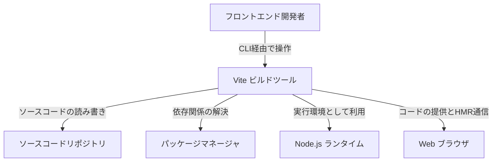
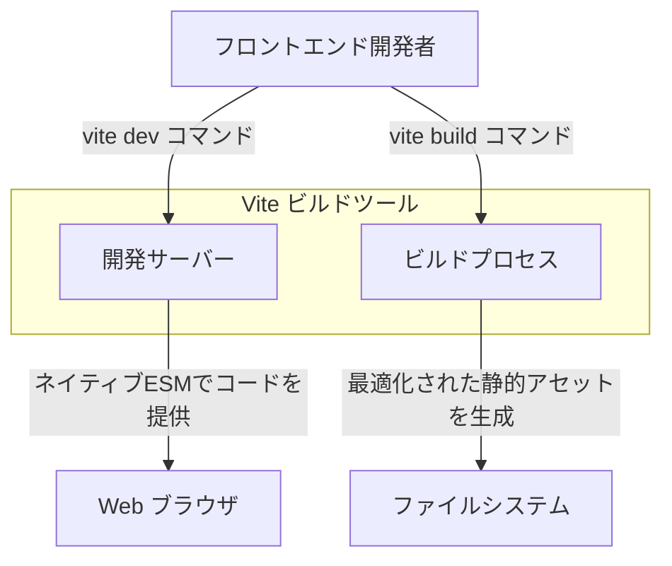
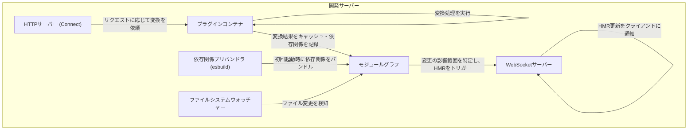
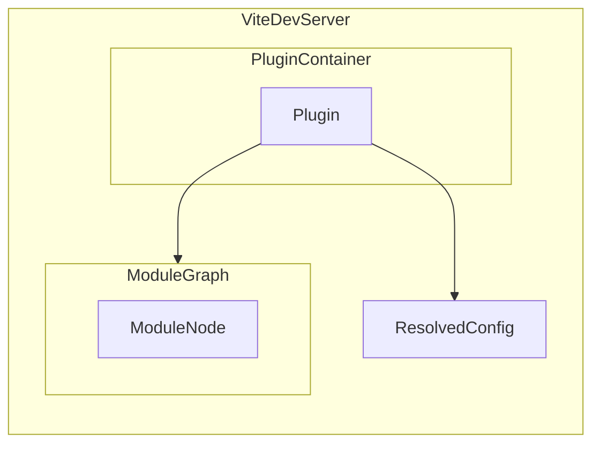
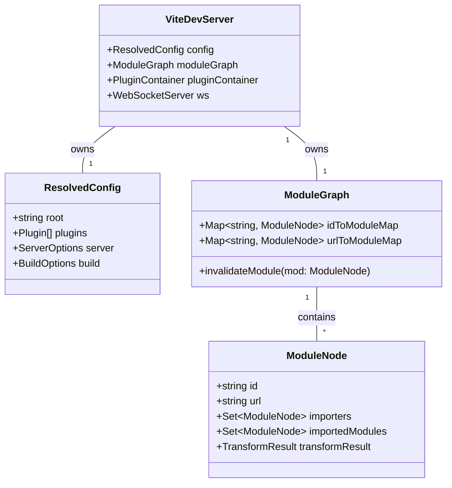

## ■概要

Vite（ヴィート）は、モダンなWebプロジェクトのために設計された、高速かつ効率的なフロントエンドビルドツールです。
その中核は、役割の異なる2つの主要コンポーネントで構成されています。

* **開発サーバー**: ネイティブESモジュール（ESM）を利用してソースファイルをオンデマンドで提供し、非常に高速なホットモジュールリプレースメント（HMR）を実現します。
* **ビルドコマンド**: 本番環境向けに最適化された静的アセットを出力します。実績のあるRollupを使用してコードをバンドルします。

この「開発時はバンドルせず、本番時は高度に最適化する」という**デュアルモードアーキテクチャ**が、Viteの最大の特徴であり、その高速性を支える基盤となっています。

## ■特徴

Viteが提供する優れた開発体験は、ESMファーストな設計思想に由来します。

* **即時サーバー起動**: アプリケーション全体を事前にバンドルする必要がありません。ブラウザからのリクエストに応じて必要なモジュールだけをその場で変換・提供するため、プロジェクト規模が増大しても起動時間はほぼ一定です。
* **超高速HMR**: ファイルを変更した際、そのモジュールと直接の依存関係のみを無効化します。プロジェクト全体の再バンドルを回避するため、大規模アプリであっても瞬時にブラウザへ反映されます。
* **豊富な標準機能**: TypeScript、JSX、CSS Modulesなどを追加設定なし（ゼロコンフィグ）で利用できます。これらはGo製の高速なesbuildを用いてオンデマンドで変換されます。
* **最適化された本番ビルド**: Rollupを採用し、自動的なチャンク分割、Tree Shaking、レガシーブラウザ向けのポリフィル注入などを標準でサポートします。
* **強力なプラグインシステム**: Rollup互換のプラグインインターフェースに加え、開発サーバー専用のフックも提供されており、高い拡張性を有します。

## ■アーキテクチャ

Viteの内部構造を、C4モデルを用いて3つのレベルで詳細化します。

### ●Level 1: システムコンテキスト図

開発エコシステムにおけるViteの位置づけと、外部要素との相互作用を示します。Viteは、開発者が記述したソースコードを、ブラウザが実行可能な形式へ変換・仲介する役割を担います。



| 要素名 | 説明 |
| :--- | :--- |
| フロントエンド開発者 | ViteのCLIを操作して、開発サーバー起動や本番ビルドを実行するユーザー |
| Vite ビルドツール | ソースコードの変換、バンドル、最適化を担当する中心システム |
| Web ブラウザ | 開発中にコードを受け取り実行、またHMRの更新を受け取るクライアント |

### ●Level 2: コンテナ図

Viteの内部は、**開発フェーズ**と**ビルドフェーズ**で明確に役割が分離しています。



| 要素名 | 説明 |
| :--- | :--- |
| 開発サーバー | `vite dev`で起動。オンデマンド変換とHMRを提供し、開発時のフィードバックループを高速化します。 |
| ビルドプロセス | `vite build`で実行。Rollupを用いて、デプロイ用に最適化されたファイルを生成します。 |

### ●Level 3: コンポーネント図（開発サーバー）

高速な開発体験を支える「開発サーバー」の内部構造です。ファイル変更を検知すると、モジュールグラフに基づいて影響範囲を特定し、正確かつ最小限のHMR更新をトリガーします。



## ■内部データモデル

Viteがどのようにモジュールの依存関係を管理しているかを知ることは、プラグイン開発や高度なデバッグに役立ちます。

### ●概念モデル

`ViteDevServer`が中心となり、確定した設定（`ResolvedConfig`）に基づき、プラグインコンテナとモジュールグラフを管理します。



### ●情報モデル（クラス図）

`ModuleGraph`は、各ファイル（`ModuleNode`）間の複雑なインポート／エクスポート関係を保持しています。これにより、Viteはファイル変更時に「影響を受ける必要最小限のモジュール」を瞬時に特定できます。



## ■導入と利用

### ●プロジェクトの作成と実行

公式のスカフォールディングツールで容易に開始できます。

```bash
# 新規プロジェクト作成
npm create vite@latest

# 開発サーバー起動 (HMR有効)
npm run dev

# 本番用ビルド (distディレクトリ生成)
npm run build

# ビルド成果物のローカルプレビュー
npm run preview
```

### ●設定のカスタマイズ

プロジェクトルートの`vite.config.js`（またはts）で動作を制御します。Viteは「Convention over Configuration（設定より規約）」を採用しており、多くの最適化が自動処理されるため、設定ファイルはシンプルに保たれます。

```javascript
// vite.config.js
import { defineConfig } from 'vite'
import vue from '@vitejs/plugin-vue'
import path from 'path'

export default defineConfig({
  plugins: [vue()], // フレームワーク対応などもプラグインで追加
  resolve: {
    alias: {
      '@': path.resolve(__dirname, './src'), // 一般的なパスエイリアス設定
    }
  }
})
```

## ■エコシステムと展望

### ●プラグイン

Viteのコアは軽量に保たれており、Vue/Reactなどの主要フレームワークサポートもプラグインとして提供されます。

  * **公式**: `@vitejs/plugin-vue`, `@vitejs/plugin-react-swc` (高速なSWC版), `@vitejs/plugin-legacy` (レガシーブラウザ対応) など。
  * **コミュニティ**: `vite-plugin-pwa` (PWA化), `vite-plugin-checker` (型チェック並列実行) など多数存在します。

### ●Vitest

Viteと設定を共有できる、高速な単体テストフレームワークです。Jest互換のAPIを持ち、Viteプロジェクトにシームレスかつ低コストで統合できます。

### ●ロードマップ: RolldownとVite+

Viteは現在、より大きな変革の途上にあります。

  * **Rolldownへの移行**: Rust製の新しいバンドラー「Rolldown」を開発中です。これにより、**開発時(esbuild)とビルド時(Rollup)で異なるバンドラーを使用することによる挙動の不一致**が解消され、さらなる高速化と安定性が期待されています。
  * **Vite+ (VoidZero)**: Viteの開発元による新しいツールチェーン構想です。商用サポートを含め、エンタープライズ向けの開発環境を強化する動きが進んでいます。

## ■まとめ

Viteは、開発時と本番時で最適なアプローチを使い分けるデュアルモードアーキテクチャにより、高速な起動と効率的なビルドを両立させた次世代のフロントエンドツールです。その内部では、綿密に設計されたモジュールグラフが変更を正確に追跡し、HMRによる瞬時のフィードバックループを実現しています。

豊富なエコシステムやVitestとの連携に加え、Rolldownへの移行による将来的な進化も見込まれており、長期的な視点でも安心して採用できる確固たる基盤と言えます。

この記事が少しでも参考になった、あるいは改善点などがあれば、リアクションやコメント、SNSでのシェアをいただけると励みになります！

-----

## ■参考リンク

* **公式ドキュメント**

  * [Vite | 次世代フロントエンドツール](https://ja.vite.dev/)
  * [Vite | Next Generation Frontend Tooling](https://vite.dev/)
  * [はじめに | Vite](https://vite.dev/guide/)
  * [機能 | Vite](https://vite.dev/guide/features)
  * [CLI | Vite](https://vite.dev/guide/cli)
  * [Vite の設定 | Vite](https://vite.dev/config/)
  * [プラグイン API | Vite](https://vite.dev/guide/api-plugin)
  * [環境 API | Vite](https://vite.dev/guide/api-environment)
  * [JavaScript API | Vite](https://vite.dev/guide/api-javascript)
  * [バックエンド統合 | Vite](https://vite.dev/guide/backend-integration)
  * [Rolldown 統合 | Vite](https://vite.dev/guide/rolldown)
  * [プロジェクト理念 | Vite](https://vite.dev/guide/philosophy)
  * [Vitest | Viteベースの高速ユニットテストフレームワーク](https://vitest.dev/)
  * [Rolldown | Rust製高速バンドラー](https://rolldown.rs/)

* **GitHub**

  * [vitejs/vite](https://github.com/vitejs/vite)
  * [rolldown/rolldown](https://github.com/rolldown/rolldown)
  * [vitejs/rolldown-vite](https://github.com/vitejs/rolldown-vite)
  * [ElMassimo/vite_ruby](https://github.com/ElMassimo/vite_ruby)

* **記事・ブログ**

  * [Vite 7.0 リリース発表](https://vite.dev/blog/announcing-vite7)
  * [Rolldown-Vite 発表 | VoidZero](https://voidzero.dev/posts/announcing-rolldown-vite)
  * [Vite+ 発表 | VoidZero](https://voidzero.dev/posts/announcing-vite-plus)
  * [Viteはwebpackに比べてなにがすごいの?? - Zenn](https://zenn.dev/takiko/articles/827c182638eb3b)
  * [LaravelでViteを使用する理由とその利点](https://www.issoh.co.jp/tech/details/3251/)
  * [ViteがJavaScriptツールの断片化を終わらせることを目指す - The New Stack](https://thenewstack.io/vite-aims-to-end-javascripts-fragmented-tooling-nightmare/)
