この記事は、V&V(検証と妥当性確認)仕様を機械可読なデータとして扱うオープンソースフレームワーク VNVSpec を、論文と公開実装の両面から解説します。要件からテスト結果までを実行可能な証跡グラフでつなぐ設計を、発注側・経営側が「監査に耐える証跡をどう残すか」という視点で読み解きます。

> 検証日: 2026-07-22 / 対象: 論文 "Integrating High-Level Requirements to Low-Level Tests with Machine-Readable V&V Specifications" (arXiv:2607.17686, 2026-07-20) と公開実装 [ai-vnv/vnvspec](https://github.com/ai-vnv/vnvspec) (Apache-2.0 / Python / v0.3.2)。論文の記述と実装が食い違う箇所は、実装 (main ブランチ) を正として両論併記します。

## 概要

### 背景にある問題設定

ソフトウェア開発とシステムズエンジニアリングは、検証と妥当性確認 (V&V) の課題をそれぞれ別々に解決してきました。

- ソフトウェア側は低レベルテストが安価です。pytest や JUnit で単体テストを書けば、CI が毎コミットで実行します。
- システムズエンジニアリング側は高レベル V&V が厳格です。INCOSE ハンドブック (第 5 版, 2023)、ISO/IEC/IEEE 29148:2018、NASA Systems Engineering Handbook (NASA/SP-2016-6105 Rev2) が、検証可能な要件の書き方・分解方法・トレーサビリティの維持方法を定めています。

両者はほとんど接続していません。高レベル要件は調達文書やチケットシステムに存在し、単体テストはコードリポジトリに存在し、両者の対応関係は技術チームが手作業で(維持されていれば)再構築します。この結果、次の 3 つの基本的な問いに、任意のコミット時点で答えられません。

- どのユーザー要件が、どのテストでカバーされているか
- どの要件に、テストが一つも紐づいていないか
- 現在のテスト証跡は、どの標準の条項を裏付けているか

読者自身の現場に置き換えると、「要件定義書とテストコードは別のツール・別のチームが管理しており、リリース前にレビューアが両者の対応を目視で確認している」状態が、この問題設定に当たります。

### 規制文脈

AI 対応システムやサイバーフィジカルシステムでは、この断絶がより深刻な問題になります。

- AI システムは仕様化が難しく、要件プラクティスがテストの必要性に追いついていません。
- 規制が到来しています。EU AI Act (Regulation (EU) 2024/1689) は、要件から証跡への構造そのものを技術文書として要求します。ISO/PAS 8800:2024、ISO 21448:2022、UL 4600 (第 3 版, 2023) は、AI・自律システムに対して論証済みでトレース可能な安全性証跡を求めます。
- AI コーディングエージェントが生成する本番コードの割合が増えています。エージェントがユーザー要求から生成したコードには、要求内容・分解過程・充足を示すテストの記録が標準的な形で残らず、監査できません。

つまり規制当局は「高レベル要件が満たされているというトレース可能な証跡」を求めますが、生の (raw) テスト結果はその証跡に必要な構造をほとんど提供しません。

### VNVSpec の位置づけ

VNVSpec は、V&V 仕様そのものを機械可読かつ実行可能な成果物にするオープンソースフレームワークです。仕様を「データ」として扱います。要件・インターフェース契約・運用設計領域 (ODD)・ハザード・エビデンスは、いずれも検証・合成・差分比較・トレース可能な型付きオブジェクトです。

- 高レベル要件は、ユーザーが直接記述するか、公開標準に由来するカタログから取り込みます。
- 要件は品質ゲートを通過した後、明示的なメトリクスと受け入れ基準を持つモジュールレベル要件に分解されます。
- 分解された要件は具体的なテストケースに接続され、テスト結果は既存のテストツールからエビデンスとして流れ込みます。
- フレームワークはエビデンスをトレーサビリティグラフに沿って集約し、判定 (verdict)・コンプライアンスマトリクス・アシュアランスケースを生成します。

VNVSpec は自らテストを実行しません。チームが既に使っているテストツールの出力を消費し、テスト結果を要件へ結び付ける、それらのツールに欠けている層を提供します。

- 実装: Apache-2.0 ライセンス / Python (Python ≥ 3.11) / `pip install vnvspec`
- リポジトリ: https://github.com/ai-vnv/vnvspec
- 公式ドキュメント: https://ai-vnv.kfupm.io/vnvspec/

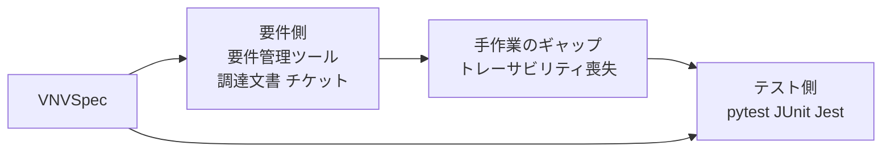

| 要素名 | 説明 |
|---|---|
| 要件側 | 要件管理ツールや調達文書・チケットに記載された高レベル要件 |
| 手作業のギャップ | 要件とテストの対応関係を人手で維持し、放置すると劣化する接続 |
| テスト側 | pytest / JUnit / Jest など、開発者が日常的に実行するテストツール |
| VNVSpec | 要件側とテスト側を機械可読な形で接続するフレームワーク |

### 関連技術との比較

VNVSpec は、モデルベースシステムズエンジニアリング (MBSE) の規律 (型付き要件・分解・トレーサビリティ) を、開発者自身の環境 (Python オブジェクト、リポジトリ内の YAML/TOML ファイル、CI) に持ち込みます。SysML ベースの MBSE ツールチェーンを置き換える狙いはありません。多くのソフトウェアチーム、AI システムを構築するチームを含めて、SysML ツールチェーンを採用せず、MBSE ツールは pytest や JavaScript テストランナーと統合しないためです。

Doorstop や Sphinx-needs のようなリポジトリ常駐型の要件管理ツールは、要件アイテムと型付きリンクをバージョン管理しますが、テスト結果をエビデンスとして取り込みません。Eclipse Capra は異種の開発成果物間のトレーサビリティリンクを維持しますが、仕様モデルや判定ロジックを持ちません。BDD (Cucumber 等) は受け入れ基準を実行可能なステップ定義に結び付けますが、要件品質チェック・標準マッピング・判定セマンティクスを持ちません。VNVSpec はこれらの部分集合を単一の型付きモデルに統合し、監査に必要な層 (品質ゲート・標準レジストリ・保守的な判定ロールアップ・アシュアランスケース出力) を追加します。

| 比較対象 | 何を機械可読にするか | 要件と証跡の接続方法 | 標準対応 | CI 組込みの容易さ |
|---|---|---|---|---|
| pytest / JUnit 等のテストランナー | テストコードとその実行結果 | 接続の概念を持たない (要件を扱わない) | 標準対応なし | 容易 (もともと CI 前提) |
| 要件管理ツール (DOORS 等) | 要件テキストと属性 | 手作業でのリンク付け。テスト結果は取り込まない | 標準条項へのマッピングは手作業 | 困難 (開発者ワークフローの外側で稼働) |
| トレーサビリティ回復手法 (単語埋め込み等による事後推定) | 失われたリンクを事後的に推測 | 統計的にリンクを復元。正確性は保証されない | 標準対応なし | 研究段階。CI 組込みは想定外 |
| GSN ベースのアシュアランスケースツール (ASCE、AdvoCATE 等) | 論証構造 (goal・strategy・evidence) | エビデンスを人手で論証に紐付け | GSN Community Standard version 3 (2021, SCSC-141C) 準拠。標準条項は手動記述 | 困難 (独立ツールで CI に非組込み) |
| VNVSpec | 要件・契約・ハザード・エビデンスを型付きオブジェクトとして機械可読化 | pytest マーカー / JUnit XML / EvidenceCollector / モデルアダプタで証跡へ自動接続し、DAG として強制 | ISO/PAS 8800:2024、ISO 21448:2022、UL 4600 (第 3 版, 2023)、EU AI Act (Regulation (EU) 2024/1689)、NIST AI RMF 1.0 の条項レジストリを内蔵 | 容易 (pytest プラグイン + GitHub Actions 公式 Action。pytest プラグインのオーバーヘッドはテスト 1 件あたり約 0.8 ms。論文 §IV-C が「何もしない 400 テスト」で計測した最悪ケースで、実テストではより小さくなると論文は述べています) |

### ユースケース別の推奨

| ユースケース | 推奨 |
|---|---|
| 既存のユニットテストをそのまま高速に回したいだけ | pytest / JUnit 等のテストランナー単体 |
| 大規模組織で要件のライフサイクル全体 (調達文書からの起票を含む) を一元管理したい | 要件管理ツール (DOORS 等) + 既存のトレーサビリティ運用 |
| 過去プロジェクトで失われたリンクを事後的に復元したい | トレーサビリティ回復手法 |
| 安全性論証をステークホルダーに提示する成果物の作成が主目的 | GSN ベースのアシュアランスケースツール |
| AI システム / サイバーフィジカルシステムで要件からテスト証跡までを CI 上で自動追跡し、規制当局向けの監査証跡を保ちたい | VNVSpec |

## 特徴

### 仕様言語とチェック

- 型付き仕様言語。Pydantic ベースの `Spec` / `Requirement` / `IOContract` / `ODD` / `Hazard` / `Evidence` モデルで、要件・契約・ハザード・エビデンスを表現します。
- Python / YAML / TOML の 3 形式で仕様を記述でき、ロスレスに相互変換できます。要件の作成者とテストの作成者が別の担当者であることが多い現場を想定した設計です。
- INCOSE GtWR (Guide to Writing Requirements、INCOSE Requirements Working Group, 2023) 準拠の要件品質チェッカー。実装は R1〜R8 の 8 ルール (Necessary / Singular / Unambiguous / Verifiable / Feasible / Unit-bearing / Complete / Consistent、出典 `src/vnvspec/core/_internal/gtwr_rules.py`) で、rationale の欠落・1 文への複数条件の詰め込み・曖昧語や無制限語 (「速い」「使いやすい」等)・逃げ口上・検証基準の欠落などを検出します。
- プロファイルによって厳格さを文脈別に調整できます (formal / web-app / embedded)。フォーマルな安全要件と Web アプリ要件を同じ表現ルールで縛らないためです。

### 標準対応とカタログ

- 標準レジストリ。ISO/PAS 8800、ISO 21448、UL 4600、EU AI Act、NIST AI RMF の条項データベースを内蔵し、要件から条項 ID を参照します。
- ベストプラクティスカタログ。PyTorch 学習・HuggingFace 推論・FastAPI・SQLAlchemy・Pyomo の 5 カタログが、合計 116 件の要件を提供し、うち 82 件 (71%) が少なくとも 1 つの標準条項にマッピングされています。`Spec.extend()` でプロジェクト固有の要件と合成できます。
- 各カタログ要件は、実行可能・検証可能・権威あるドキュメントに由来・対象フレームワークにバージョン固定・該当する標準条項へマッピング・自動互換性テストで担保、という 6 基準の登録ゲートを通過しています。

### トレーサビリティとエビデンス

- トレーサビリティグラフは強制された有向非巡回グラフ (DAG) です。`derives_from` / `verifies` / `mitigates` / `maps_to` などの関係を持つ型付きエッジとして構築され、循環リンクは構築時に拒否されます。
- `auto_trace()` がプロジェクトツリーを走査し、要件 ID 参照から `verifies` リンクを自動生成します。手作業のリンクは劣化するため、リンクを作業の副産物として自動生成する設計です。論文本文は走査対象を「テスト名・マーカー・docstring・コメント」と説明しますが、実装 (`src/vnvspec/trace/auto.py`) は `.py` / `.md` / `.yaml` / `.ts` / `.java` など多数の拡張子のファイルを再帰的に開き、**行単位の正規表現一致**で要件 ID を拾う汎用テキスト走査です。テスト名・マーカー・docstring・コメントを区別する処理は持ちません (実装を正とする両論併記)。
- エビデンス収集は 4 経路。pytest プラグイン (`pytest-vnvspec`)、JUnit XML 取り込み (Jest / Java / C++ 等の任意のランナーに対応)、`EvidenceCollector` (アドホックな検証スクリプトや形式検証ツールをラップするコンテキストマネージャ)、モデルアダプタ (PyTorch / HuggingFace / scikit-learn / ONNX / Pyomo / FMI) です。
- 判定ロジックは意図的に保守的です。既定の strict ポリシーでは、不確定 (inconclusive) なエビデンスが 1 件でもあり、失敗がない要件は「不確定」と判定されます。証跡の不在を適合と取り違えないための設計です。
- CLI は構造化された終了コードを返します (0: 合格 / 1: 失敗 / 2: 不確定 / 3: 仕様検証エラー / 4: 使用方法エラー / 5: 内部エラー)。CI パイプラインが条件ごとに個別にゲートできます。

### レポーティングとエクスポート

- 開発者向け HTML レポートと Markdown サマリー。
- 要件ごとの詳細ページ・標準準拠表・バージョン履歴タイムラインを持つ、静的な V&V ダッシュボードサイト。
- 監査人向けの XLSX/CSV コンプライアンスマトリクス。条項ごとのギャップ分析付き。
- 安全性エンジニア向けの GSN アシュアランスケース (Mermaid 記法での出力)。
- 規制対応チーム向けの EU AI Act Annex IV 技術文書スケルトン。
- リポジトリ README に現在の判定を表示するバッジ SVG と Shields.io エンドポイント JSON。
- GitHub Actions 統合。毎プッシュでアセスメントを実行し、バッジを公開し、プルリクエストに判定サマリーをコメントし、コミット間でレポートを差分比較して証跡の消失を回帰として検出します。

### 自己適用による継続的検証

VNVSpec は自己ホスト型のフレームワークです。バージョン 0.1.0 以降、自分自身の仕様 `self-spec.yaml` に対して開発され、毎コミットで CI 上に継続的にアセスメントされています。自己アセスメントを壊す変更は、仕様ではなく変更のほうがロールバックされる、という方針が採られています。

| 指標 | 値 | 条件・母数 |
|---|---|---|
| self-spec の要件数 | 36 件 (blocking 12 / high 17 / medium 7) | コアモデル契約・トレース層・品質チェッカー・レジストリ/エクスポータ・エラー階層・後方互換性やパッケージングに関するメタ要件を対象 |
| 検証テスト数 | 449 件 | 95% ブランチカバレッジゲート下 |
| 直近リリースのアセスメント結果 | 全要件で合格エビデンス、不確定なし | 直近リリース時点 |
| スケーリング上限 | 10,000 要件まで線形にスケール | 2 コア CI 級ハードウェア (Intel Xeon 2.80 GHz, RAM 8 GB) での計測 |
| YAML 仕様のロード | 31 ms | 36 要件の self-spec |
| 36 要件の品質チェック | 1.8 ms、62 件の警告・0 件のエラー | 36 要件の self-spec |
| トレースグラフ構築 | 0.2 ms | 36 要件の self-spec |
| `vnvspec validate` の end-to-end 実行 | 0.54 秒 (インタプリタ起動込み) | 36 要件の self-spec |
| 10,000 要件時の品質チェック | 0.35 秒 | 合成仕様でのスケーラビリティ実験 |
| 10,000 要件時のトレースグラフ構築 | 0.12 秒 | 合成仕様でのスケーラビリティ実験 |

自己適用は実際の回帰も検出しています。後方互換性要件は、暗黙の慣習を明文化された契約に変えました。依存関係宣言の要件は、クリーンインストール時の CLI インポートエラーの後に追加され、以後その自動チェックが再発を防いでいます。

論文は品質チェッカーの検出限界も、自己適用の結果として意図的に報告しています。字句的に見える欠陥は確実に捕捉する一方、構造的な欠陥は取り逃がします。検出率の内訳と、そこから導かれる「チェッカーをどこまで信じてよいか」は [限界と反証](#限界と反証-過信しないための整理) にまとめます。

## 構造

VNVSpec の内部アーキテクチャを、C4 model の 3 段階 (システムコンテキスト図 / コンテナ図 / コンポーネント図) で図解します。

### システムコンテキスト図
VNVSpec と、それを取り巻くアクター・外部システムの関係を示します。

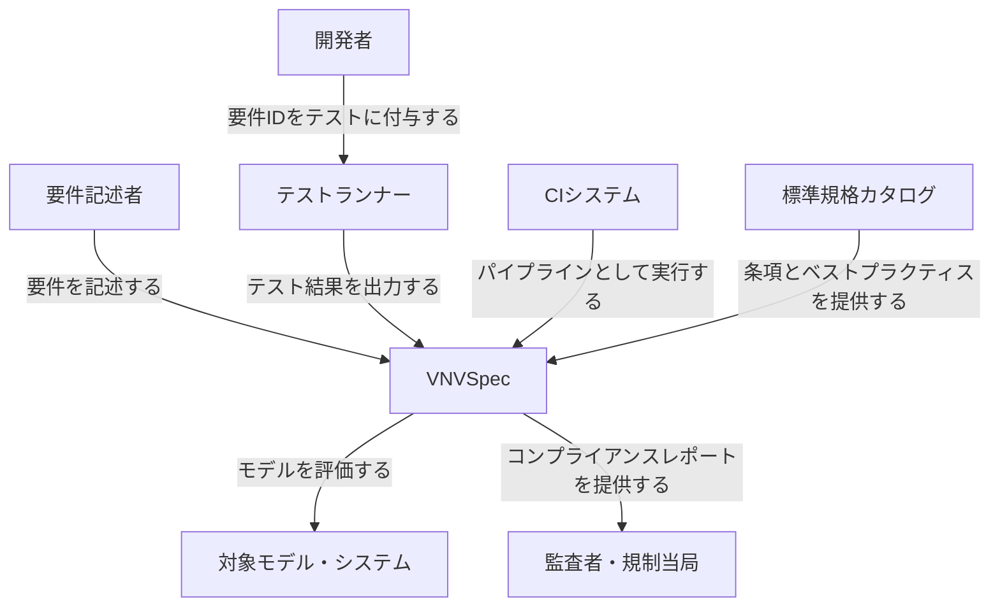

| 要素 | 説明 |
|---|---|
| 要件記述者 | 高レベル要件を直接記述する利用者 |
| 開発者 | テストを実装し、要件IDを紐付けてCIを運用する担当者 |
| 監査者・規制当局 | コンプライアンス証跡やレポートを確認する第三者 |
| VNVSpec | 要件品質チェックとトレーサビリティを提供する本フレームワーク |
| テストランナー | pytest、Jest、JUnit XML出力対応ランナーなど、既存のテスト実行ツール |
| CIシステム | パイプラインを実行する基盤 |
| 標準規格カタログ | ISO/PAS 8800、ISO 21448、UL 4600、EU AI Act、NIST AI RMF等の公開標準の条項集 |
| 対象モデル・システム | 検証対象のMLモデルやアプリケーション本体 |

### コンテナ図
VNVSpec をドリルダウンします。実リポジトリのモジュール構成 (`src/vnvspec/` 配下の 10 モジュールと、別配布される 2 パッケージ) に基づきます。

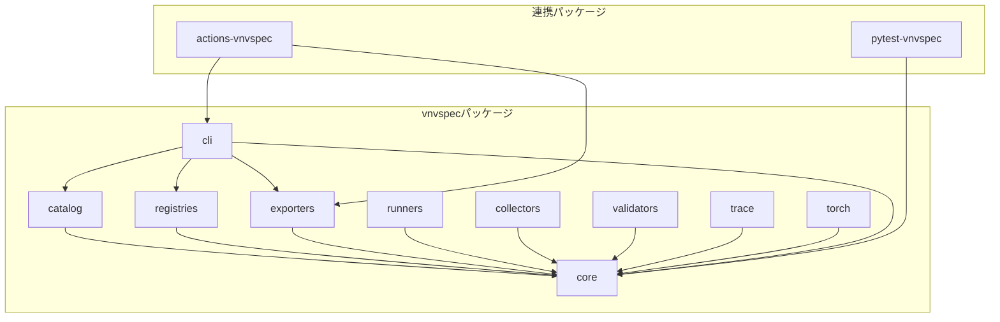

#### vnvspecパッケージ

| 要素 | 説明 |
|---|---|
| core | Spec / Requirement等の型付きモデルと例外階層。他の全モジュールが依存する基盤層 |
| catalog | フレームワーク別のベストプラクティス要件集 |
| registries | 公開標準の条項データベース |
| exporters | HTML / Markdown / GSN等のレポート生成 |
| runners | pytestやHypothesisのテストコード雛形生成 |
| collectors | EvidenceCollectorによる検証結果の収集 |
| validators | pydantic / panderaと連携するスキーマ検証 |
| trace | コード中の要件ID参照からトレースリンクを自動抽出 |
| torch | PyTorch / HuggingFaceモデル向けアダプタ |
| cli | `vnvspec`コマンドラインインタフェース |

#### 連携パッケージ

| 要素 | 説明 |
|---|---|
| pytest-vnvspec | pytestの実行結果をエビデンス化する別配布パッケージ |
| actions-vnvspec | vnvspecをCIで実行するGitHub Actions複合アクション |

### コンポーネント図
各コンテナをさらにドリルダウンします。

#### 3.1 core コンテナ

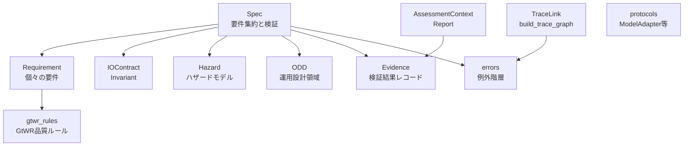

> `protocols` は `ModelAdapter` / `TestRunner` などの拡張ポイント (Python の `Protocol`) を定義するだけの層です。実装は別コンテナ (torch のアダプタ群、runners) 側にあり、core 内では他モデルへの依存を持たないため、上図では独立ノードとして描いています。

| 要素 | 説明 |
|---|---|
| Spec | Requirement、Hazard、ODD、IOContractを集約する最上位モデル |
| Requirement | 識別子や検証方法を持つ個々の要件。`check_quality()`でGtWRルールを適用する |
| IOContract | 入出力の不変条件Invariantを持つ契約モデル |
| Evidence | 検証活動の結果を記録するレコード |
| Hazard | 深刻度等を持つハザードモデル |
| ODD | 運用設計領域を表すモデル |
| AssessmentContext / Report | 収集したEvidenceを集約しReportを生成する |
| TraceLink / build_trace_graph | トレースリンクを型付きエッジとして管理し、DAGを構築する |
| protocols | ModelAdapter / Exporter / TestRunnerの拡張ポイント定義 |
| errors | VnvspecError系の例外階層 |
| gtwr_rules | INCOSE GtWRに準拠した品質ルールエンジン。内部実装 |

#### 3.2 catalog コンテナ

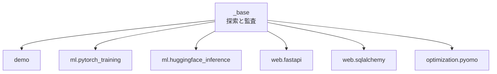

| 要素 | 説明 |
|---|---|
| _base | `discover_catalogs()`等で各カタログを探索し、互換性・鮮度を監査する |
| demo | 導入チュートリアル向けのデモカタログ |
| ml.pytorch_training | PyTorch学習のベストプラクティス要件集 |
| ml.huggingface_inference | HuggingFace推論のベストプラクティス要件集 |
| web.fastapi | FastAPIのAPI設計・セキュリティ要件集 |
| web.sqlalchemy | SQLAlchemyのスキーマ・トランザクション要件集 |
| optimization.pyomo | Pyomoの制約・ソルバ状態要件集 |

#### 3.3 registries コンテナ

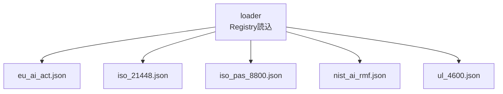

| 要素 | 説明 |
|---|---|
| loader | `list_available()` / `load()` / `list_clauses()`によるレジストリ読込API |
| eu_ai_act.json | EU AI Act (Regulation 2024/1689) の条項データ |
| iso_21448.json | ISO 21448:2022の条項データ |
| iso_pas_8800.json | ISO/PAS 8800:2024の条項データ |
| nist_ai_rmf.json | NIST AI RMF 1.0 (2023) の条項データ |
| ul_4600.json | UL 4600 第3版 (2023) の条項データ |

#### 3.4 exporters コンテナ

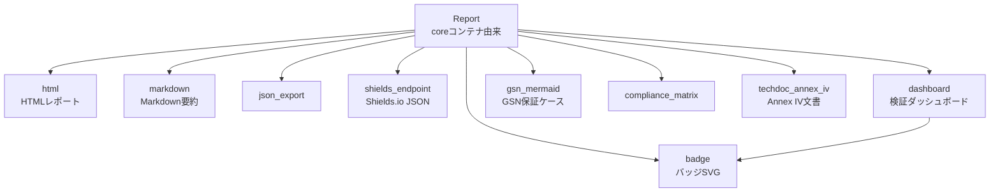

| 要素 | 説明 |
|---|---|
| Report (coreコンテナ由来) | 各エクスポータへの共通入力 |
| html | 開発者向けHTMLレポートを出力する |
| markdown | Markdown要約を出力する |
| json_export | JSON形式で出力する |
| badge | バッジSVGを生成する |
| shields_endpoint | Shields.io向けのバッジJSONを生成する |
| dashboard | 要件別詳細ページを持つ静的ダッシュボードサイトを生成する。内部でbadgeを利用する |
| gsn_mermaid | Mermaid記法のGSN保証ケースを生成する |
| compliance_matrix | 標準ごとのコンプライアンスマトリクスとギャップ分析を出力する |
| techdoc_annex_iv | EU AI Act Annex IVの技術文書骨子を生成する |

#### 3.5 runners コンテナ

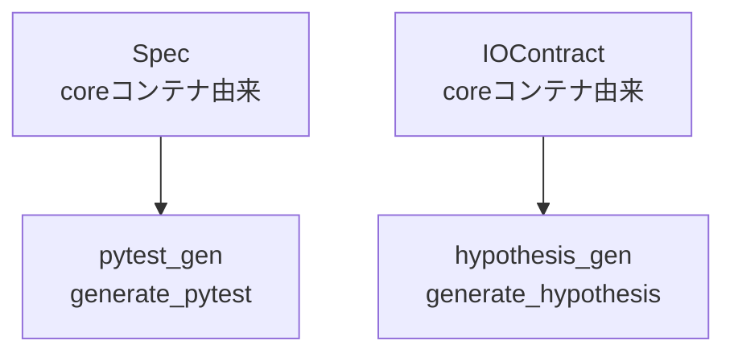

| 要素 | 説明 |
|---|---|
| Spec (coreコンテナ由来) | pytest_genの入力 |
| IOContract (coreコンテナ由来) | hypothesis_genの入力 |
| pytest_gen | Specから雛形pytestテストコードを生成する |
| hypothesis_gen | IOContractからHypothesisプロパティテストを生成する |

#### 3.6 collectors コンテナ

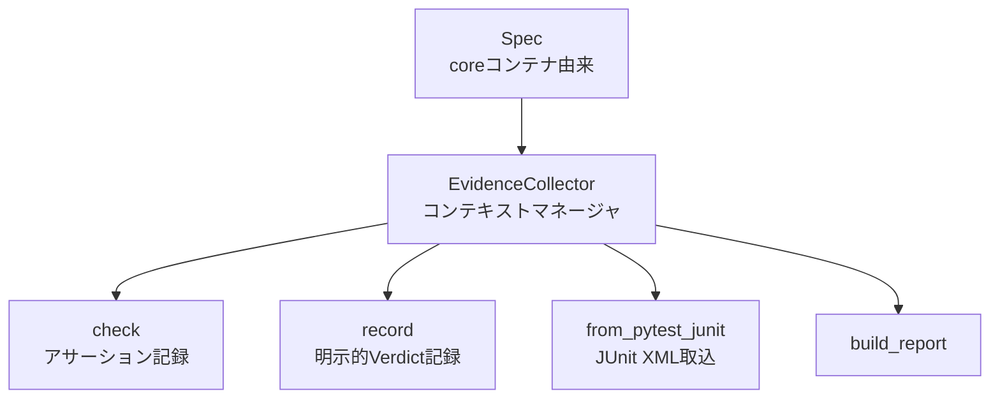

| 要素 | 説明 |
|---|---|
| Spec (coreコンテナ由来) | EvidenceCollector生成時に検証対象として渡される |
| EvidenceCollector | 検証スクリプトを包み、Evidenceを構築するコンテキストマネージャ |
| check | インラインのアサーションをEvidenceに変換する |
| record | 明示的なVerdictをEvidenceとして記録する |
| from_pytest_junit | JUnit XML結果ファイルをEvidenceに変換する |
| build_report | 収集したEvidenceからReportを構築する |

#### 3.7 validators コンテナ

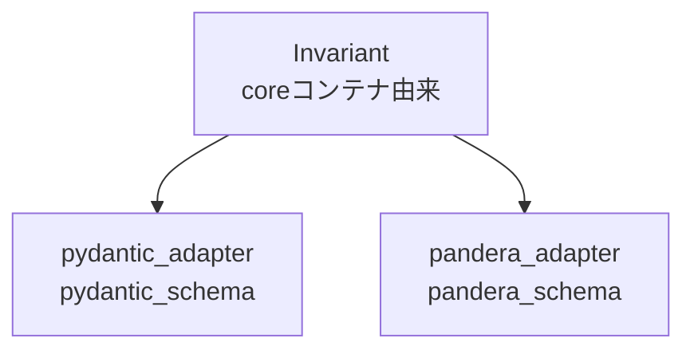

| 要素 | 説明 |
|---|---|
| Invariant (coreコンテナ由来) | pydantic_adapter / pandera_adapterへの入力 |
| pydantic_adapter | Invariantをpydanticスキーマに変換する |
| pandera_adapter | Invariantをpanderaスキーマに変換する |

#### 3.8 trace コンテナ

`trace` コンテナが持つのは `auto_trace` (要件 ID 参照の自動走査) のみです。`TraceLink` 型と `build_trace_graph()` 自体は `core/trace.py` に定義されており、この図では core コンテナ由来として参照します。

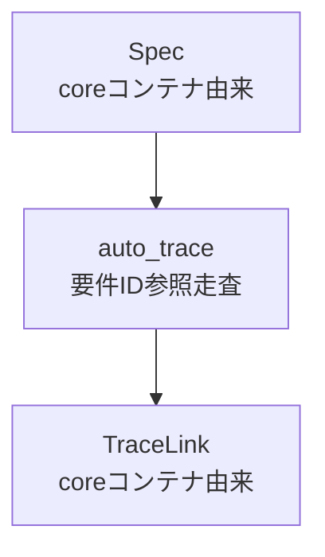

| 要素 | 説明 |
|---|---|
| Spec (coreコンテナ由来) | 走査対象の要件IDを持つ |
| auto_trace | プロジェクトツリーの多数の拡張子ファイルを再帰的に開き、行単位の正規表現で要件ID参照を走査する (テスト名/マーカー/docstring/コメントの区別はしない) |
| TraceLink (coreコンテナ由来) | auto_traceが生成する`verifies`リンク |

#### 3.9 torch コンテナ

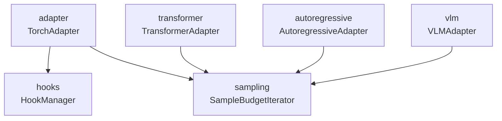

| 要素 | 説明 |
|---|---|
| adapter | nn.ModuleモデルをModelAdapterプロトコルに適合させるTorchAdapter |
| transformer | HuggingFaceエンコーダモデル向けTransformerAdapter |
| autoregressive | HuggingFace生成モデル向けAutoregressiveAdapter |
| vlm | Vision-Languageモデル向けVLMAdapter |
| hooks | 活性化・勾配を観測するHookManager |
| sampling | バジェット制御バッチ処理を行うSampleBudgetIterator |

#### 3.10 cli コンテナ

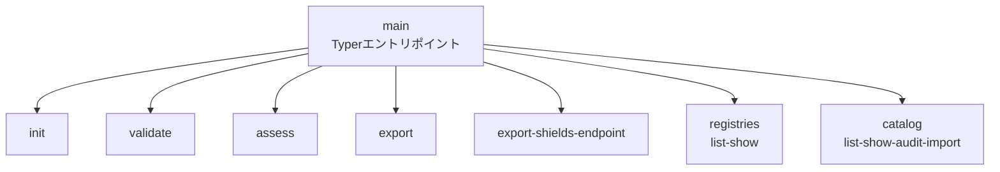

| 要素 | 説明 |
|---|---|
| main | `vnvspec`コマンドのTyperエントリポイント |
| init | 新規スペックの雛形を生成する |
| validate | スペックファイルを読み込み構造を検証する |
| assess | 自己評価を実行する。現状は `--self` 専用で、`scripts/self_assess.py` をサブプロセスとして呼ぶ |
| export | HTML / Markdown / XLSX等の形式でレポートを出力する |
| export-shields-endpoint | Shields.ioバッジ用JSONを出力する |
| registries | レジストリの一覧表示・条項表示サブコマンド群 |
| catalog | カタログの一覧・表示・監査・インポートサブコマンド群 |

#### 3.11 pytest-vnvspec 別パッケージ

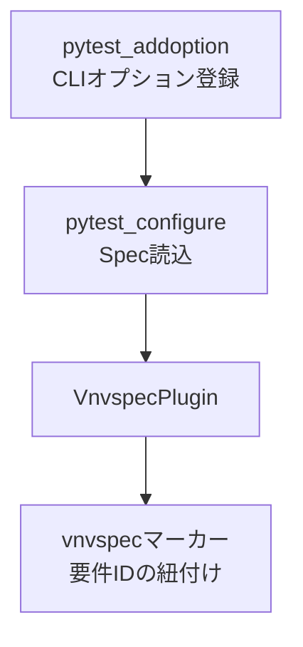

| 要素 | 説明 |
|---|---|
| pytest_addoption | `--vnvspec-spec` / `--vnvspec-report` / `--vnvspec-fail-on`等のCLIオプションを登録する |
| pytest_configure | 指定されたスペックファイルを読み込み、プラグインを初期化する |
| VnvspecPlugin | テスト実行中のフック処理を担うpytestプラグイン本体 |
| vnvspecマーカー | `@pytest.mark.vnvspec("REQ-ID")`によりテストと要件を紐付ける |

#### 3.12 actions-vnvspec (GitHub Actions複合アクション)

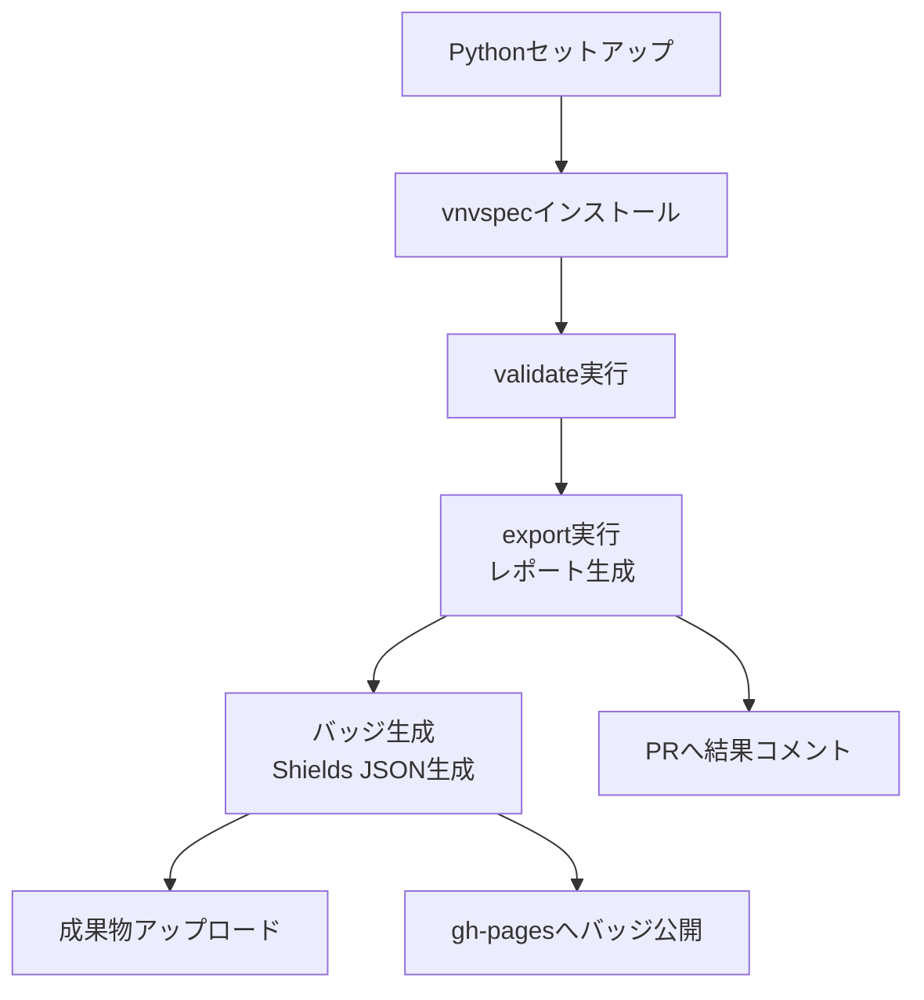

| 要素 | 説明 |
|---|---|
| Pythonセットアップ | 指定バージョンのPythonをセットアップする |
| vnvspecインストール | PyPIから`vnvspec`をインストールする |
| validate実行 | `vnvspec validate`でスペックを検証する |
| export実行 | `vnvspec export`でHTML/JSON/XLSX等のレポートを生成する |
| バッジ生成 | `vnvspec.exporters.badge`と`shields_endpoint`を直接importしバッジSVGとShields.io用JSONを生成する |
| 成果物アップロード | レポートとバッジをワークフロー成果物としてアップロードする |
| gh-pagesへバッジ公開 | バッジをgh-pagesブランチへ公開する |
| PRへ結果コメント | 検証結果のサマリをプルリクエストにコメントする |

## データ

VNVSpec は仕様そのものを型付きデータとして扱います。ここでは `src/vnvspec/core/` と `src/vnvspec/registries/loader.py` の Pydantic モデル定義を根拠に、概念モデルと情報モデルを示します。

### 概念モデル

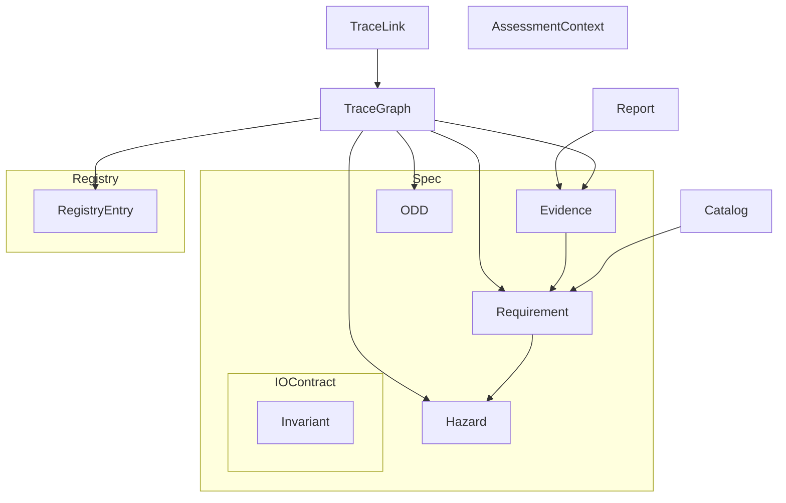

| 要素名 | 説明 |
|---|---|
| Spec | 仕様全体を束ねる最上位エンティティです。Requirement / IOContract / ODD / Hazard / Evidence を所有します |
| Requirement | 検証可能な単一の要件文です。V&V 仕様の最小単位です |
| IOContract | インターフェースの入出力スキーマを定義するエンティティです。Invariant を所有します |
| Invariant | IOContract が保証すべき単一の不変条件です |
| ODD | システムが動作を保証する運用条件 (Operational Design Domain) です |
| Hazard | HARA (ハザード分析とリスク評価) で識別されたハザードです。Requirement によって緩和されます |
| Evidence | 個々の検証活動の結果を記録するエンティティです。Requirement を検証します |
| Catalog | フレームワーク別のベストプラクティスを Requirement の集合として提供する供給元です |
| Registry | 公開標準の条項データベースです。RegistryEntry を所有します |
| RegistryEntry | 標準の条項 1 件分のエントリです |
| TraceLink | 2 エンティティ間を結ぶ型付きの有向エッジです |
| TraceGraph | TraceLink の集合から組み立てられる、Requirement / Hazard / Evidence / ODD / RegistryEntry を結ぶ有向非巡回グラフです |
| Report | Evidence を集約し、判定 (verdict) を導出するアセスメント結果です |
| AssessmentContext | アセスメント実行中に受け渡される実行時状態です |

**実装確認の注記:** Requirement.standards フィールド (標準名から条項 ID への map) を経由して Requirement は RegistryEntry と対応づきます。この対応は文字列 ID による緩い参照です。図では TraceGraph 経由の関連として表現しています。

### 情報モデル

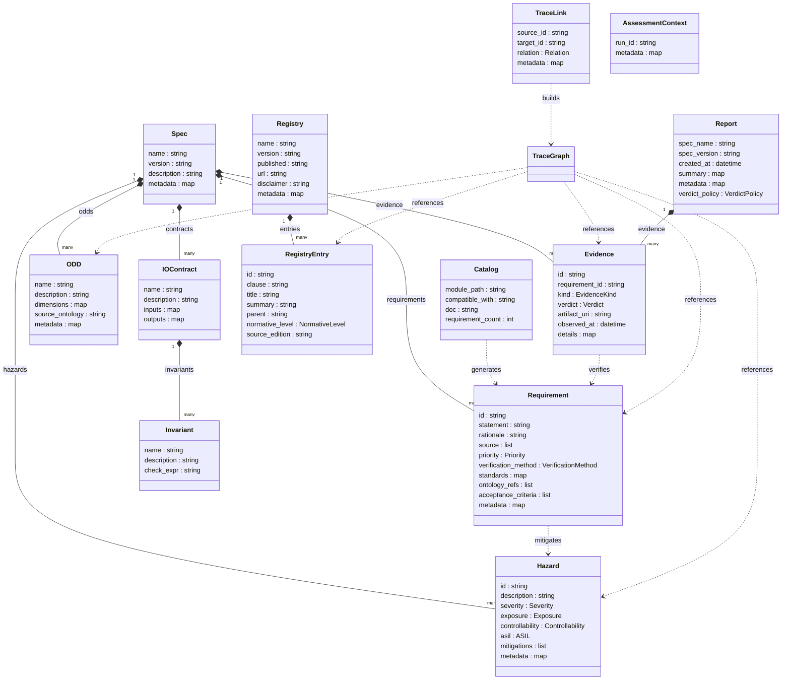

| 要素名 | 説明 |
|---|---|
| Spec | `name` が必須です。`version` の既定値は `"0.1.0"` です。全 Requirement ID と全 Hazard ID の一意性を構築時に検証します |
| Requirement | `id` / `statement` / `verification_method` が中心属性です。`source` は文字列 1 個で渡しても内部でリストへ正規化されます |
| IOContract | `inputs` / `outputs` は任意のスキーマ形状を格納する map です |
| Invariant | `check_expr` は `value` を変数名とする Python 式文字列です |
| ODD | `dimensions` は連続範囲・離散集合・自由文字列のいずれも格納できる map です |
| Hazard | `severity` / `exposure` / `controllability` の組み合わせを踏まえ、`asil` は独立の入力値として人が設定します |
| Evidence | `details` は文字列で渡しても内部で `{"message": ...}` へ正規化されます |
| TraceLink | `source_id` / `target_id` は緩い文字列参照です |
| TraceGraph | 実装は networkx の `DiGraph` です。型付きモデルとして定義されているのは構成要素の `TraceLink` のみで、この図の `TraceGraph` は概念上の集約点として置いています |
| Registry | `entries` の一意性検証は呼び出し側の責務です |
| RegistryEntry | `parent` は階層ナビゲーション用の親条項 ID です。既定値は空文字です |
| Catalog | `Requirement` のリストを返す関数群として実装されています。この図の属性は `CatalogInfo`(dataclass) を出典としています |
| Report | `verdict_policy` の既定値は `"strict"` です。`summary` は文字列で渡しても `{"message": ...}` へ正規化されます |
| AssessmentContext | `run_id` と `metadata` のみを持つ軽量な実行時コンテキストです |

### 主要な列挙値 (実装で確認済み)

| 型名 (使用箇所) | 値 | 出典 |
|---|---|---|
| Priority (Requirement.priority) | blocking, high, medium, low (既定値 medium) | `core/requirement.py` |
| VerificationMethod (Requirement.verification_method) | test, analysis, inspection, demonstration, simulation, formal_proof (既定値 test) | `core/requirement.py` |
| EvidenceKind (Evidence.kind) | test, analysis, inspection, demonstration, simulation, formal_proof | `core/evidence.py` |
| Verdict (Evidence.verdict) | pass, fail, inconclusive | `core/evidence.py` |
| Relation (TraceLink.relation) | derives_from, refines, mitigates, verifies, satisfies, references_ontology, maps_to_standard | `core/trace.py` |
| Severity (Hazard.severity) | S0, S1, S2, S3 | `core/hazard.py` |
| Exposure (Hazard.exposure) | E0, E1, E2, E3, E4 | `core/hazard.py` |
| Controllability (Hazard.controllability) | C0, C1, C2, C3 | `core/hazard.py` |
| ASIL (Hazard.asil) | QM, A, B, C, D | `core/hazard.py` |
| VerdictPolicy (Report.verdict_policy) | strict, lenient (既定値 strict) | `core/assessment.py` |
| NormativeLevel (RegistryEntry.normative_level) | shall, should, may, informative (既定値 informative) | `registries/loader.py` |

### 論文記述と実装の食い違い

- **`verification_method` の値数 (食い違うのは Requirement 側のみ)**: 論文の Requirement 記述は "test, analysis, inspection, demonstration, or formal proof" の **5 種類** (simulation なし) を挙げますが、実装の `VerificationMethod` は simulation を含む **6 種類**です。一方、論文の Evidence 記述は "test, analysis, inspection, demonstration, simulation, or formal proof" と **6 種類**を挙げており、実装の `EvidenceKind` (6 種類) と一致します。つまり論文と実装が食い違うのは `Requirement.verification_method` だけで、`EvidenceKind` は一致しています。本セクションの表は実装を正としています
- **TraceLink.relation の値**: 論文 §III-D の例示は derives_from, verifies, mitigates, maps_to の 4 種類にとどまります。実装の `Relation` は refines と satisfies と references_ontology を加えた 7 種類を定義し、値名も `maps_to` ではなく `maps_to_standard` です
- **ティア (tier) 属性**: 論文 §III-A は tier-1 (ユーザー要件) / tier-2 (メトリクス付きモジュール要件) / tier-3 (テスト) という 3 層分解を「採用している規約」として説明します。実装の `Requirement` クラスが持つ属性は id / statement / rationale / source / priority / verification_method / standards / ontology_refs / acceptance_criteria / metadata の 10 個です。ティアの区別は `REQ-USER-*` / `REQ-MOD-*` のような ID 命名規則と、`derives_from` の TraceLink による論理的な表現にとどまります。tier という概念は論文記述であり、実装ではこの命名規則とトレースリンクの組み合わせとして確認できました
- **ASIL の算出方法**: `Hazard.asil` は severity / exposure / controllability と並ぶ独立フィールドとして値を受け取ります。この 3 属性から asil を自動算出するロジックは、論文・実装のいずれにおいても、値を人が直接設定する運用が前提になっています

## 構築方法

### 前提条件

- **Python バージョン**: `>=3.11` (`pyproject.toml` の `requires-python`)。分類子には Python 3.11 / 3.12 を明記。
- ライセンス: Apache-2.0。
- 主要な必須依存 (`pyproject.toml` `[project.dependencies]`): `pydantic>=2.7` / `networkx>=3.2` / `pyyaml>=6.0` / `tomli-w>=1.0` / `openpyxl>=3.1` / `typer>=0.9` / `rich>=13.0` / `packaging>=23`。

### インストール方法

**バージョンは PyPI を正とします。** 2026-07-22 時点の PyPI 最新版は **`vnvspec 0.3.2`** (`pyproject.toml` の `version` とも一致)。

#### 1. 通常インストール (PyPI)

```bash
pip install vnvspec
```

#### 2. PyTorch アダプタ込み (extras)

```bash
pip install vnvspec[torch]
```

`torch` extras が引き込む依存 (`pyproject.toml` `[project.optional-dependencies.torch]`): `torch>=2.3` / `transformers>=4.40` / `protobuf>=4.0` / `sentencepiece>=0.1.99`。

#### 3. その他の extras

| extras 名 | 内容 | 用途 |
|---|---|---|
| `torch` | torch / transformers 等 | PyTorch・HuggingFace モデルの評価 (`TorchAdapter` 等) |
| `docs` | mkdocs-material 等 | ドキュメントサイトのビルド |
| `dev` | pytest / mypy / ruff / hypothesis / pandera 等 | 開発・テスト用 |
| `all` | `vnvspec[torch,docs,dev]` の合算 | フル開発環境 |

```bash
pip install vnvspec[all]
```

#### 4. pytest 連携プラグイン (別パッケージ)

pytest プラグインはリポジトリ内の別パッケージ `packages/pytest-vnvspec/` として配布されており、`vnvspec` 本体とは別途インストールします。

```bash
pip install pytest-vnvspec
```

(出典: `docs/integrations/pytest.md`)

#### 5. ソースからの開発インストール

リポジトリの `README.md` は `just` タスクランナーを使った開発コマンドを案内しています。

```bash
just install   # 開発用依存を全てインストール
just check     # lint + typecheck + coverage 付きテストを一括実行
```

### バージョン確認

CLI は `--version` (短縮形 `-V`) で自身のバージョンを表示します (`src/vnvspec/cli/main.py` の `_version_callback`)。

```bash
vnvspec --version
```

### エントリポイント

`pyproject.toml` の `[project.scripts]` により、インストール後は `vnvspec` コマンドが使えます。

```toml
[project.scripts]
vnvspec = "vnvspec.cli.main:app"
```

### 動作確認 (init コマンドでの疎通確認)

`vnvspec init` は spec ファイルと `specs/` ディレクトリをカレントディレクトリ (または指定ディレクトリ) に scaffold します。フォーマットは `--format`/`-f` で `yaml` (既定) / `toml` / `py` を選べます (`src/vnvspec/cli/main.py`)。

```bash
vnvspec init
vnvspec init --format toml
vnvspec init my-project --format py
```


## 利用方法

### CLI サブコマンド早見表

`src/vnvspec/cli/main.py` (Typer ベース) を正本として、必須オプション・既定値を一覧化します。太字は **必須引数** です。

| サブコマンド | 必須引数・オプション | 主なオプション (既定値) | 用途 |
|---|---|---|---|
| `vnvspec init [directory]` | なし (directory 既定 `.`) | `--format/-f` (`yaml`) | spec ファイルの scaffold |
| `vnvspec validate <spec_path>` | **`spec_path`** | `--profile/-p` (`formal`)、`--verbose/-v` | GtWR 品質チェック |
| `vnvspec assess` | なし (現状は `--self` のみ対応) | `--self` (フラグ) | 自己スペックの自己評価実行 |
| `vnvspec export <report_path>` | **`report_path`** (アセスメント結果の JSON) | `--format/-f` (`html`)、`--output/-o` | レポートのエクスポート |
| `vnvspec export-shields-endpoint <report_path>` | **`report_path`** | `--output/-o` (`vnv-badge.json`)、`--label/-l` (`V&V`) | Shields.io バッジ JSON 出力 |
| `vnvspec registries list` | なし | — | 標準レジストリ一覧 |
| `vnvspec registries show <name>` | **`name`** | `--limit/-n` (`20`) | レジストリの条項一覧 |
| `vnvspec catalog list` | なし | — | カタログモジュール一覧 |
| `vnvspec catalog show <module>` | **`module`** (例 `vnvspec.catalog.demo`) | — | カタログ内の要件一覧 |
| `vnvspec catalog audit` | なし | `--check-versions` (既定 True)、`--check-staleness` (既定 False)、`--check-sources` (既定 False) | カタログの互換性・鮮度監査 |
| `vnvspec catalog import <module>` | **`module`** | `--format/-f` (`yaml`)、`--output/-o` | カタログ要件を spec ファイルへ書き出し |

> 🚨 **`vnvspec assess` は現状 `--self` フラグ専用です。** `--self` を付けずに実行すると `Currently only --self mode is supported.` と表示され、usage error (exit code 4) で終了します (`src/vnvspec/cli/main.py`)。論文本文の「`vnvspec assess` がトレースグラフを構築し CI を fail させる」という記述は概念的なワークフローの説明であり、実装の CLI が汎用の `assess` サブコマンドを提供しているわけではありません。汎用アセスメントは Python API (`EvidenceCollector.build_report()` や pytest プラグイン) で行います。

### CLI の終了コード

`src/vnvspec/cli/main.py` の `ExitCode` enum。

| コード | 意味 |
|---|---|
| 0 | OK (全 pass) |
| 1 | アセスメント失敗 (fail verdict あり) |
| 2 | 未確定 (inconclusive あり、fail なし) |
| 3 | spec 検証エラー |
| 4 | 使用方法エラー (引数・設定不正) |
| 5 | 内部エラー (未捕捉例外) |

### Spec の定義

`Requirement` と `Spec` は Pydantic の frozen モデルです。`Spec.from_file()` は拡張子から YAML / TOML / JSON を自動判定してロードします (`src/vnvspec/core/spec.py`)。

#### Python での定義

出典: `README.md` の Quick start。

```python
from vnvspec import Requirement, Spec

req = Requirement(
    id="REQ-001",
    statement="The classifier shall produce probabilities in [0, 1].",
    rationale="Probability outputs must be valid for downstream calibration.",
    verification_method="test",
    acceptance_criteria=["All output probabilities are between 0.0 and 1.0 inclusive."],
)

spec = Spec(name="image-classifier-v1", requirements=[req])
violations = req.check_quality()
print(f"Quality issues: {len(violations)}")
```

`Requirement` の主なフィールド (`src/vnvspec/core/requirement.py`):

| フィールド | 型 | 既定値 | 備考 |
|---|---|---|---|
| `id` | `str` | 必須 | 一意な要件 ID |
| `statement` | `str` | 必須 | shall 文 |
| `rationale` | `str` | `""` | 存在理由 |
| `source` | `list[str]` | `[]` | 単一文字列渡しも自動で list 化 |
| `priority` | `"blocking" \| "high" \| "medium" \| "low"` | `"medium"` | 優先度 |
| `verification_method` | `"test" \| "analysis" \| "inspection" \| "demonstration" \| "simulation" \| "formal_proof"` | `"test"` | 検証手段 |
| `standards` | `dict[str, list[str]]` | `{}` | 例: `{"iso_pas_8800": ["6.2.1"]}` |
| `acceptance_criteria` | `list[str]` | `[]` | 合否基準 |
| `metadata` | `dict[str, Any]` | `{}` | 任意メタデータ |

`Spec` の主なフィールド (`src/vnvspec/core/spec.py`): `name` (必須) / `version` (既定 `"0.1.0"`) / `description` / `requirements` / `contracts` / `odds` / `hazards` / `evidence` / `metadata`。構築時に requirement ID と hazard ID の一意性を検証し、重複があれば `SpecError` を送出します。

#### YAML での定義

出典: `docs/concepts/spec-formats.md`。

```yaml
name: my-system
version: "1.0"
requirements:
  - id: REQ-001
    statement: The system shall respond within 100 ms.
    rationale: Latency budget from architecture.
    verification_method: test
    acceptance_criteria:
      - p99 latency < 100 ms
```

```python
from vnvspec import Spec

spec = Spec.from_yaml("spec.yaml")
spec.to_yaml("spec-out.yaml")  # ロスレスに往復する
```

#### TOML での定義

出典: `docs/concepts/spec-formats.md`。

```toml
name = "my-system"
version = "1.0"

[[requirements]]
id = "REQ-001"
statement = "The system shall respond within 100 ms."
rationale = "Latency budget from architecture."
verification_method = "test"
acceptance_criteria = ["p99 latency < 100 ms"]
```

```python
spec = Spec.from_toml("spec.toml")
spec.to_toml("spec-out.toml")
```

YAML / TOML はいずれも Pydantic が生成する JSON 形状をそのまま写したものであり、`Spec.from_yaml(spec.to_yaml())` は元の `Spec` と同一になります (ロスレス往復)。

### 要件の品質チェック (INCOSE GtWR)

`Requirement.check_quality()` は INCOSE Guide to Writing Requirements (GtWR) 由来の 8 ルールを実行します (`src/vnvspec/core/requirement.py` + `src/vnvspec/core/_internal/gtwr_rules.py`)。プロファイルは `RuleProfile` enum で 3 種類。

| プロファイル値 | 用途 |
|---|---|
| `formal` | 既定。厳格なフレージング規則 |
| `web-app` | Web アプリ向けに緩和 |
| `embedded` | 組み込み系向け |

Python から個々の要件をチェックする場合:

```python
violations = req.check_quality()  # 既定プロファイル (formal)
```

プロファイルを明示的に切り替える場合は、`RuleProfile` が内部モジュール (`vnvspec.core._internal`) にあるため、以下のように import します。

```python
from vnvspec.core._internal.gtwr_rules import RuleProfile

violations = req.check_quality(profile=RuleProfile.WEB_APP)
```

CLI から spec ファイル全体を一括チェックする場合 (`--profile/-p` 省略時は `formal`):

```bash
vnvspec validate spec.yaml
vnvspec validate spec.yaml --profile web-app --verbose
```

`validate` は要件ごとに違反 (`error` / `warning` / `info`) を色分け表示し、末尾に「N requirements, M violations.」と件数を出力します。違反が 1 件でもあれば exit code 1 (`ASSESSMENT_FAILURES`) で終了します。

### カタログの利用と `Spec.extend()`

カタログはフレームワーク別のベストプラクティス要件集です。`src/vnvspec/catalog/ml/pytorch_training/` には `checkpointing.py` / `data_loading.py` / `gradient_health.py` / `loss_validation.py` / `reproducibility.py` があり、各モジュールはトップレベル関数 (例 `reproducibility()`) が `list[Requirement]` を返します。

`reproducibility()` は 6 要件 (`CAT-PYT-REPRO-001`〜`006`) を含み、PyTorch の乱数シード固定・決定論的アルゴリズム・cuDNN 設定・DataLoader のワーカー初期化などを対象とします (`src/vnvspec/catalog/ml/pytorch_training/reproducibility.py`)。

```python
from vnvspec import Spec
from vnvspec.catalog.ml import pytorch_training

spec = Spec(
    name="diagnosis-service",
    requirements=[user_req],
).extend(pytorch_training.reproducibility())
```

`Spec.extend()` は frozen モデルを変更せず、要件を追加した**新しい** `Spec` インスタンスを返します。`Requirement` 単体・`list[Requirement]` のどちらも受け取れます。

CLI からカタログを閲覧・取り込む場合:

```bash
vnvspec catalog list
vnvspec catalog show vnvspec.catalog.ml.pytorch_training.reproducibility
vnvspec catalog import vnvspec.catalog.ml.pytorch_training.reproducibility --format yaml --output catalog-repro.yaml
vnvspec catalog audit --check-versions --check-staleness
```

`catalog audit` は各カタログモジュールの `__compatible_with__` バージョンピン (例 `torch>=2.3,<3.0`) をインストール済みパッケージと突き合わせ、`compatible` / `unknown` / `incompatible` を判定します (`src/vnvspec/catalog/_base.py`)。`--check-versions` 既定 True、`--check-staleness` と `--check-sources` は既定 False (呼び出し時に明示指定が必要)。

### テスト連携 (pytest プラグイン)

`pytest-vnvspec` は `packages/pytest-vnvspec/src/pytest_vnvspec/plugin.py` で実装されています。

#### 1. テストに要件 ID マーカーを付与

```python
import pytest

@pytest.mark.vnvspec("REQ-001")
def test_accuracy():
    assert model.accuracy() > 0.9
```

同一テストに複数マーカーを付けることも可能です。

#### 2. spec ファイルを指定して pytest を実行

```bash
pytest --vnvspec-spec=spec.yaml --vnvspec-report=report.json
```

#### 3. プラグイン CLI オプション一覧

| オプション | 説明 | 既定値 |
|---|---|---|
| `--vnvspec-spec=PATH` | spec ファイルパス (YAML/TOML/JSON) | `None` (未指定だとプラグイン自体が非活性) |
| `--vnvspec-report=PATH` | レポート出力先 (JSON) | `None` (ファイル未出力) |
| `--vnvspec-fail-on=MODE` | `any` / `blocking` / `never` | `never` |

`--vnvspec-fail-on` の挙動 (`plugin.py` `pytest_sessionfinish`):

- `any`: いずれかの evidence が `fail` verdict なら pytest 終了コードを `TESTS_FAILED` に上書き
- `blocking`: `priority="blocking"` の要件が fail した場合のみ上書き
- `never` (既定): pytest 本来の終了コードを変更しない

セッション終了時、`verification_method="test"` の要件のうちテストが 1 件も紐付かなかったものは自動的に `verdict="inconclusive"` の evidence が生成されます。また、未知の要件 ID を参照するマーカーは収集時に `PytestUnknownMarkWarning` を出しつつ、実行自体は止めません。

### evidence 収集 (`EvidenceCollector`)

`EvidenceCollector` (`src/vnvspec/collectors/evidence.py`) はコンテキストマネージャで、アドホックな検証スクリプトの assertion を evidence に変換します。

```python
from vnvspec.collectors import EvidenceCollector

with EvidenceCollector(spec) as collector:
    collector.check("REQ-001", accuracy > 0.9, message="accuracy check")
    collector.record("REQ-002", "pass", message="manual review done")
report = collector.build_report(summary="all checks passed")
```

主なメソッド:

| メソッド | 用途 |
|---|---|
| `check(requirement_id, condition, message="", **details)` | bool 条件から pass/fail evidence を記録 |
| `record(requirement_id, verdict, *, kind=None, message="", **details)` | 明示的な verdict (`pass`/`fail`/`inconclusive`) を記録 |
| `from_pytest_junit(path, *, requirement_marker="vnvspec")` | JUnit XML から evidence を抽出 (Jest 等の他言語ランナー結果を取り込むルート) |
| `build_report(*, summary=None)` | 収集した evidence から `Report` を構築 |

`from_pytest_junit()` は `<property name="vnvspec" value="REQ-xxx">` を持つ `<testcase>` を evidence 化します。`skipped` は `inconclusive`、未知の要件 ID を参照する場合は例外にせず `RuntimeWarning` を出してスキップします。

JUnit XML 経由で他言語 (Jest 等) のテスト結果を取り込む例 (出典: 論文 Listing 3/4、実装は `EvidenceCollector.from_pytest_junit`):

```python
from vnvspec import EvidenceCollector

with EvidenceCollector(spec) as c:
    c.from_pytest_junit("jest-junit.xml")
    report = c.build_report()
```

要件が spec に存在しない場合、`check()` / `record()` / `from_pytest_junit()` の呼び出し (`from_pytest_junit` は警告付きスキップ、`check`/`record` は `RequirementError`) で検出されます。

### トレースグラフ

`build_trace_graph()` (`src/vnvspec/core/trace.py`) は `TraceLink` のリストから `networkx.DiGraph` を構築します。`relation` は `derives_from` / `refines` / `mitigates` / `verifies` / `satisfies` / `references_ontology` / `maps_to_standard` のいずれか。

```python
from vnvspec import TraceLink, build_trace_graph

link = TraceLink(source_id="EV-001", target_id="REQ-001", relation="verifies")
graph = build_trace_graph([link])
```

グラフが循環を含む場合は構築時に `SpecError` を送出し、`nx.simple_cycles()` で検出した循環リストをエラーメッセージに含めます。

`coverage_report(graph, requirement_ids)` は要件ごとに、入ってくるエッジ (verifies する evidence 等) と出ていくエッジ (mitigates する hazard 等) を関係種別ごとにまとめます。`standard_gap_analysis(spec, standard)` は指定した標準レジストリ (例 `"iso_pas_8800"`) に対するギャップ分析を行い、`GapReport` (総条項数 / カバー済み / ギャップ数 / 条項別詳細) を返します。

グラフの GraphML 入出力もサポートされています。

```python
from vnvspec.core.trace import export_graphml, import_graphml

xml = export_graphml(graph)
graph2 = import_graphml(xml)
```

### レポート出力 (CLI export)

`vnvspec export` はアセスメント結果 JSON (`Report` を `model_dump_json()` したもの) を入力に、各種フォーマットへ変換します。

```bash
vnvspec export report.json --format html --output report.html
vnvspec export report.json --format md
vnvspec export report.json --format gsn        # GSN 保証ケース (Mermaid 記法) を標準出力
vnvspec export report.json --format annex-iv    # EU AI Act Annex IV 技術文書スケルトン
```

`--format/-f` の指定可能値と対応関数 (`src/vnvspec/cli/main.py`): `html` / `md` (`markdown` の別名可) / `gsn` (`mermaid` の別名可) / `json` / `annex-iv`。`gsn` / `mermaid` / `annex-iv` は `--output` を指定しても常に標準出力に文字列を返します。

バッジ (Shields.io エンドポイント JSON) を単体で出す場合:

```bash
vnvspec export-shields-endpoint report.json --output vnv-badge.json --label "V&V"
```

### Python でのアセスメント実行例 (PyTorch モデル)

出典: `examples/01_tabular_mlp/main.py` (実際に動作するサンプルコード)。

```python
import torch
from torch import nn

from vnvspec import Requirement, Spec
from vnvspec.exporters.html import export_html
from vnvspec.torch import TorchAdapter

class TabularMLP(nn.Module):
    def __init__(self, in_dim: int = 10, out_dim: int = 3) -> None:
        super().__init__()
        self.net = nn.Sequential(
            nn.Linear(in_dim, 32), nn.ReLU(),
            nn.Linear(32, 16), nn.ReLU(),
            nn.Linear(16, out_dim), nn.Softmax(dim=-1),
        )

    def forward(self, x: torch.Tensor) -> torch.Tensor:
        return self.net(x)

spec = Spec(
    name="tabular-mlp-spec",
    requirements=[
        Requirement(
            id="REQ-PROB",
            statement="The model shall output probabilities in [0, 1].",
            verification_method="test",
            acceptance_criteria=["All output values >= 0 and <= 1."],
        ),
        # ... REQ-DIM, REQ-NAN も同様に定義 ...
    ],
)

model = TabularMLP(in_dim=10, out_dim=3)
adapter = TorchAdapter(model, batch_size=64)
data = [torch.randn(10) for _ in range(200)]
report = adapter.assess(spec, data)

export_html(report, path="report.html")
print(f"Verdict: {report.verdict()}, Passed: {report.pass_count()}/{len(report.evidence)}")
```

`Report` (`src/vnvspec/core/assessment.py`) の主なメソッド: `pass_count()` / `fail_count()` / `inconclusive_count()` / `verdict()`。`verdict_policy` フィールドは `strict` (既定、inconclusive があれば全体も inconclusive) と `lenient` (fail が無ければ inconclusive は pass 扱い) の 2 種類です。

### CI 連携 (GitHub Actions composite action)

`actions/vnvspec/action.yml` を正本として、入力キーと既定値を示します (**docs の `docs/integrations/github-actions.md` に記載の既定値は action.yml と食い違うため、action.yml を正としています**)。

| 入力キー | 説明 | 必須 | 既定値 (action.yml 実測) |
|---|---|---|---|
| `spec` | spec ファイルパス | **Yes** | — |
| `report-format` | カンマ区切りフォーマット (`html,json,xlsx`) | No | `html,json` |
| `fail-on` | `any` \| `blocking` \| `never` (⚠️ 下記参照、現状 no-op) | No | `blocking` |
| `python-version` | Python バージョン | No | `3.12` |
| `verdict-policy` | `strict` \| `lenient` (⚠️ 下記参照、現状 no-op) | No | `strict` |
| `publish-badge` | gh-pages にバッジ JSON を push するか | No | `true` |
| `comment-pr` | PR にアセスメント結果をコメントするか | No | `true` |
| `github-token` | gh-pages push・PR コメント用トークン | No | `${{ github.token }}` |

> 🚨 **公式 composite action の既知の制約 (v0.3.2 の `action.yml` 実測)。CI ゲートをこの action だけに委ねないでください。**
>
> - **`fail-on` と `verdict-policy` は宣言されているだけで、どのステップからも参照されていません (現状 no-op)。** `fail-on: any` を指定してもジョブの失敗条件は変わりません。ジョブを失敗させ得るのは `Validate spec` ステップの `vnvspec validate` が非ゼロ終了したときだけです。
> - **`Run assessment` ステップは `vnvspec export "${{ inputs.spec }}"` と、spec ファイルを `export` に渡しています。** `export` の第 1 引数は本来アセスメント結果の JSON (`Report`) で、spec を渡すとバリデーションエラーになりますが、`|| true` で握りつぶされます。加えて action には report JSON を受け取る入力キーがありません。つまり **公式 action は実質 `validate` 以外は正常に機能しない状態**です。evidence を含む本来のアセスメントを CI で回すには、テスト実行 → evidence 出力 → `vnvspec export <report.json>` を**自前のワークフローで組む**必要があります。

```yaml
# .github/workflows/vnvspec.yml
name: V&V Assessment
on: [push, pull_request]

jobs:
  vnvspec:
    runs-on: ubuntu-latest
    steps:
      - uses: actions/checkout@v4
      - uses: ai-vnv/vnvspec/actions/vnvspec@main
        with:
          spec: spec.yaml
          report-format: html,json
```

**AND 条件で発動するステップに注意してください** (`action.yml` の `if:` 条件を実測):

- 「gh-pages へのバッジ publish」ステップは `inputs.publish-badge == 'true'` **かつ** `github.event_name == 'push'` の両方を満たしたときのみ実行されます。プルリクエストの CI 実行では発動しません。
- 「PR コメント」ステップは `inputs.comment-pr == 'true'` **かつ** `github.event_name == 'pull_request'` の両方を満たしたときのみ実行されます。
- `github-token` は既定で `${{ github.token }}` (同一リポジトリの `GITHUB_TOKEN`) が使われるため、gh-pages への push を別リポジトリに対して行いたい場合などは、明示的に PAT を secret として渡す必要があります。

### CI 連携: self-spec による自己評価スクリプト

VNVSpec 自身は `.vnvspec/self-spec.yaml` (36 要件) を CI で継続的に自己評価しています。ローカルで同じ自己評価を再現するコマンド:

```bash
vnvspec assess --self
```

`vnvspec assess --self` は `scripts/self_assess.py` をサブプロセスとして呼び出し、その終了コードをそのまま CLI の終了コードとして返します (`src/vnvspec/cli/main.py`)。

## 運用

### CI での継続的な自己評価

VNVSpec 自身も「自己適用 (self-application)」として `.vnvspec/self-spec.yaml` の 36 要件(blocking 12 / high 17 / medium 7)を継続的に自己評価しています。実装を確認すると、この自己評価は 2 つのワークフローに分かれています。

| ワークフロー | トリガー | 内容 |
|---|---|---|
| `.github/workflows/ci.yml` | push (main) / pull_request | lint (ruff) / typecheck (mypy --strict) / test (pytest、カバレッジ 95% ゲート) / compat (v0.1・v0.2 互換チェック)。**`scripts/self_assess.py` の呼び出しは無い** |
| `.github/workflows/docs.yml` | push (main) / workflow_dispatch | `mkdocs build` → `uv run python scripts/self_assess.py` → ダッシュボード/バッジ生成 → 外部サイト (`ai-vnv-lab-site`) へデプロイ |

論文本文は「self-spec は CI で毎コミット評価される (assessed in CI on every commit)」と述べていますが、実際に `scripts/self_assess.py` を実行しているのは `docs.yml` のみで、**トリガーは `push: main` に限定**されます(pull_request では走りません)。また `ci.yml` の test ジョブは `pytest -m "not slow" -p no:vnvspec ...` と、`-p no:vnvspec` で pytest-vnvspec プラグイン自体を無効化して実行しています。つまり VNVSpec 自身のテストスイートは、pytest マーカー経由の証跡収集ではなく `scripts/self_assess.py` 内の個別チェック関数(`_check_pydantic` 等、実測 32 個)で自己評価を構成しています。

自己評価スクリプトの実行方法(実装確認済み):

```bash
# ローカルで自己評価を実行 (CLI 経由)
uv run vnvspec assess --self

# 実体は scripts/self_assess.py を subprocess で呼ぶだけ
uv run python scripts/self_assess.py
```

終了コードは blocking 優先度の要件が fail した場合のみ `1`(それ以外の fail は `0` のまま、警告表示のみ)という設計です。`cli/main.py` の `assess --self` はこの終了コードをそのまま返します。

「壊れたら spec ではなくコードをロールバックする」という自己評価ポリシーは、論文中で明言されていますが、**それを強制する自動化(自動 revert 等)は `scripts/` や `.github/workflows/` に見当たりません**。運用上のルールであって、CI が機械的に強制しているわけではない点に注意してください。

### レポートの差分検知 (diff.py)

`src/vnvspec/diff.py` の `compare_reports(previous, current)` は、2 つの `Report` を比較して以下を返します。

| フィールド | 意味 |
|---|---|
| `new_failures` | pass/inconclusive → fail に転じた要件 ID |
| `new_passes` | fail/inconclusive → pass に転じた要件 ID |
| `regressions` | pass → fail に転じた要件 ID(`new_failures` の部分集合) |
| `removed_requirements` | 前回にあり今回に無い要件 ID |
| `added_requirements` | 今回新規に増えた要件 ID |

要件ごとに複数の証跡がある場合は `pass > inconclusive > fail` の優先順で「最良の verdict」を採用してから比較します(`_best_verdicts` 内の `rank` 辞書)。

```python
from vnvspec.diff import compare_reports

diff = compare_reports(previous_report, current_report)
if diff.regressions:
    raise SystemExit(f"regressions detected: {diff.regressions}")
```

**注意**: `actions/vnvspec/action.yml`(公式composite action)は現状 `diff.py` を呼び出していません。バッジ生成・PR コメント・アーティファクトのアップロードは行いますが、レポート差分の算出は組み込まれていないため、差分検知を CI で使う場合は自前で `compare_reports()` を呼ぶスクリプトを追加する必要があります。

### バッジ更新

バッジは 2 種類あります。

| 種類 | 生成関数 | 特徴 |
|---|---|---|
| 静的 SVG バッジ | `vnvspec.exporters.badge.export_badge()` | verdict に応じて色を決定 (pass=緑 `#4c1` / fail=赤 / inconclusive=黄 / evidence なし=灰)。外部サービス不要 |
| Shields.io エンドポイント JSON | `vnvspec.exporters.shields_endpoint.export_shields_endpoint()` | `schemaVersion: 1` の JSON を出力し、README に `https://img.shields.io/endpoint?url=...` として埋め込む方式 |

CLI からの生成:

```bash
vnvspec export-shields-endpoint report.json --output vnv-badge.json --label "V&V"
```

composite action (`actions/vnvspec/action.yml`) は `publish-badge: true`(既定値)のとき、push イベントに限り `peaceiris/actions-gh-pages@v4` で `vnv-badge.json` と `vnvspec-badge.svg` を gh-pages に配信します。pull_request イベントでは配信せず、代わりに `comment-pr: true`(既定値)で PR にバッジ絵文字(🟢/🟡/🔴/⚪)付きのコメントを投稿します。

### ダッシュボード生成

`vnvspec.exporters.dashboard.export_dashboard(spec, report, *, output_dir, history=None, dashboard_url=None)` が、サマリページ・要件別詳細ページ・標準準拠テーブル・バージョン履歴タイムラインを含む静的 HTML サイトを生成します。

VNVSpec 自身のダッシュボードは `docs.yml` の中で次のように生成されています(実測コード)。

```python
from vnvspec import Spec
from vnvspec.core.assessment import Report
from vnvspec.exporters.dashboard import export_dashboard
from vnvspec.exporters.shields_endpoint import export_shields_endpoint
import json

spec = Spec.from_yaml(".vnvspec/self-spec.yaml")
report = Report.model_validate(json.loads(open(".vnvspec/self-assessment-report.json").read()))
export_dashboard(
    spec, report,
    output_dir="site/dashboard",
    dashboard_url="https://ai-vnv.kfupm.io/vnvspec/dashboard/",
)
export_shields_endpoint(report, path="site/vnv-badge.json")
```

このダッシュボードは公式 docs サイトの一部として、外部リポジトリ `mansurarief/ai-vnv-lab-site` へ `git push` されます(`docs.yml` の `Deploy to lab site` ステップ、`LAB_SITE_DEPLOY_TOKEN` シークレットを使用)。自社運用では、この外部デプロイ部分を GitHub Pages への直接デプロイに置き換える形が一般的です。

### spec のバージョニングと移行

VNVSpec は破壊的変更を `docs/migration/` にバージョン間ガイドとして明文化しています。

| ガイド | 破壊的変更の要点 |
|---|---|
| `docs/migration/v0.1-to-v0.2.md` | 完全後方互換。CLI 終了コードが構造化された値 (0-5) に変わった点のみ注意喚起 |
| `docs/migration/v0.2-to-v0.3.md` | ① `Report.verdict()` が既定 (`verdict_policy="strict"`) で inconclusive を pass に格上げしなくなった(旧挙動は `verdict_policy="lenient"` で復元可能) ② `Requirement.source` が `str` → `list[str]` に変更(旧型は自動正規化されるため実害は小さい) |

CHANGELOG.md によると、`Report.verdict()` の挙動変更(v0.3.0)は「CI パイプラインに影響し得る (may affect CI)」と明記された唯一の破壊的変更です。inconclusive 証跡が残る要件があると、strict ポリシーでは spec 全体の verdict が `pass` から `inconclusive` に変わり、`vnvspec assess` の終了コードも `0` から `2` に変わります。バージョンアップ時は CI のゲート条件(exit code チェック)を見直してください。

後方互換性は `scripts/check_v0_1_compat.py` / `scripts/check_v0_2_compat.py` で機械的に検証され、`ci.yml` の `compat` ジョブと `justfile` の `compat` タスクの両方から実行されます。

### 要件追加時の運用フロー

VNVSpec 自身の開発フロー(CHANGELOG / self_assess.py から再構成)は次のとおりです。

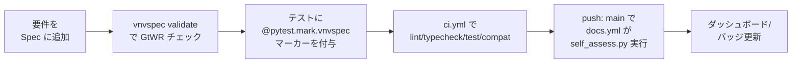

要件追加のたびに `.vnvspec/self-spec.yaml` の要件数が増え、CHANGELOG.md の `Added` 節に記録される、というのが実際に確認できるパターンです(例: v0.2.0 で 8→26 要件、v0.3.0 で 26→36 要件に増加)。CHANGELOG によれば、この過程で「後方互換性要件が暗黙の慣習から正式な契約になった」「CLI のクリーンインストールが `ImportError` で失敗した後に依存宣言要件が追加された」という 2 件の実回帰が self-spec によって捕捉されたと記載されています(論文 §IV-C2 の記述と一致)。

## ベストプラクティス

### CI/CD 連携

公式の GitHub Actions composite action は `actions/vnvspec/action.yml` として提供されています。実装済みの入力は次のとおりです(存在しないフラグを使わないよう注意)。

| 入力 | 既定値 | 説明 |
|---|---|---|
| `spec` | (必須) | spec ファイルパス (YAML/TOML/JSON) |
| `report-format` | `html,json` | カンマ区切りの出力形式 |
| `fail-on` | `blocking` | `any` \| `blocking` \| `never` (**現状 no-op**。どのステップからも参照されない) |
| `python-version` | `3.12` | |
| `verdict-policy` | `strict` | `strict` \| `lenient` (**現状 no-op**) |
| `publish-badge` | `true` | push 時のみ gh-pages へバッジ配信 |
| `comment-pr` | `true` | pull_request 時のみ PR コメント投稿 |
| `github-token` | `${{ github.token }}` | |

呼び出し例(README/action.yml から実在する入力のみで構成):

```yaml
- uses: ai-vnv/vnvspec/actions/vnvspec@main
  with:
    spec: .vnvspec/self-spec.yaml
    report-format: html,json
```

**注意 (重要)**: この composite action は現状 `vnvspec validate` (spec の GtWR チェック) しか実質的に機能しません。内部の `Run assessment` ステップは `vnvspec export "${{ inputs.spec }}"` と spec ファイルを `export` に渡していますが、`export` は本来アセスメント結果 JSON を受け取る設計で、spec を渡すとエラーになり `|| true` で握りつぶされます。加えて report JSON を渡す入力キーが無いため、evidence を伴うアセスメントはこの action だけでは回りません。実運用では「テスト実行 (pytest-vnvspec 等で evidence 収集 → report JSON 出力) → `vnvspec export <report.json>` → バッジ生成」の順序を自前のワークフローで組み立て、公式 action は `validate` ゲート用途に限定するのが安全です。

### 要件の書き方 (GtWR プロファイル選択)

`Requirement.check_quality(profile=...)` は 3 プロファイルを提供し、同じ 8 ルール(R1〜R8 相当)に対して重大度 (`error`/`warning`/`info`) を変えます(`src/vnvspec/core/_internal/gtwr_rules.py` 実測)。

| プロファイル | 用途 | 重大度の調整例 |
|---|---|---|
| `formal`(既定) | 安全要件・フォーマルな仕様 | 上書きなし(全ルールが既定の重大度) |
| `web-app` | Web アプリケーション | R6 (単位付きの数値) と R7 (shall 語彙の完全性) を `warning`/`error` から `info` に緩和 |
| `embedded` | 組み込み・安全クリティカル | R5 (実現可能性) を `error` に強化 |

CLI での指定:

```bash
vnvspec validate --profile web-app spec.yaml
```

選択の目安は「その要件がどの監査を通す必要があるか」です。EU AI Act (Regulation (EU) 2024/1689) Annex IV や ISO/PAS 8800:2024 の技術文書に使う要件は `formal` を既定にし、社内向け Web サービスの要件だけ `web-app` に緩めるという運用が、プロファイル設計の意図と整合します。

### カタログの合成戦略

`Spec.extend()` でカタログモジュールをベース spec に合成します(論文 §III-C、実装は README 記載どおり動作を確認)。

```python
from vnvspec import Spec
from vnvspec.catalog.ml.pytorch_training import reproducibility

spec = Spec(name="my-model").extend(reproducibility())
```

現在提供されているカタログは 5 種、合計 116 要件、うち 82 要件(71%)が何らかの標準クローズにマッピング済みです(論文 Table I)。

| カタログ | 主要出典 | 要件数 | マッピング済み |
|---|---|---|---|
| `ml.pytorch_training` | PyTorch docs, NIST AI RMF | 32 | 20 |
| `ml.huggingface_inference` | Transformers docs | 25 | 14 |
| `web.fastapi` | OWASP API Top 10 | 22 | 20 |
| `web.sqlalchemy` | SQLAlchemy 2.0, Alembic docs | 18 | 9 |
| `optimization.pyomo` | Pyomo docs | 19 | 19 |

上表は論文 Table I の数値ですが、実際に `src/vnvspec/catalog/` 配下の全 18 ファイルの `Requirement(` 件数と `standards={` 件数を数えて検証したところ、現在の main ブランチも合計 116 要件・82 件マッピング済み(71%)で完全に一致しました。なお `CHANGELOG.md` の v0.3.0 エントリ本文には「30 curated best-practice requirements across 5 sub-modules (6 each)」「75%」という記述もありますが、これは同エントリ内で後から追加された IEEE 754 関連の 4 要件(pytorch_training +2、huggingface_inference +1、pyomo は元々 19 で変化なし)を反映する前の記述で、現在のソースコードとは一致しません。カタログの正確な要件数を確認する場合は `vnvspec catalog show <module>` かソースファイルを直接参照してください。

各カタログ要件は「実行可能・検証可能・権威ある一次情報に基づく・対象フレームワークにバージョン固定・該当すれば標準クローズにマッピング・自動互換性テストで保護」という 6 基準の inclusion gate を通過している前提です(`CONTRIBUTING-CATALOG.md` に規定)。

CLI でカタログの健全性を確認する運用コマンド(`cli/main.py` 実測):

```bash
vnvspec catalog list                 # 導入済みカタログ一覧
vnvspec catalog show <module>        # カタログ内要件を表示
vnvspec catalog audit                # バージョン互換性チェック (既定)
vnvspec catalog audit --check-staleness   # レビュー鮮度チェック
vnvspec catalog audit --check-sources     # 出典 URL の収集 (HTTP 確認は別途)
```

`catalog audit --check-versions`(既定 `true`)で `incompatible` が 1 件でもあると終了コード `1`(`ExitCode.ASSESSMENT_FAILURES`)になり、CI をゲートできます。カタログはフレームワークのバージョンに固定された「時間とともに劣化する」資産である点に注意してください(後述の限界を参照)。

### 標準対応 (コンプライアンスマトリクス / gap analysis)

`export_compliance_matrix(report, *, standard, spec, path, output_format="xlsx"|"csv"|"html")` は、`standard_gap_analysis()` の結果を評価証跡と突き合わせ、クローズ単位の被覆状況を出力します。

```python
from vnvspec.exporters.compliance_matrix import export_compliance_matrix

export_compliance_matrix(
    report, standard="iso_pas_8800", spec=spec,
    path="compliance.xlsx", output_format="xlsx",
)
```

出力列は「クローズ ID / タイトル / 規範レベル / マッピング済み要件 / 証跡 ID / verdict / 被覆ステータス」で構成され、監査担当が「未実装」「サンプルベース検証のみ」「フォーマル証明あり」を一目で区別できる設計です(論文 §IV-B の CROWN 証跡の例が該当)。

自社運用で使うレジストリは `registries list` で確認できます(README・自己適用で確認済み: ISO/PAS 8800:2024 / ISO 21448:2022 / UL 4600 3rd edition (2023) / EU AI Act (Regulation (EU) 2024/1689) / NIST AI RMF (NIST AI 100-1, 2023) の 5 種、版は論文の参考文献リストで確認)。EU AI Act レジストリの実データは `Regulation (EU) 2024/1689` を出典とし、`registries/data/eu_ai_act.json` の `disclaimer` フィールドに「Informative only. Not a substitute for reading the published standard.(参考情報であり、公表された標準の代替にはならない)」と明記されています。監査提出物として使う場合は一次情報(公式官報テキスト)との突合を必須にしてください。

### 証跡の保管

Evidence レコードは `artifact_uri` フィールドでファイルや外部ストレージへのリンクを保持できる設計です(論文 §III-E)。VNVSpec 自体は証跡ファイルの永続化機構を持たないため、実運用では次のような分担になります。

- 生の検証結果(pytest 実行ログ、JUnit XML、CROWN の証明出力など)は CI アーティファクトまたは監査対象のストレージに保存する
- `Evidence.artifact_uri` にはそのストレージへの参照を記録する
- `Report`(JSON)自体を CI アーティファクトとして保存し、`compare_reports()` による差分検知や監査時の再現に使う

composite action は `vnvspec-report.*` / `vnvspec-badge.svg` / `vnv-badge.json` を `actions/upload-artifact@v4` でアップロードするところまでは面倒を見ますが、長期保管ポリシー(保持期間、アクセス制御)は各組織のアーティファクトストレージ側の責務です。

### 規制対応 (EU AI Act Annex IV 等)

`vnvspec.exporters.techdoc_annex_iv` が EU AI Act(Regulation (EU) 2024/1689)Annex IV に沿った技術文書の骨格を spec から生成します。

```bash
vnvspec export report.json --format annex-iv
```

`docs/standards/eu-ai-act.md` は、この機能の対応範囲を次のように整理しています。

- リスク分類(minimal / limited / high / unacceptable)
- 高リスクシステムの要求事項(リスク管理・データガバナンス・技術文書・透明性・人間による監督・正確性・堅牢性・サイバーセキュリティ)
- Annex IV 技術文書
- 適合性評価手続き
- 市場投入後モニタリング

要件例(`docs/standards/eu-ai-act.md` から実測、実在する `standards` フィールドの使い方):

```python
from vnvspec import Requirement

req = Requirement(
    id="REQ-TRANS-001",
    statement="The system shall provide human-readable explanations for all classification decisions.",
    verification_method="demonstration",
    standards={"eu_ai_act": ["Art. 13", "Annex IV.2"]},
)
```

繰り返しになりますが、このドキュメントはあくまで「技術文書の骨格生成」を助けるものです。適合性評価そのものや法的な妥当性判断は VNVSpec の範囲外であり、公式の Regulation (EU) 2024/1689 テキストとの照合、および法務・認証機関の確認が必要です。

### 限界と反証 (過信しないための整理)

VNVSpec の運用を検討する際は、以下の限界を必ず踏まえてください。

#### 1. 自己適用評価 (self-application) の外部妥当性は未検証

論文 §VI「Limitations and Future Work」は次のように明言しています(原文引用)。

> "All evaluation in this paper was conducted by the framework's own authors, on the framework itself, on a single machine, with seeded-defect operators of our own choosing. The measurements answer cost and scalability questions credibly, but they say nothing about authoring effort, defect-finding power relative to a baseline process, or audit-preparation time."

つまり、本論文が示す性能数値(36要件・449テスト・0.54秒等)は「自分自身を自分で検証した」結果であり、**第三者システムに導入した際の有効性を示す証拠ではありません**。著者自身が「対照群を伴う外部チームでの実証実験」を今後の課題として位置づけています(コミュニティ開発者との共同研究を計画中と記載)。導入判断では、この数値を「コストが小さいことの証拠」として読み、「効果が実証された」ことの証拠として読まないよう注意してください。

#### 2. プロジェクトの成熟度

リポジトリ `ai-vnv/vnvspec` は 2026-04-17 作成の新興 OSS です。調査時点 (2026-07-22) の実測値は次のとおりです。

| 指標 | 値 | 確認方法 |
|---|---|---|
| GitHub stars | 0 | `gh api repos/ai-vnv/vnvspec` |
| forks | 2 | 同上 |
| 実 Issue 数 | 1 件 (closed) | `select(.pull_request == null)` で PR を除外して計数 |
| 最新リリース | v0.3.2 | git tag と PyPI が一致 |
| 最終コミット | **2026-04-17** (`3eac413`) | `gh api repos/ai-vnv/vnvspec/commits` |

特に注意すべきは**時系列**です。論文の arXiv 投稿は 2026-07-20 ですが、公開実装の最終コミットは 2026-04-17 で、**投稿時点で約 3 か月更新が止まっています**。「活発に開発が続いている」という前提で採用判断をしないでください。

これは優劣の断定ではなく事実の提示です。ただしコミュニティによる第三者的な検証実績がまだ乏しい段階にあることは踏まえておくべきです。

#### 3. AI 機能の確率的評価は未解決

論文 §VI「Ecosystem coverage」は、AI コーディングエージェントを VNVSpec のプロトコルに組み込む構想(エージェントが tier-1 要件を提案し、品質ゲートを通し、metric 付きで分解し、トレース可能なテストを生成する)について、次のように述べています(原文引用)。

> "The current study provides the protocol and data model, and we deliberately left to future work to orchestrating agents against them."

つまり、AI コーディングエージェントや black-box AI モデルへの拡張は**プロトコルとデータモデルの提示にとどまり、実際にエージェントをオーケストレーションして動かす実装・評価は今回の論文の範囲外**です。「AI エージェントの出力を VNVSpec で監査可能にできる」という主張は構想レベルであり、実装・実証はまだ無いと理解してください。

#### 4. 要件品質チェッカ (GtWR) の検出限界

論文 §IV-C5(RQ4)は、36 の self-spec 要件それぞれに 4 種類の欠陥注入オペレータを適用した実験結果を報告しています。

| 注入した欠陥 | 検出率(分母 36) |
|---|---|
| エスケープ節の付加("where possible and as appropriate") | 36/36 |
| 受け入れ基準の削除 | 36/36 |
| 曖昧語の付加("fast and user-friendly") | 17/36 |
| 2 つ目の条件(2 個目の "shall" 節)の付加 | **0/36** |

論文 §V の考察では次のように総括されています(原文引用、要旨)。

> "Lexically visible defect classes are caught reliably... Structurally visible defects are not: a packed second condition passes the current conjunction rule unflagged... The checker should therefore be understood as the cheap first filter the design intends, one that raises the floor at authoring time, and not as a substitute for requirement review."

さらに §VI は次のように明言しています(原文引用)。

> "The checker is heuristic, rule-based, and lexical... it inspects phrasing rather than correctness, so a precise, verifiable requirement can still be the wrong requirement; validation in the full sense still needs humans in the loop."

すなわち、GtWR チェッカーが検出するのは**「書き方」の不備**(曖昧語・エスケープ節・受け入れ基準の欠落など)であり、「その要件が正しい要件かどうか(妥当性)」は検出できません。加えて構造的な欠陥(条件の詰め込み)は現行ルールでは検出率 0/36 という結果が出ている点は、そのまま導入時の期待値として持っておくべきです。参考までに、出荷物(self-spec 36要件+カタログ 116要件、計 152要件)を通した品質チェックでは error レベルの検出は 0 件、warning レベルはそれぞれ 62 件・186 件という結果でした(論文 §IV-C5)。これは「エラーはゲートに使い、警告は助言に使う」という 2 段階の重大度設計が意図どおりに機能していることを示す一方、warning の多さは「チェッカーが厳格に倒している」ことの裏返しでもあります。

## トラブルシューティング

一次情報として確認できた実際の Issue・PR・実装コードから、症状と対処をまとめます(調査時点で本リポジトリの実 Issue は 1 件のみ、closed)。

| 症状 | 原因 | 対処 |
|---|---|---|
| `pip install vnvspec` 後、CLI 実行時に `ModuleNotFoundError`(typer/rich) | `typer`/`rich` が `pyproject.toml` の `[project.dependencies]` に未宣言で、開発環境では dev extras 経由で偶然動いていた | v0.3.2 で修正済み。`vnvspec>=0.3.2` を使う。古いバージョンからのアップグレードでも再現しうるため `pip install --upgrade vnvspec` を推奨(Issue [#4](https://github.com/ai-vnv/vnvspec/issues/4)、closed、CHANGELOG 0.3.2 対応) |
| `Report.verdict()` が期待した `"pass"` を返さず `"inconclusive"` になり CI が落ちる | v0.3.0 で verdict ロールアップの既定ポリシーが `strict` に変更され、inconclusive 証跡があると自動的に `pass` へ格上げしなくなった | 移行ガイド (`docs/migration/v0.2-to-v0.3.md`) の手順に従う。inconclusive の原因(証跡未収集の要件)を調査するのが推奨、暫定的に `verdict_policy="lenient"` で旧挙動に戻すことも可能 |
| `pytest` を `--strict-markers` 付きで実行すると `vnvspec` マーカーが未登録エラーになる | `pytest-vnvspec` プラグインが未インストール、または `pytest_configure` でのマーカー登録が読み込まれていない | `pip install pytest-vnvspec` を実施し、pytest 設定(`--vnvspec-spec` オプション等)を有効化する。本リポジトリ自身の CI も `-p no:vnvspec` でプラグインを明示的に無効化しているため、自プロジェクトでも「使わないなら明示的に無効化する」方針が無難(OSS PR [#6](https://github.com/ai-vnv/vnvspec/pull/6) open で報告された症状。**未マージのため参考情報として扱う**) |
| カタログ由来の要件に紐づくソース URL がリンク切れになる | 参照先ドキュメントの URL 変更・ページ削除(カタログはフレームワークのドキュメントに追随できていない可能性) | `.github/workflows/catalog-link-check.yml` が週次(毎週月曜 09:00 UTC)で `vnvspec catalog audit --check-sources` 相当のチェックを実行し、破損があれば `catalog,drift` ラベル付き Issue を自動作成する設計。手動確認は `vnvspec catalog audit --check-sources` |
| カタログのバージョン互換性が不明・非互換 | カタログがフレームワークのバージョンに固定(`compatible_with`)されており、対象ライブラリを更新した後カタログ側が追随していない | `vnvspec catalog audit`(既定で `--check-versions`)を実行し、`incompatible` 表示が出た項目を確認する。CI に組み込む場合、非互換があると終了コード `1` になる点を利用してゲート可能 |
| `pip install vnvspec` した環境で `vnvspec assess --self` が `Self-assessment script not found` (exit code 5) で失敗する | `cli/main.py` の `assess --self` は `Path(__file__)` から親を 4 つ遡った先の `scripts/self_assess.py` を探す実装で、このスクリプトは配布パッケージに含まれずリポジトリルートにのみ存在する | `assess --self` は **git clone した作業ツリー専用**と理解する。pip インストール環境で自己評価を再現したい場合はリポジトリを clone して `uv run python scripts/self_assess.py` を実行する。自プロジェクトのアセスメントは `assess` ではなく Python API (`EvidenceCollector.build_report()`) か pytest プラグインで行う (`src/vnvspec/cli/main.py` 実測) |
| Windows 環境でレジストリ一覧取得の挙動が他 OS と異なる | `registries.loader.list_available()` の Windows 固有の挙動(パス区切り等)が指摘されている | 調査時点で修正 PR は無く、CI マトリクスも `ubuntu-latest` のみで Windows は検証対象外。Windows で運用する場合は自前で追加検証すること(OSS PR [#5](https://github.com/ai-vnv/vnvspec/pull/5) の "Follow-up" 記載、**未修正・未マージの観測情報**) |

## まとめ

VNVSpec は、要件・契約・ハザード・エビデンスを型付きオブジェクトとして機械可読化し、要件から自動テストの証跡までを有向非巡回グラフ (DAG) で強制的につなぐフレームワークです。ただし性能数値は著者自身による自己適用の結果であり、第三者環境での有効性や AI 機能の確率的評価は今後の課題として残ります。導入時は数値を「コストが小さいことの証拠」として読み、規制対応では一次情報との突合を前提にしてください。

この記事が少しでも参考になった、あるいは改善点などがあれば、ぜひリアクションやコメント、SNSでのシェアをいただけると励みになります！

## 参考リンク

### 概要・特徴

- [Integrating High-Level Requirements to Low-Level Tests with Machine-Readable V&V Specifications (arXiv:2607.17686)](https://arxiv.org/abs/2607.17686)
- [ai-vnv/vnvspec README](https://github.com/ai-vnv/vnvspec)
- [vnvspec 公式ドキュメント](https://ai-vnv.kfupm.io/vnvspec/)
- [Safety-Critical Systems Club: Tools (GSN/アシュアランスケースツール一覧)](https://scsc.uk/tools)
- [AdvoCATE: An Assurance Case Automation Toolset](https://link.springer.com/chapter/10.1007/978-3-642-33675-1_2)
- [SGSN: Tool Support for GSN Development](https://link.springer.com/chapter/10.1007/978-3-031-71848-9_29)

### 構造

- [docs/development/architecture.md](https://github.com/ai-vnv/vnvspec/blob/main/docs/development/architecture.md)
- [src/vnvspec/__init__.py](https://github.com/ai-vnv/vnvspec/blob/main/src/vnvspec/__init__.py)
- [src/vnvspec/cli/main.py](https://github.com/ai-vnv/vnvspec/blob/main/src/vnvspec/cli/main.py)
- [src/vnvspec/core/spec.py](https://github.com/ai-vnv/vnvspec/blob/main/src/vnvspec/core/spec.py)
- [src/vnvspec/core/trace.py](https://github.com/ai-vnv/vnvspec/blob/main/src/vnvspec/core/trace.py)
- [src/vnvspec/core/assessment.py](https://github.com/ai-vnv/vnvspec/blob/main/src/vnvspec/core/assessment.py)
- [src/vnvspec/core/requirement.py](https://github.com/ai-vnv/vnvspec/blob/main/src/vnvspec/core/requirement.py)
- [src/vnvspec/catalog/_base.py](https://github.com/ai-vnv/vnvspec/blob/main/src/vnvspec/catalog/_base.py)
- [src/vnvspec/registries/loader.py](https://github.com/ai-vnv/vnvspec/blob/main/src/vnvspec/registries/loader.py)
- [src/vnvspec/exporters/__init__.py](https://github.com/ai-vnv/vnvspec/blob/main/src/vnvspec/exporters/__init__.py)
- [src/vnvspec/exporters/dashboard.py](https://github.com/ai-vnv/vnvspec/blob/main/src/vnvspec/exporters/dashboard.py)
- [src/vnvspec/runners/pytest_gen.py](https://github.com/ai-vnv/vnvspec/blob/main/src/vnvspec/runners/pytest_gen.py)
- [src/vnvspec/collectors/evidence.py](https://github.com/ai-vnv/vnvspec/blob/main/src/vnvspec/collectors/evidence.py)
- [src/vnvspec/validators/pydantic_adapter.py](https://github.com/ai-vnv/vnvspec/blob/main/src/vnvspec/validators/pydantic_adapter.py)
- [src/vnvspec/trace/auto.py](https://github.com/ai-vnv/vnvspec/blob/main/src/vnvspec/trace/auto.py)
- [src/vnvspec/torch/adapter.py](https://github.com/ai-vnv/vnvspec/blob/main/src/vnvspec/torch/adapter.py)
- [packages/pytest-vnvspec/src/pytest_vnvspec/plugin.py](https://github.com/ai-vnv/vnvspec/blob/main/packages/pytest-vnvspec/src/pytest_vnvspec/plugin.py)
- [actions/vnvspec/action.yml](https://github.com/ai-vnv/vnvspec/blob/main/actions/vnvspec/action.yml)

### データ

- [ai-vnv/vnvspec: src/vnvspec/core/contract.py](https://github.com/ai-vnv/vnvspec/blob/main/src/vnvspec/core/contract.py)
- [ai-vnv/vnvspec: src/vnvspec/core/evidence.py](https://github.com/ai-vnv/vnvspec/blob/main/src/vnvspec/core/evidence.py)
- [ai-vnv/vnvspec: src/vnvspec/core/hazard.py](https://github.com/ai-vnv/vnvspec/blob/main/src/vnvspec/core/hazard.py)
- [ai-vnv/vnvspec: src/vnvspec/core/odd.py](https://github.com/ai-vnv/vnvspec/blob/main/src/vnvspec/core/odd.py)
- [ai-vnv/vnvspec: .vnvspec/self-spec.yaml](https://github.com/ai-vnv/vnvspec/blob/main/.vnvspec/self-spec.yaml)
- [ai-vnv/vnvspec: docs/concepts/requirement.md](https://github.com/ai-vnv/vnvspec/blob/main/docs/concepts/requirement.md)
- [ai-vnv/vnvspec: docs/concepts/spec.md](https://github.com/ai-vnv/vnvspec/blob/main/docs/concepts/spec.md)
- [ai-vnv/vnvspec: docs/concepts/io-contract.md](https://github.com/ai-vnv/vnvspec/blob/main/docs/concepts/io-contract.md)
- [ai-vnv/vnvspec: docs/concepts/catalog.md](https://github.com/ai-vnv/vnvspec/blob/main/docs/concepts/catalog.md)
- [ai-vnv/vnvspec: docs/concepts/eve-spec.md](https://github.com/ai-vnv/vnvspec/blob/main/docs/concepts/eve-spec.md)

### 構築方法・利用方法

- [pyproject.toml](https://github.com/ai-vnv/vnvspec/blob/main/pyproject.toml)
- [src/vnvspec/core/_internal/gtwr_rules.py](https://github.com/ai-vnv/vnvspec/blob/main/src/vnvspec/core/_internal/gtwr_rules.py)
- [src/vnvspec/catalog/ml/pytorch_training/reproducibility.py](https://github.com/ai-vnv/vnvspec/blob/main/src/vnvspec/catalog/ml/pytorch_training/reproducibility.py)
- [examples/01_tabular_mlp/main.py](https://github.com/ai-vnv/vnvspec/blob/main/examples/01_tabular_mlp/main.py)
- [docs/integrations/pytest.md](https://github.com/ai-vnv/vnvspec/blob/main/docs/integrations/pytest.md)
- [docs/integrations/github-actions.md](https://github.com/ai-vnv/vnvspec/blob/main/docs/integrations/github-actions.md)
- [docs/concepts/spec-formats.md](https://github.com/ai-vnv/vnvspec/blob/main/docs/concepts/spec-formats.md)
- [README.md](https://github.com/ai-vnv/vnvspec/blob/main/README.md)
- [PyPI: vnvspec](https://pypi.org/project/vnvspec/)

### 運用・ベストプラクティス・トラブルシューティング

- [src/vnvspec/diff.py](https://github.com/ai-vnv/vnvspec/blob/main/src/vnvspec/diff.py)
- [scripts/self_assess.py](https://github.com/ai-vnv/vnvspec/blob/main/scripts/self_assess.py)
- [.github/workflows/ci.yml](https://github.com/ai-vnv/vnvspec/blob/main/.github/workflows/ci.yml)
- [.github/workflows/docs.yml](https://github.com/ai-vnv/vnvspec/blob/main/.github/workflows/docs.yml)
- [.github/workflows/catalog-link-check.yml](https://github.com/ai-vnv/vnvspec/blob/main/.github/workflows/catalog-link-check.yml)
- [docs/migration/v0.1-to-v0.2.md](https://github.com/ai-vnv/vnvspec/blob/main/docs/migration/v0.1-to-v0.2.md)
- [docs/migration/v0.2-to-v0.3.md](https://github.com/ai-vnv/vnvspec/blob/main/docs/migration/v0.2-to-v0.3.md)
- [docs/standards/eu-ai-act.md](https://github.com/ai-vnv/vnvspec/blob/main/docs/standards/eu-ai-act.md)
- [CHANGELOG.md](https://github.com/ai-vnv/vnvspec/blob/main/CHANGELOG.md)
- [justfile](https://github.com/ai-vnv/vnvspec/blob/main/justfile)
- [src/vnvspec/exporters/compliance_matrix.py](https://github.com/ai-vnv/vnvspec/blob/main/src/vnvspec/exporters/compliance_matrix.py)
- [src/vnvspec/registries/data/eu_ai_act.json](https://github.com/ai-vnv/vnvspec/blob/main/src/vnvspec/registries/data/eu_ai_act.json)
- [Issue #4: fix: typer and rich missing from package dependencies (closed)](https://github.com/ai-vnv/vnvspec/issues/4)
- [PR #6: docs: align contributor guidance with CI and add YAML safety regression tests (open)](https://github.com/ai-vnv/vnvspec/pull/6)
- [PR #5: test: add offline tests for PyTorch adapters and enable coverage (open)](https://github.com/ai-vnv/vnvspec/pull/5)
- [arXiv:2607.17686v1 — Integrating High-Level Requirements to Low-Level Tests with Machine-Readable V&V Specifications](https://arxiv.org/html/2607.17686v1)

