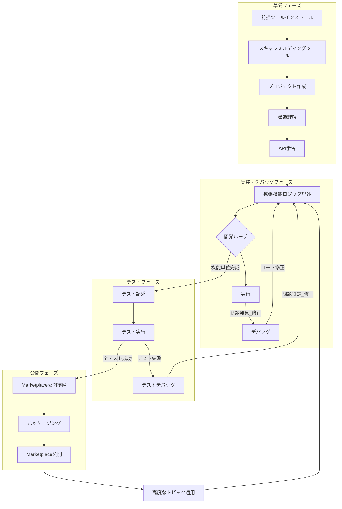
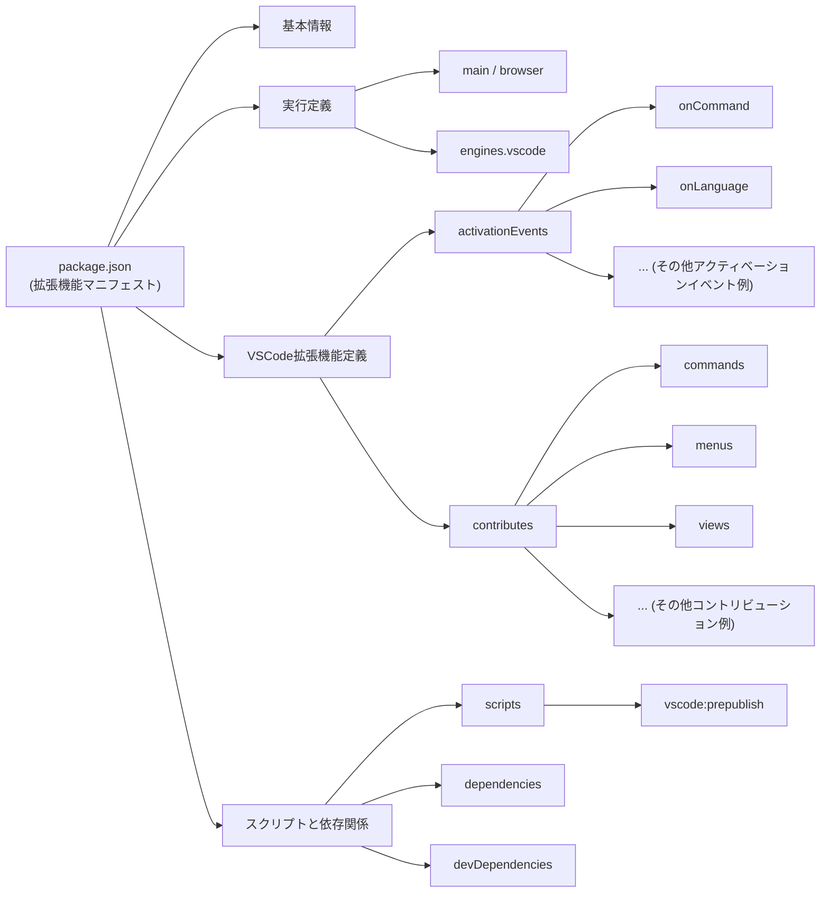
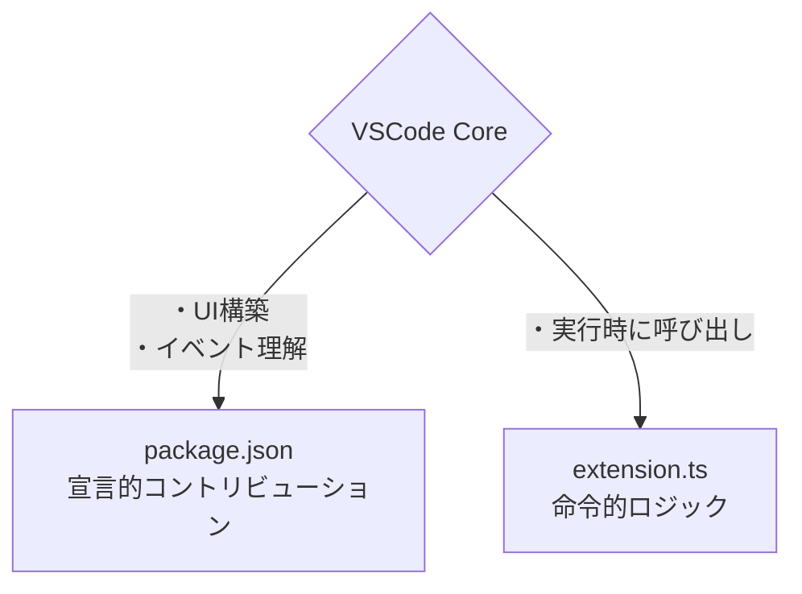

Visual Studio Code (VSCode) は、その高い拡張性により、世界中の開発者から絶大な支持を得ています。この記事では、VSCode拡張機能の開発プロセス全体を網羅的に解説します。開発環境のセットアップから、主要な概念、APIの活用、デバッグ、テスト、そしてVSCode Marketplaceへの公開までの流れを整理します。

## ■VSCode拡張機能開発の概要

### ●VSCodeの拡張性

VSCodeは、拡張性を設計の核としています。そのコア機能の多くは、サードパーティ開発者と同じAPIを用いた拡張機能として構築されています。このアプローチは、開発者の参入障壁を低くします。また、VSCode本体のソースコードを高度なAPI利用の参考とすることもできます。この設計思想が、活発で高機能な拡張機能エコシステムの形成を強力に促しています。これが、VSCodeの持続的な人気と高い適応性を支える主要因です。

### ●何を構築できるか？

VSCode拡張機能を用いることで、開発者は様々な機能を強化できます。

* **言語サポート:** 新規または既存のプログラミング言語に対するシンタックスハイライト、IntelliSense、リンティング、デバッグなどの機能の追加
* **テーマと外観:** カラーテーマやアイコンテーマ（ファイルアイコン、製品アイコン）によるVSCodeのルックアンドフィールのカスタマイズ
* **ワークフロー自動化:** 反復的なタスクの自動化、外部ツールとの連携、既存のエディタ機能の強化を行うコマンドの作成
* **カスタムUI要素:** サイドバーへの新しいビューの追加、ステータスバーアイテム、カスタムUIのためのWebviewパネル、カスタムエディタなどの追加
* **デバッグツール:** 特定のランタイムや環境向けのカスタムデバッガの統合
* **サービスとの連携:** VSCodeの外部サービス、API、またはプラットフォーム（例：Azure API Center）への接続
* **コードスニペット:** 様々な言語に対応した再利用可能なコードブロックの提供

VSCode拡張機能は、単純なスニペットから複雑な言語サーバーまで、膨大な種類が公開されています。この多様な可能性は、成熟した多用途なAPIによって支えられています。基本的なテーマ設定、コマンドによるアクション追加、カスタムUIの構築、さらには複雑な言語サーバーの実装まで、VSCode APIは幅広く対応します。このAPIは階層的な抽象化により設計されているため、単純な用途と高度な統合のどちらも実現することができます。

### ●開発プロセスの全体像



## ■開発環境のセットアップ

### ●必須の前提条件

拡張機能開発には以下のツールが不可欠です。

* **Node.jsとnpm/yarn:** VSCode拡張機能のNode.jsアプリケーションとしての動作。開発ツールと拡張機能自体の実行に必要。
* **Git:** バージョン管理に不可欠。スキャフォールディングツールによるリポジトリ初期化時の使用。
* **Visual Studio Code:** エディタ本体。拡張機能の開発とテストに必要。

### ●スキャフォルディングツール: Yeomanとgenerator-code

プロジェクトの初期設定を効率化するために、以下のツールが広く利用されています。

* **Yeoman (yo):** Webアプリケーション向けの汎用的なスキャフォールディングツール。
* **generator-code:** VSCode拡張機能プロジェクトの作成に特化したYeomanジェネレータ。

```sh
npm install -g yo generator-code
```
VSCode拡張機能開発は、Node.jsやYeomanなど標準的なWeb開発ツールを採用しています。このためWeb開発者は、使い慣れたエコシステムで開発に取り組むことができます。新しい専用ツールを学ぶ必要性が低く、学習コストを抑えることも可能です。

その結果、開発への参入障壁が下がります。また、既存の広範な開発者コミュニティからの迅速な参加も可能になります。これらの利点が、VSCode拡張機能マーケットプレイスの多様性と発展に貢献しています。

### ●yo codeによる最初のプロジェクト作成

`yo code`ジェネレータを使用すると、拡張機能プロジェクトの雛形を作成できます。

  * **ジェネレータの実行:** ターミナルでの`yo code`の実行。
  * **ジェネレータプロンプト:** プロジェクト設定のための一連の質問。
    * 拡張機能のタイプ（例：New Extension (TypeScript/JavaScript)、Color Theme、Language Support、Snippets）。TypeScript推奨。
    * 拡張機能名（例：HelloWorld）。
    * 拡張機能識別子（例：helloworld、名前に基づくデフォルト値）。
    * 説明。
    * Gitリポジトリを初期化するかどうか。
    * webpackでバンドルするかどうか（パフォーマンスと依存関係管理のために推奨）。
    * パッケージマネージャ（npm、yarn、pnpm）。
  * **プロジェクト構造:** ジェネレータによる標準的なディレクトリ構造の作成。

    ```
    HelloWorld/
    ├── .vscode/                    # VSCodeエディタ固有の起動設定やタスク設定などを格納するディレクトリです。
    ├── src/                        # 拡張機能のソースコードを格納するディレクトリです。
    ├── package.json                # 拡張機能の名前、依存パッケージなどを定義するマニフェストファイルです。
    └── vsc-extension-quickstart.md # 拡張機能開発を始めるにあたっての初期ガイダンスや基本的な情報です。
    ```

`yo code`ジェネレータは、VSCode拡張機能開発における初期セットアッププロセスを大幅に合理化します。このツールは、一貫したプロジェクト構造を確立し、ビルド及びデバッグに関するタスクを事前に設定します。これにより、開発者は複雑で時間のかかる手動設定作業から解放されます。

その結果、少ないエラーで、より効率的に開発をスタートできます。開発者は拡張機能本体のロジック開発に、より早期の段階から集中できます。さらに、標準化されたプロジェクト構造は、他の開発者がプロジェクトを理解し、貢献することを容易にします。

## ■VSCode拡張機能の構造

### ●マニフェストファイル (package.json)

すべてのVSCode拡張機能には、その中心的な定義ファイルとして`package.json`が必要です。このファイルは、拡張機能のマニフェストとして機能します。メタデータ、機能、アクティベーションルール、依存関係などを宣言します。



**VSCode拡張機能のための主要なフィールド**

| フィールド名              | 説明                                                                             | 例 / 一般的な値                                                            |
| :------------------------ | :------------------------------------------------------------------------------- | :------------------------------------------------------------------------- |
| name                      | 拡張機能の内部名（通常は小文字でハイフン区切り）                                 | my-cool-extension                                                          |
| publisher                 | MarketplaceでのパブリッシャーID                                                  | your-publisher-name                                                        |
| version                   | 拡張機能のバージョン（[https://semver.org/](https://semver.org/)）               | 0.0.1, 1.2.3                                                               |
| displayName               | MarketplaceやUIに表示される人間が読みやすい名前                                  | My Cool Extension                                                          |
| description               | 拡張機能の短い説明                                                               | Does cool things for VSCode.                                               |
| main / browser            | 拡張機能のエントリポイントとなるJavaScriptファイルへのパス                       | ./out/extension.js (main), ./dist/web/extension.js (browser)               |
| engines.vscode            | 拡張機能が依存するVSCode APIの最小バージョン                                     | ^1.75.0                                                                    |
| activationEvents          | 拡張機能をアクティブ化するイベントの配列                                         | `["onCommand:myExtension.helloWorld", "onLanguage:markdown"]`              |
| contributes               | 拡張機能がVSCodeに提供する機能（コマンド、メニュー、設定など）の宣言             | `{ "commands": [...], "menus": {...}, "configuration": {...} }`            |
| icon                      | Marketplaceに表示される拡張機能のアイコンファイルへのパス（128x128px PNG推奨）   | images/icon.png                                                            |
| repository                | 拡張機能のソースコードリポジトリ情報                                             | `{ "type": "git", "url": "https://github.com/yourname/my-extension.git" }` |
| categories                | Marketplaceでの拡張機能の分類                                                    | `["Programming Languages", "Snippets", "Linters", "Themes", "Other"]`      |
| scripts.vscode:prepublish | `vsce package`または`vsce publish`実行前に実行されるスクリプト（コンパイルなど） | npm run compile                                                            |

### ●エントリファイル (extension.ts)

拡張機能の実際のロジックは、エントリファイルに記述されます。

* **場所:** 通常、TypeScriptの場合は`src/extension.ts`、JavaScriptの場合は`src/extension.js`に配置。`package.json`の`main`または`browser`フィールドで指定。
* **`activate(context: vscode.ExtensionContext)`関数:**
    * 主要なエントリポイント。拡張機能の`activationEvents`のいずれかがトリガーされたときに**一度だけ**呼び出し。
    * すべての拡張機能のセットアップ、コマンド登録、イベントリスナーの購読はここでの実行。
    * 引数`context: vscode.ExtensionContext`は、ユーティリティ関数と、破棄可能なもの（クリーンアップが必要な購読）を格納する場所を提供。
    * コマンド登録の例:
      ```typescript
      import * as vscode from 'vscode';

      export function activate(context: vscode.ExtensionContext) {
          console.log('Congratulations, your extension "my-extension" is now active!');

          let disposable = vscode.commands.registerCommand('my-extension.sayHello', () => {
              vscode.window.showInformationMessage('Hello from My Extension!');
          });

          context.subscriptions.push(disposable); // クリーンアップのために重要
      }
      ```
* **`deactivate()`関数:**
    * オプションの関数。VSCodeがシャットダウンするとき、または拡張機能が無効化/アンインストールされるときに呼び出し。
    * あらゆるクリーンアップタスク（リソースの解放、接続のクローズなど）に使用。
    * クリーンアップが非同期の場合はPromiseの返却。

### ●アクティベーションイベント: 拡張機能はいつ起動するか？

アクティベーションイベントは、VSCodeがいつ拡張機能をロードしてアクティブ化すべきかを定義します。パフォーマンスとリソース管理にとって重要で、遅延読み込み戦略に従います。

| イベント                   | 説明                                                                   | 代表的なユースケース                                       | パフォーマンスに関する考慮事項                                           |
| :------------------------- | :--------------------------------------------------------------------- | :--------------------------------------------------------- | :----------------------------------------------------------------------- |
| `onCommand:<commandId>`    | 特定のコマンド実行時                                                   | コマンドパレットからの機能実行                             | 非常に効率的。コマンド実行時のみロード。                                 |
| `onLanguage:<languageId>`  | 特定言語のファイルを開いたとき                                         | 特定言語のシンタックスハイライト、リンター、スニペット提供 | 効率的。関連ファイルが開かれたときのみロード。                           |
| `onView:<viewId>`          | 特定のビュー（例：エクスプローラー内のカスタムツリー）が表示されたとき | カスタムUIビュー提供                                       | 効率的。ビューが表示されるときのみロード。                               |
| `workspaceContains:<glob>` | 特定ファイルパターンがワークスペース内に存在するとき                   | プロジェクト固有のツール（例：`package.json`がある場合）   | フォルダを開いたときにチェック発生。globが複雑だと若干のオーバーヘッド。 |
| `onStartupFinished`        | VSCodeの起動完了後                                                     | バックグラウンドタスク、ステータスバーの初期表示           | `*`よりは良いが、不要な場合は避けるべき。起動直後のリソースを消費。      |
| `*`                        | VSCode起動時                                                           | 常にアクティブである必要がある非常に稀なケース             | **非推奨**。VSCodeの起動パフォーマンスに大きな影響の可能性。極力回避。   |

### ●コントリビューションポイント: VSCodeの構造を拡張する

コントリビューションポイントは、`package.json`の`contributes`フィールドで宣言する、コードを含まない静的な設定情報です。これにより、拡張機能はUI要素の追加、機能の宣言、様々なVSCodeシステムとの統合などができるようになります。実際の処理ロジックは拡張機能のコード内に実装し、IDを使って宣言と紐付けます。

**主要なコントリビューションポイント**

| コントリビューションポイント (`contributes.*`) | 目的                                                                    | 一般的な例 / 主要プロパティ                                                                                      |
| :--------------------------------------------- | :---------------------------------------------------------------------- | :--------------------------------------------------------------------------------------------------------------- |
| `commands`                                     | コマンドパレットやメニューから実行可能なアクションの登録                | `title`, `command` (ID), `category`, `icon`                                                                      |
| `menus`                                        | エディタのコンテキストメニュー、タイトルバーなどへのコマンド項目の追加  | `commandPalette`, `editor/title`, `explorer/context` など。各項目に `command`, `when` (表示条件), `group` (順序) |
| `keybindings`                                  | コマンドへのキーボードショートカットの割り当て                          | `command`, `key`, `mac`, `when` (有効条件)                                                                       |
| `languages`                                    | 新しいプログラミング言語の定義や既存言語の拡張                          | `id`, `aliases`, `extensions`, `configuration` (言語設定ファイルパス)                                            |
| `grammars`                                     | 言語へのTextMate構文定義の関連付け、シンタックスハイライトの実現        | `language`, `scopeName`, `path` (文法ファイルパス)                                                               |
| `configuration`                                | ユーザーがカスタマイズ可能な拡張機能設定項目の定義                      | `title`, `properties` (JSONスキーマで各設定を定義: `type`, `default`, `description`)                             |
| `views`                                        | サイドバーやパネルへのカスタムツリービューやWebviewベースのビューの追加 | `id`, `name`, `when` (表示条件). `viewsContainers`と連携                                                         |
| `customEditors`                                | 特定のファイルタイプに対するカスタムエディタの提供                      | `viewType`, `displayName`, `selector` (ファイルパターン), `priority`                                             |
| `snippets`                                     | 特定言語向けのコードスニペット集の提供                                  | `language`, `path` (スニペットファイルパス)                                                                      |
| `themes`                                       | カラーテーマ（UI全体とシンタックスハイライト）の提供                    | `label`, `uiTheme` (`vs`, `vs-dark`), `path` (テーマファイルパス)                                                |

VSCode拡張機能開発では、package.jsonでの宣言とextension.tsでのロジックを分離します。この設計により、VSCodeは宣言を早期に解析して、UIを効率的に構築し、コア機能を保護します。これにより拡張機能の影響を管理し、エディタの堅牢性を高めます。



VSCodeの設計思想は、コントリビューションポイントで開発者の定型コードを減らしつつ制御も提供します。これにより開発者は本質的な開発に集中でき、エコシステム全体の質が向上します。

VSCodeはパフォーマンス最適化の責任を開発者に委ねます。そのため優れた拡張機能開発では、機能性に加え、ロード時間や実行性能などユーザー環境への配慮が不可欠です。


## ■VSCode拡張機能API

### ●`vscode`モジュール

VSCode拡張機能APIの核心は`vscode`モジュールを通じて公開されています。拡張機能ファイル（通常は`extension.ts`または`extension.js`）にインポートする必要があります。

```typescript
import * as vscode from 'vscode';
```

TypeScriptでは、型定義（`@types/vscode`）が重要です。IntelliSense、型チェック、エディタ内でのドキュメント参照を提供します。これらの型定義のバージョンは、`package.json`の`engines.vscode`フィールドと連動しています。

### ●主要なAPI名前空間とその機能

* **`vscode.window`**:
    * エディタウィンドウとの対話: メッセージ表示 (`showInformationMessage`, `showWarningMessage`, `showErrorMessage`)、入力ボックス (`showInputBox`)、クイックピック (`showQuickPick`)、プログレスインジケータ (`withProgress`)。
    * アクティブな要素へのアクセス: `activeTextEditor`, `activeTerminal`。
    * UI要素の作成: `createStatusBarItem`, `createWebviewPanel`, `createTreeView`。
    * イベント処理: `onDidChangeActiveTextEditor`, `onDidChangeVisibleTextEditors`。
* **`vscode.commands`**:
    * 新しいコマンドの登録: `registerCommand`。
    * 既存のコマンドの実行: `executeCommand`。
* **`vscode.workspace`**:
    * ワークスペース情報へのアクセス: `workspaceFolders`, `getConfiguration`（設定の読み取り）。
    * ファイルとドキュメントの操作: `openTextDocument`, `applyEdit`（`WorkspaceEdit`用）。
    * ワークスペースイベントの監視: `onDidChangeConfiguration`, `onDidOpenTextDocument`, `onDidSaveTextDocument`, `onDidCloseTextDocument`。
* **`vscode.languages`**:
    * 言語機能の登録: `registerHoverProvider`, `registerCompletionItemProvider`, `registerDefinitionProvider`, `registerCodeLensProvider` など。
    * 言語設定のセットアップ。
* **`vscode.extensions`**:
    * インストールされている拡張機能に関する情報の取得。
* **`vscode.Uri`**: ファイルパスやその他のリソース識別子の表現。
* **`vscode.Position`と`vscode.Range`**: ドキュメント内の位置と選択範囲の表現。
* **`vscode.TextDocument`と`vscode.TextEditor`**:
    * `TextDocument`: ファイルの内容の表現。`getText()`、`lineAt()`などのメソッド。
    * `TextEditor`: ドキュメントを表示するエディタインスタンスの表現。選択、編集（`edit()`）、範囲表示などのメソッド。

### ●APIの使用例

* **情報メッセージの表示**:

  ```typescript
  vscode.window.showInformationMessage('Hello World!');
  ```

* **選択されたテキストの取得**:

  ```typescript
  const editor = vscode.window.activeTextEditor;
  if (editor) {
      const selection = editor.selection;
      const text = editor.document.getText(selection);
      // text を使用した処理
  }
  ```

* **ステータスバーアイテムの追加**:

  ```typescript
  // activate 関数内
  let myStatusBarItem = vscode.window.createStatusBarItem(vscode.StatusBarAlignment.Left, 100);
  myStatusBarItem.text = `$(zap) My Status`; // $(zap) はアイコン
  myStatusBarItem.command = 'myExtension.myCommand'; // クリック時に実行されるコマンドID
  myStatusBarItem.show();
  context.subscriptions.push(myStatusBarItem); // 破棄可能オブジェクトとして登録
  ```

* **シンプルなWebviewの作成**:

  ```typescript
  // activate 関数内
  const panel = vscode.window.createWebviewPanel(
      'catCoding', // Webviewの識別子
      'Cat Coding', // Webviewのタイトル
      vscode.ViewColumn.One, // 表示するカラム
      {} // Webviewオプション
  );

  panel.webview.html = getWebviewContent(); // HTMLコンテンツを返す関数

  function getWebviewContent() {
      return `<!DOCTYPE html>
      <html lang="en">
      <head>
          <meta charset="UTF-8">
          <meta name="viewport" content="width=device-width, initial-scale=1.0">
          <title>Cat Coding</title>
      </head>
      <body>
          <h1>Cat Coding</h1>
          
      </body>
      </html>`;
  }
  context.subscriptions.push(panel);
  ```

* **ホバープロバイダの登録**:

  ```typescript
  // activate 関数内
  const hoverProvider = vscode.languages.registerHoverProvider('javascript', {
      provideHover(document, position, token) {
          // マウスカーソルが置かれた単語を取得する例
          const wordRange = document.getWordRangeAtPosition(position);
          const word = document.getText(wordRange);

          if (word === 'console') {
                return new vscode.Hover('`console.log` はデバッグ情報を出力します。');
          }
          return new vscode.Hover('I am a hover!');
      }
  });
  context.subscriptions.push(hoverProvider);
  ```

TypeScriptと`@types/vscode`の統合は、開発者体験を向上させます。静的型付け、自動補完、APIドキュメントの提供により、ランタイムエラーを減らし開発を効率化します。そのため、特に複雑な拡張機能開発ではTypeScriptの使用を推奨します。

VSCode拡張機能開発では、多くのAPI操作で破棄可能なリソースを扱います。`ExtensionContext.subscriptions.push()`を使い、これらのリソースを登録することが重要です。この仕組みにより、拡張機能の非アクティブ化時にVSCodeがリソースを自動的に破棄し、メモリリークを防ぎクリーンアップを簡素化します。

## ■ビルドとデバッグ

拡張機能のアイデアを形にするには、コーディング、実行、デバッグという反復的なプロセスが必要です。このセクションでは、その具体的なワークフローについて解説します。

### ●拡張機能ロジックの記述

拡張機能の核となる機能は、主に`activate`関数内、および必要に応じて作成するヘルパー関数やクラス内に実装します。これは通常、`extension.ts`（TypeScriptの場合）または`extension.js`（JavaScriptの場合）ファイルで行われます。前述のVSCode APIを駆使して、目的の動作を実現します。TypeScriptプロジェクトの場合、コードは通常`out`または`dist`ディレクトリ内のJavaScriptにコンパイルされます。`yo code`ジェネレータは、`tsconfig.json`と、変更時に自動的に再コンパイルするwatchタスクを設定します。

### ●拡張機能開発ホストでの拡張機能の実行

作成した拡張機能を実際に動作させて確認するには、拡張機能開発ホスト（Extension Development Host, EDH）を使用します。

* 拡張機能を起動するには、F5キーを押します。または、VSCodeの「実行とデバッグ」ビューで「拡張機能の実行」を選択します。
* 上記の操作をすると、まず必要に応じて拡張機能をコンパイルします。その後、拡張機能開発ホスト（EDH）、つまり拡張機能をロードした新しいVSCodeウィンドウが起動します。
* 拡張機能開発ホスト（EDH）では、ユーザーと同じように拡張機能と対話したり、テストしたりできます。
* コードを記述している元のVSCodeウィンドウは、デバッガとして機能します。

### ●デバッグテクニック

* **`launch.json`設定**
  * `.vscode/launch.json`に配置します。このファイルでデバッガを設定します。
  * `yo code`ジェネレータは、拡張機能を起動するためのデフォルト設定を作成します。
  * 多くの場合、起動前にTypeScriptをコンパイルするための`preLaunchTask`を含みます。このタスクは`.vscode/tasks.json`で定義します。
* **ブレークポイント**
  * プライマリVSCodeウィンドウの`extension.ts`や他のソースファイルに、直接ブレークポイントを設定します。
  * EDHでコードを実行すると、ブレークポイントに到達した際に一時停止します。このとき、変数を検査したり、コードをステップ実行したりできます。
* **デバッグコンソール**
  * プライマリVSCodeウィンドウのデバッグコンソールは、拡張機能コード内の`console.log()`からの出力を表示します。
  * 変数の状態、実行フロー、エラーをログに記録するのに役立ちます。
* **開発者ツール**
  * 「ヘルプ」メニューの「開発者ツールの切り替え」からアクセスします。
  * ここの「コンソール」タブでは、特にWebviewコンテンツや言語サーバー通信に関する、より詳細なログを表示できます。
  * 「ソース」タブも、特に複雑なシナリオやWebviewのJavaScriptをデバッグするのに使用できます。
* **変更の再読み込み**
  * コードを変更した後、EDHを再読み込みして変更を有効にします。
  * 再読み込みは、以下のいずれかの方法で行います。
      * プライマリVSCodeウィンドウのデバッグツールバーにある「再起動」ボタンをクリックします。
      * EDHのコマンドパレットから「開発者: ウィンドウの再読み込み」コマンドを実行します。このコマンドはCtrl+RまたはCmd+Rでも実行できます。

VSCodeの統合デバッグ体験は、開発を大幅に加速させます。開発者は同じ環境でコーディング、テスト、デバッグをスムーズに実行できます。F5キーで起動する拡張機能開発ホスト（EDH）とメインエディタのブレークポイントにより、コンテキストの切り替えを最小限にし、開発プロセスを合理化します。

TypeScriptの自動再コンパイルであるwatchモードと、拡張機能開発ホスト（EDH）の再読み込み機能は、反復的な開発を促進します。ファイル変更は自動でコンパイルされ、EDHを再読み込みしてすぐにテストできます。この迅速なフィードバックループは、効率的な開発とバグ修正に不可欠です。

### ●ロギングとエラー処理

* 診断のための`console.log`、`console.warn`、`console.error`の使用。
* 拡張機能が拡張ホストをクラッシュさせないための、堅牢なエラー処理（`try-catch`ブロック）の実装。
* ユーザー向けのエラーメッセージ表示のための、`vscode.window.showErrorMessage`の使用。

効果的なトラブルシューティングでは、ログが出る場所の理解が鍵です。メイン拡張機能のログはデバッグコンソールに出ます。Webviewのログは開発者ツールコンソールに出ます。そのため、問題によっては両方のコンソールを確認します。ログが出る場所が分かれているのは、VSCodeのマルチプロセスアーキテクチャのためです。

## ■VSCode拡張機能のテスト

### ●テストの重要性

* 拡張機能の信頼性と正確性の保証。
* リグレッション（機能低下）の検出による、リファクタリングと将来の開発の容易化。
* ユーザーの信頼の構築と、より質の高い拡張機能への貢献。

### ●テストの種類

VSCode拡張機能のテストは、主に2種類に分類されます。

* **単体テスト:** 個々の関数やモジュールの、VSCode APIに直接依存しない独立したテスト。実行速度の速さが特徴。
* **統合テスト:** 拡張機能がVSCode APIや環境とどのように相互作用するかのテスト。これらのテストは、VSCodeの特別な「拡張機能開発ホスト」インスタンス内での実行。
    * VSCodeのテスト関連ドキュメントでは、主にこの統合テストに焦点。

### ●ツールとフレームワーク

拡張機能のテストには、いくつかの標準的なツールとフレームワークが利用されます。

* **Mocha:** VSCode拡張機能テストで一般的に使用される、人気のあるJavaScriptテストフレームワーク。
* **`@vscode/test-cli`と`@vscode/test-electron`**:
    * `@vscode/test-cli`: 拡張機能テストを実行するためのVSCodeチーム提供のコマンドラインツール。
    * `@vscode/test-electron`: `@vscode/test-cli`がテスト用にVSCodeをダウンロードして実行するための使用。
    * VSCode内でのMochaテスト実行のための迅速なセットアップ提供。
    * 設定は`.vscode-test.js/mjs/cjs`ファイルでの実行。
* **テストランナースクリプト**:
    * より高度なセットアップでは、カスタムテストランナースクリプト（例：`src/test/suite/index.ts`）からプログラムを実行（多くの場合MochaのAPIを使用）。
    * このスクリプトは、`--extensionTestsPath`を使用したテスト実行時にVSCodeから呼び出し。

VSCode拡張機能開発では、統合テストが開発ライフサイクルの重要な部分です。VSCodeチームはこれを奨励し、専用ツール`@vscode/test-cli`も提供しています。拡張機能はVSCode環境やAPIと深く相互作用するため、単体テストだけでは検証に不十分です。そのため、VSCodeは実際の環境でテストを実行する仕組みを提供しており、信頼性の高い拡張機能を作るには統合テストが不可欠です。

### ●テストの記述と実行

* **テスト構造（Mochaの例）**:
  * テストの通常配置場所: `src/test/suite/`ディレクトリ。
  * テストのグループ化のための`suite()`の使用。個々のテストケース定義のための`test()`の使用。
  * 結果検証のためのアサーションライブラリ（例：Node.jsの`assert`モジュール）の使用。
  * 例:
    ```typescript
    import * as assert from 'assert';
    import * as vscode from 'vscode'; // 統合テストではVSCode APIを使用可能

    suite('Extension Test Suite', () => {
        test('Sample test', () => {
            assert.strictEqual([1, 2, 3].indexOf(5), -1);
            assert.strictEqual([1, 2, 3].indexOf(0), -1);
        });

        test('My Feature Test', async () => {
            // 例: コマンドをアクティブ化し、その効果を確認する
            // 拡張機能が 'myExtension.myCommand' というコマンドを登録していると仮定
            // await vscode.commands.executeCommand('myExtension.myCommand');
            // ここにアサーションを追加
            // vscode.window.showInformationMessage('Test command executed');
            assert.ok(true, 'Test passed'); // 単純な成功例
        });
    });
    ```

* **テストの実行:**

    * `npm/yarn`スクリプト経由: `npm run test`または`yarn test`。これは通常、`@vscode/test-cli`またはカスタムスクリプトの呼び出し。
    * VSCode UI経由: 「テスト: すべてのテストを実行」コマンドの使用（Extension Test Runner拡張機能が必要）。

VSCodeの統合テストでは、完全なAPIを使いユーザーに近いテストを行うことで、高い信頼性を得られます。しかし、ライブ環境との対話は不安定さや複雑さを招くことがあるため、安定したテストの作成には開発者の努力が不可欠です。


### ●テストのデバッグ

* `launch.json`設定から、テストの起動およびデバッグ。
    * `type: "extensionHost"`、`args`への`--extensionTestsPath`の受け渡し。
* テストファイル（`*.test.ts`）へのブレークポイント設定と、実行のステップ実行。
* UIベースのデバッグのための、「テスト: すべてのテストをデバッグ」コマンドの使用。

### ●テストのベストプラクティス

  * 様々な側面のテスト: コマンド、UIインタラクション、API使用、エッジケース。
  * 可能な限りテストを短く分離。
  * 非同期操作へのタイムアウトベースのチェック。
  * テスト終了後のクリーンアップの確認（例：開いたドキュメントのクローズ、設定を元に戻す）。
  * CI/CDパイプラインへのテストの統合。
  * テストに使用するVSCodeインスタンスへの注意。開発にはInsiders版、テストにはStable版の使用、または干渉を避けるためのテスト実行中の他の拡張機能の無効化の検討。

VSCode拡張機能テストでは、信頼性と再現性を確保するために、制御され分離されたテスト環境の作成が重要です。テスト実行時には、他のVSCodeインスタンスと競合したり、他の拡張機能が干渉したりすることがあります。そのため、異なるVSCodeバージョンを使用したり、他の拡張機能を無効にしたりするなど、テスト環境を分離する戦略を用います。堅牢なテストのためには、テストコードの記述に加え、テスト実行環境の慎重な管理も不可欠です。


## ■VSCode Marketplaceへのパッケージングと公開

### ●`vsce`: VSCode拡張機能マネージャCLI

`vsce`（Visual Studio Code Extensions）は、VSCode拡張機能のパッケージング、公開、管理を行うための公式コマンドラインツールです。

* インストール: `npm install -g @vscode/vsce`

**拡張機能管理のための主要な`vsce`コマンド**

| コマンド                                 | 説明                                                                          | 使用例                                   |
| :--------------------------------------- | :---------------------------------------------------------------------------- | :--------------------------------------- |
| `vsce package`                           | 拡張機能の `.vsix` ファイルへのパッケージング                                 | `vsce package`                           |
| `vsce publish [major \| minor \| patch]` | 拡張機能のパッケージングとMarketplaceへの公開。オプションでバージョンアップ。 | `vsce publish patch`                     |
| `vsce login <publisherName>`             | 指定されたパブリッシャーのPATの保存と認証                                     | `vsce login mypublisher`                 |
| `vsce unpublish <publisher.extension>`   | Marketplaceからの拡張機能の非公開                                             | `vsce unpublish mypublisher.myextension` |

### ●Marketplace公開のための準備

Marketplaceで拡張機能を魅力的に見せ、適切に機能させるためには、いくつかの準備が必要です。

* **README.md:** このファイルの内容が、拡張機能のMarketplaceページの主要コンテンツ。情報の豊富さ、魅力的な記述。公開GitHubリポジトリがリンクされていれば、`vsce`による画像パス調整が可能。
* **LICENSE:** ライセンスファイル（例：`LICENSE.md`または`LICENSE.txt`）の包含。
* **CHANGELOG.md:** 各バージョンの変更点の文書化。Marketplaceへの表示。
* **`package.json` / `icon`:** 拡張機能用の128x128ピクセルのPNGアイコンの提供。
* **`package.json` / `publisher`:** MarketplaceのパブリッシャーIDとの一致させる。
* **`package.json` / `repository`:** GitHub（またはその他）のリポジトリへのリンクの記載。
* **`.vscodeignore`:** パッケージ化された`.vsix`ファイルから除外するファイルやフォルダの指定（例：ソースマップ、テストファイル、ランタイムに不要な大きなアセットなど）。`devDependencies`は自動的に無視。
* **`package.json` / `scripts.vscode:prepublish`:** パッケージング前に実行されるスクリプト（例：最終コンパイル、最小化など）。

### ●公開プロセス

* **Azure DevOpsアカウント:** VSCode MarketplaceのサービスとしてのAzure DevOpsの使用。Azure DevOps組織が必要。
* **パブリッシャーIDの作成:**
    * Visual Studio Marketplaceパブリッシャー管理ページへのアクセス。
    * 新しいパブリッシャーの作成と、一意なIDと名前の指定。IDは後からの変更不可。
* **パーソナルアクセストークン (PAT):**
    * Azure DevOps組織での、「Marketplace (Manage)」スコープと「All accessible organizations」を持つPATの作成。
* **`vsce`でのログイン:**
    * `vsce login <yourPublisherId>`
    * PATを貼り付け。
* **公開:**
    * 拡張機能のルートディレクトリで`vsce publish`を実行。
      * `.vsix`をMarketplaceパブリッシャー管理ページで手動アップロードも可能。

VSCode拡張機能の公開プロセスは、Azure DevOpsとPAT、つまり個人アクセストークンに依存します。PATには有効期限があり、設定ミスや期限切れは公開失敗の原因になります。そのため、開発者はこの外部依存関係を理解し、PATを適切に管理することが重要です。

VSCode拡張機能の公開では、コードだけでなく、明確なドキュメントや適切なライセンス、魅力的なアイコンも重要です。これらの要素はユーザーの信頼と発見可能性を高め、Marketplaceでの見栄えを良くします。成功のためには、機能性以外のこれらの「ソフトな」側面にも注意を払う必要があります。

### ●`.vsix`ファイルの手動インストール

パッケージ化された`.vsix`ファイルは、Marketplaceを介さずに直接VSCodeにインストールできます。

* VSCode UIから: `拡張機能ビュー` > `「...」メニュー` > `VSIXからのインストール...`
* コマンドラインから: `code --install-extension my-extension-0.0.1.vsix`

## ■高度なトピックとベストプラクティス

基本的な拡張機能開発の枠を超え、より洗練され、パフォーマンスが高く、ユーザーフレンドリーな拡張機能を作成するためには、いくつかの高度なトピックとベストプラクティスを理解することが重要です。

### ●Language Server Protocol (LSP)によるリッチな言語サポート

* **概念:** LSPは、開発ツール（VSCodeなど）と言語インテリジェンスプロバイダ（言語サーバー）間の通信の標準化。
* **利点:** 自動補完、定義へのジャンプ、診断などの複雑な言語機能の、別のサーバープロセス（潜在的に任意の言語で実装可能）への実装と、異なるエディタ間での再利用。
* **用途:** プログラミング言語に対する深いサポートを提供する拡張機能向け。

### ●ユーザーエクスペリエンス (UX) ガイドライン

VSCodeによる、統合された直感的な拡張機能を作成するための[UXガイドライン](https://code.visualstudio.com/api/ux-guidelines/overview)。

* コマンドや設定の発見可能性、明確さ、パフォーマンス、エラー処理の考慮。
* 押し付けがましい通知の回避と、永続的な情報へのステータスバーアイテムやビューの使用。

### ●パフォーマンス最適化戦略

VSCode拡張機能開発では、パフォーマンス最適化が重要です。これは共有責任であり、VSCodeが高性能なホストを提供する一方で、開発者も遅延読み込みや非同期操作などのベストプラクティスを実践して、効率的なコードを書く必要があります。非効率な拡張機能はリソースを消費しパフォーマンスを低下させるため、パフォーマンスへの配慮は優れた拡張機能を作る上で不可欠です。

  * **遅延読み込み:** 特定の`activationEvents`の使用による、必要な場合のみの拡張機能のアクティブ化。`*`の回避。
  * **非同期操作:** I/Oや時間のかかるタスクへの`async/await`の使用による、拡張ホストのブロッキングの防止。
  * **Webpack:** 拡張機能のバンドルによるファイルI/Oの削減と、ロード時間の改善。
  * **効率的なデータ構造とアルゴリズム:** 標準的なソフトウェアエンジニアリングのベストプラクティスの適用。
  * **キャッシング:** 負荷の高い計算結果やネットワークリクエストの適切なキャッシュ。
  * **Webワーカー:** Web拡張機能での計算量の多いタスクへの、Webワーカーへのオフロード。
  * **起動時の影響を最小限に:** 重要でない操作のアクティベーション後までの遅延。

### ●国際化とローカライゼーション (i18n)

より多くのユーザーにリーチするためには、UI要素（コマンド、タイトル、メッセージ）を複数言語サポートが必要です。

* **`package.nls.json`と`package.nls.<locale>.json`:**
  * `package.json`コントリビューションのローカライズされた文字列を格納。
  * `package.json`では`%{key}%`構文を使用。
* **プログラムによるローカライズ:**
  * `vscode.env.language`に基づいて、`extension.ts`で適切な文字列をロード。

### ●ソース管理とCI/CD

開発プロセスの効率化と品質維持のために、以下のプラクティスを導入します。

* バージョン管理へのGitの使用。
* 継続的インテグレーション（CI）の実装による、コミットごとの拡張機能のビルド、リンティング、テストの自動実行（例：GitHub Actions）。
* タグ付けされたリリースに対する、Marketplaceへの公開を自動化する継続的デプロイメント（CD）の検討。


## ■一般的な問題のトラブルシューティング

### ●一般的な落とし穴とエラー

* **アクティベーションの問題:** 拡張機能が期待通りにロードされない。
    * `package.json`の`activationEvents`の確認。
    * デバッグコンソールでの`activate`関数のエラー確認。
* **APIの誤用:** VSCode APIの使い方が間違っている。
    * APIドキュメントとサンプルの参照。
    * Promiseの拒否や不正な引数の有無確認。
* **`command... not found`エラー**:
    * `package.json`のコマンドIDと`vscode.commands.registerCommand`で使用されるIDの一致確認。
    * コマンドが呼び出される前の拡張機能のアクティブ化確認。
* **CLIダウンロードの失敗**:
    * ネットワーク接続、プロキシ設定の確認。
    * リリースチャネルの設定確認。
* **環境問題**:
    * 不正なシェルパス、環境変数がないか確認。
    * Windowsの互換モードの影響ではないか確認。
* **パフォーマンスの問題:** 拡張機能が原因で動作が遅延する。
    * 拡張機能のプロファイルを確認。
    * アクティベーションイベントと非同期操作の見直し。

### ●一般的な問題に対するデバッグ戦略

拡張機能は複雑な環境（VSCode、他の拡張機能と共に）で実行されます。そのため、問題はコードのバグ、APIの誤用、環境の競合、VSCodeのバグなど、様々な原因から発生する可能性があります。デバッグには、異なるログ出力の確認、コードの単純化、公式ドキュメントやコミュニティフォーラムの確認など、多角的なアプローチが必要です。

* **ログの確認**:
  * VSCodeデバッグコンソール（拡張ホストのログ用）。
  * 開発者ツールコンソール（ヘルプ \> 開発者ツールの切り替え）UI/Webviewの問題、言語サーバーのログ用。
  * 拡張機能または関連ツールがサポートしている場合の、詳細ログまたはデバッグログの有効化。
* **単純化と分離:** 問題のあるセクションを特定するための、コードの一部のコメントアウト。
* **クリーンな環境でのテスト:** 他の拡張機能の無効化による、競合の可能性の排除。
* **公式ドキュメントとFAQの確認**: 一般的な問題の解決策の包含の可能性。
* **VSCode Issue Trackerの確認**: 同様のイシュー、特に「extensions-development」タグが付いているものの検索。

## ■まとめ

VSCode拡張機能開発には、環境や設定、概念の把握が必要でした。APIを活用しベストプラクティスに従った実装、デバッグ、テストを経て、`vsce`で公開します。そして、VSCodeとAPIは進化し続けます。**拡張機能を長期的に保守**するために、開発者は**継続的**に、**リリースノートを確認**し、**学習しつづける**必要があります。


## ■参考リンク

- GitHub
    - [microsoft/vscode-extension-samples](https://github.com/microsoft/vscode-extension-samples)
    - [microsoft/vscode-discussions](https://github.com/microsoft/vscode-discussions)
    - [robole/vscode-javascript-extensions](https://github.com/robole/vscode-javascript-extensions)
- Visual Studio Marketplace
    - [Extensions for Visual Studio Code](https://marketplace.visualstudio.com/vscode)
- Visual Studio Code Docs
    - [Extension Marketplace - Visual Studio Code](https://code.visualstudio.com/docs/configure/extensions/extension-marketplace)
    - [Extension API | Visual Studio Code Extension API](https://code.visualstudio.com/api)
    - [Your First Extension - Visual Studio Code](https://code.visualstudio.com/api/get-started/your-first-extension)
    - [Extension Anatomy - Visual Studio Code](https://code.visualstudio.com/api/get-started/extension-anatomy)
    - [Publishing Extensions | Visual Studio Code Extension API](https://code.visualstudio.com/api/working-with-extensions/publishing-extension)
    - [Extension Host | Visual Studio Code Extension API](https://code.visualstudio.com/api/advanced-topics/extension-host)
    - [Activation Events | Visual Studio Code Extension API](https://code.visualstudio.com/api/references/activation-events)
    - [Contribution Points | Visual Studio Code Extension API](https://code.visualstudio.com/api/references/contribution-points)
    - [Testing Extensions | Visual Studio Code Extension API](https://code.visualstudio.com/api/working-with-extensions/testing-extension)
    - [Debug code with Visual Studio Code](https://code.visualstudio.com/docs/debugtest/debugging)
    - [Troubleshoot Terminal launch failures - Visual Studio Code](https://code.visualstudio.com/docs/supporting/troubleshoot-terminal-launch)
    - [Visual Studio Code FAQ](https://code.visualstudio.com/docs/supporting/FAQ)
- readthedocs
    - [Extension points - vscode-docs](https://vscode-docs.readthedocs.io/en/latest/extensionAPI/extension-points/)
    - [Yocode - vscode-docs](https://vscode-docs.readthedocs.io/en/stable/tools/yocode/)
    - [Debugging extensions - vscode-docs](https://vscode-docs.readthedocs.io/en/stable/extensions/debugging-extensions/)
    - [vscecli - vscode-docs](https://vscode-docs.readthedocs.io/en/latest/tools/vscecli/)
- 記事
    - [VSCodeの拡張機能を作る手順 - Zenn](https://zenn.dev/daifukuninja/articles/13a35a8bb3a4a1)
    - [自作 VS Code 拡張を3年ぶりにアップデートして浦島太郎になった話](https://developer.mamezou-tech.com/blogs/2023/07/11/update-vs-code-extension/)
    - [21 questions you'll ask if you develop a VSCode extension - Packmind](https://packmind.com/21-questions-building-vscode-extension/)
    - [知識0の状態からたった2時間でVSCodeの拡張機能を作った話 - Qiita](https://qiita.com/_ken_/items/06161e8d4bac5e0bd209)
    - [How to write VS Code extensions: guide & best practices - Symflower](https://symflower.com/en/company/blog/2023/vscode-extension-development/)


この記事が少しでも参考になった、あるいは改善点などがあれば、ぜひリアクションやコメント、SNSでのシェアをいただけると励みになります！
