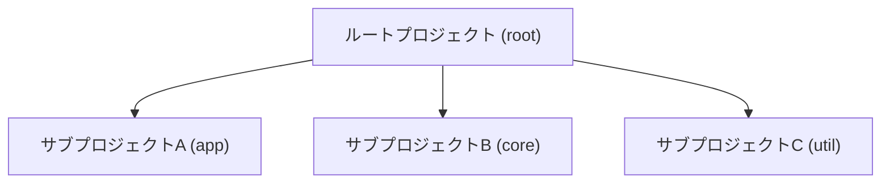

## はじめに

「AさんのPCでは動くのに、BさんのPCではビルドが通らない」「レビューの度にインデントやimport順の指摘が飛び交う」「ローカルでは成功したのに、CIで静的解析エラーが出て手戻りが頻発する」。
現代のJava開発において、このような環境の属人化や品質基準のばらつきは、生産性を阻害する大きな要因です。

この記事では、Visual Studio Code (VS Code) とGradleを軸に、これらの課題を解決し、個人からチームまで対応できる**品質と生産性を両立したJava開発環境**の構築方法を体系的に解説します。

本ガイドが目指すゴールは、単なるツールの導入手順ではありません。以下の状態を実現することです。

  - **生産性の高いIDE**: VS Code上に、ストレスなく開発に集中できる堅牢なJava開発環境を構築する。
  - **品質の自動化**: コードフォーマットと静的解析を自動化し、コード品質を一貫して、かつ客観的に維持する。
  - **効率的なビルド**: Gradleのマルチプロジェクト機能を活用し、大規模プロジェクトでも保守性の高いビルドロジックを管理する。
  - **DevOpsの円滑化**: 開発者のローカル環境とCI/CDパイプラインの検証プロセスを完全に一致させ、手戻りのないスムーズなワークフローを実現する。

## 第1部: VS Codeによる開発環境の基礎

開発環境の基盤となる、VS Codeの必須コンポーネントの導入と設定を説明します。

### 第1章: 必須拡張機能とJDK設定

#### 1.1. 中核をなす「Extension Pack for Java」

まず、Microsoft提供の「**Extension Pack for Java**」を導入します。これはJava開発に必要な基本機能をパッケージ化したものです。

| 拡張機能 (ID) | 主な役割 |
| :--- | :--- |
| `Language Support for Java™ by Red Hat` | コード補完、リファクタリング、エラーチェックなどの言語サポート |
| `Debugger for Java` | ブレークポイント設定やステップ実行などのデバッグ機能 |
| `Test Runner for Java` | JUnit/TestNGの検出・実行・デバッグ |
| `Gradle for Java` | Gradleタスク実行・プロジェクト連携 |
| `Project Manager for Java` | プロジェクト単位のビューと操作 |
| `Visual Studio IntelliCode` | AIによるコンテキスト補完 |

#### 1.2. JDKランタイムの適切な設定（IDE × Buildを一致）

開発者ごとやCI/ローカル間の環境差異をなくすため、IDEとビルドの両方でJDKバージョンを固定します。

  - **IDE側の設定（例：`.vscode/settings.json`）**
    VS Codeが使用するJDKを指定します。

    ```json:.vscode/settings.json
    {
      "java.jdt.ls.java.home": "/path/to/your/jdk-21",
      "java.configuration.runtimes": [
        { "name": "JavaSE-21", "path": "/path/to/your/jdk-21" }
      ]
    }
    ```

  - **Build側の固定（Gradle Java Toolchains）**
    IDEの設定だけでは端末差分が残りうるため、Gradleの**Java Toolchains**でビルドJDKを固定します。これにより、必要なJDKがローカルになければGradleが自動でダウンロードし、CI/ローカル間のJDK差異を根本から排除できます。

    ```kotlin:build.gradle.kts
    java {
      toolchain {
        languageVersion.set(JavaLanguageVersion.of(21))
      }
    }
    ```

### 第2章: コードフォーマットの自動化（Google Java Format）

コードスタイル統一は、レビュー効率と可読性の向上に直結します。ここではGoogle Java Styleに準拠した**google-java-format (GJF)**をIDEとビルドの両面で扱う方法を示します。

#### 2.1. アプローチの選択: IDE連携 vs ビルド連携

  - **IDE連携（方法A）**: VS Code拡張により保存時に自動整形。素早いフィードバックで生産性を後押しします。
  - **ビルド連携（方法B）**: Gradleプラグインで整形・検証をビルドに統合。CI/CDでチーム全体にスタイルを強制できます。

**推奨**: 両者を**併用**します。日常は**方法A**で快適に開発し、品質ゲートは**方法B**で厳格に検証する体制が理想です。

#### 2.2. 方法A: VS Code拡張機能によるリアルタイムフォーマット

1.  VS Codeの拡張機能マーケットプレイスから `JoseVSeb.google-java-format-for-vs-code` をインストールします。

2.  `.vscode/settings.json` に以下の設定を追加し、フォーマッタの既定化と保存時整形を有効化します。

    ```json:.vscode/settings.json
    {
      "[java]": {
        "editor.defaultFormatter": "JoseVSeb.google-java-format-for-vs-code",
        "editor.formatOnSave": true
      },
      "java.format.settings.google.version": "1.28.0",
      "java.format.settings.google.mode": "native-binary"
    }
    ```

    :::message
    GJFはルールをカスタマイズさせない「非可変」の方針を採ることで、ツールにスタイルを委ね、チーム間の不毛な議論を根本からなくせるのが強みです。
    :::

#### 2.3. 方法B: Gradleプラグインによる一貫性の強制

1.  **バージョンカタログにプラグインを定義**
    `gradle/libs.versions.toml` に、使用するプラグインを定義します。

    ```toml:gradle/libs.versions.toml
    [versions]
    google-java-format-plugin = "0.9"

    [plugins]
    google-java-format = { id = "com.github.sherter.google-java-format", version.ref = "google-java-format-plugin" }
    ```

2.  **コンベンションプラグインに適用**
    共有ビルドロジック（第6章参照）の中でプラグインを適用します。

    ```kotlin
    plugins {
      `java-library`
      alias(libs.plugins.google.java.format)
    }
    ```

3.  **フォーマットの実行と検証**
    以下のGradleタスクが利用可能になります。

      - `./gradlew googleJavaFormat`: ソースコードをフォーマットします。
      - `./gradlew verifyGoogleJavaFormat`: フォーマットが規約通りか検証します。**CIでの品質ゲート**に利用します。

:::message
**原則**: CI/CDパイプラインでは `verifyGoogleJavaFormat` タスクを実行し、フォーマットされていないコードがマージされるのを防ぎます。こちらが品質担保の**正**となります。
:::

### 第3章: 静的解析ツールによるリアルタイムフィードバック

:::message
**IDE拡張とGradleタスクの役割分担**
開発中はIDE拡張で素早くフィードバックを得て生産性を高めます。しかし、最終的な品質判定は**Gradleの`check`タスク**に委ねるのが原則です。IDEの警告はあくまで「ヒント」と位置づけ、信頼性の源泉（Source of Truth）はビルドシステムにある、という原則が極めて重要です。
:::

本ガイドでは、それぞれ異なる強みを持つ以下のツールを組み合わせ、多角的な品質チェックを行います。

| ツール | 主な目的 | 解析対象 |
| :--- | :--- | :--- |
| **Checkstyle** | コーディング規約への準拠をチェック | ソースコード |
| **PMD** | 潜在的なバグやアンチパターンを検出 | ソースコード |
| **SpotBugs** | 論理的なバグや脆弱性を検出 | コンパイル後のバイトコード |
| **SonarLint** | セキュリティ脆弱性や複雑な「コードスメル」を検知 | ソースコード |

#### 3.1. Checkstyleによるコーディング規約の適用

1.  **インストール**: `Checkstyle for Java` (shengchen.vscode-checkstyle) をインストールします。

2.  **設定**: `.vscode/settings.json` でIDEとビルドで同一の設定ファイルを参照するようにします。

    ```json:.vscode/settings.json
    {
        "java.checkstyle.version": "11.0.1",
        "java.checkstyle.configuration": "${workspaceFolder}/config/quality/google_checks.xml",
        "java.checkstyle.autocheck.enabled": true
    }
    ```

:::message

#### フォーマッター(GJF)とリンター(Checkstyle)の協調

`google-java-format`がコードの「見た目」を整えるのに対し、Checkstyleはコードの「構造や品質」を検証します。Google公式のルールセット (`google_checks.xml`) をベースに、両者を協調させるための代表的な調整ポイントは以下の通りです。

  - **行の長さ**: GJFは100文字で固定です。Checkstyleの`LineLength`モジュールも100に設定し、`package`文や`import`文は検査対象から除外します。
  - **Import順序**: Google Java Styleでは **「非静的インポート」と「静的インポート」の2グループのみ** を定義します。これに合わせ、Checkstyleの`CustomImportOrder`モジュールを設定します。
  - **演算子の改行**: GJFの折り返しルールに合わせ、Checkstyleの`OperatorWrap`モジュールを適切に設定します。

**推奨方針:**

  - **IDE（開発体験）**: `google-java-format`で自動整形。`import`はIDEの機能（`Shift+Alt+O`）で整理。
  - **CI/CD（品質ゲート）**: Checkstyleを「正」とし、上記のように設定を調整してGJFとの矛盾を解消する。
  - **チーム合意**: ルールをバージョン管理し、チーム全体で共有する。

:::

#### 3.2. PMDによる潜在的なバグの検出

1.  **インストール**: `PMD for Java` (cracrayol.pmd-java) をインストールします。

2.  **Gradle設定 (PMD 7系 + 現行DSL)**: コンベンションプラグインで以下のように設定します。Gradle 9以降で推奨される`ruleSetConfig`を使用するのが簡潔です。

    ```kotlin
    pmd {
      toolVersion.set(libs.versions.pmd.get())
      // 独自の単一ルールセットで運用する場合、ruleSetConfigが簡潔
      ruleSetConfig = resources.text.fromFile(rootProject.file("config/quality/pmd.xml"))
      // Gradleプラグイン標準のルールセットを無効化し、独自設定のみを適用
      ruleSets = listOf()
    }
    ```

#### 3.3. SpotBugsによるバイトコード解析

1.  **インストール (IDEでの補助的利用)**: `SpotBugs for VS Code` (shblue21.vscode-spotbugs) をインストールします。

2.  **Gradle設定**: Gradleプラグインのバージョンと、SpotBugsエンジン本体のバージョンは別物です。`libs.versions.toml`で明確に区別して管理します。

    ```toml:gradle/libs.versions.toml
    [versions]
    spotbugsEngine = "4.9.3"    # SpotBugs 本体
    spotbugsGradle = "6.4.0"    # Gradleプラグイン

    [plugins]
    spotbugs = { id = "com.github.spotbugs", version.ref = "spotbugsGradle" }
    ```

    ```kotlin:build-logic/src/main/kotlin/my-code-quality-conventions.gradle.kts
    import com.github.spotbugs.snom.SpotBugsExtension

    extensions.configure<SpotBugsExtension>("spotbugs") {
      toolVersion.set(libs.versions.spotbugsEngine.get())
      excludeFilter.set(rootProject.file("config/quality/spotbugs-exclude.xml"))
    }
    ```

#### 3.4. SonarLintによる深層解析

1.  **インストール**: `SonarLint` (SonarSource.sonarlint-vscode) をインストールします。

2.  **除外設定 (IDE内)**: `.vscode/settings.json` で解析から除外するパスを指定します。

    ```json:.vscode/settings.json
    {
      "sonarlint.analysis.exclude": [
        "**/build/**",
        "**/generated-sources/**",
        "**/src/test/**"
      ]
    }
    ```

3.  **チーム開発での利用**: 中央のSonarQubeサーバーに接続する「Connected Mode」を利用すると、チーム全員が同じ品質基準で解析できます。ただし、サーバーの構築・運用コストは別途考慮が必要です。

### 第4章: テストとデバッグの実践

#### 4.1. Test Runner for Javaによる単体テスト

`Test Runner for Java`拡張機能は、JUnitやTestNGのテストケースを自動検出し、VS Code内にテスト実行環境を構築します。テストは、「テストエクスプローラー」ビューやエディタ内の実行リンクから直接実行・デバッグできます。

#### 4.2. launch.jsonによる高度なデバッグ

複雑なアプリケーションのデバッグには、`.vscode/launch.json`ファイルで起動設定をカスタマイズします。

```json:.vscode/launch.json
{
    "version": "0.2.0",
    "configurations": [
        {
            "type": "java",
            "name": "Launch App with DEV profile",
            "request": "launch",
            "mainClass": "com.example.MyApplication",
            "projectName": "app",
            "args": "--port=8080",
            "vmArgs": "-Dspring.profiles.active=dev",
            "env": {
                "MY_ENV_VAR": "some_value"
            }
        }
    ]
}
```

## 第2部: Gradleによるマルチプロジェクトビルドの標準化

:::message
**【前提条件】Gradleバージョンの指定**
本ガイドで紹介するバージョンカタログやプラグインエイリアスなどの機能は、**Gradle 8.4以降**を前提としています。
:::

### 第5章: マルチプロジェクトビルドの構造と原則

Gradleのマルチプロジェクトビルドは、一つのルートプロジェクトと複数のサブプロジェクトで構成されます。



最重要ファイルである `settings.gradle.kts` がビルドの最初に評価され、プロジェクト全体の構造を定義します。

```kotlin:settings.gradle.kts
rootProject.name = "my-application"

include("app", "core", "util")
```

### 第6章: 共有ビルドロジックの集約（included build推奨）

複数のサブプロジェクトでビルドロジックを共通化する場合、従来の`buildSrc`でも動作しますが、Gradle公式はより柔軟でパフォーマンスに優れた**「included build」**でのロジック分離を推奨しています。

`build-logic`のような独立したディレクトリをインクルードビルドとして扱い、そこに規約を定義する「コンベンションプラグイン」を実装します。

  - **プロジェクト構成**

    ```
    .
    ├── build-logic/          # ← included build（独立したGradleプロジェクト）
    │   └── src/main/kotlin/
    │       ├── my-java-library-conventions.gradle.kts
    │       └── my-code-quality-conventions.gradle.kts
    ├── app/
    ├── core/
    └── settings.gradle.kts
    ```

  - **settings.gradle.kts でインクルード**

    ```kotlin:settings.gradle.kts
    pluginManagement {
      includeBuild("build-logic")
    }

    rootProject.name = "my-application"
    include("app", "core", "util")
    ```

  - **サブプロジェクトで適用**
    各サブプロジェクトの`build.gradle.kts`が非常に簡潔になります。

    ```kotlin:core/build.gradle.kts
    plugins {
      id("my-java-library-conventions")
      id("my-code-quality-conventions")
    }

    // coreサブプロジェクト固有の依存関係のみを記述
    ```

### 第7章: 依存関係の一元管理（バージョンカタログとBOM）

#### 7.1. バージョンカタログ

バージョンカタログ (`gradle/libs.versions.toml`) は、依存関係の座標とバージョンを型安全に一元管理するGradleの標準機能です。

```toml:gradle/libs.versions.toml
[versions]
springBoot = "3.3.3"
junitJupiter = "5.13.4"

[libraries]
spring-boot-starter = { module = "org.springframework.boot:spring-boot-starter", version.ref = "springBoot" }
junit-api = { module = "org.junit.jupiter:junit-jupiter-api", version.ref = "junitJupiter" }
# ...

[bundles]
junit = ["junit-api", "junit-engine"]

[plugins]
spring-boot = { id = "org.springframework.boot", version.ref = "springBoot" }
```

#### 7.2. Bill of Materials (BOM)

BOMは、互換性のあるライブラリのバージョン一式を定義したものです。`platform()`修飾子でインポートすることで、バージョン間の競合を防ぎます。

```kotlin:my-subproject/build.gradle.kts
dependencies {
    // Spring BootのBOMをインポート
    implementation(platform(libs.spring.boot.bom))

    // バージョン指定なしで依存関係を追加 (バージョンはBOMによって決定される)
    implementation("org.springframework.boot:spring-boot-starter-web")
    testImplementation(libs.bundles.junit)
}
```

### 第8章: コード品質ツールの標準化とCI/CD連携

#### 8.1. 品質コンベンションプラグインの作成

`build-logic`内に、コード品質に関する規約をまとめたコンベンションプラグイン（例: `my-code-quality-conventions.gradle.kts`）を作成します。

```kotlin:build-logic/src/main/kotlin/my-code-quality-conventions.gradle.kts
import org.gradle.api.plugins.quality.Checkstyle
import org.gradle.api.plugins.quality.Pmd
import com.github.spotbugs.snom.SpotBugsTask
import org.gradle.kotlin.dsl.*

plugins {
    java
    checkstyle
    pmd
    alias(libs.plugins.spotbugs)
}

checkstyle {
    toolVersion.set(libs.versions.checkstyle.get())
    configFile = rootProject.file("config/quality/google_checks.xml")
}

pmd {
    toolVersion.set(libs.versions.pmd.get())
    ruleSetConfig = resources.text.fromFile(rootProject.file("config/quality/pmd.xml"))
    ruleSets = listOf()
}

spotbugs {
    toolVersion.set(libs.versions.spotbugsEngine.get())
    excludeFilter.set(rootProject.file("config/quality/spotbugs-exclude.xml"))
}

// テストコードに対する静的解析は無効化 (必要に応じて有効化)
tasks.named("checkstyleTest") { enabled = false }
tasks.named("pmdTest") { enabled = false }
tasks.named("spotbugsTest") { enabled = false }

// 自動生成コードなどを解析対象から除外
tasks.withType<Checkstyle> { exclude("**/generated/**", "**/build/**") }
tasks.withType<Pmd> { exclude("**/generated/**", "**/build/**") }

// checkタスクが全ての静的解析タスクに依存するように設定
tasks.named("check") {
    dependsOn(tasks.withType<Checkstyle>())
    dependsOn(tasks.withType<Pmd>())
    dependsOn(tasks.withType<SpotBugsTask>())
}
```

#### 8.2. gradlew checkによる一括検証

`check`タスクで全ての検証をまとめて実行できるよう、フォーマット検証タスクも依存関係に含めます。

```kotlin
tasks.named("check") {
    dependsOn(tasks.named("verifyGoogleJavaFormat"))
}
```

これにより、`./gradlew check`コマンド一つで、**コンパイル、テスト、静的解析、フォーマット検証**が一括で実行され、ローカルとCIの検証プロセスが完全に一致します。

## 第3部: 統合テンプレートとベストプラクティス

### 第9章: VS Codeワークスペースの最適化

GradleマルチプロジェクトをVS Codeで扱う際は、**リポジトリのルートフォルダを単一のフォルダとして開く**ことを強く推奨します。これにより、「Gradle for Java」拡張機能が`settings.gradle.kts`を正しく解析し、「Gradleプロジェクト」ビューに全サブプロジェクトが階層表示されます。

### 第10章: 推奨設定テンプレート集

#### 10.1. `.vscode/settings.json`

```json
{
    "java.jdt.ls.java.home": "/path/to/your/jdk-21",

    //--- Google Java Format (IDE整形) ---
    "[java]": {
        "editor.defaultFormatter": "JoseVSeb.google-java-format-for-vs-code",
        "editor.formatOnSave": true
    },
    "java.format.settings.google.version": "1.28.0",
    "java.format.settings.google.mode": "native-binary",

    //--- 静的解析ツール (IDE内) ---
    "java.checkstyle.version": "11.0.1",
    "java.checkstyle.configuration": "${workspaceFolder}/config/quality/google_checks.xml",
    "javaPMD.rulesets": [
        "${workspaceFolder}/config/quality/pmd.xml"
    ],
    "sonarlint.analysis.exclude": [
        "**/build/**",
        "**/generated-sources/**",
        "**/src/test/**"
    ]
}
```

#### 10.2. `gradle/libs.versions.toml`

```toml
[versions]
google-java-format-plugin = "0.9"
checkstyle = "11.0.1"
pmd = "7.17.0"
spotbugsEngine = "4.9.3"   # SpotBugs 本体
spotbugsGradle = "6.4.0"  # Gradleプラグイン

[libraries]
# ... 任意の依存関係

[plugins]
google-java-format = { id = "com.github.sherter.google-java-format", version.ref = "google-java-format-plugin" }
spotbugs = { id = "com.github.spotbugs", version.ref = "spotbugsGradle" }
```

#### 10.3. Checkstyle

Google公式のルールを尊重しつつ、プロジェクト固有の調整を加えるには、公式ファイルをベースに差分（パッチ）を管理する方法が堅牢です。

1.  **ベースファイルの準備**
    Checkstyleの公式リポジトリから、使用するバージョンに対応した[`google_checks.xml`](https://github.com/checkstyle/checkstyle/blob/checkstyle-11.0.1/src/main/resources/google_checks.xml)をダウンロードしをダウンロードし、プロジェクトの`config/quality/google_checks.xml`として保存します。

2.  **差分パッチの作成と適用**
    以下の内容を`config/quality/checkstyle-google-overrides.patch`として保存します。これはGJFとの協調や実務上の緩和を目的とした調整例です。

    ```patch:config/quality/checkstyle-google-overrides.patch
    *** a/config/quality/google_checks.xml
    --- b/config/quality/google_checks.xml
    @@
    -  <module name="LineLength">
    -    <property name="max" value="100"/>
    -  </module>
    +  +  <module name="LineLength">
    +    <property name="max" value="100"/>
    +    <property name="ignorePattern" value="^package .*|^import .*"/>
    +  </module>

    @@
    -  <module name="CustomImportOrder">
    -    -  </module>
    +  +  <module name="CustomImportOrder">
    +    <property name="customImportOrderRules" value="NON_STATIC_IMPORTS,STATIC_IMPORTS"/>
    +    <property name="sortImportsInGroupAlphabetically" value="true"/>
    +    <property name="separateLineBetweenGroups" value="true"/>
    +  </module>

    @@
    -  <module name="OperatorWrap"/>
    +  +  <module name="OperatorWrap">
    +    <property name="option" value="NL"/>
    +  </module>

    @@
    -  +  +  <module name="JavadocMethod">
    +    <property name="scope" value="public"/>
    +    <property name="allowMissingParamTags" value="true"/>
    +    <property name="allowMissingReturnTag" value="true"/>
    +  </module>
    ```

    このパッチをGitで適用することで、手作業による変更ミスを防ぎます。
    `git apply config/quality/checkstyle-google-overrides.patch`

3.  **運用**
    `google_checks.xml`と`checkstyle-google-overrides.patch`の両方をバージョン管理します。Checkstyle本体をバージョンアップする際は、新しい`google_checks.xml`を取得し直し、再度パッチを適用します。

#### 10.4. `config/quality/spotbugs-exclude.xml`

```xml
<?xml version="1.0" encoding="UTF-8"?>
<FindBugsFilter>
    <Match>
        <Class name="~.*\.dto\..*"/>
        <Bug pattern="UWF_UNWRITTEN_FIELD, NP_UNWRITTEN_FIELD"/>
    </Match>
</FindBugsFilter>
```

#### 10.5. `build-logic/src/main/kotlin/my-code-quality-conventions.gradle.kts` (再掲)

[第8.1章のコードサンプルを参照](#81-品質コンベンションプラグインの作成)

#### 10.6. `build-logic/src/main/kotlin/my-java-library-conventions.gradle.kts`

```kotlin
plugins {
    `java-library`
}

repositories {
    mavenCentral()
}

java {
  toolchain {
    languageVersion.set(JavaLanguageVersion.of(21))
  }
}

// ... 共通の依存関係などを記述
```

### 第11章: バージョン管理に含めるべきファイル

**開発環境の構成を「コード」として扱い、バージョン管理システムで管理します。** これにより、チーム全体の環境の一貫性と再現性が保証されます。新しい開発者がプロジェクトに参加する際は、リポジトリをクローンするだけで、標準化された開発環境が自動的に構築される状態を目指します。

  - `.vscode/` (settings.json, launch.jsonなど)
  - `gradle/` (libs.versions.toml, wrapperなど)
  - `build-logic/` (共有ビルドロジック。既存プロジェクトの`buildSrc/`でも可)
  - `config/` (品質ツールの設定ファイル。`quality/google_checks.xml`とパッチ`quality/checkstyle-google-overrides.patch`を含む)
  - `settings.gradle.kts`
  - 各プロジェクトの `build.gradle.kts`
  - `gradlew` と `gradlew.bat`

## まとめ

VS CodeとGradleを用いて、開発現場で頻発する環境の属人化や品質のばらつきといった課題を解決し、スケーラブルなJava開発環境を構築する方法を解説しました。

このガイドの核心は、 **IDEによる『即時フィードバック』** と、 **Gradleによる『品質の強制力』** を組み合わせ、開発者の生産性とチーム全体のコード品質を同時に最大化する点にあります。

コンベンションプラグインによるビルドロジックの集約、バージョンカタログによる依存関係の一元管理、そしてIDEとCI/CDの検証プロセスを一致させるアプローチは、現代の開発において品質と生産性を両立させるための鍵となります。

この記事で紹介した設定やプラクティスを導入し、皆さんの開発環境を一段上のレベルへ引き上げる一助となれば幸いです。

少しでも参考になった、あるいは改善点などがあれば、ぜひリアクションやコメント、SNSでのシェアをいただけると励みになります！

---

## 参考リンク

  - **公式ドキュメント**
      - [Extension Pack for Java - Visual Studio Marketplace](https://marketplace.visualstudio.com/items?itemName=vscjava.vscode-java-pack)
      - [Getting Started with Java in VS Code](https://code.visualstudio.com/docs/java/java-tutorial)
      - [Test Runner for Java - Visual Studio Marketplace](https://marketplace.visualstudio.com/items?itemName=vscjava.vscode-java-test)
      - [Gradle for Java - Visual Studio Marketplace](https://marketplace.visualstudio.com/items?itemName=vscjava.vscode-gradle)
      - [Checkstyle 11.0.1 – checkstyle](https://checkstyle.sourceforge.io/)
      - [SonarQube for IDE - Visual Studio Marketplace](https://marketplace.visualstudio.com/items?itemName=SonarSource.sonarlint-vscode)
      - [Testing Java with Visual Studio Code](https://code.visualstudio.com/docs/java/java-testing)
      - [Multi-Project Builds - Gradle User Manual](https://docs.gradle.org/current/userguide/multi_project_builds.html)
      - [Multi-Project Build Basics - Gradle User Manual](https://docs.gradle.org/current/userguide/intro_multi_project_builds.html)
      - [Part 3: Multi-Project Builds - Gradle User Manual](https://docs.gradle.org/current/userguide/part3_multi_project_builds.html)
      - [Improve the Performance of Gradle Builds](https://docs.gradle.org/current/userguide/performance.html)
      - [Sharing Build Logic using buildSrc - Gradle User Manual](https://docs.gradle.org/current/userguide/sharing_build_logic_between_subprojects.html)
      - [Migrate your build to version catalogs | Android Studio](https://developer.android.com/build/migrate-to-catalogs)
      - [Version Catalogs - Gradle User Manual](https://docs.gradle.org/current/userguide/version_catalogs.html)
      - [Platforms - Gradle User Manual](https://docs.gradle.org/current/userguide/platforms.html)
      - [Testing - Visual Studio Code](https://code.visualstudio.com/docs/debugtest/testing)
      - [Google Java Format for VS Code - Visual Studio Marketplace](https://marketplace.visualstudio.com/items?itemName=JoseVSeb.google-java-format-for-vs-code)
      - [File exclusions - SonarQube for IDE Documentation - VS Code](https://docs.sonarsource.com/sonarqube-for-ide/vs-code/using/file-exclusions/)
      - [Multi-root Workspaces - Visual Studio Code](https://code.visualstudio.com/docs/editing/workspaces/multi-root-workspaces)
  - **GitHub**
      - [sherter/google-java-format-gradle-plugin - GitHub](https://github.com/sherter/google-java-format-gradle-plugin)
      - [google/google-java-format: Reformats Java source code to comply with Google Java Style. - GitHub](https://github.com/google/google-java-format)
  - **記事**
      - [Getting Started | Building a Guide with VS Code - Spring](https://spring.io/guides/gs/guides-with-vscode/)
      - [Checkstyle - GradleUp](https://gradleup.com/static-analysis-plugin/docs/tools/checkstyle/)
      - [What are allprojects and subprojects sections in Gradle build file. - Javapedia.net](https://www.javapedia.net/Gradle-interview-questions/2868)
      - [gradle - What is the difference between allprojects and subprojects - Stack Overflow](https://stackoverflow.com/questions/12077083/what-is-the-difference-between-allprojects-and-subprojects)
      - [Gradle Multi-Project Builds — Organizing and Scaling Your Projects - Medium](https://medium.com/@AlexanderObregon/gradle-multi-project-builds-organizing-and-scaling-your-projects-766e911ac88b)
      - [Gradle projects](http://d9n.github.io/trypp/series/understanding_gradle/projects/)
      - [Chapter 24. Multi-project Builds - Propersoft](https://propersoft-cn.github.io/pep-refs/projects/gradle/2.12/userguide/multi_project_builds.html)
      - [Creation and Usage of BOM in Gradle - DEV Community](https://dev.to/mfvanek/creation-and-usage-of-bom-in-gradle-ca1)
      - [Beginner's Guide to Multi-Project Gradle: Learn the Basics Fast\! | by Pranav Jadhav](https://pranavjraj.medium.com/beginners-guide-to-multi-project-gradle-learn-the-basics-fast-694a476c08a4)
      - [PMD (software) - Wikipedia](https://en.wikipedia.org/wiki/PMD_\(software\))
      - [Custom Gradle Plugin for Unified Static Code Analysis - Medium](https://medium.com/javarevisited/custom-gradle-plugin-for-unified-static-code-analysis-c8c4cc0df078)
      - [Is it possible to have multiple projects in a single VS Code workspace? - Stack Overflow](https://stackoverflow.com/questions/75835225/is-it-possible-to-have-multiple-projects-in-a-single-vs-code-workspace)