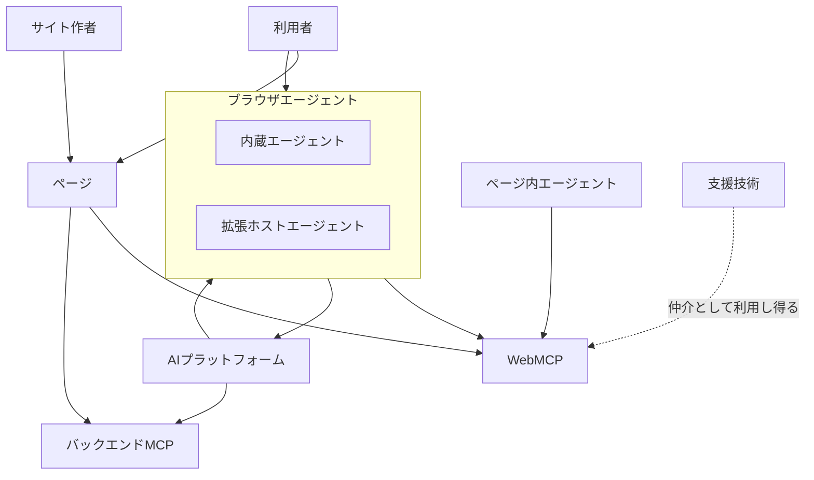
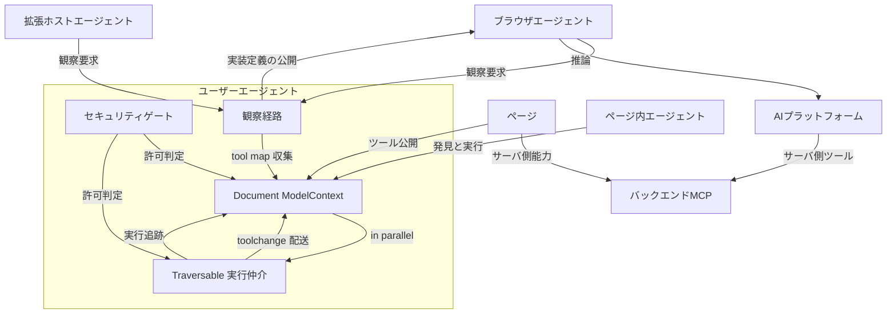
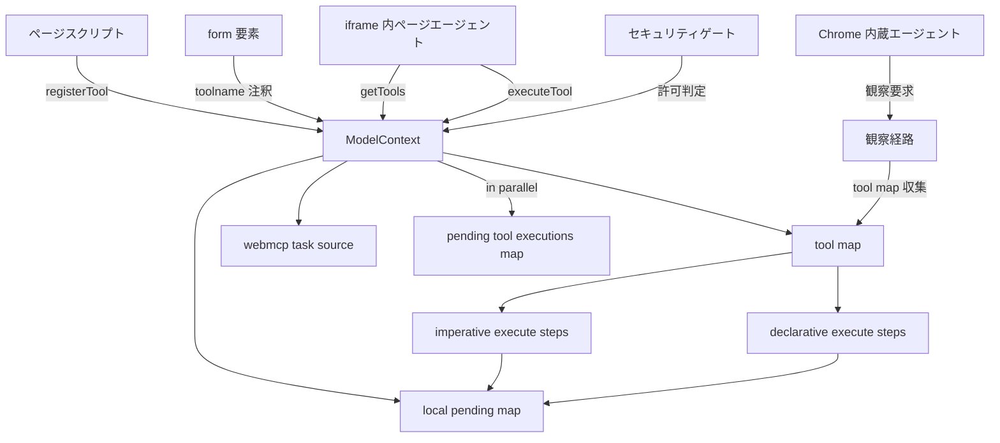
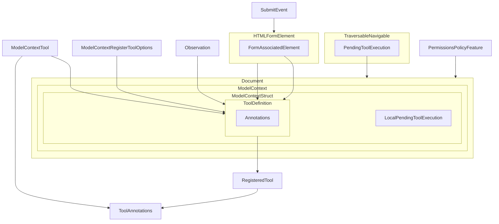
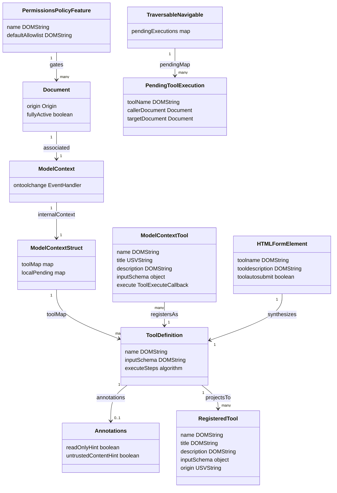

WebMCPは、Webページの機能をAIエージェントが呼び出せるstructured toolとして公開するブラウザAPIです。
DOMを推測してクリックする従来のブラウザ自動化とは異なり、サイト側がJavaScript関数やHTMLフォームの目的、引数、実行方法を明示します。

この記事では、2026年8月26日時点の[WebMCP Draft Community Group Report](https://webmachinelearning.github.io/webmcp)とChrome 149〜156のOrigin Trial実装を基に、両者のAPI型の差、クロスDocument実行モデル、導入方法、運用とトラブルシューティングを整理します。
WebMCPを試したいフロントエンド開発者と、エージェント対応Webアプリの設計を検討するアーキテクトを対象にしています。

WebMCPの概念や設計思想だけでなく、Chrome OTでそのまま動かすための引数変換と、実環境で詰まりやすい箇所を扱う実装リファレンスです。


*この記事の全体像。以下、順に解説します。*

## 概要

WebMCPは、ページがJavaScript関数やHTMLフォームを、自然言語の説明とJSON Schema付きのtoolとしてAIエージェントへ公開する仕組みです。
ページ、利用者、エージェントは同じ閲覧コンテキストを共有するため、既存のCookieセッション、画面状態、クライアント側ロジックを再利用できます。

現在の正規エントリポイントは`document.modelContext`です。
初期案の`navigator.modelContext`は、同じWindowでDocumentが入れ替わったときにtool mapが残る問題を避けるためDocumentスコープへ移され、Chromium 150でdeprecatedになりました。

```webidl
partial interface Document {
  [SecureContext, SameObject] readonly attribute ModelContext modelContext;
};

[Exposed=Window, SecureContext]
interface ModelContext : EventTarget {
  Promise<undefined> registerTool(ModelContextTool tool, optional ModelContextRegisterToolOptions options = {});
  Promise<sequence<RegisteredTool>> getTools(optional ModelContextGetToolOptions options = {});
  Promise<DOMString> executeTool(RegisteredTool tool, optional object inputObject = {}, optional ModelContextExecuteToolOptions options = {});
  attribute EventHandler ontoolchange;
};
```

仕様文書はW3C Web Machine Learning Community GroupのDraft Community Group Reportであり、W3C勧告ではありません。
Chromeは149から156までOrigin Trialを実施し、157での出荷を提案しています。
Edgeは150でOrigin Trialを実施しています。
一方、Mozillaのstandards positionはneutral、WebKitはopposeであり、クロスブラウザで安定利用できる段階ではありません。

### バックエンドMCPやブラウザ自動化との違い

WebMCPはMCPとtool、schema、argumentsという語彙を共有しますが、実行場所と信頼境界が異なります。

| 方式 | 実行場所 | 強み | 主な用途 |
|---|---|---|---|
| WebMCP | 開いているページのDocument | UI、セッション、クライアント状態を再利用 | 共同編集、予約、購入、フォーム入力 |
| バックエンドMCP | サーバやローカルプロセス | タブに依存せず継続稼働 | サーバ能力、データ処理、外部システム連携 |
| OpenAPI | HTTPバックエンド | 成熟したREST契約 | UIを経由しないAPI操作 |
| DOM・画面自動化 | ブラウザ操作層 | サイト側の対応が不要 | tool未公開の画面操作 |

WebMCPの中心用途は、人間が同じUIで結果を確認できるhuman-in-the-loopです。
ヘッドレスブラウジングや、人間の監督がない完全自律ワークフローは設計上の主対象ではありません。

## 特徴

主な特徴は次のとおりです。

- `document.modelContext`をDocument単位で公開
- `registerTool`による命令形tool登録
- HTML `form`からtoolを合成する宣言形API
- ページ内エージェント向けの`getTools`と`executeTool`
- 動的な登録・解除を通知する`toolchange`
- `AbortSignal`による登録解除と実行キャンセル
- JSON Schemaによる入力契約
- Permissions Policy `tools`によるiframe制御
- `exposedTo`と`fromOrigins`によるクロスオリジン公開
- `readOnlyHint`と`untrustedContentHint`による安全性ヒント
- SecureContextとorigin-keyed agent clusterの要求

サイトは、曖昧なDOM構造をエージェントに解釈させる代わりに「何ができるか」を明示できます。
ただし、JSON Schemaは現時点でブラウザによる厳格な入力検証を保証しません。
toolの`execute`内とサーバ側で、認可とバリデーションを必ず行う必要があります。

## 構造

WebMCPの構造を、システムコンテキスト、ユーザーエージェント内のコンテナ、実装コンポーネントの3段階で見ていきます。

### システムコンテキスト図

WebMCPはページとブラウザエージェントの間に位置します。
バックエンドMCPは競合ではなく、サーバ側能力を補う別レイヤーです。



ページ内エージェントはWebMCPのJavaScript APIを直接呼びます。
ブラウザ内蔵または拡張ホストのエージェントは、ページJavaScriptの`getTools`とは別のユーザーエージェント内部経路からtoolを観察します。
WebMCPは人間向けUIを置き換えず、同じページ上の操作経路を追加します。

### コンテナ図

ユーザーエージェント内部では、セキュリティゲート、Documentに結び付く`ModelContext`、Traversable単位の実行仲介、ブラウザエージェント向け観察経路に分けて考えられます。



`ModelContext`はDocument生成時に1対1で関連付けられ、tool mapとローカルの実行中mapを持ちます。
Traversable実行仲介は、同じトップレベル閲覧コンテキストに属するDocument間の実行を追跡します。
別のトップレベルDocumentに属するtoolを`executeTool`で呼ぶと`UnknownError`になります。

### コンポーネント図

命令形toolと宣言形formは、最終的に同じtool mapへ登録されます。
ページ内エージェントは`RegisteredTool`を取得して実行し、ブラウザ内蔵エージェントは観察経路からtool mapを取得します。



クロスオリジンiframeでは三つの条件が関係します。
親側の`allow="tools"`、登録側の`exposedTo`、発見側の`fromOrigins`です。
Permissions Policyは子DocumentがAPIを使えるかを制御し、残り二つはどのオリジンへtoolを見せるかを制御します。

なお、CloudflareのHTMLRewriter注入やMCP-B polyfillはこの内部構造の一部ではありません。
ネイティブAPIの手前、または互換レイヤとして動作します。

## データ

WebMCPの公開IDLと内部structは、登録入力、内部のtool definition、発見時の`RegisteredTool`を分離しています。
`execute`コールバックは登録側にだけ存在し、発見側へは渡りません。

### 概念モデル

Documentが`ModelContext`を所有し、`ModelContext`がtool定義とローカルの実行状態を所有します。
TraversableはDocumentをまたぐ実行状態を別に保持します。



| データ | 役割 |
|---|---|
| `ModelContextTool` | `registerTool`へ渡す登録入力 |
| `ToolDefinition` | tool map内の内部的な正本 |
| `RegisteredTool` | ページ内エージェントへ返す実行用descriptor |
| `LocalPendingToolExecution` | 対象Document内のAbortControllerを含む実行状態 |
| `PendingToolExecution` | callerとtargetをまたぐTraversable側の実行状態 |
| `Observation` | ブラウザエージェント向けの実装定義スナップショット |

### 情報モデル

公開dictionaryと内部structの関係を、主要フィールドに絞って型レベルで示します。
Draft仕様では、`inputSchema`は登録時にはJavaScript objectですが、内部ではJSON文字列として保持され、`RegisteredTool`では再びobjectへ投影されます。



重要な公開制約は次のとおりです。

| 項目 | 制約 |
|---|---|
| `name` | 1〜128文字、ASCII英数字と`_` `-` `.`のみ |
| `description` | 必須かつ空文字不可 |
| `inputSchema` | JSON直列化可能なobject |
| `exposedTo`と`fromOrigins` | potentially trustworthyなoriginのみ |
| `RegisteredTool` | `window`と`origin`を含み、`execute`は含まない |
| annotations | `readOnlyHint`と`untrustedContentHint`、既定はfalse |

Draft仕様とChrome OT実装では、公開される型が一致していません。
実装対象に合わせて明示的に変換してください。

| API | Draft仕様 | Chrome 149〜156 OT実装 |
|---|---|---|
| `registerTool`の戻り値 | `Promise<undefined>` | Chrome 149初期実装は`undefined`。後続版は実ブラウザで要確認 |
| `RegisteredTool.inputSchema` | object | JSON文字列。利用時に`JSON.parse()` |
| `executeTool`の入力 | object | valid JSON string。`JSON.stringify()`して渡す |
| `executeTool`の結果 | `DOMString` | serialized string、ナビゲーション時は`null` |

Draft仕様準拠の将来実装へJSON文字列を渡すと、内部のstringifyで二重エンコードされる可能性があります。
一方、現行Chrome OTで動かすコードはJSON文字列を基準にします。
Chrome 149初期実装では`await registerTool()`と書いても`await undefined`になるだけで、登録完了を待つ保証にはなりません。
マイルストーン更新時は戻り値の実形も確認してください。

## 構築方法

WebMCPは実験的APIであり、まず有効化経路を決める必要があります。
開発端末ではChrome flag、本番検証ではOrigin Trial、未対応ブラウザでは制約付きpolyfillを使えます。

### 前提条件

- HTTPS、または`http://localhost`
- origin-keyed agent cluster
- Permissions Policy `tools`の許可
- 対応ブラウザ、Origin Trial、またはpolyfill

`Origin-Agent-Cluster: ?0`や`document.domain`を使うと、WebMCP APIは`SecurityError`になります。
明示的に固定する場合は次のヘッダーを使用できます。

```http
Origin-Agent-Cluster: ?1
Permissions-Policy: tools=(self)
```

### Chromeでローカル開発する

1. `chrome://flags/#enable-webmcp-testing`を開く
2. **WebMCP for testing**を**Enabled**にする
3. DevToolsのWebMCPペインも使う場合は`chrome://flags/#devtools-webmcp-support`も有効にする
4. Chromeを再起動する
5. DevToolsコンソールでAPIを確認する

```js
console.log("modelContext:", !!document.modelContext);
console.log("getTools:", typeof document.modelContext?.getTools);
console.log("executeTool:", typeof document.modelContext?.executeTool);
```

旧実装には`navigator.modelContextTesting`がありましたが、Chromium mainから削除されています。
testing flagを使う場合も、現行コードは`document.modelContext`を呼び出します。

### Origin Trialを導入する

Chrome 149〜156では[Origin Trial登録ページ](https://developer.chrome.com/origintrials/#/register_trial/4163014905550602241)からオリジンを登録し、トークンをHTTPヘッダーまたはmeta要素で配信します。

```http
Origin-Trial: TOKEN_GOES_HERE
```

```html
<meta http-equiv="origin-trial" content="TOKEN_GOES_HERE">
```

iframeは親のトークンを継承しません。
APIを呼ぶJavaScriptのオリジンに一致するトークンが必要です。
ChromeとEdgeのOrigin Trialは別レジストリなので、トークンを共用できません。


### 型定義と互換レイヤを追加する

TypeScript型だけが必要な場合は`webmcp-types`を追加します。

```bash
npm install --save-dev webmcp-types
```

```json
{
  "compilerOptions": {
    "types": ["webmcp-types"]
  }
}
```

MCP-B polyfillは未対応ブラウザ向けの仕様外レイヤです。

```bash
npm install @mcp-b/webmcp-polyfill
```

```js
import { initializeWebMCPPolyfill } from "@mcp-b/webmcp-polyfill";
initializeWebMCPPolyfill();
```

polyfillでは、クロスDocumentの`exposedTo`と`fromOrigins`、一部の宣言形UI状態、ナビゲーションをまたぐ応答を利用できません。
ネイティブ実装との機能差を前提にしてください。

## 利用方法

最小構成はtoolの登録、発見、実行です。
登録寿命と実行キャンセルにはそれぞれ`AbortSignal`を使います。

### 命令形toolを登録する

```js
const registration = new AbortController();

await document.modelContext.registerTool({
  name: "find_product",
  description: "商品名またはSKUで商品を検索する。価格と在庫を返す。",
  inputSchema: {
    type: "object",
    properties: {
      query: { type: "string", description: "商品名またはSKU" },
    },
    required: ["query"],
  },
  annotations: {
    readOnlyHint: true,
    untrustedContentHint: false,
  },
  execute: async ({ query }, options) => {
    if (typeof query !== "string" || query.trim() === "") {
      return { error: "query must be a non-empty string" };
    }
    // Draftでは第2引数にsignalが入る。Chrome 149初期OTではoptions自体が来ない。
    const requestOptions = options?.signal ? { signal: options.signal } : {};
    const response = await fetch(
      `/api/products?q=${encodeURIComponent(query)}`,
      requestOptions,
    );
    return await response.json();
  },
}, { signal: registration.signal });

// 登録解除
registration.abort();
```

専用の`unregisterTool()`はありません。
登録時に渡したsignalをabortするとtool mapから削除され、`toolchange`が通知されます。

### toolを発見して実行する

```js
const tools = await document.modelContext.getTools();
const tool = tools.find((item) => item.name === "find_product");

if (!tool) {
  throw new Error("find_product is not registered");
}

const execution = new AbortController();
// Chrome OTではinputSchemaとexecuteToolの引数がJSON文字列です。
const inputSchema = JSON.parse(tool.inputSchema);
console.log("schema:", inputSchema);

const rawResult = await document.modelContext.executeTool(
  tool,
  JSON.stringify({ query: "ABC-123" }),
  { signal: execution.signal },
);

// find_productはobjectを返す契約なのでJSONとしてdecodeする。
const result = rawResult === null ? null : JSON.parse(rawResult);
console.log(result);
```

上の例はChrome 149〜156のOT実装向けです。
Draft仕様どおりの実装では、`inputSchema`と`executeTool`の第2引数はobjectであり、変換は不要です。
toolがナビゲーションを起こす場合は`null`を分岐してから結果をparseします。
文字列を返すtoolは`Added to-do: Buy milk`のような非JSON結果になり得るため、汎用コードで無条件に`JSON.parse()`してはいけません。
toolごとの出力契約に従い、通常文字列はrawのまま扱います。

Chrome 149初期OTは、登録した`execute`コールバックへ入力objectだけを渡します。
上の登録例のように第2引数をoptionalとして扱えばDraft準拠実装とも共存できますが、未対応版では実処理へのAbortSignal伝播は働きません。

古い`getTools()`結果を長く保持しないでください。
Documentのナビゲーションやtoolの再登録後は、descriptorを取得し直します。

一覧の変化は`toolchange`で購読できます。

```js
document.modelContext.addEventListener("toolchange", async () => {
  const tools = await document.modelContext.getTools();
  updateAgentToolRegistry(tools);
});
```

### クロスオリジンiframeへ公開する

親はPermissions Policyで機能を委譲します。

```html
<iframe src="https://partner.example" allow="tools"></iframe>
```

登録側は公開先を指定します。

```js
await document.modelContext.registerTool({
  name: "lookup_office",
  description: "現在選択中の拠点情報を返す。",
  execute: () => ({ office: "Building 4" }),
}, {
  exposedTo: ["https://caller.example"],
});
```

呼び出し側は検索対象を明示します。

```js
const tools = await document.modelContext.getTools({
  fromOrigins: ["https://partner.example"],
});
```

`allow="tools"`、`exposedTo`、`fromOrigins`のいずれかが欠けると期待したtoolは見えません。

### 宣言形フォームをtoolにする

フォームに`toolname`と`tooldescription`を付けると、Chromeはフォームコントロールから入力schemaを合成します。

```html
<form toolautosubmit
  toolname="support_request"
  tooldescription="問い合わせを担当チームへ送信する。"
  action="/support">
  <label for="firstName">First Name</label>
  <input id="firstName" type="text" name="firstName">

  <select name="team" required
    toolparamdescription="問い合わせを転送する担当チーム">
    <option value="Customer happiness team">返品</option>
    <option value="Distribution team">配送状況</option>
    <option value="Website support team">Webサイトの問題</option>
  </select>

  <button type="submit">送信</button>
</form>
```

エージェント起点のsubmitは`SubmitEvent.agentInvoked`で識別します。

```js
document.querySelector("form").addEventListener("submit", (event) => {
  if (!event.agentInvoked) return;
  event.preventDefault();
  event.respondWith(Promise.resolve("Support request submitted"));
});
```

宣言形APIは仕様本文に未確定部分があります。
フォームコントロールごとのschema合成やキャンセルイベント名は、実装変更を見込んでChromeの現行ドキュメントと実ブラウザで確認してください。


## 運用

実運用では、ブラウザごとにnative、Origin Trial、polyfillの経路が分かれます。
機能検出、トークン期限、実行ログ、動的登録の寿命をまとめて管理します。

### 機能検出と有効化経路

```js
function detectWebMCP() {
  return {
    native: "modelContext" in Document.prototype,
    available: Boolean(document.modelContext),
  };
}
```

`navigator.modelContextTesting`は削除済みの旧診断APIなので、現行の機能検出には含めません。

| 環境 | 推奨経路 | 注意点 |
|---|---|---|
| ローカル | `#enable-webmcp-testing` | testing APIを本番へ持ち込まない |
| ステージング | Origin Trial | staging origin専用トークン |
| Chrome 149〜156本番 | Origin Trial | 6週間の期限とtrial上限 |
| 未対応ブラウザ | polyfill | cross-document機能なし |
| Cloudflareゾーン | bridge注入 | native WebMCPがなければno-op |

Origin Trialの状態はDevToolsのApplication、Frames、Origin Trialsで確認できます。
`Success`以外では、期限、origin不一致、trial無効化を切り分けます。

### 状態確認とログ

```js
const tools = await document.modelContext.getTools();
console.table(tools.map((tool) => ({
  name: tool.name,
  origin: tool.origin,
  readOnly: tool.annotations?.readOnlyHint,
  untrusted: tool.annotations?.untrustedContentHint,
})));
```

Chrome DevToolsのApplicationパネルにあるWebMCPペインでは、利用可能なtool、呼び出し回数、入力、出力、Completed、Canceled、In Progress、Errorを確認できます。
Chrome DevTools Protocolにも`WebMCP.enable`、`invokeTool`、`cancelInvocation`、`toolsAdded`、`toolInvoked`、`toolResponded`があります。

toolのdescription、入力、出力はすべて非信頼データとしてログへ保存してください。
特に`toolResponded.output`を、そのまま次のモデル入力へ連結しないことが重要です。

### 動的登録とページ破棄

状態依存toolだけを動的登録し、静的に使えるtoolはページ初期化時に一度登録する方が安定します。

```js
let checkoutController;

function syncCheckoutTool(cart) {
  if (cart.items.length === 0) {
    checkoutController?.abort();
    checkoutController = undefined;
    return;
  }
  if (checkoutController) return;

  checkoutController = new AbortController();
  document.modelContext.registerTool({
    name: "start_checkout",
    description: "現在のカートで購入確認画面を開く。注文は確定しない。",
    inputSchema: { type: "object", properties: {} },
    execute: () => {
      location.assign("/checkout");
      return "Navigated to checkout";
    },
  }, { signal: checkoutController.signal });
}
```

Draft仕様では、`registerTool`と`getTools`の対象Document、または`executeTool`の呼び出し元Documentがfully activeでない場合に`InvalidStateError`になります。
一方、toolを所有する対象DocumentがBFCache中なら、Draft上は復帰まで実行タスクを待ちます。
caller Documentが破棄されると実行はcancelされ、target Documentが破棄されると呼び出しPromiseは失敗します。
Chrome OTの挙動はマイルストーンごとに実ブラウザで確認してください。

### ページ単位の停止

サイト全体で即時停止したいときは、レスポンスヘッダーを次に変更します。

```http
Permissions-Policy: tools=()
```

この設定はgetterを消すのではなく、APIメソッドを`NotAllowedError`で拒否させます。
tool単位の停止は登録時のAbortControllerをabortします。

## ベストプラクティス

toolの選択精度と安全性は、APIを有効にするだけでは得られません。
toolの粒度、説明、入力検証、権限確認、出力の扱いを一つの契約として設計します。

### tool設計

- 1 toolを1機能に絞り、重複を避ける
- 即時実行と開始プロセスを動詞で区別する
- 否定形のdescriptionを避ける
- IDではなく、モデルが理解できる自然言語のenumを使う
- 失敗時はモデルが自己修正できる説明的エラーを返す
- 処理完了後にページUIも更新する
- stagingとproductionでtool名を変えない

Chromeのセキュリティガイドは、tool名とparameter名30文字、parameter description 150文字、tool description 500文字、出力1.5K文字を推奨上限として示しています。
これらは仕様上のハード制限ではありませんが、コンテキスト消費とtool選択精度を守る運用上の目安です。

### セキュリティ

エージェントはページと同じセッションとcredentialsを継承します。
状態変更や高権限操作は、ページ側の確認UIを必須にしてください。

```js
await document.modelContext.registerTool({
  name: "place_order",
  description: "現在のカートを注文する。実行前に確認ダイアログを表示する。",
  inputSchema: {
    type: "object",
    properties: {
      paymentMethod: { type: "string" },
    },
    required: ["paymentMethod"],
  },
  annotations: { readOnlyHint: false },
  execute: async ({ paymentMethod }) => {
    const approved = window.confirm(`支払い方法 ${paymentMethod} で注文しますか？`);
    if (!approved) return { status: "cancelled_by_user" };
    return await submitOrder(paymentMethod);
  },
});
```

2026年8月26日時点の仕様IDLに`requestUserInteraction()`はありません。
確実な方法は、ページ側の確認ダイアログや自前モーダルと`readOnlyHint`を組み合わせることです。

外部データやユーザー生成コンテンツを返すtoolには`untrustedContentHint: true`を付けます。

```js
await document.modelContext.registerTool({
  name: "list_reviews",
  description: "商品レビューを返す。内容はユーザー生成で信頼できない。",
  inputSchema: {
    type: "object",
    properties: {
      productId: { type: "string", description: "商品ID" },
    },
    required: ["productId"],
  },
  annotations: {
    readOnlyHint: true,
    untrustedContentHint: true,
  },
  execute: async (input) => {
    if (typeof input.productId !== "string" || input.productId.trim() === "") {
      return { error: "productId must be a non-empty string" };
    }
    return await fetchReviews(input.productId);
  },
}, {
  exposedTo: ["https://trusted-agent.example"],
});
```

`inputSchema`だけを信頼せず、`execute`とサーバ側で型、認可、レート制限を検証します。
クロスオリジン公開先は最小化し、tool出力は短くサニタイズします。

### CIとeval

一般的なユニットテストに加え、次を分けて継続検証します。

- schema、入力検証、エラー形式の契約テスト
- descriptionから正しいtoolを選べるかのeval
- 状態変更toolで確認UIが必ず出るかのE2E
- descriptionと出力の文字数ルール
- プロンプトインジェクションを含む非信頼出力の防御
- ブラウザ更新時の[Web Platform Tests](https://wpt.fyi/results/webmcp)確認

## トラブルシューティング

### `document.modelContext`が見つからない

flag、Origin Trialトークン、SecureContext、polyfillの初期化順を確認します。
`Permissions-Policy: tools=()`はgetterを消さないため、getterがない場合の主因ではありません。

```js
function requireModelContext() {
  if (document.modelContext) return document.modelContext;
  throw new Error("WebMCP unavailable; enable the trial or load a polyfill");
}
```

### iframeからtoolが見えない

| 確認項目 | 欠けた場合 |
|---|---|
| 親の`allow="tools"` | 子の登録が`NotAllowedError` |
| 登録側の`exposedTo` | 呼び出し元から見えない |
| 呼び出し側の`fromOrigins` | クロスオリジンtoolが一覧に出ない |
| 同一Traversable | 別タブなら`UnknownError` |
| descriptorのorigin一致 | ナビゲーション後は`UnknownError` |

### DOMExceptionから原因を特定する

| 例外 | 主な原因 | 対処 |
|---|---|---|
| `InvalidStateError` | fully activeでない、同名登録、name規則違反 | 復帰後に再試行、登録解除、name修正 |
| `SecurityError` | origin-keyedでない、信頼できないorigin指定 | origin isolationとHTTPSを確認 |
| `NotAllowedError` | Permissions Policy `tools`が不許可 | 親の`allow`とレスポンスヘッダーを確認 |
| `UnknownError` | 別Traversable、ナビゲーション後のorigin不一致 | 同一タブでdescriptorを再取得 |
| `NotSupportedError` | opaque origin、polyfill非対応機能 | localhostまたはnative実装を使用 |
| `TypeError` | `inputSchema`をJSON化できない | プレーンobjectへ修正 |

### 同名toolのschema更新で競合する

登録解除と実行が競合すると、古い`RegisteredTool`に対して新しいschemaのtoolが実行される可能性があります。
破壊的なschema変更ではtool名を変更するか、abort後の`toolchange`を待って再登録します。
実行側でも必ず入力を検証し、説明的なエラーを返します。

### Cloudflare注入後もtoolが見えない

bridgeはブラウザにnative WebMCPがない場合no-opです。
`/.webmcp/bridge.js`とMCPエンドポイントの配信状態も確認します。

```bash
curl -sI https://your-site.example/mcp
curl -s https://your-site.example/.webmcp/bridge.js | head
```

## まとめ

WebMCPは、Webページの機能を型付きtoolとしてブラウザエージェントへ公開し、人間向けUIとエージェント操作を同じDocument上で共存させるAPIです。
実装の中心は`document.modelContext`、`registerTool`、`getTools`、`executeTool`と、HTMLフォームを利用する宣言形APIです。

導入時は、まだDraftとOrigin Trial段階であることを前提に、APIの現行差分、Origin Trialの期限、Permissions Policy、origin isolation、polyfillの制約を管理する必要があります。
さらに、ページと同じ権限を使う設計だからこそ、入力の再検証、状態変更前の確認、非信頼出力の隔離、クロスオリジン公開の最小化が欠かせません。

この記事が少しでも参考になった、あるいは改善点などがあれば、ぜひリアクションやコメント、SNSでのシェアをいただけると励みになります！

## 参考リンク

- [WebMCP Draft Community Group Report](https://webmachinelearning.github.io/webmcp)
- [webmachinelearning/webmcp](https://github.com/webmachinelearning/webmcp)
- [Chrome for Developers WebMCP](https://developer.chrome.com/docs/ai/webmcp)
- [Chrome WebMCP Imperative API](https://developer.chrome.com/docs/ai/webmcp/imperative-api)
- [Chrome WebMCP Declarative API](https://developer.chrome.com/docs/ai/webmcp/declarative-api)
- [WebMCP tool security](https://developer.chrome.com/docs/ai/webmcp/secure-tools)
- [WebMCP best practices](https://developer.chrome.com/docs/ai/webmcp/best-practices)
- [Join the WebMCP origin trial](https://developer.chrome.com/blog/ai-webmcp-origin-trial)
- [Chrome Status 5117755740913664](https://chromestatus.com/feature/5117755740913664)
- [Chrome DevTools Protocol WebMCP domain](https://chromedevtools.github.io/devtools-protocol/tot/WebMCP/)
- [MCP-B polyfill](https://docs.mcp-b.ai/packages/webmcp-polyfill/reference)
- [Mozilla standards position](https://github.com/mozilla/standards-positions/issues/1412)
- [WebKit standards position](https://github.com/WebKit/standards-positions/issues/670)
