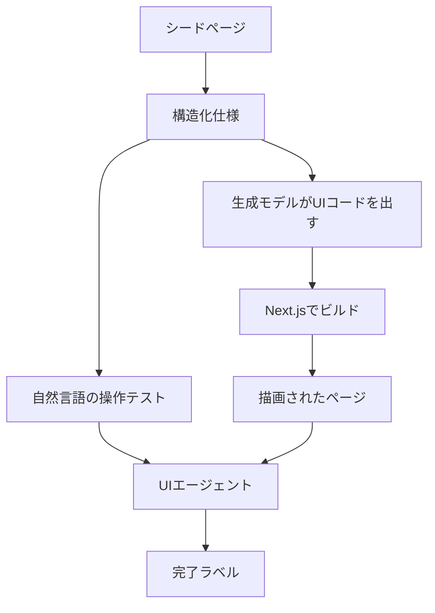

WebUIProof は、LLM が生成した Web 画面を、ビルドできたかと見た目に加え、操作テストで採点するベンチマークです。この記事では、タスクの構造、採点器の動き、印刷された数値の読み方、公開物と論文のずれ、生成画面を受け取るときに操作ごとに何を合格条件にするかを順に確認します。対象は arXiv:2610.02617v1（2026-10-02 提出）です。会議採録は確認していません。

*この記事の全体像。以下、順に解説します。*

## WebUIProofとは

WebUIProof は、生成した画面を操作して完了ラベルを付けるための評価セットです。タスクは 219 件で、一般的な Web 画面 149 件と、ブラウザ上の 3D シミュレーション 70 件に分かれます。各タスクは、画面要約、必要な UI 要素、操作テストをセットで持ちます。

著者は Columbia University の Yun-Yun Tsai（Meta でのインターンとして実施）と Junfeng Yang、Meta Superintelligence Labs の Yuning Mao、Shiqi Wang、Sinong Wang です。論文は、この採点を小さいモデルの強化学習の報酬にも使っています。論文のライセンス表示は CC BY 4.0 です。

### 仕様とテストの型

指示は自由文ではなく、`website_summary`、`element_requirement`、`test_cases` の構造化仕様です。テストは Functionality、Data-display、Design-validation の 3 類型です。論文の表1は、要素被覆率 TCR を 97.23%、テスト数を約 3,000 と書いています。TCR は、テストが参照した必須要素の割合です。

一般画面のシードは、WebGen-Bench のテスト指示 101 件と WebDev-Arena から採った 48 件です。シードページは DeepSeek R1 が生成します（付録 B.1）。3D タスクは Three.js の公開作例と、それに類するデモに由来します。

### 採点の流れ

1 件のタスクは、仕様と自然言語のテストから成ります。生成モデルはその仕様から画面のコードを出します。評価側はビルドしてから、UI エージェントにテストを渡します。エージェントは画面を操作し、最後に完了ラベルを返します。採点器はヘッドレスブラウザ上のエージェントで、計画、操作、観察を繰り返します。

公開されている一般タスクのテスト項目は、`procedure` と `expected_results` を文章で持ちます。セレクタと assert 式は、タスク 000001 にはありません。公開の評価入口 `run_webvoyager` は、外部の WebVoyager にその文章を渡し、最終回答を YES、NO、PARTIAL のいずれかとします。

### 評価設定とビルド

本文 4.1 の評価設定は、ビューポート 1280×800、1 タスクあたり 15 ステップ、評価 VLM は Qwen2.5-VL-72B です。一般画面のビルドは React 18.3.1 と Next.js 15.5.4 の静的書き出しです（付録 A.1）。

同じプロトコルで比べている API モデルは 8 つです。小さいモデルでは、VisRL と呼ぶ複合報酬の PPO を報告しています。

### 公開データの形

公開データセットは Hugging Face の [yunyuntsai0311/webuiproof-benchmark](https://huggingface.co/datasets/yunyuntsai0311/webuiproof-benchmark) です。2026-10-06 の statistics API は 219 行で、`general_webui` が 149、`3d_simulation_webui` が 70 です。コードは [yunyuntsai/webuiproof-benchmark](https://github.com/yunyuntsai/webuiproof-benchmark) です。

## 注意点

数値は論文の印刷値です。行によって四つの率の和は 100 からずれ、Accuracy の式と 0.1 ポイント以上ずれる行があります。ここでは再計算で置き換えていません。テスト約 3,000 件は論文の概数です。公開物と論文の記述が分かれている箇所と、2026-10-06 時点で閉じていない問いもここにまとめます。

### 印刷された率の式

Accuracy は、全タスク数 N に対して `(Full の件数 + 0.5 × Partial の件数) / N × 100` です。build failure は分子に入りません。付録 A.4 は、Full、Partial、No、Build failure の和が約 100% になると書いています。したがって表の No、Partial、Full を、ビルドに成功した部分集合の内訳比率として読むと、和が約 100% になる事実と合いません。本文 4.2 は "among build-successful generations" とも書いています。

一般画面（表2、%）は次のとおりです。

| モデル | Build failure | No | Partial | Full | Accuracy |
|---|---:|---:|---:|---:|---:|
| Claude Sonnet 4 | 30.37 | 12.59 | 22.10 | 35.05 | 46.10 |
| Gemini 2.5 Pro | 32.21 | 15.02 | 20.38 | 32.67 | 42.86 |
| Qwen 3 Coder 480B | 33.05 | 13.92 | 20.76 | 31.62 | 41.99 |
| DeepSeek R1 | 32.89 | 14.91 | 20.51 | 31.65 | 41.90 |
| GPT 4.1 | 36.58 | 11.67 | 20.30 | 31.25 | 41.40 |
| Llama 4 Maverick | 46.64 | 2.53 | 18.72 | 31.41 | 40.77 |
| Kimi K2 | 46.31 | 8.70 | 11.94 | 33.33 | 39.30 |
| Llama 3 405B | 47.32 | 10.13 | 14.18 | 29.10 | 36.19 |
| Qwen2.5 14B SFT | 56.25 | 10.97 | 11.84 | 20.66 | 26.08 |
| Qwen2.5 14B VisRL | 36.10 | 13.71 | 15.13 | 34.23 | 41.80 |
| MIMO 7B SFT | 58.71 | 12.15 | 7.33 | 20.2 | 23.8 |
| MIMO 7B VisRL | 40.22 | 17.43 | 15.71 | 25.63 | 33.43 |

3D（表3、%）は次のとおりです。

| モデル | Build failure | No | Partial | Full | Accuracy |
|---|---:|---:|---:|---:|---:|
| Claude Sonnet 4 | 0.00 | 49.66 | 20.21 | 30.14 | 40.24 |
| Qwen 3 Coder 480B | 1.43 | 51.37 | 17.12 | 29.11 | 37.67 |
| Gemini 2.5 Pro | 0.00 | 54.79 | 18.49 | 26.71 | 35.96 |
| Kimi K2 | 0.00 | 54.79 | 20.21 | 25.00 | 35.10 |
| Llama 4 Maverick | 0.00 | 59.93 | 15.75 | 24.43 | 32.19 |
| DeepSeek R1 | 11.43 | 49.66 | 17.12 | 21.23 | 29.79 |
| GPT 4.1 | 2.85 | 65.41 | 15.75 | 15.07 | 22.95 |
| Llama 3 405B | 2.86 | 69.86 | 13.70 | 12.67 | 19.52 |
| Qwen2.5 14B SFT | 0.00 | 55.68 | 22.94 | 20.97 | 32.44 |
| Qwen2.5 14B VisRL | 0.00 | 52.24 | 19.31 | 27.73 | 37.38 |
| MIMO 7B SFT | 4.77 | 71.24 | 13.31 | 10.54 | 17.20 |
| MIMO 7B VisRL | 0.00 | 69.20 | 18.86 | 10.67 | 20.10 |

Claude の一般 Accuracy 46.10 は、Full 35.05 と Partial の半分 11.05 の和と一致します。Qwen2.5 14B SFT の一般 Accuracy 印刷値 26.08 は、同じ式に印刷率を入れると 26.58 になります。この行は式と印刷率が一致しません。

### 改善幅が指す行

貢献リストの「一般 +15.7、3D +4.9」は、Qwen2.5 14B の SFT から VisRL への差（一般 41.80−26.08、3D 37.38−32.44）と対応します。MIMO 7B の差は一般 +9.63、3D の印刷値 +2.9 です。本文 4.2 は MIMO の 3D を 17.12% から 20.10% と書いています。表3の SFT Accuracy は 17.20 です。17.12 は表3では別モデルの Partial に出ます。

Qwen の 3D は SFT の時点で build failure 0.00 であり、VisRL 後も 0.00 です。「build failure が減る」は、この行には当てはまりません。一般の Qwen は 56.25 から 36.10、一般の MIMO は 58.71 から 40.22、3D の MIMO は 4.77 から 0.00 です。

abstract の「eight commercial LLMs」と表の "Proprietary (API)" には、Llama、Qwen3-Coder、DeepSeek R1 のようにオープンウェイトを API 経由で呼んだものが含まれます。

### 人との一致の範囲

人とエージェントの一致は、一般画面の 100 件です。3D と、残る 5 モデルについての人の一致は、この表にはありません。

表4（N=100、一般のみ）:

| 生成モデル | 一致 | Adjacent | Far（No と Yes） |
|---|---:|---:|---:|
| Claude Sonnet 4 | 86 | 13 | 1 |
| Gemini 2.5 Pro | 82 | 15 | 3 |
| Qwen2.5 14B VisRL | 85 | 10 | 5 |

表5（同じ N=100、ステップ上限）では、15 ステップの一致 86.7%、timeout 0.0%、interaction fail 4.3%、element locator fail 9.0% です。5 ステップでは locator fail は 3.3% で、上限を増やすと locator 失敗の割合は上がります。

### 評価器の三つの記述

評価器の記述は、本文、付録、公開スクリプトで分かれています。

- 本文 4.1 は Playwright です。アクションは click、type、select、scroll、drag、hover、wait です。ラベルは Full、Partial、No です。
- 付録 A.2 は WebVoyager と Selenium、Chrome driver 119.0.6045.105 です。表7のアクションは Click、Type、Scroll、Hover、Wait、GoBack、Answer です。最終判断の例は FULL、NO、PARTIAL です。
- 公開の `ui_eval_webgen_formatted.py` は `webvoyager/run.py` を起動します。引数は `--headless`、`--max_iter 15`、`--temperature 1`、`--seed 42`、`--api_model qwen/qwen2.5-vl-72b-instruct` で、`--api_key` は空文字です。プロンプトのラベルは YES、NO、PARTIAL です。

起動パスは通常文字列の `{base_dir}/webvoyager/run.py` です。2026-10-06 の git tree（sha `fa59898`、truncated false）に `webvoyager/` はありません。README は [MinorJerry/WebVoyager](https://github.com/MinorJerry/WebVoyager) の clone を案内しています。

`compute_acc.py` は、最後の assistant 本文に部分文字列 `YES` があれば yes にします。判定順は YES、PARTIAL、NO です。`interact_messages.json` が無いフォルダは skip します。

開いた `ui_eval_webgen_formatted.py`、`webui_generation.py`、`compute_acc.py`、`host_agent.py` に、`playwright` という文字列はありませんでした。リポジトリ全ファイルの不在までは検索していません。

### 公開物の範囲

GitHub `yunyuntsai/webuiproof-benchmark` は、2026-10-06 の API で star 0、archived false、license 検出 null、最新 push は 2026-10-01 です。tree のタスクは `tasks/general_webui/000001` から `000149` までで、3D 用ディレクトリはありません。README は 149 タスク、テスト約 600 件以上と書いています。論文は 219 タスク、約 3,000 テストと書いています。Hugging Face の行数は 219 で、family の内訳は論文と一致します。HF dataset card の license は `apache-2.0` です。論文の CC BY 4.0、GitHub の license 空、HF の apache-2.0 は、2026-10-06 時点で三つに分かれています。

README が呼ぶ `generate_ui`、`run_evaluation`、`evaluate_project`、`compute_accuracy` は、対応する raw ファイルに定義がありません。生成スクリプトの `OPENROUTER_API_KEY` は空文字の代入で、`os.environ` を読みません。生成プロンプト内の依存は `nextjs@14.2.5`、ビルドスクリプトと付録 A.1 は `next@15.5.4` です。

学習の GPU について、本文 4.1 は 4 基の H100 80GB を学習に使うと書いています。付録 C.1 のインフラ表は、学習 3 基、推論 1 基と書いています。

独立した追試、会議採録、方法を検証した批評は、2026-10-06 の検索範囲では見つかりませんでした。Issue は引用できるものがありませんでした。見つからないことは、追試が存在しない証明ではありません。

公開ラベルは VLM の文章判定です。表4の Far 不一致は 100 件中 1 から 5 件あります。テスト文自体は、シードページを見たエージェントの生成物です。タスク 000001 には作業メモと、要約に無いログイン前提が残ります。3D の学習データは three.js 公式作例の scrape で 1600 件超、評価も Three.js 作例由来です。ID の分離は本文にありません。学習結果を未知の画面へ一般化する根拠にはしません。

### まだ閉じていない問い

- Hugging Face 上の全テスト件数は約 3,000 と一致するか。
- 3D の学習プロンプトと評価タスクは ID で分離されているか。
- temperature 1 のまま同一画面を再判定したとき、YES、PARTIAL、NO はどれだけ揺れるか。
- 部分文字列 `YES` の採点は、説明文中の YES をどれだけ誤って yes にするか。
- WebUIProof 表1の FrontendBench TCR 約 90% は、FrontendBench abstract の専門家一致 90.54% と同じ量か。
- ライセンスは、コード、データ、論文のどれにどの条項を適用するか。

## 操作のあとで観測できるもの

WebUIProof が足しているのは、操作のあとでラベルを付けることです。そのラベルは、DOM が真偽を返した結果ではありません。検収では、操作ごとに判定者を分けます。

| 見たいもの | スクリプトで切れる観測 | 人に残す判断 |
|---|---|---|
| 要素の存在 | role、name、text が DOM にある | 別名でも要求を満たすか |
| 操作の直後 | URL、表示テキスト、aria、入力値、disabled | アニメーションの理解しやすさ、誤操作からの戻り |
| 保存 | ファイルが落ちる、必須フィールドがある | 中身が意思決定に使えるか |
| 色と文字 | `getComputedStyle` の値、コントラスト比 | トークン体系として揃っているか |
| 3D | DOM に出た数値、ボタン状態 | canvas 内の軌道、衝突、粒子数 |
| テスト文 | なし | 要求が意図と一致しているか |

タスク 000001（Stock Report Generator、[GitHub raw](https://raw.githubusercontent.com/yunyuntsai/webuiproof-benchmark/main/tasks/general_webui/000001.json)）では、次が一次で確認できます。

- ダウンロード成功は「視覚的に始まる」と書かれ、ファイル名やバイトの条件はありません。
- Data-display の TC003 の expected result 末尾に、テスト文ではない `7. Next Steps : I need to start the testing...` が残ります。
- 要素説明に `likely` が残ります。
- 複数の前提が "The user is logged into the application" です。`website_summary` の機能説明はログインを要求していません。
- Design-validation は背景 `#FFFFFF` を「ページを観察して比べる」と書いています。この色自体は計算スタイルでスクリプトにできます。公開テストはそう書いていません。

3D について、論文付録 B.1 は scene graph、カメラ、衝突、粒子を課題の中身に挙げています。公開例の期待結果は、canvas を操作して見た目を確認する自然言語です。カメラ行列や粒子数をプログラムで照合する手順は示されていません。DOM に出ていない内部状態は、この公開形では人か、別の計測器が要ります。

表2と表3では、build failure が低い行でも No completion が大きいです。3D の Claude は build failure 0.00% で No が 49.66% です。論文 5.2 は、自由文プロンプトの TCR 30.71% に対し、構造化仕様で 97.23% になったと書いています。テストが要素を多く参照するほど、見た目だけでは足りない、という論文の主張と方向は同じです。単一報酬の偏りは付録 D.2 が書いており、採用重みは αv=0.6、αu=0.3、αm=0.1 です。見た目だけの報酬では振る舞いが保証されない、という記述は、検収を観測の種類で分けることと整合します。

## 先行する操作評価との位置

ビルドとスクリーンショット、エージェントのラベル、決定的な操作条件、テストスクリプトは、失敗の見え方が違います。

| 基準 | ビルドとスクリーンショット | WebUIProof のエージェントラベル | 決定的な操作条件 | FrontendBench 型のテストスクリプト |
|---|---|---|---|---|
| 操作で落ちる失敗 | 見えない | ラベルには出る | 観測を DOM かファイルに書けば出る | スクリプトが触れれば出る |
| 再実行の安定 | ビルドは比較的安定 | 公開起動は temperature 1。人との Far 不一致がある | 観測が決定的なら安定 | アサーションが決定的なら安定 |
| 失敗の帰属 | ビルドログに残る | locator 失敗と製品欠陥が混ざる（表5） | アサーション単位で残る | アサーション単位で残る |
| 使いやすさ | 人が画像を見る | 見ていない | 見ていない | 見ていない |
| 3D の内部状態 | 画像依存 | 自然言語の観察 | DOM に出なければ不可 | プローブが無ければ不可 |
| 位置づけ | 必要条件 | 人が見る順番を決める篩 | 検収の本体 | 先行例 |

先行例の一次確認は abstract までです。

[WebGen-Bench](https://arxiv.org/abs/2505.03733)（arXiv:2505.03733、2025-08-11 の v2）は、操作と期待結果を持つ 647 件のテストを、Web 操作エージェントが実行し、観測が期待と合うかを判定する、と abstract が書いています。WebUIProof 表1の当該行はテスト約 600、TCR 49.24% です。WebGen-Bench の abstract は訓練用指示を 6,667 と書いています。WebUIProof 本文は webgen-bench の 6000 training set を学習に使ったと書いています。二つの数が同じ集合かは未確認です。

[FrontendBench](https://arxiv.org/abs/2506.13832)（arXiv:2506.13832、2025-06-18 の v2）は、148 組の prompt とテスト、サンドボックス実行、事前定義のテストスクリプト、専門家との一致 90.54% を abstract が書いています。WebUIProof が操作実行型の評価を最初に置いた、という読みは、これらの abstract と合いません。

WebUIProof 側の差として論文が強調するのは、構造化仕様、一般と 3D の併置、要素被覆率 97.23%、同じハーネスを報酬に使うことです。被覆率は、テストが正しいことの証明ではありません。

## 生成画面を受け取るときの条件

AI 生成画面をデザインシステムと連携して受け取るときは、WebUIProof の YES、PARTIAL、NO を合格条件にしません。操作ごとの 4 列を合格条件にします。

1. 入力。何を押すか、何を入れるか。
2. 画面変化。DOM の role、name、text、url、aria、または計算スタイルのどれで見るか。canvas だけに現れる変化は「人」と書きます。
3. 保存結果。ファイル、永続化された値、ネットワークに残るもの。無い操作は「保存なし」と明示します。
4. 判定者。`script`、`agent-queue`、`human` のいずれか一つ。

`agent-queue` は、エージェントが PARTIAL または NO とした操作と、locator に失敗した操作を、人が先に見るための列です。FULL や YES だけでは合格にしません。表5の locator 失敗が製品欠陥と混ざるためです。

タスク 000001 のダウンロードに、この 4 列を当てると次のようになります。

| 列 | 書き方 |
|---|---|
| 入力 | ダウンロードを開始する操作 |
| 画面変化 | 公開テストは「視覚的に始まる」。ファイル名やバイトは書かれていない |
| 保存結果 | 公開テストに条件は無い。ファイルが落ちるならその条件を書き、残らないなら「保存なし」 |
| 判定者 | 文言のままでは `agent-queue` か `human`。DOM かファイルに観測を書けば `script` |

ログイン前提も同じです。公開テストには "The user is logged into the application" が残り、`website_summary` はログインを要求していません。要求として成立しているかは、機械判定の前に人が見ます。判定者は `human` です。

色や間隔をデザインシステムで縛る場合、トークンに対応する計算スタイルだけを `script` にします。階層、余白のリズム、コンポーネントの選択がトークンどおりかは `human` のままにします。Design-validation をエージェントの観察文のまま合格条件にすると、000001 のように「白いかを見る」で止まり、トークン体系の検査になりません。

3D やゲーム盤面は、DOM に出したスコア、手数、ボタン状態だけを `script` にします。盤面の正しさは、別の状態ダンプが無い限り `human` にします。

公開リポジトリを追試の手順書としては使いません。関数名、API キーの読み方、WebVoyager の同梱、3D タスクの所在、Next の版、ライセンスが、論文と README とスクリプトと HF card で分かれています。タスク文の形を知る用途には、GitHub の `tasks/general_webui` と Hugging Face の 219 行を使えます。

## まとめ

WebUIProof は、219 件の生成画面を、構造化仕様と自然言語の操作テストで採点するベンチマークです。一般 149 件と 3D 70 件に分かれ、公開の評価入口は文章を WebVoyager に渡して YES、NO、PARTIAL を返します。Accuracy の式では build failure は分子に入らず、印刷された率は行によって式とずれます。改善幅の見出し「一般 +15.7、3D +4.9」は Qwen2.5 14B の行です。人との一致は一般画面の 3 モデル、各 100 件です。評価器の記述、タスク件数、Next の版、ライセンスは、論文と公開物で分かれています。

生成画面を受け取る合格条件は、操作ごとの入力、画面変化、保存結果、判定者です。DOM かファイルに書ける観測は `script`、エージェントの PARTIAL、NO、locator 失敗は `agent-queue`、使いやすさと要件の妥当性と canvas 内部は `human` にします。YES や FULL だけでは合格にしません。

この記事が少しでも参考になった、あるいは改善点などがあれば、ぜひリアクションやコメント、SNSでのシェアをいただけると励みになります！

## 参考リンク

- [WebUIProof: Benchmarking WebUI Code Generators with UI-Agent Execution Harness](https://arxiv.org/abs/2610.02617)（Tsai, Y.-Y., Mao, Y., Wang, S., Yang, J., Wang, S. arXiv:2610.02617v1、2026-10-02 提出）
- [HTML 版](https://arxiv.org/html/2610.02617v1)
- [yunyuntsai/webuiproof-benchmark](https://github.com/yunyuntsai/webuiproof-benchmark)（main `fa59898`、2026-10-01 push。2026-10-06 の API で star 0、license null）
- [Hugging Face データセット](https://huggingface.co/datasets/yunyuntsai0311/webuiproof-benchmark)（card license apache-2.0。2026-10-06 の statistics は 219 行）
- [タスク 000001](https://raw.githubusercontent.com/yunyuntsai/webuiproof-benchmark/main/tasks/general_webui/000001.json)
- [ui_eval_webgen_formatted.py](https://raw.githubusercontent.com/yunyuntsai/webuiproof-benchmark/main/src/ui_test_llama/ui_eval_webgen_formatted.py)
- [compute_acc.py](https://raw.githubusercontent.com/yunyuntsai/webuiproof-benchmark/main/src/ui_test_llama/compute_acc.py)
- [WebGen-Bench](https://arxiv.org/abs/2505.03733)（Lu et al. arXiv:2505.03733v2、2025-08-11 改訂）
- [FrontendBench](https://arxiv.org/abs/2506.13832)（Zhu et al. arXiv:2506.13832v2、2025-06-18 改訂）
- [WebVoyager](https://github.com/MinorJerry/WebVoyager)（README が案内する clone 先）
