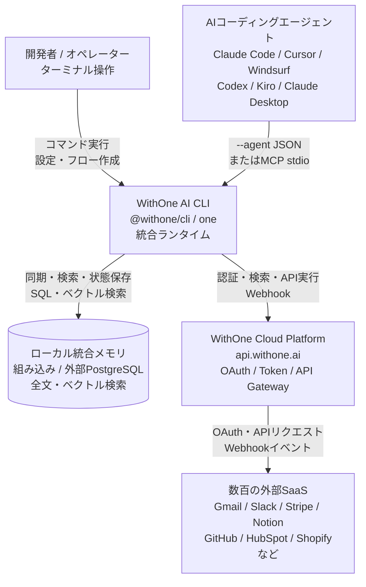
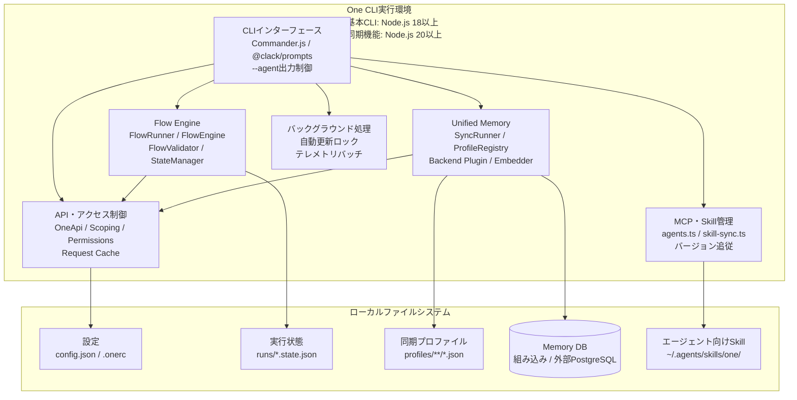
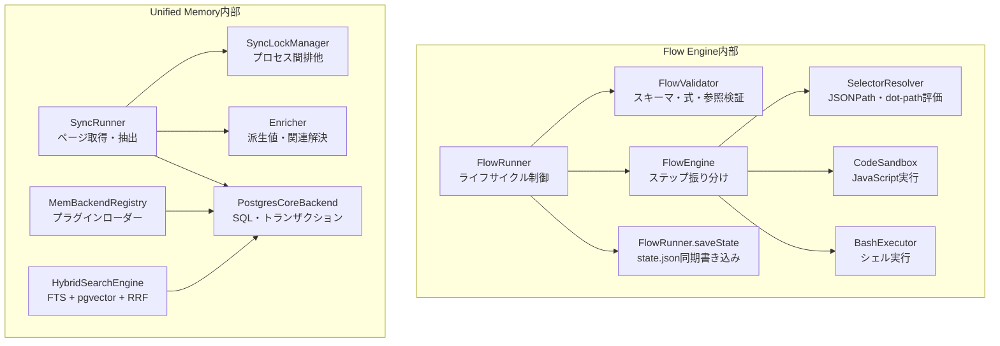
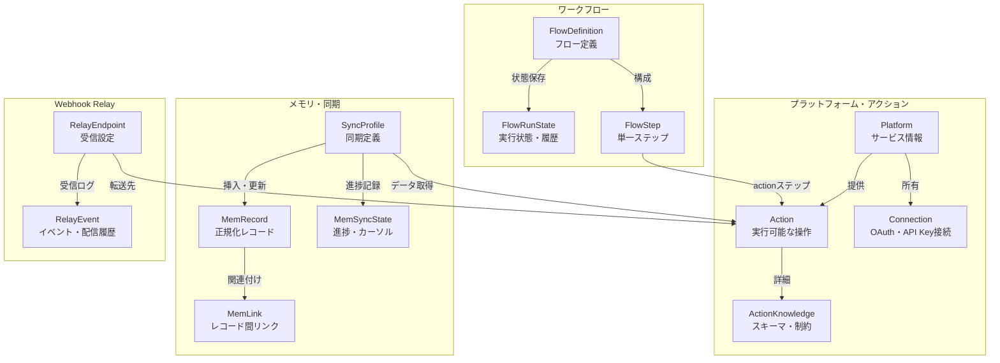
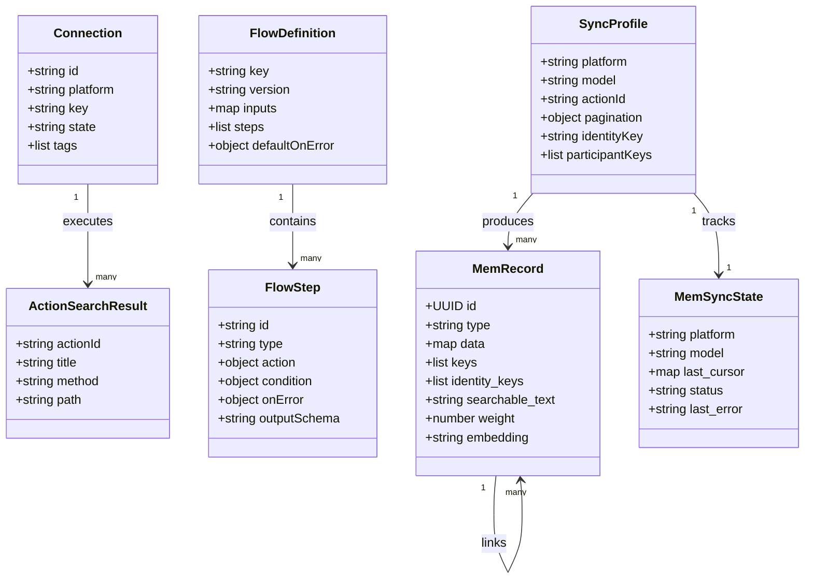
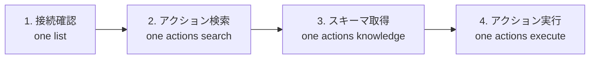

WithOne AI CLI（以下、One CLI）は、AIエージェントや開発者が外部サービスを操作するための認証、アクション探索、実行、ワークフロー、ローカルメモリを1つのCLIへまとめたツールです。npmパッケージは `@withone/cli`、実行コマンドは `one` です。

:::message
この記事で扱うのは、GitHubの [`withoneai/cli`](https://github.com/withoneai/cli) です。クレデンシャルVaultを提供する別のOSS [`onecli/onecli`](https://github.com/onecli/onecli) とは異なる製品です。
:::

この記事では、One CLIの全体構造とデータモデルを図でたどりながら、導入方法、4段階のアクション実行、Flow Engine、Unified Memory、運用時の注意点まで解説します。


*One CLIが、AIエージェントと外部SaaSの間で認証・操作・データを仲介する全体像です。*


*この記事の全体像。以下、順に解説します。*

## 概要

AIエージェントからGmail、Slack、Stripe、Notion、GitHubなどを操作するには、通常はサービスごとのOAuth、トークン更新、APIスキーマ、レート制限、エラー処理を個別に扱う必要があります。One CLIはこれらを共通の抽象化レイヤーへ集約し、ローカルのCLIからWithOneのクラウドゲートウェイを通して外部サービスへアクセスします。

中心となる操作は、次の4段階です。

1. `one list` で接続済みサービスを確認する
2. `one actions search` で目的に合うアクションを探す
3. `one actions knowledge` で入力スキーマと制約を取得する
4. `one actions execute` でアクションを実行する

この順序を守ることで、エージェントがAction IDやJSONペイロードを推測する余地を減らせます。人間向けの対話表示だけでなく、`--agent` による機械可読出力とMCPサーバーも同じCLIに含まれます。

さらに、複数処理を連結するFlow Engine、外部データをローカルへ同期するUnified Memory、Webhookを別サービスへ転送するRelay、複数のAI開発ツールへMCP設定やSkillを配布する仕組みを備えています。

## 特徴

One CLIの特徴は、単に「多くのAPIを呼べる」ことではなく、エージェントが探索から実行、状態保存までを同じ操作体系で扱える点です。

| 領域 | 提供される機能 | 実務上の意味 |
|---|---|---|
| SaaS統合 | 数百の外部サービスへの認証済みアクセス | OAuthやトークン更新の個別実装を減らせる |
| アクション実行 | list → search → knowledge → execute | 実行前にスキーマを確認する手順を標準化できる |
| エージェント連携 | `--agent` JSON出力、MCPサーバー、Skill同期 | CLIとエージェントの両方から同じ機能へアクセスできる |
| ワークフロー | 12種類のステップ、リトライ、フォールバック、状態保存 | 複数SaaSをまたぐ処理を再開可能なフローにできる |
| ローカルメモリ | 組み込み・外部PostgreSQL、全文・ベクトル検索 | SaaSのデータを手元で横断検索・分析できる |
| 制御 | admin/write/read、接続・アクションの許可リスト | エージェントへ渡す権限を用途別に絞れる |

Flow Engineが扱う正式なステップtypeは、`action`、`transform`、`code`、`condition`、`loop`、`while`、`parallel`、`paginate`、`flow`、`file-read`、`file-write`、`bash` の12種類です。BashやCodeまで含むため柔軟ですが、外部書き込みとローカルコマンドの権限境界は明示的に設計する必要があります。

## 構造

One CLIは、ローカルで動くNode.js CLI、WithOneのクラウドサービス、外部SaaS、ローカルデータベースを組み合わせた構成です。ここでは、システムコンテキスト、コンテナ、主要コンポーネントの順に分解します。

### システムコンテキスト図

開発者とAIエージェントは、どちらもOne CLIを入口にします。認証済みAPI操作はWithOne Cloud Platformを経由し、同期データやフロー状態はローカル側に保持されます。



この構成では、ローカルCLIがすべての認証情報を直接抱えて各SaaSへ接続するのではありません。ローカルでは設定、実行制御、状態、同期データを扱い、クラウド側がOAuthトークン管理、アクションカタログ、API中継を担います。

### コンテナ図

CLI内部は、コマンド処理、APIアクセス、Flow Engine、Memory、MCP・Skill管理、バックグラウンド処理に分かれます。ローカルファイルシステムには設定、実行状態、同期プロファイル、データベース、Skillが置かれます。



CLIとMCPが別々の実装ではなく、同じコアへ接続するのが重要です。人間がターミナルで検証した操作を、エージェントからも同じアクション体系で呼び出せます。

### コンポーネント図

中核となるFlow EngineとUnified Memoryをさらに分解すると、検証、実行、状態保存、同期、検索の責務が分離されています。



FlowRunnerは実行ライフサイクルを統括し、FlowValidatorがステップID、参照、式、コード構文などを事前検証します。FlowEngineはステップ種別ごとの実行器へ処理を振り分け、各ステップ後に `FlowRunner.saveState()` が実行状態を同期書き込みします。

Memory側では、SyncRunnerがSync Profileに従ってページを取得し、Enricherで派生値や関連を解決したうえでバックエンドへ保存します。同じモデルの二重同期はSyncLockManagerが防ぎ、検索時は全文検索とベクトル検索の順位をRRF（Reciprocal Rank Fusion）で統合します。

## データ

One CLIでは、API接続とアクション、フロー定義と実行状態、同期プロファイルとメモリレコード、Webhook Relayが別のエンティティとして扱われます。

### 概念モデル

アクションはフロー、同期、Relayから共通して参照されます。同期処理は進捗をMemSyncStateへ保存し、取得したデータをMemRecordとして保持します。



特に区別したいのは、ActionKnowledgeとAction、FlowDefinitionとFlowRunStateです。前者は「どう呼ぶか」と「実際に呼ぶ操作」の分離、後者は「宣言された処理」と「今回の実行結果」の分離です。この分離が、実行前の検証と実行後の再開・監査を可能にします。

### 情報モデル

実装上の主要フィールドを並べると、フローの参照解決とメモリの同一性管理がどこで行われるかが見えます。



メモリの同一性管理では、`keys` と `identity_keys` を混同しないことが重要です。

| フィールド | 役割 | 例 |
|---|---|---|
| `keys` | レコード自身を一意に識別し、UPSERT時の結合に使う | `email:jane@example.com` |
| `identity_keys` | イベントやスレッドに関係する参加者を検索する | To、Cc、会議参加者のメールアドレス |

参加者全員をUPSERTキーにすると、別のイベントやスレッドを誤って同じレコードへ統合する可能性があります。参加者は参照用の `identity_keys` へ置き、レコード自身の同一性だけを `keys` へ置く設計が安全です。

## 構築方法

### 前提条件

基本CLIの実行にはNode.js 18以上と、WithOneのアカウントが必要です。同期機能は `better-sqlite3` の要件によりNode.js 20以上を必要とします。macOS、Linux、Windowsを対象とし、npmからグローバルCLIとして導入します。

```bash
npm install -g @withone/cli@latest
one --version
```

### 初期セットアップと認証

デスクトップ環境では、ブラウザを使うログインから始められます。

```bash
one login
one list
one config path
```

ヘッドレス環境や自動化では、APIキーを明示して初期化します。APIキーはコマンド履歴やリポジトリへ残さないよう、環境に合ったシークレット管理を利用してください。

```bash
one init --auth manual --api-key "$ONE_API_KEY"
```

プロジェクトで利用するAIツールを検出し、MCP設定とSkillを同期する場合は `one init` を実行します。Skillの状態は次のコマンドで確認できます。

```bash
one init
one config skills status
```

設定先はクライアントによって異なります。代表例は、Claude Codeの `~/.claude.json` または `.mcp.json`、Cursorの `~/.cursor/mcp.json`、Codexの `~/.codex/config.toml` です。既存設定を管理している環境では、実行前後の差分を確認してください。

### Unified Memoryの初回起動

現行の公開CLIでは `one mem init` を実行する必要はありません。最初に `one mem` のコマンドを呼び出したとき、組み込みPostgreSQLが自動的に初期化されます。外部PostgreSQLを使う場合は、実行環境の接続設定を公式READMEと `one mem --help` で確認してください。

## 利用方法

### 4段階のアクション実行

最も基本的な利用パターンは、接続確認、検索、知識取得、実行です。



まず、利用可能な接続と権限を確認します。エージェントから解析する場合は `--agent` を付けます。

```bash
one list
one --agent list
```

次に、プラットフォームと目的を指定して、実行可能なAction IDを探します。検索種別の既定値は `knowledge` なので、実行予定のアクションには `-t execute` を明示します。

```bash
one actions search gmail "send email" -t execute
one --agent actions search gmail "send email" -t execute
```

候補を見つけても、すぐに実行へ進まないでください。知識取得で必須フィールド、型、パス変数、制約を確認します。

```bash
one actions knowledge gmail '<actionId>'
one --agent actions knowledge gmail '<actionId>'
```

最後に、取得したスキーマに合うJSONを渡します。JSON全体をシングルクォートで囲むと、シェルによるダブルクォートの解釈を避けられます。

```bash
one actions execute gmail \
  '<actionId>' \
  live::gmail::default::CONNECTION_ID \
  --data '{"to":"user@example.com","subject":"Hello","body":"Sent by One CLI"}'
```

接続キーの引数位置やペイロードは、CLIのバージョンと対象アクションで変わり得ます。実行時点の `actions knowledge` と `--help` を優先してください。

### Flow Engineで複数処理をつなぐ

フローはJSONで宣言し、入力、エラー戦略、ステップを定義します。次は、入力を受け取ってSlackへ通知する最小構成です。`<actionId returned by actions search>` は、事前に `one actions search slack "post message" -t execute` で取得した実行可能Action IDへ置き換えてください。

```json
{
  "key": "welcome-customer",
  "name": "新規顧客ウェルカムフロー",
  "version": "1.0.0",
  "inputs": {
    "customerName": {
      "type": "string",
      "required": true
    }
  },
  "defaultOnError": {
    "strategy": "fail"
  },
  "steps": [
    {
      "id": "notifySlack",
      "type": "action",
      "action": {
        "platform": "slack",
        "actionId": "<actionId returned by actions search>",
        "connection": {
          "platform": "slack"
        },
        "data": {
          "channel": "#sales-alerts",
          "text": "新規顧客: {{$.input.customerName}}"
        }
      }
    }
  ]
}
```

フローを登録し、検証してから実行します。

```bash
one flow create welcome-customer --definition @welcome-user.json
one flow validate welcome-customer
one flow execute welcome-customer -i customerName=Alice
```

実行後は履歴とステップ出力を確認できます。

```bash
one flow runs welcome-customer
one flow inspect RUN_ID --full
```

Bashステップを含むフローは、実行時に明示的な許可が必要です。

```bash
one flow execute local-maintenance -i target=cache --allow-bash
```

### Unified Memoryへ同期して検索する

Sync Profileを指定して外部データを取り込みます。通常同期、全件同期、ドライランを使い分けます。

```bash
one sync run google-calendar
one sync run stripe --full-refresh
one sync run notion --dry-run
one sync test notion/search
```

取り込んだデータは、自然言語検索、型を指定した検索、SQLで調べられます。

```bash
one mem search "Q3 marketing strategy" --limit 5
one mem search "Alice" --type attio/attioPeople
one mem find-by-key email:alice@example.com
```

検索結果が期待どおりでないときは、同期状態、検索対象フィールド、埋め込み生成、キー設計を分けて確認します。バックエンド全体の診断には `one mem doctor` を使います。

## 運用

### 自動更新と排他ロック

One CLIは、新しいバージョンを検知するとコマンド実行の裏で更新処理を行う仕組みを持ちます。複数プロセスから同時に更新されないようロックを使い、異常終了後も一定時間で失効する設計です。

CIや再現性を優先する環境では、自動更新を無効化し、導入バージョンをパイプライン側で管理します。

```bash
export ONE_NO_AUTO_UPDATE=1
```

### テレメトリ

テレメトリを無効にする場合は、次のいずれかを設定します。

```bash
export ONE_NO_TELEMETRY=1
# または
export DO_NOT_TRACK=1
```

共有環境では、送信項目と組織ポリシーを確認したうえで有効・無効を決めてください。

### バックアップと設定スコープ

メモリを運用データとして使う場合は、同期元から再生成できるデータと、ローカルで付加したデータを区別してバックアップ方針を決めます。

```bash
one mem export --output ./backup-memory.jsonl
one mem import ./backup-memory.jsonl
```

認証・設定の適用範囲は、公式に用意されたglobal scopeとproject scopeで分けます。現在の設定ファイルは `one config path` で確認できます。

```bash
one init -g
one init -p
one config path
```

global scopeは `~/.one/config.json`、project scopeは `~/.one/projects/<slug>/config.json` に対応します。複数テナントを同一ホストで扱う場合は、この設定スコープだけでデータ境界を保証できると決めつけず、OSユーザー、コンテナ、データベース資格情報も含めて分離してください。

## ベストプラクティス

### 接続を実行時に解決する

フローへ `live::...` の接続キーを固定すると、再認証でキーが変わったときに壊れます。可能な箇所では、プラットフォームやタグで接続を遅延解決します。

```json
{
  "connection": {
    "platform": "gmail",
    "tag": "primary"
  }
}
```

### knowledgeを実行前ゲートにする

アクション名が似ていても、必須フィールド、配列と文字列の違い、ページネーション、ファイル添付方法などは異なります。エージェント向けの手順にも `search` の直後に `knowledge` を組み込み、取得したスキーマなしでは `execute` へ進まないルールにします。

### 書き込み処理は失敗戦略を厳しくする

通知の失敗を `continue` できても、課金、削除、顧客データ更新の失敗を見逃してはいけません。フロー全体の既定戦略に頼らず、重要な書き込みステップへ `onError` を明示します。リトライする場合は、対象APIが冪等か、同じ入力で重複作成されないかも確認します。

### `.onerc` とシークレットを分離する

プロジェクト別の権限や接続範囲を `.onerc` で管理する場合でも、APIキーはリポジトリへ含めないでください。設定ファイルの役割を「許可範囲」と「秘密情報」に分け、秘密情報は環境変数やシークレットストアから渡します。

### メモリキーを用途別に設計する

レコードを統合する `keys` と、参加者を検索する `identity_keys` を分けます。同期プロファイルを追加するときは、データ取得件数だけでなく、再同期時のUPSERT結果と関係検索もテストしてください。

## トラブルシューティング

| 症状 | 確認すること | 対処 |
|---|---|---|
| `Not configured. Run one init first.` | ログイン状態、APIキー、global/project scope | `one login` または適切なscopeで初期化する |
| 接続キーが無効・期限切れ | 再認証、接続キーのハードコード | `one list` で確認し、遅延解決へ移行する |
| 組み込みDBが起動しない | ポート、権限、残存プロセス | `one mem doctor` で診断し、外部PostgreSQLも検討する |
| Bashステップを実行できない | `--allow-bash` の有無 | 内容を確認して明示的に許可する |
| 更新ロックが保持されている | 別プロセスの更新、ロック経過時間 | 更新中なら待機し、異常終了なら期限後に再試行する |
| HTTP 429 | SaaS側のレート制限、Retry-After | 待機と上限付きリトライを設定する |
| 出力が途中で省略される | 人間向け表示か、詳細表示か | `--agent` または `flow inspect --full` を使う |
| Skillが古い | CLI更新後の同期状態 | `one config skills sync` を実行する |

障害対応では、すぐにローカル状態を削除するより、まず実行履歴と診断結果を保存してください。Flow Engineの `.state.json`、`flow inspect --full`、同期状態、CLIバージョンが、再現条件を切り分ける手掛かりになります。

## まとめ

One CLIは、AIエージェント向けのSaaS統合を、認証済みアクション、4段階の探索・実行手順、再開可能なワークフロー、ローカル統合メモリとして1つのCLIへまとめています。導入判断では対応サービス数だけでなく、クラウドゲートウェイを介する信頼境界、エージェントへ渡す権限、Flowの失敗戦略、ローカルメモリの同一性設計まで確認することが重要です。

まずは読み取り権限の接続で `list → search → knowledge` を試し、入力スキーマと監査方法を理解してから `execute` や複数サービスのFlowへ広げると、安全に評価できます。

この記事が少しでも参考になった、あるいは改善点などがあれば、ぜひリアクションやコメント、SNSでのシェアをいただけると励みになります！

## 参考リンク

- [WithOne AI CLI GitHubリポジトリ](https://github.com/withoneai/cli)
- [WithOne AI公式サイト](https://withone.ai)
- [WithOne AI Webアプリケーション](https://app.withone.ai)
- [npm: @withone/cli](https://www.npmjs.com/package/@withone/cli)
- [WithOne AI CLI DeepWiki](https://deepwiki.com/withoneai/cli)
- [WithOne AIプラットフォーム一覧API](https://api.withone.ai/open/count/platforms)
- [Model Context Protocol](https://modelcontextprotocol.io)
- [pgvector](https://github.com/pgvector/pgvector)
