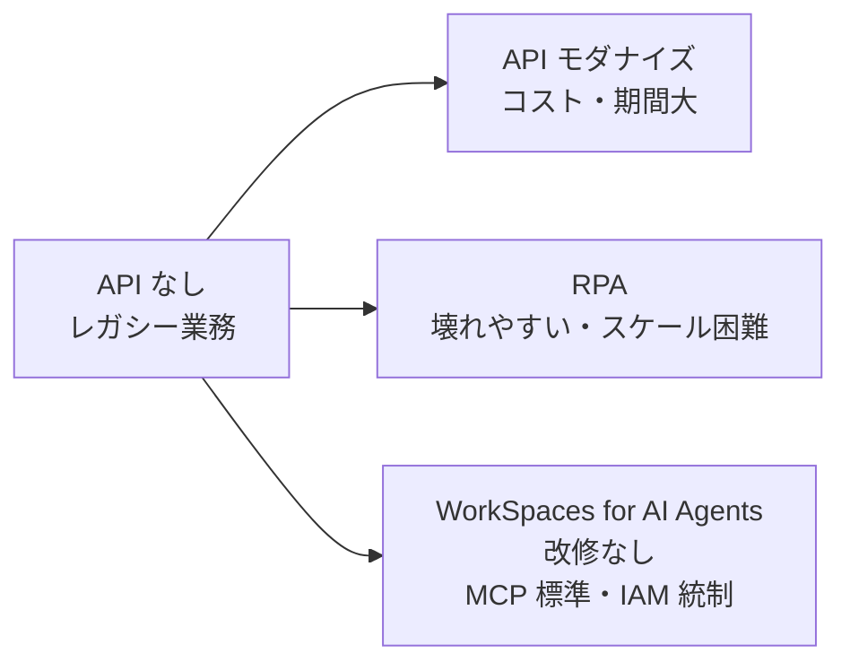
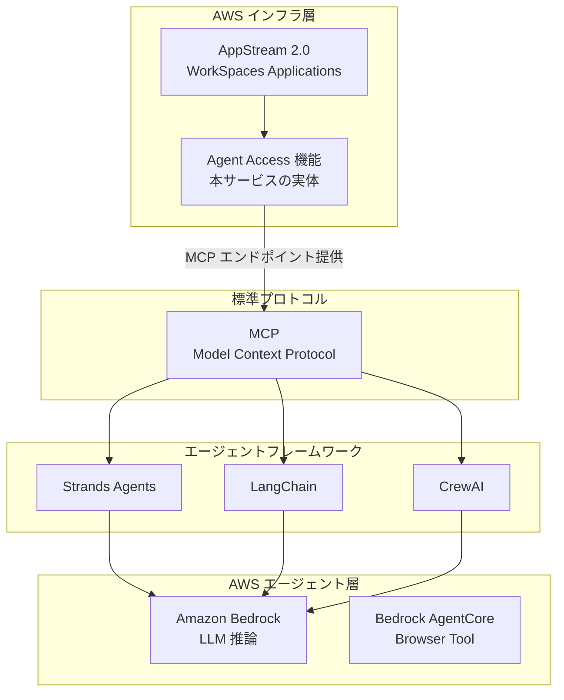
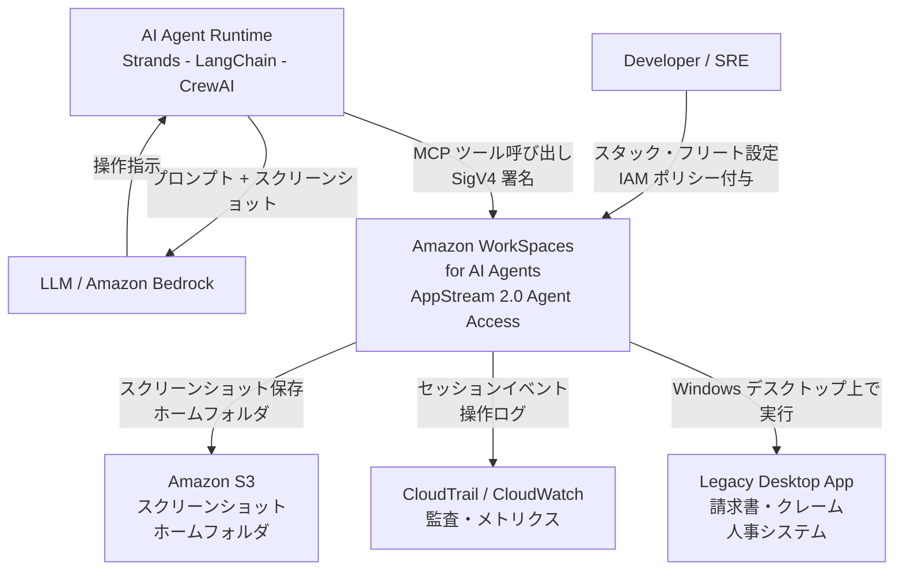
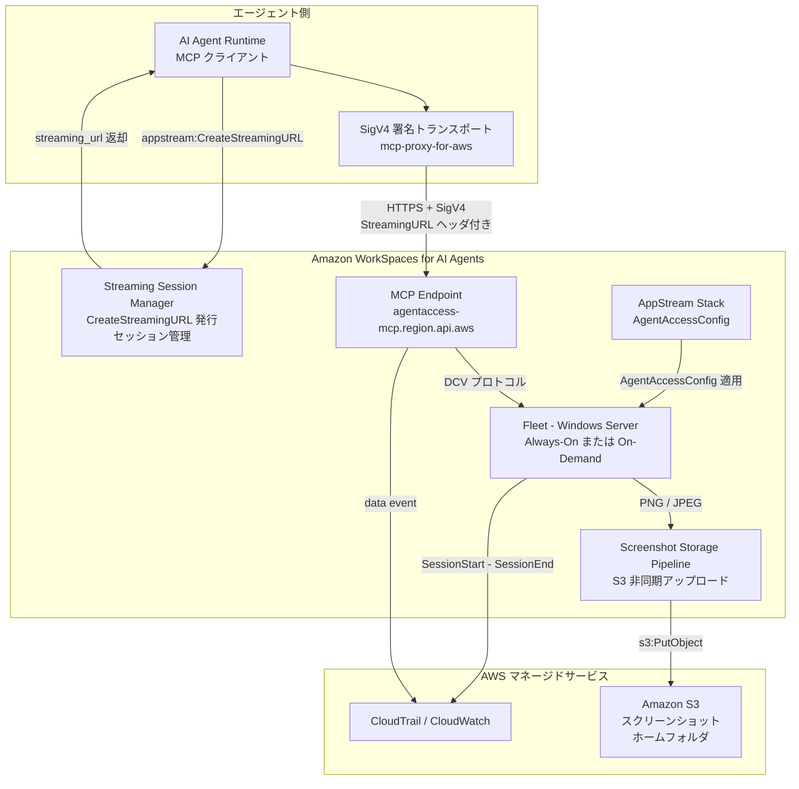
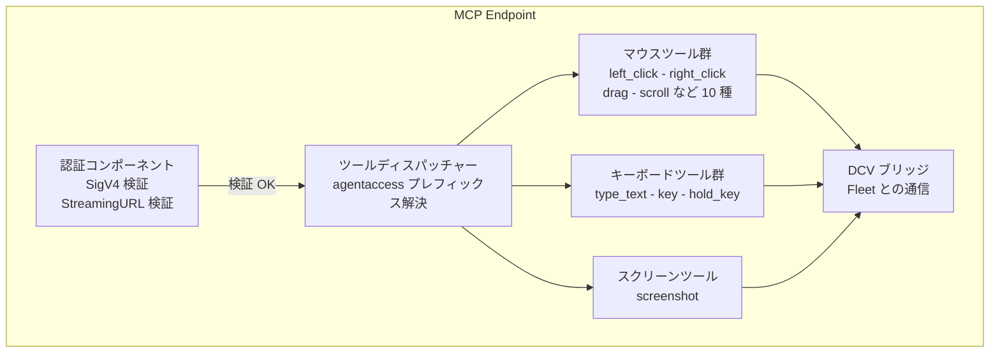
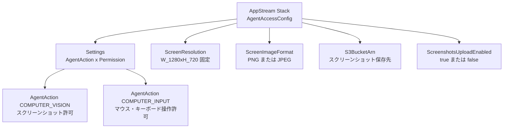
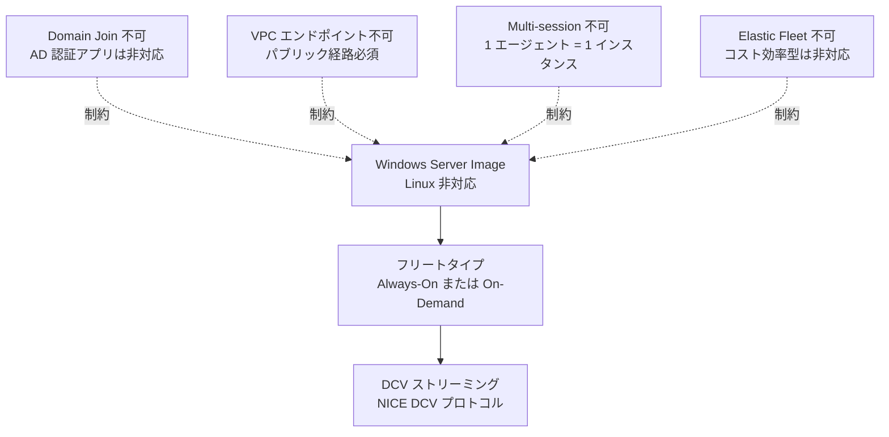
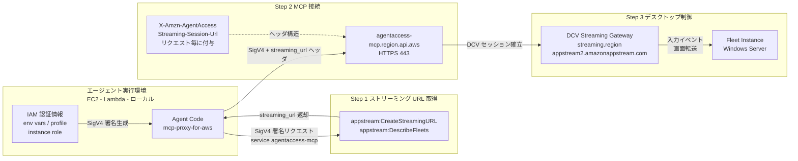
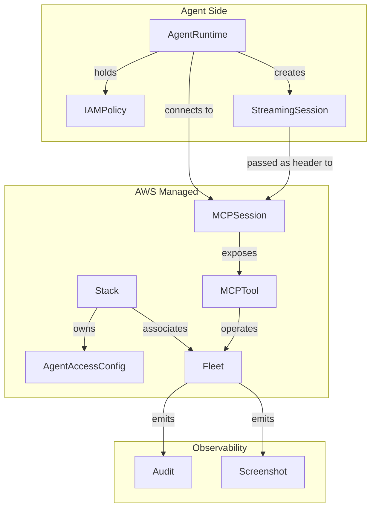
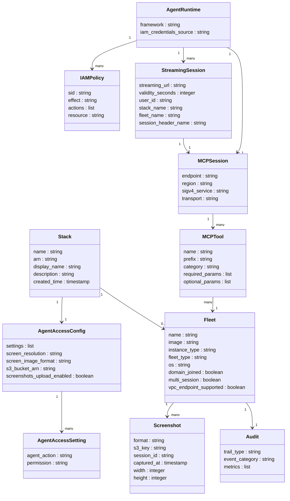

> 検証日: 2026-05-06 / 対象: Amazon WorkSpaces for AI Agents (preview, 2026-05-05 発表) / サービス実体: AppStream 2.0 (WorkSpaces Applications) の Agent Access 機能

## 概要

### 目的と位置づけ

Amazon WorkSpaces for AI Agents (public preview, 2026-05-05 発表) は、AI エージェントが API なしのレガシーデスクトップアプリケーションをそのまま操作できるようにする AWS managed なデスクトップ自動化サービスです。

AWS によれば、企業の 75% がモダン API を持たないレガシーアプリケーションを抱えています。従来の選択肢は「API 化 (モダナイズ)」か「RPA」の二択でした。本サービスはその第三の道として、既存アプリを改修せず、AI エージェントが人間と同じデスクトップ画面を操作するアプローチを提供します。



| 要素 | 説明 |
|---|---|
| Q | API がないレガシー業務という出発点の課題 |
| A | 従来の選択肢 1: API 化によるモダナイズ。期間・コストが大きい |
| B | 従来の選択肢 2: RPA。手順固定で壊れやすくスケールしない |
| C | 第三の道: WorkSpaces for AI Agents。改修なしで MCP + IAM 統制下に置く |

### 技術的な実体

マーケティング名は WorkSpaces ですが、サービスの実体は AppStream 2.0 (WorkSpaces Applications) の "Agent Access" 機能です。ドキュメントも API も制限も、すべて `docs.aws.amazon.com/appstream2/` 配下に存在します。この点は preview 段階の制約と直結するため、設計・評価時に必ず把握する必要があります。

### 関連技術との関係



| 関連技術 | 関係 |
|---|---|
| AppStream 2.0 | サービスの実装基盤。Agent Access 機能として実装されている |
| WorkSpaces Personal/Pools | 名称が類似するが別サービス。AI エージェント向け機能はない |
| Amazon Bedrock | エージェントの LLM 推論に使用。必須ではなく任意 |
| Bedrock AgentCore Browser Tool | 同じ AWS エージェント基盤だがブラウザのみ対応。デスクトップ操作は不可 |
| MCP (Model Context Protocol) | インターフェース標準。WorkSpaces は managed MCP エンドポイントを提供 |


## 特徴

### サービス基盤

- 本体は AppStream 2.0 の Agent Access 機能。WorkSpaces という名称はマーケティング用です
- Windows Server image のみ対応します。Linux は未対応です
- エージェント専用の managed Windows デスクトップを AWS が提供・管理します
- 対象 OS に既存の業務アプリケーションをそのままインストールして使用します

### MCP インタフェース

- 業界標準 MCP に準拠した managed エンドポイントを提供します (`https://agentaccess-mcp.<region>.api.aws/mcp`)
- フレームワーク非依存設計です: 公式の動作確認済みは Strands Agents SDK + `mcp-proxy-for-aws`。LangChain / CrewAI は Streamable HTTP + SigV4 対応により接続可能と解釈できますが公式 tested 記載はなく、実機検証が必要です
- 提供ツール (プレフィックス `agentaccess___`):
  - 操作系: `left_click`, `double_click`, `triple_click`, `right_click`, `scroll`, `type_text`, `key` など
  - 視覚系: `screenshot`
- SigV4 認証です。Bearer/OAuth は不使用です

### 画面・コンピュータビジョン

- 画面解像度 1280×720 固定です (PNG または JPEG)
- スクリーンショットをエージェントに渡し、LLM が内容を解釈して次の操作を決定します
- スクリーンショットは S3 へ自動保存されます (監査・デバッグ用)

### セキュリティと認証

- AWS IAM による認証です。既存の ID ポリシー・アクセス制御・セッション境界をそのまま適用できます
- 認証情報は環境変数 / AWS profile / EC2 Instance Role / Lambda 実行ロールで供給します
- エージェントは人間従業員と同じ governed な環境で動作します

### 監査とログ

- CloudTrail data event を有効化すれば MCP ツール呼び出しを監査ログに残せます (デフォルト Trail では記録されないため別途設定が必要です)。CloudWatch では運用メトリクスを監視します
- CloudWatch メトリクス: `Invocations`, `Latency`, `ClientErrors`, `ServerErrors`, `SessionStart`, `SessionEnd`
- S3 へのスクリーンショット保存で視覚的な操作履歴を確保します
- 注意: CloudTrail のツール呼び出しはデータイベント扱いです。デフォルトでは記録されないため別途 trail 設定が必要です

### 料金

- preview 期間中: MCP 追加料金なしです。AppStream 2.0/WorkSpaces Applications の利用料金のみ課金されます
- GA 時の MCP 追加メータリング有無は未開示です

### 対応リージョン (13 リージョン)

東京を含む主要リージョンで利用可能です。

| 地域 | リージョン |
|---|---|
| 北米 | US East (N.Virginia, Ohio), US West (Oregon), Canada (Central) |
| ヨーロッパ | Frankfurt, Ireland, Paris, London |
| アジア太平洋 | Tokyo, Mumbai, Sydney, Seoul, Singapore |

GovCloud / São Paulo / Milan / Spain / Tel Aviv / Malaysia は MCP エンドポイント未提供です。

### 想定ユースケース (AWS 公式)

| ユースケース | 具体例 |
|---|---|
| バックオフィス業務 | 請求書入力、台帳照合、アプリ間データ転送 |
| 審査・コンプライアンス | 複数アプリをまたぐ保険クレーム照合、ポリシー検証、監査書類作成 |
| 人事・労務管理 | HR プラットフォーム間の異動処理、給付金システム更新 |

対象業界は金融・保険・医療・政府など regulated industry を主軸とします。

### preview 段階の主要制限

| 制限 | 影響 |
|---|---|
| Domain-joined fleet 不可 | AD 認証必須の業務アプリは現状投入できない |
| VPC エンドポイント不可 | パブリック経路経由が必須 |
| Multi-session fleet 不可 | エージェント 1 台につき 1 フリートインスタンス |
| Elastic fleet 不可 | コスト効率の良い構成が使えない |
| 画面解像度 1280×720 固定 | 高密度 UI やマルチモニタ業務に不向き |
| 公式サンプルは Strands Agents のみ | LangChain/CrewAI は公式 docs に明示的な "tested/compatible" 記載なし。Streamable HTTP + SigV4 対応なら接続可能と解釈 |
| レート制限・SLA 非開示 | 設計前提に組み込めない |

### 類似ツールとの比較

| 製品 | 制御範囲 | 認証 | 監査 | 料金特性 | 想定ユースケース |
|---|---|---|---|---|---|
| WorkSpaces for AI Agents | デスクトップ全体 (Windows) | AWS IAM (SigV4) + MCP | CloudTrail + CloudWatch + S3 | AppStream 時間課金 | AWS 環境でのレガシーデスクトップ業務全般 |
| Anthropic Computer Use | ブラウザ + デスクトップ (座標) | API key / Bedrock IAM | CloudTrail (Bedrock 経由) | Pay-per-token | レガシーフォーム自動化、ad-hoc タスク |
| OpenAI CUA | ブラウザのみ | ChatGPT Pro / API Tier3+ | コンソールのみ | 従量 ($3/$12 per 1M) | 個人・開発者向け |
| MS Copilot Studio + PAD | デスクトップ全体 (Windows) | Entra ID | Power Automate audit | $300/月 + usage | 企業内構造化 UI 操作、MS エコシステム |
| Bedrock AgentCore Browser | ブラウザのみ (WebSocket) | AWS IAM | CloudTrail + Session Recording | モデル料金のみ | マルチフレームワーク統合、Web アプリ自動化 |
| 従来型 RPA + AI 拡張 | デスクトップ全体 | RPA IAM | RPA audit log | ライセンス $5K+/年 | 既存 RPA 投資の延長 |

### ユースケース別推奨

| 状況 | 推奨 | 理由 |
|---|---|---|
| AWS 環境で API なきレガシー Windows アプリを操作したい | WorkSpaces for AI Agents | フルデスクトップ + IAM + MCP の三拍子が揃う |
| ブラウザベース Web アプリのみを自動化したい | Bedrock AgentCore Browser | デスクトップ不要、Session Recording あり、料金安 |
| Microsoft 365 / Entra ID 環境でまとめて管理したい | MS Copilot Studio + PAD | Entra ID 連携が GA 済み、Allow-List ガバナンスあり |
| 個人・小チームで素早くプロトタイプしたい | Anthropic Computer Use 直接 | セットアップ最小、Pay-per-token |
| 既存 RPA 資産を活かして AI 拡張したい | UiPath / Automation Anywhere AI 拡張 | RPA 投資を無駄にしない移行パス |
| コストを抑えてブラウザ操作を自動化したい | Browser Use (OSS) | LLM 料金のみ、自ホスト、多 LLM 対応 |


## 構造

### システムコンテキスト図



| 要素 | 説明 |
|---|---|
| Developer / SRE | スタック・フリートを設定し、IAM ポリシーを付与する運用担当者 |
| AI Agent Runtime | Strands Agents / LangChain / CrewAI などの MCP 対応フレームワーク。エージェントのオーケストレーション層 |
| LLM / Amazon Bedrock | エージェントが画面を解析させ、次操作を判断させる言語モデル。WorkSpaces 本体には含まれない外部サービス |
| Amazon WorkSpaces for AI Agents | MCP 経由で Windows デスクトップ操作を提供する管理サービス。実体は AppStream 2.0 Agent Access |
| Amazon S3 | スクリーンショット・ホームフォルダ・アプリ設定を永続化するストレージ |
| CloudTrail / CloudWatch | エージェントのセッションイベントを監査ログとメトリクスとして収集する観測サービス |
| Legacy Desktop App | API を持たないレガシー Windows 業務アプリケーション。WorkSpaces フリート上で稼働する |

### コンテナ図



| コンテナ | 説明 |
|---|---|
| AI Agent Runtime | MCP クライアント機能を持つエージェントフレームワーク。ツール呼び出しを生成する |
| SigV4 署名トランスポート | `mcp-proxy-for-aws` ライブラリ。AWS IAM 認証情報で MCP リクエストに SigV4 署名を付与する |
| MCP Endpoint | AWS が管理する MCP サーバー。Streamable HTTP を受け付け、デスクトップ操作に変換する |
| Streaming Session Manager | `CreateStreamingURL` API を処理し、エージェントとフリートの接続セッションを管理する |
| AppStream Stack - AgentAccessConfig | AgentAction・解像度・S3 設定を保持するスタックレベルの設定コンテナ。フリートに適用される |
| Fleet - Windows Server | 実際にデスクトップアプリを実行する Windows Server インスタンス群。Fleet タイプは `ALWAYS_ON` または `ON_DEMAND` の 2 種類 |
| Screenshot Storage Pipeline | キャプチャした PNG/JPEG を非同期で S3 に書き込むパイプライン。S3 キー形式でセッション ID を使用 |

### コンポーネント図

#### MCP Endpoint の内部コンポーネント



| コンポーネント | 説明 |
|---|---|
| 認証コンポーネント | SigV4 署名 (service: `agentaccess-mcp`) と `X-Amzn-AgentAccess-Streaming-Session-Url` ヘッダを両方検証する二段認証を実施する |
| ツールディスパッチャー | `agentaccess___` プレフィックスを持つツール名を受け付け、該当ハンドラーへルーティングする |
| マウスツール群 | `left_click` / `double_click` / `triple_click` / `right_click` / `middle_click` / `left_click_drag` / `left_mouse_down` / `left_mouse_up` / `move_pointer` / `scroll` の計 10 種。座標 (x, y) と修飾キーを受け取る |
| キーボードツール群 | `type_text` (最大 10,000 文字) / `key` (キー組み合わせ) / `hold_key` (1〜30 秒) の計 3 種 |
| スクリーンツール | `screenshot` 1 種。1280×720 固定解像度で PNG または JPEG を返す。マウスカーソル表示は任意 |
| DCV ブリッジ | NICE DCV プロトコルで Fleet インスタンスと通信し、入力イベント送信と画面キャプチャを担う |

#### AgentAccessConfig のコンポーネント



| コンポーネント | 説明 |
|---|---|
| Settings - AgentAction | `COMPUTER_VISION` と `COMPUTER_INPUT` のいずれか一方、または両方を `ENABLED` に設定する。少なくとも 1 つ必須 |
| COMPUTER_VISION | エージェントが `screenshot` ツールでデスクトップを視覚的に認識する権限 |
| COMPUTER_INPUT | エージェントがクリック・テキスト入力・スクロールを実行する権限。有効化時は COMPUTER_VISION も必須 |
| ScreenResolution | `W_1280xH_720` のみ対応。HiDPI・マルチモニタは非対応 |
| ScreenImageFormat | `PNG` または `JPEG` を選択。スクリーンショットの画像形式を決定する |
| S3BucketArn | スクリーンショット保存先 S3 バケットの ARN。指定時は `ScreenshotsUploadEnabled: true` も必要 |
| ScreenshotsUploadEnabled | `true` のとき、セッション中のスクリーンショットを S3 へ非同期アップロードする |

#### Fleet の制約コンポーネント



| コンポーネント | 説明 |
|---|---|
| Windows Server Image | フリートが実行できる OS は Windows Server のみ。Linux イメージは非対応 |
| フリートタイプ | `ALWAYS_ON` (常時起動) または `ON_DEMAND` (需要起動) の 2 種類のみ。Elastic Fleet は非対応 |
| Domain Join 不可 | Active Directory ドメイン参加フリートは preview 段階では使用できない。AD 認証必須アプリは非対応 |
| VPC エンドポイント不可 | MCP エンドポイントへの PrivateLink は未提供。エージェントはパブリックインターネット経路を使用する |
| Multi-session 不可 | 1 フリートインスタンスに複数エージェントを同時接続できない。スケールアウトはインスタンス追加で対応 |
| Elastic Fleet 不可 | ブラウザベースのコスト効率型フリートは使用できない |
| DCV ストリーミング | NICE DCV プロトコルで画面映像をストリーミングし、入力イベントを伝送する |

#### ネットワーク・認証構成図



| 要素 | 説明 |
|---|---|
| IAM 認証情報 | 環境変数 / AWS プロファイル / EC2 インスタンスロール / Lambda 実行ロールのいずれかで供給する |
| appstream:CreateStreamingURL | エージェントがセッション開始前に呼び出す AppStream API。返却された URL は有効期限付き (API デフォルトは 60 秒、明示指定で最大 604800 秒。コンソールのテスト導線では 30 分が案内される場合あり) |
| SigV4 署名 (agentaccess-mcp) | MCP リクエスト全体を IAM 認証情報で署名する。service name は `agentaccess-mcp` |
| X-Amzn-AgentAccess-Streaming-Session-Url | CreateStreamingURL で取得した URL を毎リクエストヘッダに付与する。SigV4 と組み合わせた二段認証を構成する |
| DCV Streaming Gateway | NICE DCV ベースのストリーミング中継。ドメイン形式 `*.streaming.{region}.appstream2.amazonappstream.com` |
| Fleet Instance | DCV 経由で受け取った入力イベントをデスクトップアプリに送出し、画面を逆方向にストリーミングする |

##### 必要な IAM 最小ポリシー

| Action | 用途 |
|---|---|
| `agentaccess-mcp:*` | MCP エンドポイントへの全操作 |
| `appstream:CreateStreamingURL` | ストリーミング URL の発行 |
| `appstream:DescribeFleets` | フリート状態の確認 |
| `s3:PutObject` | スクリーンショット / ホームフォルダの書き込み (オプション) |

##### 許可が必要なドメイン一覧

| ドメイン | 用途 |
|---|---|
| `agentaccess-mcp.{region}.api.aws` | MCP エンドポイント (13 リージョン) |
| `*.streaming.{region}.appstream2.amazonappstream.com` | DCV ストリーミングゲートウェイ (IPv4) |
| `*.dcv-streaming.{region}.appstream2.amazonappstream.com` | DCV ストリーミング (IPv4 追加ドメイン) |
| `*.amazonappstream.com` | セッションゲートウェイ全般 |


## データ

### 概念モデル

サービスを構成するエンティティの所有関係と利用関係を示します。



| エンティティ | 役割 |
|---|---|
| Stack | AppStream Stack。AgentAccessConfig を持ち Fleet と関連付ける設定主体 |
| AgentAccessConfig | Stack に紐づく Agent Access 設定。AgentAction・解像度・画像形式・S3 設定を保持 |
| Fleet | Windows Server インスタンス群。実際のアプリ実行・スクリーンショット生成・監査イベント発行 |
| MCPSession | MCP プロトコルのセッション。SigV4 + ヘッダ二段認証で確立 |
| MCPTool | MCP セッション越しに公開される操作ツール群 (mouse/keyboard/screen) |
| AgentRuntime | Strands/LangChain/CrewAI などのエージェントフレームワーク |
| IAMPolicy | エージェントが持つ IAM 権限 (`agentaccess-mcp:*`, `appstream:*`) |
| StreamingSession | CreateStreamingURL で発行されるセッション。ヘッダで MCPSession に渡される |
| Audit | CloudTrail data event + CloudWatch メトリクスの集合 |
| Screenshot | Fleet が S3 に PUT する PNG/JPEG。1280×720 |

### 情報モデル

主要エンティティの属性を示します。



#### 属性の補足説明

**AgentAccessConfig**

- `settings` は `AgentAccessSetting` のリストです。`AgentAction` の値は `COMPUTER_VISION` または `COMPUTER_INPUT` です
- `screen_resolution` の有効値は `W_1280xH_720` のみです
- `screen_image_format` の有効値は `PNG` または `JPEG` です
- `screenshots_upload_enabled` を `true` にすると、MCP サービスがエージェントのクレデンシャルで S3 に PUT します

**Fleet**

- `os` は Windows Server image のみです。Linux は非対応です
- `domain_joined` は preview 中 `false` 固定です
- `multi_session` は preview 中 `false` 固定です
- `vpc_endpoint_supported` は preview 中 `false` 固定です

**StreamingSession**

- `session_header_name` の値は `X-Amzn-AgentAccess-Streaming-Session-Url` です
- `validity_seconds` の API デフォルトは **60 秒** (公式 API リファレンス) です。指定可能範囲は 1〜604800 秒です。実用上は 3600 秒程度を推奨します
- すべての MCP リクエストにこのヘッダーを付与します

**MCPSession**

- `endpoint` の形式は `https://agentaccess-mcp.<region>.api.aws/mcp` です
- `sigv4_service` の値は `agentaccess-mcp` です
- `transport` の値は `Streamable HTTP` です

**MCPTool**

- `prefix` の値は `agentaccess___` です。全ツール名にこのプレフィックスが付きます
- `category` は `mouse` / `keyboard` / `screen` の 3 分類です
- マウス系ツール: `left_click`, `double_click`, `triple_click`, `right_click`, `middle_click`, `left_click_drag`, `left_mouse_down`, `left_mouse_up`, `move_pointer`, `scroll`
- キーボード系ツール: `type_text` (最大 10,000 文字), `key`, `hold_key` (1〜30 秒)
- スクリーン系ツール: `screenshot` (`include_cursor` オプション、省略時 false)

**Screenshot**

- `s3_key` の形式は `agentaccess/screenshots/year=YYYY/month=MM/day=DD/session-id/timestamp.png` です (公式ドキュメント表記準拠)
- `width` は 1280 固定、`height` は 720 固定です
- 保管期間とサイズ上限はユーザー側の S3 ライフサイクルポリシーで管理します

**AgentRuntime**

- `framework` の公式サンプル提供値は `Strands Agents SDK` のみです。LangChain / CrewAI は公式ドキュメントに tested/compatible として明示されていませんが、Streamable HTTP + SigV4 に対応する MCP クライアントから接続可能と解釈されます
- `iam_credentials_source` の有効値は `environment_variables`, `aws_profile`, `ec2_instance_role`, `lambda_execution_role` です

**IAMPolicy**

- MCP 呼び出し用 sid の `actions` は `agentaccess-mcp:*` です
- AppStream 操作用 sid の `actions` は `appstream:CreateStreamingURL`, `appstream:DescribeFleets` です
- スクリーンショット保存用に `s3:PutObject` が別途必要です

**Audit**

- `trail_type` の値は `data event` です。デフォルトでは記録されないため、別途 trail の設定が必要です
- `metrics` の値は `Invocations`, `Latency`, `ClientErrors`, `ServerErrors`, `SessionStart`, `SessionEnd` です


## 構築方法

### 前提条件

- AWS アカウントが有効であり、対応リージョン (us-east-1, us-east-2, us-west-2, ca-central-1, eu-central-1, eu-west-1, eu-west-2, eu-west-3, ap-northeast-1, ap-northeast-2, ap-south-1, ap-southeast-1, ap-southeast-2) のいずれかを使用していること
- Amazon WorkSpaces Applications (AppStream 2.0) のフリートが作成済みであること
- フリートは Always-On または On-Demand タイプであること。下記制約に該当するタイプは使用できない:
  - Domain-joined (ドメイン参加) フリート → 不可
  - Multi-session フリート → 不可
  - Elastic フリート → 不可
- フリートのイメージは Windows Server image のみ対応です。Linux イメージは使用できません
- VPC エンドポイントは非対応のため、エージェントランタイムから `agentaccess-mcp.<region>.api.aws` へのパブリック経路の到達性が必要です
- Python 3.10 以上 (公式サンプルは 3.11+ を推奨) がインストール済みであること
- AWS CLI v2 がインストール済みであること

### IAM ポリシー作成

エージェントが MCP エンドポイントを呼び出すための **Quickstart 用の簡易ポリシー**を作成します。本番では Service Authorization Reference の個別 Action (`agentaccess-mcp:GetScreenshot`, `agentaccess-mcp:LeftClick`, `agentaccess-mcp:TypeText` 等) と `agentaccess-mcp:StackArn` 等の condition key で対象を絞ることを推奨します。

```json
{
  "Version": "2012-10-17",
  "Statement": [
    {
      "Sid": "MCP",
      "Effect": "Allow",
      "Action": ["agentaccess-mcp:*"],
      "Resource": "*"
    },
    {
      "Sid": "AppStream",
      "Effect": "Allow",
      "Action": [
        "appstream:CreateStreamingURL",
        "appstream:DescribeFleets"
      ],
      "Resource": "*"
    }
  ]
}
```

スクリーンショット保存または Home Folder を有効にする場合は、さらに以下のステートメントを追加します。

```json
{
  "Sid": "S3Screenshots",
  "Effect": "Allow",
  "Action": ["s3:PutObject"],
  "Resource": "arn:aws:s3:::your-bucket-name/*"
}
```

### Screenshot 用 S3 バケット作成

スクリーンショット保存を有効にする場合のみ、以下の手順でバケットを準備します。

```bash
aws s3api create-bucket \
    --bucket your-agent-screenshots-bucket \
    --region us-east-1
```

AppStream サービスプリンシパルにバケットへの list 権限を付与するバケットポリシーを適用します。

```json
{
  "Version": "2012-10-17",
  "Statement": [
    {
      "Sid": "AppStreamListAccess",
      "Effect": "Allow",
      "Principal": {
        "Service": "appstream.amazonaws.com"
      },
      "Action": "s3:ListBucket",
      "Resource": "arn:aws:s3:::your-agent-screenshots-bucket"
    }
  ]
}
```

スクリーンショットは以下のキー形式で自動保存されます。

```
agentaccess/screenshots/year=YYYY/month=MM/day=DD/session-id/timestamp.png
```

### Fleet 作成

Agent Access で使用するフリートを作成します。

```bash
aws appstream create-fleet \
    --name your-agent-fleet \
    --instance-type stream.standard.medium \
    --fleet-type ON_DEMAND \
    --image-name AppStream-WinServer2022-12-15-2024 \
    --compute-capacity DesiredInstances=1 \
    --region us-east-1

aws appstream start-fleet --name your-agent-fleet
```

### Stack 作成と AgentAccessConfig の設定

Stack を作成し、`AgentAccessConfig` で Agent Access を有効化します。

> **注**: 2026-05 時点で `CreateStack` API リファレンスには `AgentAccessConfig` フィールドの記載が反映されていない場合があります (preview 段階のドキュメント不整合)。CLI フラグ `--agent-access-config` は公式 Quickstart で例示されているため、コマンド自体は動作します。

スクリーンショット保存なしのパターン:

```bash
aws appstream create-stack \
    --name your-agent-stack \
    --agent-access-config '{
        "Settings": [
            {"AgentAction": "COMPUTER_VISION", "Permission": "ENABLED"},
            {"AgentAction": "COMPUTER_INPUT", "Permission": "ENABLED"}
        ],
        "ScreenResolution": "W_1280xH_720",
        "ScreenImageFormat": "PNG"
    }'
```

スクリーンショット保存ありのパターン:

```bash
aws appstream create-stack \
    --name your-agent-stack \
    --agent-access-config '{
        "Settings": [
            {"AgentAction": "COMPUTER_VISION", "Permission": "ENABLED"},
            {"AgentAction": "COMPUTER_INPUT", "Permission": "ENABLED"}
        ],
        "ScreenResolution": "W_1280xH_720",
        "ScreenImageFormat": "PNG",
        "S3BucketArn": "arn:aws:s3:::your-agent-screenshots-bucket",
        "ScreenshotsUploadEnabled": true
    }'
```

`AgentAccessConfig` の主要パラメータ:

| パラメータ | 値の例 | 説明 |
|---|---|---|
| `AgentAction` | `COMPUTER_VISION` / `COMPUTER_INPUT` | エージェントに許可する操作種別 |
| `ScreenResolution` | `W_1280xH_720` | 画面解像度 (現状このオプションのみ) |
| `ScreenImageFormat` | `PNG` / `JPEG` | スクリーンショットの画像形式 |
| `S3BucketArn` | `arn:aws:s3:::bucket-name` | スクリーンショット保存先 |
| `ScreenshotsUploadEnabled` | `true` / `false` | スクリーンショット自動保存の有効化 |

Stack とフリートを関連付けます。

```bash
aws appstream associate-fleet \
    --stack-name your-agent-stack \
    --fleet-name your-agent-fleet
```

### MCP エンドポイント確認

エンドポイントは以下の形式で固定されておりインストール作業は不要です。

```
https://agentaccess-mcp.<region>.api.aws/mcp
```

東京リージョンの例:

```
https://agentaccess-mcp.ap-northeast-1.api.aws/mcp
```

### Strands Agents SDK + mcp-proxy-for-aws インストール

```bash
python3 -m venv venv
source venv/bin/activate

pip install strands-agents
pip install mcp-proxy-for-aws
```

`uvx` を使う場合:

```bash
uvx mcp-proxy-for-aws@latest https://agentaccess-mcp.<region>.api.aws/mcp
```

### 認証情報供給元

| 供給元 | 典型的な利用シーン |
|---|---|
| 環境変数 (`AWS_ACCESS_KEY_ID` / `AWS_SECRET_ACCESS_KEY` / `AWS_SESSION_TOKEN`) | CI/CD・コンテナ実行 |
| AWS プロファイル (`~/.aws/credentials`) | ローカル開発 |
| EC2 インスタンスロール | EC2 上での実行 |
| Lambda 実行ロール | Lambda 上での実行 |

```bash
export AWS_ACCESS_KEY_ID=AKIA...
export AWS_SECRET_ACCESS_KEY=xxxxx
export AWS_SESSION_TOKEN=xxxxx
export AWS_REGION=ap-northeast-1
```


## 利用方法

### 必須パラメータテーブル

MCP エンドポイントへの全リクエストに以下のパラメータが必須です。

| パラメータ | 値 | 説明 |
|---|---|---|
| SigV4 service name | `agentaccess-mcp` | SigV4 署名で指定するサービス名 |
| MCP endpoint URL | `https://agentaccess-mcp.<region>.api.aws/mcp` | リージョンを実際のリージョンコードに置き換える |
| `X-Amzn-AgentAccess-Streaming-Session-Url` ヘッダ | `CreateStreamingURL` で発行した URL | 全リクエストにヘッダとして付与する |

### StreamingURL 発行

```bash
aws appstream create-streaming-url \
    --stack-name your-agent-stack \
    --fleet-name your-agent-fleet \
    --user-id your-agent-id \
    --validity 3600
```

```python
import boto3

def create_streaming_url(stack_name: str, fleet_name: str, user_id: str, validity: int = 3600) -> str:
    client = boto3.client("appstream", region_name="ap-northeast-1")
    response = client.create_streaming_url(
        StackName=stack_name,
        FleetName=fleet_name,
        UserId=user_id,
        Validity=validity,
    )
    return response["StreamingURL"]

streaming_url = create_streaming_url(
    stack_name="your-agent-stack",
    fleet_name="your-agent-fleet",
    user_id="agent-001",
    validity=3600,
)
```

- `validity` の **API デフォルトは 60 秒** (公式 `CreateStreamingURL` API リファレンス) です。指定可能範囲は 1〜604800 秒です。実用上は 3600 秒程度を明示指定することを推奨します
- 発行した StreamingURL は有効期限内に使い切る必要があります

### MCP セッション開始

`aws_iam_streamablehttp_client` を使用して MCP セッションを開始します。SigV4 署名と StreamingURL ヘッダの付与が自動で行われます。

```python
from mcp_proxy_for_aws.client import aws_iam_streamablehttp_client

REGION = "ap-northeast-1"
MCP_ENDPOINT = f"https://agentaccess-mcp.{REGION}.api.aws/mcp"

mcp_client = aws_iam_streamablehttp_client(
    endpoint=MCP_ENDPOINT,
    aws_service="agentaccess-mcp",
    aws_region=REGION,
    headers={
        "X-Amzn-AgentAccess-Streaming-Session-Url": streaming_url,
    },
)
```

### 主要 MCP tools の呼び出し

全ツール名は `agentaccess___` プレフィックスを持ちます。

#### screenshot

```python
result = await mcp_client.call_tool("agentaccess___screenshot", {
    "include_cursor": False
})
```

#### left_click / double_click

```python
await mcp_client.call_tool("agentaccess___left_click", {"x": 640, "y": 360})
await mcp_client.call_tool("agentaccess___left_click", {
    "x": 640, "y": 360, "modifiers": "ctrl"
})
await mcp_client.call_tool("agentaccess___double_click", {"x": 640, "y": 360})
```

#### type_text (最大 10,000 文字)

```python
await mcp_client.call_tool("agentaccess___type_text", {"text": "Hello, World!"})

# 10,000 文字を超える場合は分割
long_text = "A" * 25000
chunk_size = 10000
for i in range(0, len(long_text), chunk_size):
    await mcp_client.call_tool("agentaccess___type_text", {
        "text": long_text[i:i + chunk_size]
    })
```

#### key

```python
await mcp_client.call_tool("agentaccess___key", {"keys": "Return"})
await mcp_client.call_tool("agentaccess___key", {"keys": "ctrl+c"})
await mcp_client.call_tool("agentaccess___key", {"keys": "ctrl+shift+s"})
```

#### hold_key (1〜30 秒)

```python
await mcp_client.call_tool("agentaccess___hold_key", {
    "keys": "shift",
    "duration": 2
})
```

#### scroll (120 ticks = 1 ノッチ)

```python
await mcp_client.call_tool("agentaccess___scroll", {
    "x": 640, "y": 400,
    "scroll_direction": "Down",
    "scroll_amount": 360
})
```

#### left_click_drag

```python
await mcp_client.call_tool("agentaccess___left_click_drag", {
    "start_x": 100, "start_y": 200,
    "end_x": 400, "end_y": 200,
})
```

### Strands Agents SDK での基本ワークフロー (請求書入力シナリオ)

```python
import boto3
from mcp_proxy_for_aws.client import aws_iam_streamablehttp_client
from strands import Agent
from strands.mcp import MCPClient

REGION = "ap-northeast-1"
STACK_NAME = "your-agent-stack"
FLEET_NAME = "your-agent-fleet"
MCP_ENDPOINT = f"https://agentaccess-mcp.{REGION}.api.aws/mcp"


def create_streaming_url() -> str:
    client = boto3.client("appstream", region_name=REGION)
    response = client.create_streaming_url(
        StackName=STACK_NAME,
        FleetName=FLEET_NAME,
        UserId="invoice-agent-001",
        Validity=3600,
    )
    return response["StreamingURL"]


def main():
    streaming_url = create_streaming_url()

    mcp_client_factory = lambda: aws_iam_streamablehttp_client(
        endpoint=MCP_ENDPOINT,
        aws_service="agentaccess-mcp",
        aws_region=REGION,
        headers={
            "X-Amzn-AgentAccess-Streaming-Session-Url": streaming_url,
        },
    )

    with MCPClient(mcp_client_factory) as mcp_client:
        mcp_tools = mcp_client.list_tools_sync()

        agent = Agent(
            model="us.anthropic.claude-sonnet-4-6-20251101-v1:0",
            tools=mcp_tools,
            system_prompt=(
                "あなたは請求書入力アプリを操作する業務エージェントです。"
                "指示に従ってデスクトップアプリを正確に操作してください。"
            ),
        )

        result = agent(
            "請求書アプリを開いて、取引先「株式会社サンプル」、"
            "金額「100000」、日付「2026-05-06」でデータを入力して保存してください。"
        )
        print(result)


if __name__ == "__main__":
    main()
```

### LangChain / CrewAI 連携

公式サンプルは Strands Agents SDK のみ提供されており、LangChain / CrewAI 個別の動作確認済みサンプルは公式 docs に存在しません。「Streamable HTTP と SigV4 署名に対応した任意の MCP 互換フレームワークで接続できる」という公式記述から、以下の参考実装が成立すると解釈できますが、本記事執筆時点で筆者は実機検証していません。本番投入前に必ず実機で動作確認してください。

LangChain での参考実装パターン (MCP セッション確立まで。`load_mcp_tools` の戻り値を `create_react_agent` などに渡してエージェント化します):

```python
from mcp_proxy_for_aws.client import aws_iam_streamablehttp_client
from mcp import ClientSession
from langchain_mcp_adapters.tools import load_mcp_tools

REGION = "ap-northeast-1"
MCP_ENDPOINT = f"https://agentaccess-mcp.{REGION}.api.aws/mcp"


async def langchain_agent_example(streaming_url: str):
    mcp_client = aws_iam_streamablehttp_client(
        endpoint=MCP_ENDPOINT,
        aws_service="agentaccess-mcp",
        aws_region=REGION,
        headers={
            "X-Amzn-AgentAccess-Streaming-Session-Url": streaming_url,
        },
    )

    async with mcp_client as (read, write, session_id_callback):
        async with ClientSession(read, write) as session:
            mcp_tools = await load_mcp_tools(session)
            return mcp_tools
```

CrewAI も `mcp-proxy-for-aws` の `aws_iam_streamablehttp_client` を共通トランスポートとして利用できる想定ですが、CrewAI の `MCPServerAdapter` 等との具体的な接続パターンは未検証です。最初は Strands Agents SDK で動作確認してから他フレームワークへ展開する方針を推奨します。


## 運用

### CloudWatch メトリクス監視

Agent Access は以下の 6 メトリクスを CloudWatch に自動送信します。

| メトリクス名 | 意味 | 推奨アラーム閾値 |
|---|---|---|
| `Invocations` | MCP ツール呼び出し回数 (合計) | 急増時: 異常ループ疑い |
| `Latency` | ツール呼び出しの応答時間 (ms) | p99 > 5,000ms でアラート |
| `ClientErrors` | 4xx 系エラー (認証・パラメータ) | 連続発生でアラート |
| `ServerErrors` | 5xx 系エラー (Fleet 側障害) | 1 件でアラート |
| `SessionStart` | ストリーミングセッション開始数 | 想定数を超えた場合 |
| `SessionEnd` | ストリーミングセッション終了数 | Start と乖離が続く場合 |

`SessionStart - SessionEnd` が長時間正 (セッション終了されない) の場合、エージェントの無限ループまたは切断検知漏れを疑います。

### CloudTrail data event の有効化

MCP ツール呼び出しは CloudTrail の data event 扱いです。デフォルトの Trail では記録されません。別途設定が必要です。

> **注**: 以下の `Type`/`Values` (`AWS::AgentAccess::Tool` / `arn:aws:agentaccess-mcp:::*`) は preview 段階の公式ドキュメントで明示的に確認できておらず、推測値です。実際の data event リソース型は AWS サポートまたは CloudTrail コンソールの「Data events」セレクタ一覧で確認してから適用してください。

```bash
aws cloudtrail put-event-selectors \
  --trail-name <trail-name> \
  --event-selectors '[{
    "ReadWriteType": "All",
    "IncludeManagementEvents": true,
    "DataResources": [{
      "Type": "AWS::AgentAccess::Tool",
      "Values": ["arn:aws:agentaccess-mcp:::*"]
    }]
  }]'
```

この設定を省略すると「誰が・いつ・何をクリックしたか」の証跡が残りません。監査要件がある環境では必須の作業です。

### Screenshot S3 ライフサイクル設定

スクリーンショットは以下のキーパスに自動保存されます。

```
s3://<bucket>/agentaccess/screenshots/year=YYYY/month=MM/day=DD/session-id/timestamp.png
```

保管期間はユーザー側の S3 ライフサイクルポリシーで管理します。

| 業種・要件 | 推奨保管期間 | 理由 |
|---|---|---|
| 一般業務 (PoC) | 30 日 | コスト最小化 |
| 電帳法対象 (帳簿) | 7 年 | 電子帳簿保存法の要求 |
| HIPAA 対象 | 6 年 | HIPAA レコード保持要件 |
| SOX 対象 | 7 年 | 内部統制証跡 |

スクリーンショットには PII (氏名・口座番号・診断情報など) が映り込む可能性があります。保管前に redaction パイプラインを入れることを推奨します。

### Fleet スケール・停止運用

Agent Access の Fleet タイプは Always-On または On-Demand の 2 種類です (Fleet タイプの正式値は `ALWAYS_ON` / `ON_DEMAND`)。

| Fleet タイプ | 月コスト目安 | 適用シナリオ | 注意 |
|---|---|---|---|
| Always-On (`ALWAYS_ON`) | $44/月 (Standard) 〜 $535/月 (Graphics.g4dn) | 24/7 常駐エージェント | 常にインスタンスが立ち上がっている |
| On-Demand (`ON_DEMAND`) | 稼働時間 × 単価 | 日中のみ間欠起動 | 概ね 80h/月超で Always-On より高くなる (各リージョン・インスタンスタイプの単価で要再計算) |

> 表の数値は AppStream 2.0 の代表的なインスタンスタイプ (Standard / Graphics.g4dn) で 730 時間 (1 か月) 稼働させた場合のレンジ目安です。リージョン・インスタンスタイプ・利用パターンで変動するため、本番見積もりは [AWS Pricing Calculator](https://calculator.aws/) で前提を明示して再計算してください。On-Demand の損益分岐点 (約 80 時間/月) はインスタンス単価により上下します。

AI エージェントを 24/7 常駐させる設計では On-Demand の節約効果が出ません。常駐型エージェントには Always-On を選択した上で、1 台あたりの月コスト上限 ($50-$100 程度) を Cost Alarm で管理します。

### セッションタイムアウト管理

```bash
aws appstream create-streaming-url \
  --stack-name <stack-name> \
  --fleet-name <fleet-name> \
  --user-id agent-user-01 \
  --validity 3600
```

API のデフォルト値は 60 秒 (公式) のため、長時間タスクでは `--validity` の明示指定が必須です。URL の有効期限が切れると次のリクエストで `Streaming URL invalid` エラーが発生します。長時間タスクでは URL を定期的に再発行するロジックを Agent Runtime 側に組み込みます。

### IAM 権限のローテーション

Agent クレデンシャルには IAM ユーザーの長期キーではなく、EC2 Instance Role / Lambda Execution Role / JIT トークンを使用します。長期 IAM アクセスキーを使用している場合は 90 日ごとのローテーションを推奨します。静的シークレットは禁止し、Okta for AI Agents や AWS IAM Roles Anywhere を用いた JIT 発行に移行することが理想的です。


## ベストプラクティス

### AWS Agentic AI Security Scoping Matrix 4 階層

| Scope | 名称 | 説明 | 推奨用途 |
|---|---|---|---|
| Scope 1 | Read-only / 推奨のみ | エージェントは提案するだけ、人間が実行 | 情報収集・分析 |
| Scope 2 | HITL (Human-in-the-Loop) | すべての作用に人間の承認が必要 | まず Scope 2 から始める |
| Scope 3 | 境界内自律 | 定義した範囲内で自律実行、逸脱時は人間へ | 定型業務の一部自動化 |
| Scope 4 | 完全自律 | 人間介在なし | 現時点では監査・規制対応が困難 |

公式推奨: まず Scope 2 (HITL) から始め、メトリクスで信頼を積み上げてからスコープを昇格させます。OSWorld ベンチマーク (Linux/Web/Office アプリ等の 369 タスクで成功率を測定する代表的な GUI エージェント評価基準) では agentic フレームワークが 45-61%、foundation model 単体が 35-44% にとどまります。Claude 4 Sonnet + MCP の 50-step 実行で 45.0% という報告があり、業務基幹で必要となる 95%+ には届きません。Scope 3 以上への昇格前に、自社業務での成功率の実績値を計測することが必須です。

### 監査の二重化

| 層 | 手段 | 設定ポイント |
|---|---|---|
| API 呼び出し証跡 | CloudTrail data event | Trail を別途作成 (デフォルト OFF) |
| 改竄防止 | S3 Object Lock (Compliance mode) + KMS | WORM 化。エージェント自身が証跡を消せない構造に |
| 画面証跡 | Screenshot を S3 に自動保存 | `ScreenshotsUploadEnabled = true` |
| 因果関係の可視化 | reasoning trace と screenshot を trace ID で結合 | MCP server 側で audit log に trace ID を付与 |

「なぜその操作をしたか」と「何を操作したか」を 1 つのトレース ID で結合することが最低ラインです。

### スクリーンショット PII 対策

入口での redaction を必ず実装します。保管前処理フローの例:

```
[Fleet screenshot] → [S3 Raw bucket (短期)]
                    → [Lambda: Amazon Rekognition / Comprehend で PII 検出]
                      → [Redacted image を S3 Long-term bucket に移動]
                      → [Raw 画像を即時削除]
```

redaction なしで画面ログを長期保管すると、GDPR・個人情報保護法の「不要なデータの最小化」原則に抵触するリスクがあります。

### 画面コンテンツの信頼境界設計

| リスク高い画面 | 理由 | 対策 |
|---|---|---|
| メール本文が表示されている画面 | 送信者が攻撃文字列を埋め込める | エージェントにメールクライアントを見せない |
| 顧客から受領した帳票・PDF | 帳票内に命令文を埋め込める | OCR 後にサニタイズしてから提示 |
| 外部 Web サイト | ページ内テキストで命令上書き可能 | 業務アプリ以外への遷移を禁止 |
| チャット・コメント欄 | ユーザー入力を直接表示 | 表示前にフィルタリング |

Anthropic 公式が「instructions on webpages or contained in images may override instructions」と明言しており、信頼できないコンテンツをエージェントに見せないことが現状唯一の実効的な対策です。

### Microsoft Entra Agent ID / Okta for AI Agents との比較・組み合わせ

| 製品 | 機能 | WorkSpaces との組み合わせ |
|---|---|---|
| Microsoft Entra Agent ID | エージェントを Entra ID でファーストクラス ID として管理 | WorkSpaces は AWS IAM 管理のため直接統合なし。Microsoft 系エージェントとの混在環境では並存 |
| Okta for AI Agents | シャドーエージェント発見・human sponsor 割り当て・退場時アクセス即時失効 | IAM ロールを Okta Workflow で管理しキル・スイッチを実装する組み合わせが有効 |

WorkSpaces for AI Agents は IAM 認証のみです。エージェントのライフサイクル管理は IGA ツール側で IAM ロールを制御する形で実装します。

### Bedrock AgentCore Browser Tool との棲み分け

| 比較軸 | WorkSpaces for AI Agents | Bedrock AgentCore Browser Tool |
|---|---|---|
| 操作対象 | Windows フルデスクトップ | ブラウザのみ (WebSocket) |
| 認証 | SigV4 + MCP | AWS IAM |
| 用途 | Legacy Windows アプリ・API なしシステム | Web アプリのブラウザ自動化 |
| コスト構造 | AppStream Fleet 時間課金 | モデル料金のみ |

ブラウザ操作で足りる場合は Bedrock AgentCore Browser Tool を選択する方が低コストです。Windows ネイティブアプリへの操作が不可欠な場合のみ WorkSpaces for AI Agents を選択します。

### AI 事業者ガイドライン v1.2 との対応

| 原則 | 実装対応 |
|---|---|
| 最小権限 | IAM ポリシーを `agentaccess-mcp:*` と `appstream:CreateStreamingURL`, `appstream:DescribeFleets` のみに限定。EC2 Role / Lambda Role で静的キーを排除 |
| 人間介在 (HITL) | Scope 2 から開始。金額・件数・宛先しきい値超過で Slack/PagerDuty 承認要求 → 応答待ちで pause |
| セーフガード | Circuit Breaker (失敗率閾値超で停止)・逆操作不可な処理をエージェントに渡さない・CloudTrail data event 必須化 |

### コスト制御

```bash
aws budgets create-budget \
  --account-id <account-id> \
  --budget '{
    "BudgetName": "agent-fleet-monthly",
    "BudgetLimit": {"Amount": "100", "Unit": "USD"},
    "TimeUnit": "MONTHLY",
    "BudgetType": "COST",
    "CostFilters": {"Service": ["Amazon AppStream"]}
  }' \
  --notifications-with-subscribers '[{
    "Notification": {
      "NotificationType": "ACTUAL",
      "ComparisonOperator": "GREATER_THAN",
      "Threshold": 80
    },
    "Subscribers": [{"SubscriptionType": "EMAIL", "Address": "ops@example.com"}]
  }]'
```

エージェント 1 台あたり月 $50-$100 を上限の目安にします。Graphics.g4dn インスタンスは月 $535 以上になるため、GPU が不要なタスクでは Standard Bundle を選択します。

### prompt injection 対策

| 対策 | 実装方法 |
|---|---|
| Trusted environment | エージェントがアクセスできるアプリ・URL を AppStream Application カタログで明示的に限定 |
| Minimum privileges | IAM ポリシーを最小化。エージェント用アプリアカウントは閲覧専用または限定操作権のみ |
| Sensitive accounts へのアクセス回避 | 本番 ERP・HR・決済システムを直接操作させない。ステージング環境で検証後、承認を経て本番へ |
| End user 同意 | エージェント操作の対象ユーザーに「AI が画面を操作すること」を告知し同意を取得する |


## トラブルシューティング

### 症状→原因→対処 一覧

| 症状 | 原因 | 対処 |
|---|---|---|
| MCP 接続が `401 Unauthorized` になる | SigV4 の `aws_service` 名が誤り | `aws_service="agentaccess-mcp"` に修正する |
| MCP 接続が `403 Forbidden` になる | IAM ロールに `agentaccess-mcp:*` が付与されていない | IAM ポリシーに `agentaccess-mcp:*` を追加する |
| 認証情報の expire でリクエスト失敗 | 静的 IAM アクセスキーの期限切れ | EC2 Instance Role / Lambda Role に移行する |
| `Streaming URL invalid` エラー | `CreateStreamingURL` の `--validity` 時間を過ぎた | URL を再発行する。長時間タスクでは URL 更新ロジックを組み込む |
| `X-Amzn-AgentAccess-Streaming-Session-Url` ヘッダ未設定 | ストリーミング URL を MCP リクエストヘッダに渡していない | 毎リクエストにヘッダを付与する |
| 画面上の UI 要素が小さすぎてクリックがずれる | 解像度 1280×720 固定で UI 密度が高い | アプリの DPI 設定を 96 にするか、フォントサイズ・レイアウトを広くする |
| エージェントが予期しないボタンを押す | 画面上のテキストによる prompt injection の可能性 | reasoning trace と CloudTrail data event を照合し、セッションを強制終了。画面コンテンツの信頼境界を見直す |
| AD ドメイン認証が必要なアプリが起動しない | Preview 制約: Domain-joined fleet 非対応 | GA での対応を待つ。現状は Domain 不要なアプリのみが対象 |
| 社内からエンドポイントに到達できない | VPC エンドポイント非対応 | パブリック経路でのアクセスが必須。VPC NAT Gateway 経由でのアウトバウンド許可が必要 |
| 月コストが想定を大幅に超えた | AlwaysOn Fleet がバックグラウンドで billable hour を消費 | Cost Explorer で AppStream の課金時間を確認し、不要な Fleet を停止する |
| 一定確率でタスクを完了できない | 画面操作 AI の精度上限 (OSWorld ベンチ 35-60%) | Scope 2 (HITL) で人間が確認・補完するフローを設計する |
| セッションが切れず課金が継続する | サードパーティクライアントが切断検知に失敗 | `SessionEnd` メトリクスでモニタリングし、異常検知で Fleet を強制停止する |
| CloudTrail にツール呼び出しログが残らない | data event の trail 設定が未実施 | Trail を作成し、data event に `agentaccess-mcp` を追加する |

### prompt injection 疑いセッションの調査手順

1. セッションを即時切断する: AppStream コンソールから該当ストリーミングセッションを終了するか、Fleet を停止する (`aws appstream stop-fleet`)。Streaming URL 自体は削除 API がないため、短い `--validity` 設計と Fleet/Stack 側での接続遮断で対応する
2. CloudTrail data event を確認する: 該当セッション ID の tool 呼び出し一覧を時系列で抽出
3. reasoning trace と突合する: LLM の reasoning trace と tool 呼び出しを trace ID で結合し「指示されていない操作」を特定
4. スクリーンショットを確認する: S3 の `agentaccess/screenshots/.../` から該当セッションの画像を取得し、問題の画面コンテンツを特定
5. 信頼境界を修正する: 攻撃媒介となった画面コンテンツをエージェントの操作対象から除外


## まとめ

Amazon WorkSpaces for AI Agents は、API がないレガシー Windows デスクトップを AppStream 2.0 ベースの managed 環境に載せ、MCP + IAM で AI エージェントに操作させる新しい選択肢です。preview 段階では Domain join 不可・VPC エンドポイント不可・解像度 1280×720 固定など制約が多く、画面操作精度も OSWorld ベンチで 35-60% 程度のため、本番投入は Scope 2 (HITL) からの段階運用と監査二重化が前提になります。Gartner は 2027 年末までに agentic AI プロジェクトの 40% 超がキャンセルされると予測しており、PoC 段階で成功率・コスト・ガバナンスを早期に測定し、撤退基準を明文化しておくことが重要です。

この記事が少しでも参考になった、あるいは改善点などがあれば、ぜひリアクションやコメント、SNS でのシェアをいただけると励みになります！

## 参考リンク

### AWS 公式

- [Modernize your workflows: Amazon WorkSpaces now gives AI agents their own desktop (preview)](https://aws.amazon.com/blogs/aws/modernize-your-workflows-amazon-workspaces-now-gives-ai-agents-their-own-desktop-preview/)
- [Amazon WorkSpaces for AI Agents service page](https://aws.amazon.com/workspaces/ai-agents/)
- [Agent Access (AppStream 2.0 Developer Guide)](https://docs.aws.amazon.com/appstream2/latest/developerguide/agent-access.html)
- [Agent Access Setup / Limitations](https://docs.aws.amazon.com/appstream2/latest/developerguide/agent-access-setup.html)
- [Agent Access MCP server (tool spec)](https://docs.aws.amazon.com/appstream2/latest/developerguide/agent-access-mcp-server.html)
- [Quickstart (15 分)](https://docs.aws.amazon.com/appstream2/latest/developerguide/getting-started-agent-access.html)
- [Allowed domains / MCP endpoints](https://docs.aws.amazon.com/appstream2/latest/developerguide/allowed-domains.html)
- [AppStream 2.0 CreateStreamingURL API Reference](https://docs.aws.amazon.com/appstream2/latest/APIReference/API_CreateStreamingURL.html)
- [AppStream 2.0 CreateStack API Reference](https://docs.aws.amazon.com/appstream2/latest/APIReference/API_CreateStack.html)
- [AWS Agentic AI Security Scoping Matrix](https://aws.amazon.com/ai/security/agentic-ai-scoping-matrix/)

### 実装サンプル / SDK

- [aws-samples/sample-code-for-workspaces-agent-access](https://github.com/aws-samples/sample-code-for-workspaces-agent-access)
- [aws/mcp-proxy-for-aws (SigV4 transport)](https://github.com/aws/mcp-proxy-for-aws)

### セキュリティ・ガバナンス

- [Anthropic Computer Use docs (prompt injection 警告含む)](https://docs.anthropic.com/en/docs/agents-and-tools/computer-use)
- [Anthropic prompt injection defenses research](https://www.anthropic.com/research/prompt-injection-defenses)
- [Microsoft Entra Agent ID](https://learn.microsoft.com/en-us/entra/agent-id/what-is-microsoft-entra-agent-id)
- [Okta for AI Agents](https://www.okta.com/products/govern-ai-agent-identity/)
- [EU AI Act Article 14 (人間 oversight 義務)](https://artificialintelligenceact.eu/article/14/)
- [CSA Agentic NIST AI RMF Profile](https://labs.cloudsecurityalliance.org/agentic/agentic-nist-ai-rmf-profile-v1/)

### 比較対象 (競合・代替)

- [Microsoft Copilot Studio computer use](https://learn.microsoft.com/en-us/microsoft-copilot-studio/computer-use)
- [Amazon Bedrock AgentCore](https://aws.amazon.com/bedrock/agentcore/)
- [Bedrock AgentCore Browser Tool](https://docs.aws.amazon.com/bedrock-agentcore/latest/devguide/browser-tool.html)

### 規制・規範

- [AI 事業者ガイドライン (METI)](https://www.meti.go.jp/shingikai/mono_info_service/ai_shakai_jisso/index.html)
- [個人情報保護委員会 生成 AI 注意喚起](https://www.ppc.go.jp/news/careful_information/230602_AI_utilize_alert/)
- [金融庁 AI ディスカッションペーパー](https://www.fsa.go.jp/news/r6/sonota/20250304/aidp.html)

### ベンチ・市場動向

- [OSWorld benchmark](https://os-world.github.io/)
- [Gartner: 40%+ agentic AI projects to be canceled by 2027](https://www.gartner.com/en/newsroom/press-releases/2025-06-25-gartner-predicts-over-40-percent-of-agentic-ai-projects-will-be-canceled-by-end-of-2027)
