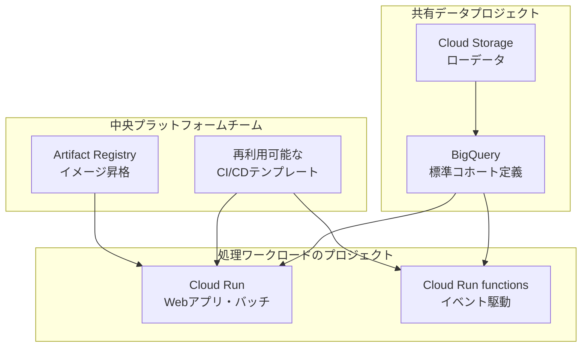

*この記事の全体像。以下、順に解説します。*

## この記事の対象と、読んで得られるもの

RAG や AI エージェントを導入したのに、出力の品質が安定しない。原因をモデル選定や検索アルゴリズムに求めても、改善が頭打ちになる。こうした状況は、**入力側のデータ契約が定義されていない**ことに起因する場合があります。

この記事では、世界最大級の広告代理店グループである WPP が Google Cloud 上に構築した共通データ基盤の事例を取り上げます。数百の傘下エージェンシーに分断されたデータを統合し、AI を単発のツールではなく組織横断のプラットフォームとして運用する設計です。

読者が持ち帰れるものは次の 3 点です。

- AI を「導入」でなく「運用」に載せるときの、基盤アーキテクチャの分割線
- データ品質を担保する共通語彙・所有権・リネージという 3 つのデータ契約
- 自組織で同じ構造を検討するときの、判断基準と未解決の論点

なお本記事の一次情報は Google Cloud のブログ記事であり、後述する成果指標は WPP の自己申告値です。前提として扱ってください。

## 全体像 - 何を分けて、何を共通化したか

WPP の設計を一言でいえば、**データは中央へ寄せ、処理は各チームへ配る**という分割です。

要点は 2 つあります。

- **ストレージとコンピュートの分離**: Cloud Storage と BigQuery を専用の共有データプロジェクトに集約し、処理を走らせるプロジェクトと明確に分ける。これにより単一の信頼できる情報源 (SSOT) が保たれる
- **プラットフォームの提供**: 中央チームが CI/CD テンプレートとセキュリティ統制を用意し、各開発チームはインフラ構築ではなくアプリケーションに集中する

この 2 つが揃うと、「AI が読むデータはどこにあり、誰が責任を持つか」が構造として答えられるようになります。逆にこれが無い組織では、AI の出力品質の議論が毎回モデルの話に流れます。

## データ側の設計 - 共通語彙とリネージ

### 標準コホート定義 (SCDs) への正規化

WPP はローデータを、5 つのキーに基づく標準コホート定義 (Standard Cohort Definitions) に変換しています。

| キー | 例 |
|---|---|
| 年齢 | 25-34 |
| 性別 | 指定なし・男性・女性 |
| 地域 | 国・都市単位 |
| 製品 | 取り扱いカテゴリ |
| 関心 | 興味関心セグメント |

狙いは、**共有識別子に依存せずにグローバルなデータ結合を可能にする**ことです。国ごと・エージェンシーごとに ID 体系が異なっていても、正規化された軸の上でなら突き合わせられます。

マーケティングの概念は流動的で、「若年層」や「関心が高い」の定義は時期や部門で揺れます。そこを継続的に正規化し続ける層を挟むのが、この設計の本質です。

### 型安全な処理エンジンによるリネージ

処理エンジンは型安全な Scala で構築され、すべてのデータポイントを発生源まで追跡できるようになっています。

AI の推論結果を後から監査するには、「どのデータに基づいてその判断がなされたか」を遡れる必要があります。リネージが無い基盤では、誤った出力が出たときに原因がモデルなのか入力なのか切り分けられません。

## プラットフォーム側の設計 - 認知的負荷とセキュリティ

### 再利用可能なテンプレートで認知的負荷を下げる

中央チームが GitLab CI/CD のテンプレートを用途別に提供しています。

- Cloud Run 向けの Web アプリケーション / バッチ処理
- Cloud Run functions 向けのイベント駆動型処理

各チームがパイプラインを一から書かずに済むため、インフラの学習コストが下がります。プラットフォームエンジニアリングの言葉でいう「認知的負荷の低減」です。

### イミュータブルデプロイとゼロトラスト

- **Build once, deploy many**: Artifact Registry を介し、コンテナイメージを再ビルドせずに環境間で昇格させる (zero-rebuild promotion)。検証した成果物と本番の成果物が同一であることを保証する
- **プッシュ前スキャン**: CI/CD パイプラインに Wiz によるスキャンを組み込む
- **ゼロトラストアクセス**: Identity-Aware Proxy (IAP) によるアクセス制御を強制する

### 見る指標をデプロイ頻度から SLO へ

運用の観測対象も移行しています。

| 従来 | 移行後 |
|---|---|
| デプロイ頻度 | レイテンシ p50 / p95 / p99 |
| | 4xx / 5xx エラー率 |
| | コンテナ起動時間 |

デプロイ頻度は開発チームの活動量を示しますが、利用者の体験は示しません。プラットフォームとして提供する以上、見るべきは提供品質だという判断です。

## 現場で使える示唆 - モデル選定より先のデータ契約

RAG や自律型エージェントの出力品質は、検索アルゴリズム以上に入力データの信頼性に依存します。WPP の事例から取り出せる契約は 3 つです。

### 1. データプロダクトの所有権とアクセス権

WPP は Cloud Storage バケットおよび BigQuery データセットのレベルで、きめ細かい IAM 制御を行っています。

AI が読み込むデータの権限と境界を先に決めることが、セキュアな AI 運用の第一歩です。「とりあえず全部インデックスする」構成は、権限を持たない利用者へ情報が漏れる経路をそのまま作ります。

判断基準としては、次を先に答えられるかを確認します。

- そのデータセットの所有者は誰か
- AI エージェントはどの権限で読むのか
- 利用者ごとに見えてよい範囲は分かれるのか

### 2. 共通語彙の確立

部門ごとに意味が異なるデータをそのまま RAG に投入すると、ハルシネーションの温床になります。「アクティブユーザー」の定義が 3 部門で違えば、検索結果は矛盾したまま LLM に渡ります。

事前に正規化された共通語彙の層を通すことで、文脈品質が上がります。WPP における SCDs がこの層にあたります。

### 3. リネージ (来歴) の保証

出力を監査可能にするには、遡れる基盤が要ります。WPP では Scala の処理エンジンと Knowledge Catalog がその役割を担っています。

自組織で導入するなら、少なくとも「回答に使ったチャンクの出典ドキュメントと更新日時」を応答に紐付けて保存するところから始められます。

## ビジネス成果と、外から観測できない論点

WPP はこの基盤により、次の成果を報告しています。

| 指標 | 内容 |
|---|---|
| クリエイティブ・戦略策定の所要時間 | 4 週間 → 3 時間 |
| 生産性 | 70% 向上 |
| キャンペーン ROI | 2.8 倍 |

いずれも WPP の自己申告値 (2026-08 時点) であり、算出方法や比較対象は公開されていません。導入判断の根拠として使うのではなく、方向性の参考値として扱うのが妥当です。

外部から観測できない未解決の問いも残ります。

- 流動的なマーケティング概念をシステムとして「継続的に正規化」する、具体的なデータガバナンスの運用体制
- Apache Spark や Kubeflow を含む重厚なカスタムパイプラインを維持するための、組織的なコストオーバーヘッド

とくに 2 点目は、規模の小さい組織がこの構成をそのまま真似すべきかの分岐点になります。WPP は数百のエージェンシーを抱えるからこそ中央集約の投資が回収できます。単一事業部で同じ構成を敷けば、維持コストが便益を上回る可能性があります。

## まとめ

- WPP の設計は「データは中央の共有プロジェクトへ、処理は各チームへ」という分割で成り立つ
- AI の出力品質を左右するのは、所有権とアクセス権・共通語彙・リネージという 3 つのデータ契約
- 運用指標はデプロイ頻度ではなく、レイテンシとエラー率という提供品質側へ移す
- 公表された成果指標は自己申告値であり、算出方法は非公開。方向性の参考として扱う
- 中央集約の投資が回収できるかは組織規模に依存する。構成をそのまま移植しない

AI の導入を検討するとき、最初に問うべきは「どのモデルを使うか」ではなく「AI に読ませるデータの所有者・語彙・来歴が定義されているか」です。ここが空白のままでは、モデルを差し替えても品質は安定しません。

この記事が少しでも参考になった、あるいは改善点などがあれば、ぜひリアクションやコメント、SNSでのシェアをいただけると励みになります！

## 参考リンク

- Google Cloud Blog. "How WPP operationalizes platform and data engineering for AI marketing" (2026-08-11 参照) - https://cloud.google.com/blog/products/media-entertainment/how-wpp-operationalizes-platform-and-data-engineering-for-ai-marketing/
