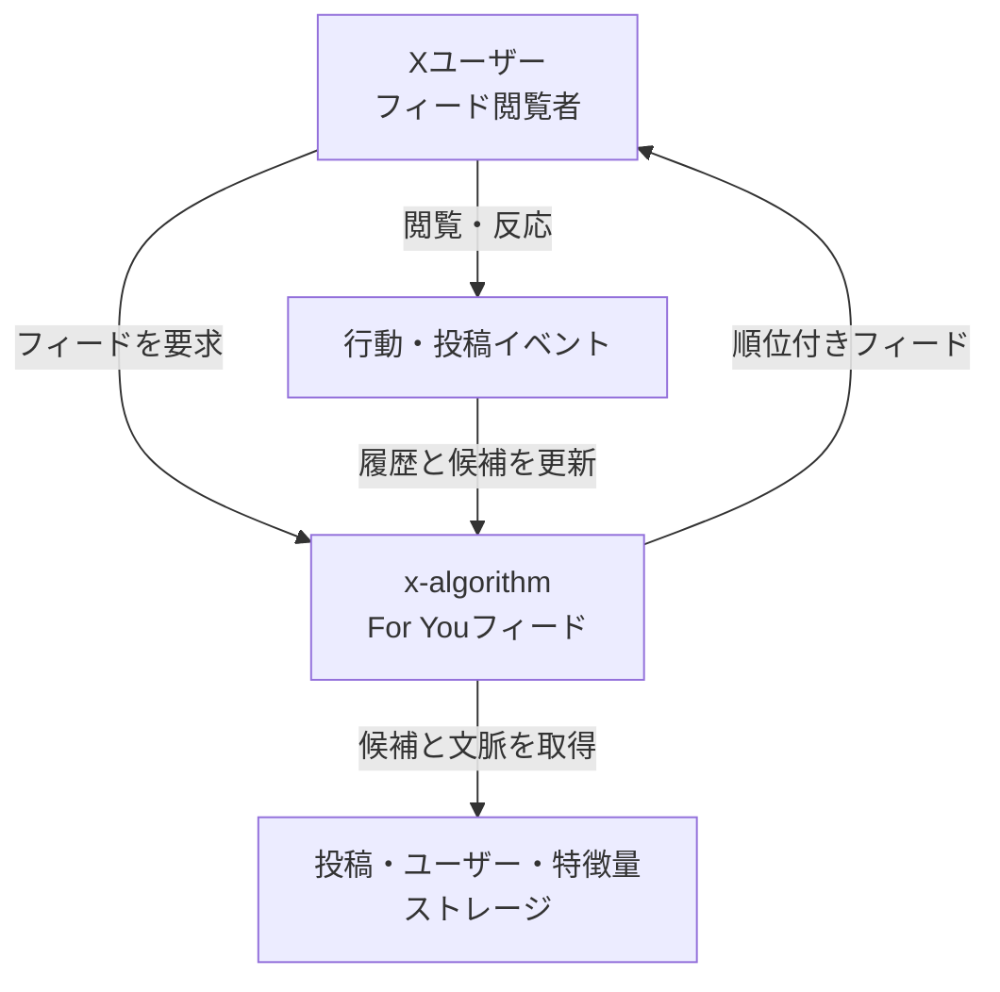
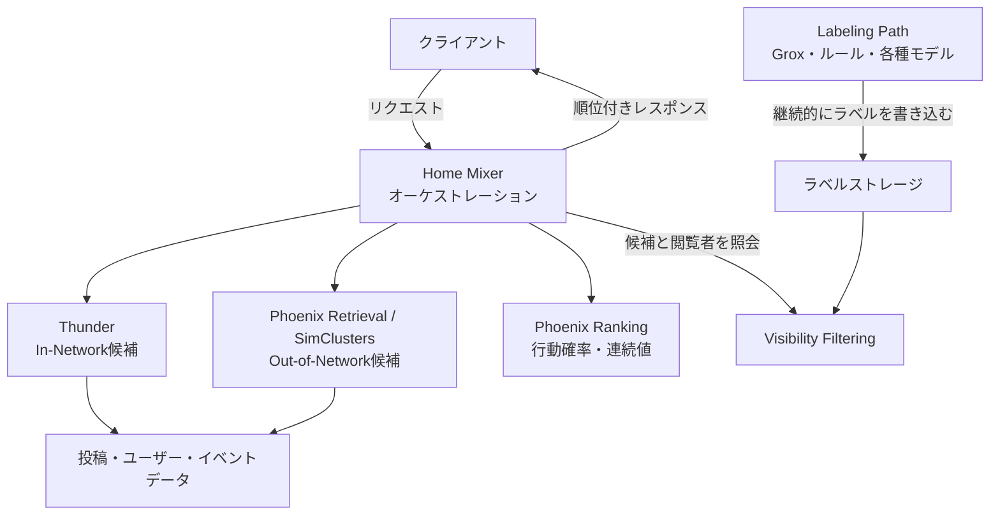
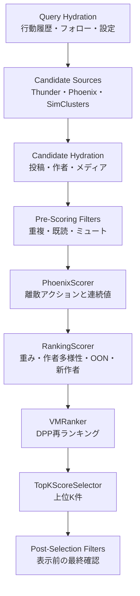
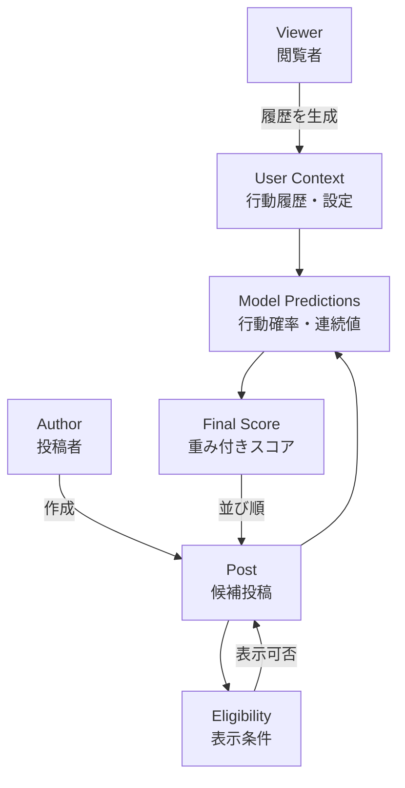
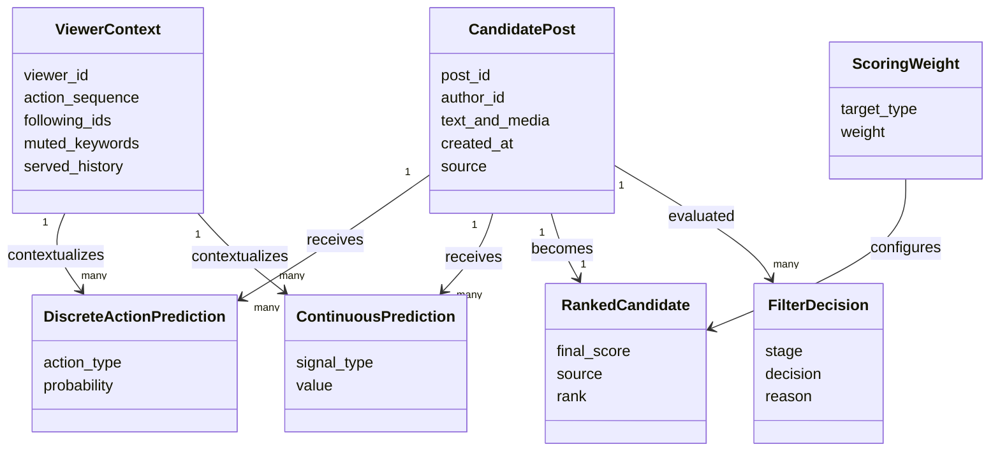

X（旧Twitter）の「おすすめ」フィードは、フォロー中の投稿を時系列に並べるだけではありません。公開リポジトリの `x-algorithm` では、フォロー中の投稿と機械学習で見つけたフォロー外の投稿を集め、ユーザー文脈を付与し、複数アクションの予測値から順位を決め、表示前のフィルタリングまで行う流れが示されています。

この記事では、公開コードから読み取れる推薦パイプラインの構造とデータを整理します。さらに、Phoenixの合成データを使った学習・推論手順、設定値を変更するときの見方、問題が起きたときの切り分け方まで解説します。

なお、公開リポジトリは本番環境そのものではありません。PhoenixのQuickstartにも、本番データ、チェックポイント、オーケストレーション、プロダクション規模の構成は含まれないと明記されています。以下では、公開されている範囲と概念上の全体像を区別して扱います。

この記事の具体的な型、既定値、コマンドは、2026年8月13日のcommit [`a389166`](https://github.com/xai-org/x-algorithm/commit/a389166f6cf5da70a286b568c87695d4dcdce3a1) で検証しています。


*この記事の全体像。以下、順に解説します。*

## 概要

`x-algorithm` は、Xの「For You」フィードを構成するコア推薦システムの公開実装です。大きく見ると、候補は次の2系統から入ります。

- **In-Network**: フォロー中アカウントの最近の投稿を、Thunderから取得
- **Out-of-Network**: Phoenix RetrievalとSimClustersが、フォロー外の投稿を取得

Home Mixerは、両者を同じ候補パイプラインへ流します。候補に投稿・作者・メディアなどの情報を付与し、重複、古い投稿、ブロック・ミュート対象などを除外します。その後、Phoenix Rankingが各候補に対する離散アクションの確率と連続値を予測し、RankingScorerがスコアへまとめ、作者の多様性などを加味して上位を選びます。

次の表は、フィード全体ではなくオーガニック投稿の候補取得と並び順を比較したものです。FollowingにもHydration、Visibility Filtering、非投稿アイテムの混合、配信履歴の更新があります。

| 観点 | For Youのオーガニック投稿 | Followingのオーガニック投稿 |
|---|---|---|
| 候補 | フォロー内 + フォロー外 | 主にフォロー内 |
| 順序 | 行動予測の重み付きスコア | 投稿日時 |
| 文脈 | 閲覧者の行動履歴や設定 | フォロー関係が中心 |
| 特徴 | 機械学習スコアと補正で選択 | 逆時系列を軸に選択 |
| 目的 | 関連性と健全性を両立した推薦 | 新着投稿の把握 |

ここで重要なのは、Phoenixが「好きそうか」という単一値だけを直接出すのではないことです。favorite、reply、repost、clickといったポジティブ行動だけでなく、not interested、block、mute、reportなどのネガティブ行動も個別に予測します。さらにdwell timeなどの連続値を出す回帰ヘッドもあります。コード既定のWeightedモードにおけるベース値を単純化すると、次の形です。

```text
weighted_base_score = Σ(weight[action] × probability[action])
                    + Σ(weight[signal] × predicted_value[signal])
```

実装では、この値を`offset_score`で変換してから、新作者ブースト、作者多様性、OON補正、VMRankerを適用した値が最終順位へ使われます。さらに`ValueModelMode`を切り替えると、単純な加重和ではなく、候補集合内の平均との差とdwellを使う`dwell_regret_sigmoid`系の計算も選べます。この分離により、モデル出力とプロダクト上の価値判断を別々に扱えます。

## 特徴

公開実装から読み取れる設計上の特徴は、次の5点です。

1. **複数アクションと連続値を別々に予測する**  
   いいね、返信、リポスト、クリック、フォロー、ブロックなどの離散アクションは確率として予測します。`dwell`や`not_dwelled`の分類値とは別に、`dwell_time`や`click_dwell_time`などは連続値として予測し、それぞれに対応する重みで統合します。

2. **ランキング候補を相互に独立させる**  
   PhoenixのTransformerでは、候補投稿同士がAttentionで参照し合わず、ユーザーの行動履歴を中心に参照するマスクを使います。同じ投稿のスコアが、同じバッチに入った別の候補によって揺れにくい設計です。

3. **ハッシュベースのEmbeddingとSemantic IDを使う**  
   RetrievalとRankingの双方で、複数ハッシュによるEmbedding Lookupを使います。現在のPhoenixはさらに、投稿のマルチモーダルEmbeddingをResidual QuantizationしたSemantic IDを入力し、未知の投稿にも内容の近さを反映します。

4. **推薦処理をステージへ分割する**  
   `candidate-pipeline` は、`Source`、`Hydrator`、`Filter`、`Scorer`、`Selector`、`SideEffect` といった責務をTraitとして分離します。独立したSourceやHydratorは並列実行でき、追加や差し替えの境界も明確です。

5. **順位付けと表示可否を分ける**  
   高い推薦スコアを得た投稿でも、そのまま表示されるとは限りません。投稿データの不備や安全性条件など、ランキングとは異なる判断軸を後段のフィルタで適用します。

リリース間の違いにも注意が必要です。旧公開版にはGrok-1から移植したデモモデルがありましたが、2026年8月版のPhoenixは、フィード用モデルの学習・Servingコードへ置き換えられました。入力前のfeature-prepではSemantic IDに加え、タイムゾーン、時刻、投稿経過時間、国、言語、年齢層、インストール済みアプリなどの文脈・プロフィール特徴も扱います。旧版の説明を現行モデルへそのまま当てはめることはできません。

## 構造

推薦システムを理解するときは、モデル単体ではなく、リクエストを受けてからレスポンスを返すまでの境界を見る必要があります。ここでは、システム、コンテナ、コンポーネントの3段階で整理します。

### システムコンテキスト図



ユーザーはフィードを要求する主体であると同時に、次回以降の推薦に使われる行動イベントの発生源でもあります。システムは投稿候補とユーザー文脈を取得し、順位付きの投稿列を返します。

公開リポジトリは、この境界の内側にある推薦ロジックを中心に示します。X本番環境の全ストレージ、Kafka構成、デプロイ基盤、ポリシー運用が公開されているわけではないため、ローカルで動かせる範囲と本番全体を同一視しないことが大切です。

### コンテナ図



主要ディレクトリの役割は次のとおりです。

| ディレクトリ | 役割 |
|---|---|
| `home-mixer/` | リクエスト受付、Hydration、候補統合、フィルタ、スコアリング、選択 |
| `thunder/` | 最近の投稿イベントを保持し、フォロー内候補を高速に返す |
| `phoenix/` | Two-Tower型RetrievalとTransformer型Ranking |
| `simclusters/` | クラスタ類似度からフォロー外候補を取得 |
| `candidate-pipeline/` | 推薦処理を組み立てる再利用可能なRustフレームワーク |
| `grox/` | スパム検知や投稿カテゴリ分類などのコンテンツ理解処理 |
| `visibility-filtering/` | 閲覧者の設定とラベルからAllow、Interstitial、Dropを判定 |
| `vm-ranker/` | DPPを使い、選択候補を再ランキング |

Home Mixerはリクエストパスの最上位にいる調整役です。候補の取得元が増えても、Sourceとしてパイプラインへ追加できるよう設計されています。一方、GroxやルールエンジンなどのLabeling Pathは継続的に動き、リクエストパスの外でラベルを書き込みます。Visibility Filteringはそのラベルと閲覧者のブロック・ミュートなどを読み、Home Mixerの後段フィルタへ判定を返します。

### コンポーネント図



処理順序には意味があります。Hydrationに失敗した候補や、明らかに対象外の候補を先に除外すれば、高価なモデル推論へ渡す件数を抑えられます。一方、Visibilityや会話単位の重複除外のように、選択後の候補列を見て判断する処理は後段に置かれます。

候補取得とランキングも別モデルです。Phoenix RetrievalはUser TowerとCandidate TowerのEmbedding類似度から候補を絞り、SimClustersはクラスタ類似度から別系統の候補を追加します。Phoenix Rankingはユーザーの行動シーケンスと各候補を入力にして、離散アクションの確率と連続値を出します。大規模な候補集合に高価なRankingを直接適用せず、段階的に絞り込む推薦システムの定石です。

## データ

コードを読むときに混同しやすいのが、ドメイン上の概念、Home Mixer内部のRust型、PhoenixのTensor、gRPCのメッセージです。以下の図は公開APIの厳密なレスポンススキーマではなく、パイプラインを理解するための概念モデルです。

### 概念モデル



中心にあるのは「閲覧者と候補投稿の組み合わせ」です。同じ投稿でも、閲覧者の行動履歴が異なれば予測確率は変わります。さらに、予測確率が同じでも、重み設定が変われば最終スコアが変わります。表示条件はスコアとは別に判定されます。

この分離により、デバッグ時に次の3層を切り分けられます。

- 候補集合に投稿が入っていたか
- モデルがどの行動確率・連続予測値を出したか
- 重み・補正・フィルタのどこで順位や表示可否が変わったか

### 情報モデル



このクラス図も概念表現です。実装では、候補はパイプラインの各ステージで別の型や付加情報を持ち、Phoenix内部ではToken列やTensorへ変換されます。

| 概念 | 主な内容 | デバッグ時の確認点 |
|---|---|---|
| ViewerContext | 行動シーケンス、フォロー、ミュート、配信履歴 | 欠落や古さ、対象ユーザーとの一致 |
| CandidatePost | 投稿ID、作者、本文・メディア、取得元 | Source別の件数、Hydration成功率 |
| DiscreteActionPrediction | 離散アクション種別ごとの確率 | 値域、NaN、モデル版、候補との対応 |
| ContinuousPrediction | dwell timeなどの連続予測値 | 単位、分布、外れ値、候補との対応 |
| ScoringWeight | 予測値をスコアへ写す設定値 | 実験設定、既定値との差、適用対象 |
| RankedCandidate | 最終スコア、順位、取得元 | 重み適用前後、補正前後の差 |
| FilterDecision | ステージ、判定、理由 | Pre/Postのどちらで落ちたか |

gRPCの実レスポンスや内部構造を利用するコードを書く場合は、概念図からフィールド名を推測せず、該当するProtoとRust/Python実装を確認してください。Home Mixerには、Post Pipelineの順位付き投稿を `ScoredPostsResponse { scored_posts }` として返す `ScoredPostsService` と、Blending Pipelineで広告、Who to Follow、Promptなどを混ぜた `ForYouFeedResponse { items }` を返す `ForYouFeedService` があります。これらはProtobuf/gRPC上のレスポンス構造です。URT版は `ForYouFeedUrtResponse { urt: bytes }` を返し、`urt`フィールド内にThriftのTimelineResponseをバイナリ形式で格納します。Phoenix単体のQuickstartとも実行境界が異なります。

## 構築方法

PhoenixのQuickstartは、合成データを使ってRankingとRetrievalの経路を確認するための手順です。品質の高い推薦モデルを構築する手順ではなく、学習、チェックポイント、復元、サービング、retrieve → rankの接続確認を目的としています。

前提は次のとおりです。

- NVIDIA GPUとCUDA 12を備えたLinux
- Python 3.11以上と`uv`
- Rustツールチェーン
- `protoc` 3.15以上
- C/C++ツールチェーン、CMake、`pkg-config`
- RDMA verbs、`libclang`、`libnuma`などの開発パッケージ

リポジトリを取得し、`phoenix` へ移動して依存関係を準備します。

```bash
git clone https://github.com/xai-org/x-algorithm.git
cd x-algorithm
git checkout a389166f6cf5da70a286b568c87695d4dcdce3a1
cd phoenix
```

上の例でcommitを固定した後、Debian/Ubuntuではシステムパッケージを準備します。

```bash
apt update
apt install build-essential cmake pkg-config unzip \
  libibverbs-dev libnl-3-dev libnl-route-3-dev \
  libclang-dev libnuma-dev

uv sync --extra engine
export PYTHONPATH="$PWD"
```

Ubuntu 22.04標準の`protobuf-compiler`は3.12で、Proto3の`optional`に必要な3.15以上を満たしません。公式releaseの新しい`protoc`を導入し、`protoc --version`を確認してください。現行commitで別途取得するGit LFS artifactはありません。

最初のモデル実行ではJAXのコンパイルに時間がかかる場合があります。まずランダムな重みでRankingのスモークテストを行います。

```bash
uv run python xrex/inference/oss_bench/bench.py \
  --smoke \
  --service_type ranking
```

続いて、決定論的な合成データを生成します。同じseedなら同じデータを得られるため、手順の再現性を確認しやすくなります。

```bash
uv run python reference/world_snapshots.py \
  --out ./synth_index \
  --seed 20260721

export PHOENIX_INDEX_BASE=./synth_index

uv run python reference/dump_gen.py \
  --out ./synth_dump \
  --seed 20260721 \
  --num-rows 12288 \
  --partitions 4 \
  --rows-per-file 1024 \
  --sid ./synth_index/sid_snapshot/post_sid_v5_256x6.parquet \
  --self-check
```

Quickstartのコマンドはリポジトリ更新で変わる可能性があります。実行時には、記事のコマンドを固定的に信頼するのではなく、使用するcommitの `phoenix/QUICKSTART.md` と照合してください。

## 利用方法

合成データを使い、Rankingモデルを6ステップだけ学習します。

```bash
uv run python reference/train_synth.py \
  --data ./synth_dump \
  --steps 6 \
  --out "$PWD/checkpoints" \
  --metrics
```

これはモデル品質を評価する学習量ではありません。データ読み込み、勾配更新、メトリクス記録、チェックポイント保存が一通り動くことを確認するための短い実行です。

チェックポイントからRankingの単体経路を確認する例は次のとおりです。

```bash
RANK_CKPT=$(find \
  "$PWD/checkpoints/home_direct_packed_nano_offline_kafka_dump" \
  -mindepth 2 -maxdepth 2 -type d | sort | tail -1)

uv run python xrex/inference/oss_bench/bench.py \
  --checkpoint_path "$RANK_CKPT" \
  --service_type ranking \
  --config_name home_direct_packed_nano_offline_kafka_dump
```

`bench.py` はgRPCサーバーを起動して合成リクエストを1件送り、その後サーバーを停止します。次のフルループで使う常駐Rankingサーバーではありません。

同じ合成ダンプでRetrievalモデルも学習します。

```bash
uv run python reference/train_synth.py \
  --config xrecsys_two_tower_nano_offline_kafka_dump \
  --data ./synth_dump \
  --steps 6 \
  --out "$PWD/checkpoints"
```

retrieve → rankを実行するには、SIDサービス、Retrievalサーバー、Rankingサーバーの3つを起動しておきます。次はQuickstartと同じく、1台のGPUで確認するための設定です。

```bash
RANK_CKPT=$(ls -d "$PWD"/checkpoints/home_direct_packed_nano_offline_kafka_dump/elapsed_samples_*/*/ | sort | tail -1)
RETR_CKPT=$(ls -d "$PWD"/checkpoints/xrecsys_two_tower_nano_offline_kafka_dump/elapsed_samples_*/*/ | sort | tail -1)

uv run python reference/sid_index_server.py \
  --parquet ./synth_index/sid_snapshot/post_sid_v5_256x6.parquet \
  --port 50061 &

XLA_PYTHON_CLIENT_MEM_FRACTION=0.30 uv run python xrex/inference/launch_inference.py \
  --driver local --service_type retrieval \
  --config_name xrecsys_two_tower_nano_offline_kafka_dump \
  --checkpoint_path "$RETR_CKPT" --grpc_port 9990 \
  --sid_endpoint localhost:50061 \
  --num_devices_per_process 1 --bs_per_device 1 \
  --history_seq_len 128 --candidate_seq_len 8 \
  --max_inflight_requests 16 --allow_random_init false --fake_mm_embeddings true \
  attn_impl=pallas_ranker_attn use_seqpack=False right_anchored_rope=True \
  ep=1 dp=1 training_ep=1 &

XLA_PYTHON_CLIENT_MEM_FRACTION=0.30 uv run python xrex/inference/launch_inference.py \
  --driver local --service_type ranking \
  --config_name home_direct_packed_nano_offline_kafka_dump \
  --checkpoint_path "$RANK_CKPT" --grpc_port 9988 --metrics_port 9091 \
  --num_devices_per_process 1 --bs_per_device 1 \
  --history_seq_len 128 --candidate_seq_len 16 \
  --max_inflight_requests 16 --allow_random_init false --fake_mm_embeddings true \
  attn_impl=pallas_ranker_attn_infer use_seqpack=False right_anchored_rope=True \
  ep=1 dp=1 training_ep=1 \
  model_config.model_config.sequence_len=146 &
```

両モデルサーバーのログに `Server ready to serve` と出た後、3セッション分のretrieve → rankを確認します。

```bash
uv run python reference/retrieve_then_rank.py \
  --data ./synth_dump \
  --sessions 3 \
  --topk 16 \
  --retrieval-port 9990 \
  --ranking-port 9988
```

成功時は `retrieve_then_rank: 3 session(s) completed the full loop.` と表示されます。実行後はバックグラウンドの3サービスを終了してください。

Home Mixer側の挙動は、`home-mixer/params/param.rs` に宣言されたパラメータから追えます。たとえば、公開コードではPhoenix Sourceの有効化、favoriteとreplyの重み、作者多様性の減衰、ネットワーク外の補正が次のように定義されています。

```rust
param!(
    EnablePhoenixSource,
    bool,
    "rust_home_mixer_enable_phoenix_source",
    true
);
param!(FavoriteWeight, f64, "rust_home_mixer_favorite_weight", 0.5);
param!(ReplyWeight, f64, "rust_home_mixer_reply_weight", 5.0);
param!(
    AuthorDiversityDecay,
    f64,
    "rust_home_mixer_author_diversity_decay",
    0.5
);
param!(
    OonWeightFactor,
    f64,
    "rust_home_mixer_oon_weight_factor",
    0.75
);
```

これらはコード上のデフォルト値です。本番で実際に使われる値と一致するとは限りません。設定システムから上書きされる前提があるため、「公開コードの数値 = 現在のXの配信係数」と断定しないでください。

## 運用

推薦パイプラインの運用では、モデルの平均精度だけでなく、各ステージの件数と遅延を継続的に観測する必要があります。最低限、次のようなファネルをSource別に追える状態が望まれます。

| ステージ | 主なメトリクス | 異常から疑う箇所 |
|---|---|---|
| Candidate Source | 取得数、空レスポンス率、遅延 | Thunder、Phoenix Retrieval、SimClusters、依存サービス |
| Hydration | 成功率、欠落フィールド、遅延 | 投稿・作者・メディアの取得 |
| Pre-Scoring Filter | 理由別の除外数 | 年齢、重複、既読、ミュート、購読条件 |
| Phoenix Scorer | 推論遅延、失敗率、予測値分布 | モデル、特徴量、Tensor形状、GPU |
| Weighted / Diversity | 補正前後の順位変化 | 重み設定、作者多様性、OON補正 |
| Post-Selection | 理由別の除外数 | Visibility、会話重複、削除状態 |
| Response | 件数、総遅延、空フィード率 | 上流全体とフォールバック |

### パラメータ変更と実験

重みを変えるときは、最終KPIだけでなく、行動予測の分布とSource構成の変化も見ます。たとえばReplyWeightを上げると、返信されやすい投稿が上がる一方、会話性の強い特定カテゴリや作者へ露出が偏る可能性があります。

安全な変更手順は次のようになります。

1. 対象パラメータと期待する因果を1つに絞る
2. オフラインで再ランキングし、順位変化とガードレールを確認する
3. 小さなトラフィックでA/Bテストする
4. エンゲージメントだけでなく、ブロック・ミュート・報告も監視する
5. Source別・ユーザー群別の偏りを確認する
6. 変更値、期間、対象、ロールバック条件を記録する

### 学習の再開

合成データ学習は、同じ出力先を指定し、総ステップ数を増やすことで再開できます。

```bash
uv run python reference/train_synth.py \
  --data ./synth_dump \
  --steps 12 \
  --out "$PWD/checkpoints"
```

ログでは、チェックポイントの発見、Tensorの復元、チェックサム一致、データ位置の復元を確認します。合成ダンプは有限です。大きなstep数を指定する前に、必要な行数を生成し直してください。

### バージョンと再現性

運用検証の結果には、少なくともGit commit、PythonとRustのバージョン、CUDA/JAX環境、データseed、モデル設定、チェックポイントを記録します。`main` のコマンドだけを記録すると、後日の更新で再現できなくなるためです。

また、公開実装で確認できるのはコード上の振る舞いです。X本番環境の現在値、実験割り当て、非公開モデル、データ分布まで推測できるわけではありません。外部説明では、確認できた事実と推論を分けます。

## ベストプラクティス

### 候補取得・ランキング・表示条件を別々に観測する

「投稿が出なかった」という事象だけでは原因を特定できません。そもそも候補へ入らなかったのか、スコアが低かったのか、最終フィルタで除外されたのかを、候補IDに沿って追跡できるようにします。

### 作者の多様性をスコア後に確保する

高スコア順だけで並べると、同じ作者の投稿が複数入ることがあります。公開コードには `AuthorDiversityDecay` と `AuthorDiversityFloor` があり、スコア順に候補を走査し、同一作者の2件目以降を出現回数に応じて減衰させます。隣接した投稿だけを対象にする仕組みではありません。関連性と一覧全体の多様性は別の目的として扱います。

### Out-of-Networkを明示的に補正する

フォロー外投稿は発見性を高めますが、ユーザーが明示的に選んだ関係ではありません。`OonWeightFactor` やTopics向けの補正をSource情報とともに適用し、フォロー内との混合比率を観測します。

### ネガティブ行動をガードレールにする

クリックや滞在時間だけを最適化すると、刺激が強い投稿を過大評価するおそれがあります。block、mute、report、not interestedなどを別ヘッドで予測し、負の重みや実験停止条件へ反映します。離散アクションの確率と滞在時間などの回帰値は、メトリクス上も分けて監視します。

### 設定値とモデル版を一緒に記録する

最終順位はモデルだけで決まりません。同じ予測値でも、重み、減衰、Source補正が違えば結果が変わります。オンラインログにはモデル版と設定スナップショットの識別子を残し、再ランキングできるようにします。

### 合成データの成功を品質保証とみなさない

Quickstartが成功して確認できるのは、主に実行経路の健全性です。実データ上の関連性、公平性、安全性、ドリフト、負荷耐性は別途評価が必要です。

## トラブルシューティング

### 候補数がゼロ、または急減した

まずThunder、Phoenix Retrieval、SimClustersを分けて件数を確認します。全SourceがゼロならQuery Hydrationや共通依存を、1系統だけなら該当Sourceを疑います。候補取得後に減っている場合は、理由別のFilterカウンターを見ます。

### 高スコアの投稿がレスポンスにない

スコアだけでなく、Selection後のフィルタと会話重複処理を確認します。削除、スパム、安全性条件、同一会話の重複などにより、上位候補が表示前に除外されることがあります。

### Phoenixの初回実行が遅い

初回はJAXのコンパイルが走るため、定常時より時間がかかります。コンパイル時間と推論時間を分けて計測し、2回目以降の値と比較します。GPU、CUDA、JAXの互換性もQuickstartの前提と照合します。

### 学習の再開後に進まない

ログでチェックポイントとデータ位置が復元されたかを確認します。合成ダンプを読み切っている場合は、`dump_gen.py` で行数を増やした新しいデータを生成します。出力先だけを変えると再開ではなく新規学習になる点にも注意してください。

### 設定変更が挙動へ反映されない

`param.rs` のデフォルト変更だけを見ず、実行環境の設定システムが同名キーを上書きしていないか確認します。変更対象のプロセスが新しい設定を読み込んだか、実験クラスタが意図したユーザーへ割り当てられたかも確認します。

### Mermaidや概念図とコードが一致しない

図は責務とデータの流れをつかむための抽象化です。実装判断では、使用するcommitのREADME、Proto、Trait実装、パラメータ宣言を正とします。特に概念モデルのフィールド名を、そのままgRPCやJSONの実フィールドとして使わないでください。

## まとめ

`x-algorithm` の核心は、巨大な単一モデルではなく、候補取得、Hydration、事前フィルタ、複数アクション予測、重み付きスコア、多様性補正、選択後フィルタを組み合わせたパイプラインにあります。

読み解くときは、次の3点を押さえると全体を見失いません。

- Thunderがフォロー内、Phoenix RetrievalとSimClustersがフォロー外の候補集合を作る
- Phoenix Rankingは候補ごとの離散アクション確率と連続値を予測し、設定可能な重みで統合する
- 候補に入らない、順位が低い、表示前に落ちる、という3種類の非表示理由を分けて観測する

Quickstartでは合成データを使って学習からretrieve → rankまで確認できます。ただし、成功が意味するのは公開された実行経路の動作確認です。本番品質や現在のXの設定値を示すものではありません。この境界を守ることで、公開コードを実装学習と設計判断の両方に活用できます。

この記事が少しでも参考になった、あるいは改善点などがあれば、ぜひリアクションやコメント、SNSでのシェアをいただけると励みになります！

## 参考リンク

- [x-algorithm リポジトリ](https://github.com/xai-org/x-algorithm)
- [X For You Feed Algorithm README（検証commit）](https://github.com/xai-org/x-algorithm/blob/a389166f6cf5da70a286b568c87695d4dcdce3a1/README.md)
- [Phoenix README（検証commit）](https://github.com/xai-org/x-algorithm/blob/a389166f6cf5da70a286b568c87695d4dcdce3a1/phoenix/README.md)
- [Phoenix Quickstart（検証commit）](https://github.com/xai-org/x-algorithm/blob/a389166f6cf5da70a286b568c87695d4dcdce3a1/phoenix/QUICKSTART.md)
- [Home Mixer](https://github.com/xai-org/x-algorithm/tree/a389166f6cf5da70a286b568c87695d4dcdce3a1/home-mixer)
- [Home Mixer Parameters](https://github.com/xai-org/x-algorithm/blob/a389166f6cf5da70a286b568c87695d4dcdce3a1/home-mixer/params/param.rs)
- [Candidate Pipeline](https://github.com/xai-org/x-algorithm/tree/a389166f6cf5da70a286b568c87695d4dcdce3a1/candidate-pipeline)
- [Thunder](https://github.com/xai-org/x-algorithm/tree/a389166f6cf5da70a286b568c87695d4dcdce3a1/thunder)
- [SimClusters](https://github.com/xai-org/x-algorithm/tree/a389166f6cf5da70a286b568c87695d4dcdce3a1/simclusters)
- [Grox](https://github.com/xai-org/x-algorithm/tree/a389166f6cf5da70a286b568c87695d4dcdce3a1/grox)
- [Visibility Filtering](https://github.com/xai-org/x-algorithm/tree/a389166f6cf5da70a286b568c87695d4dcdce3a1/visibility-filtering)
- [VM Ranker](https://github.com/xai-org/x-algorithm/tree/a389166f6cf5da70a286b568c87695d4dcdce3a1/vm-ranker)
