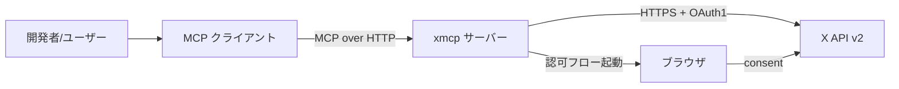
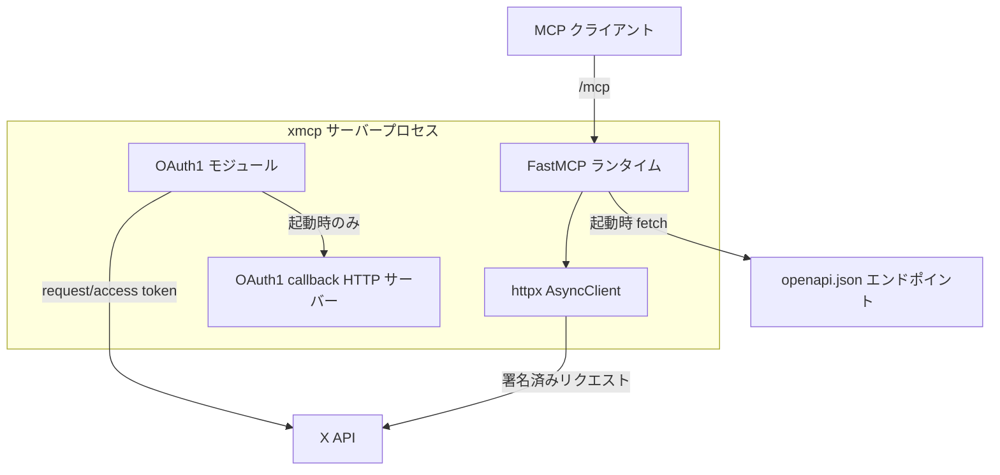
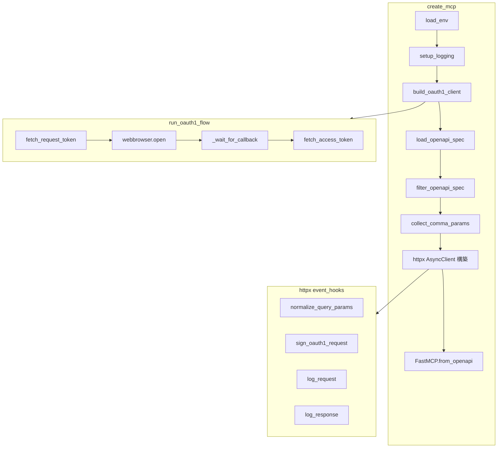
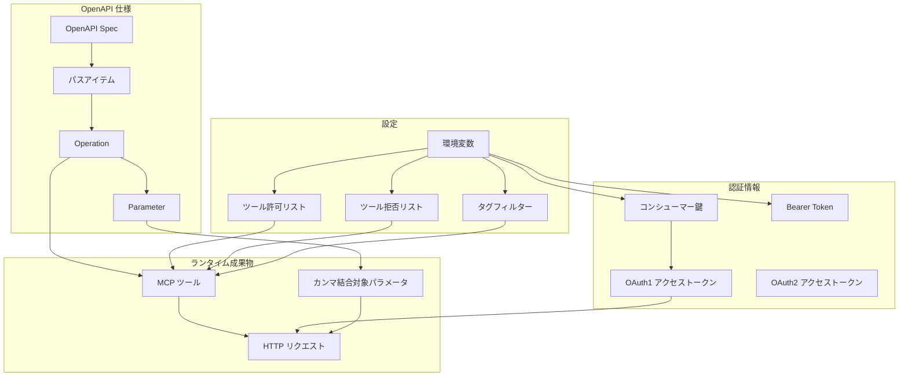
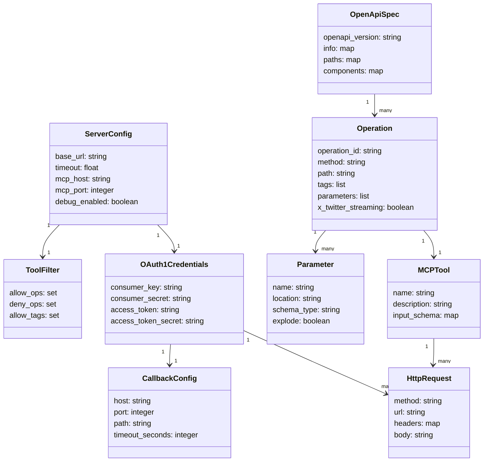

## 概要

xmcp は、X（旧 Twitter）の公式 OpenAPI 仕様を [FastMCP](https://github.com/jlowin/fastmcp) 経由で MCP（Model Context Protocol）ツールとして公開するローカルサーバーです。xdevplatform（X 社の開発者プラットフォーム公式アカウント）が公開し、LLM クライアント（Claude、Grok など）から X API を直接呼び出すための橋渡しを担います。

ユーザーは `python server.py` を起動するだけで、X API の約 110 種類のエンドポイントが MCP ツールとして自動登録され、`http://127.0.0.1:8000/mcp` 経由で利用できます。ストリーミング系と Webhook 系のエンドポイントは、MCP の同期リクエスト/レスポンスモデルに適さないため除外されます。

| 項目                 | 内容                                              |
| -------------------- | ------------------------------------------------- |
| 公式リポジトリ       | https://github.com/xdevplatform/xmcp              |
| 実装言語             | Python 3.9+                                       |
| ベースフレームワーク | FastMCP                                           |
| 前提 API             | X API v2（OpenAPI 3.0 spec）                      |
| トランスポート       | HTTP（MCP Streamable HTTP）                       |
| 認証方式             | OAuth1 ユーザーコンテキスト、Bearer Token、OAuth2 |

類似プロジェクトとの位置づけは次のとおりです。

| 名称                                | 提供元         | 目的                           | 実装方式                                 |
| ----------------------------------- | -------------- | ------------------------------ | ---------------------------------------- |
| **xdevplatform/xmcp**               | X 社公式       | X API の MCP 公開              | OpenAPI から FastMCP 自動生成            |
| basementstudio/xmcp                 | サードパーティ | MCP サーバー構築フレームワーク | TypeScript、ファイルシステムルーティング |
| modelcontextprotocol/typescript-sdk | Anthropic 公式 | MCP プロトコル実装 SDK         | 低レベル SDK                             |

本記事は前者（xdevplatform/xmcp）を調査対象とします。

## 特徴

- OpenAPI 駆動。X API v2 の `openapi.json` を起動時に取得し、operation を 1:1 で MCP ツールへ変換します。API の更新に追従しやすい設計です。
- ストリーミング除外。`/stream`・`/webhooks` を含むパスや `x-twitter-streaming: true` 属性を持つ operation は自動で除外されます。
- ツールフィルタリング。環境変数 `X_API_TOOL_ALLOWLIST`、`X_API_TOOL_DENYLIST`、`X_API_TOOL_TAGS` で、起動時にツール一覧を絞り込めます。
- OAuth1 ブラウザフロー。起動時に自動でブラウザを開き、ローカル HTTP サーバー（既定ポート 8976）で callback を受けてアクセストークンを取得します。
- トークンのメモリ保持。OAuth1 アクセストークンはサーバープロセスのライフタイム中のみメモリに保持し、ディスクに永続化しません。
- httpx event_hooks による署名注入。すべての X API リクエストは `sign_oauth1_request` フックで OAuth1 署名ヘッダーを付与します。
- クエリパラメータ正規化。OpenAPI 上で `explode: false` かつ `type: array` のクエリパラメータを、カンマ区切り文字列へ自動結合します。
- デバッグ支援。`X_API_DEBUG`、`X_OAUTH_PRINT_TOKENS`、`X_OAUTH_PRINT_AUTH_HEADER` でリクエスト、トークン、署名ヘッダーを出力できます。
- Grok テストクライアント同梱。`test_grok_mcp.py` で、xAI Grok から MCP 経由で X API を呼ぶ動作確認ができます。

## 構造

### システムコンテキスト図



| 要素名           | 説明                                            |
| ---------------- | ----------------------------------------------- |
| 開発者/ユーザー  | X API を LLM から操作したい利用者               |
| MCP クライアント | Claude Desktop、Grok など MCP 対応ホスト        |
| xmcp サーバー    | 本調査対象。ローカルで起動する FastMCP サーバー |
| X API v2         | X 社が提供する REST API エンドポイント群        |
| ブラウザ         | OAuth1 ユーザー同意画面の表示先                 |

### コンテナ図



| 要素名                        | 説明                                                    |
| ----------------------------- | ------------------------------------------------------- |
| FastMCP ランタイム            | `FastMCP.from_openapi` で生成する MCP サーバー本体      |
| httpx AsyncClient             | X API への非同期 HTTP クライアント                      |
| OAuth1 モジュール             | `run_oauth1_flow` や `build_oauth1_client` などの関数群 |
| OAuth1 callback HTTP サーバー | 起動時のみ一時的に立ち上がる `BaseHTTPRequestHandler`   |
| openapi.json エンドポイント   | `https://api.twitter.com/2/openapi.json`                |

### コンポーネント図



| 要素名                     | 説明                                                                 |
| -------------------------- | -------------------------------------------------------------------- |
| load_env                   | `.env` ファイルを python-dotenv で読み込み                           |
| setup_logging              | `X_API_DEBUG` に応じたロガー初期化                                   |
| build_oauth1_client        | OAuth1 フローを起動して `OAuth1Client` を返却                        |
| load_openapi_spec          | `https://api.twitter.com/2/openapi.json` の同期 GET                  |
| filter_openapi_spec        | ストリーミング除外と allowlist/denylist/tags 絞り込み                |
| collect_comma_params       | `explode: false` のクエリ配列パラメータ名を抽出                      |
| FastMCP.from_openapi       | OpenAPI spec と httpx クライアントから MCP ツール群を生成            |
| normalize_query_params     | カンマ結合対象パラメータを 1 つのキーに集約                          |
| sign_oauth1_request        | OAuth1 署名ヘッダーの生成とリクエストへの付与                        |
| log_request / log_response | デバッグログ出力。4xx/5xx 時にレスポンス本文と transaction id を記録 |
| fetch_request_token        | `api.x.com/oauth/request_token` から一時トークンを取得               |
| _wait_for_callback         | ローカル HTTP サーバーで `oauth_token` と `oauth_verifier` を受信    |
| fetch_access_token         | `api.x.com/oauth/access_token` からアクセストークンを取得            |

## データ

### 概念モデル



| 要素名                   | 説明                                                    |
| ------------------------ | ------------------------------------------------------- |
| 環境変数                 | `.env` または OS 環境から読み込む設定値の集合           |
| ツール許可/拒否リスト    | `X_API_TOOL_ALLOWLIST` と `X_API_TOOL_DENYLIST`         |
| タグフィルター           | `X_API_TOOL_TAGS` による OpenAPI タグでの絞り込み       |
| コンシューマー鍵         | X Developer App の Consumer Key と Secret               |
| Bearer Token             | アプリ認証用トークン                                    |
| OAuth1 アクセストークン  | ユーザーコンテキストでの API 呼び出し用トークン         |
| OpenAPI Spec             | 起動時に取得するルート文書                              |
| パスアイテム             | URL パスごとの HTTP メソッド集合                        |
| Operation                | メソッド単位の API 定義。`operationId` がツール名になる |
| Parameter                | Operation のクエリ、パス、ヘッダー、ボディパラメータ    |
| MCP ツール               | FastMCP が Operation から生成する呼び出し可能ユニット   |
| カンマ結合対象パラメータ | `explode: false` の配列型クエリパラメータ               |
| HTTP リクエスト          | X API へ送信する署名済みリクエスト                      |

### 情報モデル



| 要素名            | 説明                                                       |
| ----------------- | ---------------------------------------------------------- |
| ServerConfig      | 起動設定。X API ベース URL、タイムアウト、MCP バインド情報 |
| ToolFilter        | allowlist、denylist、tags の集合。起動時に 1 回だけ評価    |
| OAuth1Credentials | コンシューマー鍵とアクセストークン。メモリ上に保持         |
| CallbackConfig    | OAuth1 コールバック受信用の一時 HTTP サーバー設定          |
| OpenApiSpec       | `openapi.json` を辞書として保持                            |
| Operation         | HTTP メソッドとパスで特定する API 操作                     |
| Parameter         | Operation の入力パラメータ定義                             |
| MCPTool           | FastMCP が生成する MCP ツール表現                          |
| HttpRequest       | 署名とヘッダー付与後に X API へ送信するリクエスト          |

## 構築方法

### 前提条件

- Python 3.9 以上
- X Developer Platform のアプリ登録（Consumer Key/Secret、Bearer Token の発行）
- OAuth1 ユーザーコンテキスト利用時はブラウザが使える環境
- オプションで xAI API キー（Grok テストクライアント用）

### 依存パッケージ

`requirements.txt` に定義する依存は次のとおりです。

| パッケージ        | 用途                                                      |
| ----------------- | --------------------------------------------------------- |
| fastmcp           | MCP サーバー本体。`from_openapi` による OpenAPI の MCP 化 |
| httpx             | X API への非同期 HTTP クライアント                        |
| python-dotenv     | `.env` ファイルの読み込み                                 |
| requests-oauthlib | OAuth1 トークン取得フロー                                 |
| xai-sdk           | Grok テストクライアント用                                 |
| xdk               | X 開発者向けユーティリティ                                |

### インストール手順

```bash
git clone https://github.com/xdevplatform/xmcp.git
cd xmcp
python -m venv .venv
source .venv/bin/activate
pip install -r requirements.txt
```

### 環境変数の設定

`env.example` を `.env` にコピーして必須項目を記入します。

```bash
cp env.example .env
```

必須変数は次のとおりです。

| 変数名                  | 用途                                    |
| ----------------------- | --------------------------------------- |
| X_OAUTH_CONSUMER_KEY    | X App の Consumer Key                   |
| X_OAUTH_CONSUMER_SECRET | X App の Consumer Secret                |
| X_BEARER_TOKEN          | Bearer Token。OAuth1 利用時もセット必須 |

OAuth1 callback 用の既定値は次のとおりです。通常は変更不要です。

```bash
X_OAUTH_CALLBACK_HOST=127.0.0.1
X_OAUTH_CALLBACK_PORT=8976
X_OAUTH_CALLBACK_PATH=/oauth/callback
X_OAUTH_CALLBACK_TIMEOUT=300
```

### X Developer App へのコールバック登録

X Developer Portal のアプリ設定画面で、次の URL を Callback URI に登録します。

```
http://127.0.0.1:8976/oauth/callback
```

### 起動

```bash
python server.py
```

起動時にブラウザが開き、OAuth1 の同意画面が表示されます。承認するとローカルの callback サーバーがトークンを受け取り、FastMCP が OpenAPI spec を読み込んでツール一覧を標準出力に表示します。

MCP エンドポイントは既定で `http://127.0.0.1:8000/mcp` です。

## 利用方法

### 必須パラメータの扱い

X API の多くの operation は、`tweet.fields` や `user.fields` などの field selector パラメータを必須とします。xmcp ではこれらは OpenAPI spec 定義どおりに MCP ツールの入力スキーマへ露出するため、MCP クライアント側で明示的に指定する必要があります。

| 頻出必須パラメータ | 対象エンドポイント                                   |
| ------------------ | ---------------------------------------------------- |
| `tweet.fields`     | Posts 系（`getPostsById`、`searchPostsRecent` など） |
| `user.fields`      | Users 系（`getUsersByUsername`、`getUsersMe` など）  |
| `media.fields`     | Media 系                                             |
| `expansions`       | リレーション取得時に必要                             |

### MCP クライアントからの接続

- ローカルクライアント（Claude Desktop など）。`http://127.0.0.1:8000/mcp` を直接指定
- リモートクライアント（Grok など）。ngrok で公開してから公開 URL を指定

```bash
ngrok http 8000
# 出力された https://<id>.ngrok-free.dev/mcp を MCP_SERVER_URL に設定
```

### ツールのホワイトリスト

`X_API_TOOL_ALLOWLIST` にカンマ区切りで `operationId` を指定します。

```bash
X_API_TOOL_ALLOWLIST=getUsersByUsername,createPosts,searchPostsRecent
```

設定変更後はサーバーを再起動してください。フィルターは起動時の 1 回だけ評価されます。

### 代表的なツール呼び出し例

| ツール名                  | 用途                            |
| ------------------------- | ------------------------------- |
| getUsersMe                | 認証ユーザー自身の情報取得      |
| getUsersByUsername        | ユーザー名による 1 ユーザー取得 |
| searchPostsRecent         | 直近 7 日間の投稿検索           |
| createPosts               | ポスト作成。OAuth1 必須         |
| deletePosts               | ポスト削除                      |
| likePost / unlikePost     | いいね操作                      |
| followUser / unfollowUser | フォロー操作                    |
| getUsersBookmarks         | ブックマーク一覧                |
| getTrendsByWoeid          | 地域トレンド取得                |

全リスト（約 110 件）は README の "Available tool calls" を参照してください。

### OAuth2 ユーザートークンの生成

1. `.env` に `CLIENT_ID` と `CLIENT_SECRET` を追加します
2. `generate_authtoken.py` の `redirect_uri` をアプリ設定と一致させます
3. `python generate_authtoken.py` を実行し、出力されたトークンを `X_OAUTH_ACCESS_TOKEN` に設定します

### Grok テストクライアントの実行

```bash
export XAI_API_KEY=xai-xxxxx
export MCP_SERVER_URL=http://127.0.0.1:8000/mcp
python test_grok_mcp.py
```

## 運用

### 起動と停止

`server.py` はフォアグラウンド実行を想定しています。停止は `Ctrl+C` です。常駐化する場合は `systemd`、`launchd`、`supervisord`、`tmux`、`screen` などと組み合わせます。

### 状態確認

MCP エンドポイントが応答するかは次のコマンドで確認できます。

```bash
curl -i http://127.0.0.1:8000/mcp
```

### ログ確認

`X_API_DEBUG=1`（既定値）でリクエスト/レスポンスの INFO ログが出力されます。

```
INFO xmcp.x_api: X API request GET https://api.x.com/2/users/me
INFO xmcp.x_api: X API response GET https://api.x.com/2/users/me -> 200
```

4xx/5xx 応答時は `x-transaction-id` ヘッダーとレスポンス本文（最大 1000 バイト）を WARNING で記録します。X サポートへの問い合わせ時はこの transaction-id を添付します。

### トークン更新

OAuth1 アクセストークンは、プロセスのライフタイム限定でメモリ保持されます。サーバーを再起動するたびにブラウザ同意フローが再実行されます。長時間稼働では、事前に取得したトークンを `X_OAUTH_ACCESS_TOKEN` と `X_OAUTH_ACCESS_TOKEN_SECRET` に設定しておくことで同意フローをスキップできます。

### レート制限

X API のレート制限は HTTP 429 として返却されます。xmcp は再試行を行わないため、MCP クライアント側か上位アプリケーションで指数バックオフを実装してください。応答ヘッダーの `x-rate-limit-remaining` と `x-rate-limit-reset` を監視します。

### スケール

単一プロセス、単一ユーザーでの利用を前提とした設計です。複数ユーザーで共有する場合は、ユーザーごとに別プロセスを起動するか、前段にリバースプロキシと認証レイヤーを置く設計が必要です。

## ベストプラクティス

### 最小権限のツールセット

本番投入時は `X_API_TOOL_ALLOWLIST` で必要最小限のツールだけを公開してください。全 110 ツールを無制限に公開すると、LLM が意図せず `deletePosts` や `unfollowUser` などの破壊的操作を選択するリスクがあります。

| 用途             | 推奨 allowlist                                                                     |
| ---------------- | ---------------------------------------------------------------------------------- |
| 読み取り専用分析 | `getUsersByUsername`、`searchPostsRecent`、`getPostsAnalytics`、`getTrendsByWoeid` |
| 投稿ボット       | `createPosts`、`deletePosts`、`getUsersMe`                                         |
| DM 自動応答      | `getDirectMessagesEvents`、`createDirectMessagesByConversationId`、`getUsersMe`    |

### 秘密情報の管理

- `.env` は `.gitignore` に必ず含めます
- 本番では OS の secret manager（AWS Secrets Manager、HashiCorp Vault など）から環境変数として注入します
- `X_OAUTH_PRINT_TOKENS=1` と `X_OAUTH_PRINT_AUTH_HEADER=1` は開発時のみ使用し、本番では無効化します

### ローカル境界の維持

既定の `MCP_HOST=127.0.0.1` を維持し、外部公開が必要な場合でも直接 `0.0.0.0` バインドは避けてください。ngrok や Cloudflare Tunnel 越しに公開し、トンネル側で認証を掛けます。

### OpenAPI 更新への追従

X API の OpenAPI spec は予告なく更新されます。新 operation の登場やパラメータ変更に追従するため、定期的にサーバーを再起動してください。allowlist に含まれた `operationId` が spec から消えた場合、起動時の tool list 出力で検知できます。

### CI/CD での dry-run

CI でツール一覧の差分を監視するには、`print_tool_list` の出力をスナップショットとして比較します。想定外のツールの増減を検出できます。

## トラブルシューティング

| 症状                                                | 原因                                                              | 対処                                                                              |
| --------------------------------------------------- | ----------------------------------------------------------------- | --------------------------------------------------------------------------------- |
| 起動時に `Missing X_OAUTH_CONSUMER_KEY` エラー      | `.env` 未配置、または必須変数の欠落                               | `cp env.example .env` の後、Consumer Key/Secret を記入                            |
| `OAuth callback not received before timeout`        | コールバック URL がアプリ設定と不一致、またはブラウザが起動しない | Developer Portal の Callback URI を `http://127.0.0.1:8976/oauth/callback` に登録 |
| `OAuth callback token does not match request token` | 別タブの同時認可、または複数プロセス起動                          | 他の xmcp プロセスを停止してから再起動                                            |
| `Set X_BEARER_TOKEN or provide OAuth1 access token` | Bearer Token 未設定                                               | `.env` に `X_BEARER_TOKEN` を設定。OAuth1 利用時も必須                            |
| HTTP 401 が返る                                     | トークン期限切れ、または権限不足                                  | Developer Portal でアプリの権限スコープを確認し、再認可                           |
| HTTP 403 + `client-not-enrolled`                    | X API の有料プラン未加入                                          | Basic/Pro プランへのアップグレード                                                |
| HTTP 429 が頻発                                     | レート制限到達                                                    | allowlist でツールを削減、またはクライアント側でバックオフ実装                    |
| カンマ区切りパラメータが個別クエリ化される          | FastMCP が配列を explode 送信                                     | `collect_comma_params` 対象に含まれるか確認。OpenAPI 側で `explode: false` が必要 |
| ストリーミング系ツールが見えない                    | 仕様上の除外                                                      | `/stream`、`/webhooks` は対応外。別途 X API 直叩きで実装                          |
| ポート 8000/8976 が使用中                           | 他プロセスが占有                                                  | `MCP_PORT` と `X_OAUTH_CALLBACK_PORT` を変更                                      |
| Grok テストクライアントが接続失敗                   | `MCP_SERVER_URL` が `/mcp` を含まない                             | URL 末尾が `/mcp` で終わることを確認                                              |

### ログの読み解き

- `xmcp.x_api` ロガー。API リクエスト/レスポンス
- `xmcp.oauth1` ロガー。コールバックサーバーの受信ログ
- `X_OAUTH_PRINT_AUTH_HEADER=1` で OAuth1 署名ヘッダーを stdout に出力し、手動で X API を再現できます

## まとめ

xmcp は、X API v2 の OpenAPI 仕様を FastMCP 経由で MCP ツール化する、X 社公式のローカルサーバーです。起動するだけで約 110 種類のツールが自動登録され、allowlist による最小権限化と OAuth1 ブラウザフローによる安全なユーザーコンテキスト呼び出しが実現できます。

この記事が少しでも参考になった、あるいは改善点などがあれば、ぜひリアクションやコメント、SNS でのシェアをいただけると励みになります！

## 引用文献

- 公式ドキュメント
  - [X API Documentation](https://docs.x.com/x-api)
  - [X Developer Portal](https://developer.x.com/)
  - [X API OpenAPI Spec](https://api.twitter.com/2/openapi.json)
  - [FastMCP Documentation](https://gofastmcp.com/)
  - [Model Context Protocol 公式](https://modelcontextprotocol.io/)
  - [httpx Documentation](https://www.python-httpx.org/)
  - [requests-oauthlib](https://requests-oauthlib.readthedocs.io/)
  - [xAI Grok API](https://docs.x.ai/)
- GitHub
  - [xdevplatform/xmcp](https://github.com/xdevplatform/xmcp)
  - [jlowin/fastmcp](https://github.com/jlowin/fastmcp)
  - [basementstudio/xmcp](https://github.com/basementstudio/xmcp)
  - [modelcontextprotocol/typescript-sdk](https://github.com/modelcontextprotocol/typescript-sdk)
