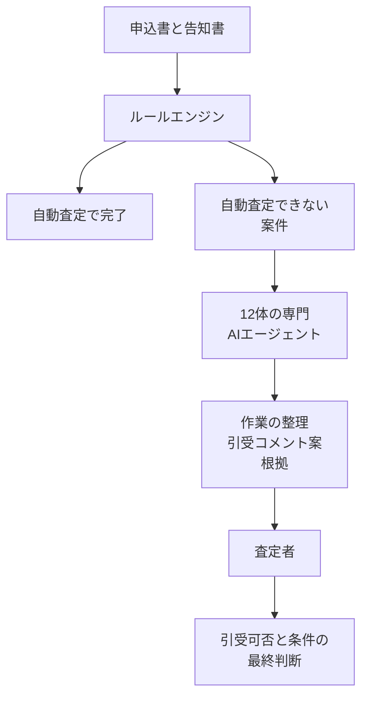

発注側が、生命保険の新契約査定を複数のエージェントに分担させるときに、ルールエンジン、専門エージェント、査定者の境界をどこに置くかを切り分けられます。日経クロステックの有料本文は未確認で、2026年9月29日の公開リードと、チューリッヒ生命の発表を材料にしています。

*この記事の全体像。以下、順に解説します。*

## チューリッヒ生命の New Business 2.0 とは

チューリッヒ生命保険株式会社の新契約査定システム「New Business 2.0」は、ルールエンジンと、12体の専門AIエージェントと、査定者とで、新契約の引受可否を扱います。同社は2026年6月25日、2026年7月1日から導入を開始すると発表しました。2026年7月17日の発表では、2026年7月1日に導入を開始したと書いています。

エージェントの対象は、自動査定ができない複雑な案件です。各エージェントは、担当領域のデータを分析し、作業の整理と引受コメント案を作り、判断の根拠を提示します。査定者は、その出力を参考に、引受の可否と条件を最終判断します。

### ルールエンジンが入り口で振り分ける

ルールエンジンは、申込書と告知書の情報から、自動査定と手動査定を振り分けます。自動査定は、システムによる自動判定で査定が完了する経路です。2026年6月25日の発表は、導入前の自動査定について「一定水準に達している」と書いています。

機能強化として同社が挙げているのは、名寄せルール、査定画面の改修、査定前の不備チェックです。狙いは、ルールベースで判定できる自動査定の割合を増やすことです。

### 12体が並列に準備する

医務査定、環境査定、モラル査定（不正検知）、情報集約などのカテゴリに特化した12体のAIエージェントが、並列に動きます。各エージェントは、担当領域のデータを分析し、査定に必要な作業の整理と引受コメント案を自動で作り、根拠を提示します。同社は、査定者の意思決定を支える、と書いています。

定型案件は、明確な基準でルールエンジンが処理します。暗黙知や複雑な文脈判断が要る非定型案件は、生成AIが担います。同社はこの組み合わせを、特長として書いています。

入力の側では、過去の類似査定案件から、ベテラン査定者の経験、コツ、ノウハウを形式知化する、と書いています。見る対象は、健康状態に加え、年齢、職業、年収です。不正に関する情報、外部データベース、過去の契約と査定の履歴を横断します。査定者の画面操作と確認手順を追跡し、業務プロセスを可視化する、とも書いています。

### 発表が分ける三つの役割

2026年6月25日の本文は、最適化する役割を三つに分けています。

| 役割 | 発表の文言 |
|---|---|
| ① | ルールエンジンによるシステムチェック（自動と手動の振り分け） |
| ② | 自動査定ができない複雑な案件のリスク判定を行うAIエージェント |
| ③ | AIの判定結果を参考に、引受の可否と条件の最終判断を行う査定者 |

同じ本文は、数値の狙いを二つ書いています。自動査定率を60%に向上させることです。手動査定の案件では、マルチAIエージェントの活用で、査定業務の時間を77%に短縮することを目指すことです。

### 発表本文の流れ

発表本文の役割は、入口のルールエンジン、自動査定できない案件に対する専門エージェント、査定者の最終判断、の三段です。

## 注意点

時間、初、メモ、階層は、出典ごとに書いていることが違います。

### 時間の文は出典で分かれる

| 出典 | 日付 | 書かれていること | 読み方 |
|---|---|---|---|
| 会社発表の副題 | 2026-06-25 | 自動査定率の向上と査定業務時間の短縮を「実現」 | 見出しの語 |
| 同じ発表の本文 | 2026-06-25 | 自動査定率を60%に向上させる。手動査定の案件で、査定時間を77%に短縮することを目指す | 目標。手動案件に限定。エージェント活用が手段 |
| 受賞の発表 | 2026-07-17 | 同じ60%と、手動案件の査定時間を77%削減することを目指している | 導入開始後も目標の文。6月の「77%に短縮」とは語が違う |
| 日経クロステックの見出しと公開リード | 2026-09-29 | 見出しは「作業時間を半減」。リードは、査定者が扱う案件で約14分が平均7分以下になった、と書く | 達成したと書く。有料本文は未確認 |

導入前の自動査定率は「一定水準」とのみ書いてあり、60%の起点になる数字は公開されていません。60%と77%の、2026年7月1日以降の実績も、会社の発表にはありません。約14分と平均7分以下の母数、測定期間、ルールエンジンの改修を含むかどうかは、公開リードだけでは分かりません。

14分を仮の起点に置くと、77%削減の残りは約3分、77%に短縮（残りが77%）は約11分、半分は7分です。この換算は、会社が14分を母数にしたという意味ではありません。会社の60%と77%の文を、リードの「半減」へまとめる材料にはなりません。

### 業界初と呼べる範囲

2026年6月25日と2026年7月17日の「生命保険業界初」は、当社調べです。調べの日付は、それぞれの発表日です。範囲は、医務査定、環境査定、モラル査定（不正検知）を含む総合査定に対応したマルチAIエージェントです。

FWD生命は2025年10月2日、生成AIを使った「AIによる医務査定サポート」を、マルチエージェントアーキテクチャで導入したと発表しています。医務査定の時間を平均30%短縮した、と書き、今後50%以上の効率化を目指す、と書いています。約70%の申込は、ペーパーレスと自動医務査定により、査定者を介さず引受決定している、と書いています。対象商品は、FWD医療Ⅱ、FWD収入保障、FWD終身（低解約返戻金型）です。これは医務査定の支援であり、チューリッヒ生命が当社調べの対象にした三領域の総合査定とは、発表の範囲が違います。チューリッヒ生命の「業界初」を、マルチエージェントによる査定一般の初、と広げて読むことはできません。FWDの特長表は画像だけで、行の文言は確認できていません。

### 査定メモと二階層

会社発表は「査定メモ」と書いていません。入力側の語は「過去の類似査定案件」と、そこからの形式知化です。

日経クロステックの公開リードは、約10年にわたって蓄積してきた査定者の「査定メモ」が鍵だった、と書いています。2026年9月29日時点の公開ページには、次ページ見出しとして「12体の専門エージェントを2階層で指揮」と「10年間残してきた「査定メモ」がAI開発の鍵に」が出ています。記事は3ページで、2ページ以降の本文は有料のためここには含めていません。メモの項目、採用、除外、更新責任、件数、開始年は、公開されている範囲では確認できません。2階層の指揮の中身も確認できません。

Insurance Asia のパートナー稿は、暗黙の判断を structured knowledge formats にする、と書いています。スキーマ、件数、更新責任はありません。実装ベンダーを、会社の一次が名指しした箇所は、確認できていません。

### 英語の受賞稿との差

Insurance Asia のパートナー稿（Co-Written / Partner、Staff Reporter、2026年7月8日）は、受賞カテゴリを “AI Initiative of the Year - Japan” と書き、受賞者名を Zurich Insurance APAC と書いています。同じ稿は、会社の言葉として world-first と measurable operational outcomes を載せています。60%、77%、分数、査定メモは、この稿にありません。日本語の受賞発表（2026年7月17日）は、賞の名前を “AI Initiative of the Year” と書き、Japan を付けていません。

パートナー稿が列挙する12体の担当は、medical risk、occupational hazards、sanctions and anti-social screening、document extraction、information gathering、consistency checks、additional specialised risk assessments です。日本語の会社発表が名を挙げているのは、医務査定、環境査定、モラル査定、情報集約、と「など」です。英語の列挙を、日本語の4分類へ一対一で対応させる根拠は、確認できていません。

### 公式図と最終判断

公式図（2026年6月25日）は、ルールエンジンから一つの「マルチAIエージェント」へ下り、その次に査定者を置きます。査定者の文言は「AIの判定、根拠をもとに引受可否を確定」です。冒頭の図は、発表本文がエージェントの対象を「自動査定ができない複雑な案件」に限っていることに合わせ、自動完了の分岐を残しています。

手動経路で最終判断を査定者に置くのは、2026年6月25日の役割③と、この公式図の文言です。査定者が AI の案を覆した割合は、公開されていません。

金融庁の「AIディスカッションペーパー（第1.1版）」（令和8年3月3日公表）は、次のように位置づけを書いています。

> 本文書は、モニタリング上の目線や金融機関等に求める具体的対応を示すものではなく

人の関与を「必須とする運用が大半」と書いているのは、融資判断などの稟議書を生成AIで下書きする事例の、アンケート上の確認です。生命保険の引受査定の最終判断者を人に限る義務規定は、この文書の該当範囲には確認できませんでした。

同じ PDF の「与信審査・信用リスク管理・引受審査」は、学習データの質と量に精度が依存すると書いたうえで、自社内の履歴が多い領域では AI のみの判断でも比較的高い精度が得られる、と評価した回答が少なくなかった、と整理しています。これはアンケートのまとめであり、New Business 2.0 の実績ではありません。

### 公開文書だけでは決まらない点

- 査定メモの1件に何が書いてあるか。全案件を覆うか。誰が直し、誰が捨てるか。
- 「過去の類似査定案件」と「査定メモ」が同じ集まりか。
- 12体の個別の名前と、2階層の指揮の配線。
- 60%と77%の定義、起点、2026年7月1日以降の実績。
- 約14分と平均7分以下の測定期間。
- 実装ベンダー。
- 査定者が AI の案を覆した割合。

## 入力ログの台帳を先に作る

公開された New Business 2.0 は、定型をルールエンジン、自動査定できない案件の準備を専門エージェント、手動経路の最終判断を査定者、に分けています。この三つの役割のどれかが空の業務は、この型の対象外として設計書に書けます。

非構造な判断メモを、エージェント分割の入力の正本にするかは、次の三点が分かるまで保留します。判断の単位は、エージェントの数ではなく、この台帳です。

| 観点 | 確認すること |
|---|---|
| 粒度 | 1件に、判断と根拠と例外が残っているか |
| 網羅 | 自動完了した案件を含むか、難しい案件だけか |
| 更新責任 | ガイドラインが変わったとき、誰が記録を直すか |

会社の発表が時間短縮の手段に挙げているのは、手動案件へのエージェントです。メモの品質とは書いていません。メモの品質を時間短縮の前提にするなら、その前提が確認できた業務だけを対象にします。

形式知化の入力として確認できる語は「過去の類似査定案件」です。どの記録を正本にするかは、発表には書いていません。

比較になる一次は、大同生命の2021年2月4日の PDF です。2020年4月に導入した医務査定の予測モデルを、過去数年分、約10万件の申込情報と健診表で作った、と書いています。出力は査定担当者の参考です。モデルはロジスティック回帰です。非構造な査定メモの事例ではありません。

自社の既存ログへ当てる手順は、次です。

1. 粒度、網羅、更新責任の三点を1枚にする。
2. どれかが空なら、その業務はこの型の対象外と書く。
3. 時間は三つの指標に分ける。自動査定率。手動案件の1件あたり時間。受付から契約成立までの期間。60%、77%に短縮、77%削減、約14分から平均7分以下は、別の文として扱う。
4. 手動経路の最終判断を人に残すのは、この事例では会社の設計です。金融庁の第1.1版を、その義務の根拠には使いません。自動査定の経路は、発表の定義では人を通らずに完了します。
5. 探索、候補化、評価を分ける設計では、候補を出す入力の正本を先に決める。公開された一次から確認できるのは、申込書と告知書に対するルール判定と、過去の類似査定案件からの形式知化までです。非構造メモを正本にするかは、三点の台帳のあとで決めます。

保留が解ける条件は、次です。

- 有料本文、または社内の記録が、メモの項目、除外、更新者を具体化している。
- 60%と77%の測定定義と実績が、会社の発表で出ている。時間の数字がそろうことは、メモを正本にしてよいかとは別です。
- 粒度が薄いログでも、同じ型の実測が出ている。

## まとめ

New Business 2.0 の公開された分担は、定型をルールエンジン、自動査定できない案件の準備を専門エージェント、手動経路の最終判断を査定者、に分けることです。時間の数字は、見出しの「実現」、本文の目標、短縮と削減、リードの約14分から平均7分以下を、別の文として残します。「生命保険業界初」は、三領域を含む総合査定のマルチAIエージェントについての当社調べであり、医務査定に限った先行例とは範囲が違います。非構造な査定メモを入力の正本にするかは、粒度、網羅、更新責任がそろうまで保留します。

この記事が少しでも参考になった、あるいは改善点などがあれば、ぜひリアクションやコメント、SNSでのシェアをいただけると励みになります！

## 参考リンク

- [チューリッヒ生命「New Business 2.0」導入の発表（2026-06-25）](https://www.zurichlife.co.jp/aboutus/pressrelease/2026/20260625)
- [公式図（2026-06-25）](https://www.zurichlife.co.jp/-/media/Images/ZurichLife/aboutus/pressrelease/2026/20260625/img_20260625-01.png)
- [日経の添付 PDF（特長節以降）](https://release.nikkei.co.jp/attach/708996/01_202606251700.pdf)
- [チューリッヒ生命、Insurance Asia Awards 2026 受賞の発表（2026-07-17）](https://www.zurichlife.co.jp/aboutus/pressrelease/2026/20260717)
- [Insurance Asia パートナー稿（2026-07-08）](https://insuranceasia.com/co-written-partner/event-news/zurich-insurance-apac-secures-win-insurance-asia-awards-2026-genai-powered-underwriting-transformation)
- [日経クロステック、前川太志（2026-09-29、本文は有料）](https://xtech.nikkei.com/atcl/nxt/column/18/00001/12056/)
- [FWD生命のプレスリリース（2025-10-02）](https://prtimes.jp/main/html/rd/p/000000150.000028922.html)
- [大同生命の発表 PDF（2021-02-04）](https://www.daido-life.co.jp/company/news/2021/pdf/210204_news.pdf)
- [金融庁「AIディスカッションペーパー（第1.1版）」](https://www.fsa.go.jp/news/r7/sonota/20260303/aidp_version1.1.pdf)
- [金融庁の公表案内](https://www.fsa.go.jp/news/r7/sonota/20260303/aidp.html)
