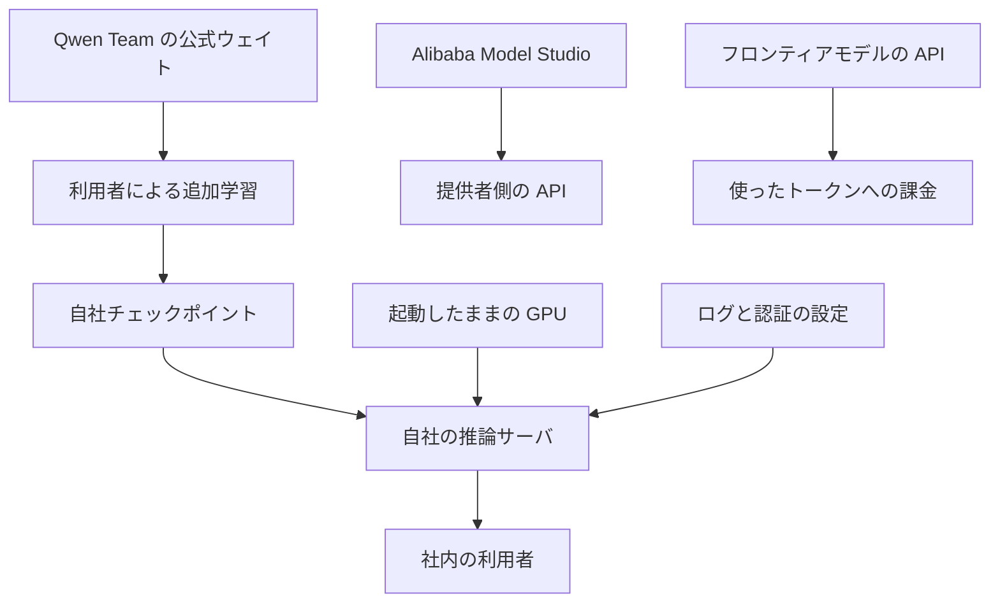

2026年10月7日、日経クロステックは、みずほフィナンシャルグループとライオンが中国のオープンウェイトを自社側の環境で扱う動きを報じました。公開されている各社の発表では、みずほは Qwen3-32B を基にした金融特化LLMを、ライオンは Qwen 2.5-7B を基にした LION LLM を、社内知見の追加学習と合わせて説明しています。

発注側が並べる行は、API の単価、GPU の所在、重みの更新主体、出力の監査ログです。この記事は、公開リード、両社のプレスリリース、モデルカード、ライセンス本文、公式の価格ページから、その4行の現在の中身を整理します。日経クロステックの記事本文は有料のため、有料部分の記述は含みません。

*この記事の全体像。以下、順に解説します。*

## 中国オープンウェイトの自社ホストとは

ここでの自社ホストは、公式のウェイトを利用者側で追加学習し、そのチェックポイントを利用者側の環境で推論する形です。公式ウェイト、利用者の追加学習、起動中の GPU、推論サーバの設定は、別々の箱になります。フロンティアモデルの API と Alibaba Model Studio（DashScope）は、プロンプトが提供者側へ出る経路です。

### みずほの金融特化LLM

みずほフィナンシャルグループは 2026年3月5日、金融特化LLMのベースを Qwen3-32B とした、と発表しました。不得意領域へ根拠コンテキストを付けた教師データで、教師ありファインチューニングした、とリリースは書きます。運用の文言は二つあります。銀行内のセキュアな環境（オンプレミス）で運用できることです。すべてのプロセスを銀行内の閉域環境で完結できることです。応答時間の注記は、単一の H100 GPU インスタンス（p5.4xlarge）です。

同じ発表の銀行実務テストは、預金・融資・外国為替等の多肢選択で、特定の評価セットを使ったものです。リリースが示す結果は次のとおりです。

| 条件 | モデル | 正答率 | 平均回答 |
|---|---|---:|---|
| 推論なし・コンテキストあり | 金融特化LLM | 89.0% | 1秒未満 |
| 推論なし・コンテキストあり | GPT-5.2 | 89.0% | 1秒未満 |
| 推論あり・コンテキストなし | GPT-5.2 | 89.7% | 67.4秒 |

推論ありの行は、`reasoning_effort=xhigh`、OpenAI API、ネットワーク遅延を含む、とリリースに注記があります。

### ライオンの LION LLM

ライオンは 2025年10月8日、LION LLM の開発着手を発表しました。ベースの表記は Qwen 2.5-7B です。学習データは、研究報告書、製品組成情報、品質評価など、数十年の社内知見です。学習基盤は AWS ParallelCluster と NVIDIA Megatron-LM です。2025年4月から、AWSジャパンの生成AI実用化推進プログラム（クレジットと技術協力）に参加しています。今後は GENIAC の国産モデルも併用する、とリリースは書きます。

### 公式ウェイトとライセンス

Qwen/Qwen3-32B のモデルカードは、license を apache-2.0 とします。パラメータ数は 32.8B です。ネイティブの文脈長は 32,768 で、YaRN により 131,072 まで、とカードは書きます。思考モードは、カードのサンプルでは既定で有効です。カードは、transformers、SGLang、vLLM による自前エンドポイントと、Alibaba Model Studio（DashScope）を併記します。

Qwen/Qwen2.5-7B と Qwen/Qwen3-32B の LICENSE 本文は、いずれも Apache License 2.0 です。付録の著作権表示は、いずれも「Copyright 2024 Alibaba Cloud」です。

公開リードが比較相手に挙げるフロンティアモデルについて、OpenAI の公式モデルページは、2026年10月7日の取得時点で `gpt-5.2` のテキスト価格を次のように示します。入力は 100万トークンあたり 1.75ドルです。キャッシュ入力は 0.175ドルです。出力は 14ドルです。課金単位はトークンです。

## 注意点

### 見出しの倍率

見出しの「コスト20分の1」は、公開リードにある条件付きの発言を、倍率の形にしたものです。記事の公開リードは、AWSジャパン執行役員の瀧澤与一氏が「使い方によっては、コストを10分の1から20分の1にできる」と話した、と示します。比較相手は、OpenAI や Anthropic などのフロンティアモデルです。一覧ページのリードは、自前環境なら GPU の利用コストだけでトークン利用料がかからない、とも書きます（[日経クロステック AI テーマ](https://xtech.nikkei.com/theme/ai/)、2026年10月7日時点）。分母、利用率、期間、ワークロードは、有料本文の外では確認できません。

両社の一次発表は、その倍率を測定していません。みずほのリリースに、トークン量、月間利用率、GPU の常時起動時間、費用はありません。ライオンのリリースに、費用削減額はありません。公表された学習費用もありません。費用支援としてクレジットと技術協力があった、と一次資料が書きます。公開されている解説は、損益分岐のトークン量と利用率が書き手ごとに違います。一つの分岐点としては使えません。公式の「20分の1」の計算式は、公開範囲にはありません。

### 正答率と応答時間の読み方

みずほの 89.0% と 1秒未満は、推論なし・コンテキストありの多肢選択における、リリース自身の報告です。同じ条件の GPT-5.2 も正答率 89.0%、1秒未満です。正答率の差が目立つのは、推論あり・コンテキストなしの GPT-5.2（89.7%、平均 67.4秒）との並べ方です。同条件の推論なし GPT-5.2 とは、正答率が同じです。

Qwen3-32B のカードでは、思考モードがサンプルの既定で有効です。みずほの 1秒未満は、推論なし・コンテキストありの条件です。既定の思考モードのまま同じ時間が得られるかは、リリースからは読めません。

p5.4xlarge は、測定環境の型名です。AWS の P5 ページは、p5.4xlarge を 1基の H100（80GB HBM3）として載せます。銀行の機械室で測ったのか、AWS 上の同型で測ったのかは、リリースだけでは確定できません。`p5.4xlarge` のオンデマンド時間単価は、公式価格表の SKU まで確定していません。第三者サイトの 1時間 6.88ドルは採用しません。

### ライオンは学習基盤の発表である

ライオンの発表は「開発に着手」です。AWS ParallelCluster は AWS のクラスターツールです。「社内に構築」という語だけでは、物理的な自社機械室かは確定できません。推論の本番配置は、リリースにありません。定常運用が中国モデル一本であるとは読めません。GENIAC の国産モデル併用が、同じリリースに予告されています。クレジット補助があります。

### みずほCoworkは別の費用科目

2026年10月5日の「みずほCowork」は、Anthropic の Claude Agent SDK を、AWS 上の社員向け環境で使う、と書きます。2026年3月5日の金融特化LLMとは、モデルも費用科目も別経路です。グループ全体がトークン課金をやめた、とは読めません。机上作業をどこまで渡すかとは、別の軸です。

### トークン料が外れることと、計算資源の費用

トークン料が外れることと、計算資源の費用が消えることは別です。OpenAI の `gpt-5.2` は、2026年10月7日の公式ページでは、使ったトークンに課金します。リクエストが無い時間の API 料金は、この価格表の単位では発生しません。この単価は取得日の表示価格です。みずほが 2026年3月5日に比較した時点の請求単価を再現したものではありません。

AWS はオンデマンドを、起動したインスタンスについて秒単位で支払う、と定義します（[インスタンスの購入オプション](https://docs.aws.amazon.com/AWSEC2/latest/UserGuide/instance-purchasing-options.html)）。起動中の GPU 利用率では、その秒を割り引きません。残る費用は、起動中の GPU、オンプレミスなら電力、運用、遊休です。

### ライセンスはチェックポイントごとに違う

今回引用した 2チェックポイントの LICENSE は、Apache-2.0 のままです。収益や地域の追加条項は、この2つの本文にはありません。第7条は無保証です。更新義務の有無は定めていません。第8条は、強行法規と書面合意の例外を除き、貢献者の損害賠償責任を制限します。第6条は商標を与えません。

同じ Qwen の名前でも、別チェックポイントは別契約です。Qwen/Qwen2.5-72B の LICENSE は Qwen LICENSE AGREEMENT（2024-09-19）です。月間アクティブユーザー 1億超の商用利用は別許諾です。更新の提供義務はありません。更新しないことの明文は、この 72B の契約側にあります。初期の通義千問の研究ライセンスは、非商用に限ります。72B や研究ライセンス版へ乗り換えるときは、条項が変わります。

発表表記の「Qwen 2.5-7B」が、base の `Qwen/Qwen2.5-7B` か Instruct 版かは、リリースの表記だけでは確定できません。

### 追加学習した重みは別の管理対象

追加学習は、推論トラフィックを閉域で終えても、重みの保管を別の管理対象にします。EDPB Opinion 28/2024（採択 2024年12月17日）は、個人データで学習したモデルを、すべての場合に匿名とはみなせない、とします。日本の個人情報保護委員会 Q&A 1-8（令和3年6月追加）は、特定の個人との対応関係が排斥されている限り、学習済みパラメータは個人情報に該当しない、と考える、と書きます。ライオンが投入したと書く製品組成や品質評価は、個人情報かどうかとは別に、営業秘密として重みファイルの管理対象になり得ます。業務データの学習利用は、両社とも一次資料で「あり」です。本番トラフィックがこのモデルだけに寄っているかは、発表にありません。

公式の Qwen2.5-7B と Qwen3-32B に、バックドアや外部送出が入っていた一次記録は、公開情報の範囲では見つかっていません。見つかっている実証は、別の前提です。[arXiv:2505.15656](https://arxiv.org/abs/2505.15656)（v2、2026年4月3日）の要旨は、公開前のベースへ攻撃者がバックドアを仕込めるなら、その後のファインチューニング用クエリをブラックボックスで抽出できる、と書きます。実用設定では 5,000件中最大 76.3% です。より理想的な設定では 94.9% です。対象は 3B から 32B のオープンモデル 4種です。公式 Qwen にそのバックドアが実在した実験ではありません。arXiv の Comments は「Accepted to ICLR 2026」と書きます。プロシーディングスのページは、ここでは確認できていません。

### 閉域でも残る読込とログの設定

vLLM のアドバイザリ [GHSA-rh4j-5rhw-hr54](https://github.com/vllm-project/vllm/security/advisories/GHSA-rh4j-5rhw-hr54)（2025年1月27日）は、Hugging Face から拾ったチェックポイントを `torch.load` し、`weights_only` の既定 False 経由で任意コードを実行し得る、とします。影響バージョン欄は `<= 0.7.0` です。修正版欄は `v0.7.0` と併記されます。大半のモデルは safetensors であり対象外、とアドバイザリは注記します。閉域であっても、pickle 形式の偽チェックポイントを読む危険は、推論サーバ側に残ります。

監査ログは、重みを置いただけでは残りません。vLLM 公式の `vllm serve` 引数は、`--enable-log-requests` と `--enable-log-outputs` の既定を False とします。出力ログはリクエストログを要します。`--disable-uvicorn-access-log` の既定は False で、HTTP アクセスログは既定で出ます。アクセスログは、プロンプト本文と生成文の監査ログではありません。同じページは、リクエストログを有効にしても INFO ではリクエスト ID、パラメータ、LoRA リクエストまでで、プロンプト本文は DEBUG だと書きます（[vLLM serve](https://docs.vllm.ai/en/stable/cli/serve.html)、2026年10月7日時点）。起動引数だけでは、プロンプト本文の監査ログになりません。生成文が INFO で出るかは、引数説明だけでは確認できていません。金融庁の監督指針別紙を参照した範囲では、LLM のプロンプト本文の保管を義務付ける条文は確認できていません。両社が出力本文の監査ログを残しているかも、発表にはありません。

### 輸出規制は検討の報道まで

手元の Apache-2.0 ウェイトを違法化する施行済み法令は、公開情報の範囲では確認できていません。2026年7月7日の Reuters は、中国商務部が先端モデルの海外アクセス制限を検討した、と匿名情報源に基づき報じます。施行の有無は、記事自身が不明と書きます。米国 BIS は 2025年5月13日、AI Diffusion Rule を施行しないと発表し、米国製 AI チップを中国製モデルの学習と推論に使うことへのガイダンスを出した、と書きます。ガイダンス PDF の本文は、ここでは確認できていません。

### 公開資料だけでは埋まらない欄

採否の前に、次は空欄のまま残ります。

- 日経クロステック本文が、各社のモデル名、閉域かクラウドか、学習の有無をどう書き分けているか。有料部分は未取得です。
- 瀧澤氏の「使い方」が、どのワークロード、どの GPU 単価、どのフロンティア単価を指すか。
- みずほの本番 GPU が機械室にあるか、AWS アカウント上の p5.4xlarge か。測定環境と運用文言は並立しています。
- ライオンの推論が閉域か、クラウド GPU か、API か。学習基盤の記述しかありません。
- `p5.4xlarge` の公式オンデマンド時間単価。
- 中国の海外アクセス制限が、既存の Apache-2.0 ウェイトに及ぶ施行済み法令になるか。現時点は検討の報道です。

## 発注側が先に埋める4行

採否は、次の4行を埋めてから決めます。見出しの倍率は、この表の数値としては使いません。

| 行 | フロンティア API | 今回の自社ホストの発表 |
|---|---|---|
| API の単価 | 使ったトークン。`gpt-5.2` は 2026年10月7日の公式ページで、入力 1.75ドル、キャッシュ入力 0.175ドル、出力 14ドル / 100万トークン | 引用した2モデルのウェイト利用料は Apache-2.0 で無償。残るのは起動中の GPU、オンプレミスなら電力、運用、遊休 |
| GPU の所在 | 提供者側 | みずほはオンプレミスで運用できる、閉域で完結できる、と書く。本番が機械室かは未確定。測定型名は p5.4xlarge。ライオンの学習は AWS ParallelCluster。本番推論の所在は発表に無い |
| 重みの更新主体 | 提供者 | 次の公式ウェイトは Qwen Team。追加学習のチェックポイントは利用者。引用2モデルの第7条は無保証で、更新義務の条項は無い。第8条は法定例外と書面合意を除き損害賠償を制限する。更新しないことの明文は Qwen2.5-72B の別契約にある |
| 出力の監査ログ | 提供者の契約とログ設計 | vLLM の既定ではプロンプトと生成文は記録しない。リクエストログを有効にしても、公式ドキュメントはプロンプト本文を DEBUG とする。残す条件と保管先は利用者が決める |

### API が費用で有利になりやすい条件

- リクエストが間欠で、GPU を起動したままにする時間が長い。
- 比較相手が、同程度のオープンウェイトをトークン課金で出す安価な API である。
- 追加学習、独立検証、当番、チェックポイント保管を自前で持てない。

### 自社ホストが比較に残りやすい条件

- 推論のプロンプトを、提供者の API へ出したくない。
- 同じ設問を、推論トークンを伸ばさずに短時間で返したい。みずほの表は、この条件で GPT-5.2（推論なし）と同率でした。
- 月間のトークン量が、起動した GPU の費用を埋める。埋める量はワークロード次第です。20分の1は使いません。

閉域で推論したい照会業務は、自社ホストの比較対象に残ります。間欠な少量トラフィックを、見出しの倍率だけで移す判断にはしません。

## 採否の前に分けること

1. 調達表の行を、API の単価、GPU の所在、重みの更新主体、出力の監査ログに固定します。モデル名が同じに見えても、この4行が空なら採否を保留します。
2. 20分の1は見出しの倍率として置き、月間トークン量と GPU の起動時間を当ててから採否を決めます。取得日の `gpt-5.2` 単価を、2026年3月の請求単価の再現としては使いません。
3. みずほの金融特化LLMと、みずほCowork（Claude Agent SDK）を、同じ費用科目で扱いません。照会の閉域推論と、社員の机上作業は別軸です。
4. 推論時に外部 API へ出さないことと、追加学習済み重みが業務データを含み得ることを、別の管理項目にします。閉域の推論サーバと、重みファイルの保管先は、別の台帳です。
5. ライセンスはファミリー名ではなく、チェックポイントの LICENSE を見ます。今回の 7B と 32B は Apache-2.0 です。72B の Qwen LICENSE AGREEMENT や、非商用の研究ライセンスへ乗り換えるときは、条項を読み直します。
6. 出力を残すなら、vLLM ではリクエストログと出力ログの両フラグを有効にします。プロンプト本文は、公式ドキュメント上は DEBUG まで下げたときです。INFO のリクエストログは、ID とパラメータに留まります。生成文がどのレベルで出るかは、serve 引数の説明だけでは確認できていません。保管期間は利用者が決めます。既定の vLLM には任せません。pickle 形式のチェックポイントは、閉域でも `torch.load` の対象から外します。
7. 公式ウェイトの次版は Qwen Team が出します。自社チェックポイントと推論サーバの修正は、利用者が上げます。Apache-2.0 の第7条は、その更新をベンダーの義務にしていません。

## まとめ

日本企業の公開発表には、Qwen を自社側で追加学習して使う事例があります。みずほは Qwen3-32B を基に、閉域で完結できる金融特化LLMを説明しています。ライオンは Qwen 2.5-7B を基に、社内知見の追加学習へ着手し、学習計算を AWS ParallelCluster 上に置いています。費用科目は、トークン従量から、起動した計算資源と運用へ移ります。

見出しの約20分の1は、条件付き発言の上限を倍率にしたものです。両社の総費用を測った数字ではありません。閉域で推論したい照会は比較対象に残し、間欠な少量は GPU の起動時間と照らしてから決めます。

この記事が少しでも参考になった、あるいは改善点などがあれば、ぜひリアクションやコメント、SNSでのシェアをいただけると励みになります！

## 参考リンク

- [日経クロステック「みずほもライオンも選んだ中国AI、日本企業に浸透　コスト20分の1の衝撃」](https://xtech.nikkei.com/atcl/nxt/column/18/03782/100500001/)
- [日経クロステック AI テーマ一覧](https://xtech.nikkei.com/theme/ai/)
- [みずほフィナンシャルグループ 金融特化LLM（2026年3月5日）](https://prtimes.jp/main/html/rd/p/000000002.000177612.html)
- [みずほCowork（2026年10月5日）](https://prtimes.jp/main/html/rd/p/000000022.000177612.html)
- [ライオン LION LLM（2025年10月8日）](https://prtimes.jp/main/html/rd/p/000000218.000039983.html)
- [Qwen3-32B モデルカード](https://huggingface.co/Qwen/Qwen3-32B/raw/main/README.md)
- [Qwen3-32B LICENSE](https://huggingface.co/Qwen/Qwen3-32B/raw/main/LICENSE)
- [Qwen2.5-7B LICENSE](https://huggingface.co/Qwen/Qwen2.5-7B/raw/main/LICENSE)
- [Qwen2.5-72B LICENSE](https://huggingface.co/Qwen/Qwen2.5-72B/raw/main/LICENSE)
- [Apache License 2.0](https://opensource.org/licenses/Apache-2.0)
- [Amazon EC2 P5 インスタンス](https://aws.amazon.com/ec2/instance-types/p5/)
- [Amazon EC2 インスタンスの購入オプション](https://docs.aws.amazon.com/AWSEC2/latest/UserGuide/instance-purchasing-options.html)
- [OpenAI gpt-5.2（2026年10月7日取得）](https://developers.openai.com/api/docs/models/gpt-5.2)
- [vLLM serve の引数](https://docs.vllm.ai/en/stable/cli/serve.html)
- [GHSA-rh4j-5rhw-hr54](https://github.com/vllm-project/vllm/security/advisories/GHSA-rh4j-5rhw-hr54)
- [arXiv:2505.15656](https://arxiv.org/abs/2505.15656)
- [EDPB Opinion 28/2024](https://www.edpb.europa.eu/system/files/2024-12/edpb_opinion_202428_ai-models_en.pdf)
- [個人情報保護委員会 Q&A 1-8](https://www.ppc.go.jp/all_faq_index/faq1-q1-8/)
- [Reuters 2026年7月7日](https://www.reuters.com/world/beijing-is-looking-curbing-overseas-access-chinas-top-ai-models-sources-say-2026-07-07/)
- [米国 BIS 2025年5月13日](https://www.bis.gov/press-release/department-commerce-announces-rescission-biden-era-artificial-intelligence-diffusion-rule-strengthens)
- [金融庁 主要行等向けの総合的な監督指針 別紙](https://www.fsa.go.jp/common/law/ginkou/pdf_02.pdf)
