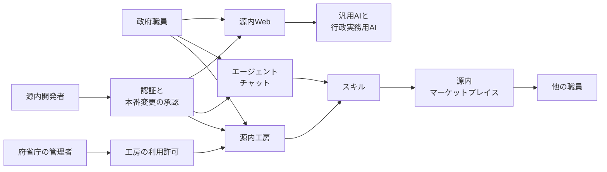

2026年10月6日、日経クロステックは、ガバメントAI「源内」について、職員が専門的知識なしでAIアプリケーションをつくれる試験提供を始める、と報じました。デジタル庁は2026年9月、職員が自然言語で業務手順をスキルにし、複数工程をエージェントに実行させる環境を、2026年10月頃に導入する予定だと説明しています。

この記事は、方針ページ、大規模実証とOSS公開の発表、2026年9月18日の説明会資料とFAQ、2026年9月29日のワーキング・グループ報告、大分市の発表から、すでに動いている面と、職員が作る面を分けます。日経クロステックの記事本文は有料のため、有料部分の記述は含みません。

*この記事の全体像。以下、順に解説します。*

## 源内とは

ガバメントAI「源内」は、デジタル庁が政府職員向けに内製している生成AIの利用環境です。2025年5月にデジタル庁内で運用を始め、2026年5月からは全府省庁の約18万人を対象とする大規模実証に入っています。実証の期間は、2027年3月までの予定です。2026年9月29日の資料は、2026年8月下旬時点で約16万人が利用可能だと書いています。

その次の面が、職員がスキルを作り、複数工程をエージェントに実行させる環境です。2026年9月18日の説明会報告は「本年10月頃に導入する予定」です。2026年9月29日の資料は「9月末〜10月以降順次」の試験提供予定であり、正式実装の前に統制を確認する、と書いています。環境は2つです。対話の延長であるエージェントチャットと、個人用サーバー上の源内工房です。

### エージェントチャット

エージェントチャットは、通常のチャットの発展形です。デジタル庁は、自然言語で指示でき、専門的知識は不要で、複数タスクを自動実行でき、スキルを作れ、結果をファイルで出せる、と説明しています。OSS Ver 2.0 の予定資材では、ウェブ検索、資料生成、コード実行、スキルの作成と実行を組み合わせる、と書かれています。

### 源内工房

源内工房は、個人専用サーバー上のコーディングAI環境です。説明会の画面イメージでは、Claude Code 相当の操作、任意サイトの直接読み取り、ファイル操作、コマンド実行、Web取得を数十から数百ステップ、動作するプロトタイプの開発、他人のスキルのカスタマイズ、が並びます。工房の利用許可は、源内基準の目次に項目があります。府省庁の管理者が許可する、という配置です。

### スキル

説明資料は、スキルを、業務手順、判断基準、参照資料、入出力、確認方法、例外処理をまとめた実行単位と定義しています。作ったスキルを組織の外まで共有する源内マーケットプレイスは、2026年9月18日の公表では企画・構想段階です。2026年9月29日の報告は、年内リリース予定であり、共有過程の審査の仕組みは検討中だと書いています。

事務局は、源内を行政の内部事務など、国民への処分性がない業務を前提にする、と説明しています。政府環境のログインは、ガバメントソリューションサービス（GSS）のシングルサインオンです。デジタル庁においては、機密性2情報を含むプロンプトに対応します。デジタル庁内では、各職員が源内の利用状況をダッシュボードで確認できる、と説明資料にあります。

### 政府のテナントと公開OSS

2026年4月24日に公開したOSSは一部です。中身はWebインターフェースと、行政実務用RAGなどの開発テンプレートです。公開リポジトリは `digital-go-jp/genai-web` と `digital-go-jp/genai-ai-api` です。エージェントチャットと源内工房は、令和9年2月頃（2027年2月頃）公開予定の OSS Ver 2.0 の資材として説明されています。マーケットプレイスの資材は、Ver 2.0 でも企画・構想段階だと説明されています。

説明会FAQは、デジタル庁が自分で提供する源内について、独立行政法人への提供時期は未定、令和9年度（2027年度）は原則として中央省庁の有償利用、機密性3を扱う予定は現時点でない、と答えています。OSS自体は、利用者を限定せず、民間や大学が使ってよい、とも答えています。政府のテナントと、OSSを自分で立てた環境は、別のサービスです。

説明会報告は、行政実務用RAGが府省庁の業務で20以上稼働している、と書きます。説明資料は、40種類以上のAIアプリ、とも書きます。アプリの横展開は、デジタル庁側の仕事です。

大分市は、この4月公開のOSSを基にした「Oita GENAI」を、2026年10月1日からLGWAN上で導入すると、2026年9月18日に発表しています。提供は川口弘行合同会社、基盤は国内のさくらクラウドです。用途には、RAG、文字起こし、翻訳、画像、スライド、分析、政策立案の補助、プログラミングコードの生成があります。

### 層の配置

いま職員が触れる源内と、2026年10月頃に足す予定のエージェント環境と、共有の仕組みは、層が分かれています。源内Webは、すでに運用されています。エージェントチャット、源内工房、マーケットプレイス、工房の利用許可、本番変更の承認は、2026年9月時点の予定と、源内基準の目次案です。

| 面 | 時点 | 運用する主体 | 職員が作るもの | 共有 |
|---|---|---|---|---|
| いまの源内 | 庁内は2025年5月から。大規模実証は2026年5月から | デジタル庁が提供し、府省庁がテナントを持つ | デジタル庁などが内製したアプリを使う | アプリの横展開はデジタル庁側の仕事 |
| エージェントチャットと源内工房 | 2026年10月頃の導入予定。9月末以降の順次試験提供予定 | 同じ政府環境の上。工房は管理者の利用許可が基準の目次にある | 職員がスキルを作る。工房ではプロトタイプも作る | 個人の利用と、組織へのインストールは別 |
| 源内マーケットプレイス | 企画・構想。年内リリース予定。審査の仕組みは検討中 | 未稼働 | 共有する単位はスキル | 審査を通った共有の実績は、公開資料にない |
| Oita GENAI | 2026年10月1日から | 大分市が導入し、川口弘行合同会社が提供。LGWAN、国内のさくらクラウド | 市の発表は、用意された機能の利用。コード生成は用途の一つ | 市の発表に、スキル共有の記載はない |
| 公開OSS | 一部は2026年4月24日。Ver 2.0 は2027年2月頃の予定 | 立てた組織 | 現行の公開範囲はWebと一部アプリ。Ver 2.0 で工房相当を公開する予定 | マーケットプレイスの資材は、Ver 2.0 でも企画・構想段階 |

## 注意点

### 試験提供の開始日

日経クロステックの公開リードは、「試験提供を始める」「専門的知識がなくても AI アプリケーションをつくれる」と書いています。掲載日は2026年10月6日です。開始日、対象人数、府省庁の範囲は、公開リードだけでは決まりません。

デジタル庁の一次は、日付を「予定」で置いています。方針ページ（最終更新2026年9月30日）の公表一覧に、エージェント環境の開始を告げるプレスは出ていません。開始済みの試験が公表されていない可能性は残ります。公開資料の範囲では、開始の事実は未確認です。

約18万人の大規模実証は、2026年5月から2027年3月までの予定で、すでに発表済みです。未確認なのは、エージェント環境の開始を告げる公式発表です。

### 人数とアプリ本数

約16万人は、2026年8月下旬時点で利用可能だとされた人数です。アカウントを渡した件数とも、エージェントを作った人数とも、実行した人数とも、資料は書いていません。

行政実務用RAGの「20以上」と、AIアプリの「40種類以上」は、別の資料の別の言い方です。定義の差は未照合です。足して60本にはしません。府省庁ごとに使えるアプリが違う、という日経クロステックの公開範囲の断片は、デジタル庁の一次資料と照合できていません。

### 専門的知識と入場条件

「専門的知識は不要」は、操作を自然言語で行える、という公式の説明です。同じ資料が、工房をファイル操作とコマンド実行を含む環境だと説明しています。ワーキング・グループでは、研修を受けた人に限る案や、人の確認を当面原則にする、という議論があります。研修限定は、確定した入場条件としては書かれていません。

トークンを使い切る課題が、ワーキング・グループで挙がっています。上限の数値は、公表された一次資料からは取れていません。

デジタル庁内の利用状況ダッシュボードは、庁内専用の画面です。府省庁展開後の源内全体にある、とまでは書いていません。説明会は、利用実績の書き出しを Ver 2.0 の資材にする、と言っています。エージェントのスキルについて、公開された実数はありません。

### スキル件数の推計

スキル「1万から数万件」は、説明資料が「規模感のイメージ」と見出しを付けた推計です。前提は、e-Govで表示される法律約2,100件と、令和7年7月1日現在の人事統計で行政職（一）8〜10級に当たる約4,000人です。そこから法律系6,000件、課室業務4,000件と置いています。法律1件をスキル1件とは数えていません。作成済みの件数でもありません。

### 共有の文言と審査

「自由に共有・入手できる」は、説明会資料のデモ画面の文言です。同じ説明会の報告は、マーケットプレイスを企画・構想段階としています。審査を通った共有の実績は、公開資料にはありません。業務環境へインストールするものは、その環境のアプリ導入審査、または標準ガイドラインでの確認、という答えがあります。

源内基準の確定本文は、2026年10月7日時点で、方針ページからリンクされていません。方針ページの最終更新は2026年9月30日のままです。10月上旬の公表予定どおり出たかは、このページの更新からは確認できません。

### 庁外へ出る通信

外に出る通信は、資料の間で言い方が揃っていません。工房の画面イメージは、任意サイトの直接読み取りと Deep Research を機能に挙げています。同じ説明会のFAQは、ファイル操作は個人専用領域の中で行え、外部通信は不可、と答えています。ワーキング・グループの方向性は、源内工房ではMCPやAPI連携の制限は既に導入済みで、無断ではできない、と書いています。議論の回答本文は、制限される、と書くだけで、工房に限るとは明示していません。

三つの文が同じ口を指しているとは限りません。ウェブの読み取り、個人領域からの外部通信、MCPやAPIの無断送信を、一つの禁止にまとめません。ウェブの読み取りまで基盤が止めている、とまでは書きません。

### 大分市の発表範囲

大分市の発表は、中核市で初めて、源内OSSをLGWAN上の生成AIサービスとして2026年10月1日に導入する、という範囲です。エージェントチャット、源内工房、スキルの庁内共有は、市の発表にありません。受託者の「自治体で初めて」は、市の「中核市で初めて」より広いです。市の文を優先します。

例規、答弁、マニュアルは「利活用が想定される業務」の中にあります。誰が搭載したかは、市の発表だけでは決まりません。市の調達仕様に、エージェントやスキル共有が含まれるかは、報道発表の範囲では分かりません。コード生成は用途に含まれます。チャットだけの派生、と切ると市の発表に反します。

### GSSの事案

2026年9月11日に公表された個人情報の漏えい可能性は、GSSの事案です。漏えいした可能性がある個人情報は約24.6万件です。検知は2026年6月25日、侵入の判明は2026年7月9日です。源内はGSSでログインします。源内のプロンプトやスキルが漏れた、という記載は、この公表にはありません。公式発表は、VPNの脆弱性について製品名とCVEを書いていません。源内テナントへの波及は、この公表からは言えません。

### 公開リポジトリの日付

2026年10月7日時点の star は、genai-web が566、genai-ai-api が354です。genai-web の `pushedAt` は2026年10月4日です。defaultブランチ main の最新コミットは2026年8月14日です。任意ブランチへの push と、公開版の更新は別です。

## 発注側が先に見る5段

職員がエージェントを作った、という件数は、源内では次の5段が混ざりやすいです。公開資料で今日言えるのは、上の2段までです。

| 段 | 問い | 2026年10月7日時点で言えること |
|---|---|---|
| 1. 使える | 源内に入れる職員は何人か | 約18万人が対象。8月下旬時点で約16万人が利用可能。実行者数ではない |
| 2. 用意されたアプリが動く | デジタル庁などが載せたアプリは何本か | 行政実務用RAGが府省庁の業務で20以上稼働、という説明会報告。説明資料は40種類以上のAIアプリ。定義の差は未照合 |
| 3. 作る許可がある | 工房の利用許可は何人か | 基準の目次に項目がある。人数は未公表 |
| 4. 作った | スキルは何件できたか | 1万から数万は潜在規模の推計。作成数は未公表 |
| 5. 共有のあとで動く | 審査を通り、他者が実行しているスキルは何件か | マーケットプレイスは未稼働。審査の仕組みは検討中。実行回数は未公表 |

作成数だけを数えると、個人領域の下書きが開発件数になります。共有後に動いている数だけを数えると、共有の仕組みができるまで件数はゼロのままです。どちらを主指標にするかは、政策の主張で先に決まります。仕組みが無い段階のゼロを、定着の失敗の証拠にはできません。母数が無いからです。

今日の実数として使えるのは、利用可能にした約16万人と、デジタル庁側のアプリが稼働していることです。職員発のスキル件数は、まだ母数がありません。

## 作成と共有と基盤変更は別の承認

源内基準の骨子は、主体を利用者、管理者、源内開発者の3つに分ける、と示しています。工房には利用許可、開発者には本番変更の承認とデプロイ権限の分離が、目次にあります。これは、職員が作ったスキルの公開承認そのものではありません。

職員の成果物を他人に渡す口は、検討中のマーケットプレイス審査と、業務環境への導入審査です。作成、組織内での利用、政府横断の共有、基盤の変更は、4つの承認です。

すでに権限が分かれて実装されている、とは書きません。分ける、と基準の目次と審査の検討が示しています。実装の確認は、源内基準の本文と、マーケットプレイスの稼働後です。

共通部品の変更責任は、職員の作成権とは別です。認証はGSSを使います。本番の変更承認とデプロイ権限は、源内開発者の責務として基準の目次にあります。源内工房では、MCPやAPIの無断の外部送信を制限済み、とワーキング・グループの方向性が書いています。議論本文の「制限され」は、工房限定とは書いていません。共通部品の変更責任を職員に渡した、とも書いていません。

## 大分市は公開OSSの自治体側差分

大分市は、2026年4月に公開された源内OSSを、市の環境へ載せた事例です。政府のエージェント工房を、市がそのまま動かしているわけではありません。

比較するときは、共通部分と差分を分けます。共通部分は、2026年4月24日公開のOSSです。自治体側の差分は、LGWAN、市の保有情報を参照するRAG、受託事業者による運用、国内のさくらクラウド、コード生成という用途です。

例規、答弁、マニュアルを市が載せ終えた、とは市の発表は書いていません。川口弘行合同会社の2026年9月28日のリリースは、構造化RAGの構築を同社が担当した、と書いています。これは市の発表ではなく、受託者の発表です。

政府側が足そうとしている差分は、エージェントチャット、個人用の工房、横断のスキル共有です。市が国の工房を運用し始めた、という書き方は、市の発表の範囲を超えます。

## まとめ

源内は、デジタル庁が政府職員向けに内製している生成AIの利用環境です。庁内運用は2025年5月から、約18万人を対象にした大規模実証は2026年5月からです。職員がスキルを作るエージェントチャットと源内工房は、2026年9月の説明では2026年10月頃の導入予定です。10月6日の日経クロステックは、試験提供を始める、と報じました。開始を告げる公式発表は、10月7日時点の方針ページにはありません。

数える対象は、作成数と、共有後に動いている数を、別の段に置きます。今日の実数として使えるのは、利用可能にした約16万人と、デジタル庁側のアプリが稼働していることです。職員発のスキル件数に、母数はまだありません。

作成、組織内利用、政府横断の共有、基盤の変更は、別の承認として読みます。実装の確認は、源内基準の本文と、マーケットプレイスの稼働後です。大分市の Oita GENAI は、公開OSSの自治体側差分であり、政府の工房そのものではありません。

この記事が少しでも参考になった、あるいは改善点などがあれば、ぜひリアクションやコメント、SNSでのシェアをいただけると励みになります！

## 参考リンク

- [デジタル庁「ガバメントAI『源内』」（最終更新 2026-09-30）](https://www.digital.go.jp/policies/genai)
- [デジタル庁「全府省庁の約18万人の政府職員を対象としたガバメントAI（源内）の大規模実証を開始します」（2026-03-06）](https://www.digital.go.jp/news/2d69c287-2897-46d8-a28f-ea5a1fc9bce9)
- [デジタル庁「ガバメントAI『源内』をOSSとして公開しました」（2026-04-24）](https://www.digital.go.jp/news/907c8e5d-2f4f-4bd7-9400-37c9f4221d7d)
- [デジタル庁「ガバメントAI 源内OSS Ver 2.0の計画に関する全国オンライン説明会を開催しました」（2026-09-18）](https://www.digital.go.jp/news/e525db0b-eac1-49e2-9ef4-6d2e24208498)
- [説明会資料 PDF（2026-09-18）](https://www.digital.go.jp/assets/contents/node/information/field_ref_resources/e525db0b-eac1-49e2-9ef4-6d2e24208498/159b5309/20260918_news_gennai_outline_01.pdf)
- [説明会 FAQ PDF（2026-09-18）](https://www.digital.go.jp/assets/contents/node/information/field_ref_resources/e525db0b-eac1-49e2-9ef4-6d2e24208498/5264b35c/20260918_news_gennai_faq_03.pdf)
- [先進的AI利活用アドバイザリーボード第3回 WG 実施報告 PDF（2026-09-29）](https://www.digital.go.jp/assets/contents/node/basic_page/field_ref_resources/162953b0-3dc0-46a6-a24c-0e3a335e0495/7545ff68/20260929_meeting_ai-advisory_outline03.pdf)
- [デジタル庁「GSSへの不正アクセスによる職員等の個人情報の漏えいの可能性について」（2026-09-11）](https://www.digital.go.jp/news/2026-0911-01)
- [大分市「源内を活用した生成AIサービスを中核市で初めて導入します」（2026-09-18）](https://www.city.oita.oita.jp/o252/seiseiai/hodo/hodo.html)
- [日経クロステック、大豆生田崇志「ガバメントAI基盤『源内』、職員は専門知識不要でAIエージェント内製可能に」（2026-10-06）](https://xtech.nikkei.com/atcl/nxt/column/18/03777/100200002/)
- [GitHub digital-go-jp/genai-web](https://github.com/digital-go-jp/genai-web)
- [GitHub digital-go-jp/genai-ai-api](https://github.com/digital-go-jp/genai-ai-api)
