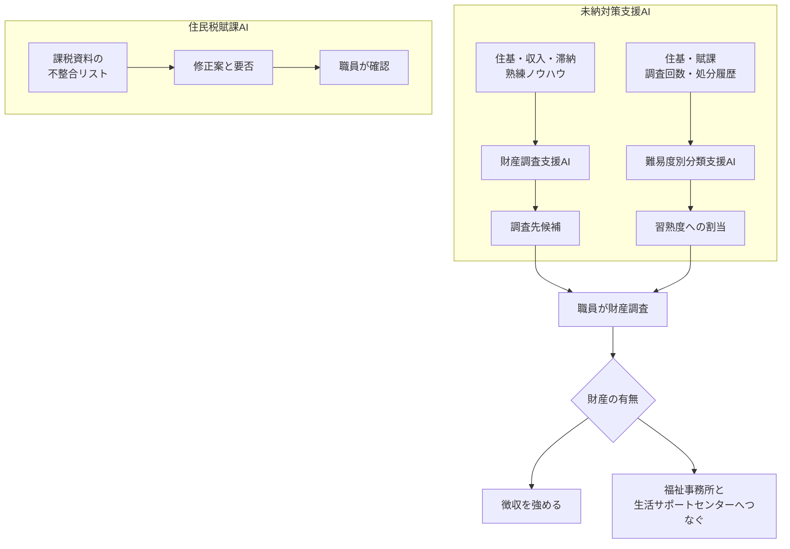

練馬区が住民税と国民健康保険料の滞納整理に導入した未納対策支援AIについて、公開されている機能、入力、その後に職員が行う仕事を追えます。日経クロステック2026年10月5日の記事は会員限定で、無料で読めるリードは、事務の効率化や徴収の強化に加え、滞納者の状況を把握して福祉事務所などへつなぐ狙いまでです。数値は練馬区、富士通Japan、総務省の公開資料によります。

*この記事の全体像。以下、順に解説します。*

## 練馬区の未納対策支援AIとは

練馬区は、住民税と国民健康保険料の滞納整理に「未納対策支援AI」を使っています。相手は富士通Japanです。運用開始は2024年4月1日です。対象税目は、2024年3月27日の区プレスが住民税と国民健康保険料と書いています。

公開されている機能は二つです。財産調査の調査先候補を示すことと、案件の難易度と職員の習熟度を組み合わせて担当を振り分けることです。別系統として、課税資料の不整合に修正案を出す「住民税賦課AI」があります。こちらは富士通が2019年10月に実証を始めたものです。二つのAIは、年度も仕事も分かれます。

2026年10月5日の記事リードは、事務の効率化や徴収の強化に加え、滞納者の状況を把握して福祉事務所などへつなぐことを狙いとして伝えています。

### 二つの出力

財産調査支援AIは、銀行などの調査先候補を職員に推薦します。学習に使うのは、数年分の住基、収入、滞納、熟練職員のノウハウです。行革甲子園2024のエントリーがそう書きます。図のラベルには、居住地、家族構成、所得、相談記録、滞納額があります。

難易度側の入力は、住基（住所・年齢）、賦課（給与所得・営業所得）、滞納（財産調査回数・処分履歴）です。習熟度は4段階、難易度は3段階です。過去の作業記録から難易度を推定し、習熟度の上がった職員へ難しい案件を振り分けます。

未納側は「どこを調べるか」と「誰が持つか」までを出します。その後の財産調査と、徴収か福祉かの振り分けは、職員側に残ります。

### 調査のあとで人が見る分岐

財産調査そのものは職員の仕事として残ります。エントリーの今後予定は、金融機関への照会と回答の取り込みをRPAで進める、と書きます。照会の送受信は、公開時点では今後の予定です。

財産がある場合は徴収を強めます。財産が無く、低所得や多重債務などで生活困窮がうかがえれば、福祉事務所や生活サポートセンターへつなぎます。2024年3月27日の区プレスは、福祉部門と連携した生活再建の支援を「強化する予定」と書きます。つなぐ判断は、調査のあとで財産の有無を見た職員の運用として書かれています。

AIは外部の結果を取りにいきません。住民情報システムと滞納管理システムの内部情報を組み合わせる、とエントリーの助言欄にあります。経過記録の文言を揃えると抽出の精度が上がる、とも書きます。

### 住民税賦課AIは別の仕事

住民税賦課AIは、不整合リストについて修正方法と修正要否を示します。2020年10月の結果では、AIの提案と職員判断の一致が98.4%です。

富士通は、整合している課税書類の選別は人手を介さずAIで実行できる、と書きます。修正はレコメンドです。「職員確認不要と判断したものを一括処理する機能」は、2020年10月時点では今後の提供です。2019年の実証項目には「住民税額の自動修正」があります。これは賦課側の記述であり、未納対策支援AIの機能一覧にはありません。

### 公開されている規模と委託料

エントリー時点の規模感は、人口741,540人（2024年1月1日）、納税義務者411,095人（2023年6月30日）、未納案件約35,000件です。

令和6年度の未納対策支援AI運用委託料は、予算13,756,000円、執行13,754,400円です。令和6年度主要事業がそう書きます。

未納側の出力は調査先候補と担当の割当までです。財産の有無を見て徴収を強めるか、福祉へつなぐかは、職員のあとの仕事です。賦課AIは別の箱で、課税資料の不整合に対する修正案を出し、職員が確認します。

## 注意点

見出しに出る9割は、調査先を選ぶ時間の短縮幅です。件数の削減率としては書かれていません。独立した監査の測定票は、今回参照した公開資料にはありません。数は区のプレス、区が書いたコンテスト応募、ベンダー配信の自己申告です。

### 9割の母数

| 指標 | 値 | 単位 | 出典の置き方 |
|---|---|---|---|
| 調査先の選定 | 1件あたり平均約30分が約3分 | 時間。90% | 区2024-03-27は期待される効果。富士通Japan同日は実証の過去形 |
| 財産調査の全体 | 1件平均60分が33分 | 時間。45% | 選定27分だけ減り、印刷・発送等30分は残る |
| 年間 | 2,475時間 | 時間の外挿 | 5,500件 × 27分 / 60 と一致。本文に乗算は無い |
| 習熟度マッチング | 約7% | 職員全員の調査業務時間 | 富士通Japanの実証。9割とは別 |
| 賦課AI | 53.1% または 57.4% | 修正作業時間 | 下記。9割の主体ではない |

2023年3月27日の開始発表は、30分の判断を約5分に短縮することを目指す、と書きます。開始時の資料は、効果測定を2023年6月末、検証を2023年9月末までと区切ります。2024年3月27日の富士通Japanは、実証期間を2023年3月27日から12月末までとし、その結果として約3分を書きます。3分の標本数は、どちらの文書にもありません。

区の2024年3月27日は運用開始前の発表で、9割と2,475時間は期待される効果の将来形です。同日のベンダーだけが実証の過去形です。

2,475時間を、監査済みの年間タイムシートとしては読めません。重点対応5,500人の選定が各1回、27分短くなる、という置き方と数が一致します。同じエントリーは「15名が300件ずつ」とも書き、15×300は4,500件です。資料は5,500との対応を定義しません。分母を4,500件に取り替える再計算は、資料側にありません。

「未納案件は約35,000件」と、試算図の「未納者全体35,500人」（重点5,500人＋通常30,000人）は、単位が件と人で分かれます。約数でもあります。500人の差としては読まず、対応関係は資料に書かれていません。

### 8倍はサンプルの箇所数

8倍は人数でも、1候補あたりの的中率でもありません。エントリーの表は、実証のサンプル調査です。AIなし200件で預金口座の判明が約50箇所、AIあり200件で約400箇所、と書きます。「約」が付きます。富士通Japanは「調査先候補数が4倍になり、預金口座など資産抽出件数が8倍」と書きます。候補が増えた結果の抽出件数であり、2024年4月以降の本番件数としては書かれていません。エントリーの「精度」は、富士通の文より強い語です。

ジチタイワークスは「約8倍も未納者の口座を突き止めることができた」と書きます。200件、約50箇所、約400箇所、サンプルであることは落ちています。元の数はエントリーの表です。

### 約2倍と4億円は文書が分かれる

エントリーの「従来の約2倍の処理」の直後の図は「AI活用の効果を試算（イメージ）」です。重点対応が5,500人から10,000人へ増え、通常対応が30,000人から25,500人へ減ります。全体35,500人は不変です。処理済み件数の実測ではありません。

令和6年度主要事業は「前年度比で約2倍の事案整理」と書きます。比較した前年度の件数も、「事案整理」の定義も、同じ段落にはありません。試算図の5,500人から10,000人とは、文書が別です。

4億円は、2023年3月27日の区と富士通Japanが「4億円以上の徴収効果を目指す」と書いた目標です。2024年3月27日の区PDF、富士通配信、行革甲子園エントリーは、4億円を達成額として再掲しません。達成は確認できません。

### 賦課AIの時間は別の数

| 文書 | 件数 | 時間 | 比率 |
|---|---|---|---|
| 区 2019-10-09 | 確認用リスト 72,619件。不整合は7万件超 | 給与特別徴収約33,000件を2週間で処理 | 削減率は無い |
| 区 2020-10-02 | 約6万件 | 提案なし想定1,450時間、提案あり680時間。削減幅770時間 | 53.1%。98.4%は職員判断との一致 |
| 富士通 2020-10-02 | 2020年度 約5.8万件 | 約1,450時間（予測）が約680時間 | 53.1% |
| 総務省ガイドブック（令和3年6月） | 件数の再掲は上記と混ぜない | 練馬 1,450時間から617時間。中央区 1,300時間から600時間 | 57.4% と 53.8% |

区プレスのリードは「770時間（53.1%）まで短縮」とも書きます。詳細欄は、残作業が680時間、削減効果が770時間（1,450−680）です。引用は詳細欄に合わせます。680時間と617時間は同じ起点でも残時間が違います。平均しません。98.4%は、正解データとの一致としては書かれていません。職員の判断との一致です。

総務省ガイドブックは賦課AIの時間を載せ、9割、8倍、2,475時間、4億円を肯定も否定もしません。

### 全国初の範囲と表彰欄

富士通Japanの2024年3月27日は、全国初の範囲を「習熟度に応じた振り分けと、財産調査先の選定を実業務に導入したこと」に限ります。2023年3月27日の資料は「財産調査業務へのAI活用は全国で初」と広く書きます。2019年の賦課AIは、別に「業界で初めて」と書きます。他自治体の網羅調査は、今回の資料にはありません。エントリーが挙げるLG-Net研修と東京税務レポートは、応募時点では公演予定・掲載予定です。

行革甲子園2024の練馬区は応募事例です。事例通番は2024-61です。愛媛県の応募事例一覧（ページ更新 2024年12月19日）では表彰欄が空です。受賞した、とは読めません。

### 公開資料の間で揃わない数

日経クロステック2024年7月18日の見える範囲には、未納対策が必要な案件が年間約1万件、預貯金の調査が年間延べ約16万件、学習項目に居住年数と所得控除、という記述があります。本編は未読です。区の一次は未納約35,000件と重点5,500人であり、1万件とは母数が揃っていません。居住年数と所得控除は、区のエントリー本文では確認できません。

同じ記事の見える範囲は、必要な情報をバッチでまとめて職員へ一括提供する、とも書きます。差押えは法令に基づく、という限定が付きます。未納対策支援AIが差押えを執行する、という読みの根拠にはしません。

2026年10月5日の記事は、タイトルに9割とあります。無料リードは二つのAIと福祉へのつなぎまでで、9割の単位はリードにありません。単位は2024年の区資料と一致する、と置きます。有料本文が9割の定義を独自に変えていないかは、本文未読のため未確認です。

次も、公開資料の範囲では閉じていません。

- 3分の標本数と、2023年9月末から12月末に何を足したか
- 15名×300件の4,500件と、重点5,500人の対応。約35,000件と試算図の35,500人は単位が違うので差し引きません
- 賦課AIの680時間と617時間のどちらが後の計算か。ガイドブックに照合表はありません
- 4億円のその後。福祉連携の件数。令和6年度「約2倍の事案整理」の定義
- 確認不要の一括処理が、2020年10月以降に賦課側で実装されたか
- 家族構成、相談記録、処分履歴の利用への批判、個人情報保護審議会の不承認、事故。利用自体はエントリーに書いてあります。批判は確認できません

## 選定時間として維持できる読み

未納対策支援AIが短くした、と一次が具体的に書いているのは、調査先を選ぶ時間です。幅は1件あたり約30分から約3分で、図の上では90%です。同じ図の業務全体は45%です。福祉へつなぐことは、調査後の人の方針として書かれ、公開の出力ラベルではありません。差押えの自動執行は、探した一次には機能として書かれていません。

9割を「選定時間」と読む結論は、図と合うので維持します。9割を「運用後に監査された業務全体の成果」と読む結論は維持しません。時制は、区の期待と、ベンダーの実証と、応募用紙の過去形を並べて書きます。

使うなら、目的と削減幅までに要約を止めます。9割は選定時間です。全体は同じ図で45%です。8倍は200件の口座箇所です。4億円は目標です。約2倍は、試算か、定義のない事案整理か、どちらの文書かを名指します。

一次が置いている数は、次の文書に残ります。

- 区2024年3月27日のPDFは、選定時間を約30分から約3分、90%、年2,475時間と書きます。[練馬区プレス 2024-03-27](https://www.city.nerima.tokyo.jp/kusei/koho/hodo/r6/r603/20240327.files/20240327.pdf)
- 行革甲子園の詳細は、60分から33分、45%、200件サンプルの箇所数、入力項目、福祉へのつなぎ方を書きます。[行革甲子園2024 詳細](https://www.pref.ehime.jp/uploaded/attachment/132996.pdf)
- 富士通Japan 2024年3月27日は、約7%、候補4倍、抽出8倍、実業務開始を書きます。[富士通Japan 2024-03-27](https://prtimes.jp/main/html/rd/p/000000278.000093942.html)
- 開始時の目標が約5分と4億円以上であることは、2023年3月27日の配信で分かれます。[富士通Japan 2023-03-27](https://info.archives.global.fujitsu/jp/group/fjj/about/resources/news/press-releases/2023/0327.html)
- 賦課AIの98.4%と時間は、区2020年10月2日、富士通2020年10月2日、総務省ガイドブックで別々に残ります。

## 出力と人の決定を分ける

ここから先は、区が実装した事実ではありません。公開されている出力と、その後の人の方針のあいだに、発注側がログの欄を置くときの提案です。

公開されているAIは「調べる先」と「持つ人」を選びます。執行候補と支援候補の分割は、調査のあとで人が財産の有無を見た方針です。選ぶログと、つなぐログは、同じ出力にはなっていません。

欄は三つに分けます。

| 欄 | 残すもの | 残さないもの |
|---|---|---|
| 選定の出力 | 調査先候補、難易度、推奨した担当 | 差押えの実行、福祉送致の決定 |
| 人の最終決定 | 執行に進む、支援へ回す、保留 | AIの候補リストそのもの |
| 是正 | 支援対象を誤って執行へ回したときの担当、戻した日時、理由 | 選定モデルの精度の自己申告 |

是正の欄を選定の欄へ混ぜると、誤送致の責任が「モデルがそう出した」に寄ります。最終決定の欄を空欄のまま執行へ進める操作は、人の決定が残ったことになりません。

入力は内部の住基、賦課、滞納、経過記録です。経過記録の文言が揃っていないと抽出がぶれる、という助言はエントリーにあります。相談記録や家族構成を特徴に使うことと、その利用への公開された批判は、別の事実です。批判は確認できません。

同じ境界は、賦課側にもあります。98.4%は職員判断との一致であり、確認不要の一括処理は2020年10月時点では今後の提供です。修正要否の提案と、職員が確定した修正は、別の欄です。

## まとめ

練馬区の未納対策支援AIは、2024年4月1日から、住民税と国民健康保険料の滞納整理で、調査先候補と担当の振り分けを出します。一次が具体的に短くしたと書いているのは、調査先を選ぶ時間で、約30分から約3分、図の上では90%です。財産調査の全体は同じ図で45%です。福祉へつなぐことは、調査後に職員が財産の有無を見た方針です。8倍は200件サンプルの口座箇所、4億円は2023年の目標、約2倍は文書ごとに定義が違います。住民税賦課AIの時間と98.4%は、別の仕事の数です。

発注側が残すなら、選定の出力、人の最終決定、是正の三つを同じ欄に混ぜません。9割を業務全体の監査結果としては読みません。

この記事が少しでも参考になった、あるいは改善点などがあれば、ぜひリアクションやコメント、SNSでのシェアをいただけると励みになります！

## 参考リンク

- [日経クロステック 2026-10-05](https://xtech.nikkei.com/atcl/nxt/column/18/03777/100100001/)
- [練馬区プレス 2024-03-27](https://www.city.nerima.tokyo.jp/kusei/koho/hodo/r6/r603/20240327.files/20240327.pdf)
- [行革甲子園2024 詳細](https://www.pref.ehime.jp/uploaded/attachment/132996.pdf)
- [行革甲子園2024 概要](https://www.pref.ehime.jp/uploaded/attachment/133281.pdf)
- [応募事例一覧](https://www.pref.ehime.jp/page/95965.html)
- [富士通Japan 2024-03-27](https://prtimes.jp/main/html/rd/p/000000278.000093942.html)
- [富士通Japan 2023-03-27](https://info.archives.global.fujitsu/jp/group/fjj/about/resources/news/press-releases/2023/0327.html)
- [練馬区 令和6年度主要事業](https://www.city.nerima.tokyo.jp/kusei/zaisei/kessan/r6/index.files/R6syuyoujigyou.pdf)
- [練馬区 令和5年度主要事業](https://www.city.nerima.tokyo.jp/kusei/zaisei/kessan/r5/index.files/R5syuyoujigyou.pdf)
- [練馬区プレス 2019-10-09](https://www.city.nerima.tokyo.jp/kusei/koho/hodo/h31/r110/20191009.files/20191009.pdf)
- [練馬区プレス 2020-10-02](https://www.city.nerima.tokyo.jp/kusei/koho/hodo/r2/r210/20201002-01.files/20201002.pdf)
- [富士通 2020-10-02](https://info.archives.global.fujitsu/jp/news/2020/10/2.html)
- [富士通 2019-10-09](https://info.archives.global.fujitsu/jp/news/2019/10/9.html)
- [総務省ガイドブック 令和3年6月](https://www.soumu.go.jp/main_content/000757187.pdf)
- [ジチタイワークス](https://jichitai.works/articles/3048)
- [日経クロステック 2024-07-18](https://xtech.nikkei.com/atcl/nxt/column/18/00001/09532/)
