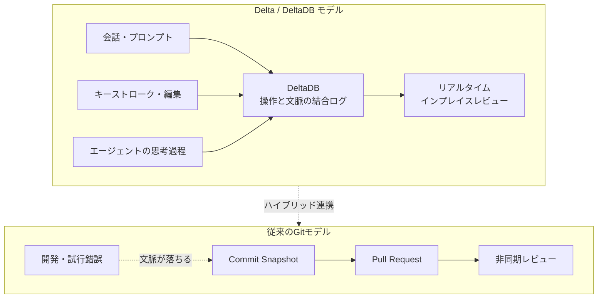
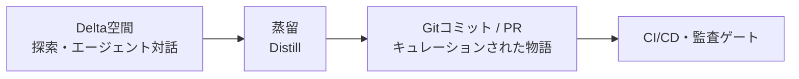

コーディングエージェントを使っていると、成果物より先に「なぜそうなったのか」が消えます。エージェントと何十往復もして到達したコードでも、コミットに残るのは最終状態だけです。試した案、却下した理由、指示の言い回し — レビューで一番効く情報が、コミットの手前で落ちています。

Zed Industries が公開した「Delta」と、その基盤の「DeltaDB」は、この落ちている部分を正面から拾いにいく設計です（[Introducing Delta](https://zed.dev/blog/introducing-delta)）。Git が確定したスナップショットを管理するのに対し、DeltaDB はキーストローク、編集操作、会話、エージェントの思考過程を細粒度で記録し、リアルタイムに同期します。

この記事では、次の 3 点を扱います。

- Delta / DeltaDB が Git と何を分担しているのか
- 「全部を記録して全部を共有する」設計が、どこで構造的に破綻しやすいのか
- 導入するとしたら、どの範囲に閉じるのが妥当か

対象読者は、チームへのコーディングエージェント導入を判断する立場の方、およびレビュー体制や CI/CD の設計を担う方です。

*この記事の全体像。以下、順に解説します。*

## Delta は何を記録しているのか

Git の記録単位はコミットです。コミットとコミットの間で起きたことは、原則として残りません。エージェントとの対話が開発の主要部分を占めるようになると、この「間」に判断のほとんどが入り込みます。

DeltaDB はこの間を記録対象にします。編集操作そのもの、エージェントとのスレッド、エージェントが何を根拠にその変更を選んだか。これらを CRDT ベースで保持し、参加者間で同期します。

この記録単位の違いから、いくつかの体験差が生まれます。

| 観点 | Git + PR | Delta / DeltaDB |
| --- | --- | --- |
| 記録の粒度 | コミット単位のスナップショット | 編集操作・会話・エージェント思考 |
| 会話とコードの関係 | PR コメントは差分に紐づき、差分が変わると剥がれる | コードの進化に追従して該当行に固定される |
| レビューのタイミング | 完成後の非同期 | 生成過程へのインプレイス介入 |
| 共同作業の単位 | ブランチとマージ | 同期された仮想ワークツリー |
| エージェントの扱い | 変更の生成元。過程は残らない | 同じコンテキストを共有する参加者 |

特徴として押さえておくべき点は 4 つです。

- **コードと会話の結合**: コメントやスレッドが差分から分離せず、コードの進化に追従して該当行に固定される
- **Agentic Multiplayer**: メンバーを招待すると同期された仮想ワークツリーが共有され、人間とエージェントが同じ文脈で同時に作業できる
- **インプレイス・レビュー**: PR 画面の差分から文脈を推測するのではなく、スレッド内でエージェントに直接質問しながら修正を指示できる
- **Delta Everywhere**: クラウドランナー、Web ブラウザ（Delta.dev）、Claude Code などのサードパーティ CLI との統合をサポート

## Git は置き換えられるのか

置き換えません。DeltaDB は Git リポジトリと並行して動作する設計です。Git がスナップショットを管理し、DeltaDB がコミット間の細粒度な過程を管理します。

一方で Zed は、レビューのモデルそのものは変えるべきだと提唱しています。「完成した差分を後から非同期に見る」のではなく、「コードが育つ過程にその場で介入する」形です。エージェントが生成している最中に人が口を挟めれば、レビューの往復は確かに短くなります。

ここは魅力的な主張ですが、そのまま組織のレビュー基盤に置き換えると壊れる箇所があります。

## 全履歴を保持する設計の構造的リスク

「すべての操作と対話を永続化・同期する」という前提には、4 つの摩擦があります。いずれも UX の粗さではなく、アーキテクチャから直接出てくる制約です。

### 1. 機密情報と「忘れられる権利」の衝突

一時的にペーストした API キーや個人情報が、削除後も操作ログ（Tombstone）として残存し得ます。CRDT の履歴は原則イミュータブルなので、「消したことにする」操作は入っても、「なかったことにする」ことは構造上むずかしい。GDPR のような完全削除を求める要件とは正面から衝突します。

判断材料としては、次の順に確認するのが実務的です。

1. その空間に機密情報が入る経路があるか（.env の貼り付け、本番ログの共有、顧客データのサンプル）
2. 履歴の物理削除（purge）手段が提供されているか、その粒度は何か
3. 同期先がどこか（自社テナントか、ベンダーのクラウドか）

### 2. AI コンテキストの腐敗

試行錯誤と失敗コードの履歴をすべて LLM に読ませると、注意予算（Attention Budget）が浪費されます。より厄介なのは、モデルが過去の誤った推論を「自分が一度そう考えた事実」として引きずり、同じ方向へ再収束することです。修正の成功率が落ち、局所解から抜けられなくなります。

「文脈は多いほど良い」は成り立ちません。**残す文脈と、渡す文脈は分けて設計する必要があります。** 記録として全部持つことと、エージェントに全部読ませることは別の判断です。

### 3. レビュアーの認知負荷

コードレビューの最大のコストは、指摘を書くことではなくコードを理解することです。試行錯誤を含む生ログのストリームは、その理解コストをさらに押し上げます。追い切れない量が流れてくると、人は読まずに承認します。形式的承認（Rubber-Stamping）は、レビュー品質を数字上は保ったまま、実質をゼロにします。

過程を残すこと自体は正しい。ただし、レビュー入力として使うなら**キュレーションされた形に落とす工程が要ります**。

### 4. 確定的な CI/CD と監査ゲートの不在

静的解析、E2E テスト、脆弱性スキャンは「確定した静止点」に対して走ります。リアルタイムに変化し続ける空間では、何をもって「この状態を検証した」と言うのかが曖昧になります。規制産業の監査要件（誰が、いつ、どの状態を承認したか）は、この静止点なしには満たせません。

## どう使うのが妥当か

以上を踏まえると、Delta の強みが素直に効く範囲ははっきりしています。

**短期的でエフェメラルな作業空間** — ローカルの探索、ペアプログラミング、エージェントとの試行錯誤。ここでは文脈の共有密度が高いほど速くなり、履歴の永続性はほとんど問題になりません。

逆に、組織全体の非同期レビュー基盤として全面採用するのは慎重であるべきです。上の 4 つの摩擦がすべて効いてくる領域だからです。

現実的な構成は、探索と確定を分けるハイブリッドです。

境界の置き方は次のとおりです。

| 工程 | 場所 | 目的 |
| --- | --- | --- |
| 探索・試行錯誤 | Delta 空間 | 速度と文脈共有を最大化 |
| チーム共有への蒸留 | 人が実施 | ノイズを落とし、意図を再構成 |
| 確定と検証 | Git コミット / PR | 静止点を作り CI と監査を通す |

この「蒸留」の工程が要点です。過程の記録は判断の材料としては価値がありますが、そのまま次の工程の入力にはできません。人がレビューする対象も、エージェントに渡す文脈も、CI が検証する対象も、すべて**選ばれた状態**である必要があります。

導入を検討するなら、次の順で判断できます。

1. 対象は探索フェーズに閉じているか（メインブランチへの合流経路に置いていないか）
2. 機密情報が入る経路を塞げるか、履歴の削除手段があるか
3. エージェントに渡すコンテキストを絞る手段があるか
4. Git コミットへ落とす蒸留の担当と手順が決まっているか
5. CI と監査は Git 側の静止点で担保されたままか

## まとめ

- Delta / DeltaDB は Git を置き換えず、コミット間の失われがちな過程を並行して記録する
- コードと会話の結合、インプレイス・レビュー、エージェントを含む同時作業が主な体験差
- 全履歴の永続化には、機密情報の残存、コンテキストの腐敗、認知負荷、静止点の不在という 4 つの構造的リスクがある
- 妥当な使いどころは短期的・エフェメラルな探索空間であり、チーム共有時には Git コミットや PR へ蒸留するハイブリッド構成が現実的
- 「記録として残す文脈」と「次工程へ渡す文脈」は分けて設計する

この記事が少しでも参考になった、あるいは改善点などがあれば、ぜひリアクションやコメント、SNSでのシェアをいただけると励みになります！

## 参考リンク

- [Introducing Delta — Zed Industries](https://zed.dev/blog/introducing-delta)
