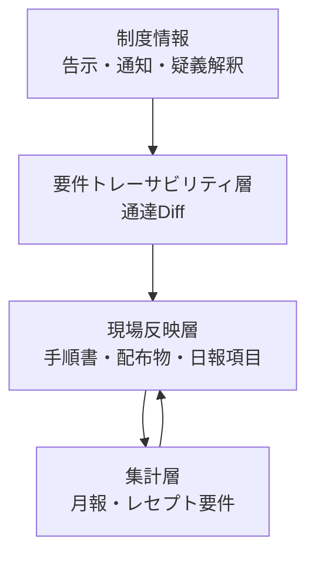
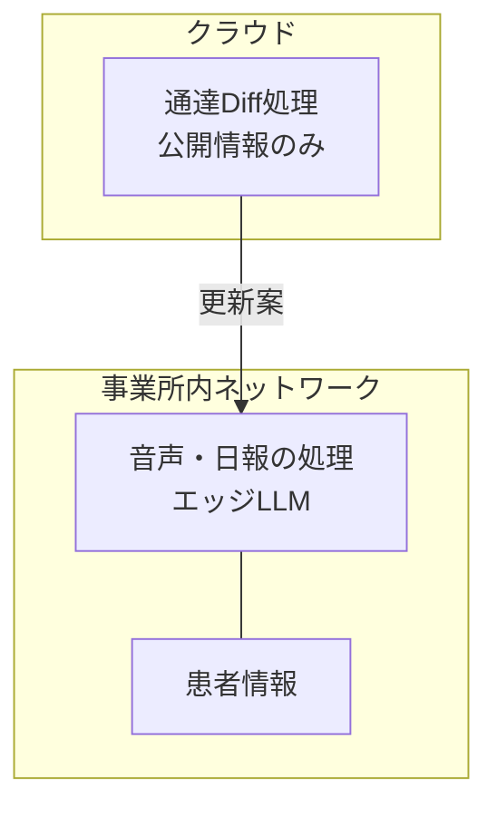

法令や通達の改定に追随する業務は、多くの現場で「通知を読む」ところで止まります。実際に必要なのは、改定内容を手順書・チェックリスト・日々の記録項目まで届け、記録として証拠が残る状態にすることです。

この記事では、訪問看護ステーションにおける診療報酬改定への対応を題材に、**制度文書の差分を現場の記録プロセスまで伝播させるシステム**をどう設計するかを整理します。扱うのは次の 3 点です。

- 決定論的な処理と LLM の分界をどこに引くか
- AI の幻覚を現場に持ち込まないための承認設計
- この構成が運用規模の拡大とともにどこで壊れるか

対象読者は、規制対応・監査対応の業務に AI を組み込むかを判断する立場の方です。特定の製品の使い方ではなく、**判断に必要な構造**を扱います。

*この記事の全体像。以下、順に解説します。*

## なぜ「通知を読んだ」では終わらないのか

制度情報は 1 枚の文書として届きません。基本方針・告示・通知・疑義解釈といった複数の文書に、それぞれ異なる時点で分かれて配布されます。つまり現場が受け取るのは、**時点の異なる変更パッチの集合**です。

この構造が、次の 2 つのコストを生みます。

| 課題 | 内容 |
|---|---|
| 差分の特定 | どの記述がいつ、どう変わったかを人手で突き合わせる必要がある |
| 影響範囲の特定 | 変わった記述が、自事業所のどの手順・どの記録項目に効くかが自明でない |

さらに、この作業を取りこぼした場合の損失が大きいことも特徴です。診療報酬の領域では、要件を満たさない算定が後から発覚すると、過去にさかのぼった返還を求められます。**間違いが発生してから発覚するまでの遅延が長く、その間に同じ間違いが積み上がる**構造になっています。

したがって、ここで作るべきものは「読解を助ける AI」ではなく、**改定 → 手順 → 記録項目、の対応関係を切らさずに保つ仕組み**です。要件トレーサビリティの問題として扱うのが適切です。

## 全体像 — 4 つの層に分けて考える

紹介されている実装（MOEGI）は、大きく 4 層に分かれます。

各層の責務は次のとおりです。

| 層 | 入力 | 出力 | 主な処理方式 |
|---|---|---|---|
| 制度情報 | 公開された行政文書 | 新旧の対応付け対象 | 取得のみ |
| 要件トレーサビリティ層 | 新旧の文書 | 変更点とチェックリスト項目の対応 | ルール + LLM |
| 現場反映層 | 承認された更新案 | 更新済みの手順書・記録項目 | 人の承認を伴う適用 |
| 集計層 | 日報の入力データ | 月報・算定要件の充足状況 | ルールのみ |

重要なのは、**層をまたぐたびに処理方式が変わる**点です。特に集計層は LLM を使いません。訪問回数のような数値の集計に確率的な処理を挟む理由がなく、監査時に説明できなくなるだけだからです。

## 分界線 — どこまでを決定論で固定するか

要件トレーサビリティ層の内部は、さらに 4 段に分かれます。

このうち LLM が担当するのは c だけです。設計判断としては次のように読めます。

- **a・b は決定論**: 項番のマッピングや文書構造の分割は、規則が明文化されている。LLM に任せると再現性を失うだけで得るものがない
- **c は LLM**: 「この改定は、うちの手順書のこの項目に効く」という意味的な対応付けは、規則として書き下せない。ここだけが LLM の担当領域
- **d は決定論 + 人**: 突合結果は候補であって決定ではない。確定させるのは人

つまり **LLM は「意味の橋渡し」だけに使い、identity（どの条文か）と計算（何回訪問したか）には使わない**という切り方です。この分界は、規制対応に限らず、監査可能性が要求される領域で共通して使える判断基準になります。

## 幻覚を現場に持ち込まない — 原文トレースと承認

規制対応で最も危険な失敗は、**存在しない改定が手順書に反映されること**です。誤った制度理解に基づいて記録項目を増減させると、その後の全記録が汚染されます。

これに対する対策は 2 つ組み合わせられています。

### 1. AI に原文を作文させない

LLM の出力形式を「要約文」ではなく「元の文 ID の引用」に固定します。出力に含まれるのは、どの条文を指しているかという参照であって、条文そのものの言い換えではありません。

この形にすると、以下が成立します。

- 出力に対して**原文へのリンクが必ず存在する**
- 存在しない条文を指した場合、参照解決の時点で検出できる
- 承認者が「AI の説明」ではなく**一次資料そのもの**を読める

### 2. 人が根拠条文を確認して承認する

突合結果は提案であり、適用前に人が承認・修正します。Human-in-the-Loop（HITL）の典型的な配置です。

ここで確認すべきなのは、承認画面に**根拠条文が同時に表示されているか**です。提案だけを見て承認する UI は、後述するとおり形骸化します。

## 患者情報を越境させない境界設計

もう 1 つの設計判断が、データの流れる範囲です。

- **クラウドへ送るのは公開情報だけ**: 通達・告示は誰でも参照できる文書であり、外部の LLM に送っても情報漏洩にならない
- **患者情報はローカルで完結**: 音声や日報の処理は同一イントラネット内で行う

この分離は「AI を使うかどうか」ではなく、**処理対象のデータ区分ごとに実行環境を変える**という判断です。規制産業で AI 導入を検討する際、最初に決めるべき線引きがここにあります。

## この構成の限界 — 拡大すると 3 か所で壊れる

ここまでの構成は、確実性と安全性を担保する手段として妥当です。ただし運用規模が拡大すると、構造的な欠陥が表に出ます。反証の観点から、3 点を挙げます。

### 1. 承認の形骸化とアカウンタビリティ・ギャップ

人が高精度な AI 提案を日常的に承認し続けると、批判的な検討をやめます。いわゆる**ゴム印化（rubber-stamping）**です。オートメーション・バイアスとして知られる現象で、精度が高いほど起きやすいという厄介な性質があります。

結果として次が起きます。

- 万一 AI が幻覚を起こしても、承認をすり抜ける
- にもかかわらず、責任は「承認した人間」に帰属する

**HITL は安全装置として設計されるが、運用の中で責任転嫁の装置へ変質しうる**ということです。「人が承認しているから安全」という説明は、承認が実質的に行われている証拠がなければ成り立ちません。

### 2. オントロジードリフトによる保守コスト

決定論的なルールベースと LLM を組み合わせた構成は、制度変更のたびにパーサーやルールエンジンを人手で改修する必要があります。文書構造や項番体系そのものが変わると、決定論側が追随できないためです。

制度変更が頻繁な領域では、この改修コストが加速度的に膨らみます。**LLM を最小限にした設計が、結果として人手の保守を最大化する**という逆説がここにあります。

### 3. ハイブリッド構成特有の脆弱性

LLM の出力を決定論的なコード側で動的に解釈・実行させる設計は、入力検証が不十分だと任意コード実行（RCE）につながります。LLM アプリケーションのフレームワークでは、実際にこの型の脆弱性が報告されています（CVE-2024-21513、CVE-2024-3098。いずれも NIST National Vulnerability Database で深刻度を確認できます）。

境界をまたぐ設計を選んだ以上、**その境界が攻撃面になる**という前提で入力サニタイズを設計する必要があります。

## 判断基準 — どの規模なら採用してよいか

以上を踏まえると、採否の判断は規模とスコープで分かれます。

| スコープ | 判断 | 理由 |
|---|---|---|
| 短期・小規模 （特定の改定区分に限定） | **採用してよい** | 返還リスクの回避効果が、保守コストと承認負荷を上回る |
| 長期・大規模 （全区分・多事業所） | **移行を前提に設計する** | 保守コストと承認の形骸化が効いてくる |

大規模側で検討される移行先が、**階層的自律性（Tiered Autonomy / Human-on-the-Loop）**です。すべてを承認させるのではなく、例外時のみ人が介入する形へ寄せます。

移行するかどうかにかかわらず、承認プロセス側には形骸化対策を組み込む必要があります。具体的には、認知的な負荷を意図的に調整する設計です。

- 高リスクな変更にのみダブルチェックを強制する
- 承認前に根拠条文の該当箇所を明示的に確認させる
- 「すべて承認」のような一括操作を、リスク区分ごとに制限する

いずれも UI の工夫に見えますが、実質的には**承認が実際に行われている証拠を残すための設計**です。

## 検証すべきこと

この型を自組織で検討する場合、判断材料として次を取りに行くのが妥当です。

1. **承認 UI のプロトタイプ検証** — 根拠条文を並置した承認画面で、実際に指摘・修正が発生するかを測る。発生しないなら形骸化している
2. **ルールエンジンの保守コストの定量化** — 改定 1 回あたりの改修工数を実測し、エンドツーエンド型との総所有コストを比較する
3. **境界の入力サニタイズの監査** — クラウドとローカルをまたぐ経路で、LLM 出力を実行系へ渡す箇所を洗い出す

いずれも「AI が使えるか」ではなく、**この構成を何年運用できるか**を測る観点です。

## まとめ

- 制度改定への対応は読解ではなく、**改定 → 手順 → 記録項目の対応関係を切らさない要件トレーサビリティの問題**として扱う
- LLM は**意味的な対応付けにだけ**使い、条文の同定と数値集計は決定論に固定する
- 幻覚対策は「AI に原文を作文させず、文 ID を引用させる」形が有効。承認画面には根拠条文を並置する
- 患者情報はローカル、公開情報だけをクラウドへ、というデータ区分ごとの実行環境分離を先に決める
- この構成は小規模スコープでは有効だが、拡大すると**承認の形骸化・保守コストの膨張・境界の脆弱性**の 3 か所で壊れる
- 大規模化を見込むなら、例外時のみ介入する階層的自律性への移行を設計に織り込む

この記事が少しでも参考になった、あるいは改善点などがあれば、ぜひリアクションやコメント、SNSでのシェアをいただけると励みになります！

## 参考リンク

- [通達は「読んだ」だけでは現場に届かない — 訪問看護の改定を、レセプト前の手順まで更新する通達Diff AI（Zenn / toshi-naka）](https://zenn.dev/toshikusa/articles/e73bd343e29ce1)
- NIST National Vulnerability Database（CVE-2024-21513、CVE-2024-3098）
