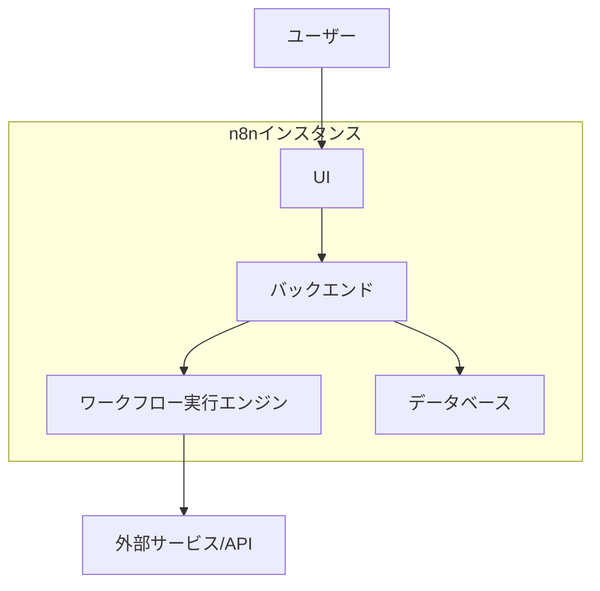
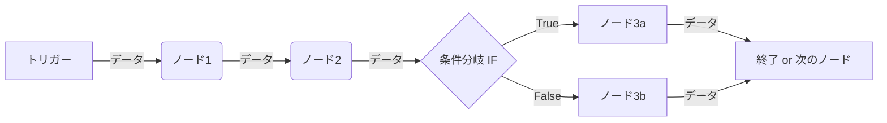

# 第1章: n8n の世界へようこそ - 概要と基本概念

この章では、n8n がどのようなツールであり、どのような問題を解決するのかを解説します。n8n の誕生経緯や設計思想、基本的なアーキテクチャ、ライセンス体系、そして具体的な活用事例を通じて、n8n の全体像と可能性を掴みます。

## 1.1. n8n とは何か？ - ローコード自動化プラットフォーム

n8n は、プログラミングの知識が少なくても、様々なWebサービスやツールを連携させ、日々の業務プロセスを自動化できる「ローコード自動化プラットフォーム」です。視覚的なインターフェース（UI）を使って、まるでブロックを繋げるようにワークフローを構築できます。

### 1.1.1. n8n の目的と特徴

n8n は、誰もが簡単に自動化の恩恵を受けられる世界を目指しています。その主な特徴は以下の通りです。

| 特徴               | 説明                                                                         |
| :----------------- | :--------------------------------------------------------------------------- |
| **ノードベース**   | 各処理（API連携、データ加工など）を「ノード」という単位で表現します。        |
| **視覚的UI**       | ドラッグ＆ドロップでノードを繋ぎ、ワークフローの流れを直感的に作成できます。 |
| **高い拡張性**     | 多くの標準ノードに加え、カスタムノードを作成して機能を追加できます。         |
| **柔軟な実行環境** | 自身のサーバー (Self-Hosted) または n8n Cloud で実行できます。               |
| **オープンソース** | 基本機能はオープンソースとして公開されており、自由に利用・改変できます。     |

### 1.1.2. n8n が解決する課題

n8n は、以下のようなビジネス上の課題解決に貢献します。

* **繰り返し作業の自動化:** 定型的なデータ入力、レポート作成、通知などを自動化し、人的ミスを削減し時間を節約します。  
* **複数サービス間のデータ連携:** CRM、MAツール、チャットツール、データベースなど、異なるシステム間でデータをスムーズに連携させます。  
* **API操作の簡略化:** プログラミング不要で、様々なWebサービスのAPIを利用した処理を実行できます。  
* **プロトタイピング:** 新しい連携アイデアや自動化プロセスを迅速に試作し、検証できます。  
* **情報収集の効率化:** Webサイトからの情報取得（スクレイピング）やAPI経由でのデータ収集を自動化します。

### 1.1.3. 他の自動化ツールとの比較 (概念レベル)

n8n は多くの自動化ツールの一つですが、それぞれ特徴が異なります。

| ツール名              | 主な特徴                                                                 | ターゲットユーザー層                   | n8n との主な違い                                                                                                       |
| :-------------------- | :----------------------------------------------------------------------- | :------------------------------------- | :--------------------------------------------------------------------------------------------------------------------- |
| **n8n**               | オープンソース、高い拡張性、Self-Hosted可能、ノードベースの視覚的UI      | 開発者、テクニカルなビジネスユーザー   | Self-Hostedの自由度が高い、より複雑なロジックやデータ操作が可能、ライセンス体系（Sustainable Use License）             |
| **Zapier**            | SaaS型、豊富な連携サービス数、シンプルなUI                               | 非技術者、マーケター、ビジネスユーザー | より手軽に始められる、連携アプリ数が非常に多い、ステップ数や実行回数に基づく料金体系                                   |
| **IFTTT**             | SaaS型、個人利用向け、アプレットと呼ばれるシンプルな連携                 | 一般消費者、スマートホームユーザー     | よりシンプルで「If This Then That」の形式に特化、ビジネス用途よりは個人利用向け                                        |
| **Make (Integromat)** | SaaS型、視覚的なフローが特徴的、高度な機能も提供                         | ビジネスユーザー、自動化コンサルタント | シナリオ（ワークフロー）の視覚表現が独特、データ構造の扱いが強力、操作回数に基づく料金体系                             |
| **Node-RED**          | オープンソース、Node.jsベース、フローベースプログラミング、IoT連携に強み | 開発者、メイカー、IoTエンジニア        | JavaScriptでのカスタマイズ性が高い、ハードウェア連携やMQTTなどIoT関連機能が豊富、n8nよりプログラミング寄りの知識が必要 |

## 1.2. n8n の歩みとこれから

n8n がどのようにして生まれ、進化してきたのか、その歴史的背景と将来の展望について解説します。

### 1.2.1. 開発の背景と歴史

創設者 Jan Oberhauser 氏の動機や初期の開発経緯、オープンソース化に至るまでのストーリーを紹介します。n8n は、既存ツールの制約に不満を感じた Jan 氏が、より柔軟でパワフルな自動化ツールを目指して開発を始めました。オープンソースとして公開されたことで、世界中の開発者コミュニティからの貢献を受け、急速に成長しました。

### 1.2.2. 主要なバージョンアップと変遷

* **初期リリース (2019年):** 基本的なノードベースのワークフローエンジンとUIを提供。  
* **コミュニティノードの導入:** ユーザーが独自のノードを開発・共有できる仕組みを導入し、連携可能なサービスの幅が大きく広がりました。  
* **n8n Cloud の提供開始:** Self-Hosted に加えて、マネージドなクラウドサービスを提供し、導入のハードルを下げました。  
* **ライセンス変更:** Fair Code License から Sustainable Use License へ移行し、プロジェクトの持続可能性とコミュニティへの貢献のバランスを図りました。  
* **UI/UX の改善:** より直感的で使いやすいインターフェースへの継続的な改良が行われています。  
* **パフォーマンス向上:** 大規模なワークフローや高頻度の実行に対応するためのアーキテクチャ改善が継続的に行われています。

### 1.2.3. 今後のロードマップと展望

n8n は、今後も継続的な機能強化と改善が予定されています。公式ロードマップやコミュニティでの議論からは、以下のような方向性がうかがえます。

* **連携サービスの拡充:** より多くのSaaSやツールとの連携を標準でサポート。  
* **AI機能の統合:** ワークフロー内でのAI活用（テキスト生成、データ分析など）を容易にする機能の追加。  
* **エンタープライズ機能の強化:** 大規模組織での利用を想定した管理機能、セキュリティ機能の向上（SSO、RBACなど）。  
* **開発者体験の向上:** カスタムノード開発や組み込み（Embedding）をより容易にするためのツールやSDKの改善。  
* **コミュニティ主導の成長:** コミュニティからの貢献をさらに促進し、エコシステムを拡大。

## 1.3. アーキテクチャと動作原理

n8n が技術的にどのように構成され、ワークフローがどのように実行されるのか、その基本的な仕組みを解説します。

### 1.3.1. 全体構成 (サーバー、UI、実行エンジン)

n8n は、いくつかの主要コンポーネントで構成されています。

| 要素名                       | 説明                                                                                                                                           |
| :--------------------------- | :--------------------------------------------------------------------------------------------------------------------------------------------- |
| **ユーザー**                 | Webブラウザを通じて n8n を操作する人。                                                                                                         |
| **n8n UI**                   | ワークフローを作成・編集・管理するためのグラフィカルインターフェース。Vue.js で構築されています。                                              |
| **n8n バックエンド**         | UIからのリクエスト処理、ワークフロー定義の保存・読み込み、実行エンジンへの指示などを行うコア部分。Node.js で構築されています。                 |
| **ワークフロー実行エンジン** | 実際にワークフローの各ノードを実行し、データを処理・連携させるコンポーネント。                                                                 |
| **データベース**             | ワークフロー定義、認証情報 (Credentials)、実行履歴などを保存するデータベース。デフォルトは SQLite ですが、PostgreSQL や MySQL も利用可能です。 |
| **外部サービス/API**         | ワークフローが連携する対象となる、Slack、Google Sheets、各種Web APIなど。                                                                      |

### **1.3.2. ワークフロー実行の仕組み (概要)**

ワークフローは、トリガーを起点として、ノードからノードへとデータを受け渡しながら実行されます。

| 要素名                 | 説明                                                                           |
| :--------------------- | :----------------------------------------------------------------------------- |
| **トリガー**           | ワークフローの実行を開始するきっかけ（スケジュール、Webhook など）。           |
| **ノード1, 2, 3a, 3b** | 個々の処理（データ取得、加工、通知など）を実行する単位。                       |
| **条件分岐 IF**        | 入力データに基づいて、次に実行するノードを切り替えるノード。                   |
| **データ**             | ノード間で受け渡される情報。通常は JSON 形式のアイテムとして扱われます。       |
| **終了 or 次のノード** | ワークフローの処理が完了するか、さらに後続のノードへ処理が続くことを示します。 |

## **1.4. ライセンスと提供形態**

n8n は、利用者のニーズに合わせて複数の提供形態とライセンスを用意しています。

### **1.4.1. オープンソースライセンス (Sustainable Use License)**

n8n のコア機能は、**Sustainable Use License** の下で公開されています。これは、ソースコードの自由な閲覧、利用、改変を許可する一方で、n8n の機能をそのまま利用して競合する商用サービスを提供することなどに一部制限を設けるライセンスです。以前は Fair Code License でしたが、より持続可能な開発体制を目指して変更されました。詳細な条件は公式サイトで確認することが重要です。

### **1.4.2. n8n Cloud, Pro, Enterprise エディションの違い**

n8n は Self-Hosted 版（オープンソース）に加えて、有料のクラウドプランも提供しています。

| エディション            | 提供形態           | 主な特徴                                                                                              | ターゲット                                     |
| :---------------------- | :----------------- | :---------------------------------------------------------------------------------------------------- | :--------------------------------------------- |
| **Self-Hosted**         | オープンソース     | 自身でサーバー管理、自由度が高い、無料（サーバー費用は別途）                                          | 開発者、技術者、コストを抑えたいユーザー       |
| **n8n Cloud (Starter)** | SaaS               | n8n 社によるホスティング、手軽に開始可能、基本的な機能、実行回数制限あり                              | 個人、小規模チーム、トライアル                 |
| **n8n Cloud (Pro)**     | SaaS               | Starter より多くの実行回数、チーム機能、優先サポートなど                                              | 中小規模ビジネス、本格的な利用                 |
| **n8n Enterprise**      | SaaS / Self-Hosted | 高度なセキュリティ機能 (SSO, RBAC)、専用サポート、SLA、大規模利用向けのスケーラビリティ、監査ログなど | 大企業、高度なセキュリティ・管理要件を持つ組織 |

### **1.4.3. Self-Hosted と Cloud の選択基準**

どちらの形態を選ぶかは、利用者の状況や要件によって異なります。

| 観点             | Self-Hosted のメリット                       | Self-Hosted のデメリット                     | n8n Cloud のメリット                             | n8n Cloud のデメリット                 |
| :--------------- | :------------------------------------------- | :------------------------------------------- | :----------------------------------------------- | :------------------------------------- |
| **コスト**       | ソフトウェアライセンスは無料                 | サーバー運用・管理コストが発生               | サーバー管理不要、予測可能な月額/年額費用        | 実行量に応じた費用、無料枠には制限あり |
| **管理**         | 完全なコントロール、自由なカスタマイズ       | インストール、設定、アップデート、監視が必要 | インフラ管理不要、すぐに利用開始                 | カスタマイズの自由度が低い             |
| **セキュリティ** | ネットワーク内で完結可能、独自の対策を適用可 | 自身でセキュリティ対策を講じる必要がある     | n8n 社によるセキュリティ対策、データセンター管理 | データが外部 (n8n Cloud) に置かれる    |
| **拡張性**       | サーバーリソースを自由に拡張可能             | 自身でスケーリングを計画・実行する必要がある | プランに応じて自動的にスケール（制限あり）       | プランによる上限あり                   |
| **機能**         | 最新機能をすぐに試せる場合がある             | Enterprise 機能は別途ライセンスが必要        | 簡単なセットアップ、プランに応じた機能           | Self-Hosted の Enterprise 機能は対象外 |

**選択のポイント:**

* **技術力とリソース:** サーバー管理の知識や時間があるか？  
* **コスト:** 初期費用 vs 運用費用、実行量に応じた費用。  
* **セキュリティ要件:** データを外部に出せるか？独自のセキュリティポリシーが必要か？  
* **管理の手間:** インフラ管理の手間を省きたいか？  
* **必要な機能:** Enterprise 機能が必要か？

## **1.5. 導入事例とベストプラクティス**

### **1.5.1. 具体的な企業・個人の導入事例紹介**

#### A. マーケティング部門におけるn8n活用事例

マーケティング部門では、広告効果測定、リード管理、顧客コミュニケーションなど、多岐にわたる業務でデータ連携と自動化が求められます。n8nはこれらの課題に対し、効率化と高度化を実現するソリューションを提供します。

| 活用例                                                                | 主な課題                                                                         | 主な成果                                                                                               | 代表事例/情報源                                                                                                                                       |
| :-------------------------------------------------------------------- | :------------------------------------------------------------------------------- | :----------------------------------------------------------------------------------------------------- | :---------------------------------------------------------------------------------------------------------------------------------------------------- |
| 広告プラットフォームのレポート自動集計とBIツール/スプレッドシート連携 | 手作業でのデータ収集・集計の非効率性、ミス発生リスク、データ統合の手間           | レポート作成時間の大幅削減、エラー率低下、迅速な意思決定支援、データドリブンな施策改善                 | [Dropsolid](https://n8n.io/case-studies/dropsolid/)                                                                                                   |
| フォームからの問い合わせ内容のCRM自動登録と担当者へのSlack通知        | 手動でのCRM登録作業のミス・遅延、リード対応の遅れ、迅速な情報共有の困難          | リード対応の迅速化、手動入力の排除、情報共有の円滑化、顧客満足度向上                                   | [Groove Technology Blog](https://groovetechnology.com/blog/software-development/everything-you-need-to-know-about-n8n-workflows-to-automate-smarter/) |
| メールマーケティングリストの自動更新、セグメント別配信                | リスト鮮度維持の困難、手動セグメント分けの煩雑さ、非ターゲット配信による効果低減 | ターゲティング精度の向上、開封率・クリック率改善、配信作業の効率化、パーソナライズドキャンペーンの実現 | [Dropsolid](https://n8n.io/case-studies/dropsolid/)                                                                                                   |

#### B. セールス部門におけるn8n活用事例

セールス部門では、リードの質向上、商談プロセスの効率化、タイムリーな情報共有が成功の鍵となります。n8nは、これらの活動を自動化し、営業担当者がより価値の高い業務に集中できる環境を構築します。

| 活用例                                       | 主な課題                                                               | 主な成果                                                                       | 代表事例/情報源                                                                                                                                                                                                                                                                                                                                         |
| :------------------------------------------- | :--------------------------------------------------------------------- | :----------------------------------------------------------------------------- | :------------------------------------------------------------------------------------------------------------------------------------------------------------------------------------------------------------------------------------------------------------------------------------------------------------------------------------------------------ |
| リード情報の自動エンリッチメント（情報付加） | 手動でのリード情報調査・付加の非効率性、時間消費、情報の陳腐化         | 営業アプローチの質向上、生産性向上、パーソナライズされたセールスインサイト生成 | [Groove Technology Blog](https://groovetechnology.com/blog/software-development/everything-you-need-to-know-about-n8n-workflows-to-automate-smarter/), [AIFire](https://www.aifire.co/p/ai-powered-lead-generation-automate-your-way-to-success-with-n8n), [Coverflex (Clay連携)](https://www.01growth.com/post/clay-data-enrichment-outreach-platform) |
| 商談状況の変化の関係者への自動通知           | 手動通知の手間、情報伝達の遅延・漏れ、チーム連携の停滞                 | リアルタイムな情報共有、チーム連携強化、対応迅速化、営業効率向上               | [Slack社 (Workato事例)](https://lp.yoom.fun/blog-posts/ipaas-complete-guide), [キラメックス社 (Anyflow事例)](https://lp.yoom.fun/blog-posts/ipaas-complete-guide)                                                                                                                                                                                       |
| 契約書作成プロセスの一部自動化               | 手動での情報転記の非効率性、入力ミスリスク、承認フロー・版管理の煩雑さ | 契約書作成時間短縮、ヒューマンエラー削減、コンプライアンス遵守強化             | [Hostinger Tutorials](https://www.hostinger.com/tutorials/n8n-workflow-examples), [Softailed Blog](https://softailed.com/blog/n8n-vs-make), [awesome-n8n (document-generator)](https://github.com/restyler/awesome-n8n)                                                                                                                                 |

#### C. 開発・運用部門におけるn8n活用事例

開発・運用（DevOps）部門では、CI/CDパイプラインの効率化、システム監視とインシデント対応の迅速化、定型的な運用タスクの自動化が求められます。n8nは、これらのプロセスを連携・自動化し、開発サイクルの高速化とシステムの安定稼働に貢献します。

| 活用例                                                                   | 主な課題                                                                      | 主な成果                                                                           | 代表事例/情報源                                                                                                                                           |
| :----------------------------------------------------------------------- | :---------------------------------------------------------------------------- | :--------------------------------------------------------------------------------- | :-------------------------------------------------------------------------------------------------------------------------------------------------------- |
| GitHub や GitLab のイベントをトリガーに CI/CD パイプラインを実行         | 手動でのビルド・テスト・デプロイの非効率性、人的ミス、CI/CD設定・連携の複雑さ | 開発サイクルの迅速化、品質向上、パイプライン構築・管理の容易化                     | [NobleProg Training](https://www.nobleprog-om.com/cc/n8ndevops), [n8n Git Documentation](https://docs.n8n.io/source-control-environments/understand/git/) |
| サーバー監視アラートを検知し、インシデント管理ツールに起票、担当者に通知 | 手動でのアラート対応の遅延、サービス影響拡大リスク、運用負荷                  | インシデント対応迅速化、ダウンタイム最小化、運用負荷軽減、ITSMワークフロー時間短縮 | [Deda.Tech](https://n8n.io/case-studies/dedatech/), [Delivery Hero](https://n8n.io/case-studies/delivery-hero/)                                           |
| 定期的なデータベースのバックアップやメンテナンス作業の自動化             | 手動作業の失念・ミスリスク、夜間・休日作業の負担                              | 作業確実性向上、人的ミス削減、運用負荷軽減、安定稼働への貢献                       | [Deda.Tech](https://n8n.io/case-studies/dedatech/), [DT Solution](https://dt-solution.com/n8n%E3%81%A8%E3%81%AF%E4%BD%95%E3%81%8B%EF%BC%9F/)              |

#### D. 人事・総務部門におけるn8n活用事例

人事・総務部門では、入退社手続き、経費精算、情報共有など、多くの定型業務や部門横断的な連携業務が発生します。n8nはこれらのプロセスを自動化し、業務効率の向上と従業員満足度の向上に貢献します。

| 活用例                                   | 主な課題                                                                                 | 主な成果                                                                                 | 代表事例/情報源                                                                                                                                                                                                                                                                                                        |
| :--------------------------------------- | :--------------------------------------------------------------------------------------- | :--------------------------------------------------------------------------------------- | :--------------------------------------------------------------------------------------------------------------------------------------------------------------------------------------------------------------------------------------------------------------------------------------------------------------------- |
| 入社手続きに関する書類作成や通知の自動化 | 手作業による書類作成・アカウント発行・通知の煩雑さ、ミス・遅延リスク、人事担当者の負荷大 | オンボーディングプロセス時間短縮、手作業削減、新入社員への迅速な情報提供、従業員体験向上 | [Atakinteractive Blog](https://www.atakinteractive.com/blog/n8n.io-the-rising-star-in-workflow-automation-explained), [n8n Workflow Template](https://n8n.io/workflows/3860-automate-employee-onboarding-with-slack-jira-and-google-workspace-integration/), [n8n Case Studies (ChatHQ)](https://n8n.io/case-studies/) |
| 経費精算データの会計システムへの連携     | 手作業でのデータ入力・連携の非効率性、入力ミスリスク、月末月初業務の逼迫                 | 仕訳作成時間短縮、人的ミス削減、税制コンプライアンス遵守強化、業務効率向上               | [n8n Workflow Template (Mindee連携)](https://n8n.io/workflows/1466-extract-expenses-from-emails-and-add-to-google-sheets), [K-Analytics Blog (QuickBooks連携)](https://k-analytics.com/how-small-businesses-can-use-ai-to-access-quickbooks-data-in-slack-or-any-other-chat-tool/)                                     |

#### E. 個人利用におけるn8n活用事例

n8nは、ビジネスシーンだけでなく、個人の日常生活や副業における様々なタスクの自動化にも活用できます。情報収集の効率化から、スマートホームデバイスの連携、タスク管理の最適化まで、アイデア次第で多様な応用が可能です。

| 活用例                                                           | 主な課題                                                                 | 主な成果                                                                             | 代表事例/情報源                                                                                                                                                                                                                                           |
| :--------------------------------------------------------------- | :----------------------------------------------------------------------- | :----------------------------------------------------------------------------------- | :-------------------------------------------------------------------------------------------------------------------------------------------------------------------------------------------------------------------------------------------------------- |
| 特定のキーワードを含むニュース記事を収集し、チャットツールに通知 | 複数情報源の個別チェックの手間、重要情報の見逃しリスク                   | 効率的な情報収集、タイムリーな情報把握、関心事への集中                               | [n8n Workflow Template - RSS Feed News Processing](https://n8n.io/workflows/2785-rss-feed-news-processing-and-distribution-workflow/), [Reddit Community](https://www.reddit.com/r/n8n/comments/1j9gx7b/throw_your_hardest_n8n_workflow_at_me_ill_build/) |
| スマートホームデバイスの連携                                     | 複数デバイス・プラットフォーム間の連携の難しさ、複雑な自動操作設定の困難 | 高度でパーソナライズされたスマートホーム環境構築、生活の利便性向上                   | [n8n Community Forum - Building a Smarter Life by Automating Life](https://community.n8n.io/t/building-a-smarter-by-automating-life/77914)                                                                                                                |
| 個人のタスク管理ツール間の連携                                   | 複数ツール併用時の重複入力、進捗同期の手間、管理の煩雑化                 | タスク管理の一元化、入力手間削減、進捗状況の可視化、生産性向上                       | [Asana n8n Integration](https://asana.com/ja/apps/n8n), [aka-link.net - ローコードツールn8nの紹介](https://aka-link.net/lowcode-n8n/)                                                                                                                     |
| 小規模ビジネス・フリーランスの業務自動化 (Bordr社の例)           | 複数サービス間での手作業の増加、生産性・顧客体験維持の困難               | 生産性大幅向上、顧客体験向上、スケーラブルな事業運営の実現（Bordr社: $100k収益達成） | [Bordr Case Study](https://n8n.io/case-studies/bordr/)                                                                                                                                                                                                    |

### **1.5.2. n8nの高度な活用戦略**

#### AI機能の戦略的活用：インテリジェント・オートメーションの実現

n8nは、大規模言語モデル（LLM）をはじめとするAI技術との連携により、ワークフローに高度な「知能」を組み込むことを可能にします。これにより、従来の自動化の枠を超えたインテリジェント・オートメーションが実現します。

##### n8nとLLMの連携概要

n8nは、ChatGPTに代表されるLLMとの連携を標準でサポートしています。この連携により、以下のようなタスクを自動化できます。

* 自然言語による指示に基づいたタスクを実行します。
* 大量のテキストデータから要点を抽出し、分類します。
* ブログ記事やメール文面などのコンテンツを自動で生成します。

##### n8nによる洗練されたAI活用パターン

| パターン名                   | 概要                                                                                                               | 活用例                                                                                                                                                 |
| :--------------------------- | :----------------------------------------------------------------------------------------------------------------- | :----------------------------------------------------------------------------------------------------------------------------------------------------- |
| プロンプトチェーン           | 複数のLLMを直列に接続します。あるモデルの出力を次のモデルの入力とすることで、段階的に成果物の質を高めます。        | 製品レビュー入力 → LLM1で要約 → LLM2で翻訳 → LLM3で宣伝コピー生成、といった多段階の処理を自動化します。                                                |
| 並列処理                     | 大量入力を複数のバッチに分割します。それぞれを異なるLLMインスタンス等で同時処理し、最後に結果を統合します。        | 大量の文章を分割して同時に要約する場合や、一度に複数言語へ翻訳する場合に有効です。                                                                     |
| オーケストレーターとワーカー | 全体設計を行う「オーケストレーター」役のLLMと、個別サブタスクを処理する複数の「ワーカー」役のLLMを組み合わせます。 | 大規模なコーディングタスクを機能単位に分割します。各機能を別々のワーカーLLMが分担してコード生成を行い、最後にオーケストレーターが統合します。          |
| 評価と最適化                 | 主となるLLMが生成したアウトプットを、別のLLMが検証します。品質基準に基づきフィードバックや再生成指示を行います。   | 生成された文章が特定の品質基準を満たしているか評価します。基準に満たない場合は、改善指示と共に再生成を要求し、要求水準に達するまで処理を繰り返します。 |

##### AI AgentとLangChain連携による高度な自動化

n8nは、「AI Agent」ノードやLangChainとの連携機能も提供しています。これにより、さらに自律的で複雑なAIワークフローを構築できます。

* **AI Agentの活用例:**
    1.  顧客からの問い合わせメールの内容をAI Agentが解析します。
    2.  解析結果に基づき、緊急度や内容に応じて自動的に優先順位を付けます。
    3.  担当者にSlackで通知し、関連情報をCRMシステムに記録する、といった高度な処理フローを実現します。
* **RAG（Retrieval Augmented Generation）の活用例:**
    1.  社内ドキュメントやデータベース（ナレッジベース）から関連情報を検索します。
    2.  検索した情報を基に、LLMがユーザーの質問に対して精度の高い回答を生成します。
    3.  これにより、社内向けQ&Aボットや情報検索システムを構築できます。

##### AI機能活用の意義

n8nのAI連携機能は、従来のルールベースの自動化から、文脈を理解し、判断し、創造的なアウトプットを生み出す「インテリジェント・オートメーション」への進化を促します。これは、作業時間の削減に加えて、業務の質そのものを変革し、新たな価値創出や競争優位性の確立に貢献します。

#### 効果的なワークフロー構築と運用のためのベストプラクティス

n8nの機能を最大限に活用し、安定的かつ効率的な自動化を実現するためには、ワークフローの設計思想と運用管理における規律が重要です。主要なベストプラクティスを以下にまとめます。

| 原則                                                 | 概要とポイント                                                                                                                                                                                                                                                                                                                                     |
| :--------------------------------------------------- | :------------------------------------------------------------------------------------------------------------------------------------------------------------------------------------------------------------------------------------------------------------------------------------------------------------------------------------------------- |
| **ワークフローは小さく、目的に特化させる**           | **理由:** 単一ワークフローに多機能を詰め込むと複雑化し、理解や問題特定、将来の修正・拡張が困難になります。 **推奨事項:** 各ワークフローは単一の明確な目的を持たせ、理解とメンテナンスを容易にします。必要に応じて複数ワークフローを連携させます。                                                                                              |
| **エラーハンドリングとリトライ処理を確実に実装する** | **背景:** 外部API障害、ネットワーク不安定、予期せぬデータ形式等でエラーが発生する可能性があります。 **n8nの対応機能:** Error Triggerノード、Ifノード、アクションノードのリトライ機能。 **目的:** これらを活用し、ワークフロー停止を回避し、管理者通知や自己修復を試みる堅牢なシステムを構築します。                                        |
| **機密データの保護を徹底する**                       | **対象:** APIキー、パスワード、個人情報等。 **n8nの対応機能:** クレデンシャル管理機能。 **運用上の注意点:** クレデンシャル機能の適切な利用。セルフホスティング時のサーバーセキュリティ対策。データフローを意識し、不要な箇所での機密情報のログ出力や外部送信を避ける設計をします。                                                         |
| **定期的な監視と継続的な最適化を行う**               | **重要性:** ワークフローは一度作って終わりではありません。 **実施項目:** 実行状況、意図通りの動作、エラー有無、パフォーマンスを定期的に確認します。 **AI機能利用時の追加考慮点:** API利用料金や処理時間等のコスト面も評価・改善します。 **改善手法:** ログ分析や実行履歴からボトルネックや改善点を見つけ、常に最適な状態を維持します。 |

これらのベストプラクティスを遵守することは、n8nによる自動化の恩恵を長期的に享受し、ビジネス価値を最大化するための鍵となります。自動化の対象範囲が拡大し、ワークフローの数や複雑性が増すにつれて、これらの運用管理の規律はますます重要になります。

