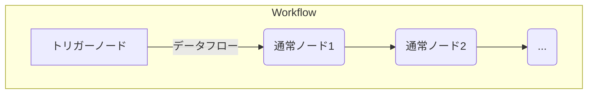
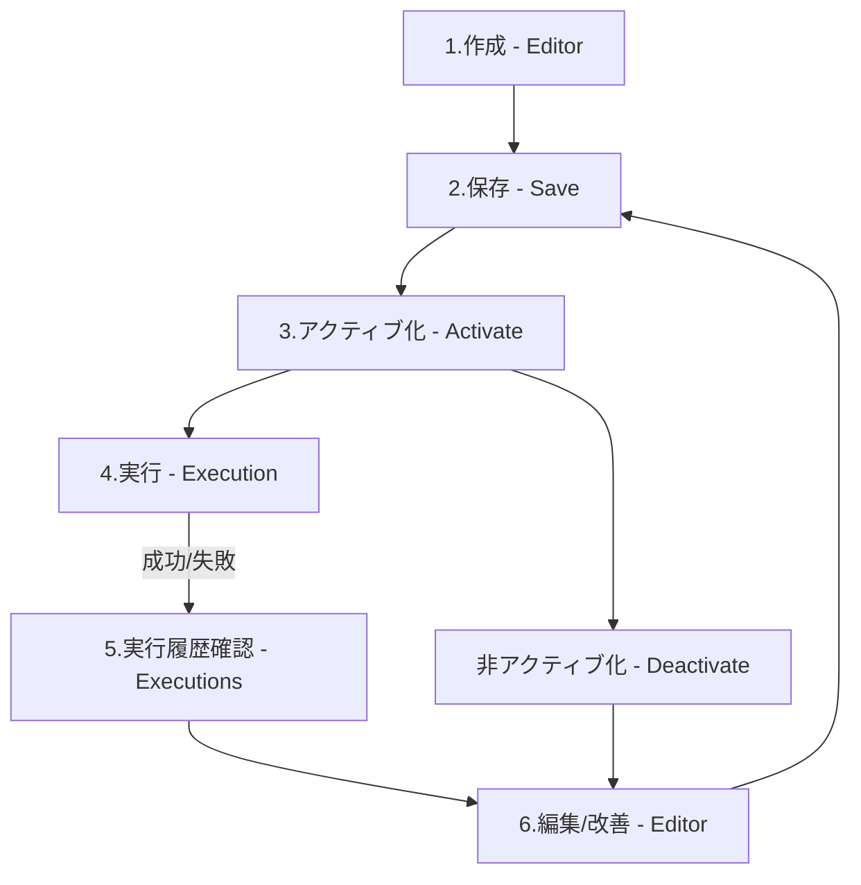
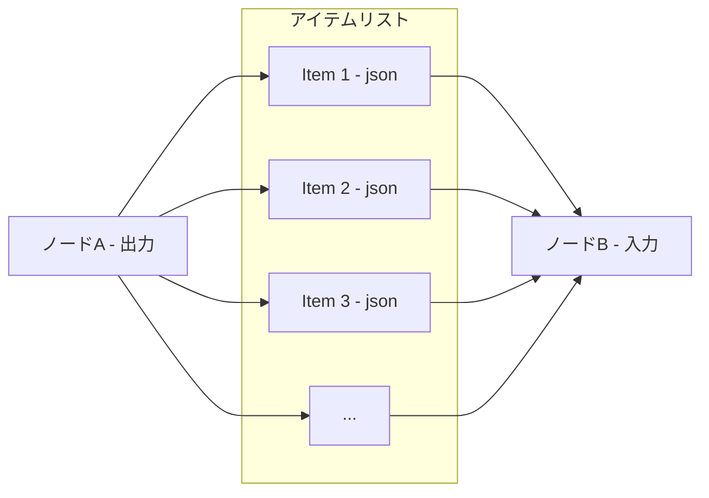

# 第2章: コア機能詳解 - n8n を構成する要素

この章では、n8n の中核をなす機能であるワークフロー、ノード、トリガー、データ処理、認証について、その仕組みや使い方を詳しく解説します。これらの要素を理解することが、n8n を効果的に活用するための鍵となります。

## 2.1. ワークフロー (Workflow) - 自動化の中心

n8n における「ワークフロー」とは、一連の自動化された処理の流れを定義したものです。

### 2.1.1. ワークフローの構造 (ノード、コネクション、トリガー)

ワークフローは、主に以下の要素で構成されます。



| 要素名                            | 説明                                                                                                 |
| :-------------------------------- | :--------------------------------------------------------------------------------------------------- |
| **トリガーノード (Trigger Node)** | ワークフローの実行を開始する特別なノード。各ワークフローに通常1つだけ配置されます。                  |
| **通常ノード (Regular Node)**     | データ取得、加工、外部サービス連携など、具体的な処理を実行するノード。                               |
| **コネクション (Connection)**     | ノード間を結ぶ線。データの流れる方向を示します。通常、前のノードの出力が次のノードの入力となります。 |
| **データフロー (Data Flow)**      | コネクションを通じてノード間を流れるデータのこと。                                                   |

### **2.1.2. ワークフローのライフサイクル (作成、実行、管理)**

ワークフローは、作成から実行、そして管理というサイクルを辿ります。



| 要素名                           | 説明                                                                                                                                       |
| :------------------------------- | :----------------------------------------------------------------------------------------------------------------------------------------- |
| **1. 作成 (Editor)**             | n8n エディタ（キャンバス）上で、ノードを配置し、コネクションで繋ぎ、各ノードの設定を行います。                                             |
| **2. 保存 (Save)**               | 作成または編集したワークフローを保存します。                                                                                               |
| **3. アクティブ化 (Activate)**   | ワークフローを実行可能な状態にします。アクティブ化されていないワークフローはトリガーされても実行されません。                               |
| **4. 実行 (Execution)**          | トリガー（スケジュール、Webhookなど）によって、または手動でワークフローが実行されます。                                                    |
| **5. 実行履歴確認 (Executions)** | ワークフローがいつ、どのように実行され、成功したか失敗したか、各ノードの入出力データなどを確認します。エラー発生時のデバッグに不可欠です。 |
| **6. 編集/改善 (Editor)**        | 実行結果や要件の変化に基づき、ワークフローを修正・改善します。                                                                             |
| **非アクティブ化 (Deactivate)**  | ワークフローの実行を一時停止します。                                                                                                       |

## **2.2. ノード (Node) - 機能のブロック**

ノードは、n8nワークフローにおいて特定のタスクを実行するための基本的な構成要素です。ワークフローを構築する上で不可欠な部品となります 1。ノードが担う主な機能には、ワークフローの開始、外部ソースからのデータの取得や外部サービスへのデータの送信、そしてワークフロー内を流れるデータの処理や操作が含まれます 1。これらの機能を通じて、ユーザーは単純なものから複雑なものまで、多岐にわたる自動化プロセスを設計することが可能です。

### **2.2.1. ノードの役割と種類 (通常ノード、トリガーノード)**

n8nのノードは、その運用上の役割に基づいて、大きく二つの主要なカテゴリに分類されます。これらは、ワークフローの起動を担当する「トリガーノード」と、起動されたワークフロー内で具体的な処理を実行する「通常ノード（アクションノード）」です。

  * トリガーノード (Trigger Nodes):
    これらのノードは、ワークフローの実行を開始する起点として機能します。外部で発生する特定のイベント（例: Webhookへのリクエスト受信、アプリケーション内での変更）や、事前に定義された条件（例: 定期的なスケジュール実行）を検知し、ワークフローを起動します 1。ユーザーがn8nのインターフェースで「トリガー」操作を選択すると、対応するトリガーノードがワークフローキャンバスに追加され、通常はワークフローの最初のステップとして配置されます。n8nのUIでは、トリガー操作は稲妻のアイコン (⚡) で視覚的に区別されます 1。たとえば、新しいワークフローを作成する際には、「最初のステップを追加 (Add first step)」を選択すると、n8nはトリガーノード専用の検索・閲覧パネルを開きます。これは、トリガーがワークフローの基盤となることを示唆しています。
  * 通常ノード (アクションノード) (Regular Nodes / Action Nodes):
    これらのノードは、実行中のワークフローにおいて、データに対する具体的なタスクや操作を実行します。主な機能としては、外部システムからのデータ取得、処理済みデータの外部サービスへの送信、データ構造の変換、条件に基づいた処理の分岐などが挙げられます 1。ユーザーが「アクション」操作を選択すると、対応するアクションノードがワークフローに追加され、通常はトリガーノードや他のアクションノードの後続に接続されます。既存のノードから「+」コネクタを選択することで、これらのアクションノードを追加できます。このUI上の違いは、トリガーがワークフローの開始点であり、アクションがその基盤の上で処理を積み重ねていくという、それぞれの概念的な役割を反映しています。

この二種類のノードの明確な理解は、効果的なワークフロー設計の第一歩となります。以下の表は、これらのノードの役割と代表的な例をまとめたものです。

| 種類                                                           | 役割                                                                                                             | 例                                                                                                      |
| :------------------------------------------------------------- | :--------------------------------------------------------------------------------------------------------------- | :------------------------------------------------------------------------------------------------------ |
| **トリガーノード (Trigger Node)**                              | ワークフローの実行を開始する起点となります。外部イベントの発生やスケジュールに基づいてワークフローを起動します。 | Schedule (定期実行), Webhook, Slack Trigger, Google Sheets Trigger, On App Event (各種アプリイベント) 1 |
| **通常ノード (アクションノード) (Regular Node (Action Node))** | ワークフロー内でデータの取得、加工、条件分岐、外部サービスへの送信など、具体的な処理を実行します。               | HTTP Request, Set, IF, Merge, Slack, Google Sheets, Function, Loop Over Items                           |

### **2.2.2. 主要な標準ノード解説 (カテゴリ別)**

n8nは、多種多様なタスクに対応するため、豊富な組み込みノードを提供しています。さらに、ユーザーは特定のニーズに合わせて独自のカスタムノードを開発し、n8n環境に統合することも可能です 1。これにより、標準機能だけではカバーしきれない特殊な要件にも柔軟に対応可能です。

n8nのノードは、機能に基づいていくつかのカテゴリに分類されます。従来の「データ操作」「フロー制御」「サービス連携」といった分類は、n8nの進化に伴い、より公式なカテゴリ構造に対応づけられています。たとえば、「データ操作」や「フロー制御」に関連するノードの多くは**コアノード (Core Nodes)** に含まれます。「サービス連携」は、主に特定のサードパーティサービスとの連携を担う**アクションノード (Action Nodes)** に該当しますが、汎用的なHTTP Requestノードのような一部のコアノードもこの役割を担います。近年では、特に**AIノード (AI Nodes)** が新たな主要カテゴリとして確立され、その重要性と専門性が高まっています 4。

このカテゴリ構造の進化、特にAI関連機能の充実は、n8nが単なるタスク自動化ツールから、より高度で知的な自動化プラットフォームへと発展していることを示しています。これは、単に新しい連携先が増加するということ以上に、根本的に新しい種類のワークフロー構築能力を獲得していることを意味します。

以下に、主要なノードカテゴリとその代表的なノード、主な機能を示します。

| カテゴリ                                           | 主要なノード例                                                     | 主な機能                                                                                                                                          |
| :------------------------------------------------- | :----------------------------------------------------------------- | :------------------------------------------------------------------------------------------------------------------------------------------------ |
| **コアノード (Core Nodes)**                        |                                                                    |                                                                                                                                                   |
| *データ操作*                                       | Set                                                                | 新しいデータフィールドの追加、既存の値の変更、またはデータアイテム全体の置換を行います 4。                                                        |
|                                                    | Function                                                           | JavaScriptコードを実行し、高度なデータ変換、カスタムロジック、複雑な計算を実行します 4。                                                          |
|                                                    | Merge                                                              | 複数の入力ブランチからのデータアイテムを、指定したモード（例: Append, Merge by Index, Merge by Key）に基づいて結合します 4。                      |
|                                                    | Item Lists                                                         | アイテムのリストに対して、フィルタリング、ソート、分割、集約などの操作を実行します。                                                              |
| *フロー制御*                                       | IF                                                                 | 設定された条件に基づいて、ワークフローの実行パスを2つ以上に分岐させます。                                                                         |
|                                                    | Switch                                                             | 複数の条件と出力パスを定義し、入力アイテムのデータに基づいて適切なパスにルーティングします。                                                      |
|                                                    | Loop Over Items (旧 Split In Batches)                              | 大量のデータアイテムを指定したバッチサイズに分割し、ループ処理を実行します。ループ用出力 (loop) と完了時出力 (done) の2つの出力を持っています 6。 |
|                                                    | Wait                                                               | 指定した時間、または特定の条件が満たされるまでワークフローの実行を一時停止します 4。                                                              |
|                                                    | Execute Workflow                                                   | 別のn8nワークフローを呼び出して実行し、モジュール化されたワークフロー設計を可能にします 1。                                                       |
|                                                    | Stop And Error                                                     | ワークフローの実行を意図的に停止し、カスタムエラーメッセージを生成します。Error Triggerと連携可能です 1。                                         |
| **アクションノード (Action Nodes) - サービス連携** |                                                                    |                                                                                                                                                   |
|                                                    | HTTP Request                                                       | 任意のWeb APIやHTTPエンドポイントに対して、GET, POSTなどのリクエストを送信し、レスポンスを取得・処理します 4。                                    |
|                                                    | Slack                                                              | Slackへのメッセージ送信、ファイルアップロード、チャンネル管理などの操作を行います 3。                                                             |
|                                                    | Google Sheets                                                      | Googleスプレッドシートの行の読み取り、追加、更新、削除を行います 3。                                                                              |
|                                                    | Google Drive                                                       | Google Drive上のファイルのアップロード、ダウンロード、検索、管理を行います。                                                                      |
|                                                    | Email (Send Email / Email Read IMAP)                               | SMTPプロトコルでのメール送信、IMAPプロトコルでのメール受信・検索を行います。(IMAPはトリガーとしても使用可能です) 3                                |
|                                                    | Database (Postgres, MySQL, etc.)                                   | 各種リレーショナルデータベースやNoSQLデータベースへの接続、SQLクエリの実行、データの読み書きを行います 4。                                        |
|                                                    | File / Read Binary File / Write Binary File                        | サーバーのローカルファイルシステム上のファイルの読み書き、バイナリデータの操作を行います 3。                                                      |
| **AI ノード (AI Nodes)**                           |                                                                    | 4                                                                                                                                                 |
|                                                    | AI Agent (各種エージェント)                                        | 会話型AI、プラン実行型AIなど、特定の目的を持った自律的なAIエージェントを構築・実行します。                                                        |
|                                                    | LLM Nodes (Basic LLM Chain, OpenAI, Azure OpenAI, Google Gemini等) | 大規模言語モデル(LLM)と連携し、テキスト生成、質問応答、翻訳などのタスクを実行します 4。                                                           |
|                                                    | Summarization Chain                                                | 長文テキストを要約します 4。                                                                                                                      |
|                                                    | Vector Store Nodes (Pinecone, Qdrant, Supabase Vector Store等)     | ベクトルデータベースと連携し、セマンティック検索、RAGのためのデータ永続化と検索を実行します 4。                                                   |
|                                                    | Embeddings Nodes (OpenAI, Azure OpenAI Embeddings等)               | テキストデータをベクトル表現（埋め込み）に変換します 4。                                                                                          |
| **ユーティリティノード (Utility Nodes)**           |                                                                    | (コアノード内の機能的分類) 4                                                                                                                      |
|                                                    | No Operation, do nothing (NoOp)                                    | 何も処理を行わないノードです。ワークフローの分岐点やデバッグ時のプレースホルダーとして使用します 4。                                              |
|                                                    | Debug Helper                                                       | ワークフローの特定ポイントでデータの内容や構造を確認するためのデバッグを支援します 4。                                                            |

### **2.2.3. ノードの設定とパラメータ**

ワークフローキャンバス上でノードを選択すると、通常はn8nエディタの右側にそのノード固有の設定パネルが表示されます。パラメータの入力は、テキストフィールド、ドロップダウンリスト、トグルスイッチ、数値入力など、様々な形式で行います。

  * 式 (Expressions):
    多くのパラメータフィールドでは、値を動的に設定するために「式」を利用できます。式が利用可能なフィールドには通常、\</\> アイコンが表示されます。式を使用することで、前のノードの出力データを参照したり、簡単な計算や文字列操作を行ったりすることが可能です。たとえば、前のノードの出力に含まれる特定のプロパティを参照するには `{{ $json.propertyName }}` のように記述します。特定の名前を持つ前のノード（例: "HTTP Request Node"）の出力データを参照するには `{{ $node.json.outputPropertyName }}` のように記述します 8。式はJavaScriptに似た構文を採用しており、n8nに組み込まれたメソッドや変数も利用できます 9。

  * 認証情報 (Credentials):
    外部サービスと連携するノード（例: Google Sheets, Slack, 各種API）では、多くの場合、事前にn8n内に登録・設定された認証情報（APIキー、OAuth2トークンなど）をドロップダウンリストから選択する必要があります 3。認証情報はn8n内で一元的に管理され、セキュリティの向上と再利用性の確保に貢献します 3。

  * オプション (Options) / ノード設定 (Node Settings):
    各ノードには、その動作をより細かく制御するための共通設定や、ノード種別特有のオプションが用意されています 1。これらの設定を理解し活用することで、より堅牢で柔軟なワークフローを構築できます 1。

      * **ノード共通設定 (General Node Settings):** 1
          * **Notes (注記):**
              * Notes: ノードに関する説明やコメントを自由記述形式で保存できます。ワークフローの意図を明確にするために役立ちます。
              * Display note in flow: このオプションを有効にすると、Notes に記述した内容（またはその一部）がワークフローキャンバス上のノードのサブタイトルとして表示され、ワークフロー全体の可読性が向上します。
          * **On Error (エラー時の動作):** ノード実行時にエラーが発生した場合の挙動を制御する重要な設定です。
              * Stop Workflow (ワークフローを停止): エラー発生時、ワークフロー全体の実行を即座に停止します。多くのノードでデフォルトの動作です。
              * Continue (続行): エラーが発生しても、ワークフローの実行を次のノードへ継続します。エラーが発生したノードは空のデータを出力するか、最後に成功した実行データを保持する場合があります（挙動はノードにより異なることがあります）。
              * Continue (using error output) (エラー出力を使用して続行): ワークフローの実行を継続し、エラー情報（メッセージ、スタックトレース等）自体を次のノードへの出力として渡します。これにより、ワークフロー内でカスタムのエラーハンドリングロジックを実装できます。
          * **Always Output Data (常にデータを出力):** 有効にすると、ノードの処理結果がデータなしであった場合でも、空のアイテムを出力します。IFノードなどで使用する際には、意図しない無限ループを引き起こす可能性があるため注意が必要です 1。
          * **Execute Once (一度だけ実行):** ノードは、その実行ラウンドで受け取った最初の入力アイテムのデータでのみ一度だけ実行されます。後続のアイテムは無視されます。

    これらの詳細なエラーハンドリングオプションや実行制御オプションは、n8nが単純な線形処理だけでなく、より複雑でフォールトトレラントな自動化設計をサポートするプラットフォームへと進化していることを示しています。開発者はこれらの機能を活用することで、例外を適切に管理し、より信頼性の高いワークフローを構築できます。

      * **リクエストオプション (Request Options):** 主にHTTP Requestノードなど、外部へのリクエストを行うノードで設定可能なオプションです 1。
          * Batching: 大量の入力アイテムを処理する際のバッチサイズやバッチ間の待機時間などを制御します。
          * Ignore SSL Issues: SSL証明書の検証に失敗した場合でも、リクエストを続行します（セキュリティリスクを理解した上で慎重に使用する必要があります）。
          * Proxy: リクエストに使用するHTTP/HTTPSプロキシサーバーを指定します。
          * Timeout: リクエストが完了するまでの最大待機時間（ミリ秒単位）を設定します。

  * **ノード操作コントロール (Node Controls):** ワークフローキャンバス上のノードにマウスカーソルを合わせると表示される操作アイコンです 1。

      * Test step (テストステップ): 選択したノードのみを、現在の入力データ（トリガーの場合はサンプルデータ）で実行します。
      * Deactivate (非アクティブ化): ノードを一時的に無効にします。無効化されたノードはワークフロー実行時にスキップされます。
      * Delete (削除): ノードをワークフローから削除します。
      * Node context menu (ノードコンテキストメニュー): 通常、ノード上の三点リーダー（...）アイコンのクリックや右クリックで表示され、以下の操作などが可能です。
          * Open node (ノードを開く): 設定パネルを開きます。
          * Rename node (ノード名を変更): ノードの表示名を変更します。
          * Pin node (ノードをピン留め): ノードの出力データをパネルに常に表示させます。
          * Copy node (ノードをコピー) / Duplicate node (ノードを複製)
          * Select all (すべて選択) / Clear selection (選択をクリア)

## **2.3. トリガー (Trigger) - ワークフローの起点**

トリガーは、n8nワークフローが自動的に実行を開始するための「きっかけ」を提供する、極めて重要なコンポーネントです 10。トリガーノードは、外部イベントの発生や事前に定義された設定（例：スケジュール）に基づいてワークフローを実行する特別なノードです 2。

### **2.3.1. トリガーの種類 (スケジュール、Webhook、手動など)**

n8nは、様々な自動化シナリオに対応するため、多様な種類のトリガーを提供しています。これらのトリガーを理解し、適切に選択することが、効果的なワークフロー設計の鍵となります。トリガーの種類が多様化していること、特にError TriggerやMCP Server Triggerのような専門性の高いトリガーが登場していることは、n8nが単純なイベント応答型自動化だけでなく、より複雑で状態管理を伴うサービス指向の連携パターンにも対応可能なプラットフォームへと成熟していることを示しています。

| 種類                                                                                  | 説明                                                                                                                                                                                                                                               | 主な用途                                                                                                                                        |
| :------------------------------------------------------------------------------------ | :------------------------------------------------------------------------------------------------------------------------------------------------------------------------------------------------------------------------------------------------- | :---------------------------------------------------------------------------------------------------------------------------------------------- |
| **Schedule (スケジュール)**                                                           | 設定した時間間隔（例: 毎時、毎日午前9時、毎週月曜日）でワークフローを自動的に実行します。                                                                                                                                                          | 定期的なレポート作成、バッチ処理、データ同期、リマインダーなどに使用されます 2。                                                                |
| **Cron (クロン)**                                                                     | Cron式を使用して、より複雑で柔軟なスケジュール（例: 毎月第1月曜日の午前10時、平日の1時間ごと）でワークフローを実行します。Scheduleトリガーのカスタムオプションとして提供されます。                                                                 | Scheduleトリガーの標準的な間隔設定では対応できない、高度な定期実行要件に対応します 11。                                                         |
| **Webhook (ウェブフック)**                                                            | n8nが生成する一意のURLに対し、外部システムからHTTPリクエスト（通常POST）が送信されるとワークフローを実行します。リクエストのペイロードデータをワークフロー内で利用可能です。                                                                       | 外部サービスからのリアルタイムイベント通知（例: フォーム送信、決済完了、チャットボット連携）、APIとしてのワークフロー公開などに使用されます 1。 |
| **サービストリガー / アプリイベントトリガー (Service Triggers / App Event Triggers)** | 特定の連携サービス（例: Slack, Gmail, Google Sheets, GitHub）内で特定のイベント（例: 新規メッセージ受信、新規行追加、新規コミット）が発生したことを検知してワークフローを実行します。検知方法はポーリングまたはサービス提供のWebhookを利用します。 | 特定のアプリケーションのイベントに即応した自動化処理（例: 新規メールの自動分類、スプレッドシート更新時の通知）などに使用されます 1。            |
| **Manual (手動)**                                                                     | n8nエディタ上の実行ボタン（Test Workflowまたは個々のトリガーノードのテスト実行）を押すことで、手動でワークフローを開始します。                                                                                                                     | ワークフローの開発・テスト、デバッグ、設定変更後の動作確認、一時的な手動実行などに使用されます 2。                                              |
| **Error Trigger (エラートリガー)**                                                    | 同じn8nインスタンス内の他のワークフローでエラーが発生し、そのワークフローがこのエラートリガーを持つワークフローをエラー処理用として指定している場合に実行されます。                                                                                | ワークフローの実行時エラーの集中監視、エラー発生時の通知（Slack, Email等）、エラー情報の記録、自動復旧処理の試行などに使用されます 1。          |
| **(Advanced) MCP Server Trigger (MCPサーバートリガー)**                               | n8nをModel Context Protocol (MCP) サーバーとして機能させ、外部のMCPクライアントがn8nのツールやワークフローを呼び出せるようにします。                                                                                                               | n8nで構築したツールやワークフローを、MCPをサポートする外部のAIシステムやエージェントに公開・連携などに使用されます 14。                         |

なお、以前存在したActivation Triggerは非推奨となり、n8n TriggerノードおよびWorkflow Triggerノードに置き換えられています 15。古いワークフローで遭遇した場合は、これらの新しいノードへの移行を検討してください。

### **2.3.2. 各トリガーの設定方法と注意点**

各トリガーには固有の設定項目と、運用上の注意点があります。これらを正確に理解することが、安定的かつ意図通りに動作するワークフローを実現するために不可欠です。特にWebhookトリガーのような汎用性の高いトリガーは設定オプションが豊富であり、これらを活用することで、セキュリティの確保や外部システムとのより柔軟な連携が可能になります。

  * **Schedule/Cron (スケジュール/クロン):**
      * **設定方法:**
          * **Schedule:** Trigger Intervalで「Seconds」「Minutes」「Hours」「Days」「Weeks」「Months」などの基本間隔を選択し、Minutes Between Triggers, Trigger at Hour, Trigger on Weekdaysといった具体的な実行タイミングを設定します 2。Timezone設定は、意図した時刻に実行させるために極めて重要です 2。
          * **Cron:** ScheduleトリガーのTrigger Intervalで「Custom (Cron)」を選択し、ExpressionフィールドにCron式（例: 0 9 \* \* 1-5 で平日の午前9時）を入力します 11。Cron式の詳細な構文については、crontab.guruのような外部ツールも参考になります。
      * **注意点:**
          * **タイムゾーン:** タイムゾーンの誤設定は実行時刻のずれに直結します。特にサマータイムが存在する地域では注意が必要です 2。
          * **Scheduleトリガーのルールの組み合わせ:** Scheduleトリガーで複数のルール（例：「毎時0分」と「15分ごと」）を設定すると、ルールが加算的に解釈され、意図しない頻度（例：毎時0分、15分、30分、45分）で実行されることがあります。複雑なスケジュールはCron式で明確に定義する方が確実です 16。
          * **実行頻度とリソース:** 極端に短い間隔での実行は、n8nインスタンスや連携先サービスのリソースを過度に消費し、APIレート制限に抵触する可能性があります 2。
          * **n8n Cloudのプラン制約:** n8n Cloudを利用している場合、プランによって実行頻度や総実行回数に制限がある場合があります 2。
  * Webhook (ウェブフック):
    Webhookトリガーは、その設定の豊富さから、n8nをプロダクショングレードの要求に応えるプラットフォームたらしめる重要な要素の一つです。セキュリティ、信頼性、カスタマイズ性、相互運用性といったエンタープライズ要件に対応するための機能が多数備わっています。
      * **設定方法:**
          * **Webhook URLs:** Test URLは開発・テスト用で、ワークフローが非アクティブでも動作し、受信データがエディタに表示されます。Production URLはワークフロー有効化後に本番運用で使用し、実行結果は「Executions」タブで確認します 13。
          * HTTP Method: リッスンするHTTPメソッド（GET, POST等）を選択します 13。
          * Path: Webhook URLのベースに続くカスタムパスを指定できます。ルートパラメータも使用可能です 13。
          * Authentication: なし、Basic認証、ヘッダー認証、JWT認証などから選択し、Webhookを保護します 13。
          * Respond: リクエスト元への応答タイミング（即時、最終ノード完了時、専用ノード使用時）を選択します 13。
          * Response Code: HTTP応答ステータスコードをカスタマイズします 13。
          * Response Data: 最終ノード完了時に応答する場合のデータ形式を選択します 13。
          * 以下の表に主要なノードオプションを示します。

| オプション             | 説明                                                                                          | 主な設定値/例                                  | 関連情報 |
| :--------------------- | :-------------------------------------------------------------------------------------------- | :--------------------------------------------- | :------- |
| HTTP Method            | リッスンするHTTPメソッド (POST, GET等) です。                                                 | POST, GET                                      | 13       |
| Path                   | URLのカスタムパスです。                                                                       | e.g., /mydata, /user/:id                       | 13       |
| Authentication         | 認証方式 (None, Basic, Header, JWT) です。                                                    | Header Auth: Authorization: Bearer \<token\>   | 13       |
| Respond                | 応答タイミング (Immediately, When Last Node Finishes, Using 'Respond to Webhook' Node) です。 | Immediately                                    | 13       |
| Response Code          | HTTP応答コード (200, 201等) です。                                                            | 200                                            | 13       |
| Response Data          | 応答データ形式 (All Entries, First Entry JSON等) です。                                       | First Entry JSON                               | 13       |
| Allowed Origins (CORS) | CORS許可オリジンです。                                                                        | [https://example.com](https://example.com), \* | 13       |
| IP(s) Whitelist        | アクセス許可IPアドレスです。                                                                  | 192.168.1.100, 10.0.0.0/24                     | 13       |
| Raw Body               | 生のボディデータ受信です。                                                                    | true/false                                     | 13       |
| Binary Property        | バイナリデータ格納プロパティ名です。                                                          | fileData                                       | 13       |
| Response Headers       | カスタム応答ヘッダーです。                                                                    | X-Custom-Header: value                         | 13       |

  * **注意点:**

      * **URLの機密性:** Webhook URLは機密情報として扱い、不必要に公開しないでください [2]。
      * **セキュリティ:** 機密データを扱う場合は、認証設定やIPホワイトリストによるアクセス制限を必ず実施してください [13]。
      * **テストと本番の使い分け:** 開発中はテストURLを、本番移行時は本番URLを使用し、外部システムの設定を更新してください [13]。
      * **レスポンス設計:** 応答タイミングはリクエスト元のシステムの期待やタイムアウト時間に依存します。長時間処理のワークフローでは即時応答が適している場合があります [13]。

  * **サービストリガー / アプリイベントトリガー (Service Triggers / App Event Triggers):**

      * **設定方法:** ノードパネルから対象サービス（例: Gmail）とトリガーイベント（例: New Email）を選択し、アカウント認証情報を設定します 1。トリガーによってはフィルタリング条件やポーリング間隔を設定できます 1。
      * **注意点:**
          * **ポーリング間隔とAPI制限:** ポーリングベースの場合、間隔を短くしすぎるとAPI制限に抵触する可能性があります 1。
          * **イベントの即時性:** ポーリングベースではイベント検知に遅延が生じます。リアルタイム性が必要な場合はWebhookベースのトリガーを検討してください。
          * **アクティブ状態:** ワークフローがアクティブでないとイベントを検知しません 17。

  * **Manual (手動):**

      * **設定方法:** 通常、特別なパラメータ設定は不要です。テスト実行時に後続ノード用のサンプルJSONデータを手動入力できます 1。
      * **注意点:** 主に開発・テスト・デバッグ目的で使用され、本番の自動運用には適しません 1。

  * **Error Trigger (エラートリガー):**

      * **設定方法:** エラーハンドリング専用のワークフローを新規作成し、最初のノードとしてError Triggerを配置します。エラー監視対象の主ワークフローの「Workflow Settings」で、このエラーハンドリング用ワークフローを指定します 7。
      * **注意点:**
          * **アクティブ化不要:** Error Triggerを含むエラーハンドリング用ワークフローは、明示的にアクティブ化する必要はありません 7。
          * **手動テスト不可:** 主ワークフローの手動実行ではトリガーされず、自動実行時のエラーでのみ作動します 7。
          * **エラーデータの構造:** Error Triggerに渡されるエラー情報のJSON構造（実行ID、エラーメッセージ等）を理解し、後続処理で活用します。主ワークフローのトリガーノード自体でエラーが発生した場合、データ構造が異なることがあります 7。

  * MCP Server Trigger (MCPサーバートリガー):
    このトリガーは、n8nが外部システムからの呼び出しに応答するサーバーとして機能するという点で、他の多くのトリガーとは動作原理が異なります。特にリバースプロキシ環境下でServer-Sent Events (SSE) を利用する際には、プロキシバッファリングの無効化など、インフラストラクチャレベルでの設定が必要になる場合があります 14。このような技術的詳細への言及は、n8nが複雑な本番環境での利用を想定して設計されていることを示しています。

これらのトリガーの設定オプションと注意点を理解し、適切に活用することで、n8nの自動化能力を最大限に引き出すことが可能です。特に、セキュリティ関連の設定や、各トリガーの動作特性を把握することは、安定的かつ安全なワークフロー運用において不可欠です。

## 2.4. データ構造と操作 (Data Handling)

n8n ワークフロー内では、データがノードからノードへと流れていきます。このデータを理解し、適切に操作することが重要です。

### 2.4.1. n8n 内のデータ表現 (JSON)

n8n は、ワークフロー内で扱うデータを基本的に ****JSON (JavaScript Object Notation)**** 形式で表現します。JSON はキーと値のペアで構成される、人間にも読みやすく、プログラムでも扱いやすいデータ形式です。

```json

// 例: Webhookで受け取ったデータ
{
  "customer_id": 123,
    "name": "山田 太郎",
    "email": "yamada@example.com",
    "order_items": [
      { "product_id": "A-001", "quantity": 1 },
        { "product_id": "B-002", "quantity": 2 }
      ],
    "is_vip": true
  }
```

### **2.4.2. アイテムとデータフロー**

ワークフロー内を流れる個々のデータセットは「**アイテム (Item)**」と呼ばれます。多くのトリガーやノードは、複数のアイテムをリスト（配列）として出力することがあります。



| 要素名             | 説明                                                                                               |
| :----------------- | :------------------------------------------------------------------------------------------------- |
| **ノードA (出力)** | 処理結果として、複数のアイテムを含むリストを出力するノード（例: Google Sheets で複数行読み込み）。 |
| **アイテムリスト** | 複数のアイテム（JSONオブジェクト）が格納された配列。                                               |
| **Item 1, 2, 3**   | 個々のデータセットを表す JSON オブジェクト。                                                       |
| **ノードB (入力)** | 前のノードからアイテムリストを受け取り、通常は各アイテムに対して順番に処理を実行します。           |

### **2.4.3. 式 (Expressions) の基礎と応用 (データの参照、加工)**

ノードのパラメータ設定欄で </> アイコンをクリックすると、「式 (Expressions)」エディタが開き、JavaScript に似た構文で動的な値を設定できます。これにより、前のノードのデータを利用したり、簡単な計算や文字列操作を行ったりできます。

**基本的な使い方:**

* **前のノードのデータを参照:**  
  * {{ $json["キー名"] }}: トリガーまたは直前のノードの JSON データ内の特定のキーの値を取得します。  
  * {{ $node["ノード名"].json["キー名"] }}: 特定のノード名の出力 JSON データ内のキーの値を取得します。  
  * エディタ内の変数ピッカーを使うと、GUIで簡単に参照したいデータを選択できます。  
* **アイテムインデックス:** 複数のアイテムを処理する場合、 {{ $item.index }} で現在のアイテムがリストの何番目か（0から始まる）を取得できます。  
* **組み込み変数・メソッド:**  
  * {{ $now }}: 現在の日時を取得します。  
  * {{ $random.integer(1, 100) }}: 1から100までのランダムな整数を生成します。  
  * 文字列操作 (.toUpperCase(), .slice()) や数値計算 (+, -, *, /) など、基本的な JavaScript のメソッドや演算子が利用できます。

**例:**

* Webhook で受け取った name を大文字にする: {{ $json["name"].toUpperCase() }}  
* 前のノード "Read Sheet" の email を使う: {{ $node["Read Sheet"].json["email"] }}  
* 数値 price に 1.1 を掛ける: {{ $json["price"] * 1.1 }}

| 変数/構文              | 説明                                                                                                 | 例                                       |
| :--------------------- | :--------------------------------------------------------------------------------------------------- | :--------------------------------------- |
| $json                  | 現在のノードが受け取った（直前のノードが出力した）JSON データオブジェクト全体。                      | {{ $json["propertyName"] }}              |
| $node["NodeName"].json | 指定したノード名 "NodeName" が出力した JSON データオブジェクト全体。                                 | {{ $node["My HTTP Request"].json.body }} |
| $item.index            | 複数のアイテムを処理している場合の、現在のアイテムのインデックス（0始まり）。                        | {{ $item.index }}                        |
| $workflow.id           | 現在のワークフローの ID。                                                                            | {{ $workflow.id }}                       |
| $execution.id          | 現在のワークフロー実行の ID。                                                                        | {{ $execution.id }}                      |
| $now                   | 現在の日時オブジェクト (Luxon ライブラリ)。 .toISO() などでフォーマット可能。                        | {{ $now.toISO() }}                       |
| {{ ... }}              | 式を記述するためのデリミタ。                                                                         | {{ $json.amount + 10 }}                  |
| JavaScriptメソッド     | 文字列操作 (.split(), .replace())、配列操作 (.map(), .filter()) など、一部の JS メソッドが利用可能。 | {{ $json.email.split("@")[0] }}          |

### **2.4.4. データ変換ノードの活用 (Set, Function, Item Listsなど)**

受け取ったデータをそのまま次のノードに渡すだけでなく、加工・整形が必要な場合が多くあります。そのために専用のノードが用意されています。

| ノード名             | 主な機能                                                                                                                                                                                    |
| :------------------- | :------------------------------------------------------------------------------------------------------------------------------------------------------------------------------------------ |
| **Set**              | * 既存のフィールドの値を上書きする。* 新しいフィールドを追加する。* 式を使って動的に値を設定できる。* 単純な値の追加・変更に便利。                                                       |
| **Function**         | * JavaScript コードを直接記述して、自由なデータ処理を行う。* 複数の入力アイテムをまとめて処理したり、複雑な条件分岐や計算を実行したりできる。* Set ノードでは難しい高度なロジックに対応。 |
| **Function Item**    | * Function ノードと似ているが、入力された各アイテムに対して個別に JavaScript コードを実行する。* アイテムごとの独立した処理に適している。                                                  |
| **Item Lists**       | * アイテムのリストに対して、フィルタリング（特定の条件に合うアイテムのみ残す）、ソート（並び替え）、分割、集約などの操作を行う。                                                            |
| **Merge**            | * 複数の異なるノードからの入力データを、指定したキーに基づいて結合する。* 異なる情報源からのデータを一つにまとめる場合に使う。                                                             |
| **Edit Fields**      | * フィールド名の変更、不要なフィールドの削除、データ型の変換など、フィールド構造自体を編集する。                                                                                            |
| **Spreadsheet File** | * JSON データを Excel (xlsx) や CSV 形式のファイルに変換したり、逆にファイルを読み込んで JSON データに変換したりする。                                                                      |

これらのノードを組み合わせることで、様々なデータ形式や構造に対応し、後続のノードが必要とする形式にデータを整えることができます。

## **2.5. 認証とセキュリティ (Authentication & Security)**

外部サービスと連携したり、n8n インスタンス自体を安全に運用したりするためには、認証とセキュリティの設定が不可欠です。

### **2.5.1. 認証情報 (Credentials) の概念と種類**

多くの外部サービスAPIは、アクセスするために認証を要求します。n8n では、これらの認証情報を安全に管理するために「**Credentials**」という仕組みを提供しています。

Credentials には、連携するサービスの認証方式に応じて様々な種類があります。

| 認証タイプ (Credential Type) | 説明                                                                                                                               | 例                                                                                               |
| :--------------------------- | :--------------------------------------------------------------------------------------------------------------------------------- | :----------------------------------------------------------------------------------------------- |
| **API Key Auth**             | サービスが発行する API キー（文字列）を使って認証します。ヘッダーやクエリパラメータで送信することが多いです。                      | 多くの SaaS API (OpenAI, Stripe など)                                                            |
| **Header Auth**              | 特定の HTTP ヘッダーに固定のトークンなどを設定して認証します。                                                                     | カスタム API など                                                                                |
| **Query Auth**               | URL のクエリパラメータに API キーなどを付与して認証します。                                                                        | 一部の API                                                                                       |
| **Basic Auth**               | ユーザー名とパスワードを Base64 エンコードして HTTP ヘッダーで送信する基本的な認証方式です。                                       | 社内システム、一部の API                                                                         |
| **OAuth2 API**               | ユーザーの代わりにサービスへのアクセス許可を得るための、より安全で標準的な認証フローです。n8n が認可コードフローなどを処理します。 | Google (Sheets, Drive, Gmail), Microsoft (Outlook, OneDrive), Slack, GitHub, Salesforce など多数 |
| **Digest Auth**              | Basic Auth よりセキュアなチャレンジ/レスポンス型の認証方式です。                                                                   | まれに使用される                                                                                 |
| **Custom Auth**              | 上記に当てはまらない、サービス独自の認証方式に対応するためのものです（カスタムノード開発で利用）。                                 | -                                                                                                |
| **None**                     | 認証が不要な場合に選択します。                                                                                                     | 公開 API など                                                                                    |

### **2.5.2. 認証情報の安全な管理方法**

* **作成:** n8n の設定メニュー (Settings > Credentials) から「Add Credential」を選択し、対象サービスと認証タイプを選んで必要な情報（APIキー、クライアントID/シークレットなど）を入力します。  
* **暗号化:** 登録された認証情報は、n8n によって**自動的に暗号化**されてデータベースに保存されます。暗号化キー (N8N_ENCRYPTION_KEY) は n8n インスタンスごとに固有であり、適切に管理する必要があります（特に Self-Hosted の場合）。  
* **利用:** ワークフロー内の対応するノード設定で、ドロップダウンリストから作成済みの Credential を選択するだけで、ノードが認証情報を安全に利用してくれます。ワークフロー定義 (JSON) に認証情報そのものが含まれることはありません。  
* **編集・削除:** 作成済みの Credential は後から編集・削除できます。

### **2.5.3. n8n インスタンスのセキュリティ設定**

特に Self-Hosted 環境で n8n を運用する場合、インスタンス自体のセキュリティを確保することが重要です。

| 設定項目                        | 説明                                                                                                                                                                     | 推奨事項・注意点                                                                                                                                                                 |
| :------------------------------ | :----------------------------------------------------------------------------------------------------------------------------------------------------------------------- | :------------------------------------------------------------------------------------------------------------------------------------------------------------------------------- |
| **ユーザー認証**                | n8n エディタへのアクセスをユーザー名とパスワードで保護します。環境変数 N8N_BASIC_AUTH_USER と N8N_BASIC_AUTH_PASSWORD で設定します。                                     | **必須設定**。推測されにくい強力なパスワードを使用してください。                                                                                                                 |
| **HTTPS (SSL/TLS)**             | n8n への通信を暗号化します。リバースプロキシ（Nginx, Caddy, Traefik など）を n8n の前段に設置し、そこで SSL/TLS 証明書を管理・適用するのが一般的です。                   | **強く推奨**。特にインターネット経由でアクセスする場合や、Webhook を外部から受け付ける場合は必須です。Let's Encrypt などで無料の証明書を取得できます。                           |
| **暗号化キー (Encryption Key)** | Credentials などを暗号化するためのキーです。環境変数 N8N_ENCRYPTION_KEY で設定します。設定しない場合は n8n が自動生成しますが、永続化されません。                        | **必ず設定し、安全な場所にバックアップ**してください。このキーを失うと、暗号化された Credentials が復元できなくなります。Docker Compose などで明示的に設定することを推奨します。 |
| **環境変数による機密情報管理**  | データベースのパスワードや API キーなど、ワークフロー内で直接使いたい機密情報を環境変数 (N8N_ プレフィックス付き) で定義し、式 {{ $env['環境変数名'] }} で参照できます。 | ワークフロー定義内に機密情報をハードコーディングするのを避けるために有効です。Docker の .env ファイルや Kubernetes の Secrets などで管理します。                                 |
| **Webhook URL の保護**          | Webhook トリガーの URL は、知っていれば誰でもワークフローを実行できてしまう可能性があります。                                                                            | Basic Auth や Header Auth を Webhook トリガー設定で有効にする、リバースプロキシ側で IP 制限をかけるなどの対策を検討します。                                                      |
| **実行権限・アクセス制御**      | (Enterprise Plan) Role-Based Access Control (RBAC) により、ユーザーごとにワークフローの作成・編集・実行権限や、アクセス可能な Credentials を細かく制御できます。         | 大規模組織や複数チームで利用する場合に有効です。                                                                                                                                 |
| **ファイアウォール設定**        | n8n サーバーが必要とするポート（デフォルト: 5678）以外へのアクセスを制限します。                                                                                         | サーバーの OS ファイアウォールや、クラウド環境のセキュリティグループなどで適切に設定します。                                                                                     |
