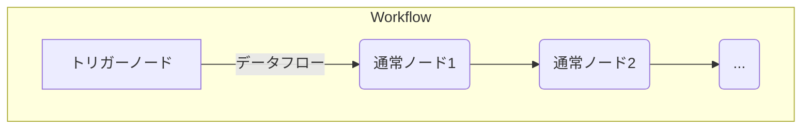
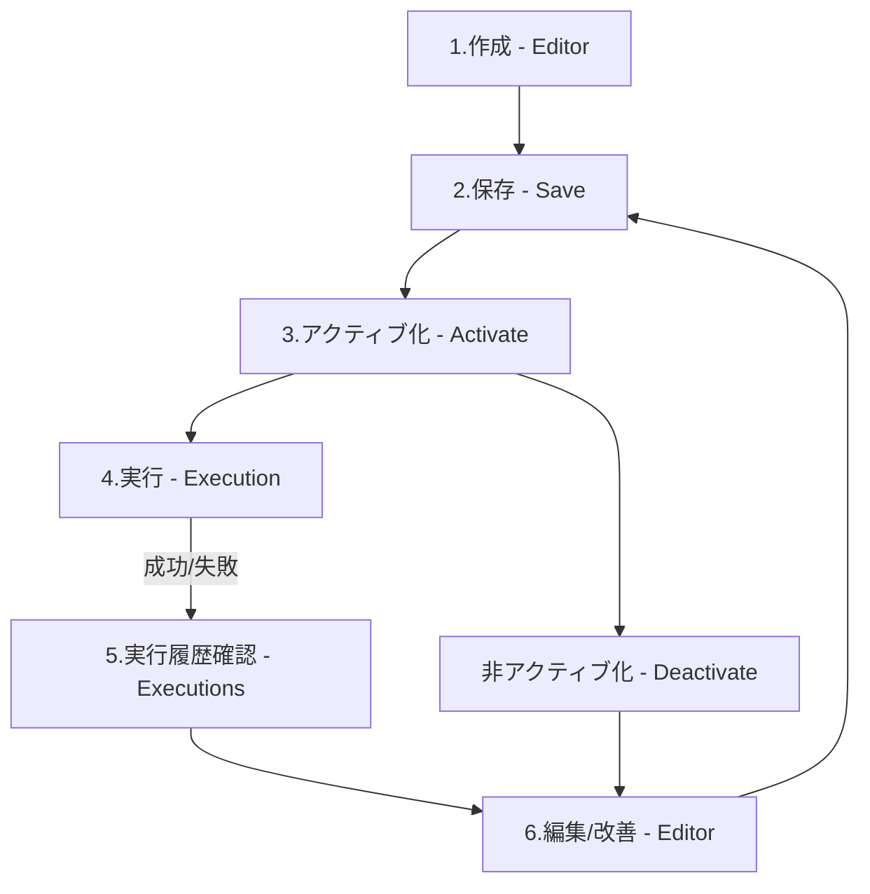
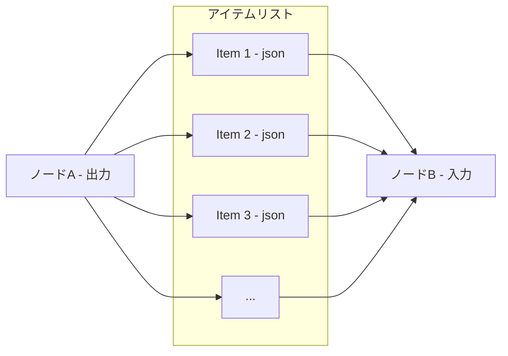

# 第2章: コア機能詳解 - n8n を構成する要素

この章では、n8n の中核をなす機能であるワークフロー、ノード、トリガー、データ処理、認証について、その仕組みや使い方を詳しく解説します。これらの要素を理解することが、n8n を効果的に活用するための鍵となります。

## 2.1. ワークフロー (Workflow) - 自動化の中心

n8n における「ワークフロー」とは、一連の自動化された処理の流れを定義したものです。

### 2.1.1. ワークフローの構造 (ノード、コネクション、トリガー)

ワークフローは、主に以下の要素で構成されます。



| 要素名                            | 説明                                                                                                 |
| :-------------------------------- | :--------------------------------------------------------------------------------------------------- |
| **トリガーノード (Trigger Node)** | ワークフローの実行を開始する特別なノード。各ワークフローに通常1つだけ配置されます。                  |
| **通常ノード (Regular Node)**     | データ取得、加工、外部サービス連携など、具体的な処理を実行するノード。                               |
| **コネクション (Connection)**     | ノード間を結ぶ線。データの流れる方向を示します。通常、前のノードの出力が次のノードの入力となります。 |
| **データフロー (Data Flow)**      | コネクションを通じてノード間を流れるデータのこと。                                                   |

### **2.1.2. ワークフローのライフサイクル (作成、実行、管理)**

ワークフローは、作成から実行、そして管理というサイクルを辿ります。



| 要素名                           | 説明                                                                                                                                       |
| :------------------------------- | :----------------------------------------------------------------------------------------------------------------------------------------- |
| **1. 作成 (Editor)**             | n8n エディタ（キャンバス）上で、ノードを配置し、コネクションで繋ぎ、各ノードの設定を行います。                                             |
| **2. 保存 (Save)**               | 作成または編集したワークフローを保存します。                                                                                               |
| **3. アクティブ化 (Activate)**   | ワークフローを実行可能な状態にします。アクティブ化されていないワークフローはトリガーされても実行されません。                               |
| **4. 実行 (Execution)**          | トリガー（スケジュール、Webhookなど）によって、または手動でワークフローが実行されます。                                                    |
| **5. 実行履歴確認 (Executions)** | ワークフローがいつ、どのように実行され、成功したか失敗したか、各ノードの入出力データなどを確認します。エラー発生時のデバッグに不可欠です。 |
| **6. 編集/改善 (Editor)**        | 実行結果や要件の変化に基づき、ワークフローを修正・改善します。                                                                             |
| **非アクティブ化 (Deactivate)**  | ワークフローの実行を一時停止します。                                                                                                       |

## **2.2. ノード (Node) - 機能のブロック**

ノードは、ワークフロー内で特定のタスクを実行するための部品です。

### **2.2.1. ノードの役割と種類 (通常ノード、トリガーノード)**

ノードは大きく分けて2種類あります。

| 種類               | 役割                                                           | 例                                                                 |
| :----------------- | :------------------------------------------------------------- | :----------------------------------------------------------------- |
| **トリガーノード** | ワークフローの実行を開始する起点となる。                       | Schedule (定期実行), Webhook, Slack Trigger, Google Sheets Trigger |
| **通常ノード**     | データの取得、加工、条件分岐、外部サービスへの送信などを行う。 | HTTP Request, Set, IF, Merge, Slack, Google Sheets                 |

### 2.2.2. 主要な標準ノード解説 (カテゴリ別)

n8n には多種多様な標準ノードが用意されています。以下はその一部です。

| カテゴリ             | 主要なノード例                   | 主な機能                                                                                               |
| :------------------- | :------------------------------- | :----------------------------------------------------------------------------------------------------- |
| ****データ操作****   | Set                              | 新しいデータフィールドを追加したり、既存の値を変更したりする。                                         |
|                      | Function                         | JavaScript コードを記述して、より複雑なデータ操作やロジックを実行する。                                |
|                      | Item Lists                       | 複数のアイテム（データセット）を分割、集約、フィルタリングする。                                       |
|                      | Merge                            | 異なる入力元からのデータを結合する。                                                                   |
| ****フロー制御****   | IF                               | 条件に基づいてワークフローの実行パスを分岐させる。                                                     |
|                      | Switch                           | 複数の条件に基づいて処理を分岐させる（IFよりも多くの分岐に対応）。                                     |
|                      | Split In Batches                 | 大量のアイテムを指定した数ずつのバッチに分割して、後続のノードで処理しやすくする（ループ処理の基本）。 |
|                      | Wait                             | 指定した時間だけ、または特定の条件が満たされるまでワークフローの実行を待機させる。                     |
|                      | Execute Workflow                 | 別のワークフローを呼び出して実行する。                                                                 |
| ****サービス連携**** | HTTP Request                     | 任意の Web API に対してリクエスト（GET, POST など）を送信し、レスポンスを取得する。                    |
|                      | Slack                            | Slack へのメッセージ送信、チャンネル操作など。                                                         |
|                      | Google Sheets                    | Google スプレッドシートの読み取り、書き込み、更新など。                                                |
|                      | Google Drive                     | Google Drive 上のファイルのアップロード、ダウンロード、管理など。                                      |
|                      | Email (SMTP/IMAP)                | メールの送信（SMTP）や受信（IMAP）。                                                                   |
|                      | Database (Postgres, MySQL, etc.) | 各種データベースへの接続、クエリ実行（SELECT, INSERT, UPDATE, DELETE）。                               |
|                      | File / Read Binary File          | サーバー上のファイルの読み書き、バイナリデータの処理。                                                 |
| ****トリガー****     | Schedule                         | 指定した間隔（毎時、毎日、毎週など）でワークフローを定期実行する。                                     |
|                      | Webhook                          | 外部システムからの HTTP リクエストを受け取ってワークフローを開始する。                                 |
|                      | Cron                             | Cron 式を使って、より柔軟なスケジュールで定期実行する。                                                |
|                      | Manual                           | n8n エディタから手動でワークフローを実行する（テスト用）。                                             |

**上記以外にも多数のノードが存在します。詳細は公式ドキュメントを参照してください。**

### 2.2.3. ノードの設定とパラメータ

各ノードには、その動作を制御するための固有の設定項目（パラメータ）があります。

* ****選択:**** キャンバス上でノードをクリックすると、右側のパネルに設定画面が表示されます。

* ****入力:**** テキストフィールド、ドロップダウンリスト、トグルスイッチなどを使ってパラメータを入力・選択します。

* ****式 (Expressions):**** `</>` アイコンがあるパラメータ欄では、「式」を使って動的に値を設定できます（例: 前のノードのデータを参照する）。

* ****認証情報 (Credentials):**** 外部サービス連携ノードでは、事前に登録した認証情報（APIキーなど）を選択する必要があります。

* ****オプション:**** ノードによっては、エラー時の動作（Continue on Fail）や実行結果の保持設定などの追加オプションがあります。

## 2.3. トリガー (Trigger) - ワークフローの起点

トリガーは、ワークフローが自動的に動き出すための「きっかけ」です。

### 2.3.1. トリガーの種類 (スケジュール、Webhook、手動など)

代表的なトリガーの種類には以下のようなものがあります。

| 種類                     | 説明                                                                                                                                                         | 主な用途                                                                    |
| :----------------------- | :----------------------------------------------------------------------------------------------------------------------------------------------------------- | :-------------------------------------------------------------------------- |
| ****Schedule****         | 設定した時間間隔（例: 1時間ごと、毎日午前9時）でワークフローを自動実行します。                                                                               | 定期的なレポート作成、データ同期、バッチ処理                                |
| ****Cron****             | Cron 式を用いて、より複雑なスケジュール（例: 毎月第1月曜日の午前10時）で実行します。                                                                         | Schedule トリガーよりも柔軟な定期実行が必要な場合                           |
| ****Webhook****          | n8n が生成するユニークな URL に対して外部から HTTP リクエスト（通常は POST）が送られると、ワークフローを実行します。ペイロードデータを受け取れます。         | 外部サービスからのイベント通知（フォーム送信、決済完了など）、API連携の起点 |
| ****サービストリガー**** | 特定のサービス（例: Slack, Gmail, Google Sheets, GitHub）で特定のイベントが発生したことを検知してワークフローを実行します。ポーリングまたは Webhook ベース。 | 特定アプリのイベント（新規メッセージ、新規行追加など）に応じた自動化        |
| ****Manual****           | n8n エディタ上の実行ボタンを押すことで、手動でワークフローを開始します。                                                                                     | ワークフローのテスト、デバッグ、一時的な手動実行                            |
| ****Error Trigger****    | 同じ n8n インスタンス内の他のワークフローでエラーが発生した場合に実行される特殊なトリガー。                                                                  | ワークフローのエラー監視、エラー通知                                        |

### 2.3.2. 各トリガーの設定方法と注意点

* ****Schedule/Cron:**** 実行間隔や時刻を設定します。タイムゾーンの設定に注意が必要です。

* ****Webhook:****

    * トリガーノードが ****ユニークな Webhook URL**** を生成します。この URL を外部サービス側に設定します。

    * ****テスト用 URL**** と ****本番用 URL**** があります。開発・テスト中はテスト用を、本番運用時は本番用 URL を使用します。

    * URL は機密情報として扱います。安易に公開しないでください。

    * HTTP メソッド (POST, GET など) や認証方法 (Basic Auth など) を設定できます。

    * レスポンスの内容やステータスコードをカスタマイズできます（例: リクエスト元に処理受付を通知）。

* ****サービストリガー:****

    * 連携するサービスのアカウント認証 (Credentials) が必要です。

    * トリガーとなるイベントの種類を選択します。

    * ポーリングベースのトリガーの場合、n8n が定期的にサービスの状態を確認します。確認間隔（Polling Interval）を設定できますが、短すぎるとサービスの API 制限に抵触する可能性があります。

* ****Manual:**** 特別な設定は不要ですが、テスト実行時に入力データを手動で設定できます。

## 2.4. データ構造と操作 (Data Handling)

n8n ワークフロー内では、データがノードからノードへと流れていきます。このデータを理解し、適切に操作することが重要です。

### 2.4.1. n8n 内のデータ表現 (JSON)

n8n は、ワークフロー内で扱うデータを基本的に ****JSON (JavaScript Object Notation)**** 形式で表現します。JSON はキーと値のペアで構成される、人間にも読みやすく、プログラムでも扱いやすいデータ形式です。

```json

// 例: Webhookで受け取ったデータ
{
  "customer_id": 123,
    "name": "山田 太郎",
    "email": "yamada@example.com",
    "order_items": [
      { "product_id": "A-001", "quantity": 1 },
        { "product_id": "B-002", "quantity": 2 }
      ],
    "is_vip": true
  }
```

### **2.4.2. アイテムとデータフロー**

ワークフロー内を流れる個々のデータセットは「**アイテム (Item)**」と呼ばれます。多くのトリガーやノードは、複数のアイテムをリスト（配列）として出力することがあります。



| 要素名             | 説明                                                                                               |
| :----------------- | :------------------------------------------------------------------------------------------------- |
| **ノードA (出力)** | 処理結果として、複数のアイテムを含むリストを出力するノード（例: Google Sheets で複数行読み込み）。 |
| **アイテムリスト** | 複数のアイテム（JSONオブジェクト）が格納された配列。                                               |
| **Item 1, 2, 3**   | 個々のデータセットを表す JSON オブジェクト。                                                       |
| **ノードB (入力)** | 前のノードからアイテムリストを受け取り、通常は各アイテムに対して順番に処理を実行します。           |

### **2.4.3. 式 (Expressions) の基礎と応用 (データの参照、加工)**

ノードのパラメータ設定欄で </> アイコンをクリックすると、「式 (Expressions)」エディタが開き、JavaScript に似た構文で動的な値を設定できます。これにより、前のノードのデータを利用したり、簡単な計算や文字列操作を行ったりできます。

**基本的な使い方:**

* **前のノードのデータを参照:**  
  * {{ $json["キー名"] }}: トリガーまたは直前のノードの JSON データ内の特定のキーの値を取得します。  
  * {{ $node["ノード名"].json["キー名"] }}: 特定のノード名の出力 JSON データ内のキーの値を取得します。  
  * エディタ内の変数ピッカーを使うと、GUIで簡単に参照したいデータを選択できます。  
* **アイテムインデックス:** 複数のアイテムを処理する場合、 {{ $item.index }} で現在のアイテムがリストの何番目か（0から始まる）を取得できます。  
* **組み込み変数・メソッド:**  
  * {{ $now }}: 現在の日時を取得します。  
  * {{ $random.integer(1, 100) }}: 1から100までのランダムな整数を生成します。  
  * 文字列操作 (.toUpperCase(), .slice()) や数値計算 (+, -, *, /) など、基本的な JavaScript のメソッドや演算子が利用できます。

**例:**

* Webhook で受け取った name を大文字にする: {{ $json["name"].toUpperCase() }}  
* 前のノード "Read Sheet" の email を使う: {{ $node["Read Sheet"].json["email"] }}  
* 数値 price に 1.1 を掛ける: {{ $json["price"] * 1.1 }}

| 変数/構文              | 説明                                                                                                 | 例                                       |
| :--------------------- | :--------------------------------------------------------------------------------------------------- | :--------------------------------------- |
| $json                  | 現在のノードが受け取った（直前のノードが出力した）JSON データオブジェクト全体。                      | {{ $json["propertyName"] }}              |
| $node["NodeName"].json | 指定したノード名 "NodeName" が出力した JSON データオブジェクト全体。                                 | {{ $node["My HTTP Request"].json.body }} |
| $item.index            | 複数のアイテムを処理している場合の、現在のアイテムのインデックス（0始まり）。                        | {{ $item.index }}                        |
| $workflow.id           | 現在のワークフローの ID。                                                                            | {{ $workflow.id }}                       |
| $execution.id          | 現在のワークフロー実行の ID。                                                                        | {{ $execution.id }}                      |
| $now                   | 現在の日時オブジェクト (Luxon ライブラリ)。 .toISO() などでフォーマット可能。                        | {{ $now.toISO() }}                       |
| {{ ... }}              | 式を記述するためのデリミタ。                                                                         | {{ $json.amount + 10 }}                  |
| JavaScriptメソッド     | 文字列操作 (.split(), .replace())、配列操作 (.map(), .filter()) など、一部の JS メソッドが利用可能。 | {{ $json.email.split("@")[0] }}          |

### **2.4.4. データ変換ノードの活用 (Set, Function, Item Listsなど)**

受け取ったデータをそのまま次のノードに渡すだけでなく、加工・整形が必要な場合が多くあります。そのために専用のノードが用意されています。

| ノード名             | 主な機能                                                                                                                                                                                    |
| :------------------- | :------------------------------------------------------------------------------------------------------------------------------------------------------------------------------------------ |
| **Set**              | * 既存のフィールドの値を上書きする。* 新しいフィールドを追加する。* 式を使って動的に値を設定できる。* 単純な値の追加・変更に便利。                                                       |
| **Function**         | * JavaScript コードを直接記述して、自由なデータ処理を行う。* 複数の入力アイテムをまとめて処理したり、複雑な条件分岐や計算を実行したりできる。* Set ノードでは難しい高度なロジックに対応。 |
| **Function Item**    | * Function ノードと似ているが、入力された各アイテムに対して個別に JavaScript コードを実行する。* アイテムごとの独立した処理に適している。                                                  |
| **Item Lists**       | * アイテムのリストに対して、フィルタリング（特定の条件に合うアイテムのみ残す）、ソート（並び替え）、分割、集約などの操作を行う。                                                            |
| **Merge**            | * 複数の異なるノードからの入力データを、指定したキーに基づいて結合する。* 異なる情報源からのデータを一つにまとめる場合に使う。                                                             |
| **Edit Fields**      | * フィールド名の変更、不要なフィールドの削除、データ型の変換など、フィールド構造自体を編集する。                                                                                            |
| **Spreadsheet File** | * JSON データを Excel (xlsx) や CSV 形式のファイルに変換したり、逆にファイルを読み込んで JSON データに変換したりする。                                                                      |

これらのノードを組み合わせることで、様々なデータ形式や構造に対応し、後続のノードが必要とする形式にデータを整えることができます。

## **2.5. 認証とセキュリティ (Authentication & Security)**

外部サービスと連携したり、n8n インスタンス自体を安全に運用したりするためには、認証とセキュリティの設定が不可欠です。

### **2.5.1. 認証情報 (Credentials) の概念と種類**

多くの外部サービスAPIは、アクセスするために認証を要求します。n8n では、これらの認証情報を安全に管理するために「**Credentials**」という仕組みを提供しています。

Credentials には、連携するサービスの認証方式に応じて様々な種類があります。

| 認証タイプ (Credential Type) | 説明                                                                                                                               | 例                                                                                               |
| :--------------------------- | :--------------------------------------------------------------------------------------------------------------------------------- | :----------------------------------------------------------------------------------------------- |
| **API Key Auth**             | サービスが発行する API キー（文字列）を使って認証します。ヘッダーやクエリパラメータで送信することが多いです。                      | 多くの SaaS API (OpenAI, Stripe など)                                                            |
| **Header Auth**              | 特定の HTTP ヘッダーに固定のトークンなどを設定して認証します。                                                                     | カスタム API など                                                                                |
| **Query Auth**               | URL のクエリパラメータに API キーなどを付与して認証します。                                                                        | 一部の API                                                                                       |
| **Basic Auth**               | ユーザー名とパスワードを Base64 エンコードして HTTP ヘッダーで送信する基本的な認証方式です。                                       | 社内システム、一部の API                                                                         |
| **OAuth2 API**               | ユーザーの代わりにサービスへのアクセス許可を得るための、より安全で標準的な認証フローです。n8n が認可コードフローなどを処理します。 | Google (Sheets, Drive, Gmail), Microsoft (Outlook, OneDrive), Slack, GitHub, Salesforce など多数 |
| **Digest Auth**              | Basic Auth よりセキュアなチャレンジ/レスポンス型の認証方式です。                                                                   | まれに使用される                                                                                 |
| **Custom Auth**              | 上記に当てはまらない、サービス独自の認証方式に対応するためのものです（カスタムノード開発で利用）。                                 | -                                                                                                |
| **None**                     | 認証が不要な場合に選択します。                                                                                                     | 公開 API など                                                                                    |

### **2.5.2. 認証情報の安全な管理方法**

* **作成:** n8n の設定メニュー (Settings > Credentials) から「Add Credential」を選択し、対象サービスと認証タイプを選んで必要な情報（APIキー、クライアントID/シークレットなど）を入力します。  
* **暗号化:** 登録された認証情報は、n8n によって**自動的に暗号化**されてデータベースに保存されます。暗号化キー (N8N_ENCRYPTION_KEY) は n8n インスタンスごとに固有であり、適切に管理する必要があります（特に Self-Hosted の場合）。  
* **利用:** ワークフロー内の対応するノード設定で、ドロップダウンリストから作成済みの Credential を選択するだけで、ノードが認証情報を安全に利用してくれます。ワークフロー定義 (JSON) に認証情報そのものが含まれることはありません。  
* **編集・削除:** 作成済みの Credential は後から編集・削除できます。

### **2.5.3. n8n インスタンスのセキュリティ設定**

特に Self-Hosted 環境で n8n を運用する場合、インスタンス自体のセキュリティを確保することが重要です。

| 設定項目                        | 説明                                                                                                                                                                     | 推奨事項・注意点                                                                                                                                                                 |
| :------------------------------ | :----------------------------------------------------------------------------------------------------------------------------------------------------------------------- | :------------------------------------------------------------------------------------------------------------------------------------------------------------------------------- |
| **ユーザー認証**                | n8n エディタへのアクセスをユーザー名とパスワードで保護します。環境変数 N8N_BASIC_AUTH_USER と N8N_BASIC_AUTH_PASSWORD で設定します。                                     | **必須設定**。推測されにくい強力なパスワードを使用してください。                                                                                                                 |
| **HTTPS (SSL/TLS)**             | n8n への通信を暗号化します。リバースプロキシ（Nginx, Caddy, Traefik など）を n8n の前段に設置し、そこで SSL/TLS 証明書を管理・適用するのが一般的です。                   | **強く推奨**。特にインターネット経由でアクセスする場合や、Webhook を外部から受け付ける場合は必須です。Let's Encrypt などで無料の証明書を取得できます。                           |
| **暗号化キー (Encryption Key)** | Credentials などを暗号化するためのキーです。環境変数 N8N_ENCRYPTION_KEY で設定します。設定しない場合は n8n が自動生成しますが、永続化されません。                        | **必ず設定し、安全な場所にバックアップ**してください。このキーを失うと、暗号化された Credentials が復元できなくなります。Docker Compose などで明示的に設定することを推奨します。 |
| **環境変数による機密情報管理**  | データベースのパスワードや API キーなど、ワークフロー内で直接使いたい機密情報を環境変数 (N8N_ プレフィックス付き) で定義し、式 {{ $env['環境変数名'] }} で参照できます。 | ワークフロー定義内に機密情報をハードコーディングするのを避けるために有効です。Docker の .env ファイルや Kubernetes の Secrets などで管理します。                                 |
| **Webhook URL の保護**          | Webhook トリガーの URL は、知っていれば誰でもワークフローを実行できてしまう可能性があります。                                                                            | Basic Auth や Header Auth を Webhook トリガー設定で有効にする、リバースプロキシ側で IP 制限をかけるなどの対策を検討します。                                                      |
| **実行権限・アクセス制御**      | (Enterprise Plan) Role-Based Access Control (RBAC) により、ユーザーごとにワークフローの作成・編集・実行権限や、アクセス可能な Credentials を細かく制御できます。         | 大規模組織や複数チームで利用する場合に有効です。                                                                                                                                 |
| **ファイアウォール設定**        | n8n サーバーが必要とするポート（デフォルト: 5678）以外へのアクセスを制限します。                                                                                         | サーバーの OS ファイアウォールや、クラウド環境のセキュリティグループなどで適切に設定します。                                                                                     |
