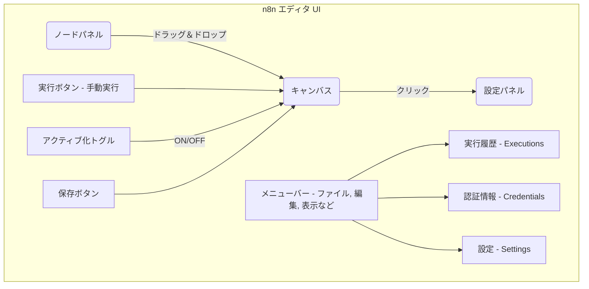
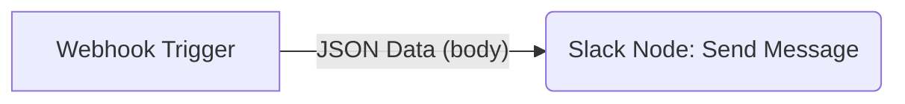
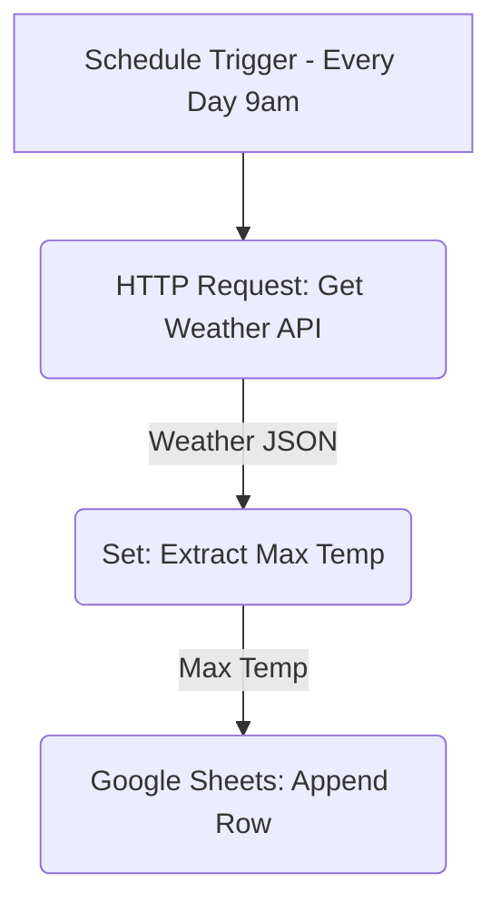
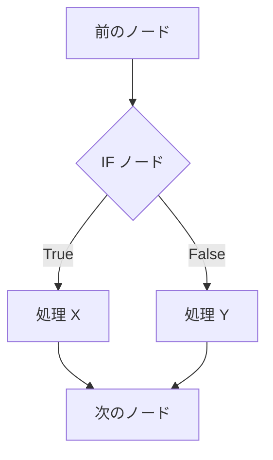
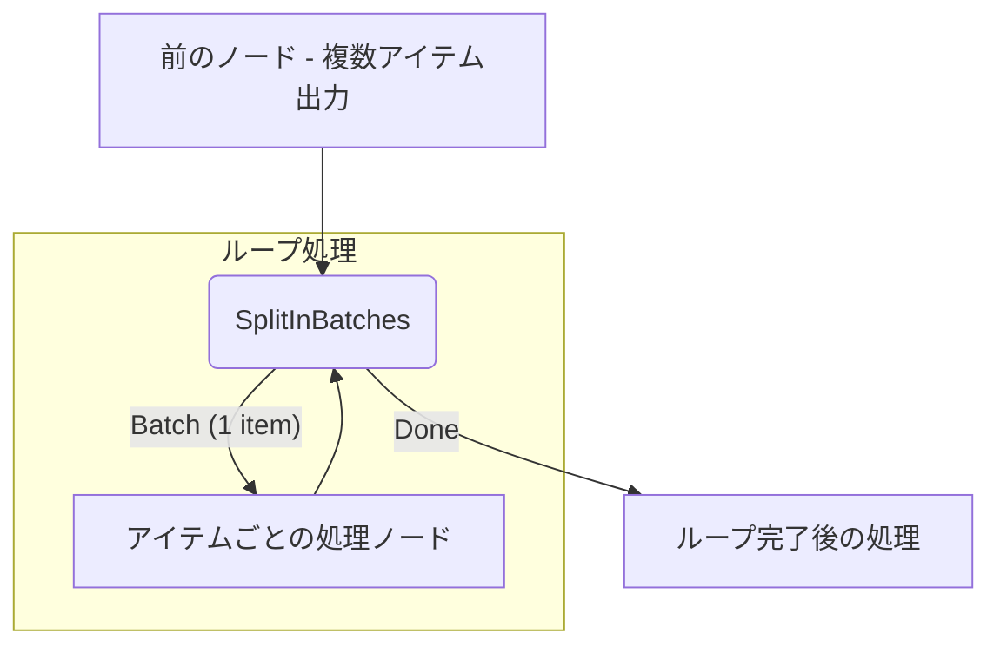
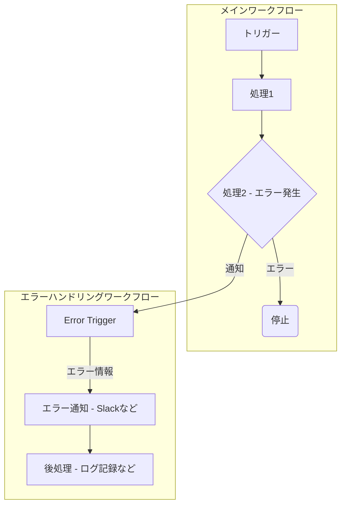
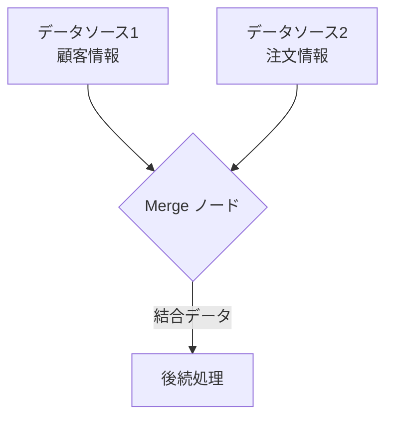
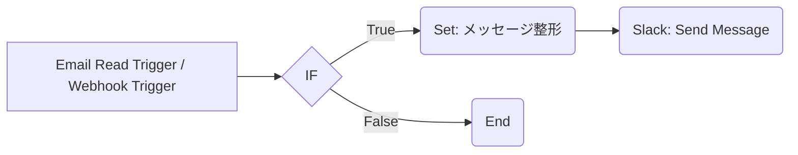
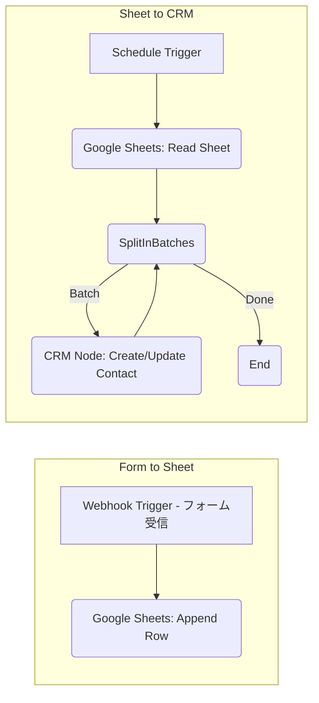
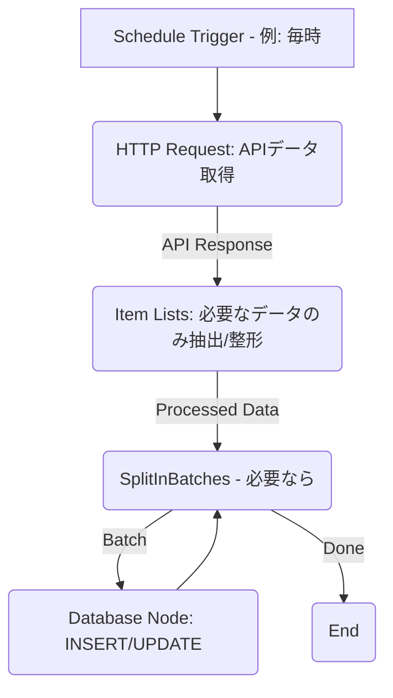

# 第3章: 実践！ワークフロー構築 - 自動化を形にする

この章では、実際に n8n を使ってワークフローを構築する手順を、環境構築から具体的な例、デバッグ方法まで含めて解説します。手を動かしながら n8n の使い方をマスターしましょう。

## 3.1. 導入準備 - 環境構築と初期設定

n8n を使い始めるための最初のステップである、環境構築と基本的なエディタ操作について説明します。

### 3.1.1. インストール方法 (Docker, npm, etc.)

Self-Hosted 環境で n8n を利用する場合、いくつかのインストール方法があります。**Docker を利用する方法が最も一般的で推奨されています。**

| 方法               | メリット                                                                         | デメリット                                                                 | 主な用途・対象者                               |
| :----------------- | :------------------------------------------------------------------------------- | :------------------------------------------------------------------------- | :--------------------------------------------- |
| **Docker**         | 環境分離が容易、依存関係の問題が少ない、起動・停止・更新が簡単、公式イメージ提供 | Docker の基本的な知識が必要                                                | **推奨**。開発・本番問わず、ほとんどのユーザー |
| **Docker Compose** | 複数のコンテナ（n8n, DBなど）をまとめて定義・管理できる、設定がコード化される    | Docker Compose の知識が必要、設定ファイル (yaml) の記述が必要              | n8n とデータベース等を連携させる場合、本番環境 |
| **npm**            | Node.js 環境があれば手軽に試せる                                                 | ホスト環境への依存、バージョン管理がやや煩雑、本番運用には不向きな場合あり | ローカルでの簡単なテスト、カスタムノード開発   |
| **npx**            | インストール不要で一時的に n8n を実行できる                                      | 実行のたびにダウンロードが発生、永続的な利用には不向き                     | ちょっと試したい、一時的な実行                 |

**Docker での基本的な起動例:**

```bash  
# 最新版の n8n イメージを取得  
docker pull n8n.io/n8nio/n8n

# n8n コンテナを起動 (-it はフォアグラウンド実行、-p でポート公開、--name で名前付け、--rm で終了時削除、-v でデータ永続化)  
docker run -it --rm   
  --name n8n   
  -p 5678:5678   
  -v ~/.n8n:/home/node/.n8n   
  n8n.io/n8nio/n8n
```

* -v ~/.n8n:/home/node/.n8n は、ホストマシンの ~/.n8n ディレクトリをコンテナ内の n8n データディレクトリにマウントし、ワークフローや設定を永続化します。**本番環境では必ず設定してください。**  
* **重要:** 本番環境では、必ず N8N_ENCRYPTION_KEY や認証情報 (N8N_BASIC_AUTH_USER, N8N_BASIC_AUTH_PASSWORD) を環境変数で設定してください。Docker Compose を使うと管理が容易です。

### **3.1.2. n8n Cloud のセットアップ**

n8n Cloud を利用する場合は、インストール作業は不要です。

1. **公式サイトへアクセス:** n8n の公式サイト (n8n.io) にアクセスします。  
2. **サインアップ:** 「Get Started」や「Sign Up」などのボタンから、アカウント作成画面に進みます。メールアドレスとパスワード、または Google/GitHub アカウントで登録できます。  
3. **プラン選択:** 無料の Starter プランまたは有料プランを選択します。（多くの場合、最初は Starter プランで試せます）  
4. **ダッシュボードへ:** 登録が完了すると、n8n Cloud のダッシュボードにアクセスできるようになります。ここから新しいワークフローを作成できます。

### **3.1.3. n8n エディタの基本操作**

n8n のワークフローは、Web ブラウザ上のエディタ（キャンバス）で作成します。



| 要素名                     | 説明                                                                                                                                               |
| :------------------------- | :------------------------------------------------------------------------------------------------------------------------------------------------- |
| **メニューバー**           | ワークフローの新規作成、保存、インポート/エクスポート、設定へのアクセスなど基本的な操作を行います。                                                |
| **ノードパネル**           | 利用可能な全てのノード（トリガー、通常ノード）がカテゴリ別にリストされています。ここからノードをキャンバスへドラッグ＆ドロップで追加します。       |
| **キャンバス**             | ワークフローを視覚的に構築するメインエリアです。ノードを配置し、ノードの出力コネクタから入力コネクタへドラッグして接続（コネクション作成）します。 |
| **設定パネル**             | キャンバス上で選択したノードのパラメータ（設定項目）が表示され、編集できます。式の入力や認証情報の選択もここで行います。                           |
| **実行ボタン**             | 現在のワークフローを手動で実行します。主にテストやデバッグ目的で使用します。                                                                       |
| **アクティブ化トグル**     | ワークフローを有効（実行可能）にするか、無効（実行停止）にするかを切り替えます。                                                                   |
| **保存ボタン**             | ワークフローへの変更を保存します。                                                                                                                 |
| **実行履歴 (Executions)**  | 過去のワークフロー実行結果（成功/失敗、日時、各ノードの入出力データなど）を確認できる画面へのリンクです。                                          |
| **認証情報 (Credentials)** | 外部サービス連携に必要な認証情報を作成・管理する画面へのリンクです。                                                                               |
| **設定 (Settings)**        | n8n インスタンス全体の設定（タイムゾーン、実行ログ設定など）を行う画面へのリンクです。                                                             |

## **3.2. 初めてのワークフロー作成 - ステップ・バイ・ステップ**

簡単な例を通して、ワークフロー作成の流れを体験してみましょう。

### **3.2.1. シンプルなWebhookトリガーの例**

**目的:** 外部から特定の URL に JSON データが POST されると、そのデータに含まれる message を Slack に通知する。

**手順:**

1. **新規ワークフロー作成:** n8n エディタで「New」をクリックして新しい空のワークフローを作成します。  
2. **トリガーノード追加:**  
   * ノードパネルの検索窓に「Webhook」と入力し、Webhook ノードをキャンバスにドラッグ＆ドロップします。  
3. **Webhook ノード設定:**  
   * Webhook ノードをクリックして設定パネルを開きます。  
   * 「HTTP Method」が「POST」になっていることを確認します。  
   * 「Webhook URLs」に表示されている **Test URL** をコピーします。（後でテストに使います）  
4. **Slack ノード追加:**  
   * ノードパネルで「Slack」を検索し、Slack ノードをキャンバスに追加します。  
5. **ノード接続:** Webhook ノードの右側にある円（出力コネクタ）から、Slack ノードの左側にある円（入力コネクタ）へドラッグして接続します。  
6. **Slack ノード設定:**  
   * Slack ノードをクリックして設定パネルを開きます。  
   * **認証情報 (Credential):** 「Slack Account」のドロップダウンで「Create New」を選択し、画面の指示に従って Slack アカウントとの連携認証を行います。（初回のみ）  
   * **Resource:** 「Message」を選択します。  
   * **Operation:** 「Send」を選択します。  
   * **Channel:** 通知を送りたい Slack チャンネル名を指定します（例: #general や @自分のユーザー名）。  
   * **Text:** ここに通知内容を入力します。Webhook で受け取った message を表示したいので、**式 (Expression)** を使います。  
     * Text 欄の右にある </> アイコンをクリックします。  
     * エディタが開くので、 {{ $json.body.message }} と入力します。（Webhook は通常、受け取ったデータを body プロパティに入れます）  
     * Add Expression をクリックします。  
7. **ワークフロー保存:** 右上の「Save」ボタンでワークフローに名前を付けて保存します（例: Webhook to Slack）。  
8. **テスト実行:**  
   * Webhook ノードの設定パネルにある「Listen For Test Event」ボタンをクリックします。n8n がテスト用のリクエストを待ち受け状態になります。  
   * 別のターミナルや API クライアントツール (curl, Postman など) を使って、先ほどコピーした **Test URL** に対して以下のような JSON データを POST します。  
     curl -X POST -H "Content-Type: application/json" -d '{"message": "これはテスト通知です！"}' <ここにTest URLをペースト>

   * n8n エディタに戻ると、Webhook ノードと Slack ノードに緑色のチェックマークが付き、データが流れたことが視覚的に表示されます。指定した Slack チャンネルにも通知が届けば成功です。  
9. **アクティブ化:** テストが成功したら、右上のトグルスイッチを「Active」にしてワークフローを有効化します。これで、Webhook ノードの **Production URL** に対してリクエストが送られるたびに、Slack 通知が実行されるようになります。



### **3.2.2. 定期実行タスクの例 (スケジュールトリガー)**

**目的:** 毎日午前9時に、特定の公開 API (例: OpenWeatherMap) から天気情報を取得し、その最高気温を Google Sheets に記録する。

**手順:**

1. **新規ワークフロー作成:** 新しいワークフローを作成します。  
2. **トリガーノード追加:** ノードパネルから「Schedule」ノードをキャンバスに追加します。  
3. **Schedule ノード設定:**  
   * 「Trigger Interval」を「Every Day」に設定します。  
   * 「Hour」を「9」に設定します。  
   * 「Timezone」を自分のタイムゾーン (例: Asia/Tokyo) に設定します。  
4. **HTTP Request ノード追加:** ノードパネルから「HTTP Request」ノードを追加し、Schedule ノードに接続します。  
5. **HTTP Request ノード設定:**  
   * **URL:** 天気情報 API のエンドポイント URL を入力します (例: OpenWeatherMap の URL。API キーが必要な場合はクエリパラメータに含める)。  
   * **Method:** 「GET」を選択します。  
   * **Options > Send Query Parameters:** 必要に応じて都市名などを指定します。  
   * **Options > Response Format:** 「JSON」を選択します。  
   * (必要であれば) **Authentication:** API キーが必要な場合は、適切な認証タイプ (API Key Auth など) を選択し、Credential を作成・設定します。  
6. **Set ノード追加 (任意だが推奨):** HTTP Request ノードの次に「Set」ノードを追加します。これは、API から取得した複雑な JSON データの中から、必要な情報（最高気温）だけを抽出・整形するために使います。  
7. **Set ノード設定:**  
   * 「Keep Only Set」を有効にすると、ここで設定した値だけが次のノードに渡されます。  
   * 「Add Value」をクリックし、「Name」に分かりやすい名前 (例: max_temp) を付けます。  
   * 「Value」欄で式エディタを開き、HTTP Request ノードのレスポンス JSON から最高気温のデータを参照する式を入力します (例: {{ $node["HTTP Request"].json.main.temp_max }} - API のレスポンス構造によります)。  
8. **Google Sheets ノード追加:** Set ノードの次に「Google Sheets」ノードを追加します。  
9. **Google Sheets ノード設定:**  
   * **認証情報 (Credential):** Google アカウントとの連携認証を行います（初回のみ）。  
   * **Resource:** 「Sheet」を選択します。  
   * **Operation:** 「Append」を選択します（新しい行として追記）。  
   * **Spreadsheet ID:** 記録したい Google スプレッドシートの ID を入力します (URL から取得)。  
   * **Sheet Name:** 対象のシート名を入力します。  
   * **Columns > Mode:** 「Columns defined below」を選択します。  
   * **Columns > Add Column:**  
     * 「Header」にスプレッドシートの列名 (例: 日付) を入力します。  
     * 「Value」で式エディタを開き、現在の日付を取得する式 {{ $now.toISODate() }} を入力します。  
     * 「Add Column」でさらに列を追加します。  
     * 「Header」に 最高気温 と入力します。  
     * 「Value」で式エディタを開き、Set ノードで設定した max_temp を参照する式 {{ $json.max_temp }} を入力します。  
10. **ワークフロー保存・テスト:** ワークフローを保存します。Schedule トリガーは手動実行ボタンでテストできます。「Execute Workflow」ボタンを押すと、現在の時刻で処理が実行され、Google Sheets にデータが追記されるか確認します。各ノードの実行結果（Input/Output Data）も確認してデバッグします。  
11. **アクティブ化:** テストが成功したら、ワークフローをアクティブ化します。これで毎日午前9時に自動実行されるようになります。



## **3.3. 実用的なワークフロー設計パターン**

より複雑で実用的なワークフローを構築する際に役立つ、共通のパターンやテクニックを紹介します。

### **3.3.1. 条件分岐 (IFノード)**

入力データの内容に応じて、処理の流れを変えたい場合に使います。



* **設定:** IF ノードで条件を設定します。「Add Condition」で複数の条件を組み合わせることも可能です (AND/OR)。  
* **条件の種類:** 数値の比較 (Equal, Greater than 等)、文字列の比較 (Contains, Starts with 等)、存在チェック (Exists, Is Empty 等) などが利用できます。式 (Expression) を使って複雑な条件も定義できます。  
* **出力:** 条件が満たされた (True) 場合と、満たされなかった (False) 場合で、それぞれ別のノードに接続します。

| 要素名        | 説明                                                                                |
| :------------ | :---------------------------------------------------------------------------------- |
| **IF ノード** | 設定された条件に基づいて、入力アイテムを True 出力または False 出力に振り分けます。 |
| **True**      | 条件が真 (True) と評価されたアイテムが流れる出力。                                  |
| **False**     | 条件が偽 (False) と評価されたアイテムが流れる出力。                                 |
| **処理 X**    | 条件が True の場合に実行したい処理ノード。                                          |
| **処理 Y**    | 条件が False の場合に実行したい処理ノード。                                         |

### **3.3.2. ループ処理 (SplitInBatchesノードなど)**

複数のアイテム（例: スプレッドシートの全行、API から取得した複数ユーザー）に対して、同じ処理を繰り返したい場合に使います。n8n には直接的なループ専用ノードはありませんが、**SplitInBatches** ノードを使うのが一般的です。



* **SplitInBatches 設定:**  
  * 「Batch Size」を 1 に設定します。これにより、入力されたアイテムが1つずつのバッチ（塊）に分割されます。  
  * SplitInBatches ノードは、各バッチを順番に後続のノード（図の C）に渡します。  
  * 後続ノード（C）の処理が終わると、自動的に SplitInBatches ノードに戻り、次のバッチ（次のアイテム）が処理されます。  
* **完了処理:** 全てのバッチ（アイテム）の処理が終わると、SplitInBatches ノードの「Done」出力から、ループ完了後の処理（図の D）に進みます。  
* **注意点:** ループ内で API を呼び出す場合、API のレート制限（短時間での呼び出し回数上限）に注意が必要です。必要に応じて Wait ノードをループ内に入れて、実行間隔を調整します。

| 要素名                       | 説明                                                                                                                                               |
| :--------------------------- | :------------------------------------------------------------------------------------------------------------------------------------------------- |
| **SplitInBatches**           | 入力されたアイテムリストを、指定したサイズ（通常は 1）のバッチに分割し、順番に出力します。全てのバッチ処理が終わると Done 出力から信号を送ります。 |
| **Batch (1 item)**           | 分割された、アイテム 1 つだけを含むバッチデータ。これがループ内の処理ノードに渡されます。                                                          |
| **アイテムごとの処理ノード** | 各アイテムに対して実行したい処理（例: データベースへの書き込み、個別の Slack 通知など）。                                                          |
| **Done**                     | 全てのアイテム（バッチ）の処理が完了したことを示す出力。ループ全体の処理が終わった後に実行したいノードをここに接続します。                         |
| **ループ完了後の処理**       | 全てのアイテムに対するループ処理が完了した後に実行したい処理（例: 完了通知、集計結果の保存など）。                                                 |

* **Function ノードでのループ:** より複雑なループ制御が必要な場合は、Function ノード内で JavaScript の for ループなどを使って実装することも可能です。

### **3.3.3. エラーハンドリング (Error Trigger, Continue on Fail)**

ワークフロー実行中に予期せぬエラー（API 接続失敗、データ形式不正など）が発生した場合に備える仕組みです。

**方法1: エラー発生時にワークフローを停止させず、処理を継続 (ノード設定)**

* 各ノードの設定パネルの「Settings」タブにある「Continue On Fail」オプションを有効にします。  
* そのノードでエラーが発生してもワークフロー全体は停止せず、エラー情報を持ったデータが次のノードに渡されます（またはデータなしで渡される）。  
* IF ノードなどを使って、エラーが発生したかどうかをチェックし、後続の処理を分岐させることができます（例: エラー発生時のみ通知を送る）。

**方法2: エラー発生時に別のワークフローを起動 (Error Trigger)**



* エラーハンドリング専用の新しいワークフローを作成します。  
* トリガーとして「Error Trigger」ノードを配置します。  
* Error Trigger ノードは、同じ n8n インスタンス内の他のワークフローでエラーが発生すると自動的に起動します。  
* 起動時に、エラーが発生したワークフロー名、ノード名、エラーメッセージなどの情報を受け取れます。  
* 受け取ったエラー情報を使って、Slack やメールで管理者に通知したり、エラーログを記録したりする処理を実装します。

| 要素名                      | 説明                                                                                                                                                                                                               |
| :-------------------------- | :----------------------------------------------------------------------------------------------------------------------------------------------------------------------------------------------------------------- |
| **処理2 (エラー発生)**      | ワークフロー実行中に問題が発生したノード。                                                                                                                                                                         |
| **停止**                    | デフォルトでは、エラーが発生するとワークフローはその時点で停止します。                                                                                                                                             |
| **Error Trigger**           | 他のワークフローでエラーが発生したことを検知して起動するトリガーノード。エラー情報を入力として受け取ります。                                                                                                       |
| **エラー通知 (Slackなど)**  | Error Trigger から受け取った情報（どのワークフローのどのノードで何のエラーが起きたか）を、管理者などに通知する処理。                                                                                               |
| **後処理 (ログ記録など)**   | 必要に応じて、エラーの詳細をデータベースやファイルに記録するなどの追加処理。                                                                                                                                       |
| **Continue On Fail (設定)** | ノード設定の一つ。有効にすると、そのノードでエラーが起きてもワークフローは停止せず、エラー情報を持って（または空のデータで）次のノードに進みます。エラー処理をメインワークフロー内で完結させたい場合に利用します。 |

### **3.3.4. データのマージと分割 (Merge, Item Lists ノード)**

複数のソースからのデータを組み合わせたり、アイテムのリストを操作したりするパターンです。

**Merge ノード:** 異なる処理経路から来たデータを、特定のキーを基に結合します。



* **設定:** Merge ノードで、どの入力 (Input 1, Input 2) からのデータを、どのキー (customer_id など) を使って結合するかを指定します。  
* **モード:** Merge By Key (キーが一致するアイテム同士を結合)、Append (単純に両方のアイテムリストを連結)、Pass-through (片方のデータだけを通す) などのモードがあります。

| 要素名               | 説明                                                                                          |
| :------------------- | :-------------------------------------------------------------------------------------------- |
| **データソース1, 2** | 異なる情報を含むアイテムリストを出力するノード（例: CRMからの顧客リスト、DBからの注文履歴）。 |
| **Merge ノード**     | 設定に基づいて、複数の入力からのアイテムリストを一つに結合します。                            |
| **結合データ**       | データソース1と2の情報が指定した方法でマージされたアイテムリスト。                            |
| **後続処理**         | 結合されたデータを使って、レポート作成や他のシステムへの連携などを行います。                  |

**Item Lists ノード:** アイテムのリストに対して、フィルタリング、ソート、集計などの操作を行います。

* **Operation:** Filter (条件に合うアイテムのみ抽出)、Sort (指定キーで並び替え)、Summarize (合計、平均、最大/最小などを計算)、Split Out Items (リスト内の各アイテムを個別のアイテムとして出力) などの操作を選択できます。

## **3.4. 具体的なユースケース別ワークフロー例**

実際の業務で役立つような、より具体的なワークフローの構築例をいくつか紹介します。

### **3.4.1. 例1: Slack通知ボット**

特定のキーワードを含むメールを受信したらSlackに通知する、あるいはフォーム送信内容をSlackに投稿するなど、Slack連携ボットの作成例です。



| 要素名                           | 説明                                                               |
| :------------------------------- | :----------------------------------------------------------------- |
| **Email Read / Webhook Trigger** | メールの受信やフォーム送信などを検知してワークフローを開始します。 |
| **IF (条件チェック)**            | メールの件名や本文、フォームの内容などをチェックします。           |
| **Set: メッセージ整形**          | Slackに通知するメッセージ内容を、受信データを使って作成します。    |
| **Slack: Send Message**          | 整形したメッセージを指定のチャンネルやユーザーに送信します。       |
| **End**                          | 条件に合わない場合は処理を終了します。                             |

### **3.4.2. 例2: Google Sheets とのデータ連携**

Webフォームからの入力をGoogle Sheetsに記録する、あるいはGoogle Sheetsのデータを読み取って他のサービスに連携するなど、スプレッドシート連携の例です。



| 要素名                              | 説明                                                                                 |
| :---------------------------------- | :----------------------------------------------------------------------------------- |
| **Webhook Trigger (フォーム受信)**  | Webフォーム（例: Typeform, Google Forms）からの送信データを受け取ります。            |
| **Google Sheets: Append Row**       | 受け取ったフォームデータを Google Sheets の新しい行として追加します。                |
| **Schedule Trigger**                | 定期的に（例: 1日1回）ワークフローを開始します。                                     |
| **Google Sheets: Read Sheet**       | 指定した Google Sheets からデータを読み込みます。                                    |
| **SplitInBatches**                  | 読み込んだ各行（アイテム）を個別に処理するために分割します。                         |
| **CRM Node: Create/Update Contact** | 各行のデータを使って、CRM（例: HubSpot, Salesforce）の連絡先を作成または更新します。 |
| **End**                             | 処理完了。                                                                           |

### **3.4.3. 例3: 定期的なAPIデータ取得と保存**

外部の公開APIから定期的にデータを取得し、整形してデータベース（PostgreSQL, MySQLなど）に保存するワークフローの例です。



| 要素名                           | 説明                                                                                            |
| :------------------------------- | :---------------------------------------------------------------------------------------------- |
| **Schedule Trigger**             | 指定した間隔（例: 1時間ごと）でワークフローを開始します。                                       |
| **HTTP Request: APIデータ取得**  | 外部 API にリクエストを送信し、データを取得します（例: 商品情報、株価、ニュース記事など）。     |
| **Item Lists: データ抽出/整形**  | API レスポンスから必要なデータフィールドを選択したり、形式を整えたりします。                    |
| **SplitInBatches (必要なら)**    | API レスポンスが複数のレコードを含む場合、1レコードずつデータベースに保存するために分割します。 |
| **Database Node: INSERT/UPDATE** | 整形・分割されたデータをデータベースのテーブルに挿入 (INSERT) または更新 (UPDATE) します。      |
| **End**                          | 処理完了。                                                                                      |

* **他にも様々な自動化ができます**
  * **CRMリードの自動割り当て:** 新規リードが CRM に追加されたら、条件に基づいて担当者を自動で割り当て、通知する。  
  * **ファイル処理:** 特定のフォルダにファイルがアップロードされたら、内容を読み取って処理し、結果を別の場所に保存する。  
  * **レポート自動生成:** 複数のデータソースから情報を集め、整形し、定期的にレポート（PDFやスプレッドシート）を作成してメールで送信する。

## **3.5. デバッグとテスト**

作成したワークフローが意図通りに動作するか確認し、問題発生時に原因を特定するための方法を解説します。

### **3.5.1. 実行履歴の確認と分析**

* **アクセス:** n8n エディタ左側のメニューから「Executions」を選択します。  
* **リスト表示:** 過去のワークフロー実行がリスト形式で表示されます。成功（緑）、失敗（赤）、実行中（青）などのステータス、開始日時、実行時間などが分かります。  
* **詳細表示:** 各実行履歴をクリックすると、その実行におけるワークフローの経路と、各ノードの **入力 (Input Data)** と **出力 (Output Data)** を確認できます。  
  * **Input Data:** そのノードが前のノードから何を受け取ったか。  
  * **Output Data:** そのノードが処理を実行した結果、何を出力したか。  
* **エラー確認:** 実行が失敗した場合、エラーが発生したノードが赤く表示され、クリックするとエラーメッセージやスタックトレースなどの詳細情報が表示されます。これが問題解決の最大のヒントになります。

### 

### 3.5.2. ノードごとのテスト実行

ワークフロー全体を動かす前に、個々のノードが正しく設定されているか、期待通りのデータを取得・処理できるかを確認できます。

* **方法:** キャンバス上でテストしたいノードを選択し、設定パネルの上部にある **再生ボタン (Execute Node)** をクリックします。  
* **動作:** そのノードが（もしあれば前のノードからの仮データを使って）実行され、結果（Output Data）が設定パネル内に表示されます。  
* **利点:** API 接続の確認、データ形式の確認、式の評価結果の確認などを、ワークフロー全体を動かすことなく迅速に行えます。

### 3.5.3. 一般的なエラーとその対処法

ワークフロー構築中には様々なエラーに遭遇します。

| よくあるエラーの種類                                                      | 主な原因                                                                                                                                                                                                | 対処法の例                                                                                                                                                                                                                                         |
| :------------------------------------------------------------------------ | :------------------------------------------------------------------------------------------------------------------------------------------------------------------------------------------------------ | :------------------------------------------------------------------------------------------------------------------------------------------------------------------------------------------------------------------------------------------------- |
| **認証エラー (401 Unauthorized, 403 Forbidden)**                          | * Credentials (認証情報) が間違っている（APIキー、パスワード等）。<br>* Credentials の有効期限が切れている。<br>* 必要なアクセス権限がない。                                                            | * Credentials を再確認・再作成する。<br>* OAuth2 の場合は再認証を行う。<br>* 連携サービスの管理画面で n8n (または登録したアプリ) に必要な権限が付与されているか確認する。                                                                          |
| **データ形式不一致 (TypeError, Cannot read property '...' of undefined)** | * 参照しようとしているデータが存在しない（キー名の間違い、前のノードが出力していない）。<br>* 期待するデータ型と実際のデータ型が違う（数値を期待しているのに文字列が来た等）。<br>* JSON パースエラー。 | * 実行履歴やノードテストで、エラー発生ノードの Input Data を確認し、参照しようとしているキーやプロパティが正しいか、存在するか確認する。<br>* 式 (`$json.key`) が正しいか確認する。<br>* 必要に応じて Set や Function ノードでデータ型を変換する。 |
| **接続タイムアウト (Timeout)**                                            | * 連携先の API サーバーが応答しない、または応答が遅い。<br>* ネットワークの問題。<br>* 大量のデータを処理しようとして時間がかかりすぎている。                                                           | * 連携先サービスの状態を確認する。<br>* HTTP Request ノードの「Options」>「Timeout」設定を長くしてみる（根本解決ではない場合も）。<br>* ネットワーク接続を確認する。<br>* 処理データを分割する (SplitInBatches) などの工夫をする。                 |
| **API レート制限超過 (429 Too Many Requests)**                            | 短時間に API を呼び出しすぎた。                                                                                                                                                                         | * ループ処理内で API を呼び出している場合、Wait ノードを入れて実行間隔を空ける。<br>* 連携サービスの API ドキュメントでレート制限を確認し、制限を超えないように設計する。                                                                          |
| **ノードが見つからない (Node Not Found)**                                 | ワークフローをインポートした際に、インポート元の環境にしかなかったカスタムノードが含まれていた。                                                                                                        | * 必要なカスタムノードを現在の n8n 環境にインストールする。                                                                                                                                                                                        |
| **ファイルアクセスエラー (Permission Denied)**                            | (Self-Hosted) n8n プロセスが、読み書きしようとしているファイルやディレクトリに対する権限を持っていない。                                                                                                | * Docker を使用している場合、ボリュームマウントの設定や、コンテナ実行ユーザーの権限を確認・修正する。<br>* サーバー上のファイルパーミッションを確認・修正する。                                                                                    |

エラーメッセージをよく読み、どのノードで何が問題なのかを特定することがデバッグの第一歩です。実行履歴の Input/Output Data と照らし合わせながら原因を探りましょう。  
