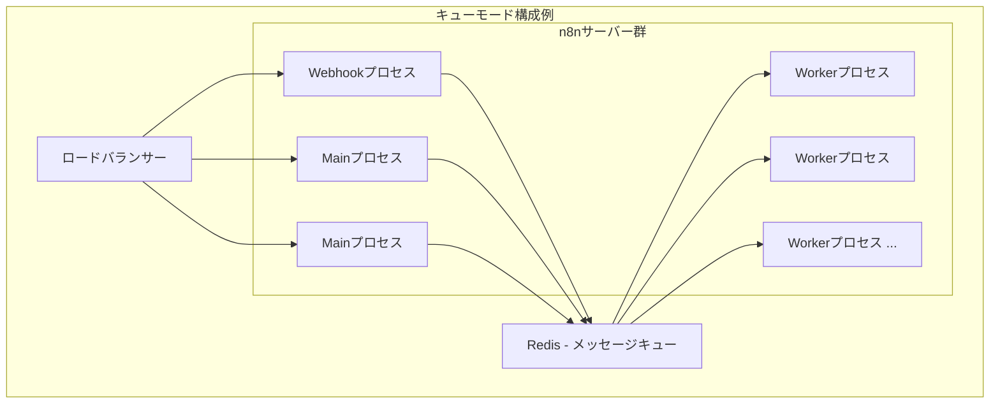

# 第4章: 運用と管理 - ワークフローを安定稼働させる

作成したワークフローを実際に業務で利用し、安定して稼働させ続けるための管理方法、監視、パフォーマンスチューニング、メンテナンスについて解説します。特に Self-Hosted 環境での運用に焦点を当てます。

## 4.1. ワークフローの管理

複数のワークフローを作成・運用していく上で、効率的な管理が重要になります。

### 4.1.1. アクティブ化・非アクティブ化

* **アクティブ (Active):** ワークフローが実行可能な状態です。トリガー（スケジュール、Webhook など）によって自動的に実行されます。エディタ右上のトグルスイッチを ON にします。
* **非アクティブ (Inactive):** ワークフローが実行されない状態です。トグルスイッチを OFF にします。
* **使い分け:**
    * 開発中やテスト中のワークフローは非アクティブにしておきます。
    * 一時的に実行を停止したい場合（メンテナンス、連携先システム停止など）に非アクティブ化します。
    * 本番運用するワークフローはアクティブにします。

### 4.1.2. バージョン管理とインポート/エクスポート

* **組み込みバージョン管理:**
    * n8n はワークフローを保存するたびに、自動的に過去のバージョンを保持しています。（保持数は設定によります）
    * エディタのメニュー「Workflow」>「Past versions」から過去のバージョンリストを表示し、特定のバージョンを閲覧したり、復元したりできます。
    * 意図しない変更を元に戻したい場合や、変更履歴を確認したい場合に便利です。
* **Git との連携 (手動/外部ツール):**
    * より厳密なバージョン管理やチームでの共同開発を行いたい場合、ワークフロー定義 (JSON) を Git リポジトリで管理する方法があります。
    * **エクスポート:** エディタメニュー「Workflow」>「Download」でワークフロー定義を JSON ファイルとしてダウンロードできます。
    * **インポート:** エディタメニュー「Workflow」>「Import from file」で JSON ファイルをアップロードしてワークフローを復元・複製できます。
    * ダウンロードした JSON ファイルを Git でコミット・プッシュし、変更履歴を管理します。
    * (高度) CI/CD パイプラインと n8n API を組み合わせて、Git リポジトリへの変更を自動的に n8n インスタンスにデプロイすることも可能です。
* **インポート/エクスポートの活用:**
    * ワークフローのバックアップ。
    * 別の n8n 環境（開発環境から本番環境など）へのワークフロー移行。
    * コミュニティで共有されているワークフローの取り込み。

### 4.1.3. タグ付けと整理

ワークフローが増えてくると、目的のワークフローを見つけにくくなります。タグを活用して整理しましょう。

* **タグ付け:**
    * ワークフロー一覧画面またはエディタ画面で、ワークフローに任意のタグを付けることができます（例: `マーケティング`, `重要`, `開発中`, `担当者名` など）。
    * 一つのワークフローに複数のタグを付けることも可能です。
* **検索・フィルタリング:**
    * ワークフロー一覧画面の検索ボックスで、ワークフロー名だけでなくタグ名でも検索・絞り込みができます。
    * 特定のプロジェクトや担当者に関連するワークフローを素早く見つけるのに役立ちます。

## 4.2. 実行監視とロギング

ワークフローが期待通りに動作しているか、問題が発生していないかを継続的に監視することが安定運用の鍵です。

### 4.2.1. 実行ログの確認とレベル設定

* **実行履歴 (Executions):** 第3章で解説した通り、n8n UI の「Executions」画面で、個々のワークフロー実行の成否、日時、実行時間、各ノードの入出力データ、エラーメッセージなどを確認できます。これが最も基本的な監視方法です。
* **ログレベル設定 (Self-Hosted):**
    * n8n は実行に関する詳細なログをサーバーの標準出力（または指定したファイル）にも記録します。
    * 環境変数 `N8N_LOG_LEVEL` でログの詳細度を調整できます (例: `info`, `warn`, `error`, `debug`, `trace`)。
        * `info`: 通常の運用レベル。
        * `debug`, `trace`: 問題発生時の詳細調査用。大量のログが出力されるため、通常運用時は非推奨。
    * 環境変数 `N8N_LOG_OUTPUT` でログの出力先を指定できます (例: `console`, `file`)。
    * 環境変数 `N8N_LOG_FILE_LOCATION` でログファイルのパスを指定できます (`N8N_LOG_OUTPUT=file` の場合)。
* **ログの活用:**
    * 実行履歴画面だけでは分からない、n8n プロセス自体のエラーや警告を確認できます。
    * パフォーマンスの問題（処理時間の遅延など）の原因調査の手がかりになります。
    * 外部のログ収集・分析ツール（Elasticsearch, Splunk, Grafana Loki など）と連携して、ログを一元管理・分析することも可能です。

### 4.2.2. 外部監視ツールとの連携 (オプション)

より高度な監視を行いたい場合、外部のモニタリングツールと連携できます (主に Self-Hosted 環境向け)。

* **Prometheus / Grafana:**
    * n8n は Prometheus 形式でメトリクス（実行回数、エラー数、実行時間など）を公開する機能を持っています (環境変数 `N8N_METRICS_ENABLED=true`, `N8N_METRICS_PORT` で設定)。
    * Prometheus でこれらのメトリクスを収集し、Grafana でダッシュボードを作成して、n8n の稼働状況やワークフローのパフォーマンスを視覚的に監視できます。
* **Health Check エンドポイント:**
    * n8n は `/healthz` というエンドポイントを提供しており、アクセスすると n8n プロセスが正常に動作しているかどうかの基本的なステータスを返します。
    * ロードバランサーやコンテナオーケストレーター (Kubernetes など) のヘルスチェックに利用できます。
* **エラー通知ワークフロー:** 3.3.3 で解説した Error Trigger を使ったワークフローで、エラー発生をリアルタイムに検知し、監視システムやインシデント管理ツールに通知を送ることも有効です。

## 4.3. パフォーマンスとスケーリング (Self-Hosted)

ワークフローの数や実行頻度が増加するにつれて、n8n インスタンスのパフォーマンスが重要になります。

### 4.3.1. リソース要件とサイジング

n8n を稼働させるサーバーに必要なリソース（CPU, メモリ, ディスク）は、ワークフローの複雑さ、実行頻度、同時に処理するアイテム数などによって大きく異なります。

| リソース     | 考慮事項                                                                                                                                                                                                             | 目安 (小規模〜中規模)                                                                                                                                                           |
| :----------- | :------------------------------------------------------------------------------------------------------------------------------------------------------------------------------------------------------------------- | :------------------------------------------------------------------------------------------------------------------------------------------------------------------------------ |
| **CPU**      | * ワークフローのロジック（特に Function ノードでの複雑な処理）。<br>* 同時に実行されるワークフローの数。<br>* Webhook トリガーの頻度。                                                                               | 1〜2 vCPU から開始。負荷に応じてスケールアップ。                                                                                                                                |
| **メモリ**   | * 処理するデータのサイズ（特にバイナリデータや大きな JSON）。<br>* 同時に実行されるワークフローの数。<br>* n8n プロセス自体のメモリ消費（ノード数や種類による）。                                                    | 2〜4 GB RAM から開始。メモリ不足 (OOM Killer) が発生する場合は増強。`NODE_OPTIONS="--max-old-space-size=XXX"` で Node.js のヒープサイズを調整することも検討（XXX は MB 単位）。 |
| **ディスク** | * データベース（SQLite, PostgreSQL など）のサイズ。実行ログやワークフロー定義が保存される。<br>* 実行ログの保持期間 (`EXECUTIONS_DATA_PRUNE`, `EXECUTIONS_DATA_MAX_AGE`)。<br>* バイナリデータの保存（有効な場合）。 | 数 GB 〜 数十 GB。SQLite の場合はディスク I/O 性能も影響。実行ログは肥大化しやすいため、定期的な削除 (Pruning) 設定を推奨。PostgreSQL などの外部 DB 利用も検討。                |

**サイジングの考え方:**

1.  **スモールスタート:** まずは上記の目安程度のスペックで開始します。
2.  **監視:** CPU 使用率、メモリ使用量、ディスク I/O、ワークフローの実行時間などを監視します。
3.  **ボトルネック特定:** パフォーマンスが悪化した場合、どのリソースがボトルネックになっているかを特定します（CPU バウンドか、メモリ不足か、ディスク I/O 待ちか）。
4.  **スケールアップ/スケールアウト:**
    * **スケールアップ:** サーバーの CPU やメモリを増強します。
    * **スケールアウト:** 複数の n8n ワーカープロセスを起動して処理を分散します（次項のキューモード）。

### 4.3.2. キューモードとワーカー設定

デフォルトでは、n8n は単一のプロセスでトリガーの待ち受け、Webhook の処理、ワークフローの実行を全て行います。高負荷時にはこれがボトルネックになる可能性があります。
**キューモード (Queue Mode)** を使うと、これらの役割を複数の専用プロセスに分散させ、スケーラビリティと信頼性を向上させることができます。



| 要素名                       | 説明                                                                                                                                                                                       |
| :--------------------------- | :----------------------------------------------------------------------------------------------------------------------------------------------------------------------------------------- |
| **ロードバランサー (LB)**    | 受信したリクエストを複数の Main プロセスや Webhook プロセスに分散します（オプションですが推奨）。                                                                                          |
| **Main プロセス**            | UI へのアクセス、ワークフローの管理、スケジュールの管理など、主要な管理タスクを担当します。複数起動して負荷分散が可能です。                                                                |
| **Webhook プロセス**         | Webhook トリガーからのリクエストを受け付ける専用のプロセスです。これにより、大量の Webhook リクエストを効率的に処理できます。                                                              |
| **Worker プロセス**          | 実際のワークフロー実行を担当するプロセスです。Main プロセスや Webhook プロセスからキュー経由でジョブを受け取り、実行します。数を増やすことで並列処理能力を高められます。                   |
| **Redis (メッセージキュー)** | Main プロセスや Webhook プロセスが受け取った実行ジョブを一時的に格納し、Worker プロセスに渡すためのキューシステムです。キューモードでは Redis のような外部キューシステムが必須となります。 |

**キューモードの設定:**

キューモードを有効にするには、環境変数の設定が必要です。主に以下の設定を行います。

* `EXECUTIONS_MODE=queue`: キューモードを有効にします。
* `QUEUE_BULL_REDIS_HOST=your_redis_host`: Redis サーバーのホスト名または IP アドレスを指定します。
* `QUEUE_BULL_REDIS_PORT=6379`: Redis サーバーのポート番号を指定します。
* `QUEUE_BULL_REDIS_PASSWORD=your_redis_password`: Redis のパスワード（設定している場合）。
* `EXECUTIONS_PROCESS=main` または `webhook` または `worker`: 各 n8n コンテナ（プロセス）がどの役割を担うかを指定します。

この設定により、役割ごとにコンテナを分けて起動し、それぞれを独立してスケールさせることが可能になります。

### 4.3.3. データベースの最適化

n8n はワークフロー定義、認証情報、実行履歴などをデータベースに保存します。デフォルトは SQLite ですが、本番環境や高負荷環境では **PostgreSQL** や **MySQL** の利用が強く推奨されます。

* **なぜ外部データベースか？**
    * **パフォーマンス:** PostgreSQL などは SQLite に比べて同時アクセス性能や大規模データ処理能力が高いです。
    * **スケーラビリティ:** データベースサーバーを n8n 本体とは別にスケールできます。
    * **信頼性・可用性:** 高度なバックアップ、レプリケーション、フェイルオーバー機能を利用できます。
* **設定方法:** 環境変数でデータベースの種類と接続情報を指定します。
    * 例 (PostgreSQL):
        ```bash
        DB_TYPE=postgresdb
        DB_POSTGRESDB_HOST=your_db_host
        DB_POSTGRESDB_PORT=5432
        DB_POSTGRESDB_DATABASE=n8n
        DB_POSTGRESDB_USER=n8n_user
        DB_POSTGRESDB_PASSWORD=your_db_password
        DB_POSTGRESDB_SSL_REJECT_UNAUTHORIZED=false # 必要に応じて設定
        ```
* **注意点:**
    * データベースの定期的なメンテナンス（バキューム、インデックス再構築など）がパフォーマンス維持に役立ちます。
    * 実行ログ (`executions`) テーブルは非常に大きくなる可能性があるため、`EXECUTIONS_DATA_PRUNE` を有効にして古いログを自動削除することを検討してください。

## 4.4. アップグレードとメンテナンス

n8n は活発に開発されており、頻繁に新しいバージョンがリリースされます。最新の機能やセキュリティ修正を利用するために、定期的なアップグレードが推奨されます。

### 4.4.1. n8n バージョンアップ手順

**Self-Hosted (Docker) の場合:**

1.  **バックアップ:** アップグレード前に必ず n8n のデータ（特にデータベースと `~/.n8n` ディレクトリ）をバックアップします。
2.  **コンテナ停止:** 実行中の n8n コンテナを停止します (`docker stop n8n` など)。
3.  **イメージ更新:** 最新または指定バージョンの Docker イメージを取得します (`docker pull n8n.io/n8nio/n8n:latest` または `docker pull n8n.io/n8nio/n8n:<version>`)。
4.  **コンテナ再作成/起動:** 既存のコンテナを削除し（`docker rm n8n`）、同じ設定（ボリュームマウント、環境変数など）で新しいイメージからコンテナを起動します (`docker run ...` または `docker-compose up -d`)。
5.  **動作確認:** n8n にアクセスし、ワークフローが正常に動作するか確認します。

**n8n Cloud の場合:**

* n8n Cloud は通常、自動的にアップデートが適用されるか、管理画面から簡単にアップデート操作が可能です。特別な手順は不要な場合が多いです。

**注意点:**

* メジャーバージョンアップ（例: 0.x -> 1.x）では、互換性のない変更が含まれる可能性があります。リリースノートをよく確認し、テスト環境で事前に検証することをお勧めします。
* データベーススキーマのマイグレーションが自動的に実行されることがあります。

### 4.4.2. バックアップとリストア

データの損失に備え、定期的なバックアップは不可欠です。

* **バックアップ対象:**
    * **データベース:** 最も重要です。ワークフロー定義、認証情報、実行履歴などが含まれます。使用しているデータベース（SQLite, PostgreSQL, MySQL）に応じた方法でバックアップを取得します。
    * **設定ファイル/環境変数:** n8n の設定（特に `N8N_ENCRYPTION_KEY`）を記録しておきます。Docker Compose を使用している場合は `docker-compose.yml` ファイルと `.env` ファイルなどが該当します。
    * **(Self-Hosted) `~/.n8n` ディレクトリ:** SQLite を使用している場合や、バイナリデータなどをローカルに保存している場合は、このディレクトリもバックアップ対象です。Docker ボリュームを使用している場合は、そのボリュームをバックアップします。
* **リストア手順:**
    1.  n8n コンテナ（またはプロセス）を停止します。
    2.  バックアップしたデータベースをリストアします。
    3.  バックアップした設定ファイルや `.n8n` ディレクトリ（必要な場合）を元の場所に戻します。
    4.  同じ設定（特に `N8N_ENCRYPTION_KEY`）で n8n コンテナ（またはプロセス）を起動します。
    5.  動作確認を行います。

定期的なバックアップと、リストア手順のテストを実施しておくことが重要です。
