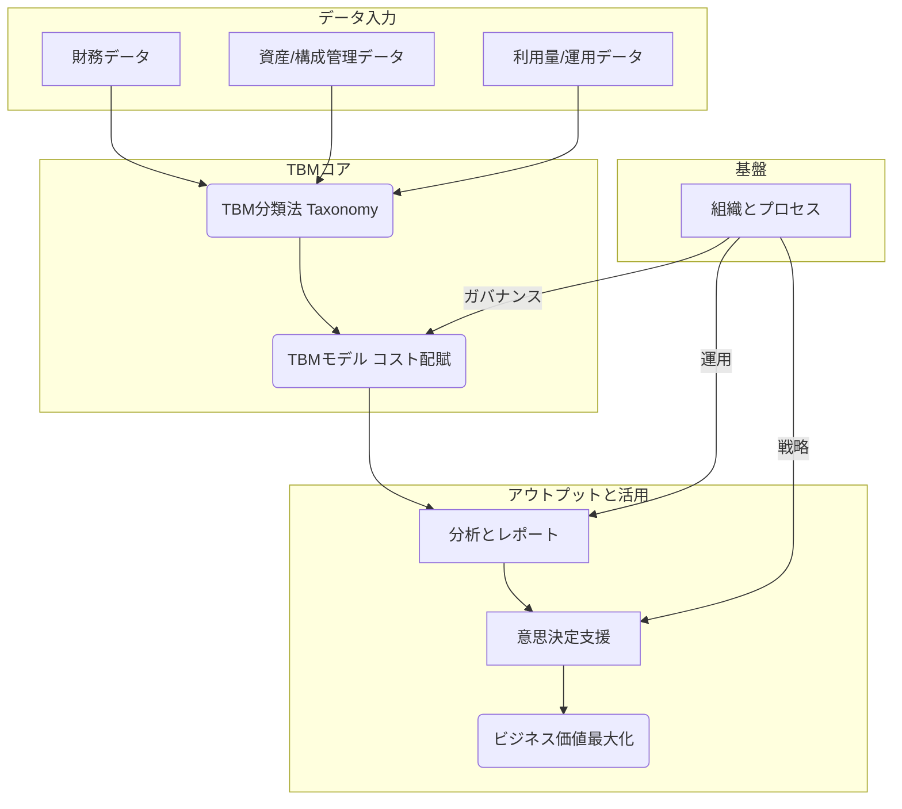
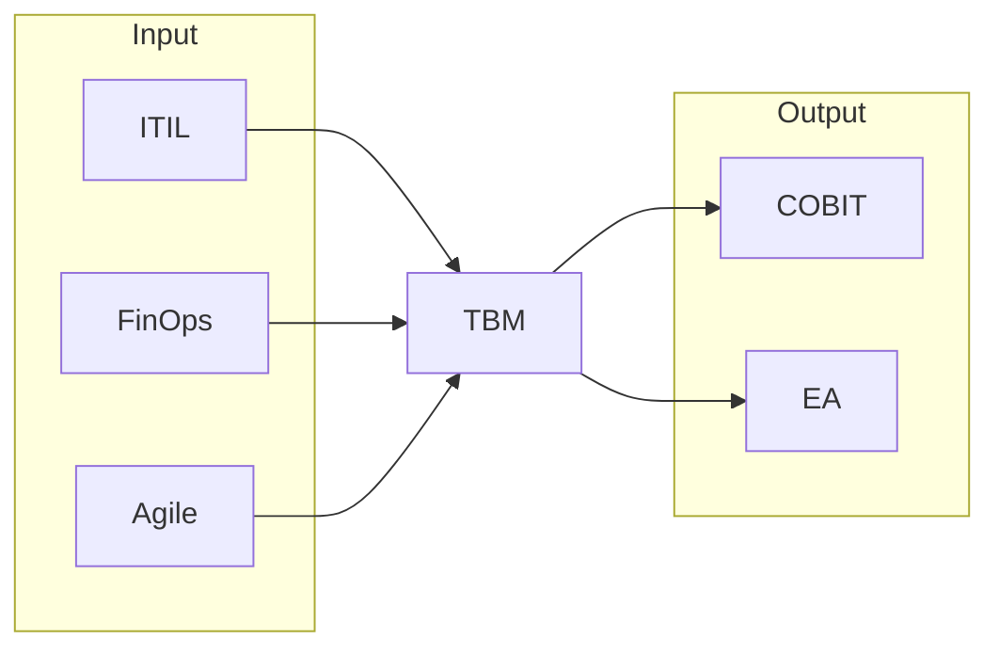

## 第1章 TBMとは何か？：IT価値経営の羅針盤

この章では、TBMが登場した背景にある現代のIT部門が抱える課題から説き起こし、TBMの基本的な定義、目的、そしてそれが組織にもたらす具体的な価値を解説します。また、TBMがどのような構成要素から成り立っているかの全体像を示し、ITILやFinOpsといった他の関連フレームワークとの関係性や位置づけを明確にします。TBMを学ぶ上での基礎固めを行います。

### 1.1 なぜTBMが必要なのか？現代IT部門の課題

現代の多くのIT部門は、以下のような共通の課題に直面しています。

| 課題                           | 説明                                                                         | TBMによる貢献                                                                   |
| :----------------------------- | :--------------------------------------------------------------------------- | :------------------------------------------------------------------------------ |
| **コストのブラックボックス化** | ITにどれだけのコストがかかっているのか、その内訳が不明確。                   | ITコストを標準化された分類に基づき可視化し、透明性を向上させます。              |
| **ビジネス貢献度の不明確さ**   | IT投資が具体的にどのビジネス価値に繋がっているのか説明できない。             | ITコストをビジネスサービスや部門に紐付け、ビジネス貢献度を明確にします。        |
| **経営層との溝**               | ITの専門用語が多く、経営層が理解できる言葉でITの価値やコストを説明できない。 | 共通言語（TBM分類法）を提供し、ビジネス視点でのコミュニケーションを促進します。 |
| **投資判断の属人化**           | 新規IT投資や既存システムの維持判断が、勘や経験に頼りがち。                   | データに基づいた客観的な分析を可能にし、合理的な投資判断を支援します。          |
| **リソース配分の非効率**       | 限られたITリソース（人、モノ、金）が最適に配分されていない可能性がある。     | コストと利用状況を分析し、リソース配分の最適化やコスト削減機会を特定します。    |

これらの課題を解決し、IT部門が単なるコストセンターではなく、ビジネス価値を創出する戦略的パートナーへと変革するために、TBMという経営管理手法が求められています。

### 1.2 TBMの定義、目的、そして提供価値

TBM（Technology Business Management）とは、「**ITコストとパフォーマンスに関する透明性を高め、データに基づいた意思決定を支援することで、IT投資のビジネス価値を最大化するための経営管理フレームワーク**」と定義されます。

**TBMの主な目的**は以下の通りです。

* **ITコストの最適化:** 無駄なコストを削減し、効率的なIT運営を実現します。  
* **IT投資の戦略的整合性確保:** IT投資をビジネス戦略と整合させ、優先順位付けを行います。  
* **ビジネス価値の最大化:** ITがビジネスにもたらす価値を明確にし、その向上を図ります。  
* **ITとビジネスの連携強化:** 共通言語とデータに基づき、IT部門とビジネス部門の対話を促進します。

**TBMが組織にもたらす具体的な提供価値**には、以下のようなものがあります。

* **コスト透明性の向上:** ITコストの内訳を詳細に把握できます。  
* **説明責任の明確化:** 誰が、何のために、どれだけのITコストを使っているかを明確にします。  
* **データ駆動型の意思決定:** 勘や経験ではなく、客観的なデータに基づいてIT関連の意思決定を行えます。  
* **サービスベースのコスト管理:** ITをサービスとして捉え、サービスごとのコストと価値を管理できます。  
* **ベンチマーキングの実現:** 自社のITコストや効率性を業界標準と比較できます。  
* **ショーバック/チャージバックの基盤:** 利用部門へのコスト配賦の根拠を提供します。

### 1.3 TBMフレームワークの全体像

*https://www.apptio.com/blog/safe-and-tbm-accelerating-business-value/ から引用*

- **下から上を目指す:**
  - 「`Position for Value`」（IT部門の提供価値の整理）から出発し、「`Continuously Improve`」（提供価値の継続的な改善）を目指します。
- **活動を推進する4つの規律:**
  - 目標達成に向けた活動は、以下の4つの規律によって推進されます。
    - `Create Transparency`（可視化）
    - `Plan and Govern`（IT予算策定・管理）
    - `Deliver Value for Money`（コスト最適化）
    - `Shape Business Demand`（関係性改善）
- **規律の根幹をなす対話:**
  - 上記4つの規律を効果的に実践するためには、関係者間での「`Value Conversations`」（ビジネス成果をつくる対話）が不可欠です。
  - 対話は、主に以下の2つの観点を持ちます。
    - `Run-the-Business`（運用費の継続的削減）
    - `Change-the-Business`（新規開発投資の最適化）
- **対話を具体化するメトリクス:**
  - データに基づいた有意義な対話を実現するには、以下の4つの主要なメトリクス（TBMメトリクス）を用います。
    - `Run-the-Business`に関するメトリクス:
      - `Cost-for-Performance`（コスト対効果）
      - `Business-Aligned Portfolio`（ビジネスへのアライン）
    - `Change-the-Business`に関するメトリクス:
      - `Investment in Innovation`（イノベーションへの投資）
      - `Enterprise Agility`（変化への対応スピード）
- **メトリクスの前提となる可視化:**
    - これらのメトリクスは、可視化によって算出・提示され、議論の基盤となります。
    - `Create Transparency`（可視化）が最初のステップです。

### 1.4 TBMの構成要素と関係性

ITの価値を管理するための要素群を連携して、TBMフレームワークで定義された活動を実現します。

| 要素名                   | 説明                                                                                                                                                         |
| :----------------------- | :----------------------------------------------------------------------------------------------------------------------------------------------------------- |
| **財務データ**           | 会計システムなどから得られるIT関連の支出データ（人件費、購入費など）。                                                                                       |
| **資産/構成管理データ**  | ハードウェア、ソフトウェア、ライセンスなどの資産情報や、それらの構成情報（CMDB）。                                                                           |
| **利用量/運用データ**    | サーバー稼働率、ストレージ使用量、ネットワークトラフィック、サポートコール数など、ITリソースやサービスの利用状況を示すデータ。                               |
| **TBM分類法 (TBM Taxonomy)**   | ITコストやリソースを標準化された階層構造（コストプール、ITタワー、テクノロジーサービスなど）で分類するための定義体系。共通言語の基盤となる。                 |
| **TBMモデル (コスト配賦)** | 収集・分類されたデータを基に、コストプールからITタワー、テクノロジーサービス、最終的にはビジネスユニットやケイパビリティへとコストを割り当てる計算ロジック。 |
| **分析とレポート**       | TBMモデルによって算出されたコスト情報を、ダッシュボードやレポートを通じて可視化し、分析可能な状態にするプロセス。                                            |
| **意思決定支援**         | 可視化・分析された情報に基づき、コスト最適化、投資判断、予算策定などの意思決定を行うプロセス。                                                               |
| **ビジネス価値最大化**   | TBM活動を通じて達成される最終的な目標。IT投資対効果の向上やビジネス貢献度の向上。                                                                            |
| **組織とプロセス**       | TBMを推進・運用するための体制（TBM Officeなど）、役割、責任、およびデータ収集・モデル更新・レポーティングなどの定常的な業務プロセス。                        |

これらの要素が相互に連携し、データ収集から分析、意思決定、そして価値実現へと繋がるサイクルを形成します。

### 1.5 TBMと関連フレームワーク（ITIL, FinOps等）の位置づけ

TBMは独立したフレームワークですが、他のIT管理フレームワークと連携し、相互に補完し合うことで、より大きな効果を発揮します。

| フレームワーク | 主な焦点                                   | TBMとの関係性                                                                                                                      |
| :------------- | :----------------------------------------- | :--------------------------------------------------------------------------------------------------------------------------------- |
| **ITIL**       | ITサービスマネジメント（プロセス改善）     | ITILプロセス（インシデント管理、構成管理等）から生成されるデータはTBMのインプットとなり、TBMはサービスコストの可視化に貢献。       |
| **FinOps**     | クラウド財務管理（コスト最適化、説明責任） | クラウドコストに特化したTBMとも言える。TBMはオンプレミスを含むIT全体の財務管理をカバーし、FinOpsと連携してハイブリッド環境を管理。 |
| **Agile** | ソフトウェア開発（迅速性、適応性）         | TBMはアジャイル開発チームのコストや、開発した機能のビジネス価値を測定・管理するのに役立つ。                                        |
| **COBIT**      | ITガバナンスと管理（統制、リスク）         | TBMはCOBITが要求するIT投資の価値評価やリソース最適化に関する情報を提供し、ガバナンス強化に貢献。                                   |
| **EA**         | エンタープライズアーキテクチャ             | EAはIT資産の標準化や将来像を描き、TBMはそのコストや価値を評価するためのデータを提供する。                                          |

TBMは、これらのフレームワークが持つプロセスやデータを利用しつつ、特に「ITの経済性・価値」という側面に焦点を当て、経営層やビジネス部門とのコミュニケーションを円滑にするための「共通言語」を提供する点で独自性を持っています。
