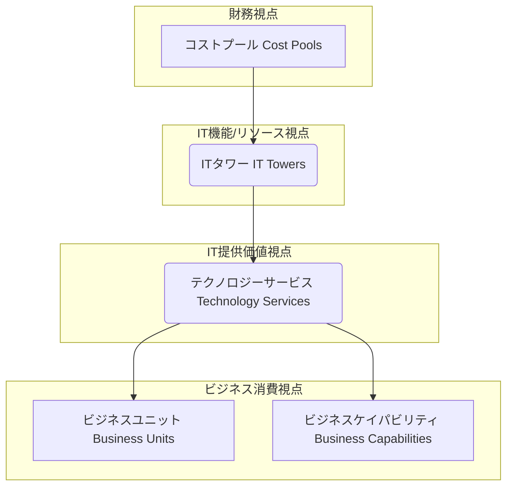
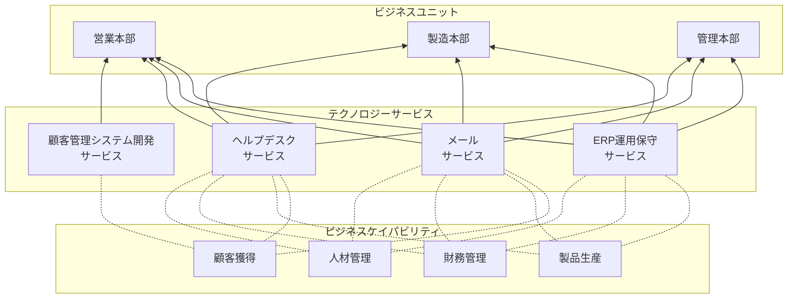

## 第2章 TBMの構造：標準分類法（Taxonomy）を理解する

TBMの中核をなすデータ構造の標準である「TBM分類法（Taxonomy）」について詳しく解説します。なぜ標準化された分類法が必要なのか、その全体的な階層構造を示し、各階層（コストプール、ITタワー、テクノロジーサービス、ビジネスユニット/ケイパビリティ）の定義と役割を具体的に説明します。これにより、ITコストデータを整理し、共通言語で議論するための基盤を理解します。

### 2.1 TBM分類法の重要性と階層構造

TBM分類法は、組織全体でITコストに関する「共通言語」を確立するために不可欠です。これにより、部門間での認識齟齬を防ぎ、データに基づいた客観的な議論が可能になります。リンゴとオレンジを比較するのではなく、同じ基準でITコストを評価できるようになります。

TBM分類法は、一般的に以下のような階層構造を持っています。

| 要素名                     | 説明                                                                                                           |
| :------------------------- | :------------------------------------------------------------------------------------------------------------- |
| **コストプール**           | ITコストの発生源となる財務的な費目。会計システムの勘定科目と連携しやすい。                                     |
| **ITタワー**               | ITインフラやリソースを、技術的な機能グループに分類したもの。IT部門内部のコスト構造を把握するのに役立つ。       |
| **テクノロジーサービス**   | ITタワーのリソースを組み合わせて、ビジネスやユーザーに提供される具体的なITサービス。サービスカタログの基礎。   |
| **ビジネスユニット**       | テクノロジーサービスを利用する組織内の事業部や部門。                                                           |
| **ビジネスケイパビリティ** | 組織が持つ事業遂行能力（例：顧客管理、製品開発）。テクノロジーサービスがどのビジネス能力を支えているかを示す。 |

この階層構造により、財務データ（コストプール）から始まり、IT内部の構造（ITタワー）、ITが提供する価値（テクノロジーサービス）、そして最終的にビジネスへの貢献（ビジネスユニット/ケイパビリティ）まで、コストの流れを一貫して追跡・分析することが可能になります。

### 2.2 コストプール：ITコストの源泉を捉える

コストプールは、財務会計システムから取得される最も基本的なコストデータであり、TBM分類法の出発点です。これにより、ITに関連する全ての支出を網羅的に捉えます。

**主なコストプールの例:**

| コストプール                  | 具体例                                                                       |
| :-------------------------------- | :--------------------------------------------------------------------------- |
| **人件費 (Internal Labor)**       | 正社員・契約社員の給与、賞与、福利厚生費                                     |
| **外部委託費 (Outside Services)** | コンサルティング費用、派遣費用、マネージドサービス費用、開発委託費用         |
| **ハードウェア (Hardware)**       | サーバー、ストレージ、ネットワーク機器、PC、プリンターなどの購入費、リース費 |
| **ソフトウェア (Software)**       | パッケージソフトウェアのライセンス購入費、年間保守費用、SaaS利用料           |
| **設備費 (Facilities)**           | データセンターの賃料、電気代、空調費用                                       |
| **通信費 (Telecom)**              | インターネット回線費用、専用線費用、電話料金                                 |
| **その他 (Other)**                | 旅費交通費、研修費、消耗品費など                                             |

これらのコストプールを正確に把握し、分類することが、後続のITタワーやテクノロジーサービスへのコスト配賦の基礎となります。

### 2.3 ITタワー：ITリソースを機能別に整理する

ITタワーは、ITインフラストラクチャやリソースを、技術的な機能に基づいて分類したものです。IT部門がどのような技術領域にコストを投下しているかを理解するのに役立ちます。

**主なITタワーの例:**

| ITタワー                               | 説明                                                                                                                         |
| :----------------------------------- | :--------------------------------------------------------------------------------------------------------------------------- |
| **データセンター**                   | サーバーやストレージなどを設置・運用する物理的な施設に関連するコスト（スペース、電力、空調など）。                           |
| **ネットワーク**                     | LAN、WAN、インターネット接続、ファイアウォール、ロードバランサーなど、通信インフラに関連するコスト。                         |
| **サーバー**                         | 物理サーバー、仮想サーバーのハードウェア、OS、運用管理に関連するコスト。                                                     |
| **ストレージ**                       | SAN、NASなどの共有ストレージ、バックアップシステムに関連するコスト。                                                         |
| **アプリケーション開発/保守**        | ビジネスアプリケーションの新規開発、機能追加、バグ修正、維持管理に関わる人件費、ツール費用など。                             |
| **エンドユーザーコンピューティング** | PC、ノートPC、モバイルデバイス、プリンター、関連ソフトウェア、ヘルプデスクなど、従業員の業務環境に関連するコスト。           |
| **IT管理**                           | 特定のタワーに直接割り当てられない、IT部門全体の管理・企画・セキュリティ・コンプライアンス活動などに関連する間接的なコスト。 |

コストプールから収集されたデータは、まずこれらのITタワーに割り当てられます。例えば、サーバー購入費は「サーバー」タワーへ、ネットワークエンジニアの人件費は「ネットワーク」タワーへと配賦されます。

### 2.4 テクノロジーサービス：IT部門の提供物を定義する

テクノロジーサービスは、ITタワーのリソースを組み合わせて、ビジネス部門やエンドユーザーに提供される具体的なITサービスを定義・分類したものです。IT部門の「製品カタログ」のようなものであり、ITの価値をサービス単位で示す上で非常に重要です。

**主なテクノロジーサービスの例:**

| ITタワー（構成要素）                       | テクノロジーサービス例              | 説明                                                               |
| :----------------------------------------- | :---------------------------------- | :----------------------------------------------------------------- |
| サーバー, ストレージ, ネットワーク, アプリ | **ERP運用保守サービス**             | 企業の基幹業務システム（ERP）を安定稼働させるためのサービス。      |
| サーバー, ストレージ, ネットワーク, アプリ | **メールサービス**                  | 従業員が利用する電子メールシステムの提供・運用サービス。           |
| エンドユーザーコンピューティング           | **ヘルプデスクサービス**            | PCトラブルやソフトウェア操作に関する問い合わせに対応するサービス。 |
| サーバー, ストレージ, ネットワーク         | **ファイル共有サービス**            | 組織内でファイルを安全に共有・保管するためのサービス。             |
| アプリケーション開発/保守                  | **顧客管理システム開発サービス**    | 新しい顧客管理システムを構築するためのプロジェクトサービス。       |
| ネットワーク                               | **リモートアクセス（VPN）サービス** | 社外から社内ネットワークへ安全に接続するためのサービス。           |
| サーバー, アプリ                           | **Webホスティングサービス**         | 企業のウェブサイトを公開・運用するための基盤サービス。             |

各テクノロジーサービスのコスト（TCO: Total Cost of Ownership）は、それを構成するITタワーのコストを配賦することで計算されます。例えば、「メールサービス」のコストは、関連するサーバー、ストレージ、ネットワーク、ソフトウェアライセンス、運用人件費などを合算して算出されます。

### 2.5 ビジネスへの接続：部門別コストとビジネス価値の紐付け

TBM分類法の最終段階は、テクノロジーサービスのコストを、それを利用するビジネス側（ビジネスユニットやビジネスケイパビリティ）に紐付けることです。これにより、「どのビジネス活動に、どれだけのITコストが貢献しているか」を可視化します。

**紐付けの例:**

| 要素名                     | 説明                                                                                                     |
| :------------------------- | :------------------------------------------------------------------------------------------------------- |
| **テクノロジーサービス**   | IT部門が提供するサービス（例：ERP運用保守）。                                                            |
| **ビジネスユニット**       | サービスを利用する組織部門（例：営業本部、製造本部）。利用量などに基づいてコストが配賦されることが多い。 |
| **ビジネスケイパビリティ** | サービスが支える事業遂行能力（例：顧客獲得、製品生産）。ITがどのビジネス機能に貢献しているかを示す。     |

この紐付けにより、以下のような分析が可能になります。

* 営業本部は、年間でXXX円のITコスト（ERP、メール、ヘルプデスク、顧客管理システム開発）を消費している。  
* 「製品生産」というビジネスケイパビリティは、主にERP運用保守サービスによって支えられており、そのコストはYYY円である。

これにより、ビジネス部門は自らが利用するITサービスのコストを認識し、IT部門は自らの活動がビジネスにどう貢献しているかを具体的に説明できるようになります。

### 2.6 【具体例】分類法を用いたデータ整理のサンプル

架空の企業「ABC商事」のITコストデータを、TBM分類法を用いて整理する簡単な例を示します。

**ステップ1: コストプールの特定**

財務データから、以下のようなIT関連支出が特定されました。

| 勘定科目             | 金額（年間） | コストプール分類 |
| :------------------- | :----------- | :--------------- |
| サーバー購入費       | 500万円      | ハードウェア     |
| A社への開発委託費    | 1,000万円    | 外部委託費       |
| 正社員エンジニア給与 | 2,000万円    | 人件費           |
| データセンター利用料 | 300万円      | 設備費           |
| ERPライセンス費用    | 800万円      | ソフトウェア     |
| ...                  | ...          | ...              |

**ステップ2: ITタワーへの割り当て**

各コストプールを、関連するITタワーに割り当てます。

| コストプール | 金額      | 割り当て先ITタワー                                              |
| :----------- | :-------- | :-------------------------------------------------------------- |
| ハードウェア | 500万円   | サーバー                                                        |
| 外部委託費   | 1,000万円 | アプリケーション開発/保守                                       |
| 人件費       | 2,000万円 | サーバー(50%), ネットワーク(30%), アプリ(20%) ※作業時間等で按分 |
| 設備費       | 300万円   | データセンター                                                  |
| ソフトウェア | 800万円   | アプリケーション開発/保守                                       |
| ...          | ...       | ...                                                             |

**ステップ3: テクノロジーサービスへの割り当て**

ITタワーのコストを、関連するテクノロジーサービスに割り当てます（配賦ロジックは第3章で詳述）。

| ITタワー                  | コスト（仮） | 割り当て先テクノロジーサービス（一部）                                       |
| :------------------------ | :----------- | :--------------------------------------------------------------------------- |
| サーバー                  | 1,000万円    | ERP運用保守(40%), メール(20%), ファイル共有(20%), Webホスティング(10%), ...  |
| ネットワーク              | 600万円      | ERP運用保守(30%), メール(30%), ファイル共有(20%), リモートアクセス(10%), ... |
| アプリケーション開発/保守 | 2,200万円    | ERP運用保守(60%), 顧客管理開発(30%), ...                                     |
| ...                       | ...          | ...                                                                          |

これにより、「ERP運用保守サービス」のコストが、サーバー、ネットワーク、アプリケーション保守などのコストを集計して算出されます。

**ステップ4: ビジネスユニットへの割り当て**

テクノロジーサービスのコストを、利用部門（ビジネスユニット）に割り当てます。

| テクノロジーサービス | コスト（仮） | 利用部門（割り当て例）                                        |
| :------------------- | :----------- | :------------------------------------------------------------ |
| ERP運用保守          | 1,500万円    | 営業本部(30%), 製造本部(50%), 管理本部(20%) ※利用ID数など     |
| メールサービス       | 500万円      | 営業本部(40%), 製造本部(40%), 管理本部(20%) ※メールボックス数 |
| ...                  | ...          | ...                                                           |

この結果、「営業本部はERP運用保守に年間450万円、メールサービスに年間200万円を消費している」といった情報が得られます。

このように、TBM分類法を用いることで、元の財務データが段階的に加工され、最終的にビジネス視点でのコスト情報へと変換されます。
