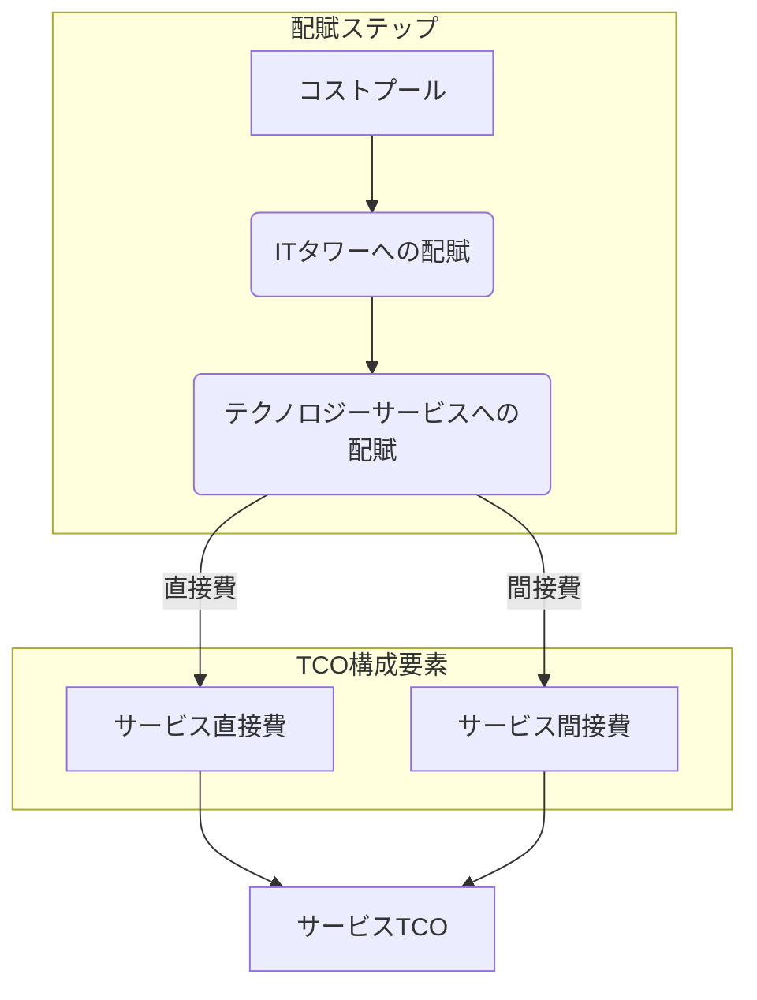

## 第3章 TBMの心臓部：コスト配賦モデルを構築する

収集したデータをTBM分類法に基づいて加工し、コストプールから最終的なビジネス消費単位（サービス、部門、ケイパビリティ）へとコストを割り当てる「コスト配賦モデル」の構築方法について解説します。データ収集の戦略から、配賦ロジックの設計、サービスTCOの計算、そしてモデル構築の実践的なステップまでをカバーします。

### 3.1 TBMモデルの目的と設計思想

TBMにおけるコスト配賦モデルは、単なるコスト計算の仕組みではありません。その主な目的は以下の通りです。

* **透明性の確保:** ITコストがどのように発生し、どのサービスやビジネス活動に使われているかを明確にします。  
* **公平性の担保:** 合理的な根拠に基づき、コストを利用者（サービス、部門）に公平に割り当てます。  
* **説明責任の向上:** 各コストの発生理由と配賦根拠を明確にし、説明責任を果たせるようにします。  
* **意思決定の支援:** サービスごとの正確なコスト（TCO）を算出し、投資判断や価格設定などの意思決定を支援します。

**モデル設計における重要な原則（思想）:**

| 設計原則   | 説明                                                                                                               |
| :--------- | :----------------------------------------------------------------------------------------------------------------- |
| **透明性** | 配賦ロジックは理解しやすく、追跡可能であるべきです。なぜそのコストが割り当てられたのかを説明できる必要があります。 |
| **公平性** | コストの恩恵を受ける主体（サービス、部門）が、そのコストを合理的に負担するように設計します。                       |
| **正確性** | 利用可能なデータと労力のバランスを取りながら、可能な限り実態に近いコスト配賦を目指します。                         |
| **一貫性** | 配賦ルールは明確に定義され、継続的に適用されるべきです。恣意的な変更は避けるべきです。                             |
| **実用性** | モデルの維持・運用にかかる労力が過大にならないよう、シンプルさと自動化を考慮します。                               |
| **柔軟性** | ビジネスや技術の変化に対応できるよう、モデルの修正や更新が比較的容易に行えるように設計します。                     |

完璧なモデルを目指すあまり複雑になりすぎると、維持が困難になったり、関係者の理解を得られなくなったりします。実用性と精度のバランスを取ることが重要です。

### 3.2 データ収集戦略：必要な情報源と品質確保

正確で信頼性の高いコスト配賦モデルを構築するには、質の高いデータが不可欠です。

**主なデータソース:**

| データカテゴリ       | 具体的なデータ例                                                                             | 主な情報源システム例                                    |
| :------------------- | :------------------------------------------------------------------------------------------- | :------------------------------------------------------ |
| **財務データ**       | 勘定科目別支出、資産計上額、減価償却費、部門別経費                                           | ERP、会計システム                                       |
| **資産管理データ**   | ハードウェア資産台帳（サーバー、PC等）、ソフトウェアライセンス台帳                           | 資産管理ツール、構成管理データベース（CMDB）            |
| **構成管理データ**   | サーバーとアプリケーションの関係、ネットワーク構成情報、仮想化環境情報                       | CMDB、仮想化管理ツール                                  |
| **利用量データ**     | CPU使用率、メモリ使用量、ストレージ消費量、ネットワークトラフィック、APIコール数、ログイン数 | 監視ツール、ログ管理ツール、APMツール、クラウド請求明細 |
| **人事データ**       | 従業員情報（所属部門、役職）、工数データ（プロジェクト別、作業別）                           | 人事システム、工数管理ツール                            |
| **契約データ**       | 外部委託契約、リース契約、保守契約、SaaS契約                                                 | 契約管理システム、購買システム                          |
| **サービスカタログ** | 提供しているテクノロジーサービスの一覧、サービス定義                                         | ITSMツール、サービスカタログ管理ツール                  |

**データ収集・品質確保のポイント:**

* **早期のデータ評価:** モデル構築に着手する前に、必要なデータがどこに、どのような形式・品質で存在するかを評価します。  
* **データオーナーシップの明確化:** 各データソースの責任者（データオーナー）を特定し、協力体制を築きます。  
* **自動化の推進:** 手作業によるデータ収集・加工はエラーの元であり、非効率です。可能な限りETLツールなどを活用し、データ連携を自動化します。  
* **データクレンジング:** 不足データ、誤記、重複などを特定し、修正・補完するプロセスを確立します。  
* **定期的なレビュー:** データの鮮度と正確性を維持するため、定期的にデータソースと収集プロセスを見直します。  
* **マスターデータの整備:** サーバー名、アプリケーション名、部門名などのマスターデータを整備し、表記ゆれを防ぎます。

データ品質はTBMの成否を左右する重要な要素です。初期段階で十分な時間と労力をかけることが、後の手戻りを防ぎます。

### 3.3 コスト配賦ロジック：主要な基準と選択のポイント

コスト配賦ロジックは、ある階層（例：コストプール）のコストを、次の階層（例：ITタワー）に割り当てるためのルールです。適切な基準を選択することが、公平で実態に合ったモデル構築の鍵となります。

**主要な配賦基準:**

| 配賦基準                        | 説明                                                                                          | メリット                           | デメリット                                       | 適用例                                                                                 |
| :------------------------------ | :-------------------------------------------------------------------------------------------- | :--------------------------------- | :----------------------------------------------- | :------------------------------------------------------------------------------------- |
| **直接割り当て (Direct)**       | 特定のサービスや部門に直接紐づけられるコスト。                                                | 最も正確で公平。                   | 適用できるコストが限定的。                       | 特定プロジェクト専用のサーバー購入費、特定部門専用のソフトウェアライセンス費。         |
| **利用量ベース (Usage-based)**  | CPU時間、ストレージ容量、ネットワーク帯域、トランザクション数など、実際の利用量に応じて配賦。 | 公平性が高い（使った分だけ負担）。 | 正確な利用量データの収集・測定が必要。           | 共有サーバーコストのサービスへの配賦、ネットワークコストの部門への配賦。               |
| **数量ベース (Unit-based)**     | サーバー台数、PC台数、ユーザー数、メールボックス数など、関連するユニット数に応じて配賦。      | 比較的シンプルで理解しやすい。     | 利用実態と乖離する可能性あり。                   | ヘルプデスクコストのユーザー数での部門配賦、PC関連コストのPC台数での部門配賦。         |
| **固定比率 (Fixed Allocation)** | 事前に定義された固定の割合（例：部門別売上比率、従業員数比率）で配賦。                        | シンプルで計算が容易。             | 実態との乖離が大きい場合、不公平感が生じやすい。 | IT管理部門コストの各ITタワーへの配賦、データセンター共通費用のサーバータワーへの配賦。 |
| **均等割り (Even Spread)**      | 対象となる配賦先全体で均等に割り振る。                                                        | 最もシンプル。                     | 最も公平性に欠ける可能性が高い。                 | 他の基準が適用困難な場合の最終手段（推奨されない）。                                   |

**基準選択のポイント:**

* **因果関係:** コスト発生の原因となる活動やリソース消費に最も近い基準を選びます（例：サーバーコストならCPU利用時間）。  
* **データの利用可能性:** 理想的な基準があっても、そのためのデータが取得できなければ意味がありません。利用可能なデータの中で最も合理的な基準を選択します。  
* **重要性:** コストインパクトが大きい項目には、より精度の高い基準（利用量ベースなど）を適用し、小さい項目にはシンプルな基準（数量ベース、固定比率）を適用するなど、メリハリをつけます。  
* **関係者の納得感:** なぜその基準が選ばれたのかを関係者に説明し、理解と合意を得ることが重要です。

一つの基準に固執せず、コストの種類や性質に応じて複数の基準を組み合わせることが一般的です。

### 3.4 サービスTCO算出プロセス詳解

テクノロジーサービスの総所有コスト（TCO: Total Cost of Ownership）は、そのサービスを提供するために直接・間接にかかる全てのコストを合算したものです。TBMモデルにおける重要なアウトプットの一つです。

**TCO算出の一般的なプロセス:**

| 要素名                           | 説明                                                                                                                                                                                                     |
| :------------------------------- | :------------------------------------------------------------------------------------------------------------------------------------------------------------------------------------------------------- |
| **コストプール**                 | 財務データから得られるIT関連の全支出。                                                                                                                                                                   |
| **ITタワーへの配賦**             | コストプールの費用を、関連するITタワー（サーバー、ネットワーク、ストレージ等）に割り当てる。配賦基準（直接、数量ベース等）を用いる。                                                                     |
| **テクノロジーサービスへの配賦** | 各ITタワーのコストを、それを利用するテクノロジーサービス（メールサービス、ERP運用保守等）に割り当てる。配賦基準（利用量ベース、数量ベース等）を用いる。                                                  |
| **サービス直接費**               | 特定のテクノロジーサービスに直接起因するコスト。例えば、メールサービス専用サーバーの減価償却費、メールソフトのライセンス費、メール担当者の人件費など。                                                   |
| **サービス間接費**               | 複数のサービスで共有されるインフラ（共有ストレージ、ネットワーク機器）や、IT管理部門などの間接部門のコストのうち、当該サービスに割り当てられた部分。ITタワーからの配賦計算によって算出されることが多い。 |
| **サービスTCO**                  | サービス直接費とサービス間接費を合算したもの。そのテクノロジーサービスを提供するための総コストを示す。                                                                                                   |

**算出例（メールサービスTCO）:**

* **直接費:**  
  * メールサーバー減価償却費: 50万円  
  * メールソフトライセンス費: 100万円  
  * メール担当者人件費: 300万円  
* **間接費（配賦されたコスト）:**  
  * 共有ストレージコスト (利用容量ベースで配賦): 80万円  
  * ネットワークコスト (利用帯域ベースで配賦): 60万円  
  * データセンターコスト (サーバーラック数で配賦): 40万円  
  * IT管理部門コスト (サービスコスト比率で配賦): 70万円  
* **メールサービスTCO = (50 + 100 + 300) + (80 + 60 + 40 + 70) = 700万円**

このようにして算出されたサービスTCOは、サービス価格設定、アウトソーシング判断、コスト削減努力の効果測定などに活用されます。

### 3.5 モデル構築のステップとツール活用

コスト配賦モデルを実際に構築する手順は、一般的に以下のステップで進められます。

1. **要件定義:**  
   * モデルの目的、スコープ（対象範囲）、アウトプット（必要なレポート等）を明確にします。  
   * TBM分類法を組織に合わせて定義・確定します。  
2. **データ収集と準備:**  
   * 必要なデータソースを特定し、収集・統合します。  
   * データのクレンジング、フォーマット統一、マスターデータ整備を行います。  
3. **配賦ルールの設計:**  
   * 各階層間（コストプール→ITタワー、ITタワー→テクノロジーサービス、サービス→ビジネスユニット）の配賦基準と計算ロジックを定義します。  
   * 関係者と合意形成を行います。  
4. **モデルの実装（計算実行）:**  
   * 設計した配賦ルールに基づき、実際にコスト計算を実行します。専用ツール、BIツール、あるいはスプレッドシートなどを利用します。  
5. **結果検証と調整:**  
   * 算出された結果（ITタワー別コスト、サービスTCO、部門別コスト）が妥当であるかを確認します。  
   * 異常値や想定外の結果があれば、データや配賦ルールを見直し、調整します。  
6. **文書化:**  
   * TBM分類法の定義、データソース、配賦ルール、計算プロセスなどを文書化し、関係者が参照できるようにします。  
7. **運用プロセス定義:**  
   * データの定期的な更新、モデルのメンテナンス、レポーティングのサイクルなど、定常的な運用プロセスを定義します（第4章で詳述）。

**ツール活用:**

TBMモデルの構築と運用には、多くの場合ツールが活用されます。

| ツール種類           | 主な機能                                                                                                     | 代表的な製品例（一部）         |
| :------------------- | :----------------------------------------------------------------------------------------------------------- | :----------------------------- |
| **TBM専用ツール**    | データ収集・統合、TBM分類法管理、配賦モデル構築・実行、レポーティング、分析機能などを網羅的に提供。          | Apptio, Nicus, ServiceNow ITBM |
| **BIツール**         | データ可視化、レポーティング、ダッシュボード作成に強み。配賦計算は別途行うか、ツールの計算機能を利用。       | Tableau, Power BI, Qlik Sense  |
| **スプレッドシート** | 小規模な導入や初期の試行には利用可能。データ量やモデルの複雑性が増すと、管理やメンテナンスが困難になる傾向。 | Microsoft Excel, Google Sheets |

**ツール選択のポイント:**

* **機能要件:** 自社のTBM要件（モデルの複雑性、必要な分析機能、レポート種類など）を満たせるか。  
* **データ連携:** 既存システム（ERP, CMDB等）とのデータ連携が容易か。  
* **操作性:** モデル設定やレポート作成が直感的に行えるか。  
* **拡張性:** 将来的なスコープ拡大や要件変更に対応できるか。  
* **コスト:** ライセンス費用、導入・維持費用。

ツールの導入は必須ではありませんが、特に中規模以上の組織で本格的にTBMを実践する場合、専用ツールやBIツールの活用が効率性と持続可能性を高めます。

### 3.6 【具体例】シンプルな配賦モデルのケーススタディ

小規模なIT環境を想定し、コストプールからITタワー、サービスへとコストを配賦するシンプルなモデルの構築例をステップバイステップで示します。

**前提:**

* **コストプール:**  
  * サーバー購入費: 100万円  
  * ネットワーク機器購入費: 50万円  
  * エンジニア人件費: 600万円  
  * データセンター費用: 120万円  
* **ITタワー:** サーバー, ネットワーク  
* **テクノロジーサービス:** Webサービス, DBサービス  
* **配賦に必要な情報:**  
  * エンジニア工数: サーバー担当 70%, ネットワーク担当 30%  
  * データセンター利用: サーバー 80%, ネットワーク 20% (スペース比率)  
  * サーバーリソース利用: Webサービス 60%, DBサービス 40% (CPU時間比率)  
  * ネットワークリソース利用: Webサービス 50%, DBサービス 50% (トラフィック量比率)

**ステップ1: コストプール → ITタワーへの配賦**

| コストプール           | 金額    | 配賦基準      | サーバータワーへ | ネットワークタワーへ |
| :--------------------- | :------ | :------------ | :--------------- | :------------------- |
| サーバー購入費         | 100万円 | 直接          | 100万円          | 0円                  |
| ネットワーク機器購入費 | 50万円  | 直接          | 0円              | 50万円               |
| エンジニア人件費       | 600万円 | 工数比率(7:3) | 420万円          | 180万円              |
| データセンター費用     | 120万円 | 利用比率(8:2) | 96万円           | 24万円               |
| **ITタワー合計コスト** |         |               | **616万円**      | **254万円**          |

**ステップ2: ITタワー → テクノロジーサービスへの配賦**

| ITタワー           | コスト  | 配賦基準          | Webサービスへ | DBサービスへ  |
| :----------------- | :------ | :---------------- | :------------ | :------------ |
| サーバータワー     | 616万円 | リソース利用(6:4) | 369.6万円     | 246.4万円     |
| ネットワークタワー | 254万円 | リソース利用(5:5) | 127.0万円     | 127.0万円     |
| **サービスTCO**    |         |                   | **496.6万円** | **373.4万円** |

**結果:**
WebサービスのTCOは **496.6万円**
DBサービスのTCOは **373.4万円**
