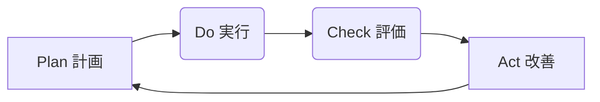

## 第6章 TBMの継続的進化と将来展望

TBMは一度導入したら終わりではなく、継続的に維持・改善し、進化させていく必要がある活動です。この章では、TBMを組織能力として定着させ、長期的に価値を生み出し続けるための仕組みや、今後の技術トレンド（クラウド、AIなど）を踏まえたTBMの将来展望について解説します。

### 6.1 TBMモデルとプロセスの維持・改善サイクル

ビジネス環境、技術、組織は常に変化しています。TBMが提供する情報の正確性と有用性を維持するためには、TBMモデルと関連プロセスを定期的に見直し、改善していく仕組み（PDCAサイクル）が不可欠です。

**維持・改善サイクルの例 (PDCA):**

| フェーズ     | 活動内容                                                                                                                                                                                                                                                                                                                                                                                                                                                                                                                                                              |
| :----------- | :-------------------------------------------------------------------------------------------------------------------------------------------------------------------------------------------------------------------------------------------------------------------------------------------------------------------------------------------------------------------------------------------------------------------------------------------------------------------------------------------------------------------------------------------------------------------- |
| Plan (計画)  | \* **現状評価:** 現在のTBMモデル（分類法、配賦ルール）、データ品質、運用プロセス、レポート内容、関係者の満足度などを評価し、課題や改善点を特定する。  * **情報収集:** 組織変更、新規事業、新しい技術導入、ビジネス戦略の変更など、TBMに影響を与える可能性のある情報を収集する。   * **改善目標設定:** 特定された課題に基づき、次期サイクルでの改善目標（例: 新しいサービスの分類法への追加、配賦ロジックの見直し、データ収集の自動化率向上）を設定する。   * **改善計画策定**: 目標達成のための具体的なアクションプラン、担当者、スケジュールを策定する。 |
| Do (実行)    | * 計画に基づいて、TBMモデルの修正、データソースの変更、運用プロセスの改善、レポートの改修などを実施する。 * 必要に応じて、関係者への説明やトレーニングを行う。                                                                                                                                                                                                                                                                                                                                                                                                    |
| Check (評価) | * 改善策実施後のTBMモデルの計算結果やレポート内容が、意図した通りになっているか、正確性や妥当性が向上したかを確認する。 * 改善目標が達成されたかを評価する。  * 関係者からのフィードバックを収集する。                                                                                                                                                                                                                                                                                                                                                        |
| Act (改善)   | \* 評価結果に基づき、さらなる改善が必要な点があれば、次回のPlanフェーズに繋げる。 * 効果のあった改善策は標準プロセスとして定着させる。 * 変更内容を文書化し、関係者に周知する。                                                                                                                                                                                                                                                                                                                                                                               |

**ガバナンス体制の重要性:**

このPDCAサイクルを効果的に回すためには、TBMに関する意思決定（分類法の変更承認、配賦ルールの変更承認など）を行い、標準を維持・管理するための**ガバナンス体制**が重要です。TBM Officeや関連部門の代表者で構成される運営委員会などを設置し、定期的にレビューを行うことが考えられます。

### 6.2 TBM Officeの役割と求められるスキルセット

TBMを組織に定着させ、継続的に価値を生み出すためには、その推進と運用を専門的に担う組織、いわゆる**TBM Office**の設置が非常に有効です。

**TBM Officeの主な役割:**

* **TBM戦略の策定と推進:** 組織全体のTBM戦略を立案し、導入・定着化をリードする。  
* **標準化とガバナンス:** TBM分類法、配賦モデル、プロセス、レポートなどの標準を定義・維持し、一貫性を保つためのガバナンスを行う。  
* **モデル構築と運用:** コスト配賦モデルの設計、構築、テスト、および定期的な更新・メンテナンスを行う。  
* **データ管理:** 必要なデータの特定、収集プロセスの管理、データ品質の維持・向上を担う。  
* **レポーティングと分析:** ステークホルダー向けのレポートやダッシュボードを作成・提供し、データ分析を通じて洞察を提供する。  
* **ツール管理:** TBMツールの運用管理、ユーザーサポート、ベンダーとの連携を行う。  
* **コミュニケーションとトレーニング:** TBMの価値や活用方法について組織内に啓発し、関係者へのトレーニングを提供する。  
* **ステークホルダー連携:** IT部門、財務部門、ビジネス部門など、関連するステークホルダーとの連携を調整し、協力関係を構築する。  
* **継続的改善:** TBMプロセス全体の有効性を評価し、継続的な改善活動を推進する。

**TBM Officeメンバーに求められるスキルセット:**

TBM Officeは、多様なスキルを持つメンバーで構成されることが理想的です。

| スキルカテゴリ                 | 具体的なスキル・知識                                                                                                                         |
| :----------------------------- | :------------------------------------------------------------------------------------------------------------------------------------------- |
| **財務・会計知識**             | 勘定科目、コスト計算、予算管理、減価償却、財務分析など、基本的な財務会計の知識。                                                             |
| **IT知識**                     | ITインフラ（サーバー、ネットワーク、ストレージ）、アプリケーション、クラウドサービス、ITサービスマネジメント（ITILなど）に関する幅広い知識。 |
| **データ分析スキル**           | データ収集・加工、統計分析、可視化、モデリングなどのスキル。SQL、Excel、BIツール、統計ソフトなどの利用経験。                                 |
| **TBM知識**                    | TBMフレームワーク（分類法、モデル、プロセス）、関連ツール（Apptioなど）に関する専門知識。                                                    |
| **ビジネス理解力**             | 自社のビジネスモデル、事業戦略、各部門の業務内容を理解し、ITコストとビジネス価値を結びつけて考える能力。                                     |
| **コミュニケーション能力**     | 複雑な情報を分かりやすく説明する能力、関係部署と円滑に交渉・調整する能力、プレゼンテーション能力。                                           |
| **プロジェクト管理能力**       | TBM導入・改善プロジェクトを計画・実行・管理する能力。                                                                                        |
| **チェンジマネジメントスキル** | 組織変革を推進し、関係者の抵抗に対応しながら新しいプロセスや文化を定着させるスキル。                                                         |

必ずしも一人が全てのスキルを持つ必要はなく、チームとしてこれらのスキルを補完し合うことが重要です。外部コンサルタントの活用も有効な場合があります。

### 6.3 クラウド、AI時代におけるTBMの進化

クラウドコンピューティングやAI（人工知能）といった新しい技術トレンドは、TBMの実践にも大きな影響を与え、その進化を促しています。

* **クラウドコンピューティングとFinOps:**  
  * **影響:** クラウドの利用拡大により、従量課金ベースの変動費が増加し、コスト管理の複雑性が増しています。オンデマンドでリソースを調達できる反面、無駄遣い（リソースの消し忘れ、過剰なスペック選択など）のリスクも高まります。  
  * **進化/連携:** クラウドコスト管理に特化したフレームワークである**FinOps**との連携が重要になります。TBMはIT全体のコストと価値を管理する広い視点を持ち、FinOpsはクラウドのコスト最適化と説明責任に焦点を当てます。両者を連携させることで、オンプレミスとクラウドを含むハイブリッド環境全体のIT価値経営を実現します。TBMツールも、主要なクラウドプロバイダー（AWS, Azure, GCP）の請求データを詳細に取り込み、分析・最適化提案を行う機能を強化しています。  
* **AI/機械学習の活用:**  
  * **影響:** AI/機械学習技術は、TBMの様々なプロセスを高度化・自動化する可能性を秘めています。  
  * **進化/活用例:**  
    * **コスト異常検知:** 過去のコストデータパターンを学習し、通常とは異なるコストの急増や異常値を自動的に検知してアラートを出す。  
    * **コスト予測精度向上:** 過去の利用量や季節変動などを考慮し、より精度の高い将来のコスト予測を行う。  
    * **配賦ロジックの最適化:** 複雑なデータから、より実態に近い最適な配賦基準やパラメータをAIが提案する。  
    * **コスト削減機会の自動提案:** 大量のデータを分析し、人間では気づきにくいコスト削減や最適化の機会（例: 最適なインスタンスタイプの推奨、ライセンス最適化の提案）を自動的に発見・提示する。  
    * **自然言語によるレポート問い合わせ:** 「先月の営業部のクラウド費用は？」といった自然言語での問いに対して、AIが関連データを分析し、回答やレポートを生成する。  
* **データ連携と自動化の深化:**  
  * API連携などを活用し、ERP、CMDB、監視ツール、クラウド請求システム、人事システムなど、様々なソースからのデータ収集・統合をよりシームレスかつリアルタイムに近づける動きが進んでいます。これにより、データ準備にかかる工数が削減され、より迅速な分析と意思決定が可能になります。  
* **ビジネス価値評価の高度化:**  
  * 単なるコスト可視化に留まらず、IT投資がもたらすビジネス成果（売上向上、顧客満足度向上、リスク低減など）を定量・定性的に測定し、ITコストと紐付けて評価する取り組みがより重要になります。TBMデータを他のビジネスKPIデータと組み合わせた分析が進むと考えられます。

これらの技術進化を取り込みながら、TBMはよりデータ駆動型で、予測的、かつ自動化された経営管理フレームワークへと進化していくと考えられます。

### 6.4 TBM導入効果測定とROI評価

TBM導入には、ツール費用、コンサルティング費用、内部リソース工数など、相応の投資が必要です。そのため、導入によってどのような効果が得られたのか、投資に見合う価値があったのか（ROI: Return on Investment）を評価し、経営層や関係者に報告することが重要です。

**効果測定の対象:**

TBM導入効果は、定量的なものと定性的なものに分けられます。

* **定量的効果（測定可能な数値）:**  
  * **コスト削減額:** サーバー統合、ライセンス最適化、不採算サービス廃止などによって削減されたITコスト。  
  * **運用効率向上:** データ収集・レポート作成時間の短縮、手作業によるミスの削減などによる工数削減効果。  
  * **予算精度向上:** 予算と実績の乖離率の改善。  
  * **意思決定スピード向上:** IT投資判断にかかる時間の短縮。  
  * **リソース利用率向上:** サーバー、ストレージなどのインフラ利用率の改善。  
* **定性的効果（数値化しにくいが重要な効果）:**  
  * **コスト透明性の向上:** ITコスト構造に対する理解度の向上。  
  * **ITとビジネスの連携強化:** 共通言語によるコミュニケーションの円滑化、相互理解の深化。  
  * **データ駆動型文化の醸成:** 勘や経験ではなく、データに基づいて議論・意思決定を行う文化の浸透。  
  * **ガバナンス強化:** IT投資プロセスやコスト管理プロセスにおける統制レベルの向上。  
  * **従業員の意識向上:** ITコストに対する従業員の当事者意識の向上。  
  * **ビジネス部門の満足度向上:** ITサービスの価値やコストに対する納得感の向上。

**ROI評価の考え方:**

ROIは、一般的に以下の計算式で算出されます。

**ROI (%) \= (導入効果額 - 導入コスト) / 導入コスト × 100**

* **導入効果額:** 上記の定量的効果（特にコスト削減額や効率向上による人件費削減効果など）を金額換算して合算します。定性的効果も可能な範囲で金額換算を試みるか、重要な付加価値として別途記述します。効果は単年度だけでなく、複数年度にわたって評価することが一般的です。  
* **導入コスト:** TBMツールライセンス費、導入支援コンサルティング費、ハードウェア費、内部の人件費（プロジェクト期間中）などを合算します。

**評価のポイント:**

* **ベースラインの設定:** TBM導入前の状況（コスト、効率、プロセスなど）を測定し、比較の基準（ベースライン）を設定します。  
* **測定期間:** 効果が表れるまでには時間がかかるため、導入後1年、3年といった期間で効果を測定・評価します。  
* **効果の特定:** 測定された効果が、本当にTBM導入によるものなのか、他の要因（景気変動、別施策の効果など）の影響はないかを慎重に見極める必要があります。  
* **定性効果の重要性:** ROIの数値だけでなく、定性的な効果も合わせて報告することで、TBMの多面的な価値を示すことができます。アンケート調査などで関係者の認識変化を測定するのも有効です。  
* **継続的な測定と報告:** 一度だけでなく、定期的に効果測定とROI評価を行い、TBM活動の価値を継続的に示していくことが、経営層の支持を得て活動を維持・発展させる上で重要です。

TBM導入効果を明確に示すことは、TBM活動の正当性を証明し、さらなる投資や改善活動への支持を得るための鍵となります。
