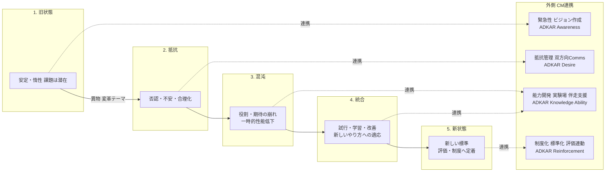
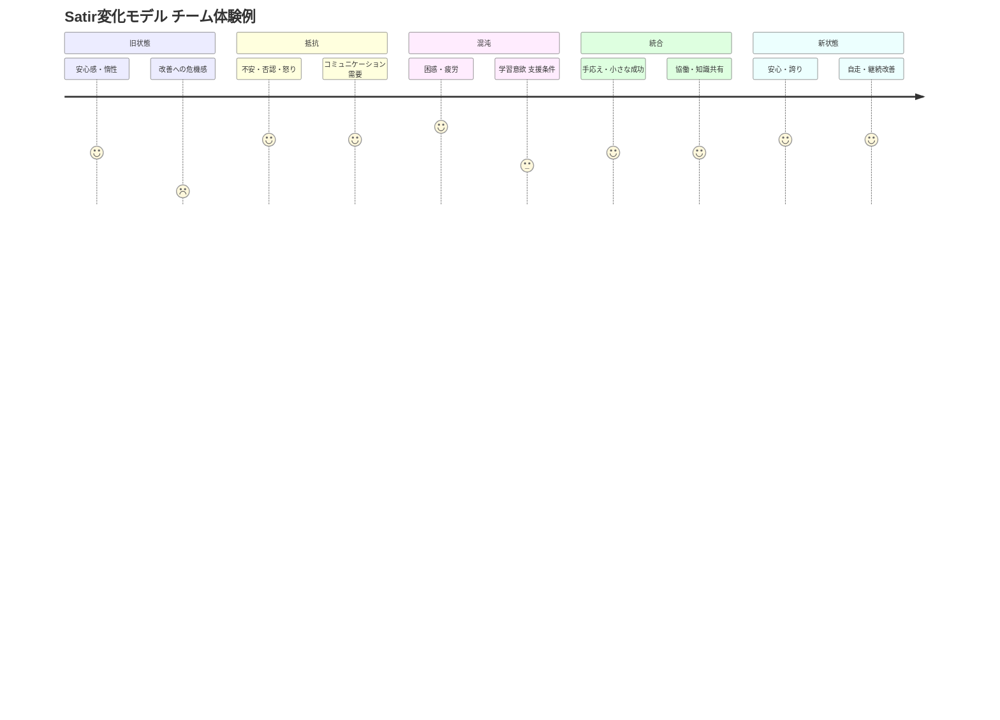

Satir変化モデルは、個人やグループが既存の状態から新しい状態へ移行する際に経験する典型的なステージを描きます。Steven M. Smithは、各ステージが「感じ方・考え方・機能・パフォーマンス・身体反応」に影響を与えるとしています。

このモデルは、変化を「混乱する出来事」としてではなく、段階を踏んで進むプロセスとして捉えるために役立ちます。

-----

## 5つのステージ

Smithの整理に基づき、5つのステージを説明します。

1.  **後期既状態 (Late Status Quo)**
    変化が起きる前の慣れた安定した状態です。関係性、ルール、行動パターンが定着し、人々は現状を「いつものこと」と認識します。安定していても、最適や健康的な状態とは異なる場合があります。改善の余地を抱える場合もあります。

2.  **抵抗 (Resistance)**
    何か「異質な要素」が入り、既存の安定構造が揺らぎ始めます。グループや個人が「これまで通りでよい」と考え、否定、回避、責任転嫁などで反応します。この段階では気づきが生まれにくい状態です。反発や混乱の前兆が現れます。

3.  **混沌 (Chaos)**
    安定構造が破られ、以前の反応や行動が通用しなくなります。関係性、期待、役割が失われ、アイデンティティや帰属感が揺らぎます。この時期、パフォーマンスが落ちます。不安や動悸など身体症状が出ることもあります。

4.  **統合 (Integration)**
    新しい考え方や行動様式を試し、学び、慣れていく段階です。混乱期を経て、「このように変わればうまくいく」という感覚をつかみ始めます。支援があり、安心できる環境が重要です。この段階を無理に飛ばしたり、短絡的に進めたりすると、後戻りや失敗をしやすくなります。

5.  **新しい既状態 (New Status Quo)**
    新しい状態が定着し、変化が「当たり前」になった段階です。以前の状態よりも高い安定、能力、関係性を持つことを目指します。

-----

## 活用・注意ポイント

  * このモデルは組織の変革、人材育成、チーム開発など「変化を扱う場」で広く応用されます。
  * 特に「混沌」の段階の軽視や省略が、変革失敗の一因になります。
  * 変化モデルであるため、ステージは直線的に進むとは限りません。ステージ間を戻る場合もあります。

-----

## Satir変化モデルとチェンジマネジメントの比較と実践

Satir変化モデルを、一般的なチェンジマネジメント（CM）の枠組み（KotterやADKARなど）と比較し、ビジネス変革における実践的な活用方法をまとめます。

### 1\. モデルの位置づけ

**表1：モデルの位置づけ比較**

| 観点 | Satir変化モデル | 一般的なチェンジマネジメント |
| :--- | :--- | :--- |
| フォーカス | 人間の内的変化プロセス（心理・感情） | 組織的プロセス（計画・実行・定着） |
| 主な目的 | 個人・チームの変化受容、学習、再安定化の支援 | 組織的変化を成功に導く戦略とマネジメント |
| 中心概念 | 感情の波・混沌の通過・新しい安定の形成 | 意識の醸成 → 能力形成 → 定着（例: ADKAR） |
| 強み | 変化の人間的リアリティの取り扱い | 変化を計画・管理する構造の提供 |

-----

### 2\. 5段階とチェンジマネジメントへの対応

**表2：5段階とチェンジマネジメントの対応**

| Satir変化モデル | 感情・行動の特徴 | 対応するChange Mgmtステージ | 実務でのポイント |
| :--- | :--- | :--- | :--- |
| ① 旧状態 | 安定、慣習、惰性。改善余地の潜在化。 | “現状認識”フェーズ（Kotter①緊急性の訴求） | データやストーリーによる「最適ではない現状」の提示。問題の可視化。 |
| ② 抵抗 | 否定、不安、防衛。「変えたくない」という反応。 | “抵抗管理”“ステークホルダー分析” | 抵抗を自然な反応として許容する心理的安全性の確保。傾聴と共感。小さな成功体験の設計。 |
| ③ 混沌 | 混乱、方向喪失、パフォーマンス低下。 | “移行期マネジメント”（Bridgeモデルに類似） | 一時的な生産性低下を織り込んだ計画。伴走型のコーチングやメンタリングの強化。 |
| ④ 統合 | 新しい行動・考え方の試行錯誤。 | “能力開発”“実践フェーズ”（ADKARのK/R） | 試行を支援する「安全な実験場」の提供。学習・共有・改善のループの実行。 |
| ⑤ 新しい状態 | 新しい価値観・行動の定着と安定化。 | “定着フェーズ”（Kotter⑧定着） | 新しいやり方の標準業務・評価制度・ナレッジベースへの組み込み。成功の祝福。 |

-----

### 3\. ビジネス変革での実践ポイント

#### A. 変化の「感情曲線」の見える化

Satirモデルを「チームの温度計」として活用し、各フェーズにいる人の割合を観察します。チェンジマネジメントは進捗KPIに注目しがちです。一方、Satirモデルは「混乱期」を正常な現象として明示し、心理的安定を保ちます。

**ツール例**

  * チェンジマネジメント進捗ボード（KPI/CSF）＋Satirステージ列
  * 定例会での「いま自分たちはどのステージか」の共有・言語化

#### B. 「混沌」を乗り越える支援策の組み込み

組織変革は、混乱期のマネジメント不足が頓挫の原因になります。Satirモデルを適用し、「混沌は成長前の必要過程」と捉えます。

**実践例**

  * プロジェクト計画への「Chaosバッファ期間」（試行錯誤の想定期間）の明記
  * 社内トレーナーやコーチのアサインによる感情的反応の受け皿作り
  * リーダー研修での「変化曲線における支援方法」の共有

#### C. チェンジマネジメント（外側）とSatirモデル（内側）の使い分け

以下の表のように、管理・分析（外側）と感情・行動支援（内側）で使い分けます。

| 層 | 管理・分析 | 感情・行動支援 |
| :--- | :--- | :--- |
| 外側（構造） | ADKAR / Kotter / PMI Change Framework | 進捗・組織設計・コミュニケーション計画 |
| 内側（心理） | Satir Change Model | 感情・関係性・行動変容の理解と支援 |

両者を補完関係として設計します。チェンジマネジメントは「変化をデザインする計画」、Satirモデルは「変化を乗り越える体験設計」です。

#### D. 応用シナリオ

**表3：ビジネス変革文脈での応用シナリオ**

| シナリオ | Satirモデルの適用ポイント |
| :--- | :--- |
| DX推進・新システム導入 | Chaos期を想定したトライアル環境と伴走サポートの提供。抵抗期での「成功ストーリー」の共有。 |
| 組織再編・リーダー交代 | 抵抗期〜混沌期における「関係再構築ワークショップ」の設計。信頼回復の優先。 |
| アジャイル変革 | 混沌を“学習サイクル”として扱う文化形成。チームごとの統合期への支援。 |
| サービスデザイン導入 | Chaos期での「体験プロトタイプ」の安全な試行。学習の共有を通じた新しい安定の形成。 |

-----

### 4\. まとめ：Satirモデルの戦略的価値

**表4：Satirモデルの戦略的価値**

| 観点 | 要約 |
| :--- | :--- |
| 目的 | 変革に伴う心理的プロセスのマネジメント |
| 活用場面 | DX推進・文化変革・アジャイル導入・M\&A後統合など |
| メリット | 感情的抵抗を自然なプロセスと受容。変化耐性の向上。 |
| 推奨組み合わせ | 外側：ADKAR / Kotter / Prosci など 内側：Satir / Kübler-Ross / SCARF など |
| 成果 | 「変化の押し付け」から「変化の共同体験と成長」への転換 |

-----

## 図解と実務対応

Satirモデルとチェンジマネジメントの連携フロー、および感情のジャーニーを図解します。

### 図1：Satir × Change Management 連携フロー

**表5：図1の要素説明**

| 要素名 | 説明 |
| :--- | :--- |
| A | 安定・惰性 課題は潜在 |
| B | 否認・不安・合理化 |
| C | 役割・期待の崩れ 一時的性能低下 |
| D | 試行・学習・改善 新しいやり方への適応 |
| E | 新しい標準 評価・制度へ定着 |
| K1 | 緊急性 ビジョン作成 ADKAR Awareness |
| K2 | 抵抗管理 双方向Comms ADKAR Desire |
| K3 | 能力開発 実験場 伴走支援 ADKAR Knowledge Ability |
| K4 | 制度化 標準化 評価連動 ADKAR Reinforcement |

-----

### 図2：感情・体験ジャーニー（混沌期の共通認識化）

この図は、定例会議などで「今どの段階か」を言語化するために使います。特に、混沌期の一時的な生産性低下を許容する合意形成に役立ちます。

-----

### 表6：実務での要点（Satir × Change Mgmt 対応）

| Satir段階 | 目的 | 主な介入（Change Mgmt連携） | 成果物/アセット | 指標（例） |
| :--- | :--- | :--- | :--- | :--- |
| ① 旧状態 | 課題の共有と解像度向上 | 変革の必然性（ビジネスケース、北極星KPI）の提示。現状診断。 | Burning Platform資料。As-Is/To-Be分析。ステークホルダー分析。 | 緊急性の理解率。危機感サーベイ。現状KPIベースライン。 |
| ② 抵抗 | 情緒の受容と合意形成 | 双方向コミュニケーション。抵抗マップ。ストーリーテリング。小勝利設計。 | FAQ/反論ハンドブック。タウンホール。スポンサー計画。 | 反対論点の収束速度。参加率。D（Desire）スコア。 |
| ③ 混沌 | 安全な実験と伴走による谷の短期化・浅化 | “Chaosバッファ”の計画への明記。実験場(Sandbox)。コーチ/SME伴走。負荷調整。 | 実験カタログ。リスク・エスカレーション手順。サポート窓口。 | 生産性低下幅/期間。問い合わせSLA。学習共有件数。 |
| ④ 統合 | 新行動の習慣化 | 標準手順化。OJT/ラーニングパス。コミュニティ運営。振り返り(KPT)。 | SOP/プレイブック。ナレッジ記事。実践コミュニティ。 | 新手順遵守率。リリース健全性。能力アセスメント合格率。 |
| ⑤ 新状態 | 定着と強化 | 人事制度/評価連動。可視化ダッシュボード。成功の祝福。 | KPIダッシュボード。評価項目改定。表彰制度。 | To-Be KPI達成率。離反率低下。Reinforcement指標。 |

-----

## 運用のコツ

  * **混沌の設計**：計画への「Chaosバッファ（期間・支援体制・SLA）」の組み込み。
  * **二層での設計**：外側（ADKAR/Kotterによる進捗管理）と内側（Satirによる感情・学習設計）。
  * **継続的な可視化**：ステージ自己申告とKPIダッシュボードによる「心理と成果」の同時確認。
